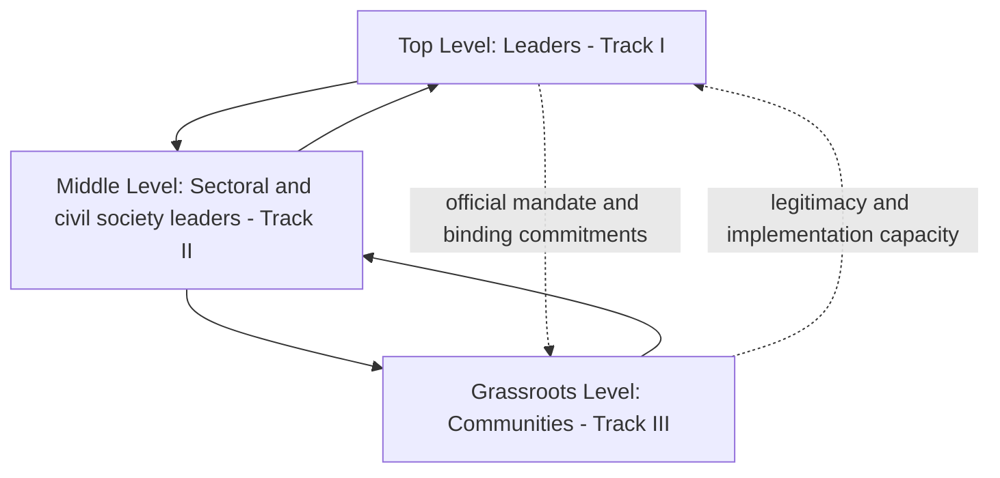
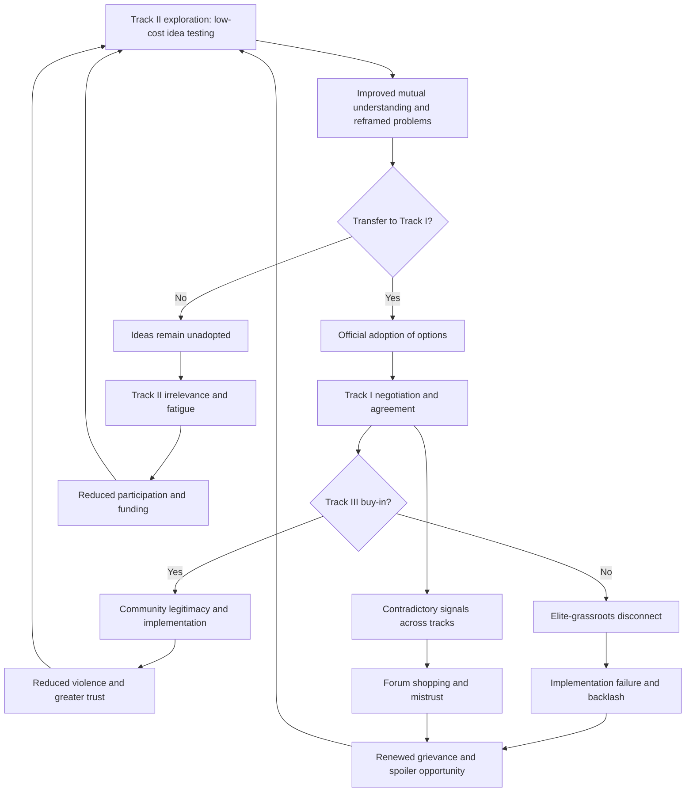

## Track I, Track II, and Track III Diplomacy Coordination


### Scope and Framing

This item treats multi-track diplomacy as a **coordination architecture**: a layered system of official, unofficial, and grassroots channels that operate at different levels of society, hold different kinds of authority, and produce different kinds of outputs. The analytical question is: how do the tracks differ in what they can *do*, how can information, legitimacy, and commitments flow between them, and what coordination failures (duplication, contradiction, spoiler exploitation, capture) arise when they operate without deliberate design?

**Key Points**

- The tracks are distinguished primarily by **authority to commit** and **level of society engaged**, not by importance. Each track supplies something the others structurally cannot.
- Track I holds **binding authority but low flexibility**. Track II holds **flexibility but no authority**. Track III holds **legitimacy and implementation capacity at the community level** but limited access to decision-makers.
- Coordination is fundamentally an **information-and-legitimacy transfer problem**: ideas and trust generated in low-commitment settings must be converted into high-commitment decisions without losing fidelity or triggering defection.
- Poorly coordinated tracks can **undermine each other**: parallel processes may create forum-shopping, contradictory signals, and opportunities for spoilers.
- Evidence that unofficial tracks causally improve official outcomes is suggestive but hard to isolate from confounders [Unverified as settled].

**Definitions on first use**

- **Track I diplomacy**: official, government-to-government (or government-to-armed-group) negotiation conducted by actors with formal authority to bind their principals.
- **Track II diplomacy**: unofficial, informal interaction among non-officials (academics, retired officials, civil society leaders, former negotiators) intended to explore options, reframe problems, and build relationships without committing governments.
- **Track III diplomacy**: grassroots, people-to-people peacebuilding operating at community and local levels, including dialogue groups, local mediation, and civil society initiatives.
- **Track 1.5 diplomacy**: hybrid processes in which officials participate in an unofficial capacity alongside non-officials, blurring the Track I/II boundary.
- **Multi-track diplomacy**: a framework (associated with Louise Diamond and John McDonald) that extends the taxonomy to additional channels such as business, religion, media, education, and activism, treating peacemaking as an interacting system of tracks.
- **Authority to commit**: the capacity of a participant to make promises that bind a principal and are enforceable through that principal's institutions.
- **Deniability**: the property that participation in an unofficial process does not constitute official recognition or commitment.
- **Transfer (or "transfer problem")**: the challenge of moving insights, relationships, and proposals generated in one track into another where they can influence decisions or behavior.
- **Insider-partial versus outsider-neutral**: a distinction between third parties embedded in the conflict community (trusted for local knowledge and legitimacy) and those external to it (trusted for impartiality).

---

### The Track Taxonomy

#### Comparative Structure

| Dimension | Track I | Track II | Track III |
| --- | --- | --- | --- |
| **Participants** | Officials, heads of state, official delegations, armed group leadership | Academics, former officials, think-tank experts, NGO leaders | Community leaders, local civil society, grassroots groups, ordinary citizens |
| **Authority to commit** | High (binding) | None or informal | None at the state level; local commitments possible |
| **Flexibility** | Low (constrained by mandates, publicity, domestic politics) | High | High within community, low toward elites |
| **Deniability** | Low | High | Not applicable (usually public and local) |
| **Primary outputs** | Agreements, treaties, ceasefires | Ideas, frameworks, relationships, reframed problems | Trust, local reconciliation, social cohesion, implementation support |
| **Primary risk** | Positional lock-in, audience costs | Irrelevance, lack of transfer | Fragmentation, co-optation, low elite influence |
| **Time horizon** | Negotiation windows | Medium-term exploration | Long-term social change |

These categories are **ideal types**. Real actors and processes may span tracks, and scholarly classification varies. Some frameworks treat Track III as a distinct grassroots tier, while others merge it with Track II or reserve "Track II" for the full non-official domain [terminology varies across sources].

#### The Pyramid Framing

A common representation places the tracks in a layered structure corresponding to societal level, associated with John Paul Lederach's model of peacebuilding actors:

- **Top level**: senior political and military leaders (Track I)
- **Middle level**: respected sectoral, ethnic, religious, and intellectual leaders, and NGO figures (largely Track II)
- **Grassroots level**: local leaders, community organizers, and ordinary people (Track III)

Lederach's contribution is the argument that the **middle-level actors** occupy a strategic position: they have access both upward to elites and downward to communities, making them potential **connectors** across the pyramid. This is a hypothesis about coordination leverage, and the strength of the empirical support varies by context [interpretation varies].



---

### What Each Track Can and Cannot Do

#### Track I: Binding Authority

**Capabilities**: conclude formal agreements, mobilize state resources, offer guarantees and incentives, authorize security arrangements, and make commitments enforceable through state institutions.

**Structural limitations**:

- **Audience costs**: public positions create reputational penalties for concession. Recall that audience costs are the domestic political penalties a leader incurs for backing down from a publicly stated position, which make flexibility expensive.
- **Positional bargaining pressure**: official mandates and public posture tend to lock parties into stated positions.
- **Recognition constraints**: engaging certain actors (for example, armed groups designated as terrorist organizations) may be legally or politically prohibited.
- **Information constraints**: officials may lack candid insight into the other side's underlying interests when communication is formalized.

#### Track II: Exploration Without Commitment

**Capabilities**: explore options without political cost, test ideas, clarify interests, reframe problems, humanize the adversary, and develop **joint analysis**. Facilitated workshops (associated with problem-solving workshop methodology developed by scholars such as John Burton and Herbert Kelman) are a prominent form.

**Mechanism**: because participants cannot commit their governments, the **cost of exploring concessions is low**. This lowers the barrier to disclosing interests and to floating proposals that would be politically costly in an official setting.

**Structural limitations**:

- **No authority to bind**: outputs are non-binding and depend on transfer to have effect.
- **Transfer failure**: insights may not reach decision-makers, or may be dismissed when they do.
- **Selection bias**: participants may be those already inclined toward compromise, limiting the representativeness of conclusions (the "preaching to the converted" problem).
- **Representativeness and legitimacy**: participants may lack standing within their communities.
- **Deniability abuse**: parties may use Track II to gather intelligence or stall.

#### Track III: Grassroots Legitimacy and Implementation

**Capabilities**: build trust and relationships across communities, address local grievances, support reconciliation, create **social conditions that sustain a settlement**, and provide implementation capacity that formal agreements often lack.

**Mechanism**: an agreement reached at the top is fragile if communities do not accept it. Track III activity can supply the **social legitimacy and local buy-in** that agreements require to be implemented.

**Structural limitations**:

- **Limited access to decision-makers**: grassroots efforts often lack channels to influence negotiations.
- **Scaling problem**: local successes may not aggregate to national change.
- **Co-optation and manipulation**: local initiatives can be appropriated by political actors or funders.
- **Security exposure**: participants may face violence or social sanction.
- **Resource dependence**: reliance on external funding can distort priorities.

---

### The Coordination Problem

#### Formal Framing

Let there be three tracks $T_1$, $T_2$, $T_3$. Each track $j$ produces a set of outputs $O_j$ (agreements, ideas, relationships) and holds a level of authority $a_j$ and legitimacy $\ell_j$. The overall peace process yield can be represented schematically as:

$$Y = f\big(O_1, O_2, O_3;\; \tau_{12}, \tau_{23}, \tau_{13}\big)$$

where $\tau_{jk}$ is the **transfer efficiency** from track $j$ to track $k$, that is, the fraction of the value of outputs in $j$ that is successfully incorporated into decisions or behavior in $k$. This is a conceptual expression, not an empirically estimated function.

**Causal reading (variables and direction):**

| Variable | Change | Expected effect on process yield $Y$ |
| --- | --- | --- |
| $\tau_{21}$ (Track II → Track I transfer) | increases | increases, if the ideas are sound and accepted |
| $\tau_{32}$ (Track III → Track II transfer) | increases | increases, by grounding analysis in community realities |
| $\tau_{13}$ (Track I → Track III transfer) | increases | increases, by improving implementation legitimacy |
| Contradictory outputs across tracks | increases | decreases, by creating confusion and forum-shopping opportunity |
| Authority mismatch (Track II promises exceed Track I willingness) | increases | decreases, by generating expectation gaps |

The key claim is that **aggregate yield depends as much on the transfer efficiencies as on the quality of any single track's work**. A brilliant Track II process with $\tau_{21}\approx 0$ contributes little to official outcomes.

**Model assumptions and breakdown points**

- Assumes outputs are **commensurable and transferable**. In practice, tacit relational knowledge (trust, understanding) transfers poorly compared to explicit proposals.
- Treats tracks as **cooperative components**. In practice, tracks may compete for funding, recognition, and influence.
- Ignores **adversarial exploitation**: parties can use unofficial channels strategically to signal, delay, or gather intelligence.
- Assumes transfer is unidirectional per link. In practice, feedback flows in multiple directions and can be distorted.

#### Failure Modes of Coordination

| Failure mode | Mechanism | Consequence |
| --- | --- | --- |
| **Transfer failure** | Insights or trust stay inside Track II | Unofficial work has no effect on official outcomes |
| **Contradictory signals** | Different tracks convey inconsistent positions | Counterparts cannot interpret intentions; credibility falls |
| **Forum shopping** | Parties pursue whichever channel yields the most favorable outcome | Undermines any single process; delays commitment |
| **Expectation gap** | Track II participants imply commitments they cannot deliver | Disillusionment when official positions differ |
| **Capture** | A track becomes an instrument of one party or a donor | Loss of legitimacy and neutrality |
| **Spoiler exploitation** | Excluded actors exploit gaps between tracks | Sabotage, leaks, disinformation |
| **Duplication and fragmentation** | Many uncoordinated initiatives address the same issue | Waste, participant fatigue, competing narratives |
| **Elite disconnect** | Agreements reached without grassroots buy-in | Implementation failure, backlash |
| **Leakage** | Confidential Track II material becomes public prematurely | Participants exposed; process collapses |
| **Marginalization** | Women, youth, minorities excluded across tracks | Legitimacy deficit and blind spots |

---

### Coordination Mechanisms

#### 1. Bridging Individuals and Roles

Participants who have **credibility in more than one track** serve as transfer channels. Examples include former officials who engage in Track II and retain access to current decision-makers, or civil society leaders trusted by both communities and negotiators. This is the **insider-partial** function, valued because it supplies both trust and access [interpretation varies].

**Design consideration**: bridging individuals are **single points of failure**. Reliance on a few trusted people creates fragility if they are removed, discredited, or exhausted.

#### 2. Structured Handoff Protocols

Explicit procedures for moving outputs upward:

- **Briefings** to relevant officials by workshop facilitators
- **Written reports** with attribution rules (Chatham House-style non-attribution)
- **Joint papers** in which participants from both sides produce shared analysis
- **Designated liaison** on the official side who receives Track II output
- **Feedback channel** downward, so Track II knows whether and how outputs were used

**Mechanism**: formal handoff converts diffuse influence into **traceable inputs** that decision-makers can adopt without endorsing the unofficial process.

#### 3. Sequencing

Different tracks may be appropriate at different phases:

| Phase | Emphasis | Rationale |
| --- | --- | --- |
| **Pre-negotiation** | Track II, back-channels | Explore interests and test willingness without commitment |
| **Formal negotiation** | Track I, supported by Track II | Binding authority required; Track II provides analytical support |
| **Agreement and implementation** | Track I and Track III | Formalization plus community legitimacy and implementation |
| **Long-term reconciliation** | Track III, supported by Track I institutions | Social healing and structural change |

Sequencing is a **heuristic, not a law**. Processes frequently overlap, and Track II activity may continue throughout.

#### 4. Track 1.5 as Hybrid Interface

Track 1.5 places officials in an unofficial setting alongside non-officials. It provides **a partial solution to the transfer problem**, since officials directly hear and respond to ideas. It also raises **ambiguity of status**: the participation of officials can blur deniability and create uncertainty about whether statements are commitments.

#### 5. Information Governance

Rules of engagement for unofficial processes:

- **Confidentiality norms** and their enforcement
- **Attribution rules** (what may be quoted or disclosed)
- **Secure communication** for sensitive contacts
- **Clear framing** of what the process is and is not (non-binding, exploratory)

**Mechanism**: information governance reduces the **leakage** and **expectation-gap** failure modes and protects participants.

#### 6. Coordination Bodies and Mandates

Some processes create a **coordinating entity** (a secretariat, a lead mediator's support team, or a donor coordination mechanism) that maps activities across tracks and reduces duplication. The trade-off is **centralization versus autonomy**: coordination reduces contradiction but may impose control that stifles the flexibility that makes unofficial tracks valuable.

---

### Feedback Loop Structure



**Reading the loops**

- **Reinforcing loop R1 (virtuous transfer)**: Track II exploration → improved understanding → adopted options in Track I → agreement → Track III legitimacy → reduced violence and trust → conditions for further exploration.
- **Reinforcing loop R2 (elite-grassroots disconnect)**: agreement without community buy-in → implementation failure → grievance → spoiler opportunity → renewed conflict → weakened trust in all tracks.
- **Reinforcing loop R3 (irrelevance spiral)**: failed transfer → perceived irrelevance → reduced funding and participation → weaker unofficial capacity → less transfer.
- **Balancing loop B1 (coordination correction)**: contradictory signals detected → coordination mechanism activated → alignment of messaging → reduced forum shopping.

The design objective is to strengthen R1 while dampening R2 and R3 through **explicit transfer channels, inclusive participation, and coordination mechanisms** that do not destroy the flexibility of unofficial tracks.

---

### Design Considerations by Track Interaction

#### Track II ↔ Track I

- **Purpose**: supply Track I with options, analysis, and relationship capital.
- **Key design questions**: Who receives the output? What authority does the recipient have? How is deniability preserved? How is feedback returned?
- **Pitfall**: **overloading** Track II with expectations of producing agreements it cannot bind.

#### Track III ↔ Track II

- **Purpose**: ground analysis in community realities; convert community experience into policy-relevant input.
- **Key design questions**: How are community voices represented, not merely consulted? How are participants protected?
- **Pitfall**: **extractive engagement**, where communities provide information without influence or benefit.

#### Track I ↔ Track III

- **Purpose**: ensure that official agreements are implementable and legitimate at the local level.
- **Key design questions**: How are communities informed and consulted about agreements? What implementation roles do local actors hold?
- **Pitfall**: **top-down imposition** and communication gaps.

#### Cross-Track Inclusion

Inclusion of women, youth, minorities, and displaced populations affects legitimacy and content across tracks. Evidence suggests that broader participation is associated with more durable agreements in some studies, though causal interpretation and effect sizes are contested [Unverified as settled].

---

### Cases as Evidence for Mechanisms

Cases below illustrate specific mechanisms rather than provide a survey. Characterizations are simplified, and scholarly assessments differ.

#### Mechanism: Back-Channel Exploration Feeding an Official Process (Israeli-Palestinian Oslo Track)

The secret contacts that preceded the 1993 Oslo Accords began through unofficial academic-level channels and evolved into official-adjacent back-channel negotiations. The case illustrates the **deniability and low-cost exploration function** of unofficial contact, and the **transfer** of a jointly developed framework into a formal declaration. It also illustrates a limit: the process concentrated on a small elite group and its **narrow inclusion** and limited attention to grassroots buy-in are commonly cited among factors in later implementation difficulties [assessments differ].

#### Mechanism: Problem-Solving Workshops (Burton and Kelman Methodology)

Facilitated workshops among influential unofficial participants from conflicting parties have been used in multiple contexts, including Israeli-Palestinian and other protracted conflicts. The mechanism illustrated is **relationship and analysis generation in a low-commitment setting**, with the intent that participants carry insights back to their communities and decision-makers. Evidence on whether this transfer occurs reliably is limited, and studies emphasize both potential and uncertainty [Unverified as settled].

#### Mechanism: Middle-Out Peacebuilding (Lederach's Framework Applied)

The middle-level leadership approach has been applied in cases in which respected religious, humanitarian, and sectoral leaders served as intermediaries between elites and communities. The mechanism is the **connector function** of middle-level actors. Its success depends on those actors' actual credibility and access, which vary by context.

#### Mechanism: Multi-Level Coordination in a Comprehensive Process (Northern Ireland)

The Northern Ireland peace process combined official negotiation, extensive civil society engagement, and community-level initiatives. The case is often cited to illustrate the **complementarity of tracks**, including civil society influence on public acceptance (for example, through referendum campaigns). Attribution of specific effects to civil society activity versus other factors remains debated.

#### Mechanism: Local Peace Committees and Infrastructure for Peace (Multiple Contexts)

In several settings, local peace committees and national infrastructure-for-peace structures have been used to connect community-level mediation with national-level processes. The mechanism is **institutionalized transfer** between Track III and higher levels, reducing dependence on individual bridging figures. Effectiveness varies with resources, political backing, and the local security environment [assessments vary].

#### Mechanism: Failure of Elite-Level Agreement Without Grassroots Support

Cases in which agreements reached among elites encountered implementation failure or popular rejection illustrate the **elite-grassroots disconnect (R2)**. The general pattern is that formal agreements lacking community legitimacy face heightened risk of noncompliance, though causal attribution requires case-specific analysis.

---

### Design Failure Modes and Responses

| Failure mode | Cause | Design response |
| --- | --- | --- |
| **Track II irrelevance** | No transfer channel | Designated recipients; briefing protocols; feedback loops |
| **Contradictory messaging** | Uncoordinated tracks | Shared situational awareness; coordination body; messaging discipline |
| **Forum shopping** | Multiple channels with different terms | Clear division of roles; link channels to a common process framework |
| **Expectation gap** | Track II overstating authority | Explicit framing; disclaimers; managing participants' communications |
| **Leakage** | Weak information governance | Confidentiality norms; secure channels; participant vetting |
| **Capture** | Donor or party control | Diversified funding; transparent governance; independence safeguards |
| **Elite disconnect** | Excluded communities | Broaden participation; public consultation; local implementation roles |
| **Spoiler exploitation** | Excluded actors exploiting seams | Inclusion strategies; security measures; monitoring |
| **Participant fatigue** | Duplicative initiatives | Mapping; coordination; consolidation |
| **Bridging dependency** | Reliance on few individuals | Institutionalize channels; build redundant links |
| **Safety risk** | Exposure of participants | Risk assessment; protective measures; discretion |
| **Marginalized voices** | Selection and access bias | Deliberate inclusion targets; accessible formats; safeguards |

---

### Design Checklist

**Example: Structured Questions for Coordinating Tracks in a Given Conflict**

1. **Map existing activity.** Identify all official, unofficial, and grassroots initiatives, their participants, funders, and stated purposes.
2. **Define roles.** Specify what each track is expected to contribute and what it is not authorized to do.
3. **Identify transfer channels.** For each link ($T_2 \to T_1$, $T_3 \to T_2$, $T_1 \to T_3$), name the recipient, the format, and the feedback path.
4. **Assess authority and deniability.** Determine which participants can commit and what status each channel has.
5. **Set information governance.** Establish confidentiality, attribution, and communications rules.
6. **Check inclusion.** Evaluate whether participation reflects the affected population, including women, youth, and minorities.
7. **Identify spoilers and seams.** Assess where gaps between tracks could be exploited.
8. **Plan sequencing.** Align emphasis of tracks to process phase with flexibility for overlap.
9. **Define coordination mechanism.** Decide on a coordinating entity or liaison, balancing coherence and autonomy.
10. **Set monitoring indicators.** Track whether outputs are transferred, adopted, and reflected in decisions and community acceptance.

**Illustrative pseudo-specification of a multi-track coordination plan**

```plaintext
MULTI_TRACK_COORDINATION_PLAN:
  conflict_id: <identifier>
  tracks:
    track_1:
      participants: <official delegations>
      authority: binding
      channel_owner: <lead mediator / negotiating body>
    track_2:
      participants: <academics, former officials, civil society experts>
      authority: none
      deniability: high
      confidentiality: Chatham House rule
      output_types: [option papers, joint analysis, relationship capital]
    track_3:
      participants: <community leaders, local peace committees>
      authority: local commitments only
      focus: [local reconciliation, implementation support, public legitimacy]
  transfer_channels:
    - from: track_2
      to: track_1
      recipient: <designated liaison>
      format: [briefings, non-attributed papers]
      feedback_path: <debrief protocol>
    - from: track_3
      to: track_2
      recipient: <representative body>
      format: [community consultations, reports]
      feedback_path: <report-back sessions>
    - from: track_1
      to: track_3
      recipient: <local peace committees>
      format: [public communication, implementation briefings]
      feedback_path: <local feedback mechanism>
  coordination:
    body: <secretariat or liaison group>
    functions: [activity mapping, messaging alignment, duplication reduction]
    autonomy_safeguards: <rules protecting Track II flexibility>
  inclusion_targets: [women, youth, minorities, displaced persons]
  risk_controls: [participant protection, leakage response, capture safeguards]
  monitoring_indicators: [transfer events, adoption rate, community acceptance measures]
  review_interval: <periodic>
```

The specification is a schematic illustration of coordination parameters, not a standardized instrument.

---

### Limits of the Model

- **Causal attribution is difficult.** Peace processes involve many simultaneous factors, and isolating the contribution of unofficial tracks is methodologically challenging.
- **Taxonomy is contested.** Definitions and boundaries between tracks differ across scholars and practitioners, and the numbering itself is a convention.
- **Success stories may be over-reported** relative to unpublicized failures, introducing publication and survivorship bias.
- **Transfer efficiency is not directly measurable.** The conceptual formalization is heuristic and lacks agreed empirical operationalization.
- **Power and interest asymmetries** across parties and third parties can distort unofficial processes, including the risk that outsider-led tracks reflect external agendas.
- **Context dependence.** Effectiveness varies with conflict type, political system, security conditions, and cultural norms about mediation and authority.
- **Behavior may vary**: predicted effects depend on actors' incentives, institutional context, and the credibility of guarantees, none of which the simple diagrams capture fully.

---

**Conclusion**

Track I, Track II, and Track III diplomacy form a **layered coordination system** in which each track supplies a distinct resource: binding authority, low-cost exploration, and community-level legitimacy and implementation capacity. Their effectiveness depends less on the independent quality of each track than on the **transfer efficiencies between them** and on avoiding coordination failures such as contradictory signals, forum shopping, expectation gaps, and elite-grassroots disconnect. Design should therefore attend to explicit handoff channels, information governance, inclusive participation, sequencing, and coordination mechanisms that preserve the flexibility of unofficial tracks. The evidence base for the causal impact of unofficial tracks on formal outcomes remains contested, which argues for careful monitoring and modest claims.

**Related Topics**

- Middle-out peacebuilding and Lederach's pyramid
- Problem-solving workshop methodology (Burton, Kelman)
- Back-channel negotiation and secret diplomacy
- Infrastructure for peace and local peace committees
- Inclusive peace processes and participation of women and marginalized groups
- Mediator typologies: insider-partial versus outsider-neutral
- Confidence-building measures and sequencing
- Spoiler management and inclusion-exclusion trade-offs
- Information governance and confidentiality in unofficial diplomacy
- Evaluating peacebuilding impact: attribution and measurement challenges