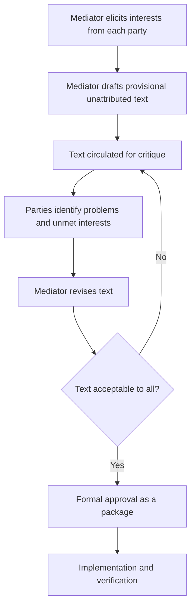
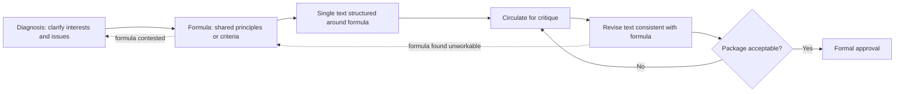
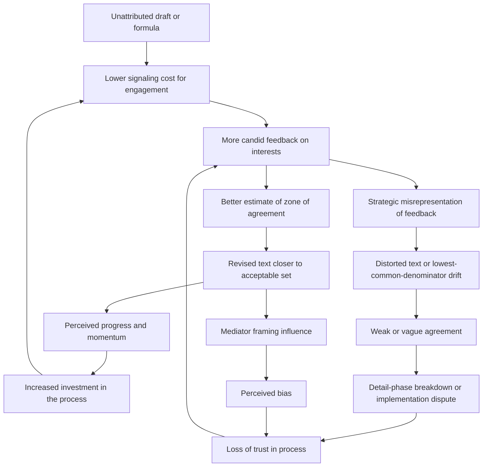

## Single-Text Mediation and Formula-Based Negotiation Design


### Scope and Framing

This item treats **single-text mediation** and **formula-based negotiation** as two related but distinct *procedural design technologies* for reducing the transaction costs and strategic distortions of multi-party bargaining. Single-text mediation restructures **how proposals are generated and revised** (one evolving document rather than competing offers). Formula-based negotiation restructures **what parties negotiate first** (shared principles and criteria before specific terms). The analytical question is: which specific bargaining pathologies does each technique close off, what assumptions must hold for it to work, and what new failure modes does it introduce?

**Key Points**

- Both techniques are **process designs**, not substantive solutions. They change the *incentive and information structure of the bargaining process* while leaving the underlying distribution of interests untouched.
- Single-text mediation attacks **positional commitment and concession-signaling costs** by removing attribution from proposals.
- Formula-based negotiation attacks **the granularity problem**: agreement on principles is easier than agreement on numbers, and principles then constrain the range of acceptable specifics.
- The two are **complementary**: a formula can supply the criteria that structure how a single text is drafted and revised.
- Evidence for their effectiveness is largely drawn from **selected case studies and practitioner accounts**; controlled or systematic comparative evidence is limited [Unverified as settled].

**Definitions on first use**

- **Single-negotiating-text (SNT) procedure**: a mediation technique in which a third party drafts one document, circulates it for criticism rather than acceptance, revises it based on feedback, and repeats until the parties can approve a common text.
- **Positional bargaining**: negotiation in which parties stake out and defend specific positions, with concessions read as signals of weakness.
- **Reactive devaluation**: the tendency to devalue a proposal because it originates from an adversary, independent of its content.
- **Formula**: a shared, general principle or set of criteria that defines the *basis* of a settlement and from which specific terms are then derived.
- **Detail (in the formula/detail distinction)**: the concrete implementation terms that flesh out a formula.
- **Zone of possible agreement (ZOPA)**: the set of outcomes that all parties would prefer to no-agreement.
- **BATNA (best alternative to a negotiated agreement)**: a party's most attractive outcome if talks fail, which sets that party's reservation value.
- **Anchoring**: the disproportionate influence of an initial figure or framing on the final outcome.
- **Logrolling**: trading concessions across issues of differing relative priority so that each party gains on the issues it values more.
- **Distributive versus integrative bargaining**: distributive bargaining divides a fixed value, while integrative bargaining expands it by exploiting differences in priorities and interests.

---

### The Bargaining Pathologies These Designs Address

Before examining the techniques, it helps to state the specific process failures they are meant to close.

| Pathology | Mechanism | Consequence |
| --- | --- | --- |
| **Concession-signaling cost** | Moving from a stated position reveals weakness or violates audience commitments | Parties defend positions past their true reservation values |
| **Attribution and reactive devaluation** | Proposals are judged by their source | Acceptable terms are rejected because an adversary proposed them |
| **Multi-party offer proliferation** | Each party tables its own proposal | Incompatible drafts; combinatorial coordination problem |
| **Positional lock-in** | Public commitment to specific demands | Narrowed ZOPA and audience costs for retreat |
| **Granularity trap** | Disputes over specific figures derail agreement on shared principles | Failure to converge even when underlying principles are compatible |
| **Sequential concession fear** | Fear that early concession is exploited | Stalemate over who moves first |
| **Anchoring dominance** | First numeric proposal shapes the range | Outcome driven by tactics rather than merit |

The design objective in each case is to **alter the process so that information and concessions can move without incurring the costs that the pathology imposes**.

---

### Single-Text Mediation

#### Origin and Core Procedure

The single-text procedure is associated with Roger Fisher's work and is often cited in connection with the 1978 Camp David negotiations, where the mediator prepared and revised a single draft framework through numerous iterations. The technique is generalizable beyond that case and is used in multi-party diplomatic and commercial negotiation.

**Procedure (schematic)**

1. **Elicit interests** from each party, separately if needed, focusing on underlying interests rather than positions.
2. **Draft a first text** that is deliberately provisional and unattributed, incorporating the mediator's understanding of the interests.
3. **Circulate for critique**, not acceptance. Parties are asked what is *wrong* with the draft and what would make it more acceptable.
4. **Revise** the text based on feedback, seeking modifications that address the concerns without eroding other parties' acceptance.
5. **Iterate** through multiple drafts, converging on a text that parties are willing to approve.
6. **Seek final commitment** to the whole text, typically as a package, with formal approval separated from the drafting process.



#### Mechanism: Why It Works

**1. Removal of attribution.** Because no party owns the text, criticism is directed at the *document* rather than at an adversary. This attenuates reactive devaluation, since the source effect is diminished.

**2. Reframing from concession to critique.** Parties are asked to identify deficiencies, which is a lower-commitment act than proposing or conceding. This lowers the **signaling cost** of engagement.

**3. Convergence by subtraction and addition.** Each iteration removes provisions that any party finds intolerable and adds provisions that address unmet interests, moving the text toward the **intersection of acceptable sets**.

**4. Reduction of combinatorial complexity.** In an $n$-party negotiation with each party tabling proposals, the number of pairwise proposal comparisons scales roughly as $\binom{n}{2}$, and coordinating among distinct documents grows more burdensome with each additional party. A single text collapses this to **one artifact** under revision.

**5. Mediator control of the agenda and framing.** The mediator manages information flow and holds the pen, which grants influence over framing and anchors.

#### A Formal Sketch of Convergence

Let there be $n$ parties, each with an acceptable set $A_i$ over the space of possible texts $\mathcal{T}$. The zone of agreement is:

$$Z = \bigcap_{i=1}^{n} A_i$$

If $Z \neq \emptyset$, an agreement exists that all parties prefer to no-agreement. The SNT procedure can be modeled as the mediator iteratively selecting texts $t_k$ and receiving feedback that reveals part of each $A_i$. Each round supplies information about the boundary of $A_i$, allowing the mediator to update toward $Z$.

Define the **objection set** at iteration $k$ as:

$$O_k = \{ i : t_k \notin A_i \}$$

The procedure aims to shrink $|O_k|$ toward zero. Convergence requires that:

- $Z \neq \emptyset$ (a feasible agreement exists)
- parties reveal informative feedback about their acceptable sets
- revisions that satisfy party $i$ do not push the text outside the acceptable set of party $j$ by more than they recover

**Causal reading (variables and direction):**

| Variable | Change | Effect on convergence |
| --- | --- | --- |
| Size of $Z$ | larger | faster, easier convergence |
| Informativeness of party feedback | higher | faster convergence |
| Strategic misrepresentation of $A_i$ | higher | slower or distorted convergence |
| Number of parties $n$ | higher | slower convergence, but SNT scales better than multiple-draft bargaining |
| Mediator's accuracy in estimating $A_i$ | higher | fewer iterations |
| Number of issues | higher | more logrolling potential, but more complexity |

**Model assumptions and where they break down**

- Assumes **truthful feedback**. Parties may misrepresent their acceptable sets strategically, for example by overstating objections to extract concessions.
- Assumes $Z \neq \emptyset$. If no zone of agreement exists, no procedural design can produce agreement; the technique cannot create value that is not there.
- Treats acceptable sets as **static**. In practice, parties' preferences and perceived BATNAs shift during the process.
- Assumes the mediator is **trusted and competent**. A biased or misinformed mediator can steer the text toward one party's interests.
- Ignores **internal constituencies**: a negotiator may accept a text that her principals reject.

#### Design Variables in Single-Text Mediation

| Design variable | Options | Effect |
| --- | --- | --- |
| **Drafter** | Neutral mediator; mediator with party input; co-drafting group | Neutrality perception; ownership; speed |
| **Format of critique** | Bilateral private consultations; joint sessions; written comments | Candor versus transparency; risk of leaks |
| **Text granularity** | Broad framework; detailed treaty language | Ease of agreement versus implementation clarity |
| **Bracketing** | Use of bracketed alternatives for unresolved points | Preserves progress while marking disputes |
| **Approval structure** | Paragraph-by-paragraph; whole package | Package approval enables cross-issue trade-offs; sequential approval risks unraveling |
| **Attribution rules** | Fully unattributed; attributed changes | Attribution reduces devaluation control but can support accountability |
| **Iteration pacing** | Rapid drafts; slower deliberation | Momentum versus reflection |

**Design consideration: package approval.** Recall that logrolling exploits differing priorities across issues. Approval of the text *as a package* preserves cross-issue trades, since a party accepting an unfavorable clause does so in exchange for a favorable one elsewhere. Sequential clause-by-clause approval risks **unraveling**, where each party pockets favorable clauses and reopens unfavorable ones. This is expressed in the common maxim that nothing is agreed until everything is agreed.

#### Failure Modes and Risks of Single-Text Mediation

| Failure mode | Cause | Response |
| --- | --- | --- |
| **Mediator bias or perceived bias** | Drafter controls framing and anchors | Transparent process; diverse mediation team; party review of drafting principles |
| **Strategic feedback** | Parties overstate objections or hide flexibility | Private consultations; consistency checks; parallel information channels |
| **Anchoring by first draft** | Initial text shapes the range | Consider whether initial draft should be deliberately moderate; state that it is provisional |
| **Lowest-common-denominator text** | Iterative removal of objections yields vague or empty language | Insist on operational specificity; separate constructive ambiguity from evasion |
| **Premature closure** | Pressure to finalize pushes acceptance of a weak text | Realistic timelines; verification and implementation planning |
| **Mediator overreach** | Mediator shapes substance beyond parties' intent | Clear mandate; mediator role boundaries |
| **Leaks** | Draft circulates publicly, triggering audience costs | Confidentiality rules; controlled circulation |
| **Constituency rejection** | Negotiators accept, principals reject | Include constituency consultation; ratification design |
| **Exclusion** | Parties not at the table reject the text | Inclusion strategy; spoiler management |

---

### Formula-Based Negotiation Design

#### Origin and Core Idea

The formula/detail distinction is developed in I. William Zartman and Maureen Berman's analysis of the negotiation process, which describes negotiation as often proceeding in phases: **diagnosis**, **formula**, and **detail**. The formula phase involves parties converging on a **shared conception of the terms of trade**, an overarching framework or principle, before working out specifics.

A formula, in this usage, is **a shared perception or definition of the conflict and its solution** that provides a basis for deriving specific terms. Examples of formula types (interpretation varies across the literature):

- **Principles of fairness or equity** (equal division, proportionality)
- **Reference-point formulas** (return to a prior status quo, use of an agreed baseline)
- **Exchange formulas** (trade of one class of concession for another, sometimes summarized as "land for peace" in the Middle East context)
- **Procedural formulas** (an agreed mechanism, such as arbitration, to determine specifics)
- **Standards of legitimacy** (reliance on precedent, law, or third-party benchmarks)

#### Mechanism: Why It Works

**1. Principle-level agreement is easier than number-level agreement.** Agreeing that a resource will be divided "in proportion to population" involves less immediate distributive conflict than agreeing to a specific quantity.

**2. Constraining the range.** A formula, once accepted, **restricts the acceptable range of specific terms**. The formula acts as a *coordination device* selecting among many possible agreements.

**3. Legitimation and justification.** Parties can defend the outcome to constituencies by appeal to the shared principle rather than to a bare concession. This lowers **audience costs**, since the outcome is framed as consistent with an accepted standard.

**4. Face-saving.** A formula can be presented as principle-based rather than as capitulation.

**5. Reduction of anchoring dominance.** Agreement on criteria before numbers reduces the influence of opening figures on the outcome.

#### A Formal Sketch

Let $F$ be the space of candidate formulas and, for each formula $f \in F$, let $D(f)$ be the set of specific agreements consistent with $f$. Parties' acceptable sets $A_i$ are over specific agreements. A formula $f$ is **viable** if:

$$D(f) \cap \bigcap_{i=1}^{n} A_i \neq \emptyset$$

that is, there exists a specific agreement consistent with the formula that all parties find acceptable. The formula phase can be modeled as parties searching for $f$ satisfying viability, then the detail phase as selecting $d \in D(f)$.

This formalization clarifies the **key risk**: parties may agree on a formula whose consistent detail set $D(f)$ does not intersect their acceptable sets, in which case agreement on the formula was **illusory** and the detail phase will fail. This is the **constructive ambiguity trap**: vague formulas can be accepted precisely because parties read them differently, deferring rather than resolving the dispute.

**Causal reading (variables and direction):**

| Variable | Change | Effect |
| --- | --- | --- |
| Specificity of formula | higher | reduces later ambiguity but raises initial resistance |
| Vagueness of formula | higher | easier initial acceptance, higher risk of detail-phase breakdown |
| Perceived legitimacy of the principle | higher | easier to sell to constituencies |
| Symmetry of the principle's application | higher | easier acceptance across parties |
| Size of $D(f) \cap Z$ | larger | easier detail-phase agreement |

**Model assumptions and where they break down**

- Assumes a **formula exists** that parties can accept. In some conflicts, parties disagree on fundamental principles (for example, competing claims of sovereignty), and no shared formula is available.
- Assumes the formula meaningfully **constrains** details. A formula so general that it constrains nothing provides little coordination value.
- Assumes parties **interpret the formula similarly**. Divergent interpretations can produce apparent agreement and later dispute.
- Distinguishing "formula" from "detail" can be **contestable** in practice: which questions are principle and which are specifics is itself negotiated.

#### Formula Versus Detail Sequencing

| Approach | Description | Strength | Risk |
| --- | --- | --- | --- |
| **Formula first, detail second** | Agree principle, then derive terms | Coordination and legitimation | Illusory agreement; vagueness |
| **Detail first, formula emergent** | Agree on specifics, infer principle | Concrete progress | Difficult without shared frame; inconsistent principles |
| **Iterative interleaving** | Alternate between principle and specifics | Tests viability of formula through detail | Slower; risk of principle drift |

Zartman and Berman's account emphasizes that the formula phase precedes detail, though the sequence is often **iterative rather than strictly linear** in practice [interpretation varies].

---

### Combining the Two: Formula-Structured Single Text

The techniques are complementary and frequently combined.

**Integration pattern**

1. **Diagnose** the conflict and clarify interests.
2. **Develop a formula** (agreed principles or criteria).
3. **Encode the formula as the structural backbone of a single text**, with the text organized around agreed principles.
4. **Iterate the text through critique**, resolving details consistent with the formula.
5. **Approve as a package.**

**Mechanism of complementarity**: the formula **narrows the search space** for the single text, reducing the number of iterations and disciplining the mediator's drafting, while the single-text procedure **operationalizes** the formula into concrete terms without attribution costs.



**Design consideration**: the arrows back from the text stage to the formula stage represent the **viability test**. If details consistent with the formula cannot satisfy all parties, the formula must be revisited. This guards against illusory agreement.

---

### Feedback Loop Structure



**Reading the loops**

- **Reinforcing loop R1 (momentum)**: low signaling cost → candid feedback → text convergence → perceived progress → increased investment → more candid feedback. This is the intended virtuous dynamic.
- **Reinforcing loop R2 (vagueness trap)**: pressure for agreement → vague text or formula → apparent agreement → detail-phase breakdown → loss of trust → reduced candor → more reliance on vagueness.
- **Balancing loop B1 (viability check)**: detail-phase difficulty → formula revisited → clarified principle → restored coordination.
- **Reinforcing loop R3 (mediator influence)**: mediator drafting control → framing effects → perceived bias → reduced trust → reduced candid feedback.

The design objective is to sustain R1 while dampening R2 and R3 through **operational specificity, viability testing, and mediator transparency**.

---

### Design Considerations and Checklist

#### When These Designs Fit Best

| Condition | Suitability |
| --- | --- |
| Multiple parties with complex, interdependent issues | High for single-text (reduces coordination burden) |
| Deep positional entrenchment and audience costs | High for both (reduces signaling cost and provides face-saving) |
| Shared underlying interests obscured by positions | High (interest elicitation and integrative bargaining) |
| No zone of agreement ($Z = \emptyset$) | Low (procedure cannot create value) |
| Fundamental disagreement on principles | Low for formula (no shared formula available) |
| Distrust of any mediator | Low for single-text (relies on mediator legitimacy) |
| Need for rapid, simple agreement | Variable; both add process overhead |

**Example: Structured Design Questions for a Given Negotiation**

1. **Establish the zone of agreement hypothesis.** Do the parties' interests plausibly overlap? If not, procedural design cannot substitute for changes in BATNAs or preferences.
2. **Assess mediator legitimacy.** Is there a trusted drafter? If not, consider a mediation team or party-nominated drafting group.
3. **Determine the formula space.** What principles could plausibly be shared? Are there precedent, legal, or reference-point standards available?
4. **Set the text's granularity.** Decide whether to begin with a framework or detailed language, and how to handle unresolved items (bracketing).
5. **Plan the critique format.** Choose bilateral or joint consultations and specify confidentiality.
6. **Decide the approval structure.** Prefer package approval to preserve trades, with a defined ratification path for principals.
7. **Guard against vagueness.** Specify how ambiguity will be distinguished from evasion, and test formula viability against details.
8. **Manage the mediator's influence.** Define the drafter's mandate and provide transparency about drafting principles.
9. **Plan for leaks and constituencies.** Set confidentiality and constituency-consultation procedures.
10. **Define verification and implementation.** Ensure that the final text contains operational, verifiable commitments.

**Illustrative pseudo-specification of a formula-structured single-text process**

```plaintext
SINGLE_TEXT_PROCESS:
  conflict_id: <identifier>
  mediator:
    drafter: <neutral mediator or mediation team>
    mandate: <scope and limits>
    transparency: <drafting principles disclosed to all parties>
  phases:
    diagnosis:
      activities: [interest elicitation, issue mapping]
      output: issue list and interest map
    formula:
      candidate_formulas: [<principle A>, <principle B>, ...]
      selection_criteria: [acceptability, symmetry, operational constraint on details]
      output: agreed formula (or bracketed alternatives)
    drafting:
      initial_text:
        structure: organized around agreed formula
        status: provisional, unattributed
      iteration:
        critique_format: [bilateral consultations, joint sessions]
        confidentiality: <rules>
        revision_rule: <how objections are incorporated>
        bracketing: <use of brackets for unresolved items>
    approval:
      structure: package
      ratification: <principal and constituency procedures>
  safeguards:
    vagueness_check: <test formula viability against candidate details>
    bias_check: <party review of drafting choices>
    leak_protocol: <response plan>
  implementation:
    verification: <monitoring provisions>
    dispute_resolution: <mechanism for later disagreements>
```

The specification is a schematic illustration of process parameters, not a standardized instrument.

---

### Cases as Evidence for Mechanisms

Cases below illustrate specific mechanisms rather than provide a survey. Characterizations are simplified, and scholarly assessments differ.

#### Mechanism: Unattributed Iterative Drafting (Camp David, 1978)

The mediators prepared and repeatedly revised a single draft framework between the Egyptian and Israeli delegations, reportedly through a large number of iterations, with the text circulated for critique rather than acceptance. The case is the standard illustration of the **single-text procedure** and its ability to reduce attribution effects and support convergence on a package. Accounts emphasize the role of the mediating party's influence over framing and the involvement of high-level leaders, and scholars caution against generalizing from a single high-salience case [assessments differ].

#### Mechanism: Formula as Coordination Principle (Land-for-Peace Framing)

The exchange formula associated with the Arab-Israeli context, often summarized as an exchange of territory for peace and recognition, is used in the Zartman-Berman tradition to illustrate a formula that **constrains the range of detail** and supplies a legitimating principle. Parties nonetheless differed on interpretation and scope, which illustrates the **constructive ambiguity trap** and the risk of illusory agreement at the formula level [interpretation varies].

#### Mechanism: Framework Text Iteration in Multi-Party Talks (Northern Ireland)

Multi-party negotiations in Northern Ireland involved circulated papers and iterative drafting managed by the chairing mediators, culminating in a package agreement. The case illustrates **package approval** and the use of **bracketed and structured drafts** in a multi-party setting, alongside the role of process rules (such as sufficient consensus requirements) that shaped the negotiation structure [details vary by source].

#### Mechanism: Reference-Point Formula in Boundary and Resource Disputes

Border and resource disputes have been addressed through agreement on reference-point principles, such as reliance on colonial-era boundaries, treaty lines, or equitable-division criteria, before specific demarcation. The mechanism illustrated is the **formula as a legitimate coordinating standard** that reduces anchoring and provides a defensible basis for concessions. Applicability depends on whether the reference standard is accepted by all parties [case-dependent].

#### Mechanism: Vagueness Leading to Implementation Dispute

Agreements built on deliberately ambiguous formulas have sometimes encountered subsequent disputes over interpretation and sequencing, illustrating the **vagueness trap (R2)**. The general pattern is that constructive ambiguity can enable initial agreement but shifts conflict to the implementation phase, and attributing later breakdowns specifically to ambiguity requires case-specific analysis [Unverified as uniform].

---

### Design Failure Modes and Responses

| Failure mode | Cause | Design response |
| --- | --- | --- |
| **Empty consensus** | Lowest-common-denominator text or formula | Demand operational specificity; test formula against candidate details |
| **Illusory formula** | Parties interpret the principle differently | Define key terms; test with concrete scenarios; add verification |
| **Mediator capture or bias** | Drafter shapes framing | Team mediation; transparent drafting principles; party review |
| **Anchoring by first draft** | Initial text sets the range | State provisional status; consider multiple starting alternatives |
| **Strategic feedback** | Misrepresentation of acceptable sets | Private consultations; consistency checks |
| **Unraveling** | Clause-by-clause approval reopens trades | Package approval; "nothing agreed until everything agreed" rule |
| **Leaks** | Draft exposure creates audience costs | Confidentiality; controlled circulation |
| **Constituency rejection** | Principals reject negotiators' agreement | Ratification design; ongoing constituency consultation |
| **Premature closure** | Deadline pressure | Realistic timelines; implementation planning |
| **Exclusion and spoilers** | Non-participants reject outcome | Inclusion strategy; security and incentive measures |
| **Formula unavailable** | Fundamental disagreement on principles | Reframe issues; separate contested principles; consider procedural formulas |
| **Process overhead** | Iteration burdens parties | Match process complexity to issue complexity |

---

### Limits of the Model

- **Procedure cannot create a zone of agreement.** If interests and BATNAs preclude any mutually acceptable outcome, single-text and formula methods cannot produce agreement.
- **Evidence base is largely case-based.** Systematic evidence on comparative effectiveness is limited, and prominent cases may be unrepresentative [Unverified as settled].
- **Mediator power and legitimacy are prerequisites.** The techniques presuppose a trusted, capable third party, which is not always available.
- **Strategic behavior is under-modeled.** Simple convergence sketches omit deception, coalition formation, and shifting BATNAs.
- **Formula/detail boundaries are contestable** and can themselves become disputed.
- **Cultural and contextual variation.** Norms about directness, hierarchy, and face affect how critique-based and principle-based processes are received.
- **Implementation is outside the scope of the drafting technique.** A well-drafted text can still fail at implementation without verification, enforcement, and guarantor mechanisms.
- **Behavior may vary**: predicted effects depend on actors' beliefs, institutional context, and enforcement conditions, and the formal sketches above are simplifications.

---

**Conclusion**

Single-text mediation and formula-based negotiation are complementary **procedural design technologies** that reduce the strategic costs of multi-party bargaining. Single-text mediation lowers the **signaling and attribution costs** of engagement by centering negotiation on an unattributed, iteratively revised document, while formula-based design **constrains the search space** by securing agreement on shared principles before specific terms. Their power depends on three conditions: a feasible zone of agreement, a trusted mediator, and formulas or texts that are **operationally specific** enough to avoid the vagueness trap. The principal design task is to combine the two so that the formula structures the text, the text tests the formula's viability, and package approval preserves cross-issue trades, while safeguarding against mediator bias, strategic feedback, and leakage.

**Related Topics**

- Interest-based versus positional bargaining (principled negotiation)
- Zartman and Berman's phases of negotiation: diagnosis, formula, detail
- Constructive ambiguity and its implementation costs
- Package deals, logrolling, and integrative bargaining
- Mediator strategies: communication, formulation, and manipulation
- Bracketing and staged drafting in multi-party talks
- Ratification design and constituency management
- Anchoring and framing effects in negotiation
- Reactive devaluation and cognitive barriers to agreement
- Verification, dispute resolution, and implementation clauses in peace agreements