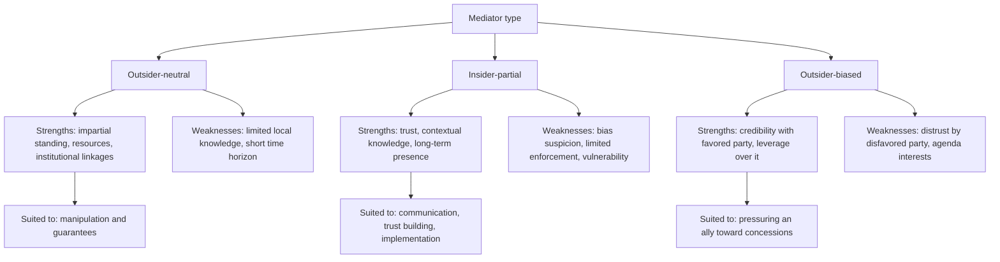
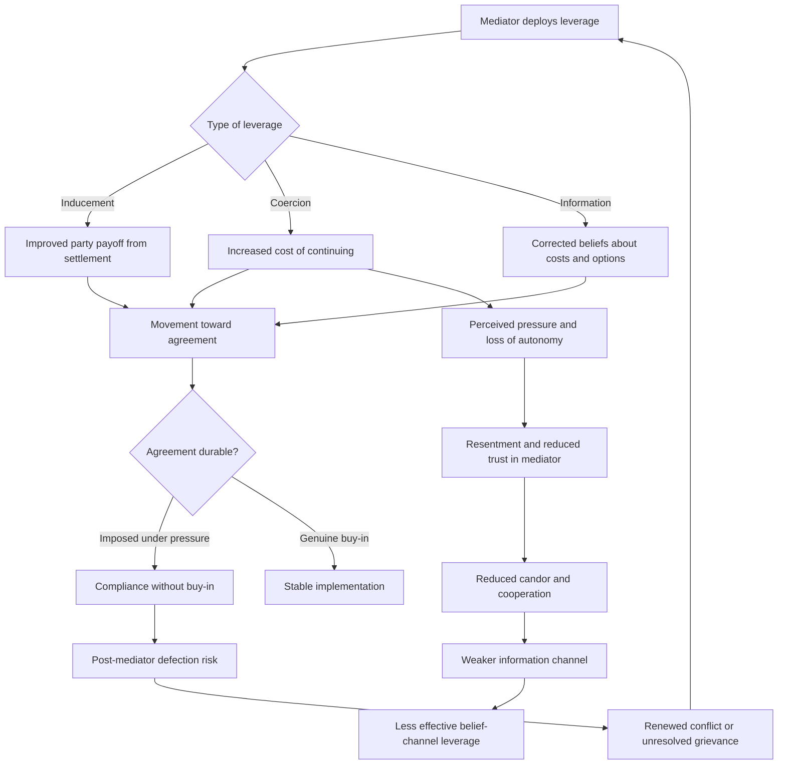

## Mediator Leverage and the Insider-Outsider Mediator Debate


### Scope and Framing

This item treats mediation as an **influence problem**: a third party with no formal authority over the disputants must nonetheless change their behavior, beliefs, or costs enough to produce agreement. The item covers two connected questions. First, what are the **sources and mechanisms of mediator leverage**, and how does leverage convert into bargaining movement? Second, does the mediator's **relationship to the conflict** (embedded in it and trusted for local knowledge, or external to it and trusted for impartiality) systematically alter which leverage sources are available, and with what trade-offs?

**Key Points**

- Leverage is **relational and perceived**, not an intrinsic property of the mediator. It exists only to the extent that a disputant believes the mediator can alter its payoffs or beliefs.
- Sources of leverage differ sharply in **reversibility, cost to the mediator, and side effects**. Coercive sources are potent but corrode trust, while informational sources preserve trust but may lack force.
- The insider-outsider distinction is best modeled as a **trade-off between trust/information and impartiality/resources**, not as a contest with a single winner.
- The classic "impartiality is required" assumption is empirically contested: several studies find that **biased mediators can be effective** under specific conditions, particularly when bias confers credibility as a guarantor [Unverified as settled].
- Evidence is heavily confounded by **selection**: mediators are assigned to, or self-select into, conflicts of different difficulty, so raw success rates mislead.

**Definitions on first use**

- **Mediator leverage**: the capacity of a third party to shift a disputant's expected payoffs from agreement or non-agreement, or to alter its beliefs about those payoffs, thereby moving its bargaining position.
- **Mediation**: assisted negotiation in which a third party lacking binding decision authority helps disputants reach a voluntary agreement.
- **Insider mediator (insider-partial)**: a third party embedded in the conflict society or its social networks, whose influence rests on trust, local knowledge, and legitimacy rather than external resources. Associated with Paul Wehr and John Paul Lederach's work.
- **Outsider mediator (outsider-neutral)**: a third party external to the conflict, whose influence rests on impartiality, resources, and institutional standing.
- **Impartiality (as procedural fairness)**: even-handed treatment of parties in process, distinct from having no preferences about outcomes.
- **Neutrality (as absence of interest)**: having no stake in the substantive outcome. Impartiality does not require neutrality.
- **Bias (in mediation)**: a mediator's known or perceived alignment with one party's interests or with a particular outcome.
- **Leverage (carrots and sticks)**: incentives (positive inducements) and sanctions (negative inducements) that a mediator can deploy or credibly threaten.
- **Guarantor**: a third party whose commitment to enforce or underwrite an agreement makes the agreement credible.
- **Manipulation (Touval and Zartman usage)**: a mediator strategy of actively changing the parties' incentives through leverage, as distinct from communication or formulation.

---

### Sources of Mediator Leverage

#### A Typology

A widely used organizing framework distinguishes power bases by analogy to the social-power literature (French and Raven), adapted to mediation. Categories below are analytical, and practitioners often blur them.

| Leverage source | Mechanism | Cost to mediator | Trust effect | Reversibility |
| --- | --- | --- | --- | --- |
| **Reward (carrots)** | Offers of aid, recognition, investment, security guarantees | Resource expenditure | Generally neutral to positive | Medium (withdrawal is possible) |
| **Coercion (sticks)** | Sanctions, arms restrictions, threat of exposure or abandonment | Political and economic cost; retaliation risk | Often negative | Low (damage may persist) |
| **Legitimate authority** | Institutional mandate (for example, a regional or global organization) | Low | Depends on perceived legitimacy | High |
| **Referent power** | Parties' desire for the mediator's approval or relationship | Low | Positive | High |
| **Expert power** | Mediation skill, technical knowledge, procedural competence | Low | Positive | High |
| **Informational power** | Control over information flow between parties; private assessments | Low | Positive if trusted, negative if suspected of distortion | High |
| **Connection power** | Access to third parties, patrons, or constituencies | Low to medium | Neutral | Medium |
| **Reputational or normative power** | Ability to confer or withhold international standing | Low | Neutral | Medium |

#### Leverage Through Beliefs versus Leverage Through Payoffs

Leverage operates through two distinct channels, and the distinction matters for design.

**Payoff channel**: the mediator changes the *actual* costs and benefits of agreement or continued fighting (through sanctions, aid, guarantees).

**Belief channel**: the mediator changes *what parties believe* about those costs and benefits (through information, reality-testing, reframing).

Recall from the ripeness literature that a **mutually hurting stalemate** is a perceptual condition in which each party believes it cannot win at acceptable cost. Belief-channel leverage targets exactly these perceptions, while payoff-channel leverage changes the underlying costs that inform them.

#### A Minimal Model of Leverage

Let party $i$ choose between continuing the conflict and accepting a settlement, using the decision structure common in bargaining models of war. Let:

- $U_i^{c}$ = expected utility from continuing
- $U_i^{s}$ = expected utility from a settlement $s$
- $\Delta_i^{M}$ = the net shift in party $i$'s utility comparison attributable to the mediator

Party $i$ accepts settlement $s$ when:

$$U_i^{s} + \Delta_i^{M,s} > U_i^{c} - \Delta_i^{M,c}$$

where $\Delta_i^{M,s} \ge 0$ represents mediator-provided inducements for accepting, and $\Delta_i^{M,c} \ge 0$ represents mediator-imposed costs on continuing. The **mediator's leverage over party $i$** is then:

$$\Lambda_i = \Delta_i^{M,s} + \Delta_i^{M,c}$$

**Causal reading (variables and direction):**

| Variable | Change | Effect on likelihood of acceptance |
| --- | --- | --- |
| $\Delta_i^{M,s}$ (inducements) | increases | increases |
| $\Delta_i^{M,c}$ (imposed costs on continuing) | increases | increases |
| $U_i^{c}$ (value of continuing) | increases | decreases |
| Credibility of mediator's threats or promises | decreases | shrinks realized $\Lambda_i$ toward zero |

**Note on realized leverage.** The formula uses *credibility-weighted* quantities. A mediator who threatens a sanction it will not impose contributes little to $\Delta_i^{M,c}$, because rational parties discount the threat. This links leverage to the **commitment problem** faced by mediators themselves: a mediator's threats and promises are only as powerful as its perceived willingness to follow through.

**Model assumptions and where they break down**

- Assumes **utilities are commensurable and additive**. In practice, identity, honor, and ideological commitments resist trade-offs.
- Assumes the mediator's inducements are **valued at face value**. Parties may reject inducements perceived as bribes or as threats to autonomy.
- Treats parties as **unitary**. Internal factions may respond differently to the same inducement.
- Ignores **externalities to the mediator**: using leverage costs the mediator resources and may alter its own reputation, generating a second-order strategic problem.
- Ignores **dynamic effects**: repeated use of sanctions may erode their marginal effect.

---

### Mediator Strategies and the Leverage Spectrum

Touval and Zartman's influential typology distinguishes three broad strategies, ordered by how much they rely on leverage:

| Strategy | Role | Leverage reliance | Typical activities |
| --- | --- | --- | --- |
| **Communication (facilitation)** | Channel for information | Low | Convening, passing messages, clarifying interests, reducing misperception |
| **Formulation** | Designer of solutions | Medium | Proposing formulas, drafting texts, restructuring issues, reframing |
| **Manipulation (directive)** | Active shaper of incentives | High | Offering inducements, threatening sanctions, coordinating pressure, linking to external issues |

Recall that the formula/detail distinction and single-text procedures are formulation-level tools: they alter *what is on the table* and how it is framed without changing underlying payoffs. Manipulation, by contrast, alters payoffs.

**Design consideration**: strategies are not mutually exclusive, and effective mediation often sequences them (communication to build trust, formulation to create options, manipulation when ripe and when a mediator has the means and the will). The choice of strategy is constrained by the **leverage sources the mediator actually possesses**, which is where the insider-outsider distinction enters.

---

### The Insider-Outsider Mediator Debate

#### The Two Ideal Types

| Dimension | Outsider-neutral | Insider-partial |
| --- | --- | --- |
| **Typical actors** | Diplomats, UN and regional organization envoys, international NGOs, states acting as mediators | Respected local elders, religious leaders, civil society figures, business leaders, former officials |
| **Source of standing** | Institutional mandate, impartiality, resources | Personal trust, local legitimacy, kinship and network ties |
| **Information** | Limited local knowledge; relies on briefings | Deep contextual knowledge; understands norms and history |
| **Impartiality** | Formal, procedural | Not claimed; trusted despite having connections |
| **Leverage type** | Carrots and sticks; institutional linkages; international attention | Relational and normative leverage; social pressure; long-term relationship |
| **Ability to guarantee** | Often high (can mobilize external enforcement) | Often low (limited enforcement capacity) |
| **Time horizon** | Often episodic; withdrawal after agreement | Long-term; remains in community after agreement |
| **Accountability** | To sending institution | To community |
| **Principal risks** | Ignorance of local dynamics; agenda imposition; short-termism; legitimacy deficit | Bias suspicion; capture by local interests; vulnerability to retaliation; limited resources |

These are **ideal types**. Real mediators occupy positions along multiple dimensions (embeddedness, resources, perceived bias), and some (a regional neighbor, a diaspora figure) are neither clearly inside nor outside.

#### The Original Debate

Earlier mediation scholarship often held that **impartiality** was a prerequisite for effective mediation, since a biased mediator would be distrusted and unable to facilitate. Later work challenged this in two ways:

1. **Empirical**: analyses of international mediation found that biased mediators sometimes achieved agreements, and that impartiality was not consistently associated with success.
2. **Theoretical**: bargaining models showed that a mediator sharing interests with one party can be a **credible communicator** to that party, and can extract concessions from it that a neutral mediator could not.

Wehr and Lederach's work on insider-partial mediators in Central America argued that trust, rather than impartiality, was the operative variable in contexts where relationships and legitimacy drive acceptance [interpretation varies across scholarship].

#### Bias as Credibility: The Formal Logic

Consider a mediator $M$ who conveys information about a settlement to party $i$. Party $i$ must decide how much to believe $M$'s claim that a proposed settlement is the best achievable. Let $b_{M,i}$ denote the degree to which $M$'s interests align with party $i$'s.

- If $b_{M,i}$ is high, $M$ is unlikely to mislead $i$ against $i$'s interests, so **$M$'s assurances to $i$ are credible**.
- If $M$ is biased toward $i$ and still recommends a concession, the recommendation is **costly-signal-like**: it would be against $M$'s apparent preferences to endorse a deal that harms $i$, so the endorsement conveys information.

Recall that a **costly signal** is an action that would be unattractive for a party with different type or motives to take, and therefore credibly reveals information. A biased mediator who tells its ally "this deal is acceptable" sends such a signal.

**Consequence**: bias can be a **resource for persuading the favored party**, at the cost of credibility with the disfavored party. This produces the concept of **complementary mediators** in a coalition, with different mediators credible to different parties.

**Model assumptions and breakdown points**

- Assumes the mediator's alignment is **observable** to the parties. If alignment is uncertain, parties cannot infer credibility.
- Assumes the biased mediator will act on **real interests in peace**, not on interests in a settlement favorable to its own patron regardless of stability.
- Ignores the risk that the disfavored party **refuses to engage** at all, foreclosing the process.
- The empirical evidence on bias and mediation success is mixed, and results depend on coding of bias, definition of success, and case selection [Unverified as settled].

---

### Mapping Leverage to Mediator Type



#### Leverage Availability by Type

| Leverage source | Outsider-neutral | Insider-partial | Outsider-biased |
| --- | --- | --- | --- |
| **Rewards (material)** | High if institutional or state-backed | Low | High if patron |
| **Coercion** | Medium to high (sanctions, exclusion) | Low (social sanction only) | High against disfavored party, limited against ally |
| **Legitimate authority** | High (mandate) | Medium (community legitimacy) | Low to medium |
| **Referent power** | Medium | High | High with favored party |
| **Expert power** | High (process expertise) | Medium (contextual expertise) | Medium |
| **Informational power** | Limited local access | High local access | Selective |
| **Connection power** | High (external actors) | High (local networks) | High with patron network |
| **Guarantee capacity** | High | Low | High if patron |

**Design implication**: because no single mediator type dominates across all leverage sources, effective processes often combine mediators, either in **sequence** or in **parallel**, so that gaps in one are covered by another. This links to the multi-track coordination logic: insider mediators frequently operate at Track II and Track III levels, while outsider mediators operate at Track I.

---

### The Feedback Structure of Leverage Use



**Reading the loops**

- **Reinforcing loop R1 (coercion-trust erosion)**: coercive leverage → agreement pressure but resentment → reduced trust → weaker information flow → less capacity for belief-channel influence → greater reliance on coercion.
- **Reinforcing loop R2 (imposed agreement fragility)**: leverage-driven agreement without buy-in → compliance only while the mediator applies pressure → defection after the mediator withdraws → renewed conflict → demand for further mediation.
- **Balancing loop B1 (credibility discipline)**: mediator threats not followed through → loss of credibility → reduced realized leverage → pressure to follow through or to shift strategy.
- **Reinforcing loop R3 (virtuous trust)**: informational and referent leverage → trust → candid feedback → better formulation → perceived fairness → greater willingness to accept mediator suggestions.

The design objective is to **use coercive leverage sparingly and with an exit plan for trust repair**, and to rely on belief-channel and formulation strategies where possible, reserving manipulation for when it can be credibly sustained.

---

### Cases as Evidence for Mechanisms

Cases below illustrate specific mechanisms rather than provide a survey. Characterizations are simplified, and scholarly assessments differ.

#### Mechanism: Outsider Leverage Through Carrots and Guarantees (Camp David, 1978)

The United States mediating between Egypt and Israel is a standard illustration of an outsider **using material incentives and guarantees** to move parties, including significant aid commitments. The mediator was not neutral in an interest-free sense, illustrating that **outsider mediation frequently combines impartial process with substantial leverage and stake in the outcome**. Scholars note that the mediator's resources and willingness to underwrite commitments were central [assessments differ on relative weight of factors].

#### Mechanism: Insider-Partial Trust in Central America

Wehr and Lederach's account of mediators in Central American conflicts (drawing on an insider mediator in the region) is the primary source of the **insider-partial** concept. The mechanism illustrated is **trust and long-term relationship** as the basis of influence in the absence of material leverage, with the mediator's continued presence supporting implementation. The account is a practitioner-informed case analysis, and its generalizability is debated [interpretation varies].

#### Mechanism: Biased Mediator as Credible Persuader

Analyses of mediation in which a mediator aligned with one party helped secure that party's concessions are used to illustrate **bias as credibility**. Quantitative studies of international mediation have reported mixed results about the effect of bias on agreement, and findings are sensitive to how bias and success are measured [Unverified as settled].

#### Mechanism: Coercive Leverage and Imposition Risk (Multiple Peace Processes)

Processes in which external actors applied heavy pressure to secure signatures illustrate **imposed agreement fragility (R2)**. A recurring pattern in the literature is that agreements reached under strong external pressure may lack local ownership and face implementation difficulty after the pressure subsides, though attribution of later failure to imposition requires case-specific analysis.

#### Mechanism: Complementary Mediation Coalitions

Processes involving multiple mediators (for example, an external organization together with regional actors or local figures) illustrate the **division of leverage functions**: institutional resources and guarantees from outsiders, contextual legitimacy and implementation support from insiders. Coordination among mediators introduces its own risks, including forum shopping and inconsistent signals, tied to the multi-track coordination problem.

#### Mechanism: Regional Mediators with Mixed Interests

Regional neighbors or organizations frequently mediate conflicts in which they have interests. They combine **contextual knowledge and connection power** with **partiality**, and they can exert leverage through proximity, trade, and security ties. The mechanism illustrates the **hybrid position** between clean insider and outsider types and the trade-off between leverage and perceived impartiality [case-dependent].

---

### Design Failure Modes

| Failure mode | Cause | Design response |
| --- | --- | --- |
| **Empty threats** | Mediator lacks will or capacity to impose costs | Threaten only what can be executed; coordinate with actors who hold sanctions |
| **Trust erosion from coercion** | Heavy-handed pressure | Reserve coercion; maintain separate trust-building channels; use complementary mediators |
| **Imposed agreement fragility** | Compliance without buy-in | Involve parties in drafting; design implementation support beyond mediator presence |
| **Mediator bias (harmful)** | Mediator pursues own agenda | Transparency of interests; multiple mediators; accountability to parties |
| **Insider capture** | Local mediator captured by faction | Diversity of insider participants; external verification |
| **Insider vulnerability** | Retaliation against local mediators | Protection measures; institutional support; discretion |
| **Outsider ignorance** | Limited local knowledge | Partnership with insiders; contextual training; local advisory input |
| **Short-termism** | Mediator withdraws after signing | Long-term engagement plan; local ownership; monitoring mechanisms |
| **Mediator competition** | Multiple mediators pursuing separate agendas | Coordination mechanism; single lead with defined roles |
| **Leverage misapplication** | Wrong lever for the stage of conflict | Diagnose ripeness and party interests before selecting strategy |
| **Guarantee credibility gap** | Weak enforcement of commitments | Third-party guarantors; verification; graduated response |
| **Legitimacy deficit** | Parties question mediator's standing | Consent-based selection; transparent mandate; party involvement in mediator choice |

---

### Design Checklist

**Example: Structured Questions for Selecting Mediator Type and Leverage Strategy**

1. **Diagnose the bottleneck.** Is the main barrier a lack of trust, a lack of information, an absence of credible guarantees, unaligned incentives, or lack of ripeness?
2. **Inventory available leverage.** For each candidate mediator, list which sources (rewards, coercion, legitimacy, expertise, information, connections, guarantees) it actually holds and how credible each is.
3. **Assess perceived alignment.** How do parties perceive each mediator's interests and bias? Is the bias usable as credibility, or does it foreclose engagement?
4. **Match strategy to leverage.** Select communication, formulation, or manipulation strategies compatible with the mediator's real leverage and the parties' ripeness.
5. **Plan for guarantees.** Identify who can underwrite commitments and how enforcement will function after agreement.
6. **Consider complementary mediators.** Determine whether combining insider and outsider roles covers gaps, and define coordination rules.
7. **Protect insider mediators.** Assess security risks and provide safeguards.
8. **Limit coercion's costs.** Define conditions and exit plans for any coercive leverage and preserve a trust-repair channel.
9. **Plan implementation continuity.** Ensure someone remains engaged after formal agreement, with local ownership.
10. **Define accountability.** Clarify to whom each mediator answers and how conduct is monitored.

**Illustrative pseudo-specification of a mediator leverage assessment**

```plaintext
MEDIATOR_LEVERAGE_ASSESSMENT:
  conflict_id: <identifier>
  parties: [A, B, ...]
  candidate_mediators:
    - mediator: <name or institution>
      type: outsider-neutral | insider-partial | outsider-biased | regional-hybrid
      perceived_alignment:
        toward_A: <low|medium|high>
        toward_B: <low|medium|high>
      leverage_inventory:
        rewards: {available: true/false, credibility: <low|medium|high>}
        coercion: {available: true/false, credibility: <low|medium|high>}
        legitimacy: {basis: <mandate or community standing>, strength: <low|medium|high>}
        expertise: <low|medium|high>
        information_access: <low|medium|high>
        connections: <low|medium|high>
        guarantee_capacity: <low|medium|high>
      risks: [bias suspicion, retaliation exposure, mandate limits, ...]
  strategy_selection:
    primary: communication | formulation | manipulation
    sequencing: <phases>
    rationale: <link to diagnosed bottleneck>
  coalition_design:
    lead_mediator: <identifier>
    complementary_roles:
      - role: guarantor
        holder: <identifier>
      - role: local legitimacy and implementation support
        holder: <identifier>
    coordination_rules: <how signals and proposals are aligned>
  safeguards:
    coercion_limits: <conditions, exit plan>
    security_measures: <protection for insider participants>
    accountability: <reporting lines>
  implementation_continuity:
    post_agreement_role: <who remains engaged>
    monitoring: <verification arrangements>
```

The specification is a schematic illustration of assessment parameters, not a standardized instrument.

---

### Limits of the Model

- **Selection effects dominate the evidence.** Mediators are not randomly assigned, and difficult conflicts attract different mediators, so comparisons of success rates across mediator types are confounded.
- **Leverage is perceived, not observable.** Realized leverage depends on parties' beliefs about the mediator's credibility and willingness, which analysts infer indirectly.
- **Insider and outsider are ideal types.** Many mediators combine attributes, and coding decisions strongly influence empirical results.
- **Definition of success varies.** Agreement signing, ceasefire duration, and durable peace are different outcomes, and mediator type may affect them differently.
- **Mediator interests are often unstated.** Mediators pursue institutional, security, or geopolitical interests that formal models omit.
- **Normative content.** Questions about legitimacy of coercive mediation and about local ownership involve value judgments that models do not resolve.
- **Behavior may vary**: predicted effects depend on actors' beliefs, institutional context, and enforcement conditions, and the formal sketches above are simplifications.

---

**Conclusion**

Mediator leverage is best analyzed as a **credibility-weighted capacity to shift parties' payoffs or beliefs**, operating through inducements, imposed costs, and information. Sources of leverage differ in cost, reversibility, and effect on trust, with coercive sources producing rapid movement at the risk of eroding trust and generating fragile, imposed agreements. The insider-outsider debate resolves into a **trade-off structure** rather than a winner: outsiders typically supply resources, guarantees, and formal impartiality, while insiders supply trust, contextual knowledge, and long-term presence, and biased mediators can supply credibility with a favored party at the price of distrust from the other. Effective design matches mediator type and strategy to the diagnosed bottleneck, combines complementary mediators where gaps exist, limits coercive leverage, and plans for implementation continuity beyond the mediator's presence. The empirical evidence is confounded by selection and measurement issues, which argues for cautious generalization.

**Related Topics**

- Touval and Zartman's mediation strategy typology: communication, formulation, manipulation
- Bias, credibility, and costly signaling in mediation
- Guarantor mechanisms and third-party enforcement of agreements
- Ripeness and mediator timing
- Complementary mediation and mediator coordination
- Insider-partial mediation and infrastructure for peace
- Mediator selection, consent, and legitimacy
- Coercive diplomacy and sanctions design in mediation
- Multi-track diplomacy and mediator roles across tracks
- Evaluating mediation effectiveness: selection effects and measurement of success