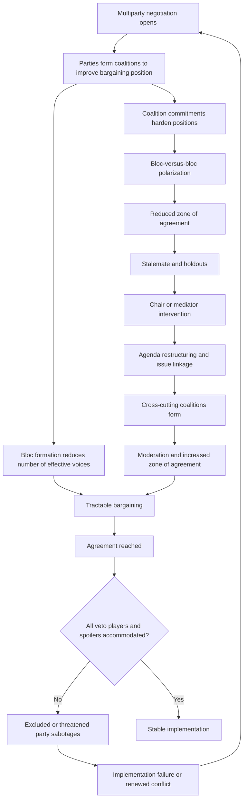

## Multiparty Negotiation Architecture and Coalition Management


### Scope and Framing

This item treats multiparty negotiation as a **structural design problem**: when more than two actors bargain simultaneously, the *architecture* of the negotiation (who sits where, in what configuration, under what decision rule, with what agenda) becomes a primary determinant of outcomes, independent of the parties' preferences. It also treats **coalitions** as the endogenous groupings that form, hold, and dissolve within that architecture. The analytical question is: which structural choices (party inclusion, agenda sequencing, decision rules, coalition-formation incentives, and information channels) close off the characteristic pathologies of multiparty bargaining, and what do they cost?

**Key Points**

- Moving from two parties to $n>2$ changes the problem **qualitatively**, not just quantitatively: coalitions become possible, preference cycles can occur, veto positions matter, and complexity grows combinatorially.
- **Decision rules** (unanimity, consensus, sufficient consensus, qualified majority) determine who holds veto power and therefore who must be bought off, which shapes coalition structure and the risk of spoiler behavior.
- **Architecture** includes choices about *inclusion, representation, agenda, sequencing, forums, and decision rules*, each of which is a design lever with trade-offs between legitimacy, efficiency, and stability.
- Coalitions are **strategic equilibria, not fixed blocs**: they form around shared interests on specific issues, and cross-cutting issue linkages can destabilize or stabilize them.
- Evidence on which architectures produce better outcomes is largely case-based and confounded by selection [Unverified as settled].

**Definitions on first use**

- **Multiparty negotiation**: bargaining among three or more actors with interdependent interests, in which agreements may be bilateral, coalitional, or comprehensive.
- **Coalition**: a subset of negotiating parties that coordinates its bargaining behavior (positions, votes, concessions) to improve its collective outcome.
- **Winning coalition**: a coalition whose members hold enough decision weight, under the applicable rule, to determine the outcome.
- **Minimum winning coalition**: a winning coalition from which the removal of any member would make it non-winning.
- **Veto player**: a party whose agreement is required for a decision to be adopted.
- **Blocking coalition**: a coalition that, though not able to pass a proposal, has enough weight to prevent adoption.
- **Consensus (rule)**: a decision rule requiring the absence of formal objection rather than an affirmative majority.
- **Sufficient consensus**: a decision rule requiring agreement of a defined portion of participants (often by weighted or representative criteria) rather than unanimity.
- **Agenda control**: the ability to determine which issues are considered, in what order, and in what form.
- **Issue linkage**: connecting separate issues in a single bargain so that concessions on one can be traded for gains on another.
- **Spoiler**: a party that believes a settlement threatens its interests and uses violence or obstruction to undermine it.
- **Cycling**: a situation in which majority preferences over alternatives are intransitive, so no alternative defeats all others in pairwise votes.
- **Chair (or convener)**: the actor managing procedure, agenda, and often mediation, who may or may not be a party to the dispute.

---

### Why Multiparty Negotiation Differs Structurally

#### Combinatorial Complexity

With $n$ parties, the number of possible bilateral relationships is:

$$\binom{n}{2} = \frac{n(n-1)}{2}$$

and the number of possible **coalitions** (non-empty subsets of parties) is:

$$2^{n} - 1$$

This exponential growth in coalitional possibilities is the source of many multiparty pathologies: the strategic environment is far larger than in a two-party case, information requirements grow, and coordination costs rise. Structural design is largely an effort to **reduce this space to a tractable one** (through representation, blocs, and staged agendas).

#### Qualitatively New Phenomena

| Phenomenon | Definition | Why it matters |
| --- | --- | --- |
| **Coalition formation** | Subsets align to improve outcomes | Outcomes depend on who allies with whom, not only on preferences |
| **Veto and pivotal positions** | Some parties can block or determine outcomes | Bargaining power depends on structural position, not just resources |
| **Preference cycling** | Intransitive collective preferences | Outcomes may depend on agenda order rather than stable preferences |
| **Free-riding** | Parties benefit from others' concessions or effort | Collective action problems within blocs |
| **Holdout problem** | Each party gains by delaying to extract concessions | Delay and hold-up of comprehensive agreements |
| **Audience and constituency complexity** | Each party faces multiple principals | Ratification risk multiplies |
| **Spoiler dynamics** | Excluded or threatened parties sabotage | Inclusion versus exclusion trade-offs |

#### A Formal Illustration: Power Indices and Structural Position

Bargaining power in voting-based multiparty settings can be characterized by how often a party is **pivotal**. The Shapley-Shubik index for party $i$ is:

$$\phi_i = \sum_{S \subseteq N \setminus \{i\}} \frac{|S|!\,(n-|S|-1)!}{n!}\,\big[v(S \cup \{i\}) - v(S)\big]$$

where $N$ is the set of parties, $S$ a coalition not containing $i$, and $v(\cdot)$ is a characteristic function equal to 1 for winning coalitions and 0 otherwise. The index measures the share of orderings in which $i$'s joining converts a losing coalition into a winning one.

**Causal reading (variables and direction):**

| Variable | Change | Effect on party $i$'s structural power |
| --- | --- | --- |
| Decision rule threshold rises toward unanimity |  | veto positions gain power; small parties can extract more |
| Party $i$ is essential to every winning coalition |  | index rises toward its maximum (effective veto) |
| Party $i$ is dominated (never pivotal) |  | index falls toward zero ("dummy player") |
| Addition of parties |  | dilutes individual pivotal probability but increases coalition options |

**Model assumptions and where they break down**

- Assumes **voting-style decision structures**. Many negotiations use consensus without formal voting, where power operates through informal influence and the ability to obstruct.
- Treats parties as **unitary and fixed**. Parties may split, merge, or shift, and internal factions may defect.
- Assumes the **rule is fixed and known**. Decision rules are often themselves negotiated and contested.
- Captures only **structural** power, omitting resources, information, external alliances, and BATNA differences.
- Assumes **complete and common knowledge** of coalition values, which is unrealistic in practice.

---

### Negotiation Architecture: The Design Levers

Architecture refers to the structural features that organize a multiparty negotiation. Each is a design choice with consequences.

#### 1. Participation and Inclusion

| Choice | Effect | Risk |
| --- | --- | --- |
| **Broad inclusion** | Higher legitimacy; reduces spoiler risk; wider ownership | Complexity; more veto players; more holdouts |
| **Narrow inclusion** | Efficiency; tractable bargaining | Excluded parties may spoil; legitimacy deficit |
| **Staged inclusion** | Begin with core parties, add others later | Late entrants may reject prior deals; ordering effects |
| **Observer or consultative status** | Voice without veto | Perceived tokenism; frustration |

**Mechanism**: inclusion trades **efficiency against legitimacy and spoiler risk**. Recall that a **spoiler problem** arises when a party excluded or threatened by a settlement can sabotage it. Including such parties reduces sabotage incentives but adds veto players who can delay or dilute agreement. This is the **inclusion-exclusion dilemma**, and its resolution depends on the spoiler's capacity and type (limited, greedy, or total spoilers, in Stedman's typology) [interpretation varies].

#### 2. Representation and Bloc Formation

To reduce the coalitional space, architectures often use **representation structures**: delegations speaking for multiple actors, blocs, or caucuses.

- **Formal blocs** (for example, groupings within institutional negotiations) reduce the number of effective voices.
- **Delegated representation** (a spokesperson for a coalition) simplifies interaction but raises **agency problems**.

**Design consideration**: representation reduces complexity but creates **principal-agent problems**. A spokesperson may lack authority, misrepresent constituents' interests, or be undermined by internal factions. This connects to the **valid spokesperson** requirement discussed in ripeness theory: a representative must have sufficient authority and legitimacy to commit the bloc.

#### 3. Decision Rules

| Rule | Description | Effect on outcomes | Risks |
| --- | --- | --- | --- |
| **Unanimity** | All parties must agree | Every party is a veto player; protects minorities | Holdouts; lowest-common-denominator; paralysis |
| **Consensus** | No formal objection | Encourages accommodation; avoids formal votes | Ambiguity; strategic silence; hidden opposition |
| **Sufficient consensus** | Agreement of a defined portion or weighted subset | Prevents a single party from blocking | Excluded objectors may reject; legitimacy questions |
| **Qualified majority** | Supermajority threshold | Balances inclusiveness and efficiency | Blocking minorities; coalition brinkmanship |
| **Simple majority** | More than half | Efficient; winner-take-most | Minority alienation; spoiler risk |
| **Weighted voting** | Votes weighted by size, power, or stake | Reflects power distribution | Legitimacy disputes over weights |
| **Package approval** | Acceptance of whole text | Preserves logrolling trades | Take-it-or-leave-it pressure |

**Mechanism**: as the threshold rises toward unanimity, the **set of veto players expands**, increasing the price of agreement and the leverage of small parties (the **hold-out problem**). As the threshold falls, agreement becomes easier but the **excluded minority** may reject implementation. The decision rule is thus a direct control on the **tension between inclusiveness and decisiveness**.

The rule's effect on the **pivotal structure** can be summarized by considering a threshold $q$ (the required fraction of weight). Let $w_i$ denote party $i$'s weight, and $W=\sum w_i$. A coalition $S$ wins if:

$$\sum_{i \in S} w_i \ge q W$$

Raising $q$ shrinks the set of winning coalitions and increases the likelihood that any given party is pivotal, while lowering $q$ enlarges the set of winning coalitions and reduces individual pivotality.

#### 4. Agenda Design and Sequencing

Agenda control is powerful because, under cycling or issue-dependent coalitions, **the order and grouping of issues can determine the outcome**.

| Agenda strategy | Description | Effect |
| --- | --- | --- |
| **Issue-by-issue (sequential)** | Resolve issues one at a time | Simplifies coordination; risks loss of cross-issue trades |
| **Package (simultaneous)** | Negotiate all issues together | Preserves logrolling; increases complexity |
| **Building-block approach** | Agree on easier issues first to build momentum | Trust and momentum; risk of deferring hardest issues |
| **Framework-then-detail** | Agree principles then specifics | Coordination; risk of vague framework |
| **Parallel tracks** | Distinct forums for distinct issues | Reduces load; risk of inconsistency |
| **"Nothing agreed until everything agreed"** | Provisional agreements bound by final package | Prevents unraveling; can delay |

Recall that **logrolling** trades concessions across issues of differing priority so each party gains on the issues it values more. Issue-by-issue sequencing can destroy these trades, while packaging preserves them but enlarges the bargaining space.

#### 5. Forums and Channels

- **Plenary sessions**: all parties together; transparency but grandstanding.
- **Caucuses and bilateral sessions**: private exploration; risk of suspicion and fragmentation.
- **Working groups or technical committees**: issue-specific expertise; risk of decoupling from political decisions.
- **Shuttle mediation**: a mediator carries messages among parties; controls information flow.
- **Proximity talks**: parties in separate locations with a mediator between.

**Design consideration**: combining **plenary legitimacy with private caucus flexibility** is common, but every private channel creates suspicion among excluded parties, which is why transparency norms and reporting back to plenary matter.

#### 6. Chair and Mediator Roles

Recall from the mediation literature that a third party can act through communication, formulation, and manipulation. In multiparty settings the chair or mediator also performs **architectural functions**: managing agenda, allocating speaking time, synthesizing proposals (for example, through a single text), and brokering coalitions. Chair neutrality and authority are themselves design variables, and a chair with agenda control holds significant structural power.

---

### Coalition Dynamics and Management

#### Why Coalitions Form

Coalitions form to **increase bargaining power, share costs, pool information, and secure structural position**. Classic models suggest that in settings where only the winning coalition receives the "prize," coalitions tend toward **minimal winning size** to avoid sharing the prize (Riker's size principle), while in policy-based bargaining coalitions form around **ideological or interest proximity** (connected coalition theories) [these are stylized models; empirical fit varies].

#### A Stylized Model of Coalition Stability

Consider a coalition $C$ with members $i \in C$. Member $i$ remains in $C$ if its expected payoff from membership exceeds its payoff from defecting:

$$u_i(C) \ge \max\Big(u_i(\text{alone}),\; \max_{C' \ne C} u_i(C')\Big)$$

where $u_i(\text{alone})$ is $i$'s payoff bargaining independently and $u_i(C')$ is its payoff in an alternative coalition. A coalition is **stable** when no member has a profitable deviation, and **core-stable** in cooperative game terms when no subgroup can improve by forming a different coalition.

**Causal reading (variables and direction):**

| Variable | Change | Effect on coalition stability |
| --- | --- | --- |
| Side payments or promised concessions to members | increases | increases |
| Divergence of members' interests across issues | increases | decreases |
| Outside options (attractive alternative coalitions) | increases | decreases |
| Enforceability of intra-coalition commitments | increases | increases |
| Cross-cutting issue linkages | increases | can decrease (members on opposite sides of other issues) or increase (bundled interests) |
| Leadership legitimacy within coalition | increases | increases |

**Model assumptions and where they break down**

- Assumes **transferable utility and enforceable side payments**, which are often unavailable in political negotiation.
- Assumes members have **stable, known preferences**. In practice, preferences shift and are partly hidden.
- Ignores **internal politics of each member** (leaders' survival, constituent pressures).
- Treats coalition formation as a **single-stage game**, whereas real coalitions form iteratively and dissolve.
- The stylized minimal-winning-coalition prediction fits poorly where outcomes are policy-based and parties value broad legitimacy [interpretation varies].

#### Coalition Types by Function

| Type | Function | Example dynamic |
| --- | --- | --- |
| **Blocking coalition** | Prevent adoption of unwanted outcomes | Minority uses veto threat to extract concessions |
| **Winning coalition** | Secure adoption of a proposal | Majority bloc pushes a package |
| **Issue-specific coalition** | Align on one issue only | Different alliances on different issues |
| **Structural bloc** | Persistent alignment (regional, identity-based) | Stable groupings across many negotiations |
| **Ad hoc coalition** | Temporary tactical alliance | Formed to pass or block a specific text |
| **Cross-cutting coalition** | Members from opposing sides on other issues | Stabilizes by creating overlapping loyalties |

#### Cross-Cutting Cleavages and Stability

Recall that conflict systems are stabilized when **social cleavages cross-cut** rather than reinforce each other: individuals or groups on opposite sides of one issue are allies on another, so they have incentives to moderate. In multiparty negotiation, **issue linkage can be engineered to create cross-cutting coalitions**, diluting the alignment of blocs along a single dominant cleavage. Conversely, **reinforcing cleavages** (all issues aligning the same two blocs) tend to harden coalitions into polarized camps and shrink the zone of agreement.

---

### Feedback Loop Structure



**Reading the loops**

- **Balancing loop B1 (bloc simplification)**: numerous parties → coalition formation → fewer effective voices → tractable bargaining → agreement.
- **Reinforcing loop R1 (polarization)**: coalition commitments → hardened positions → bloc polarization → narrowed zone of agreement → stalemate → further reliance on bloc discipline.
- **Balancing loop B2 (cross-cutting moderation)**: stalemate → agenda restructuring and linkage → cross-cutting coalitions → moderation → wider zone of agreement.
- **Reinforcing loop R2 (spoiler cycle)**: exclusion or threat → sabotage → implementation failure → renewed conflict → renewed multiparty bargaining with hardened grievances.

The design objective is to **strengthen B1 and B2 while dampening R1 and R2**, through representation structures that simplify without excluding, linkage designs that create cross-cutting interests, and inclusion strategies that manage spoilers.

---

### Coalition Management: Strategies for Parties and Convenors

#### For Convenors and Mediators (Architects)

| Strategy | Mechanism | Risk |
| --- | --- | --- |
| **Single-text procedure** | Collapse many proposals into one evolving document | Mediator framing influence |
| **Issue linkage engineering** | Bundle issues to create cross-cutting interests | Complexity; can enable hold-ups |
| **Sub-group formation** | Working groups on tractable issue clusters | Decoupling from political decisions |
| **Coalition brokering** | Encourage alliances between parties with complementary interests | Perceived manipulation; instability |
| **Spoiler management** | Inclusion, incentives, or containment matched to spoiler type | Rewarding obstruction; moral hazard |
| **Sufficient-consensus rule design** | Prevent single-party blocking while preserving broad support | Excluded party legitimacy challenge |
| **Transparency and reporting** | Report caucus outcomes to plenary | Reduces flexibility of private channels |
| **Deadline and sequencing design** | Create momentum and focal points | Artificial deadlines can produce weak agreements |

#### For Coalition Members and Leaders

- **Internal cohesion**: maintain discipline through side payments, shared goals, and clear rules for representation.
- **Aggregate positions** across members while preserving flexibility to accommodate differing interests.
- **Manage defection risk**: identify members with outside options and address their concerns early.
- **Preserve a credible threat and a credible offer**: coalitions gain leverage from a credible BATNA and from visible willingness to settle.
- **Coordinate messaging** to avoid contradictory signals that the counterpart can exploit.

#### Managing the Veto and Spoiler Problem

Stedman's spoiler typology distinguishes:

- **Limited spoilers**: seek limited goals (recognition, a share of power), and can often be accommodated.
- **Greedy spoilers**: goals expand with perceived opportunity, and respond to cost-benefit shifts.
- **Total spoilers**: seek complete power and see no accommodation, and may require containment or marginalization.

**Design consequence**: inclusion suits limited spoilers, incentive-and-sanction combinations may suit greedy spoilers, and total spoilers may require security-based responses. Misclassifying a spoiler type is a common failure, and classification is itself contestable and may shift over time [interpretation varies].

---

### Cases as Evidence for Mechanisms

Cases below illustrate specific mechanisms rather than provide a survey. Characterizations are simplified, and scholarly assessments differ.

#### Mechanism: Sufficient Consensus and Multi-Party Process Rules (Northern Ireland Talks)

The multiparty talks that produced the 1998 agreement operated under procedural rules that combined inclusive participation of parties with electoral mandates and a **sufficient consensus** principle requiring agreement among participants representing majorities of both main communities. The case illustrates **decision-rule design** that prevents a single party from blocking while protecting each community from majority imposition, and the use of a chair-led structured process. Accounts note the role of process design alongside contextual factors such as shifting party positions [assessments differ].

#### Mechanism: Bloc Negotiation and Consensus in Global Institutions (Multilateral Environmental and Trade Negotiations)

In large multilateral negotiations, participants commonly aggregate into **formal or informal negotiating blocs**, which reduces the number of voices and lowers coordination costs while introducing agency and cohesion problems. Consensus-based decision rules in some forums grant effective veto power to any party, illustrating the **holdout problem** and the trade-off between inclusiveness and decisiveness. The mechanism is documented in the literature on multilateral bargaining, with specific outcomes depending on the forum [case-dependent].

#### Mechanism: Inclusion of Armed Groups and the Spoiler Problem (Multiple Peace Processes)

Processes in which armed factions were excluded from initial negotiations and later violently opposed settlements illustrate the **spoiler cycle (R2)**, while processes that incorporated such factions through power-sharing or security arrangements illustrate **inclusion as spoiler management**. Empirical work on spoilers finds heterogeneous outcomes depending on spoiler type, third-party commitment, and settlement design, and causal attribution is contested [Unverified as settled].

#### Mechanism: Package Agreements and Issue Linkage (Comprehensive Settlements)

Comprehensive peace agreements that bundle security, political, territorial, and economic provisions illustrate **package approval and logrolling**, with the "nothing is agreed until everything is agreed" rule preserving cross-issue trades. The trade-off is **complexity and the risk of hold-ups**, as any unresolved issue can stall the whole package [general pattern; specifics vary].

#### Mechanism: Coalition Breakup Under Cross-Cutting Pressure

Cases in which initially cohesive blocs fractured when negotiations exposed divergent member interests illustrate the **coalition stability conditions** above: as outside options or issue-specific divergences grew, members defected to alternative alignments. Attribution of breakup to specific triggers requires case-level analysis.

#### Mechanism: Chair Agenda Control and Structural Power

Chairs and convening institutions with control over agenda, drafting, and speaking order have shaped outcomes in multilateral and regional processes, illustrating **agenda power under coalition uncertainty**. The mechanism raises legitimacy questions about who selects the chair and how neutrality is maintained [case-dependent].

---

### Design Failure Modes

| Failure mode | Cause | Design response |
| --- | --- | --- |
| **Holdout paralysis** | Unanimity or consensus grants many vetoes | Sufficient-consensus or qualified-majority rules; deadlines; side agreements |
| **Excluded spoiler** | Key party omitted or marginalized | Inclusion strategy matched to spoiler type; security measures |
| **Bloc polarization** | Reinforcing cleavages | Issue linkage creating cross-cutting coalitions; agenda restructuring |
| **Agency failure in blocs** | Spokesperson lacks authority | Clear mandates; ratification procedures; internal consultation |
| **Unraveling** | Sequential agreement reopens trades | Package approval; "nothing agreed until everything agreed" |
| **Agenda manipulation** | Chair or dominant party controls order | Transparent agenda rules; multi-party agenda setting; rotating chairs |
| **Cycling and instability** | Intransitive preferences | Agenda structuring; supermajority rules; single-text convergence |
| **Complexity overload** | Too many parties, issues, forums | Representation, working groups, staged inclusion |
| **Private-channel suspicion** | Caucuses excite mistrust | Reporting norms; shared summaries; transparency safeguards |
| **Lowest-common-denominator outcome** | Consensus rules over-accommodate objectors | Operational specificity requirements; tiered decision rules |
| **Coalition defection** | Attractive outside options | Side payments; enforceable commitments; addressing defectors' concerns |
| **Ratification failure** | Constituencies reject negotiators' deal | Constituency consultation; ratification design; phased implementation |
| **False consensus** | Silence mistaken for agreement | Explicit affirmation; verification of commitments |

---

### Design Checklist

**Example: Structured Questions for Designing a Multiparty Negotiation**

1. **Map the parties and structure.** Identify all actors, factions, and constituencies, and determine who holds veto or pivotal positions under candidate decision rules.
2. **Classify spoiler risk.** Assess excluded or threatened actors, their capacity, and their type (limited, greedy, total), and match inclusion or containment responses.
3. **Select the decision rule.** Choose among unanimity, consensus, sufficient consensus, or qualified majority, evaluating veto proliferation against exclusion risk.
4. **Design representation.** Decide whether and how parties are grouped into blocs, and specify authority and accountability of spokespersons.
5. **Structure the agenda.** Choose between sequential, package, building-block, and framework-then-detail approaches, and specify the treatment of unresolved issues.
6. **Plan forums and channels.** Define plenary, caucus, working-group, and mediator-mediated channels, and reporting norms.
7. **Engineer linkage.** Identify issues that can create cross-cutting interests and reduce reinforcing cleavages.
8. **Assign the chair role.** Select and constrain the convenor, specifying agenda authority and neutrality safeguards.
9. **Plan ratification.** Define how constituencies approve outcomes and how late entrants or excluded parties are handled.
10. **Set implementation and verification.** Ensure that agreement includes enforceable, monitorable commitments and dispute resolution.

**Illustrative pseudo-specification of a multiparty negotiation architecture**

```plaintext
MULTIPARTY_NEGOTIATION_ARCHITECTURE:
  conflict_id: <identifier>
  parties:
    - id: <party>
      weight: <optional formal weight>
      constituency: <description>
      spoiler_risk: {level: low|medium|high, type: limited|greedy|total|none}
  inclusion:
    core_parties: [<ids>]
    staged_entrants: [{id, condition, timing}]
    observers: [<ids>]
  representation:
    blocs:
      - bloc_id: <name>
        members: [<ids>]
        spokesperson: <identifier>
        mandate: <scope and limits>
        internal_consultation: <procedure>
  decision_rule:
    type: unanimity | consensus | sufficient_consensus | qualified_majority | weighted
    threshold: <value or definition>
    objection_handling: <procedure>
    package_approval: true/false
  agenda:
    structure: sequential | package | building_block | framework_then_detail | parallel
    linkage_design: [<issue pairs or clusters created for cross-cutting interests>]
    provisional_agreements_rule: "nothing agreed until everything agreed" | other
  forums:
    plenary: <frequency and purpose>
    caucuses: <rules and reporting back>
    working_groups: [{topic, membership, mandate, reporting_line}]
    mediation_channel: <shuttle | proximity | joint>
  chair:
    identity: <person or institution>
    authority: <agenda control, drafting, procedural rulings>
    neutrality_safeguards: <selection process, oversight, rotation>
  ratification:
    procedure: <constituency approval mechanism>
    late_entrant_policy: <rules>
  implementation:
    verification: <monitoring provisions>
    dispute_resolution: <mechanism>
    guarantors: [<ids>]
```

The specification is a schematic illustration of architectural parameters, not a standardized instrument.

---

### Limits of the Model

- **Formal power indices capture only structural position.** They omit resources, information, external backing, and BATNA asymmetries that shape real bargaining.
- **Coalition models rest on stylized assumptions** (transferable utility, stable preferences, complete information) that seldom hold.
- **Decision rules are often negotiated themselves**, so treating them as exogenous design parameters can be misleading.
- **Case evidence is confounded.** Processes with different architectures also differ in conflict severity, third-party involvement, and context, complicating causal inference.
- **Spoiler classification is contestable** and can change over the course of a process.
- **Normative content.** Choices about inclusion of armed groups or accommodation of spoilers involve ethical and legitimacy questions that formal models do not resolve.
- **Complexity limits.** Real negotiations involve simultaneous domestic, regional, and international layers that simple architectures cannot fully represent.
- **Behavior may vary**: predicted effects depend on actors' beliefs, institutional context, and enforcement conditions, and the formal sketches above are simplifications.

---

**Conclusion**

Multiparty negotiation changes the bargaining problem structurally: with $n>2$ parties, **coalitions, veto positions, agenda effects, and spoiler dynamics** become central, and the space of possible groupings grows exponentially. Architecture, meaning the choices about inclusion, representation, decision rules, agenda, forums, and the chair's role, determines who holds leverage and which pathologies arise. Decision rules govern the **inclusiveness-decisiveness trade-off**, agenda design governs whether **logrolling and cross-cutting coalitions** are preserved, and inclusion design governs **spoiler risk**. Coalition management, for both convenors and members, is an exercise in maintaining cohesion where it aids tractability while preventing polarization into reinforcing blocs. Effective design simplifies the strategic space without silencing consequential actors, builds cross-cutting interests through issue linkage, and pairs process design with verification and ratification so that agreements survive beyond the table. The empirical evidence is largely case-based and confounded, which argues for cautious generalization.

**Related Topics**

- Coalition theory: minimum winning coalitions, connected coalitions, and core stability
- Power indices and veto player analysis
- Spoiler problems: Stedman's typology and management strategies
- Single-text mediation and package agreements
- Issue linkage, logrolling, and integrative bargaining
- Consensus and sufficient-consensus decision rules in peace processes
- Cross-cutting cleavages and consociational design
- Ratification, audience costs, and two-level games
- Multilateral bloc negotiation and delegation problems
- Chair and convenor roles in multiparty diplomacy