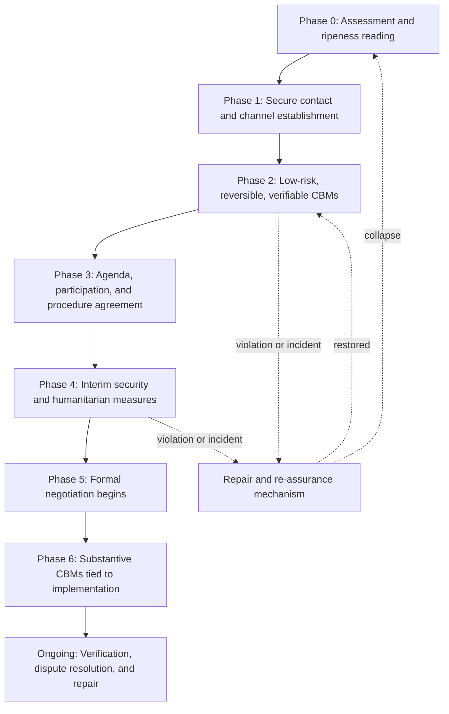
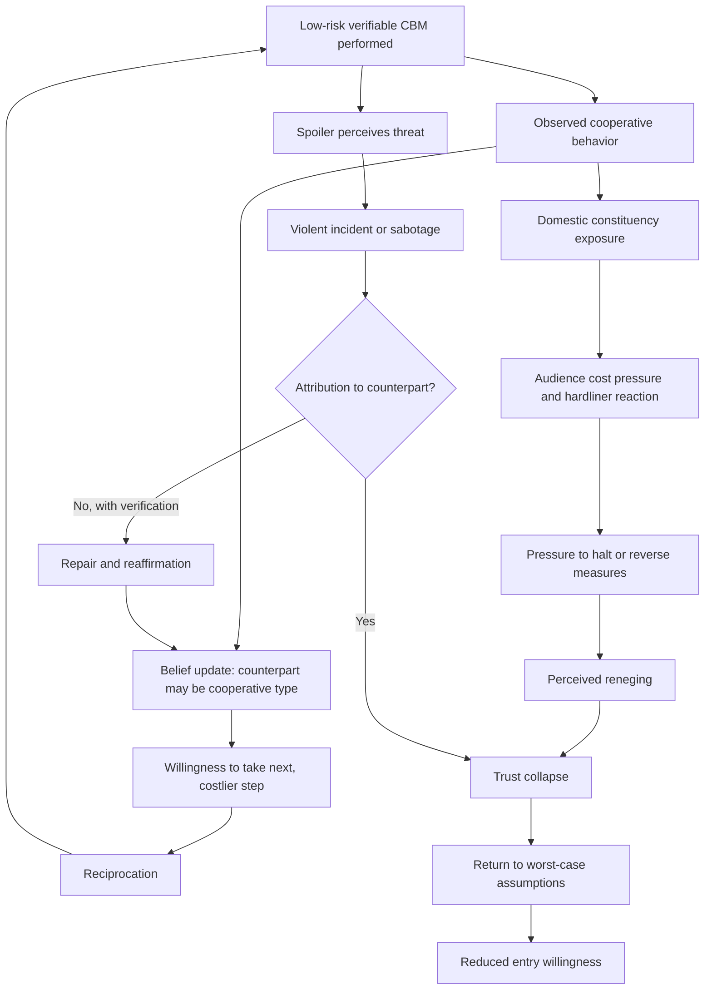

## Pre-negotiation and Confidence-Building Measure Sequencing


### Scope and Framing

This item treats the period **before formal negotiation** (pre-negotiation) and the ordered use of **confidence-building measures (CBMs)** as a *staged design problem*: how to move adversaries from a state where talks are unthinkable or unsafe to a state where substantive bargaining can begin and survive, using low-cost, reversible, verifiable steps whose ordering is itself a strategic choice. The analytical question is: which specific barriers (mutual mistrust, audience costs, misperception, commitment problems, spoiler threats) does each phase and each class of measure address, and what sequencing logic keeps the process from collapsing under exploitation, reversal, or premature ambition?

**Key Points**

- Pre-negotiation is not "talks about talks" in a trivial sense. It is the phase in which parties decide **whether to negotiate at all, with whom, on what agenda, under what rules, and with what interim security guarantees**.
- CBMs work by changing **beliefs about intentions** and **lowering the cost of being wrong**, not by resolving the underlying dispute. They are trust *instruments*, not settlements.
- **Sequencing** matters because measures differ in cost, risk, reversibility, and verifiability. A measure that is safe and credible in phase 3 may be exploitable or unbelievable in phase 1.
- Two structural risks bracket the design: **too little** (stalled process, no basis for entry) and **too much too soon** (exposure to exploitation, spoiler backlash, and collapse from a single violation).
- The evidence that CBMs *cause* durable conflict reduction, rather than merely accompany improving relations, is contested and heavily confounded by selection [Unverified as settled].

**Definitions on first use**

- **Pre-negotiation**: the phase preceding formal bargaining in which parties (and often third parties) assess feasibility, establish contact, define participants, agenda, and procedure, and decide to commit to negotiation. The concept is associated with Harold Saunders and with Janice Gross Stein's analysis of pre-negotiation.
- **Confidence-building measure (CBM)**: a reciprocal or unilateral action intended to reduce uncertainty about the other side's intentions and capabilities, lower the risk of accidental escalation, and build a track record of reliability.
- **Unilateral (initiative) CBM**: a step taken by one party without formal reciprocity, intended to signal benign intent and elicit reciprocation.
- **Reciprocal CBM**: a step whose performance is conditioned on a matching step by the counterpart.
- **Costly signal**: an action that would be unattractive for a party with hostile intent to take, and therefore credibly reveals information about type.
- **Verification**: the set of procedures by which compliance with a commitment can be observed and confirmed by the counterparty or a third party.
- **Reversibility**: the degree to which a measure can be undone or withdrawn at limited cost if the counterpart defects.
- **Security dilemma**: a situation in which one party's defensive measures reduce another's security and provoke countermeasures, producing mutual insecurity without aggressive intent. It is the structural problem many CBMs are designed to alleviate.
- **Commitment problem**: an inability to credibly promise future behavior because incentives change after the immediate bargain is struck.
- **Graduated reciprocation in tension-reduction (GRIT)**: Charles Osgood's proposed strategy of announcing and executing a series of small, verifiable unilateral concessions while inviting reciprocation and maintaining retaliatory capacity.
- **Spoiler**: a party that believes a peace process threatens its interests and uses violence or obstruction to undermine it.

---

### Pre-negotiation: Structure and Functions

#### What Pre-negotiation Accomplishes

Pre-negotiation is best treated as the resolution of a **sequence of threshold decisions** rather than a single event. Stein and Saunders' treatments describe phases in which parties move from private consideration of talks toward public commitment.

| Function | Question resolved | Failure if unresolved |
| --- | --- | --- |
| **Feasibility assessment** | Is there any plausible zone of agreement? Is the moment receptive? | Talks begin without a viable settlement space |
| **Contact establishment** | Is there a secure channel and an accepted interlocutor? | No reliable communication; misperception persists |
| **Party definition** | Who participates, and who is excluded? | Excluded spoilers; invalid spokespersons |
| **Agenda setting** | What is and is not on the table? | Talks stall on agenda disputes |
| **Procedural rules** | Venue, format, confidentiality, chair, decision rule | Disputes over process consume bargaining capital |
| **Interim security arrangements** | How is violence managed while talks proceed? | Talks collapse after a violent incident |
| **Framing and narrative** | How will participation be justified domestically? | Audience costs block entry |
| **Third-party role** | Who mediates, guarantees, or verifies? | No credible enforcement or facilitation |

#### The Entry Decision

Recall that a **mutually hurting stalemate** together with a perceived way out raises receptivity to negotiation. Pre-negotiation converts that receptivity into an actual decision to enter talks. A stylized entry condition for party $i$ is that the expected value of entering talks exceeds the expected value of continued unilateral action, net of the **entry cost** $E_i$ (audience costs, risk of appearing weak, exposure of information):

$$V_i^{\text{talks}} - E_i > V_i^{\text{continue}}$$

**Causal reading (variables and direction):**

| Variable | Change | Effect on willingness to enter talks |
| --- | --- | --- |
| $E_i$ (entry cost, including audience costs) | decreases | increases |
| Confidentiality of the channel | increases | increases (lowers $E_i$) |
| Credibility of counterpart's intention to bargain | increases | increases $V_i^{\text{talks}}$ |
| Risk of exploitation during talks | decreases | increases |
| Availability of interim security arrangements | increases | increases |

Pre-negotiation and CBMs are largely mechanisms for **lowering $E_i$** and **raising perceived credibility**, which is why they are prerequisites rather than extras in many settings.

**Model assumptions and where they break down**

- Treats each party as a **unitary decision-maker** with a single valuation. Factions with differing $E_i$ may split on entry.
- Treats $V_i^{\text{talks}}$ as **independent of the process**, whereas the process itself changes beliefs about $V_i^{\text{talks}}$.
- Assumes entry is a **discrete choice**. In practice, parties often enter incrementally through deniable contact.
- Does not capture **strategic entry**, where a party enters talks to gain legitimacy, delay, or rearm rather than to settle.

---

### Confidence-Building Measures: A Functional Typology

CBMs can be organized by the **barrier they address** rather than by category names, because design should follow diagnosis.

| Barrier | CBM class | Examples (illustrative) | Mechanism |
| --- | --- | --- | --- |
| **Uncertainty about capabilities and movements** | Transparency and information measures | Notification of exercises, data exchange, observers, open inspections | Reduces worst-case inference and surprise-attack fear |
| **Risk of accidental escalation** | Communication and crisis-management measures | Hotlines, incident-prevention protocols, liaison channels | Provides rapid channel for clarifying ambiguous events |
| **Security dilemma pressure** | Constraint and restraint measures | Force separation, demilitarized zones, deployment limits | Reduces offensive posture and warning-time compression |
| **Humanitarian and relational distrust** | Humanitarian and relational measures | Prisoner or detainee releases, family reunification, access for aid, joint memorialization | Signals benign intent at low strategic cost; builds constituencies |
| **Doubt about willingness to bargain** | Political and signaling measures | Rhetorical de-escalation, recognition gestures, release of political prisoners, public statements | Costly signals of intent to negotiate |
| **Doubt about compliance** | Verification and monitoring measures | Third-party monitors, joint verification commissions, technical monitoring | Converts promises into observable behavior |
| **Economic and functional distrust** | Cooperation and interdependence measures | Cross-border trade, shared infrastructure, joint resource management | Raises the cost of defection through interdependence |
| **Domestic audience constraints** | Domestic preparation measures | Public education, consultations, elite outreach | Lowers audience costs of concession |

These categories overlap, and a single measure often serves several functions. The classification is analytic rather than official, and terminology varies across arms-control, security, and peace-process literatures [terminology varies].

#### Properties That Govern Ordering

Each measure can be characterized along dimensions that determine where it belongs in a sequence.

| Property | Definition | Why it matters for sequencing |
| --- | --- | --- |
| **Cost of being exploited** | Loss if the counterpart defects | High-cost measures require prior trust |
| **Reversibility** | Ease of withdrawal | Reversible measures are safer early |
| **Verifiability** | Ease of confirming performance | Verifiable measures build credible track records |
| **Signal strength** | How much a measure reveals about intent | Costly signals are more informative but riskier |
| **Domestic visibility** | Exposure to audiences | Highly visible measures raise audience costs |
| **Third-party dependence** | Need for external facilitation or guarantee | Determines feasibility without mediator |
| **Dependence on prior measures** | Whether the measure presupposes earlier steps | Creates ordering constraints |
| **Effect on spoiler incentives** | Whether it provokes or restrains spoilers | Affects timing and protection needs |

**Design principle**: early measures should be **low-cost-if-exploited, reversible, verifiable, and low in domestic visibility**, while later measures can carry higher costs and stronger signals because the accumulated track record has raised the credibility of counterpart behavior.

---

### The Logic of Sequencing

#### Trust as Accumulating Belief

Model trust as a belief $\beta_t \in [0,1]$ held by party $i$ that party $j$ is a **cooperative type** (interested in settlement rather than exploitation). Observed cooperative actions update the belief. In a simple Bayesian sketch, after observing action $a_t$:

$$\beta_{t+1} = \frac{\beta_t \cdot P(a_t \mid \text{cooperative})}{\beta_t \cdot P(a_t \mid \text{cooperative}) + (1-\beta_t)\cdot P(a_t \mid \text{exploitative})}$$

The **informational value** of an action depends on the likelihood ratio $P(a_t \mid \text{cooperative}) / P(a_t \mid \text{exploitative})$. An action that an exploitative type would also readily take (because it is costless) carries a ratio near one and updates belief little. An action that an exploitative type would avoid (because it is costly or exposes vulnerability) carries a high ratio and updates belief substantially.

**Causal reading:**

| Variable | Change | Effect on trust accumulation |
| --- | --- | --- |
| Cost of the action to the actor | increases | increases informational value (stronger signal) |
| Verifiability of the action | increases | increases (belief updates on confirmed behavior) |
| Consistency of behavior over time | increases | increases |
| Ambiguity of the action's meaning | increases | decreases |
| Violation by a spoiler misattributed to the counterpart | occurs | sharp decrease in $\beta$ |

**Consequence for design**: a sequence should progress from **cheap, informative-enough actions** toward **costlier, higher-signal actions** as $\beta$ rises, so that each step is affordable given current belief and adds information that justifies the next step.

**Model assumptions and where they break down**

- Assumes **rational Bayesian updating**. Real belief updating is affected by biases, including confirmation bias and reactive devaluation (discounting concessions because of their source).
- Assumes parties classify each other into a **binary type**, while real intentions are mixed and change over time.
- Assumes observed actions can be **cleanly attributed** to the counterpart. Spoiler actions and factional behavior confound attribution.
- Ignores **asymmetric interpretation**: the same action may be read as benign by the actor and as tactical by the observer.

#### Reciprocity and Conditionality

Two design families dominate the literature:

| Design | Description | Strength | Risk |
| --- | --- | --- | --- |
| **Unilateral initiative (GRIT-style)** | One party makes announced, verifiable, small concessions and invites reciprocation while retaining retaliation capacity | Breaks stalemate over who moves first; signals intent | Exploitation; domestic backlash if not reciprocated; ambiguity about whether reciprocity is expected |
| **Conditional reciprocal exchange** | Measures are performed in matched, mutually contingent steps | Reduces exploitation risk; clarifies terms | Requires prior negotiation and trust; slow; disputes over equivalence |
| **Third-party-mediated sequencing** | A mediator or guarantor coordinates steps and verifies compliance | Provides verification and commitment support | Dependence on third-party credibility and will |
| **Parallel tracks** | CBMs proceed alongside negotiation without being contingent on it | Insulates process from single-issue setbacks | Risk of disconnect between measures and substantive progress |

Recall that a **commitment problem** arises when a party cannot credibly promise future behavior. Conditional reciprocal exchange with verification is a mechanism for **breaking the commitment problem into small, checkable increments**, each of which is individually credible even if a grand commitment is not.

#### A Sequencing Skeleton

The phases below are a **heuristic organizing structure**, not a validated law. Real processes overlap and may skip or repeat phases.



| Phase | Emphasis | Typical measures | Primary risk |
| --- | --- | --- | --- |
| **0. Assessment** | Ripeness and feasibility | Third-party consultations, private soundings, analysis of interests | Misreading ripeness |
| **1. Contact** | Secure channel, valid interlocutors | Back-channels, Track II dialogue, intermediary shuttle | Leaks; invalid spokesperson |
| **2. Low-risk CBMs** | Build initial track record | Communication links, notification, humanitarian gestures, rhetorical restraint | Exploitation; misattribution |
| **3. Framework for talks** | Agenda, participants, rules | Agreements on venue, format, confidentiality, chair, sequencing | Agenda disputes; exclusion of key actors |
| **4. Interim security** | Contain violence during talks | Ceasefire, monitoring, incident protocols, prisoner exchanges | Ceasefire violations; spoiler attack |
| **5. Formal negotiation** | Substantive bargaining | Structured talks; use of formula or single-text methods | Positional lock-in; audience costs |
| **6. Substantive CBMs** | Implementation-linked trust | Force posture constraints, verification regimes, joint institutions | Compliance disputes |

**Design consideration**: phases are **not strictly sequential**. Interim security arrangements (Phase 4) are sometimes necessary before any substantive contact can be sustained, and low-risk CBMs (Phase 2) continue throughout.

---

### Feedback Loop Structure



**Reading the loops**

- **Reinforcing loop R1 (virtuous trust)**: verified cooperative CBM → belief update → willingness for the next step → reciprocation → further verified cooperation. This is the intended dynamic.
- **Reinforcing loop R2 (audience-cost backlash)**: visible CBM → hardliner mobilization → pressure to reverse → perceived reneging → trust collapse → reduced willingness for further measures.
- **Reinforcing loop R3 (spoiler-driven collapse)**: process progress → spoiler perceives threat → violence → misattribution → trust collapse → process stall → more room for spoiler narratives.
- **Balancing loop B1 (repair)**: incident → verification and attribution mechanism → clarification of responsibility → reaffirmation → restored belief.

The design objective is to **strengthen R1 and B1 while dampening R2 and R3**, which motivates reversibility, verification, low early visibility, spoiler protection, and pre-agreed incident-handling procedures.

---

### Design Principles for Sequencing

**1. Start reversible, verifiable, and low-cost-if-exploited.** Early measures should allow a party to withdraw with limited loss and confirm performance without relying on the counterpart's word.

**2. Match signal strength to accumulated trust.** Use the likelihood-ratio logic: costly signals carry more information but require enough prior confidence to be safe. Escalate the cost and signal strength gradually.

**3. Pre-agree incident-handling and attribution.** Because violations and ambiguous events are near-certain, a **repair mechanism** (joint investigation, third-party fact-finding, hotline) should exist *before* incidents occur. This addresses the spoiler-misattribution risk.

**4. Protect against spoilers with process design.** Include, contain, or shield against actors who would sabotage early measures. Recall the spoiler typology of limited, greedy, and total spoilers, which suggests different responses.

**5. Manage audience costs deliberately.** Sequence measures so that domestic preparation precedes high-visibility steps, and consider confidentiality for exploratory phases.

**6. Prefer reciprocal and verifiable structures when trust permits, unilateral initiatives when stalemate over who moves first blocks progress.** Each has different risk profiles, and the choice depends on the level of mistrust and the credibility of retaliation capacity.

**7. Link CBMs to a credible path toward substantive negotiation without making them hostage to it.** Parallel tracks insulate measures from setbacks, while explicit linkage maintains momentum. Decide the linkage deliberately.

**8. Use third parties for verification and guarantees where bilateral credibility is insufficient.** Third-party monitoring converts promises into observable behavior, though dependence on third-party will is a risk.

**9. Design for graduated response to violations.** Pre-specify proportionate responses so a single violation does not trigger full collapse, and so that exploitation is not rewarded.

**10. Avoid over-sequencing rigidity.** Fixed step-by-step schedules can be exploited (by delaying steps) and can fail to adapt to changing conditions. Include review points and adjustment provisions.

---

### Sequencing Trade-offs

| Design choice | Advantage | Disadvantage |
| --- | --- | --- |
| **Long pre-negotiation with many CBMs** | Builds trust; reduces exploitation risk | Delay; momentum loss; opportunity for spoilers to organize |
| **Short pre-negotiation, early formal talks** | Momentum; leverages ripeness window | Talks may collapse from insufficient groundwork |
| **CBMs contingent on negotiation progress** | Incentive to progress | Setbacks in talks freeze CBMs, endangering trust |
| **CBMs independent of negotiation** | Insulation from talks' fluctuations | Weaker leverage; disconnect from substance |
| **Public CBMs** | Signal strength; constituency building | Audience costs; hardliner mobilization |
| **Confidential CBMs** | Lower entry cost; flexibility | Suspicion; leak risk; limited domestic constituency-building |
| **Unilateral initiatives** | Breaks first-mover deadlock | Exploitation risk; uncertain reciprocation |
| **Strictly reciprocal** | Symmetry; fairness | Slow; equivalence disputes |
| **Heavy third-party role** | Verification and guarantees | Dependence; perceived bias; sovereignty concerns |

---

### Cases as Evidence for Mechanisms

Cases below illustrate specific mechanisms rather than provide a survey. Characterizations are simplified, and scholarly assessments differ.

#### Mechanism: Unilateral Initiative and Reciprocation (Kennedy's American University Speech and the Partial Test Ban)

The 1963 sequence, in which a conciliatory public statement and a unilateral suspension of atmospheric testing preceded a reciprocal response and the negotiation of a limited test ban, is frequently cited as an example related to **GRIT-style unilateral initiatives**. Scholars debate how far the sequence reflected a deliberate graduated strategy and how much reflected other factors, including crisis experience and domestic and technical considerations [interpretation varies].

#### Mechanism: Crisis-Communication Infrastructure (US-Soviet Hotline and Incident-Prevention Agreements)

The establishment of direct communication links and later incident-prevention arrangements illustrates **communication and crisis-management CBMs** that reduce accidental-escalation risk without resolving underlying disputes. The mechanism is the **reduction of misperception under time pressure**, and it operated alongside broader political tensions rather than replacing them [assessments differ on causal contribution].

#### Mechanism: Transparency and Constraint Measures in Europe (Helsinki Final Act and Stockholm Document)

European security processes introduced **notification and observation of military activities** and later more stringent transparency and verification arrangements. The mechanism is **transparency reducing worst-case inference** and building a track record of compliance over repeated iterations, with measures becoming more intrusive as experience accumulated. This is often cited as an example of **gradual escalation of measure intrusiveness with accumulating trust**, though the degree to which the measures caused, rather than reflected, improved relations is contested [Unverified as settled].

#### Mechanism: Secret Channel and Staged Recognition (Israeli-Palestinian Contact Leading to Oslo)

Secret contacts progressed from unofficial exchanges to official-adjacent channels and eventually to mutual recognition letters and a declaration of principles. The case illustrates **confidential pre-negotiation lowering entry costs**, and **staged recognition as a costly signal**. It also illustrates the limits of a narrow, elite-centered, secret process, since implementation later faced spoiler violence and constituency opposition, consistent with the **audience-cost and spoiler loops** above [assessments differ].

#### Mechanism: Interim Security and Prenegotiation Ceasefire (Multiple Processes)

Processes in which ceasefires or humanitarian truces preceded or accompanied talks illustrate **interim security arrangements** as prerequisites for sustaining contact, while repeated ceasefire violations in some cases illustrate the **spoiler and misattribution loop (R3)**. Empirical work on ceasefire effects is mixed, and results depend on ceasefire design, monitoring, and context [Unverified as settled].

#### Mechanism: Third-Party Monitoring and Verification (Multiple Peace Operations)

Third-party monitoring missions, observer groups, and verification commissions illustrate **verification as converting promises into observable behavior**. The mechanism depends on monitors' access, mandate, and perceived impartiality, and effectiveness varies with the parties' cooperation and the monitors' independence [case-dependent].

#### Mechanism: Premature Escalation of Ambition

Instances in which parties attempted high-cost or high-visibility steps before sufficient trust or domestic preparation, followed by breakdown, illustrate the **too-much-too-soon risk** and audience-cost backlash (R2). Attribution of collapse to sequencing specifically, rather than to underlying interests, requires case-level analysis.

---

### Design Failure Modes

| Failure mode | Cause | Design response |
| --- | --- | --- |
| **Exploitation of early concessions** | Early measure is high-cost-if-exploited | Begin with reversible, low-exposure measures; retain retaliation capability |
| **Audience-cost backlash** | Visible steps before domestic preparation | Confidential phase; domestic outreach; framing |
| **Misattribution of spoiler violence** | Incident blamed on counterpart | Pre-agreed joint or third-party investigation; hotlines |
| **Freezing due to linkage** | CBMs contingent on stalled talks | Parallel-track design; delinked humanitarian measures |
| **Verification gap** | Compliance cannot be confirmed | Include monitoring; third-party or joint verification |
| **Non-reciprocation of unilateral initiative** | Counterpart does not respond | Time-limited initiatives; clear signaling; preserved retaliation option |
| **Equivalence disputes** | Disagreement about matching steps | Agreed metrics; mediator formulation; sequencing by categories |
| **Excessive delay** | Endless preparatory phase | Timelines; review points; ripeness monitoring |
| **Premature talks** | Insufficient groundwork | Assessment; staged entry; exploratory contacts first |
| **Exclusion of key actors** | Narrow participation | Inclusion strategy; consultations; observer roles |
| **Rigid sequencing exploited** | Schedule allows delay tactics | Flexibility clauses; conditionality; review mechanisms |
| **Symbolic-only measures** | Measures lack substantive effect | Include operational, verifiable components; measure outcomes |
| **Invalid spokesperson** | Interlocutor lacks authority | Verify mandate; involve relevant factions; strengthen internal legitimacy |
| **Third-party dependence** | Monitors or guarantors withdraw | Build local capacity; diversify third-party support |

---

### Design Checklist

**Example: Structured Questions for Designing a Pre-negotiation and CBM Sequence**

1. **Diagnose the barriers.** Identify which barriers dominate: misperception, security-dilemma pressure, audience costs, commitment problems, spoiler threats, or lack of channel.
2. **Assess ripeness and entry costs.** Estimate each party's perceived stalemate, way out, and entry costs $E_i$.
3. **Establish channels.** Determine whether confidential contact, Track II, or a mediator is appropriate and verify interlocutors' authority.
4. **Inventory candidate measures.** List CBMs by barrier addressed, and score each for cost-if-exploited, reversibility, verifiability, signal strength, visibility, and dependence on third parties.
5. **Order measures.** Sequence from low-risk to higher-signal, ensuring each step is affordable at the current level of trust.
6. **Choose reciprocity structure.** Decide between unilateral initiative, conditional reciprocal exchange, or third-party-coordinated steps.
7. **Plan for incidents.** Pre-agree incident investigation, attribution, and repair procedures, and graduated responses to violations.
8. **Address spoilers and audiences.** Plan inclusion or containment of spoilers, and domestic preparation and messaging.
9. **Decide linkage.** Specify the relationship between CBMs and formal negotiation (contingent, parallel, or hybrid).
10. **Set review and adjustment points.** Define milestones, evaluation criteria, and provisions for modifying the sequence.

**Illustrative pseudo-specification of a CBM sequencing plan**

```plaintext
CBM_SEQUENCING_PLAN:
  conflict_id: <identifier>
  parties: [A, B, ...]
  diagnosis:
    dominant_barriers: [misperception, audience_costs, security_dilemma, spoiler_threat, ...]
    ripeness_assessment: <reference to ripeness assessment record>
  channels:
    primary: <back-channel | track_2 | mediator_shuttle | direct>
    confidentiality: <rules>
    interlocutor_verification: <how authority is checked>
  measures:
    - id: <measure id>
      class: transparency | communication | constraint | humanitarian | political | verification | economic | domestic_prep
      barrier_addressed: <barrier>
      properties:
        cost_if_exploited: low|medium|high
        reversibility: low|medium|high
        verifiability: low|medium|high
        signal_strength: low|medium|high
        domestic_visibility: low|medium|high
      dependencies: [<prior measure ids>]
      reciprocity: unilateral | conditional_reciprocal | mediated
      verification_method: <monitoring approach>
      phase: 1|2|3|4|5|6
  sequencing_rules:
    escalation_criterion: <evidence required before moving to costlier measures>
    review_points: [<milestones or dates>]
    flexibility_provisions: <conditions for adjustment>
  incident_management:
    hotline_or_channel: <mechanism>
    investigation_body: <joint | third_party | mixed>
    attribution_procedure: <steps>
    graduated_responses: [<proportionate actions>]
  spoiler_management:
    identified_spoilers: [{actor, type, response}]
    protection_measures: <security, inclusion, containment>
  linkage_to_negotiation:
    mode: contingent | parallel | hybrid
    rationale: <why>
  domestic_preparation:
    audiences: [<constituencies>]
    plan: <messaging and consultation activities>
  third_party_roles:
    mediator: <identifier>
    verifier: <identifier>
    guarantor: <identifier>
```

The specification is a schematic illustration of sequencing parameters, not a standardized instrument.

---

### Limits of the Model

- **Causal identification is weak.** CBMs are adopted when relations are already improving, so observed associations between CBMs and reduced conflict are confounded by selection and reverse causality [Unverified as settled].
- **The Bayesian trust sketch is a heuristic.** Real belief updating is distorted by cognitive biases, group dynamics, and asymmetric interpretation, and intentions are rarely binary.
- **Phase structure is stylized.** Real processes are non-linear, overlapping, and reversible, and the same measure may appear in different phases across cases.
- **Measurement of trust is difficult.** Trust and confidence are internal states of decision-makers, and proxies are imperfect.
- **Context dependence.** Effective CBMs in interstate military contexts may not transfer to intrastate conflicts with fragmented actors, and vice versa.
- **Normative content.** Choices about amnesty-like gestures, prisoner releases, or recognition steps involve legitimacy and ethical considerations that a sequencing model does not resolve.
- **Third-party assumptions.** Many sequences presuppose credible monitors or guarantors, which are not always available.
- **Behavior may vary**: predicted effects depend on actors' beliefs, institutional context, and enforcement conditions, and the formal sketches above are simplifications.

---

**Conclusion**

Pre-negotiation and confidence-building measure sequencing form a **staged trust-and-entry architecture** in which the ordering of low-cost, reversible, verifiable steps addresses specific barriers: misperception, security-dilemma pressure, audience costs, commitment problems, and spoiler threats. Sequencing matters because measures differ in exploitation risk, reversibility, verifiability, and signal strength, and because trust accumulates through observed behavior rather than declarations. Effective design starts with safe, informative steps, escalates cost and signal strength as belief in the counterpart's cooperative intent rises, pre-agrees incident-handling and attribution procedures, manages audience costs and spoilers, and calibrates the linkage between CBMs and formal negotiation. The main risks are exploitation of early concessions, audience-cost backlash, misattribution of spoiler violence, and rigid or excessively delayed sequences. The empirical evidence for causal effects of CBMs is confounded by selection, which argues for cautious generalization and for treating the sequencing skeleton as a heuristic to be adapted to the case.

**Related Topics**

- Pre-negotiation theory: Stein, Saunders, and the threshold decisions of entry
- Graduated reciprocation in tension-reduction (GRIT) and unilateral initiatives
- Security dilemma dynamics and arms-control confidence-building
- Verification regimes and third-party monitoring design
- Ceasefire design, monitoring, and violation management
- Spoiler management and inclusion-exclusion trade-offs
- Audience costs and two-level games in negotiation entry
- Ripeness and mediator timing
- Back-channel and Track II dialogue as pre-negotiation instruments
- Commitment problems and third-party guarantees in staged implementation