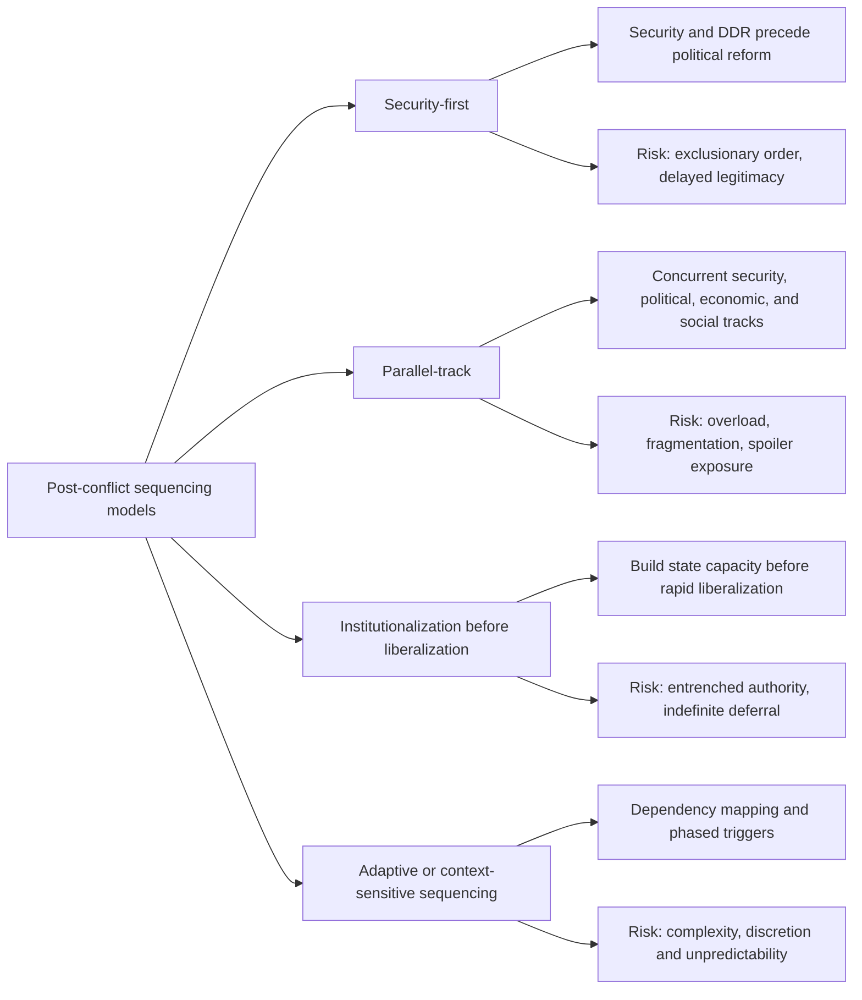
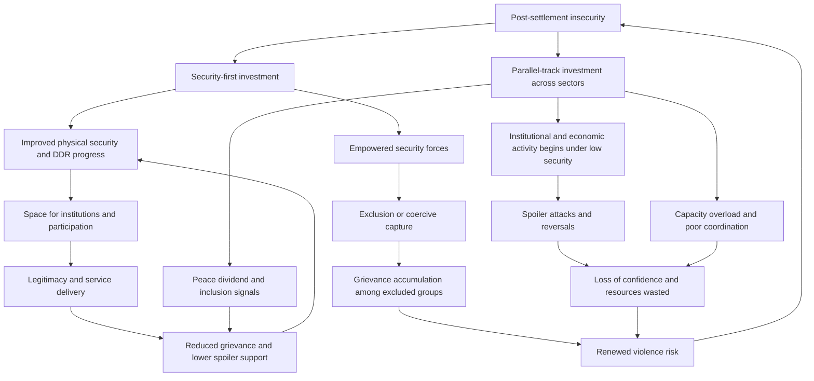

## Sequencing Peacebuilding through Security-First versus Parallel-Track Models


### Scope and Framing

This item treats the **ordering of peacebuilding functions** as a design problem under resource, capacity, and time constraints. After a settlement or ceasefire, a post-conflict society needs security, governance, justice, economic recovery, and reconciliation, and it cannot deliver all of them at once. The question is whether to **sequence** these functions (establish security and basic order first, then build institutions and participation) or to **run them in parallel** (advance security, political, economic, and social tracks simultaneously). The analytical question is: under what structural conditions does each sequencing logic close off the characteristic post-conflict failure modes (relapse into violence, illegitimate order, premature elections, spoiler capture, institutional hollowness), and what does each cost?

**Key Points**

- The debate is a trade-off between **stability-first risk containment** and **legitimacy-and-inclusion-first risk of grievance accumulation**. Neither dominates across contexts.
- Sequencing arguments rest on **dependency relationships** (some functions are prerequisites for others) and **timing windows** (some opportunities decay). Parallel-track arguments rest on **mutual reinforcement** (functions are interdependent) and **legitimacy costs of delay**.
- The strongest empirical caution against strict sequencing is that **security-first order built on exclusion can entrench the grievances that produce relapse**, while the strongest caution against strict parallelism is **overload and capacity dilution** in fragile states.
- The literature increasingly favors **context-sensitive, adaptive sequencing** with explicit dependency mapping, rather than either pure model [interpretation varies].
- Causal evidence is confounded by **selection**: interventions are deployed to conflicts of different difficulty, so raw comparisons of outcomes across models mislead [Unverified as settled].

**Definitions on first use**

- **Peacebuilding**: the set of activities aimed at consolidating peace and preventing relapse into violent conflict by addressing structural and proximate causes of conflict and building institutional and societal capacity for peaceful conflict management.
- **Security-first (sequenced) model**: an approach that prioritizes establishing physical security and state monopoly over legitimate force before, or as a precondition for, political, economic, and social reforms.
- **Parallel-track (simultaneous) model**: an approach that advances security, governance, justice, economic, and reconciliation activities concurrently, treating them as mutually dependent.
- **Institutionalization before liberalization**: a sequencing thesis associated with Roland Paris arguing that building effective state institutions should precede rapid political and economic liberalization in fragile settings.
- **Liberal peacebuilding**: the dominant post-Cold War approach promoting democratization, market reforms, and rule of law as foundations of peace.
- **Consolidation**: the phase in which a peace becomes self-sustaining, meaning that violent relapse is no longer the default expectation of major actors.
- **State monopoly on legitimate force**: the condition in which the state, rather than armed groups, is the recognized holder of coercive authority within its territory.
- **Security sector reform (SSR)**: reform of the institutions responsible for security (military, police, intelligence, oversight) toward professional, accountable, rights-respecting operation.
- **Disarmament, demobilization, and reintegration (DDR)**: the process of collecting weapons, disbanding armed formations, and supporting former combatants' return to civilian life.
- **Peace dividend**: the tangible benefits citizens perceive from peace, which sustain support for the settlement.
- **Absorptive capacity**: the ability of a state or society to effectively use external assistance and reform demands without overload.
- **Path dependence**: the property that early institutional choices constrain later options and become costly to reverse.

---

### The Functional Components to Be Sequenced

| Function | Content | Typical dependencies |
| --- | --- | --- |
| **Physical security** | Ceasefire maintenance, policing, protection of civilians, weapons control | Foundation for most other functions |
| **DDR and SSR** | Disarming, demobilizing, integrating or retiring combatants; professionalizing forces | Depends on credible political settlement and reintegration options |
| **Rule of law and justice** | Courts, policing, legal framework, transitional justice | Depends on security; shapes legitimacy |
| **Governance and public administration** | Basic service delivery, civil service, local administration | Depends on security and revenue |
| **Political process** | Constitutional design, elections, power-sharing, party formation | Depends on security and institutional baseline |
| **Economic recovery** | Livelihoods, employment, infrastructure, macroeconomic stabilization | Depends on security, governance, and confidence |
| **Reconciliation and social repair** | Truth-telling, reparations, community dialogue | Depends on security and minimal justice provision |
| **Humanitarian and basic needs** | Food, shelter, health, return of displaced | Immediate; interacts with all others |

These functions are **interdependent rather than strictly hierarchical**. Physical security is often necessary for the others, but its sustainability depends on political legitimacy and economic opportunity, which creates the circularity at the heart of the sequencing debate.

---

### The Security-First Model

#### Core Logic

The security-first argument holds that **without a baseline of physical safety and a functioning monopoly on force, other peacebuilding activities cannot take root or will be captured by armed actors**. Reforms undertaken amid insecurity are vulnerable to violence, intimidation, and reversal. The model therefore prioritizes ceasefire consolidation, DDR, policing and basic order, and control of territory, with political and economic reforms following.

#### A Formal Sketch: The Security Threshold

Let $S_t$ denote the level of security at time $t$, and let $\theta$ denote a **threshold** below which institution-building and participation activities fail with high probability. Let $I_t$ denote institutional progress, evolving as:

$$I_{t+1} = I_t + g(S_t)\cdot e_t - d\,(1 - S_t)$$

where $e_t$ is reform effort, $g(\cdot)$ is an increasing function capturing that effort is more productive under higher security, and $d$ is a decay parameter capturing destruction or reversal of institutional gains under insecurity. The security-first thesis is that below $\theta$, $g(S_t) \approx 0$ and the decay term dominates, so effort is wasted.

**Causal reading (variables and direction):**

| Variable | Change | Effect on institutional progress |
| --- | --- | --- |
| $S_t$ (security) | increases | increases productivity of reform effort ($g$ rises) |
| $S_t$ falls below $\theta$ | occurs | effort largely ineffective; reversals dominate |
| Reform effort $e_t$ under low security | increases | little effect; risk of exposing reformers |
| Decay parameter $d$ (spoiler violence, armed capture) | increases | faster loss of gains |

**Model assumptions and where they break down**

- Assumes **security is separable** from legitimacy and inclusion. In practice, security provided by an exclusionary or predatory force can itself generate insecurity for excluded groups.
- Assumes a **stable threshold $\theta$**. The threshold varies by function, actor, and location, and is not directly observable.
- Assumes **security can be provided without political settlement**, but sustainable security frequently depends on the political bargain that induces armed actors to stand down.
- Treats security as **monotone and scalar**, though it is multidimensional (physical, human, political, economic).

#### Mechanisms Supporting Security-First

| Mechanism | Description |
| --- | --- |
| **Commitment problem resolution** | Recall that a commitment problem arises when a party cannot credibly promise future behavior. In post-conflict settings, combatants fear that disarming exposes them to exploitation, so credible security guarantees and verified DDR are prerequisites for demobilization. |
| **Spoiler containment** | Establishing a monopoly of force constrains the capacity of spoilers to sabotage political and economic reforms. |
| **Protection of reformers and civil society** | Basic security allows officials, judges, and activists to operate without intimidation. |
| **Restoration of state authority** | Police and courts can function only where physical control exists. |
| **Confidence for returnees and investors** | Population return and investment depend on perceived safety. |
| **Windows of opportunity** | The immediate post-settlement period often has the highest international attention and resources, which can be directed to security. |

#### Risks and Criticisms of Security-First

| Risk | Mechanism |
| --- | --- |
| **Entrenchment of coercive actors** | Prioritizing security empowers security forces, which may capture the state and resist later reform (the "security trap"). |
| **Exclusionary order** | Order imposed by a victorious or dominant group may suppress grievances rather than resolve them. |
| **Delayed legitimacy** | Postponing political participation can deepen resentment and weaken the basis of consent. |
| **Path dependence toward authoritarianism** | Early emergency arrangements may harden into permanent structures. |
| **Neglect of root causes** | Focusing on security may defer economic and political grievances that drive conflict. |
| **Indefinite deferral** | "Security first" can become a justification for postponing reforms without end. |

---

### The Parallel-Track Model

#### Core Logic

The parallel-track argument holds that **security, governance, justice, economic recovery, and reconciliation are mutually reinforcing and that delay in any of them can undermine the others**. Security cannot be sustained without legitimate institutions and economic opportunity, and legitimacy cannot be built without visible progress on justice and inclusion. Therefore, activities should proceed concurrently, calibrated to local capacity.

#### A Formal Sketch: Mutual Reinforcement

Let $S$, $L$, and $E$ denote security, legitimacy (including political inclusion and justice), and economic opportunity, respectively. A stylized system of coupled dynamics:

$$\dot{S} = a_1 L + a_2 E - a_3 V$$


$$\dot{L} = b_1 S + b_2 E - b_3 G$$


$$\dot{E} = c_1 S + c_2 L - c_3 V$$

where $V$ represents spoiler violence and other shocks, $G$ represents grievance accumulation, and coefficients $a_i, b_i, c_i > 0$ capture reinforcing effects. The parallel-track thesis is that **each variable's growth depends on the others**, so neglecting one dampens the growth of all.

**Causal reading (variables and direction):**

| Variable | Change | Effect |
| --- | --- | --- |
| Legitimacy $L$ | increases | increases security $S$ (fewer grievances, more compliance) and economic activity $E$ |
| Economic opportunity $E$ | increases | reduces recruitment incentives, raising $S$ and $L$ |
| Security $S$ | increases | enables $L$ and $E$ |
| Spoiler violence $V$ | increases | reduces $S$ and $E$ |
| Grievance $G$ | increases | reduces $L$ |

**Model assumptions and where they break down**

- Assumes **positive coupling coefficients** across all pairs. In practice, some interactions are negative (rapid elections can increase insecurity, and market liberalization can generate inequality and unrest).
- Assumes **sufficient capacity** to advance multiple functions at once. In fragile states, absorptive capacity constraints can make simultaneous action self-defeating.
- Treats the system as **continuous and smooth**, while real transitions feature thresholds and abrupt reversals.
- Coefficients are **not empirically estimated**, and the model is a conceptual device, not a predictive equation.

#### Mechanisms Supporting Parallel-Track

| Mechanism | Description |
| --- | --- |
| **Legitimacy-security link** | Populations that perceive the settlement as fair are less likely to support spoilers or to relapse. |
| **Peace dividend timing** | Visible economic and service gains sustain support for the settlement while security is consolidated. |
| **Inclusion of potential spoilers** | Early political and economic incorporation reduces incentives to sabotage. |
| **Avoidance of authoritarian path dependence** | Building accountability alongside security limits the entrenchment of unaccountable forces. |
| **Justice and reconciliation as security inputs** | Addressing grievances and providing accountability reduces revenge dynamics. |
| **Reducing the cost of delay** | Windows for reform may close, and postponement can allow vested interests to consolidate. |

#### Risks and Criticisms of Parallel-Track

| Risk | Mechanism |
| --- | --- |
| **Overload and dilution** | Multiple simultaneous demands exceed institutional and donor capacity. |
| **Premature liberalization** | Rapid elections or market reforms can inflame divisions or empower unreformed elites (Paris's critique). |
| **Fragmentation and poor coordination** | Many actors pursuing many tracks produce duplication and inconsistency. |
| **Vulnerability to spoilers** | Reforms proceeding without security can be attacked or captured. |
| **Diffusion of priorities** | Lack of clear ordering may hinder resource allocation and accountability. |
| **Inconsistent timelines** | Tracks progress at different speeds, creating imbalances (for example, elections without functioning institutions). |

---

### Institutionalization Before Liberalization

Paris's influential thesis argues that **rapid political and economic liberalization in fragile post-conflict states can undermine peace**, because democratic competition can intensify ethnic or factional divisions and market reforms can create economic disruption and inequality, while weak institutions cannot manage the resulting tensions. The proposed remedy is to **build effective state institutions first**, then liberalize gradually.

This is best understood as a **partial-sequencing model**: it sequences *liberalization* after *institution-building*, without necessarily requiring a strict "security only" phase. It sits between pure security-first and pure parallel-track.

**Key assumptions and critiques**

- Assumes that **institutions can be built without political competition and participation**, which critics dispute since institutions require legitimacy and consent.
- Risks **entrenching unaccountable authority** if gradualism is indefinite.
- Empirical support is mixed and depends on case selection and measurement [Unverified as settled].

---

### Comparison of the Models



| Dimension | Security-first | Parallel-track | Institutionalization first | Adaptive sequencing |
| --- | --- | --- | --- | --- |
| **Core claim** | Order is prerequisite | Functions reinforce each other | Capacity before liberalization | Order depends on context |
| **Primary risk addressed** | Spoiler violence, relapse | Legitimacy deficit, grievance | Destabilizing liberalization | Mismatch of design to context |
| **Primary risk created** | Exclusion, entrenchment | Overload, dilution | Authoritarian drift | Complexity, unpredictability |
| **Capacity demand** | Concentrated in security sector | Broad, across sectors | Concentrated in state institutions | Flexible, requires strong assessment |
| **Time horizon** | Phased, security then others | Simultaneous | Phased with gradual liberalization | Iterative with triggers |
| **Legitimacy handling** | Deferred | Concurrent | Deferred for competition, earlier for administration | Calibrated |
| **Best suited to** | Acute insecurity, weak state, strong spoiler capacity | Relatively stable contexts with moderate capacity | Weak institutions with divisive politics | Heterogeneous or uncertain settings |

---

### Dependency Mapping as the Design Tool

Rather than adopting a model by label, sequencing can be treated as a **dependency-graph problem**. Define a set of peacebuilding activities $\{a_1, \dots, a_n\}$. For each pair, determine whether:

- $a_j$ is a **hard prerequisite** for $a_k$ (cannot begin or succeed without it),
- $a_j$ is a **soft enabler** (raises the probability of success of $a_k$),
- $a_j$ and $a_k$ are **mutually reinforcing** (progress on each speeds the other),
- $a_j$ and $a_k$ are **in tension** (advancing one can undermine the other in the short term).

Sequencing then involves:

1. **Ordering hard prerequisites** (for example, a basic ceasefire before DDR).
2. **Running soft enablers in parallel** where capacity permits.
3. **Managing tensions** through pacing (for example, delaying competitive national elections until minimum institutional and security conditions are met, while advancing local-level participation).
4. **Setting triggers** for progression rather than fixed calendar dates.

**Example: Illustrative Dependency Relations (heuristic, not universal)**

| Prerequisite or enabler | Dependent activity | Relation type |
| --- | --- | --- |
| Ceasefire and basic security | DDR | Hard prerequisite |
| Credible political settlement | DDR participation by armed groups | Hard prerequisite |
| DDR reintegration programs | Sustained demobilization | Soft enabler |
| Basic policing and courts | Transitional justice processes | Soft enabler |
| Functioning public administration | Service delivery, tax collection | Soft enabler |
| Electoral administration capacity | Credible national elections | Hard prerequisite |
| Security and basic administration | Economic recovery | Soft enabler |
| Economic opportunities for ex-combatants | Reintegration success | Soft enabler |
| Rapid national elections | Political stability | Tension (may destabilize if institutions weak) |
| Anti-corruption in security sector | Security sector legitimacy | Mutually reinforcing |

These relations are **context-dependent**, and dependency structures differ between cases. The table is an analytical starting point, not an empirical finding.

#### Trigger-Based Sequencing

Instead of fixed schedules, progression can be tied to **measurable conditions** ("triggers" or "benchmarks"):

- **Security triggers**: reduction in violent incidents, verified weapons cantonment, functioning policing in defined areas.
- **Institutional triggers**: functioning electoral administration, courts operating in specified regions, budget execution.
- **Political triggers**: agreement on constitutional framework, inclusion of major factions.
- **Socioeconomic triggers**: employment or livelihood indicators, service access.

**Design consideration**: triggers reduce arbitrary sequencing but create risks of **gaming** (actors manipulating indicators), **indefinite postponement** (triggers never met), and **measurement difficulty** in fragile contexts.

---

### Feedback Loop Structure



**Reading the loops**

- **Reinforcing loop R1 (virtuous security-legitimacy)**: security → space for institutions → legitimacy and services → reduced grievance → sustained security.
- **Reinforcing loop R2 (security trap)**: security-first investment → empowered security forces → exclusion or capture → grievance → renewed violence risk → renewed demand for security emphasis.
- **Reinforcing loop R3 (overload and reversal)**: parallel-track effort under low security → spoiler attacks and reversals → wasted resources and lost confidence → weakened capacity for further reform.
- **Balancing loop B1 (peace dividend)**: parallel investment → visible peace dividend and inclusion → reduced grievance → reduced spoiler support.

The design objective is to **strengthen R1 and B1 while dampening R2 and R3**, which points toward security provision that is **accountable and inclusive** (limiting the security trap) combined with **paced parallel investments** matched to absorptive capacity (limiting overload).

---

### Design Considerations: Context Diagnosis

The choice of sequencing depends on diagnosed conditions. A structured diagnosis considers:

| Diagnostic factor | Indicator | Implication for sequencing |
| --- | --- | --- |
| **Security level and spoiler capacity** | Ongoing violence, armed group cohesion, territorial control | High spoiler capacity favors stronger initial security emphasis |
| **State capacity and absorptive capacity** | Administrative reach, revenue, personnel | Low capacity favors narrower initial scope and phased expansion |
| **Legitimacy of the settlement** | Breadth of consent, inclusion of major groups | Low legitimacy raises cost of delaying political inclusion |
| **Nature of the conflict** | Identity-based versus resource-based versus ideological | Identity-based conflicts raise risks of early competitive elections |
| **Economic conditions** | Livelihood opportunities for ex-combatants | Weak economy raises DDR reintegration risk |
| **External support and duration** | Level and durability of international commitment | Short commitment horizons favor prioritization; long ones allow parallelism |
| **Security-sector character** | Professionalism, ethnic composition, accountability | Predatory forces raise the security-trap risk |
| **Regional context** | Cross-border spoilers, patron involvement | Regional volatility raises security demands |
| **Prior institutional legacy** | Existing administrative and judicial structures | Stronger legacies permit faster parallel action |

**Design principle**: sequencing is best chosen by **matching pace and ordering to the binding constraint** in the specific setting (security, capacity, legitimacy, or resources), and revisiting the choice as conditions change.

---

### Cases as Evidence for Mechanisms

Cases below illustrate specific mechanisms rather than provide a survey. Characterizations are simplified, and scholarly assessments differ.

#### Mechanism: Security-Sector Prioritization and Exclusion (Post-Conflict States with Dominant Security Forces)

Post-conflict settings in which international support concentrated on strengthening security forces, while political inclusion lagged, illustrate the **security trap (R2)**: enhanced coercive capacity coexisting with unresolved grievances and unaccountable forces. Analyses of several cases argue that security-sector empowerment without accountability reduced rather than increased long-term stability, though attribution requires case-specific analysis [assessments differ].

#### Mechanism: Early Elections and Renewed Violence (Premature Liberalization)

Cases in which national elections were held soon after settlement, before institutions or security were consolidated, are cited by Paris and others as illustrating **premature liberalization risk**: electoral competition along identity lines and losers' rejection of outcomes coincided with renewed conflict. Others counter that elections also enabled legitimacy and inclusion, and that the causal role of election timing, relative to other factors, is contested [Unverified as settled].

#### Mechanism: Integrated Multidimensional Operations (UN Multidimensional Peacekeeping)

Multidimensional peace operations combining security, political, DDR, rule-of-law, and humanitarian components illustrate a **parallel-track institutional form**. Evaluations point to contributions where operations had adequate mandate and resources and to coordination and capacity challenges where they did not. Quantitative studies of peacekeeping effectiveness report positive average effects on violence reduction, with heterogeneity across missions and contexts [interpretation varies across studies].

#### Mechanism: Sequenced State-Building with Strong Security Guarantee (Post-Conflict Reconstruction under Robust Security Presence)

Cases with substantial, sustained external security presence enabling institution-building and gradual political opening illustrate **security as an enabling condition** for other tracks. The mechanism depends on the duration and legitimacy of the external presence and on the transition plan, and long-term outcomes vary [case-dependent].

#### Mechanism: DDR Contingent on Political Settlement and Reintegration

DDR programs that succeeded or failed in different settings illustrate the **commitment-problem logic**: demobilization proceeded where combatants had credible security guarantees, political participation, and reintegration prospects, and faltered where these were absent. This supports both the security-first claim (guarantees are prerequisites) and the parallel-track claim (political and economic components are simultaneously necessary) [general pattern; specifics vary].

#### Mechanism: Peace Dividend and Grievance in Early Recovery

Cases in which visible economic and service improvements accompanied security consolidation illustrate the **peace dividend loop (B1)**, whereas cases where populations saw little material improvement despite improved security illustrate **legitimacy erosion** and vulnerability to renewed mobilization. Measurement of the dividend and its causal effect on relapse is debated [Unverified as settled].

---

### Design Failure Modes

| Failure mode | Cause | Design response |
| --- | --- | --- |
| **Security trap** | Security investment without accountability | Pair security support with oversight, civilian control, and inclusive recruitment |
| **Exclusionary order** | Security provided by or for one group | Inclusive security sector composition; community policing; grievance channels |
| **Indefinite deferral** | "Security first" without progression criteria | Time-bound plans; triggers with sunset provisions |
| **Overload** | Too many simultaneous demands | Prioritization by binding constraint; phased scope; capacity assessment |
| **Premature liberalization** | Rapid elections or market reform | Pacing; local-level participation first; institutional benchmarks |
| **Spoiler exploitation** | Reforms proceed without protection | Spoiler mapping and inclusion or containment; security for reformers |
| **Fragmented coordination** | Many actors, inconsistent efforts | Single coordinating framework; shared assessment; donor alignment |
| **Trigger gaming** | Indicators manipulated | Independent verification; multiple indicators |
| **Mismatch to context** | Template applied without diagnosis | Context assessment; adaptive planning; local ownership |
| **Legitimacy deficit** | Externally driven, low local ownership | Participation; local leadership; accountability mechanisms |
| **Peace dividend gap** | No visible benefits | Early visible recovery projects; livelihoods for ex-combatants |
| **Donor fatigue and short horizons** | Premature withdrawal | Long-term commitment planning; transition strategies; local capacity build-up |
| **Justice-security conflict** | Accountability threatens fragile deals | Sequenced or conditional accountability design (see related items on amnesty design and tribunals) |

---

### Design Checklist

**Example: Structured Questions for Selecting a Sequencing Approach**

1. **Diagnose the binding constraint.** Is the dominant barrier physical insecurity, institutional capacity, legitimacy and inclusion, or resources?
2. **Map spoiler capacity.** Identify armed actors, their cohesion and territorial control, and the incentives that would move them toward or away from compliance.
3. **Assess security-sector character.** Evaluate professionalism, accountability, and composition to gauge the security-trap risk.
4. **Estimate absorptive capacity.** Determine how many simultaneous reforms the state and society can absorb.
5. **Build the dependency graph.** Identify hard prerequisites, soft enablers, reinforcing pairs, and tensions among planned activities.
6. **Define triggers.** Specify measurable conditions for progression, with independent verification and time-bound review.
7. **Protect legitimacy.** Identify minimum inclusion and justice provisions to be advanced from the start, even under a security-first emphasis.
8. **Pace liberalization.** Sequence competitive elections and market reforms against institutional and security benchmarks, considering local-level participation earlier.
9. **Plan resource and time horizons.** Align sequencing with realistic international and domestic commitment durations.
10. **Establish coordination and adaptation.** Assign coordination responsibility and schedule reviews to adjust the sequence as conditions change.

**Illustrative pseudo-specification of a sequencing plan**

```plaintext
PEACEBUILDING_SEQUENCING_PLAN:
  context_id: <identifier>
  diagnosis:
    binding_constraint: security | capacity | legitimacy | resources
    spoiler_map: [{actor, capacity, type, response}]
    security_sector_assessment: {professionalism, accountability, composition}
    absorptive_capacity: low | medium | high
    external_commitment_horizon: <years>
  model_selected: security_first | parallel_track | institutionalization_first | adaptive
  activities:
    - id: <activity>
      function: security | ddr | ssr | justice | governance | political | economic | reconciliation | humanitarian
      dependencies:
        hard_prerequisites: [<activity ids>]
        soft_enablers: [<activity ids>]
        tensions: [<activity ids>]
      phase: <initial | consolidation | transition>
      triggers_to_advance:
        indicators: [<measurable conditions>]
        verification: <independent method>
        review_date: <date or interval>
  legitimacy_safeguards:
    minimum_inclusion: <provisions advanced from start>
    grievance_channels: <mechanisms>
    accountability_measures: <oversight of security sector>
  liberalization_pacing:
    local_participation: <timing>
    national_elections: <benchmarks required>
    economic_reforms: <sequencing and safeguards>
  coordination:
    lead_body: <identifier>
    donor_alignment: <mechanism>
    shared_assessment: <framework>
  risk_management:
    security_trap_controls: <civilian oversight, inclusive recruitment>
    overload_controls: <prioritization, phased scope>
    gaming_controls: <independent verification>
  adaptation:
    review_interval: <frequency>
    adjustment_rules: <criteria for changing sequence>
```

The specification is a schematic illustration of sequencing parameters, not a standardized instrument.

---

### Limits of the Model

- **Selection and endogeneity.** Sequencing choices correlate with conflict severity, external interest, and state capacity, so observed outcomes cannot be attributed straightforwardly to the chosen model [Unverified as settled].
- **The coupled-dynamics sketches are conceptual.** Coefficients are unspecified, and thresholds are not empirically identified.
- **Dependency structures are context-specific.** Prerequisite relations differ across cases, and generic tables risk false universality.
- **Measurement difficulty.** Security, legitimacy, and institutional capacity are hard to measure in fragile contexts, complicating triggers and evaluation.
- **Multiple definitions of success.** Absence of war, quality of peace, democratic consolidation, and human security are different outcomes that may favor different sequencing.
- **Normative content.** Trade-offs between order and inclusion, or between speed and consent, involve value judgments that models do not resolve.
- **Local agency.** Externally oriented sequencing models can underweight domestic actors' priorities and capacities.
- **Behavior may vary**: predicted effects depend on actors' beliefs, institutional context, and enforcement conditions, and the formal sketches above are simplifications.

---

**Conclusion**

The security-first versus parallel-track debate is best framed as a **choice about which risk to prioritize under binding constraints**: security-first guards against spoiler violence and the commitment problems that block demobilization, at the risk of entrenching exclusionary or unaccountable coercive institutions and deferring legitimacy, while parallel-track guards against grievance accumulation and legitimacy deficits, at the risk of overload, fragmentation, and exposure to spoilers. Intermediate positions such as institutionalization before liberalization address the specific hazard of premature competition in weak-institution settings but risk indefinite deferral of accountability. The most defensible design stance is **adaptive, dependency-mapped sequencing**: order hard prerequisites (a ceasefire and credible guarantees before DDR), run soft enablers in parallel within absorptive capacity, pace liberalization against institutional and security benchmarks, embed accountability and minimum inclusion from the outset to limit the security trap, and use verifiable triggers with time-bound review to avoid both rushed transitions and indefinite delay. The empirical evidence is confounded by selection and measurement problems, which argues for cautious generalization and continuous reassessment.

**Related Topics**

- Roland Paris and institutionalization before liberalization
- Disarmament, demobilization, and reintegration (DDR) design and the commitment problem
- Security sector reform and civilian oversight
- Spoiler management and inclusion-exclusion trade-offs
- Power-sharing and consociational arrangements in post-conflict states
- Election timing and post-conflict democratization risks
- Peacekeeping effectiveness and multidimensional mission design
- Peace dividend, livelihoods, and economic recovery in early peacebuilding
- Hybrid tribunals, amnesty design, and transitional justice sequencing
- Adaptive peacebuilding, benchmarks, and monitoring and evaluation frameworks