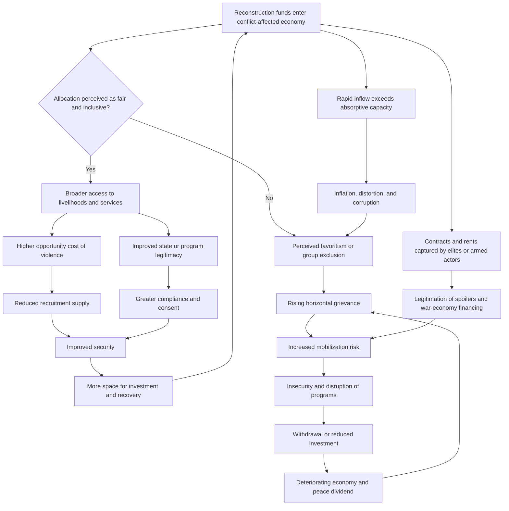
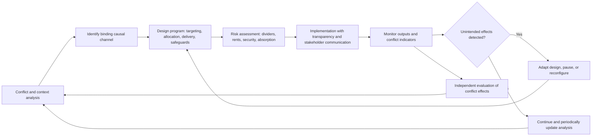

## Conflict-Sensitive Economic Reconstruction Programming


### Scope and Framing

This item treats economic reconstruction as an **intervention into a conflict system**, not a neutral technical exercise. Every reconstruction program (a road contract, a cash transfer, a credit line, a reintegration stipend, a tax reform) allocates resources, opportunities, and status in a society whose divisions were recently violent, and therefore changes the incentives, grievances, and power relations that determine whether peace holds. The analytical question is: how can economic programming be **designed, targeted, sequenced, and monitored** so that it reduces the drivers of relapse and does not create new ones, and what are the failure modes when it is treated as conflict-blind?

**Key Points**

- Conflict sensitivity means **understanding the interaction between an intervention and its context, then acting to minimize negative and maximize positive effects on the conflict**. It is a property of program design, not a sector.
- Reconstruction resources are **contested prizes** in post-conflict settings. Who receives them, through which intermediaries, and on what terms shapes perceived fairness, elite bargains, and spoiler incentives.
- Economic recovery affects peace through **several distinct causal channels** (opportunity cost of violence, grievance and horizontal inequality, state legitimacy, elite rent distribution, and shock-buffering). Programs should be designed against the channel that is actually binding.
- The evidence that economic programs *cause* peace is **mixed and context-dependent**. Several channels have contested or conditional empirical support, and well-intended programs can worsen conflict dynamics [Unverified as settled].
- The central design discipline is **do no harm plus deliberate contribution**: avoid exacerbating divisions, and where feasible, structure programs to strengthen connectors between groups.

**Definitions on first use**

- **Conflict sensitivity**: the capacity of an organization or program to understand its operating context, understand the interaction between its interventions and that context, and act on that understanding to avoid negative impacts and maximize positive ones on conflict.
- **Do no harm framework**: an analytical approach (associated with Mary B. Anderson) that examines how aid interacts with **dividers** (sources of tension) and **connectors** (sources of cohesion) in a conflict setting.
- **Horizontal inequality**: economic, social, or political inequality between culturally defined groups (ethnic, religious, regional), as distinct from inequality between individuals. Associated with Frances Stewart's work.
- **Vertical inequality**: inequality between individuals or households regardless of group membership.
- **Peace dividend**: the tangible benefits citizens perceive from the end of conflict, which sustain support for the settlement.
- **War economy**: the network of economic activities, actors, and incentives that sustain or profit from conflict, including looting, illicit trade, and predatory taxation.
- **Rent**: income above the opportunity cost of a resource, often captured through control of access, licenses, or contracts.
- **Elite capture**: the appropriation of program resources or decision-making by powerful actors at the expense of intended beneficiaries.
- **Opportunity cost of violence**: the forgone legitimate income or welfare that a person sacrifices by participating in armed conflict; higher legitimate earnings raise this cost.
- **Conflict analysis**: systematic assessment of the causes, actors, dynamics, and structures of a conflict.
- **Aid absorption (absorptive capacity)**: the ability of a recipient system to use external resources productively without overload, inflation, or distortion.
- **Dutch disease (aid or resource variant)**: the appreciation of the real exchange rate caused by large inflows, which can harm tradable sectors and undercut sustainable recovery.

---

### The Conflict-Economy Interaction: Causal Channels

Economic reconstruction affects the probability of relapse through multiple channels. Making these explicit allows programming to be matched to the actual binding constraint.

| Channel | Mechanism | Direction of intended effect | Program implication |
| --- | --- | --- | --- |
| **Opportunity cost** | Legitimate livelihoods raise the cost of joining or supporting armed groups | Higher legitimate income → lower recruitment supply | Livelihoods and employment for at-risk groups |
| **Horizontal inequality and grievance** | Perceived group-based disadvantage fuels mobilization | Reduced group-based disparity → lower grievance | Equitable geographic and group allocation; transparent criteria |
| **State legitimacy and capacity** | Visible, fair service delivery builds the state's claim to authority | Improved delivery → greater consent and compliance | Channeling through accountable institutions where feasible |
| **Elite bargaining and rent distribution** | Elites who lose rents under peace may spoil; those who gain may support | Managed access to rents → reduced spoiler incentives | Transparent contracting; inclusion of elites in legitimate economic roles |
| **Shock buffering and resilience** | Economic shocks can trigger unrest and relapse | Social protection and stabilization → reduced shock-driven mobilization | Safety nets; macroeconomic stability; food security |
| **War economy dismantling** | Illicit revenue sustains armed actors | Reduced illicit revenue → weaker armed capacity | Alternative livelihoods; regulation; anti-corruption; supply-chain controls |
| **Social cohesion and connectors** | Cross-group economic interdependence raises the cost of violence | Shared markets and institutions → stronger connectors | Inter-group cooperatives, shared infrastructure, integrated markets |
| **Trust and expectation formation** | Beliefs about future prosperity affect investment and compliance | Credible recovery path → longer time horizons | Visible early results; predictable policy |

These channels can **conflict** with one another. For instance, rapid liberalization may attract investment (supporting recovery) while also increasing horizontal inequality and displacing informal livelihoods (worsening grievance).

#### A Simple Model of Recruitment and Opportunity Cost

Consider an individual $i$ deciding whether to participate in armed activity or engage in legitimate work. A stylized participation condition:

$$\text{Participate if:} \quad p_i \cdot B_i + G_i > w_i + C_i$$

where $B_i$ is the material benefit from armed participation (pay, loot, protection), $p_i$ the probability of realizing it, $G_i$ the non-material motivation (grievance, identity, status, protection), $w_i$ the legitimate wage or livelihood income, and $C_i$ the expected cost of participation (risk of death, punishment, social sanction).

**Causal reading (variables and direction):**

| Variable | Change | Effect on likelihood of participation |
| --- | --- | --- |
| $w_i$ (legitimate income) | increases | decreases |
| $G_i$ (grievance) | increases | increases |
| $B_i$ (armed group benefits) | increases | increases |
| $C_i$ (expected cost of participation) | increases | decreases |
| Perceived unfairness of recovery allocation | increases | increases $G_i$ |

The model highlights a **design tension**: raising $w_i$ through livelihood programs reduces participation, but if the program is **perceived as unfair or as favoring rivals**, it can raise $G_i$ enough to offset the gain. Program design must therefore attend to both the *amount* of economic benefit and its *perceived distribution*.

**Model assumptions and where they break down**

- Treats individuals as **income-maximizing decision-makers**, while participation is also driven by ideology, coercion, identity, security needs, and social networks.
- Treats $w_i$ and $B_i$ as **known and comparable**, though information is incomplete.
- Ignores **collective action dynamics**: participation often depends on what others do (coordination and group pressure).
- Empirical evidence on the link between unemployment or poverty and participation is **mixed**; several studies find weak or conditional effects, and results depend on how participation, income, and context are measured [Unverified as settled].
- The model does not capture **coercive recruitment** or **security-driven** participation, where economic incentives play a minor role.

---

### Conflict Analysis as the Design Foundation

Conflict-sensitive programming begins with a structured analysis that informs every subsequent design decision.

#### Components of Analysis

| Component | Guiding questions | Design use |
| --- | --- | --- |
| **Profile** | What is the political, economic, social, and security context? | Baseline understanding |
| **Causes** | What are the structural, proximate, and trigger factors? | Identify which drivers the program can address |
| **Actors** | Who are the stakeholders, spoilers, connectors, and power-holders, and what are their interests and capacities? | Targeting, engagement, and risk mapping |
| **Dynamics** | What trends, triggers, and windows of opportunity exist? | Timing and sequencing |
| **Dividers and connectors** | What separates and what binds groups? | Program design to weaken dividers and strengthen connectors |
| **Economic geography** | Where are resources, markets, infrastructure, and grievances located? | Geographic allocation and access equity |
| **War economy mapping** | Who profits from conflict, through what channels? | Anticipate resistance; design alternatives and controls |
| **Scenarios** | How might the conflict evolve? | Contingency planning |

**Mechanism**: analysis converts a generic reconstruction program into a **context-specific intervention** by identifying the binding causal channel. A program targeting opportunity cost is misdirected if the binding driver is horizontal inequality, and vice versa.

---

### Sources of Conflict Risk in Economic Programming

Economic programs interact with conflict through **resource transfers** and **implicit messages**. The Anderson framework identifies these as two mechanisms: resource transfers alter incentives and power directly, and implicit ethical messages signal values and legitimacy.

| Risk source | Mechanism | Example dynamic |
| --- | --- | --- |
| **Targeting and beneficiary selection** | Perceived favoritism toward one group or area | Program seen as rewarding one side, fueling grievance |
| **Geographic allocation** | Unequal distribution across regions | Neglected regions perceive marginalization |
| **Contracting and procurement** | Contracts captured by connected elites or armed actors | Rent capture; legitimizing spoilers; corruption |
| **Diversion and taxation** | Resources taxed or stolen by armed groups | Aid sustains the war economy |
| **Market distortion** | Aid inflows alter prices, wages, or land values | Inflation; displacement of local producers; Dutch disease |
| **Land and property issues** | Reconstruction on contested land; return conflicts | Property disputes ignite violence |
| **Labor and employment practices** | Hiring patterns favor certain groups | Perceived exclusion from jobs |
| **Parallel structures** | External bodies bypass state institutions | Undermines state legitimacy and capacity |
| **Speed and visibility** | Rapid disbursement without safeguards | Corruption; poor targeting; capture |
| **Security exposure** | Program staff and beneficiaries become targets | Violence against project participants |
| **Elite rent disruption** | Reforms threaten existing rents | Spoiler mobilization |
| **Reintegration incentives** | Benefits to ex-combatants perceived as rewarding violence | Resentment among war-affected civilians |
| **Debt and conditionality** | Macroeconomic conditions constrain social spending | Austerity impacts on vulnerable groups |
| **Information and messaging** | Communication implies bias or triumph | Reinforces divisions |

#### The Reintegration Fairness Problem

Reintegration programs illustrate the **fairness dilemma**: targeting ex-combatants can reduce recruitment risk and address a genuine security need, but focusing benefits on those who fought can generate resentment among victims and non-combatants who received less. **Community-based reintegration**, which extends benefits to receiving communities, is a common design response, at the cost of diluting benefits to the target group [design trade-off].

---

### Design Principles

#### 1. Base Programming on Ongoing Conflict Analysis

Conduct analysis before program design and **update it regularly**, since dividers, connectors, and actors shift. Treat analysis as an iterative process, not a one-time document.

#### 2. Address the Binding Channel

Match the intervention to the causal channel most relevant in context (opportunity cost, horizontal inequality, legitimacy, rent distribution, shock buffering). Multi-channel programs should specify expected interactions and potential trade-offs.

#### 3. Ensure Perceived and Actual Fairness in Allocation

- Use **transparent, publicly communicated criteria** for targeting and allocation.
- Balance **need-based** and **conflict-risk-based** targeting, and be explicit about the rationale.
- Monitor **horizontal distribution** (by group and region) as well as aggregate outcomes.
- Avoid the perception that benefits reward violence or favor a victor.

**Mechanism**: perceived fairness affects the grievance term $G_i$ in the participation model and the legitimacy of the state or program. Objective fairness without perceived fairness can be insufficient, and communication is part of the design.

#### 4. Strengthen Connectors and Reduce Dividers

- Design **inter-group economic interdependence** (shared markets, cooperatives, joint infrastructure, integrated value chains).
- Avoid structures that **reinforce segregation** or create parallel systems along conflict lines.
- Be cautious that forced or superficial integration can provoke backlash; connectors work when they offer genuine mutual benefit.

Recall that **cross-cutting cleavages** stabilize conflict systems by giving actors overlapping loyalties and interests. Economic programs can create cross-cutting interests (for example, a trade route requiring cooperation among groups), and this is a design objective rather than an accident.

#### 5. Work Through and Strengthen State Institutions Where Legitimate and Feasible

Parallel delivery systems can deliver quickly but weaken state legitimacy and capacity over time. Channeling through state and local institutions builds legitimacy, provided the institutions are accountable and not captured. The choice involves a **speed-versus-legitimacy trade-off** and depends on institutional capacity and integrity.

#### 6. Control Rents, Corruption, and Diversion

- Apply **transparent procurement**, independent audit, and public reporting.
- Use **third-party monitoring** where access is restricted.
- Map and manage **payments to armed actors** and avoid inadvertently financing them (through checkpoints, taxation, or contracting).
- Consider **beneficial ownership** transparency for contractors.

#### 7. Sequence and Pace Within Absorptive Capacity

Recall from the security-first versus parallel-track discussion that overload and premature reforms are common failure modes. Economic programs should be **paced to security conditions and institutional capacity**, with early visible deliverables that provide peace dividend signals while longer-term reforms are prepared.

#### 8. Balance Speed and Deliberation

Quick impact projects can build confidence, but haste can compromise targeting and create capture. Design **tiered timelines**: rapid, low-risk, visible programs alongside slower structural reforms.

#### 9. Protect Local Markets and Livelihoods

- Procure locally where it does not create capture or inflate prices.
- Avoid **aid-induced market distortion** (for example, free distribution of goods that displaces local producers).
- Manage **macroeconomic effects** of large inflows (exchange rate, inflation).

#### 10. Address Land, Property, and Return Issues

Land and property disputes are frequent flashpoints. Reconstruction, resettlement, and infrastructure projects should incorporate **land tenure assessment**, **dispute resolution mechanisms**, and **safeguards against forced displacement or elite land capture**.

#### 11. Integrate Security and Do-No-Harm Risk Management

Assess risks to staff, beneficiaries, and communities, and design mitigation. Consider that **visibility can be a risk** (for example, beneficiaries becoming targets), and **program withdrawal or suspension criteria** should be defined.

#### 12. Monitor Conflict Effects, Not Only Outputs

Include **conflict-sensitive indicators** and feedback mechanisms to detect unintended effects early, and **adapt** programming.

---

### Programming Areas and Their Conflict-Sensitivity Considerations

| Programming area | Typical activities | Conflict-sensitivity considerations |
| --- | --- | --- |
| **Livelihoods and employment** | Cash-for-work, skills training, microenterprise, agricultural support | Fair inclusion across groups; avoid reinforcing group-based exclusion; match training to actual market demand |
| **Reintegration of ex-combatants** | Cash or in-kind support, vocational training, community-based reintegration | Fairness relative to civilians and victims; community-level benefits; avoid stigma; links to security conditions |
| **Infrastructure reconstruction** | Roads, water, energy, housing | Equitable geographic allocation; contracting integrity; land issues; security of workers |
| **Public financial management and fiscal reform** | Budgeting, revenue mobilization, transparency | Regional and group equity in allocations; rent-disruption risks; political economy of taxation |
| **Private sector and investment** | Business environment reform, investment promotion, credit | Rent capture by elites; extractive-sector governance; inclusion of conflict-affected populations |
| **Natural resource governance** | Transparent management of extractives, land, water | Revenue sharing; local benefit; control of illicit flows; community consent |
| **Social protection and safety nets** | Cash transfers, food security, public works | Targeting fairness; timing before shocks; administrative capacity |
| **Financial sector recovery** | Banking, credit, remittance channels | Access equity; anti-money-laundering vs. informal remittance dependence |
| **Trade and market integration** | Cross-border trade, market rehabilitation | Illicit trade controls; connector potential; distributional effects |
| **Local economic development** | Community-driven development, local government financing | Local elite capture; inclusion of marginalized groups; alignment with state structures |
| **Reparations and restitution** | Property restitution, compensation | Integration with justice mechanisms; fairness among victim groups; fiscal sustainability |
| **Debt and macroeconomic policy** | Stabilization, debt relief, donor coordination | Austerity effects on social spending; sequencing with recovery |

#### Community-Driven Development: A Case of Contested Evidence

Community-driven development (CDD) programs aim to build local institutions and cohesion by giving communities control over small-scale project funds. Proponents argue that CDD can strengthen **social cohesion and local governance**, while evaluations of some programs find **limited or context-dependent effects on cohesion and conflict outcomes**, with risks of elite capture and inconsistent scale [Unverified as settled]. The design lesson is that CDD is a **hypothesis-bearing intervention** whose conflict effects should be tested and monitored rather than assumed.

---

### Feedback Loop Structure



**Reading the loops**

- **Reinforcing loop R1 (virtuous recovery)**: fair, inclusive allocation → livelihoods and legitimacy → higher opportunity cost of violence and greater consent → improved security → more space for recovery.
- **Reinforcing loop R2 (grievance spiral)**: perceived unfairness → horizontal grievance → mobilization risk → insecurity → withdrawal and economic decline → deepened grievance.
- **Reinforcing loop R3 (rent capture)**: contracts captured by elites or armed actors → spoilers legitimized and financed → increased mobilization risk → further insecurity.
- **Balancing loop B1 (absorption limits)**: large inflows → inflation and corruption → declining program effectiveness → pressure to slow or reconfigure disbursement.

The design objective is to **strengthen R1 while dampening R2, R3, and the overload channel**, through fairness-oriented allocation, rent control, and absorption-aware pacing.

---

### Conflict-Sensitive Program Cycle



**Mechanism**: the cycle treats conflict sensitivity as **continuous adaptive management**, since the conflict context changes and program effects are uncertain. The feedback path from monitoring to design is the operational core.

---

### Monitoring and Indicators

Conflict-sensitive monitoring extends beyond output and outcome indicators to capture interactions with the conflict.

| Indicator category | Example indicators (illustrative) | Measurement concern |
| --- | --- | --- |
| **Access and fairness** | Distribution of benefits by group, region, and gender; perception of fairness | Requires disaggregated data; group categorization can itself be sensitive |
| **Grievance and perception** | Surveys of perceived favoritism, trust in institutions, sense of inclusion | Response bias; security constraints on surveying |
| **Security effects** | Incidents affecting program staff or beneficiaries; local violence trends | Attribution to program versus background trends |
| **Economic effects** | Local prices, wages, employment, market activity | Confounding by macro trends; data scarcity |
| **Rent and integrity** | Procurement transparency, audit findings, diversion incidents | Underreporting; limited access |
| **Cohesion and connectors** | Cross-group economic interaction, joint participation | Superficial participation versus genuine interdependence |
| **State legitimacy** | Perceptions of state performance and accountability | Political sensitivity |
| **Spoiler dynamics** | Actions by actors whose rents are affected | Limited visibility |

**Design consideration**: conflict indicators should be **few, actionable, and tied to decision points** (triggers for adaptation), rather than exhaustive. Group-disaggregated data collection can be politically sensitive in contexts where group categorization is contested, and data protection is a safety issue.

---

### Cases as Evidence for Mechanisms

Cases below illustrate specific mechanisms rather than provide a survey. Characterizations are simplified, and scholarly assessments differ.

#### Mechanism: Horizontal Inequality and Mobilization (Multiple Conflict Settings)

Cross-national and case-based analyses in the Stewart tradition find that **group-based economic and political inequalities** are associated with greater risk of violent mobilization, more consistently than vertical inequality. This supports **monitoring and correcting group-level allocation disparities** in reconstruction. The strength of the association varies with how groups and inequality are measured and with political context [Unverified as settled].

#### Mechanism: Aid and the War Economy (Aid Diversion Cases)

Documented instances in which aid or reconstruction resources were taxed, diverted, or captured by armed actors illustrate the **war-economy financing channel**, and Anderson's do-no-harm work catalogs how aid can prolong conflict through resource transfers. The general pattern is that access negotiations, checkpoints, and subcontracting can channel resources to armed groups, motivating **third-party monitoring and diversion controls** [case-dependent].

#### Mechanism: Reintegration Programs and Fairness (DDR Programs)

DDR and reintegration experiences illustrate that **support limited to ex-combatants can generate resentment** among war-affected civilians, leading to design shifts toward **community-based reintegration**. Evidence on the effect of reintegration support on relapse and recidivism is mixed and depends on program quality, security context, and measurement [interpretation varies].

#### Mechanism: Cash Transfers and Conflict Effects

Studies of cash transfer and public works programs in fragile settings report **heterogeneous effects on conflict and violence**, with some finding reductions in certain forms of violence or improved welfare and others finding neutral or adverse effects depending on targeting, local political economy, and the presence of armed actors who can extract or capture transfers. This illustrates the importance of **local political-economy analysis** before assuming positive effects [Unverified as settled].

#### Mechanism: Extractive Resource Governance and Revenue Sharing

Post-conflict settings with significant natural resource wealth illustrate **rent distribution as a peace-relevant variable**: resource revenue sharing arrangements and transparency initiatives are used to reduce grievance and spoiler incentives, while poorly governed resource sectors can finance renewed conflict. The literature on resource wealth and conflict is contested regarding causal mechanisms and generalization [Unverified as settled].

#### Mechanism: Speed versus Legitimacy in Reconstruction Delivery

Reconstruction efforts that relied heavily on external contractors and parallel implementation structures delivered quickly in some cases but were criticized for **weakening state legitimacy and capacity**, high overhead, and limited local ownership, while state-led delivery with insufficient capacity faced delays and corruption risks. This illustrates the **speed-legitimacy trade-off** and the case-specific character of the optimal balance [assessments differ].

#### Mechanism: Land and Property Disputes as Flashpoints

Return and reconstruction processes in which property and land claims were unresolved or manipulated illustrate how **economic programming can trigger renewed disputes** when tenure is contested, and how restitution and dispute-resolution mechanisms became integral to reconstruction [general pattern; specifics vary].

---

### Design Failure Modes

| Failure mode | Cause | Design response |
| --- | --- | --- |
| **Perceived favoritism** | Opaque or biased targeting and allocation | Transparent criteria; disaggregated monitoring; communication |
| **Regional neglect** | Allocation concentrated in accessible or favored areas | Explicit geographic equity analysis; access strategies for insecure areas |
| **Rent capture** | Elite or armed-actor control of contracts | Competitive, transparent procurement; audit; beneficial-ownership checks |
| **Financing armed actors** | Diversion, taxation, or protection payments | Third-party monitoring; supply-chain controls; access negotiation safeguards |
| **Market distortion** | Aid inflows disrupt prices and local producers | Local procurement where appropriate; cash versus in-kind analysis; macro coordination |
| **Parallel-structure dependence** | Bypassing state institutions | Capacity building and gradual handover; hybrid delivery |
| **Reintegration resentment** | Benefits perceived as rewarding violence | Community-based approaches; benefits for affected civilians; communication |
| **Overload and poor absorption** | Volume exceeds capacity | Pacing; prioritization; capacity assessment; sequencing |
| **Land and property flashpoints** | Ignoring tenure disputes | Land assessments; restitution and dispute mechanisms; safeguards |
| **Security targeting of participants** | Visibility of beneficiaries or staff | Risk assessment; discretion; protection measures; suspension criteria |
| **Spoiler backlash** | Reforms threaten rents without alternatives | Spoiler mapping; alternative legitimate roles; phased reform |
| **Monitoring blind spots** | Output focus without conflict indicators | Conflict-sensitive indicators; feedback and adaptation loops |
| **Static analysis** | One-time conflict analysis | Regular updates; scenario planning; adaptive management |
| **Donor fragmentation** | Uncoordinated funders with inconsistent approaches | Coordination platform; shared analysis; common standards |
| **Austerity shocks** | Macroeconomic conditionality undermines social spending | Coordination with fiscal policy; protect essential social expenditures |

---

### Design Checklist

**Example: Structured Questions for Conflict-Sensitive Economic Programming**

1. **Analyze the conflict.** What are the causes, actors, dividers, connectors, and dynamics, and how does the war economy operate?
2. **Identify the binding channel.** Is the priority opportunity cost, horizontal inequality, legitimacy, rent distribution, shock buffering, or war-economy dismantling?
3. **Map winners and losers.** Who benefits and who loses from the proposed program, including elites whose rents are affected?
4. **Design targeting and allocation.** Are criteria transparent, defensible, and monitored by group and region?
5. **Assess delivery channels.** Should delivery use state, local, NGO, or private channels, and what are the legitimacy, capacity, and capture trade-offs?
6. **Control rents and diversion.** Are procurement, audit, and monitoring systems adequate, and are payments to armed actors managed?
7. **Evaluate market effects.** Could inflows distort prices, wages, or exchange rates, and how will absorption be paced?
8. **Address land and property.** Are tenure issues assessed and dispute-resolution mechanisms in place?
9. **Plan connectors.** Are there opportunities for genuine cross-group economic interdependence, without forcing artificial integration?
10. **Assess security and safeguards.** What are the risks to staff and beneficiaries, and what suspension or adaptation criteria apply?
11. **Define conflict-sensitive monitoring.** Which indicators, feedback mechanisms, and decision triggers will be used, and how is sensitive data protected?
12. **Coordinate and adapt.** How will donors and implementers align, and how often will analysis and design be reviewed?

**Illustrative pseudo-specification of a conflict-sensitive program design record**

```plaintext
CONFLICT_SENSITIVE_PROGRAM_DESIGN:
  program_id: <identifier>
  sector: livelihoods | reintegration | infrastructure | fiscal | private_sector | resources | social_protection | other
  conflict_analysis:
    reference: <analysis document and date>
    dividers: [<list>]
    connectors: [<list>]
    key_actors: [{actor, interest, capacity, spoiler_risk}]
    war_economy_notes: <summary>
    binding_channel: opportunity_cost | horizontal_inequality | legitimacy | rents | shock_buffering | war_economy | cohesion
  targeting_and_allocation:
    criteria: <transparent criteria>
    group_and_region_balance: <approach and monitoring>
    perceived_fairness_measures: <communication plan>
  delivery:
    channel: state | local_government | ngo | private | mixed
    rationale: <speed versus legitimacy assessment>
    capacity_building_plan: <handover approach if parallel structures used>
  integrity_controls:
    procurement: <competitive and transparent process>
    audit_and_monitoring: <third-party or independent>
    diversion_controls: <measures against armed-actor capture>
  market_and_macro:
    absorption_assessment: <capacity and pacing>
    distortion_risks: <prices, wages, exchange rate>
    mitigation: <local procurement, cash versus in-kind analysis>
  land_and_property:
    assessment: <tenure issues>
    dispute_mechanism: <process>
  security_and_safeguards:
    risks_to_staff_and_beneficiaries: <assessment>
    mitigation: <measures>
    suspension_criteria: <conditions>
  connectors:
    design_features: <inter-group interdependence features>
  monitoring:
    output_indicators: [<list>]
    conflict_indicators: [<list>]
    data_protection: <safeguards for sensitive data>
    adaptation_triggers: <conditions for redesign or pause>
  coordination:
    donor_platform: <mechanism>
    shared_standards: <references>
  review:
    interval: <frequency>
    responsible_party: <identifier>
```

The specification is a schematic illustration of design parameters, not a standardized instrument.

---

### Limits of the Model

- **Causal evidence is thin and heterogeneous.** Effects of economic programs on conflict depend on context, program design, and measurement, and many findings are not robust across settings [Unverified as settled].
- **Conflict sensitivity is procedural more than predictive.** The framework improves attention to interactions but cannot guarantee that unintended effects will be foreseen.
- **The participation model is a simplification.** It omits coercion, identity, security-driven participation, and collective action dynamics.
- **Group categorization is itself sensitive.** Disaggregating by group can reinforce divisions or endanger respondents in some contexts.
- **Political economy limits technical design.** Elite interests, donor priorities, and government preferences may constrain feasible options regardless of analytical merit.
- **Attribution problems.** Isolating a program's effect on conflict from concurrent security, political, and macroeconomic changes is methodologically difficult.
- **Normative content.** Trade-offs between fairness, efficiency, speed, and reward for combatants involve value judgments that technical frameworks do not resolve.
- **Behavior may vary**: predicted effects depend on actors' beliefs, institutional context, and enforcement conditions, and the formal sketches above are simplifications.

---

**Conclusion**

Conflict-sensitive economic reconstruction programming treats every economic intervention as an **intervention in a conflict system**, one that transfers resources, signals values, and shifts incentives among groups with recent experience of violence. Economic recovery can support peace through several channels (opportunity cost of violence, reduced horizontal inequality, state legitimacy, managed elite rents, and shock buffering), but these channels can conflict, and poorly designed programs can worsen grievances, finance armed actors, distort markets, or trigger land disputes. Effective design begins with ongoing conflict analysis that identifies the binding causal channel, applies transparent and monitored allocation to preserve perceived and actual fairness, controls rents and diversion, paces inflows to absorptive capacity, builds genuine cross-group economic connectors, and monitors conflict effects with adaptive triggers rather than tracking outputs alone. The empirical basis linking economic programs to peace outcomes remains mixed and context-dependent, which argues for treating program designs as hypotheses to be tested and revised.

**Related Topics**

- Do no harm framework: dividers, connectors, and resource transfers
- Horizontal inequality and group-based grievance
- DDR reintegration design and community-based approaches
- War economies and illicit finance in conflict-affected states
- Natural resource governance, revenue sharing, and transparency
- Community-driven development: evidence and design
- Aid absorption, Dutch disease, and macroeconomic management
- Land tenure, restitution, and property dispute resolution
- Social protection and cash transfers in fragile settings
- Monitoring and evaluation of peacebuilding programs