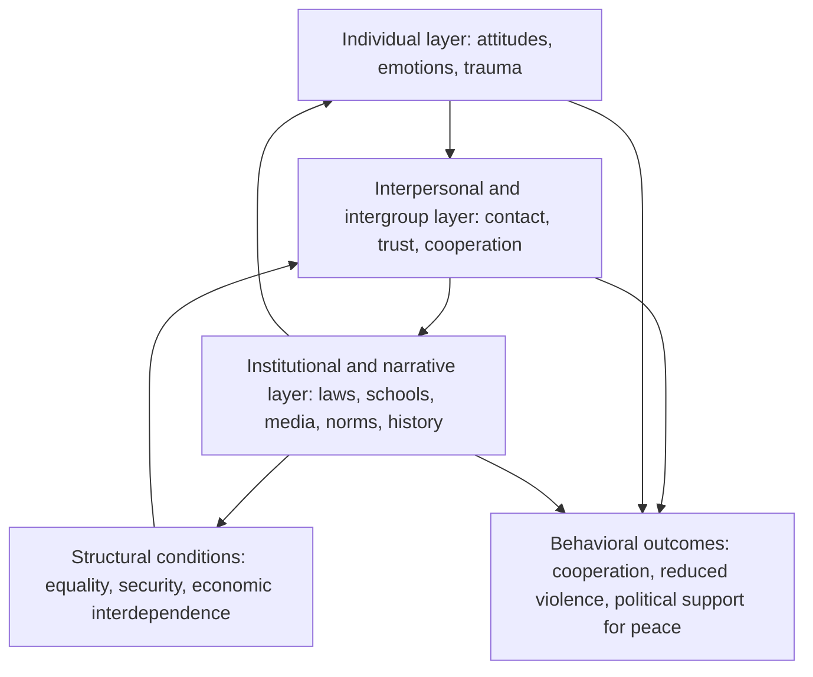
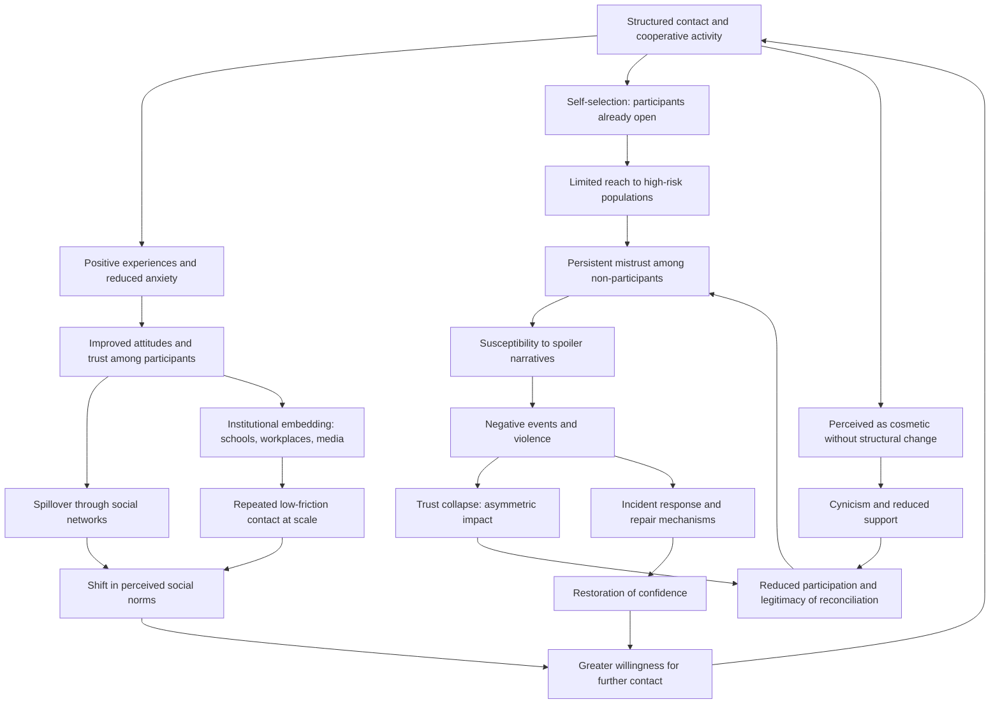

## Reconciliation Program Design for Intergroup Trust Rebuilding at Scale


### Scope and Framing

This item treats reconciliation as a **designable social-psychological and institutional process**: a set of interventions intended to change how members of formerly warring groups perceive, feel toward, and behave toward one another, and to sustain those changes across a whole society rather than only among program participants. The analytical question is: through which causal mechanisms does contact, dialogue, acknowledgment, or shared activity shift intergroup attitudes and behavior, why do effects measured in small programs so often fail to propagate to national level, and what design features (targeting, dosage, mediated diffusion, institutional embedding, sequencing with material and justice measures) address the **scaling gap**?

**Key Points**

- Reconciliation is best modeled as **changes in three coupled layers**: individual attitudes and emotions, interpersonal and intergroup relations, and the institutional and narrative environment that rewards or punishes cooperation. Programs that act only on the first layer rarely sustain effects.
- **Contact** between groups can reduce prejudice under specific conditions, but effects on *attitudes toward the outgroup as a whole* do not automatically translate into effects on *political positions, structural change, or violence*. This is the **attitude-behavior and attitude-structure gap**.
- Scale introduces a distinct problem: most well-evidenced programs are **small, voluntary, and self-selected**, so the participants are disproportionately those already open to reconciliation, and the population that matters most for relapse risk is least reached.
- Design levers for scale include **mass-media diffusion, institutional embedding (schools, workplaces, local government), norm-shifting through social networks, and structural reforms that create sustained cooperative interdependence**, each with distinct evidence and risk profiles.
- The evidence base is **uneven and frequently confounded**: many findings come from short-term, self-report measures in lab-like or NGO-run settings, with limited long-term behavioral or violence outcomes [Unverified as settled].

**Definitions on first use**

- **Reconciliation**: a process by which formerly antagonistic groups move from hostility toward a relationship capable of coexistence or cooperation, involving changes in attitudes, behavior, and institutions. Definitions vary from thin (non-violent coexistence) to thick (mutual trust, shared identity, restored relationships).
- **Intergroup trust**: a group member's willingness to be vulnerable to outgroup members based on positive expectations about their intentions and behavior.
- **Contact hypothesis**: the proposition, associated with Gordon Allport, that under conditions of equal status, common goals, cooperation, and institutional support, intergroup contact reduces prejudice.
- **Extended contact**: the reduction in prejudice that occurs when an individual knows that an ingroup member has a close relationship with an outgroup member.
- **Vicarious (mediated) contact**: exposure to positive intergroup interactions through media or narrative rather than direct interaction.
- **Superordinate identity**: a shared inclusive category (for example, a national identity) that encompasses both groups.
- **Common ingroup identity model**: the proposition that recategorizing separate groups into a single inclusive group reduces bias, associated with Gaertner and Dovidio.
- **Collective narrative**: the shared account a group holds of its history, victimhood, and responsibility, which shapes interpretation of the other side.
- **Competitive victimhood**: the tendency of groups to contest which has suffered more, which can block acknowledgment of the other side's suffering.
- **Intergroup apology and acknowledgment**: public recognition by a group or its representatives of harm done to another group.
- **Collective guilt**: an emotion experienced by ingroup members regarding harm caused by the ingroup, which can motivate reparative action or defensive denial depending on context.
- **Social norm**: a shared expectation about typical or appropriate behavior in a group, which can sustain or suppress intergroup cooperation independent of private attitudes.
- **Scaling gap**: the difference between effects demonstrated in small, controlled interventions and effects achieved when a program is expanded to a large, heterogeneous, less self-selected population.
- **Dosage**: the intensity, duration, and frequency of exposure to an intervention.
- **Spillover (diffusion)**: the transmission of an intervention's effects from direct participants to non-participants through social networks or institutions.

---

### Causal Mechanisms of Reconciliation

Reconciliation programs act through several distinct mechanisms. Design should specify which mechanism is targeted and which measure would detect its operation.

| Mechanism | Description | Typical intervention | Failure signature |
| --- | --- | --- | --- |
| **Contact-based prejudice reduction** | Positive interaction reduces anxiety, increases empathy and knowledge of the outgroup | Structured intergroup meetings, joint projects, integrated schooling | Effects limited to participants; no generalization to the outgroup as a category |
| **Perspective-taking and empathy** | Understanding the other side's experiences and emotions | Dialogue, narrative exchange, testimony | Empathy for individuals without change in group-level judgments |
| **Common identity formation** | Recategorization toward inclusive identity | National symbols, shared institutions | Threat to subgroup identity provokes backlash |
| **Acknowledgment and apology** | Recognition of harm reduces grievance and restores dignity | Truth-telling, official apology, memorialization | Perceived as insincere; triggers defensive denial |
| **Narrative revision** | Changing group histories to include the other side's suffering | History curricula, joint history projects, media | Resistance from groups whose identity depends on the existing narrative |
| **Cooperative interdependence** | Shared goals require cross-group cooperation | Joint economic ventures, shared infrastructure | Cooperation instrumental only; reverts when incentives change |
| **Norm change** | Altering perceived social acceptability of intergroup hostility or cooperation | Media, role models, community leadership | Private attitudes unchanged; norm reverts without reinforcement |
| **Emotion regulation and trauma healing** | Reducing trauma-driven hostility, fear, and mistrust | Psychosocial support, trauma-informed programs | Group-level effects not achieved; individual healing not linked to relations |
| **Structural and institutional reform** | Removing discriminatory institutions and creating equitable rules | Legal equality, inclusive governance, equitable resource allocation | Attitudes improve while structures remain unjust, creating cynicism |

Recall that **cross-cutting cleavages** reduce conflict by giving individuals overlapping loyalties. Reconciliation designs that create cross-cutting memberships (mixed workplaces, integrated associations) work partly through this structural channel and not only through attitude change.

#### A Layered Model



**Reading the layers**: reconciliation is sustained when the three layers **reinforce each other**. A change confined to the individual layer decays if institutions and norms reward hostility, and institutional change without interpersonal trust may produce formal compliance without genuine reconciliation.

---

### A Formal Sketch: Trust Dynamics and Diffusion

#### Trust as an Evolving Belief

Recall that trust can be modeled as a belief about the counterpart's cooperative disposition. At the group level, consider a population of members of group A with average trust $\tau_t$ toward group B at time $t$. A stylized dynamic:

$$\tau_{t+1} = \tau_t + \alpha\, C_t\,(1 - \tau_t) - \beta\, V_t\,\tau_t + \gamma\,(\bar{\tau}_{\text{network},t} - \tau_t)$$

where:

- $C_t$ is the **rate of positive, credible intergroup contact** experienced by the population (direct, extended, or mediated),
- $V_t$ is the **rate of negative events** (violence, discrimination, provocation) experienced or perceived,
- $\bar{\tau}_{\text{network},t}$ is the average trust among an individual's social contacts (peer influence),
- $\alpha,\beta,\gamma$ are positive parameters governing sensitivity to positive contact, negative events, and social conformity.

**Causal reading (variables and direction):**

| Variable | Change | Effect on group-level trust |
| --- | --- | --- |
| $C_t$ (positive contact) | increases | increases (with diminishing returns as $\tau_t \to 1$) |
| $V_t$ (negative events) | increases | decreases, and proportionally larger at higher trust ($\beta\tau_t$ term) |
| $\beta > \alpha$ (asymmetry) | holds | trust is easier to destroy than to build |
| Network conformity $\gamma$ | increases | trust converges toward the network average, amplifying both positive and negative diffusion |
| Coverage of contact across the population | increases | increases average $C_t$, which is the scaling problem |

**Implications**

- The **asymmetry** ($\beta$ large relative to $\alpha$) captures the widely noted "trust asymmetry": one violent incident can offset many positive interactions. This motivates **security guarantees and incident-response mechanisms** as complements to reconciliation programs.
- The **conformity term** captures diffusion: programs that shift the trust of highly connected or influential individuals can propagate effects, while programs reaching only isolated individuals do not.

**Model assumptions and where they break down**

- Treats trust as a **scalar** on $[0,1]$, whereas real trust is multidimensional and context-specific (trust in individuals, trust in institutions, trust in the group as a whole).
- Assumes **homogeneous population parameters**. Individuals differ in susceptibility, exposure, trauma, and ideology.
- Treats $C_t$ and $V_t$ as **exogenous**, while political entrepreneurs and spoilers strategically generate negative events.
- The parameters are **not empirically estimated**, and the model is a conceptual device for reasoning about dynamics, not a predictive tool.
- Ignores **thresholds and tipping points**, which real intergroup systems may exhibit.

#### The Scaling Gap as a Coverage-Selection Problem

Let $p$ be the fraction of the population reached by a program, and let $\Delta_s$ be the average treatment effect among participants selected on openness $s$. If openness correlates positively with participation and with responsiveness, then the population-average effect $\bar\Delta$ satisfies:

$$\bar\Delta \approx p\,\mathbb{E}[\Delta \mid \text{participants}] + (1 - p)\cdot 0 + \text{spillover}$$

and $\mathbb{E}[\Delta \mid \text{participants}]$ **overstates** the effect that would occur if participation were extended to the general population, because participants are self-selected. Scaling therefore faces two separate problems: **low coverage $p$** and **decreasing responsiveness among the newly reached**. The spillover term is the main route to population-level effects without direct participation.

**Model assumptions and where they break down**

- Assumes additive effects and negligible **general equilibrium** effects (for example, the program changes norms for non-participants, or triggers backlash).
- Ignores **negative spillover** (backlash among non-participants who perceive the program as threatening).
- Treats participation as binary, while dosage varies and may show diminishing or threshold effects.

---

### Evidence Base and Its Limits

#### Intergroup Contact

Meta-analytic evidence (associated with Pettigrew and Tropp) finds that **intergroup contact is generally associated with reduced prejudice**, including in the absence of all of Allport's conditions, though the conditions strengthen effects. Important qualifications:

- Many studies are **correlational** or use short-term self-report outcomes.
- Effects on **prejudice toward the group as a whole** are often smaller than effects on attitudes toward the specific individuals met.
- Effects on **behavior, policy attitudes, and structural change** are weaker and less consistently demonstrated. Some work suggests contact can reduce minority group members' support for collective action to change unequal structures (the "sedative effect"), which matters for reconciliation designs that must not cement inequality.
- **Negative contact** has outsized effects on attitudes relative to positive contact in some studies, consistent with the trust asymmetry above.
- Applicability to **post-violence** settings, where trauma and recent atrocity are present, is less well established than to ordinary prejudice contexts [Unverified as settled].

#### Field Experiments in Conflict-Affected Settings

Randomized and quasi-experimental studies of reconciliation-relevant programs (intergroup sport, mixed-group projects, media interventions) report **heterogeneous results**: some show improved attitudes or behavior toward outgroup members in the specific setting measured, some show **no effect or effects limited to participants' behavior in the program context**, and few measure durable effects on violence or political outcomes. This heterogeneity, and the frequent contrast between **behavior within the intervention setting and generalization outside it**, is a central concern [interpretation varies across studies].

#### Media and Mass Interventions

Studies of radio and television programming that models intergroup cooperation or shifts norms report **effects on perceived social norms and some behaviors, with weaker or null effects on privately held beliefs** in some evaluations. This supports **norm-mediated** rather than purely attitude-mediated pathways, and suggests that **scale-compatible interventions may act more reliably on norms and behaviors than on deep prejudice** [Unverified as settled].

#### Truth Commissions and Apologies

Evidence on whether truth commissions and public apologies improve reconciliation is **mixed**: some studies find improved attitudes or recognition among certain groups, others find limited effects or backlash among groups that perceive the process as one-sided. Effects appear to depend on **perceived fairness, breadth of participation, accompanying reparations, and the political context** [Unverified as settled].

**Overall reading**: the strongest and most consistent findings concern **short-term attitude change from structured contact among willing participants**. Evidence for durable, population-level effects on trust and violence is **thin and heterogeneous**, so claims for program impact at scale should be modest and monitored.

---

### Design Levers for Scale

#### 1. Targeting: Who to Reach

| Approach | Description | Advantage | Risk |
| --- | --- | --- | --- |
| **Open enrollment** | Voluntary participation | Low cost; consent | Self-selection; misses hard-to-reach |
| **Targeted at high-risk populations** | Youth, ex-combatants, communities near flashpoints | Focuses on relapse-relevant groups | Stigma; participants may resist |
| **Targeted at influential nodes** | Local leaders, teachers, religious figures, media personalities | Leverages diffusion | Nodes may be co-opted or lose credibility |
| **Universal via institutions** | Schools, workplaces, national service | Broad coverage without self-selection | Requires institutional capacity; may be perceived as imposed |
| **Geographic saturation** | Cover entire communities | Enables norm shifts within communities | Resource-intensive |

**Design principle**: reach for **population segments most relevant to relapse risk** and to diffusion, not only those easiest to enroll. Recall that spoilers and mobilizable populations are critical to whether settlement holds, so a program limited to moderates may be least relevant to outcomes.

#### 2. Contact Design: Conditions and Dosage

Allport's conditions (equal status, common goals, cooperation, institutional support) remain the design baseline, with additions from later work:

- **Equal status within the interaction**, which is difficult where broader structural inequality persists. Programs should not mask real inequality with superficial equality.
- **Cooperative, goal-oriented activity** rather than purely conversational encounters, because shared tasks create interdependence.
- **Institutional and authority support**, including visible endorsement by respected leaders.
- **Sufficient duration and repetition**, because single encounters produce fleeting effects. Dosage should be specified and monitored.
- **Opportunity for friendship formation** where feasible, since close cross-group friendship is associated with stronger effects.
- **Attention to group salience**: interactions in which participants remain aware of their group identities (typicality) increase generalization to the group, while purely interpersonal encounters may not.

**Trade-off**: emphasizing group identity supports generalization but can trigger threat and stereotype activation, so the appropriate balance depends on context and participant readiness.

#### 3. Narrative and Acknowledgment Design

- Support **inclusive historical narratives** through curricula, memorialization, and public history, while recognizing that curriculum reform is politically contested and slow.
- Address **competitive victimhood** by creating space for acknowledgment of multiple sufferings, avoiding zero-sum framing, and involving each group's leaders in shaping acknowledgment.
- Design **apology and acknowledgment** processes with attention to who speaks, on whose behalf, whether it is accompanied by concrete action, and how it is received by different constituencies.

Recall from the amnesty and transitional justice discussion that acknowledgment mechanisms can preserve legitimacy while relaxing punishment-oriented accountability, so reconciliation designs should be **coordinated with justice and truth-seeking mechanisms**, not treated as substitutes.

#### 4. Media and Mass Communication

- **Narrative entertainment** (drama, radio serials) modeling cooperation and norm change can reach large audiences at low per-person cost.
- **Public messaging** from trusted leaders can shift perceived norms.
- **Counter-narratives** to hate speech and disinformation are increasingly relevant, and social media dynamics can rapidly amplify negative events.

**Risk**: media interventions can be perceived as propaganda, can polarize if seen as favoring one side, and effects on private attitudes may be weaker than on public norms.

#### 5. Institutional Embedding

Embedding reconciliation objectives in **routine institutions** is the most reliable route to scale without depending on voluntary enrollment:

| Institution | Reconciliation function | Risk |
| --- | --- | --- |
| **Schools** | Integrated classrooms, shared curricula, teacher training | Segregated schooling perpetuates division; curriculum disputes |
| **Workplaces and economic institutions** | Mixed teams, shared enterprises | Discrimination in hiring; tokenism |
| **Security sector and civil service** | Representative composition; visible cross-group cooperation | Resentment; performance concerns |
| **Local government** | Inclusive local councils; shared service delivery | Elite capture; imbalance of power |
| **Religious and community organizations** | Leaders' role in modeling coexistence | Exclusion; hardliner backlash |
| **Sports and cultural institutions** | Mixed teams and events | Superficial contact; nationalism |
| **Justice institutions** | Equal treatment; representative composition | Perceived bias |

Institutions create **repeated, low-friction contact** and **signal norms**, which addresses both the dosage and the norm-change problems. Recall that **cross-cutting membership** structures stabilize systems by creating overlapping interests.

#### 6. Coordination with Material and Structural Change

Reconciliation programs that ignore **material grievances, insecurity, or structural discrimination** risk being perceived as cosmetic. Attitude change without structural change can produce **cynicism** and can dampen minority groups' pursuit of equality (the sedative effect). Recall from the economic reconstruction discussion that **horizontal inequality** is a driver of mobilization. Programs should be paired with **equitable resource allocation, legal equality, and security guarantees**, and communications should be honest about what structural change is and is not being delivered.

#### 7. Psychosocial and Trauma-Informed Components

Unaddressed trauma can impair trust and heighten reactivity to perceived threat. Psychosocial support can improve individual functioning, but **linking individual healing to intergroup relations is not automatic**. Program designs should specify whether the objective is individual wellbeing, intergroup trust, or both, and choose measures accordingly. Trauma-informed practice also protects against **retraumatization** in dialogue and testimony settings.

#### 8. Local Ownership and Legitimacy

Programs perceived as externally imposed can generate resistance or superficial compliance. Local design, leadership, and adaptation improve legitimacy, and **insider-partial facilitators** can supply trust and contextual knowledge (recall the insider-outsider mediator discussion), while outsiders can provide resources and perceived impartiality.

---

### Sequencing and Timing

Reconciliation is **not a single phase** and interacts with security, justice, and economic recovery.

| Phase | Emphasis | Typical activities | Risks |
| --- | --- | --- | --- |
| **Immediate post-settlement** | Security and basic coexistence | Minimal contact activities, humanitarian cooperation, protection of vulnerable groups | Premature intensive dialogue may provoke threat or retraumatization |
| **Early consolidation** | Structured contact and acknowledgment | Community dialogue, cooperative projects, truth-telling, early institutional integration | Backlash from spoilers; competitive victimhood |
| **Institutionalization** | Embedding in schools, workplaces, government, media | Curricula reform, integrated institutions, sustained media programming | Slow, politically contested; dependence on funding |
| **Long-term** | Narrative and identity change, generational effects | Historical revision, commemoration, intergenerational programs | Erosion if structural inequality persists |

**Design considerations**

- **Readiness matters.** Forcing intergroup encounters before minimal security and acknowledgment can increase threat and reinforce stereotypes.
- **Timing of acknowledgment** interacts with the political settlement and transitional justice design.
- **Long time horizons** are required for narrative and identity change, which conflicts with typical donor funding cycles.

---

### Feedback Loop Structure



**Reading the loops**

- **Reinforcing loop R1 (virtuous diffusion)**: contact → improved attitudes → spillover and norm shift → willingness for further contact.
- **Reinforcing loop R2 (institutional embedding)**: institutionalization → repeated contact → norm reinforcement → sustained cooperation.
- **Reinforcing loop R3 (selection trap)**: self-selection → limited reach to high-risk groups → persistent mistrust → susceptibility to spoiler narratives → negative events → trust collapse → reduced participation.
- **Reinforcing loop R4 (cosmetic reconciliation)**: reconciliation without structural change → cynicism → reduced support → weaker programs.
- **Balancing loop B1 (repair)**: negative events → incident response and repair → restored confidence.

The design objective is to **strengthen R1 and R2 while dampening R3 and R4** through targeting, institutional embedding, structural pairing, and incident-repair mechanisms.

---

### Monitoring and Evaluation at Scale

#### Outcome Levels

| Level | Example indicators | Measurement concern |
| --- | --- | --- |
| **Individual attitudes** | Outgroup trust, social distance, stereotyping, empathy | Social desirability bias; self-report limits |
| **Behavior** | Cross-group cooperation in games, joint economic activity, cross-group friendship, voting or participation choices | Lab-versus-field validity; costly to measure |
| **Norms** | Perceived acceptance of intergroup cooperation; beliefs about others' attitudes | Difference between private and perceived norms |
| **Institutional** | Integration of schools, workplaces, security forces; policy changes | Formal change without practice change |
| **Structural** | Group-level disparities, security incidents, discrimination | Attribution to program |
| **Violence and political outcomes** | Intergroup violence rates, support for spoilers, electoral behavior | Rare events; confounding; long horizons |

#### Evaluation Design Considerations

- **Randomization or credible quasi-experimental design** where ethical and feasible, to address selection.
- **Long-term follow-up**, since short-term attitude effects often decay.
- **Behavioral and unobtrusive measures** alongside self-report to reduce bias.
- **Measurement of spillover and general equilibrium effects**, including negative backlash.
- **Disaggregation by group, gender, age, and location**, treated with attention to data protection where group categorization is sensitive.
- **Process indicators** (dosage, fidelity, participation composition) to identify implementation failures.
- **Adaptive learning** with defined decision points for redesign.

**Design consideration**: because rare, long-horizon outcomes such as violence are difficult to attribute, many programs rely on proxy indicators. Proxies should be **explicitly linked to a theory of change**, and claims should be proportionate to the evidence.

---

### Cases as Evidence for Mechanisms

Cases below illustrate specific mechanisms rather than provide a survey. Characterizations are simplified, and scholarly assessments differ.

#### Mechanism: Media-Based Norm Change (Radio Drama in Post-Genocide and Conflict-Affected Settings)

Evaluations of radio dramas modeling intergroup cooperation and critical thinking about manipulation, including in Rwanda and elsewhere in the Great Lakes region, reported **shifts in perceived social norms and some behaviors**, with weaker effects on privately held beliefs in some analyses. This illustrates the **norm-mediated pathway** and its suitability for scale, and cautions against assuming deep attitude change [interpretation varies across evaluations].

#### Mechanism: Community-Based Reconciliation Processes (Gacaca Courts, Rwanda)

The gacaca community justice process combined accountability, truth-telling, and community participation at very large scale. Assessments report **mixed effects**: contributions to information about the past and processing of large caseloads, alongside concerns about fairness, participant burden, and uneven reconciliation effects. This illustrates the **scale-versus-quality trade-off** and the coupling of reconciliation to justice mechanisms [assessments differ].

#### Mechanism: Structured Intergroup Contact and Its Limits (Northern Ireland and Related Cases)

Programs promoting contact between communities, including integrated education, have been studied extensively. Findings point to **positive attitudinal effects among participants** together with **limited population reach** and persistence of segregated institutions, illustrating the **selection and coverage constraint** and the importance of **institutional integration** for scale [interpretation varies].

#### Mechanism: Truth-Telling and Acknowledgment (South Africa's Truth and Reconciliation Commission)

The commission's public testimonies and acknowledgment processes are frequently cited in reconciliation discussions, with survey research reporting **differing perceptions of its contribution across population groups**, and scholarship noting the **gap between acknowledgment and material or structural change**. This illustrates the **acknowledgment mechanism** and the **cosmetic-reconciliation risk (R4)** when structural inequality persists [assessments differ].

#### Mechanism: Contact Interventions with Behavioral Outcomes (Field Experiments in Conflict-Affected Settings)

Field experiments involving mixed-group activities, such as sports teams in conflict-affected settings, have found that **behavior toward outgroup members within the program context improved for participants**, while **generalization to broader attitudes and behaviors outside the context was limited** in some studies. This illustrates the **generalization limit** and the importance of measuring behavior beyond the program setting [Unverified as settled].

#### Mechanism: Common Identity and Its Risks

Efforts to promote inclusive national identities have illustrated both the **potential of superordinate identity** and the **risk that minority groups perceive assimilation pressure**, in line with research suggesting that recategorization can threaten subgroup distinctiveness. Approaches that preserve subgroup identity within a shared identity (dual identity) are proposed as a design response, with evidence varying by context.

#### Mechanism: Backlash and Spoiler Exploitation

Instances in which reconciliation initiatives were portrayed by political entrepreneurs as betrayal or as favoring the other side illustrate the **backlash risk** and the vulnerability of programs to **spoiler narratives**, especially where negative events reinforce the narrative. This connects to the trust-asymmetry dynamic and to the importance of **inclusive engagement with hardliners and communications strategy** [case-dependent].

---

### Design Failure Modes

| Failure mode | Cause | Design response |
| --- | --- | --- |
| **Self-selection** | Voluntary enrollment attracts the already open | Target high-risk populations; institutional embedding; incentives; geographic saturation |
| **Generalization failure** | Attitudes toward individuals do not extend to the group | Maintain group salience where feasible; multiple contact experiences; extended and mediated contact |
| **Attitude-behavior gap** | Attitude change without behavioral change | Cooperative tasks; behavioral outcomes; institutional incentives |
| **Cosmetic reconciliation** | No structural or material change | Pair with equity measures; honest communication; accountability |
| **Sedative effect** | Contact reduces minority pursuit of equality | Explicit attention to structural justice; avoid framing that discourages claims |
| **Trust asymmetry** | Negative events erase gains | Incident response; security guarantees; rapid repair mechanisms; counter-disinformation |
| **Backlash and threat** | Programs perceived as imposed or biased | Local ownership; inclusive design; engagement with skeptics; careful messaging |
| **Competitive victimhood** | Groups contest suffering | Acknowledgment of multiple harms; facilitator training; symmetrical yet honest treatment of responsibility |
| **Retraumatization** | Premature or poorly supported testimony and dialogue | Trauma-informed practice; readiness assessment; psychosocial support |
| **Short-term funding** | Donor cycles shorter than needed horizons | Multi-year commitments; institutionalization; local financing |
| **Elite capture and co-optation** | Programs used for political or personal gain | Transparent governance; diverse participation; monitoring |
| **Measurement inadequacy** | Reliance on short-term self-report | Behavioral measures; long-term follow-up; independent evaluation |
| **Institutional segregation** | Separate schools and services persist | Integration policies; incentives; legal reform |
| **Externally driven agenda** | Low local legitimacy | Local leadership; adaptation; participation |
| **Neglect of hardliners** | Exclusion of resistant populations | Tailored outreach; incentives; engagement channels |

---

### Design Checklist

**Example: Structured Questions for Designing a Reconciliation Program at Scale**

1. **Define the theory of change.** Which mechanism (contact, acknowledgment, norm change, interdependence, structural reform) is targeted, and what evidence links it to the intended outcome?
2. **Specify the outcome level.** Is the objective attitude change, behavior, norms, institutional change, or reduced violence, and how will each be measured?
3. **Assess readiness and security.** Are minimal security and acknowledgment conditions in place for the intended activities, and what protective measures are needed?
4. **Identify the target populations.** Who is most relevant to relapse risk and diffusion, and how will they be reached beyond self-selection?
5. **Design contact conditions and dosage.** How will equal status, cooperative goals, institutional support, and sufficient duration be ensured?
6. **Plan diffusion pathways.** Which networks, institutions, and media will carry effects beyond direct participants?
7. **Embed in institutions.** Which existing institutions (schools, workplaces, local government) can deliver routine cross-group contact and norm signals?
8. **Pair with structural change.** What equity, justice, and security measures accompany the program, and how will communications avoid overpromising?
9. **Address narratives and acknowledgment.** How will competing victimhood be handled, and who participates in shaping acknowledgment?
10. **Plan incident response.** What mechanisms exist to respond to violence or provocation and to counter disinformation?
11. **Ensure local ownership and legitimacy.** Who leads design and delivery, and how are hardliners and skeptics engaged?
12. **Set monitoring and adaptation.** What indicators, evaluation design, and decision triggers will guide learning and redesign?

**Illustrative pseudo-specification of a reconciliation program design record**

```plaintext
RECONCILIATION_PROGRAM_DESIGN:
  program_id: <identifier>
  context:
    conflict_reference: <analysis>
    phase: immediate | early_consolidation | institutionalization | long_term
    security_readiness: <assessment>
  theory_of_change:
    primary_mechanisms: [contact | acknowledgment | norm_change | interdependence | narrative | structural_reform | trauma_healing]
    intended_outcome_levels: [attitudes | behavior | norms | institutions | violence]
    assumptions: [<explicit assumptions>]
  target_populations:
    segments: [{group, rationale, reach_strategy}]
    high_risk_focus: <description>
    influential_nodes: [<roles>]
    hardliner_engagement: <approach>
  contact_design:
    conditions: {equal_status, cooperative_goals, institutional_support, duration_and_frequency}
    group_salience_approach: <balance>
    friendship_opportunities: <design>
    dosage: <specified>
  narrative_and_acknowledgment:
    activities: [<truth_telling | curricula | memorialization | apology>]
    victimhood_handling: <approach>
    coordination_with_justice: <link to transitional justice>
  media_and_communication:
    channels: [<radio | tv | social | leaders>]
    counter_disinformation: <approach>
  institutional_embedding:
    institutions: [{institution, role, integration_measure}]
  structural_pairing:
    equity_measures: [<list>]
    security_guarantees: <description>
    communication_honesty: <messaging plan>
  psychosocial_component:
    trauma_informed_practice: <safeguards>
  governance:
    local_leadership: <arrangement>
    external_role: <resource and facilitation>
    safeguards_against_capture: <measures>
  incident_management:
    response_mechanism: <process>
    repair_protocol: <steps>
  monitoring_and_evaluation:
    indicators_by_level: {attitude, behavior, norms, institutions, violence}
    evaluation_design: <randomized | quasi_experimental | mixed>
    follow_up_horizon: <duration>
    spillover_and_backlash_measures: <approach>
    data_protection: <safeguards>
    adaptation_triggers: <conditions>
  funding_and_horizon:
    commitment_period: <years>
    institutionalization_plan: <path to local financing>
```

The specification is a schematic illustration of design parameters, not a standardized instrument.

---

### Limits of the Model

- **The evidence base is uneven.** Many results derive from short-term self-report in small or self-selected samples, and durable effects on violence are seldom measured [Unverified as settled].
- **Contact theory was developed largely outside post-atrocity contexts.** Transfer to societies with recent mass violence is plausible but not fully established.
- **The trust-dynamics model is conceptual.** Parameters are not empirically estimated, and thresholds, heterogeneity, and strategic manipulation are omitted.
- **Definitions of reconciliation vary.** Thin (coexistence) and thick (mutual trust and shared identity) conceptions imply different goals and measures, and scholars dispute which is appropriate or attainable.
- **Attribution is difficult.** Changes in intergroup relations coincide with security, economic, and political developments, complicating causal claims.
- **Normative content.** Questions about what should be forgiven, whether reconciliation should be expected of victims, and how to balance acknowledgment with justice involve value judgments that technical designs cannot resolve, and reconciliation should not be framed as an obligation on victims.
- **Sensitivity of group categorization.** Data collection and program targeting along group lines can be politically and physically risky in some contexts.
- **Behavior may vary**: predicted effects depend on actors' beliefs, institutional context, and enforcement conditions, and the formal sketches above are simplifications.

---

**Conclusion**

Reconciliation program design for intergroup trust rebuilding at scale is best treated as a **multi-layer intervention problem** that couples individual attitude change, intergroup relations, and institutional and narrative environments. Small, voluntary contact programs can reduce prejudice among participants, but the **scaling gap** arises from self-selection, low coverage, weak generalization from individuals to groups, the attitude-behavior gap, and the asymmetric destructive power of negative events. Scale-compatible designs therefore rely on **institutional embedding** (schools, workplaces, local government), **norm-shifting communication and diffusion through networks**, **targeting of populations relevant to relapse risk**, and **pairing with structural, security, and justice measures** so that reconciliation is not perceived as cosmetic. Effective programs specify their causal mechanism, dosage, and outcome levels, include incident-response and repair mechanisms, engage skeptics and hardliners, respect local ownership, and evaluate behavior and norms over long horizons rather than relying only on short-term attitude reports. Because the evidence for durable population-level effects is limited and heterogeneous, claims should remain proportionate and designs should be treated as hypotheses subject to monitoring and revision.

**Related Topics**

- Contact hypothesis, extended contact, and mediated contact research
- Common ingroup identity and dual identity models
- Truth commissions, apology, and acknowledgment mechanisms
- Competitive victimhood and collective narratives
- Media interventions and norm change in conflict-affected societies
- Integrated education and segregation in post-conflict systems
- Trauma-informed peacebuilding and psychosocial support
- Horizontal inequality and structural pairing of reconciliation programs
- Counter-disinformation and hate-speech mitigation in post-conflict settings
- Monitoring, evaluation, and causal identification in peacebuilding programs