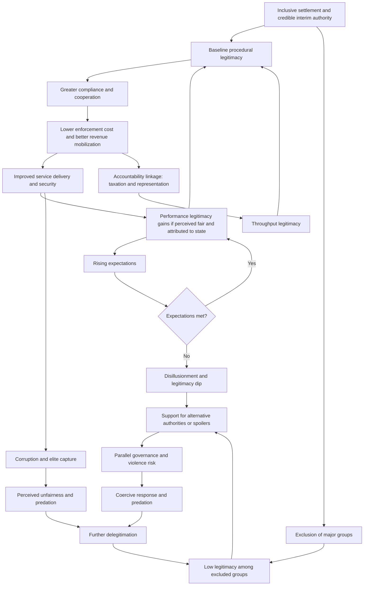

## State-Society Relegitimation and Institutional Legitimacy Rebuilding


### Scope and Framing

This item treats legitimacy as a **relational asset between state and society that conflict destroys and that reconstruction must deliberately rebuild**. In a post-conflict setting, the state (or the new authority) typically holds formal sovereignty but lacks the widespread, voluntary acceptance of its right to rule, and that deficit is itself a driver of relapse: it raises the cost of governing, lowers compliance and tax payment, empowers alternative authorities, and makes violence a plausible way to contest outcomes. The analytical question is: through which mechanisms is legitimacy generated (procedure, performance, shared identity, and international recognition), how do these mechanisms interact with the specific damage conflict inflicts, and what design choices in institutions, service delivery, participation, and accountability rebuild legitimacy without creating brittle, elite-captured, or externally dependent authority?

**Key Points**

- Legitimacy is **perceived and relational**, not a property of institutions alone. It exists only in the beliefs of the governed about whether an authority has the right to rule and deserves compliance.
- Legitimacy has **distinct sources** (input/procedural, output/performance, identity/shared belief, and international/external), and the sources can **conflict**: fast delivery by an unaccountable actor may raise performance legitimacy while eroding procedural legitimacy.
- Post-conflict legitimacy is **contested among multiple authorities** (formal state, customary authorities, armed groups, religious bodies, international actors), so rebuilding is a problem of **hybrid political order**, not a blank-slate state-building exercise.
- The relationship between service delivery and legitimacy is **weaker and more conditional than often assumed**. Delivery raises legitimacy mainly when it is perceived as **fair, attributable to the state, and accompanied by voice and accountability** [Unverified as settled].
- Legitimacy deficits and state capacity deficits are **coupled but distinct**. Capacity without legitimacy yields coercive, fragile order, while legitimacy without capacity yields unfulfilled expectations and eventual erosion.

**Definitions on first use**

- **Legitimacy**: the belief among the governed that an authority has the right to make binding decisions and that its commands ought to be obeyed, beyond mere fear of sanction or calculation of benefit. The concept derives from Max Weber's account of legitimate domination.
- **Relegitimation**: the process by which a discredited, destroyed, or newly formed authority acquires or recovers legitimacy after conflict.
- **Input (procedural) legitimacy**: legitimacy derived from how authority is constituted and exercised, including participation, representation, rule-following, and fairness of process.
- **Output (performance) legitimacy**: legitimacy derived from the authority's delivery of valued outcomes, such as security, services, and welfare.
- **Throughput legitimacy**: legitimacy derived from the quality of governance processes themselves, such as transparency, accountability, and inclusiveness in decision-making (associated with Vivien Schmidt's extension of the input-output distinction).
- **Identity-based (shared belief) legitimacy**: legitimacy grounded in shared national, religious, or ethnic identity or founding narratives.
- **Social contract (in this context)**: the implicit or explicit exchange in which citizens accept authority and contribute (taxes, compliance) in return for protection, services, and rights.
- **Fiscal contract**: the tax-and-representation bargain in which revenue extraction and state accountability co-evolve.
- **Hybrid political order**: a governance configuration in which formal state institutions coexist and interact with customary, traditional, religious, or armed non-state authorities, each holding partial legitimacy.
- **Legitimacy deficit**: the gap between an authority's claim to rule and the population's actual acceptance of that claim.
- **Compliance**: behavior in accordance with rules, which may be produced by legitimacy, coercion, or self-interest, and these three have different stability properties.
- **Elite pact (settlement)**: an agreement among powerful actors about the distribution of power and rents that may or may not correspond to broader societal acceptance.
- **State fragility**: the condition in which the state lacks capacity, authority, or legitimacy to perform core functions, with these three dimensions often distinguished analytically.

---

### The Concept of Legitimacy and Its Sources

#### Sources and Their Logic

| Source | Basis | How generated | Typical vulnerability |
| --- | --- | --- | --- |
| **Input / procedural** | Fair and inclusive way authority is constituted and decisions are made | Elections, constitution-making, representation, consultation, rule of law | Elections without institutions; exclusion of major groups; manipulated procedures |
| **Output / performance** | Delivery of security, services, livelihoods, and justice | Effective service provision, public order, economic recovery | Unmet expectations; unequal delivery; delivery by non-state actors |
| **Throughput** | Quality of governance process | Transparency, accountability, anti-corruption, responsiveness | Corruption; opacity; impunity |
| **Identity / shared belief** | Shared identity, values, or founding narrative | National narratives, symbols, inclusive citizenship | Group exclusion; competing narratives; identity-based capture |
| **Traditional / customary** | Historical or cultural authority | Recognition of customary leaders and norms | Conflict with formal law; gender and rights concerns; capture |
| **Charismatic / personal** | Leader's personal appeal | Leadership, mobilization | Personalization; succession risk; fragility |
| **International / external** | Recognition and support by external actors | Diplomatic recognition, donor support, mandates | Perceived imposition; dependence; legitimacy at home versus abroad |
| **Coercive foundation (not legitimacy)** | Fear of sanction | Force, surveillance | Brittle; corrodes over time; generates resistance |

Legitimacy is often built from **combinations of sources**, and their relative weights vary by society and time. A widely used analytical distinction separates **legitimacy** (belief in the right to rule) from **compliance** (behavior), because compliance can arise from coercion or self-interest without legitimacy, and such compliance is more costly and fragile.

#### A Formal Sketch: Legitimacy as Aggregated Belief

Let individual $i$ hold a legitimacy belief $\lambda_i \in [0,1]$ about the authority. A stylized formation of that belief:

$$\lambda_i = w_1 P_i + w_2 O_i + w_3 T_i + w_4 I_i + w_5 X_i - w_6 D_i$$

where:

- $P_i$ = perceived procedural fairness and inclusion
- $O_i$ = perceived performance (security, services, economic conditions)
- $T_i$ = perceived transparency and accountability (throughput)
- $I_i$ = alignment with the individual's identity and narrative
- $X_i$ = external cues (recognition, endorsement by trusted actors)
- $D_i$ = perceived predation, corruption, or discrimination
- $w_k > 0$ are individual- and context-specific weights.

Aggregate legitimacy in a population can be described by the distribution of $\lambda_i$ across groups. The **critical quantity for stability** is often not the mean but the **distribution across politically relevant groups**, since a small mobilizable group with very low $\lambda_i$ can sustain violence even if average legitimacy is high.

**Causal reading (variables and direction):**

| Variable | Change | Effect on legitimacy belief |
| --- | --- | --- |
| $P_i$ (procedural fairness and inclusion) | increases | increases |
| $O_i$ (performance) | increases | increases, contingent on fairness and attribution |
| $T_i$ (accountability) | increases | increases; also moderates the effect of $O_i$ |
| $D_i$ (perceived predation or discrimination) | increases | decreases, often disproportionately |
| Group exclusion from $P$ | increases | decreases $\lambda$ for excluded group, potentially sharply |
| Attribution of delivery to non-state actors | increases | shifts $O_i$ credit away from the state |

**Model assumptions and where they break down**

- Assumes an **additive, linear** belief formation, whereas legitimacy may show thresholds, path dependence, and interaction effects (for example, performance matters more when procedures are perceived as fair).
- Treats the weights $w_k$ as **fixed**, though they vary across individuals, groups, and time, and are themselves shaped by conflict experience.
- Ignores **social influence**: legitimacy beliefs are shaped by the beliefs of peers and community leaders, producing clustering and cascades.
- Treats the authority as a **single object**, whereas citizens evaluate multiple institutions (police, courts, local government, national government) differently.
- The parameters are **not empirically estimated**, and the model is a conceptual device.

---

### How Conflict Damages Legitimacy

| Damage channel | Mechanism | Consequence |
| --- | --- | --- |
| **Predation and abuse** | Security forces or officials commit violence, extortion, or discrimination | Fear and resentment; belief that the state is a threat |
| **Failure to protect** | State could not or would not protect populations | Loss of the protection basis of the social contract |
| **Collapse of services** | Infrastructure destroyed; personnel displaced | Loss of performance legitimacy; alternative providers emerge |
| **Partisan capture** | Institutions used to favor a group | Group-based exclusion; perceived illegitimacy among excluded |
| **Fiscal breakdown** | Revenue base and administration collapse; reliance on rents or aid | Weak fiscal contract; accountability disconnect |
| **Rise of alternative authorities** | Armed groups, warlords, customary or religious bodies provide order | Competing legitimacy claims; parallel governance |
| **Elite pact without social basis** | Settlement negotiated among elites | Formal authority without societal acceptance |
| **Delegitimizing narratives** | Propaganda and grievance narratives entrench distrust | Durable hostility to the state or particular groups |
| **International substitution** | External actors perform state functions | Weakened domestic accountability; dependence |
| **Trauma and mistrust** | Widespread trauma reduces trust in institutions | Lowered baseline receptivity to authority |

Recall that **commitment problems** arise when a party cannot credibly promise future behavior. Legitimacy rebuilding is partly a **commitment problem**: citizens must believe that the new authority will refrain from predation and honor obligations, and such belief is built through **observed behavior over time**, not declarations.

---

### The State-Society Bargain: Fiscal and Accountability Logics

A prominent line of argument holds that legitimacy is generated through the **fiscal contract**: when states depend on taxation of citizens rather than on external aid or resource rents, they have stronger incentives to be responsive, and citizens gain leverage to demand accountability ("no taxation without representation"). This suggests that **aid dependence and resource rents can weaken the legitimacy-building dynamic**, by decoupling state revenue from citizen consent [interpretation varies; empirical support is contested and conditional].

A stylized reciprocal-dependence structure:

$$\text{Revenue extraction} \;\rightleftarrows\; \text{Representation and accountability} \;\rightleftarrows\; \text{Service delivery and compliance}$$

**Design consideration**: in aid-dependent post-conflict settings, deliberate steps to **build domestic revenue mobilization and link it to accountability** may support legitimacy, but early aggressive taxation can provoke resistance where legitimacy is low, creating a **sequencing dilemma** [Unverified as settled].

---

### Service Delivery and Legitimacy: A Conditional Relationship

A common assumption is that improved services automatically improve legitimacy. Evidence is more nuanced.

| Condition | Effect on service-legitimacy link |
| --- | --- |
| **Perceived fairness of distribution** | Unequal or group-biased delivery can reduce legitimacy even as aggregate services improve |
| **Attribution to the state** | If services are delivered by NGOs or international actors and perceived as such, legitimacy gains accrue elsewhere |
| **Quality and reliability** | Poor quality can generate frustration exceeding the gain from access |
| **Expectations** | Rising expectations can outpace delivery, causing disillusionment |
| **Voice and accountability** | Services coupled with participation and responsiveness produce stronger legitimacy effects |
| **Type of service** | Security and justice may matter more for legitimacy than some social services |
| **Local context and provider legitimacy** | Customary or local providers may hold pre-existing legitimacy |

**Model sketch**: perceived performance $O_i$ contributes to legitimacy through an **attribution and fairness filter**:

$$\Delta \lambda_i^{(O)} = w_2 \cdot a_i \cdot f_i \cdot \Delta O_i$$

where $a_i \in [0,1]$ is the extent to which individual $i$ attributes the performance improvement to the authority and $f_i \in [0,1]$ is perceived fairness of distribution. If $a_i$ or $f_i$ is low, improved performance contributes little or nothing to legitimacy, which explains why **delivery-only strategies underperform** in contested settings.

**Model assumptions and where they break down**

- Assumes multiplicative filtering, which is a simplification, and the true functional form is unknown.
- Treats $a_i$ and $f_i$ as **fixed**, whereas they can be manipulated by narratives from rival authorities and by communications strategy.
- Ignores **strategic behavior by rival providers** who may claim credit or sabotage delivery.

---

### Hybrid Political Order and Multiple Legitimacies

State-building models that assume a **single, Weberian state** with a monopoly on legitimate force often fit post-conflict realities poorly. In many settings:

- **Customary and traditional authorities** hold substantial legitimacy, especially in dispute resolution, land, and local governance.
- **Religious institutions** provide social services and moral authority.
- **Armed or former armed groups** may hold territorial control and local support.
- **Formal state institutions** may have limited reach beyond the capital and major towns.

Approaches to this reality (associated with the hybrid political order literature) argue that **engagement with, rather than replacement of, non-state authorities** may be more effective for legitimacy, while noting risks.

| Approach | Description | Advantage | Risk |
| --- | --- | --- | --- |
| **Replacement** | Displace non-state authorities with formal institutions | Uniform rules; rights protection | Local resistance; loss of functioning order |
| **Co-existence** | Tolerate parallel systems | Pragmatic; low cost | Fragmented law; contested jurisdiction; rights gaps |
| **Recognition and integration** | Formally link customary or local authorities to state framework | Builds on existing legitimacy | Entrenches exclusionary norms (for example, gender inequality); state capture of customary bodies |
| **Complementarity and referral** | Define roles and referral pathways between systems | Clarity; harnesses strengths | Requires capacity and trust; jurisdictional disputes |
| **Gradual absorption** | Progressively extend state functions while respecting local systems | Adaptive | Slow; uncertain outcomes |

**Design consideration**: integration of non-state authorities involves a **legitimacy-rights trade-off**, because some customary systems may conflict with human rights standards, and recognition can confer legitimacy on actors who exclude or discriminate. Design should specify **rights safeguards and appeal mechanisms**.

---

### Design Levers for Relegitimation

#### 1. Inclusive and Legitimate Political Settlement

Legitimacy depends on the settlement's **breadth of inclusion**. Recall that elite pacts lacking societal basis are fragile, and that excluded groups may become spoilers. Design questions include who participated in the settlement, whether major constituencies feel represented, and how the settlement handles minorities and marginalized groups.

**Mechanisms**: inclusive negotiation, public consultation, inclusive constitutional processes, and power-sharing or minority protections where appropriate (recall the multiparty architecture discussion: decision rules and inclusion trade off inclusiveness and decisiveness).

#### 2. Participatory Constitution-Making and Legal Frameworks

Constitutional processes can generate legitimacy through **participation and public ownership**, or lose it through perceived elite imposition.

| Design choice | Effect | Risk |
| --- | --- | --- |
| **Broad consultation** | Ownership and information | Raised expectations; unmanageable demands |
| **Referendum ratification** | Democratic legitimacy | Polarization; simplistic choice; rejection risk |
| **Expert-led drafting** | Technical quality | Perceived elitism |
| **Sequencing (interim then permanent)** | Flexibility | Interim arrangements can harden |
| **Entrenched minority protections** | Confidence for minorities | Rigidity; majority resistance |

#### 3. Elections: Timing, Design, and Function

Recall from the sequencing discussion that early national elections in weak-institution settings carry risks, while elections also offer procedural legitimacy. Elections contribute to legitimacy when they are **credible, inclusive, and accompanied by institutional capacity and security**, and can undermine it when they are manipulated, exclusionary, or held before minimal conditions exist.

**Design considerations**: pacing (local elections before national in some designs), electoral system choice (which shapes representation and incentives), independent electoral administration, dispute-resolution mechanisms, and inclusion of previously excluded groups.

#### 4. Security and Justice as Foundational Legitimacy Goods

Basic security and access to justice are often **central to legitimacy**, because they concern the state's core protective function. Reform of the security sector toward **accountability, professionalism, and representativeness**, and functioning justice institutions that are perceived as fair, address the predation channel directly.

Recall that justice mechanisms (hybrid tribunals, transitional justice, amnesty design) influence legitimacy: accountability for state violence signals that the new order differs from the old, while perceived selective or victors' justice undermines legitimacy.

#### 5. Service Delivery Designed for Legitimacy

To convert delivery into legitimacy:

- **Deliver through state and local institutions where feasible** so attribution accrues to the authority, while managing capture and capacity risks.
- **Ensure perceived fairness** in geographic and group distribution, with transparent criteria (recall conflict-sensitive programming).
- **Incorporate feedback and grievance mechanisms** so that citizens have voice.
- **Manage expectations** through honest communication.
- **Prioritize services that citizens value most**, identified through consultation.

#### 6. Accountability, Transparency, and Anti-Corruption

Predation and corruption are among the strongest **delegitimizing forces**. Mechanisms include:

- Independent audit and oversight institutions
- Access to information and public reporting
- Civilian oversight of security forces
- Protections for civil society and media
- Anti-corruption enforcement, with attention to selective prosecution risks

**Trade-off**: aggressive early anti-corruption can destabilize elite settlements that rely on managed rents, while tolerating corruption erodes legitimacy. The balance depends on the settlement structure [contested design question].

#### 7. Local Governance and Decentralization

Decentralization can bring government **closer to citizens**, improving responsiveness and enabling local legitimacy, and can accommodate regional or group diversity. Risks include **local elite capture**, uneven capacity, fiscal fragmentation, and, in some designs, reinforcement of group-based territorial claims.

| Design element | Legitimacy effect | Risk |
| --- | --- | --- |
| **Devolution of service responsibilities** | Responsiveness; local ownership | Capacity gaps; inequality across regions |
| **Local elections** | Procedural legitimacy at local level | Capture; identity-based competition |
| **Fiscal decentralization** | Local accountability | Revenue disparities; macro-stability risks |
| **Autonomy arrangements for regions or groups** | Accommodation of diversity | Secessionist dynamics; fragmentation |
| **Community participation mechanisms** | Voice | Tokenism; elite dominance |

#### 8. Narrative, Symbols, and Identity

Legitimacy also has an **identity and narrative dimension**. Inclusive national narratives, symbols, language policies, and memorialization can support a shared political community, while exclusionary narratives sustain division. Recall from the reconciliation item that narrative revision is politically contested and slow, and that superordinate identity efforts can threaten subgroup identity.

#### 9. Civil Society, Media, and Public Sphere

A functioning civil society and independent media enable **scrutiny, voice, and information**, supporting throughput legitimacy. Constraints include threats to journalists and activists, disinformation, and capture of media by factions.

#### 10. International Actors: Legitimacy Support and Risk

External actors can **support** legitimacy through recognition, resources, and technical assistance, and **undermine** it through dependence, parallel structures, and perceptions of imposition. Recall the speed-legitimacy trade-off in reconstruction delivery.

**Design principles for external engagement**: support domestic accountability rather than replacing it; align with local priorities; use gradual handover; avoid creating structures that the state cannot sustain; be transparent about conditionality.

---

### Sequencing and Phasing of Relegitimation

Legitimacy building is **cumulative and slow**, and it interacts with security, economic, and justice tracks.

| Phase | Emphasis | Typical activities | Risks |
| --- | --- | --- | --- |
| **Immediate** | Basic security, minimal services, credible interim authority | Ceasefire consolidation, humanitarian delivery, interim governance | Interim arrangements hardening; exclusion |
| **Early consolidation** | Inclusion and visible performance | Inclusive settlement processes, quick-impact services, security sector accountability | Overpromising; elite capture |
| **Institutionalization** | Procedural legitimacy and institutional capacity | Constitution-making, elections, local government, justice institutions, revenue systems | Premature liberalization; capacity overload |
| **Deepening** | Accountability and throughput | Oversight, anti-corruption, civil society, public administration reform | Backlash from entrenched interests |
| **Long-term** | Social contract consolidation | Broad fiscal contract, inclusive narratives, generational change | Erosion under shocks; reversal |

**Design consideration**: expectations management is critical because **early visible gains can raise expectations** that institutions cannot sustain, producing a legitimacy dip. Anticipating and communicating about this dynamic is part of design.

---

### Feedback Loop Structure



**Reading the loops**

- **Reinforcing loop R1 (virtuous legitimation)**: procedural legitimacy → compliance and cooperation → lower enforcement cost and better revenue → better delivery → performance legitimacy → strengthened baseline.
- **Reinforcing loop R2 (exclusion spiral)**: exclusion of major groups → low legitimacy among excluded → support for alternative authorities or spoilers → violence and coercive response → further delegitimation.
- **Reinforcing loop R3 (predation spiral)**: corruption and capture → perceived unfairness → delegitimation → reduced compliance → greater reliance on coercion → more predation.
- **Reinforcing loop R4 (fiscal-accountability)**: domestic revenue dependence → accountability pressures → throughput legitimacy → greater willingness to pay taxes.
- **Balancing loop B1 (expectations)**: delivery gains → rising expectations → potential disillusionment if unmet → dampening of legitimacy gains.

The design objective is to **strengthen R1 and R4 while dampening R2 and R3**, through inclusion, accountability, fair attribution of delivery, and expectation management.

---

### Assessing Legitimacy: Measurement and Diagnosis

Legitimacy is difficult to measure directly, and proxies are used with caution.

| Approach | Example indicators | Concern |
| --- | --- | --- |
| **Perception surveys** | Trust in institutions, perceived fairness, acceptance of authority, willingness to use state courts | Social desirability; security constraints; comparability |
| **Behavioral indicators** | Tax compliance, use of formal versus informal dispute resolution, voluntary compliance, voter turnout | Behavior may reflect coercion or convenience |
| **Institutional indicators** | Electoral participation, service coverage, judicial functioning | Formal metrics may not capture perception |
| **Conflict-related indicators** | Violence directed at state institutions, parallel governance, protest patterns | Attribution to legitimacy versus other causes |
| **Disaggregation** | Legitimacy by group, region, gender, age | Data sensitivity; sample limits |
| **Qualitative assessment** | Focus groups, key informants, political-economy analysis | Subjectivity; representativeness |

**Design consideration**: focus on **distributional measurement** (legitimacy among politically relevant groups and regions) rather than only national averages, since a small mobilizable population with low legitimacy can sustain violence. Also distinguish **compliance from legitimacy**, since compliance may reflect fear or lack of alternatives.

**Example: Diagnostic Questions**

1. Who holds the authority to make binding decisions locally, and who do people actually turn to for security, justice, and services?
2. Which groups feel excluded from the political settlement and institutions, and what are their alternatives?
3. Do citizens attribute improvements to the state, to local authorities, or to external actors?
4. What are the principal perceived abuses or forms of predation, and by whom?
5. What is the fiscal relationship between the state and citizens?
6. Do expectations align with achievable delivery?

---

### Cases as Evidence for Mechanisms

Cases below illustrate specific mechanisms rather than provide a survey. Characterizations are simplified, and scholarly assessments differ.

#### Mechanism: Exclusion and Delegitimation (Post-Conflict States with Narrow Settlements)

Post-conflict settings in which settlements concentrated power among a narrow elite and marginalized major constituencies illustrate the **exclusion spiral (R2)**: excluded groups withheld consent, alternative authorities gained ground, and violence resumed or persisted. Cross-national studies of inclusion and settlement durability report associations between broader inclusion and more durable peace, though causal identification is contested [Unverified as settled].

#### Mechanism: Delivery Without Attribution or Accountability (Externally Delivered Services)

Contexts in which services were delivered largely by international agencies and NGOs illustrate the **attribution filter**: measured service access improved while citizens' perceptions of state performance and legitimacy showed limited improvement, and parallel structures weakened state capacity to deliver later. This supports design emphasis on **delivery channels and communication of state role**, weighed against capacity and speed constraints [assessments differ].

#### Mechanism: Hybrid Governance and Customary Authorities (Multiple Post-Conflict Settings)

Settings in which customary or local authorities retained substantial legitimacy in dispute resolution and local order illustrate the **hybrid political order** dynamic. Programs that engaged these authorities reported gains in accessibility and perceived fairness, alongside concerns about **rights protection, gender equality, and elite capture** in some contexts. This illustrates the **legitimacy-rights trade-off** in integration designs [case-dependent].

#### Mechanism: Elections and Legitimacy (Early Post-Conflict Elections)

Cases in which early national elections were held soon after settlement illustrate both **legitimacy gains from participation** and **risks where institutions and security were weak**, with outcomes ranging from consolidation to renewed violence over contested results. The comparison across cases supports attention to electoral design, administration, and security, and the causal role of election timing relative to other factors remains contested [Unverified as settled].

#### Mechanism: Security Forces and Predation (Security Sector Abuse)

Cases in which state security forces were perceived as predatory or partisan illustrate the **predation channel**, where security provision reduced rather than increased legitimacy for targeted communities. Reform efforts focusing on accountability, vetting, and representativeness aim to address this channel, with mixed and slow results [interpretation varies].

#### Mechanism: Constitution-Making Processes

Participatory constitution-making processes in post-conflict settings illustrate the **procedural legitimacy** pathway, with wide consultation building ownership in some cases and, in others, raising expectations that could not be met or producing texts that did not resolve underlying settlement disputes. Evidence on the effect of participation depth on later legitimacy and stability is mixed [Unverified as settled].

#### Mechanism: Fiscal Contract and Aid Dependence

Analyses of aid-dependent and resource-rich post-conflict states argue that **weak reliance on citizen taxation** can weaken accountability and legitimacy-building, while early or aggressive taxation without legitimacy can provoke resistance. Findings are conditional and contested, and they underscore the **sequencing dilemma** in revenue mobilization [interpretation varies].

---

### Design Failure Modes

| Failure mode | Cause | Design response |
| --- | --- | --- |
| **Elite pact without social basis** | Narrow settlement | Broaden inclusion; public consultation; minority protections; grievance channels |
| **Exclusion of major groups** | Marginalization in institutions and resources | Representation measures; equitable allocation; targeted outreach |
| **Delivery without attribution** | Services provided by external actors or NGOs | State-led or co-branded delivery; capacity building; communication |
| **Unfair distribution** | Group or regional bias | Transparent criteria; monitoring by group and region |
| **Predatory security forces** | Unaccountable coercive institutions | Vetting; oversight; representativeness; complaint mechanisms |
| **Corruption and capture** | Weak accountability | Audit; transparency; independent oversight; media freedom |
| **Premature or manipulated elections** | Weak institutions; low trust | Pacing; independent administration; dispute resolution; security |
| **Expectations gap** | Overpromising | Honest communication; phased commitments; visible early results |
| **Rights-eroding integration of customary authority** | Recognition without safeguards | Rights safeguards; appeal to state courts; inclusion of women and minorities |
| **Aid dependence weakening accountability** | Revenue decoupled from citizens | Domestic revenue mobilization; linkage to representation; transparency of aid |
| **Overcentralization** | Distant, unresponsive government | Decentralization with capacity and equity safeguards |
| **Local elite capture** | Decentralization without accountability | Oversight; community participation; audit |
| **Parallel structures** | Externally created bodies displacing state | Handover plans; integration into state systems |
| **Neglect of throughput** | Focus on elections and delivery only | Accountability institutions; transparency; civic space |
| **Measurement neglect** | No legitimacy monitoring | Perception surveys; disaggregated indicators; adaptive management |
| **Coercive compliance mistaken for legitimacy** | Relying on outward stability | Distinguish compliance from consent; monitor grievance |

---

### Design Checklist

**Example: Structured Questions for Designing a Relegitimation Strategy**

1. **Diagnose legitimacy by group and institution.** Which populations and regions accept or reject the authority, and for which institutions and reasons?
2. **Identify competing authorities.** Which customary, religious, armed, or external actors hold legitimacy, and what functions do they perform?
3. **Assess the settlement's inclusiveness.** Who is excluded, and how might they respond?
4. **Prioritize legitimacy sources.** Which of procedure, performance, throughput, identity, or external recognition is most relevant and feasible now?
5. **Design delivery for attribution and fairness.** Through which channels will services be delivered, and how will fairness and state role be communicated?
6. **Address predation.** What reforms and accountability mechanisms will limit abuse and corruption, and what settlement trade-offs constrain them?
7. **Plan participation and elections.** What timing, design, and safeguards will support credible and inclusive procedures?
8. **Decide on hybrid governance.** How will non-state authorities be engaged, with what rights safeguards and referral mechanisms?
9. **Build the fiscal relationship.** How will domestic revenue mobilization be sequenced and linked to accountability?
10. **Manage expectations.** What communications and phased commitments will avoid a legitimacy dip?
11. **Coordinate with security, justice, economic, and reconciliation tracks.** Where do dependencies and tensions exist?
12. **Monitor and adapt.** What legitimacy indicators, disaggregation, and review triggers will guide adjustment?

**Illustrative pseudo-specification of a relegitimation strategy record**

```plaintext
RELEGITIMATION_STRATEGY:
  context_id: <identifier>
  diagnosis:
    legitimacy_by_group: [{group, level, main_grievances, preferred_authorities}]
    legitimacy_by_institution: [{institution, perceived_performance, perceived_fairness, perceived_predation}]
    competing_authorities: [{actor, type, functions, legitimacy_basis, relationship_to_state}]
    settlement_inclusiveness: {included_groups, excluded_groups, risk_assessment}
  priority_sources:
    procedural: <actions>
    performance: <actions>
    throughput: <actions>
    identity_and_narrative: <actions>
    external_recognition: <actions>
  political_process:
    constitution_making: {approach, consultation_design, ratification}
    elections: {sequencing, administration, security_conditions, dispute_resolution}
    power_sharing_or_minority_protections: <provisions>
  service_delivery:
    channels: state | local_government | ngo | mixed
    attribution_plan: <communication and branding>
    fairness_monitoring: <group and region disaggregation>
    feedback_mechanisms: <grievance and consultation>
  security_and_justice:
    security_sector_accountability: <vetting, oversight, representativeness>
    justice_access: <courts, legal aid, complaint mechanisms>
  accountability:
    audit_and_oversight: <institutions>
    transparency_and_information_access: <measures>
    civic_space_and_media: <protections>
  hybrid_governance:
    engagement_approach: replacement | coexistence | integration | complementarity | gradual_absorption
    rights_safeguards: <appeal, gender and minority protections>
  fiscal_relationship:
    revenue_mobilization_plan: <sequencing>
    aid_transparency: <measures>
    representation_link: <mechanism>
  decentralization:
    design: <devolution scope, fiscal arrangements, safeguards>
    capture_controls: <oversight and participation>
  expectations_management:
    communication_plan: <messaging>
    phased_commitments: <milestones>
  external_actors:
    role: <support and limits>
    handover_plan: <timeline>
  monitoring:
    perception_surveys: <design, frequency, disaggregation>
    behavioral_indicators: <tax compliance, use of formal institutions, etc.>
    conflict_indicators: <violence against institutions, parallel governance>
    data_protection: <safeguards>
    adaptation_triggers: <conditions>
```

The specification is a schematic illustration of strategy parameters, not a standardized instrument.

---

### Limits of the Model

- **Legitimacy is difficult to measure.** Perception surveys are vulnerable to response bias and security constraints, and behavioral proxies conflate legitimacy with coercion or convenience.
- **The additive belief model is a conceptual device.** Weights, thresholds, interactions, and social influence effects are not empirically established.
- **Causal relationships are contested.** The links among service delivery, participation, accountability, and legitimacy vary across contexts, and much of the evidence is correlational or case-based [Unverified as settled].
- **Legitimacy operates at multiple levels.** Citizens evaluate local, regional, and national institutions differently, and national averages can mask important variation.
- **Normative content.** Choices about engaging non-state authorities, tolerating corruption for stability, or prioritizing order over participation involve value judgments and rights trade-offs that technical frameworks do not resolve.
- **Time horizons.** Legitimacy accumulates slowly and can erode quickly, and typical program and donor cycles are shorter than the relevant processes.
- **Context specificity.** Sources of legitimacy vary by culture, history, and political economy, and templates risk imposing external assumptions.
- **Endogeneity.** Legitimacy affects compliance and security, which in turn affect legitimacy, complicating attribution of program effects.
- **Behavior may vary**: predicted effects depend on actors' beliefs, institutional context, and enforcement conditions, and the formal sketches above are simplifications.

---

**Conclusion**

State-society relegitimation is the **deliberate rebuilding of the relational asset that conflict destroys**: the population's belief that the authority has the right to rule and merits compliance. Legitimacy draws on several distinct sources (procedural inclusion, performance, throughput accountability, identity, and external recognition), which can reinforce or conflict with one another, and it is contested in post-conflict settings by customary, religious, armed, and international authorities. Delivery alone is a weak legitimacy strategy unless it is **perceived as fair, attributed to the authority, and coupled with voice and accountability**, and predation, corruption, and exclusion can erode legitimacy faster than delivery builds it. Effective design combines an inclusive settlement, credible and paced procedural mechanisms, accountable security and justice institutions, fairly distributed and attributable services, engagement with hybrid governance under rights safeguards, a domestic fiscal-accountability linkage where feasible, and honest expectations management, all monitored through disaggregated legitimacy indicators that distinguish consent from coerced compliance. Because legitimacy is slow to build, quick to lose, and hard to measure, and because the causal evidence is conditional and contested, strategies should be treated as adaptive hypotheses subject to continuous reassessment.

**Related Topics**

- Weberian legitimacy, output and input legitimacy, and throughput legitimacy
- Hybrid political orders and customary authority integration
- Fiscal contract theory and aid dependence
- Security sector reform, vetting, and accountability
- Constitution-making and participatory design
- Election timing, electoral system design, and post-conflict democratization
- Decentralization, local governance, and local elite capture
- Service delivery, attribution, and state capacity in fragile contexts
- Corruption, elite pacts, and political settlements
- Measuring legitimacy: perception surveys and behavioral indicators