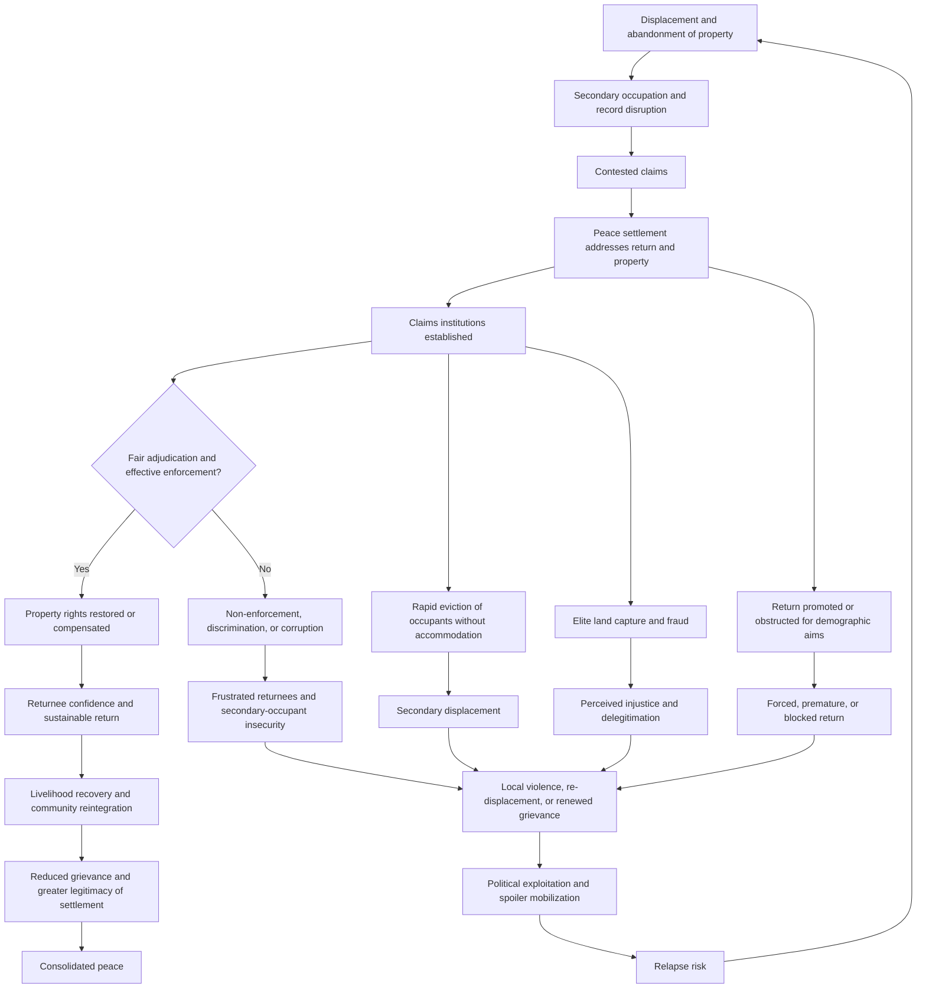

## Refugee Return, Land Restitution, and Property Rights Resolution


### Scope and Framing

This item treats displacement, return, and property as a **coupled system**: forced displacement severs people from land and housing, secondary occupation and record destruction convert those losses into contested claims, and the manner in which returns and claims are resolved determines whether return consolidates peace or reignites conflict. The analytical question is: how should the *volume and timing of return*, the *substantive remedy for lost property* (restitution, compensation, or alternatives), and the *institutional machinery for adjudicating and enforcing claims* be designed so that they close off failure modes (secondary-occupant displacement, elite land capture, discriminatory adjudication, fraudulent claims, and stalled implementation) while remaining feasible under weak state capacity?

**Key Points**

- Property is **both a material asset and a marker of belonging and citizenship**. Land disputes therefore carry identity and legitimacy stakes beyond their economic value, which is why they are frequent flashpoints and frequent drivers of relapse.
- Restitution creates a **rights conflict**: the returning owner's claim collides with the secondary occupant's need for shelter, who may themselves be displaced or have acted in good faith. Design choices about *who has priority* and *what remedy applies* determine whether resolution produces a second displacement.
- **Housing, land, and property (HLP) rights** operate through **formal, customary, and informal tenure systems**. Post-conflict systems typically face incomplete records, destroyed registries, overlapping claims, and gendered barriers to ownership.
- Return is a **voluntary, safe, and dignified** process under international refugee and human rights norms, but political actors may promote, obstruct, or manipulate return for demographic or electoral reasons. Return numbers alone are not an indicator of successful resolution.
- Evidence on what produces *sustainable* return and durable property settlement is **case-based and mixed**, with restitution achieving high formal claim resolution in some settings but low actual repossession or reintegration in others [Unverified as settled].

**Definitions on first use**

- **Refugee**: a person outside their country of origin owing to a well-founded fear of persecution or serious harm, entitled to international protection, distinguished from an **internally displaced person (IDP)**, who has been displaced within national borders.
- **Voluntary repatriation**: return to the country of origin in conditions of safety and dignity, based on a free and informed choice. Associated with the principle of non-refoulement, which prohibits forced return to danger.
- **Durable solutions**: the three long-term outcomes recognized for displaced people: voluntary return, local integration, and resettlement elsewhere.
- **Housing, land, and property (HLP) rights**: the rights to adequate housing, to access and use land, and to secure property, including protection from arbitrary dispossession.
- **Property restitution**: the return of property to its original owner or the reinstatement of their rights, distinct from **compensation** (monetary or in-kind payment in lieu of return) and **alternative remedies** (substitute property, resettlement assistance, or symbolic recognition).
- **Pinheiro Principles**: the UN Principles on Housing and Property Restitution for Refugees and Displaced Persons, which articulate a right to restitution as the preferred remedy and set standards for procedures, secondary occupants, and non-discrimination.
- **Secondary occupant**: a person who occupies property left behind by displaced owners, ranging from good-faith occupants who were themselves displaced to opportunistic or coerced occupants.
- **Tenure security**: the degree of confidence that a person will not be arbitrarily deprived of land or property rights, regardless of whether tenure is formal, customary, or informal.
- **Customary tenure**: land rights governed by community norms and authorities rather than by state registration.
- **Land grabbing (in this context)**: acquisition of land through coercion, fraud, or exploitation of conflict conditions, often by powerful actors.
- **Cadastre**: a register of land parcels with boundaries, ownership, and value, whose destruction or absence complicates adjudication.
- **Housing, land, and property claims commission**: a specialized administrative body created to receive and adjudicate displacement-related property claims outside ordinary courts.
- **Sustainable return**: return in which returnees can rebuild livelihoods, are safe, enjoy their rights, and do not re-displace.

---

### The Displacement-Property System

#### How Displacement Converts to Property Disputes

| Stage | Process | Property consequence |
| --- | --- | --- |
| **Flight** | Households leave under threat or violence | Property abandoned; documents lost or left behind |
| **Occupation** | Property occupied by others (displaced persons, combatants, opportunists, state actors) | Secondary occupancy; sometimes formalized through de facto authorities |
| **Record destruction and manipulation** | Registries destroyed, altered, or captured | Evidentiary vacuum; opportunity for fraud |
| **Transfers** | Forced or coerced sales, confiscation, or state reallocation | Contested title; legal transfers that may be void under duress |
| **Negotiated settlement** | Peace agreement addresses return and property | Legal framework, sometimes ambiguous or politically driven |
| **Return** | Displaced persons attempt to reclaim | Conflict between returnees and current occupants |
| **Adjudication and enforcement** | Claims processed through courts or commissions | Backlogs; non-enforcement; discrimination; corruption |
| **Reintegration** | Livelihood rebuilding | Success depends on access to land and services |

Recall that **horizontal inequality** and **group-based exclusion** drive mobilization. Property outcomes that systematically favor one group over another reproduce these inequalities, and property claims are frequently organized along the same group lines as the conflict.

#### The Tenure Landscape

| Tenure type | Basis | Post-conflict vulnerability |
| --- | --- | --- |
| **Formal (registered) title** | State registry | Registry destroyed, altered, or captured; enforcement weak |
| **Customary tenure** | Community norms and authorities | Not documented; contested authority; gender exclusion; state non-recognition |
| **Informal or squatter tenure** | Occupation without legal title | Highest insecurity; excluded from restitution frameworks |
| **State or public land** | Government ownership | Allocated to elites or in exchange for loyalty |
| **Tenancy and lease** | Contractual rights | Landlord-tenant claims; tenants frequently overlooked |
| **Communal or pastoral rights** | Shared access to grazing, forests, water | Difficult to map; commonly overlooked in individual-title frameworks |
| **Hybrid or overlapping claims** | Multiple layers of legal and customary rights | Conflicting adjudication authority |

A property-rights framework that recognizes **only formal title** will exclude large populations whose tenure is customary or informal, which creates a **legitimacy gap** and can worsen conflict (recall the relegitimation item on hybrid political order and multiple legitimacies).

---

### Return: Dynamics and Design

#### Return as a Decision Under Uncertainty

Consider a displaced household deciding whether to return. A stylized return condition:

$$\text{Return if:}\quad P_r \cdot V_{\text{home}} + L_r > V_{\text{host}} + C_r$$

where $V_{\text{home}}$ is the expected value of life at home (property, livelihoods, community), $P_r$ is the perceived probability that return will actually secure that value (safe access and successful claim), $L_r$ captures non-material value of returning (belonging, identity), $V_{\text{host}}$ is the value of remaining in displacement or integrating locally, and $C_r$ is the cost and risk of return (travel, security threats, loss of host-country assistance).

**Causal reading (variables and direction):**

| Variable | Change | Effect on likelihood of return |
| --- | --- | --- |
| Perceived safety at origin | increases | increases $P_r$; increases return |
| Perceived probability of recovering property | increases | increases $P_r$; increases return |
| Livelihood prospects and services at origin | increases | increases $V_{\text{home}}$; increases return |
| Host-country conditions and security of status | improves | increases $V_{\text{host}}$; decreases return |
| Loss of assistance or status upon return | increases | increases $C_r$; decreases return |
| Presence of secondary occupants and hostile authorities | increases | decreases $P_r$; decreases return |
| Time in displacement | increases | integration ties strengthen; return likelihood typically falls |

**Model assumptions and where they break down**

- Assumes a **household-level rational calculation**, while decisions involve family bargaining, gender and age differences, and information asymmetries. Different household members may prefer different outcomes.
- Treats $P_r$ as **known**, though information about conditions at origin is often incomplete or manipulated ("go and see" visits are one design response).
- Ignores **coercion and pressure** by host governments, which may push return before conditions are met, undermining voluntariness.
- Does not model **partial and circular return**, where household members return while others remain, or people move repeatedly.
- The relationship is **stylized**, with parameters not empirically estimated.

#### Return Is Political

Return has demographic and political consequences, particularly where displacement followed ethnic or communal lines. Actors may **promote return** to reverse ethnic cleansing or reassert claims, **obstruct return** to preserve demographic gains, or **manipulate return** through selective incentives or threats.

| Actor motive | Behavior | Consequence |
| --- | --- | --- |
| **Consolidate demographic gains** | Block or intimidate returnees; maintain secondary occupation | Reduced return; entrenched separation |
| **Reverse cleansing** | Encourage or pressure return | Risk of forced or premature return; violence at return sites |
| **Electoral calculation** | Facilitate return of supportive populations | Selective, politicized return |
| **Host-state pressure** | Push repatriation to reduce burden | Non-voluntary return; refoulement risk |
| **Donor priorities** | Fund return over other solutions | Undervaluing local integration or resettlement |

**Design consideration**: the international protection framework emphasizes that return must be **voluntary, safe, and dignified**. Programs should protect **freedom of choice among durable solutions** and monitor whether return is sustainable, not only the number of returns.

#### Return Design Levers

| Lever | Function | Risk |
| --- | --- | --- |
| **Information campaigns and "go-and-see" visits** | Reduce information asymmetry; allow informed decision | Manipulation; security of visitors |
| **Phased and area-based return** | Match return to local security and absorptive capacity | Delays; perceived unfairness |
| **Security guarantees and monitoring** | Protect returnees | Dependence on external presence; sustainability |
| **Assistance packages** | Transport, shelter, cash, livelihoods | Perverse incentives; pull effects; unfairness toward stayers |
| **Documentation and legal identity** | Restore civil status needed for property claims and services | Administrative barriers; exclusion of stateless or undocumented |
| **Return to place of origin versus place of choice** | Respect choice; avoid forced demographic reversal | Complex; possible perpetuation of segregation |
| **Support for local integration and resettlement** | Preserve alternatives to return | Political resistance; resource competition |
| **Community-based reconciliation at return sites** | Reduce hostility toward returnees | Effectiveness limited by underlying interests |
| **Area-based programming benefiting returnees and stayers** | Reduce resentment; fairness | Dilutes targeting; capacity constraints |

---

### Property Restitution: Remedies and Their Logic

#### The Remedy Spectrum

| Remedy | Description | Strength | Weakness |
| --- | --- | --- | --- |
| **Restitution (repossession)** | Return of the property to the original owner | Restores rights and status; signals justice; supports return | Displaces occupants; enforcement difficult; may re-segregate |
| **Restitution with occupant accommodation** | Restitution plus alternative shelter or compensation for good-faith occupants | Protects occupants' shelter; reduces secondary displacement | Costly; requires capacity |
| **Compensation** | Payment in lieu of return | Flexible; avoids displacing occupants; suits those who do not wish to return | Underfunded; may be inadequate; may legitimize dispossession; fiscal burden |
| **Alternative property or resettlement** | Substitute land or housing | Practical where original property is unavailable | Quality and location disputes; loss of connection to origin |
| **Mixed remedies (option to choose)** | Claimant elects among remedies | Respects agency | Complexity; incentive to inflate claims |
| **Recognition and symbolic reparation** | Acknowledgment without material transfer | Low cost | Insufficient for material loss |
| **Land reform and redistribution** | Broader restructuring of land access | Addresses structural drivers | Politically difficult; slow |

The **Pinheiro Principles** articulate restitution as the preferred remedy and a right of displaced persons regardless of whether they choose to return, with compensation appropriate where restitution is factually impossible. In practice, **compensation and mixed approaches dominate** where secondary occupancy, destruction, and capacity constraints make full restitution infeasible, and the normative preference for restitution remains contested in application [interpretation varies].

#### The Rights Conflict: Owners and Secondary Occupants

The central substantive tension is that **restoring one party's rights infringes another's**. A structured way to reason about it:

| Occupant type | Characteristic | Common treatment in frameworks |
| --- | --- | --- |
| **Good-faith displaced occupant** | Themselves a victim of displacement, occupying abandoned property from need | Alternative accommodation before eviction; phased eviction |
| **Good-faith purchaser** | Acquired property through apparently lawful transaction | Complex; may receive compensation; title validity depends on duress |
| **Opportunistic occupant** | Occupies without need, exploiting conflict | Eviction without accommodation |
| **State actor or affiliated elite** | Occupies through official position or patronage | Eviction; accountability; often politically difficult |
| **Perpetrator** | Occupies as a result of the violence they committed | Priority for restitution to victims; possible sanctions |

**Design principle**: distinguish occupant categories and apply **differentiated treatment**, because uniform eviction risks a second humanitarian crisis while uniform protection of occupants defeats restitution. Recognition that **secondary occupants may themselves be displaced** motivates approaches that link restitution to accommodation or compensation for those occupants.

A stylized decision structure for claim resolution:

$$\text{Remedy}(c) = f\big(\text{validity of claim},\ \text{availability of property},\ \text{occupant category},\ \text{claimant preference},\ \text{fiscal and administrative capacity}\big)$$

The function is not fixed and varies by legal framework and context, and the design task is to make the mapping **transparent, predictable, and non-discriminatory**.

#### Legal Validity of Wartime Transactions

Transactions made during conflict raise a distinct problem: sales or transfers may have occurred under **duress, discrimination, or fraud**, or may have been legitimate. Frameworks address this through:

- **Presumptions of invalidity** for transactions in specific periods or between certain groups, rebuttable on evidence.
- **Case-by-case adjudication**, which is more precise but slower and costlier.
- **Statutory nullification** of transfers made under discriminatory laws or during defined periods.

**Trade-off**: presumptions accelerate resolution and protect claimants who lack evidence but risk unfairness to bona fide transferees, while case-by-case review is fairer but can overwhelm institutions.

---

### Institutional Architecture for Claims Resolution

#### Forum Choice

| Forum | Description | Strength | Weakness |
| --- | --- | --- | --- |
| **Ordinary courts** | Existing judiciary | Legitimacy; established procedures; appeal | Backlogs; capacity gaps; bias; slow for mass claims |
| **Specialized claims commission** | Dedicated administrative body for displacement claims | Speed; expertise; mass processing; simplified evidence rules | Limited enforcement power; parallel to court system; possible politicization |
| **Hybrid or internationalized commission** | Mixed national and international members | Independence; capacity | Cost; sovereignty concerns; legacy questions |
| **Customary or community mechanisms** | Traditional authorities and local mediation | Accessibility; cultural legitimacy; low cost | Rights concerns; gender exclusion; inconsistency with formal law |
| **Alternative dispute resolution and mediation** | Negotiated settlements | Flexibility; relationship repair | Power asymmetries; enforceability |
| **Administrative registration and adjudication (systematic)** | State-led land titling or adjudication by area | Comprehensive; prevents fragmentation | Resource-intensive; slow; risk of entrenching inequities |

Recall from the tribunal item that forum design involves a **capacity-legitimacy-independence trade-off**, and the same applies here: specialized commissions bring speed and capacity but must be integrated with the court system to avoid parallel, unaccountable channels.

#### Procedural Design Features

| Feature | Purpose | Consideration |
| --- | --- | --- |
| **Simplified evidentiary standards** | Accommodate lost documents | Risk of fraudulent claims; verification mechanisms needed |
| **Presumptions and burden-shifting** | Reduce claimant burden | Fairness to current occupants; rebuttal rights |
| **Accessible filing (locations, languages, cost, outreach)** | Reach displaced and remote claimants | Diaspora and camp populations often excluded |
| **Claims deadlines** | Manage caseload; provide finality | Deadlines may exclude those unable to file; extension mechanisms |
| **Standing for women and marginalized groups** | Address exclusion | Patriarchal norms and inheritance practices |
| **Representation and legal aid** | Equality of arms | Cost; capacity |
| **Appeal and review** | Correct errors; legitimacy | Delay; strategic appeals |
| **Enforcement mechanisms** | Convert decisions into repossession | Weak police and court enforcement; political interference |
| **Transparency and public information** | Reduce manipulation | Sensitive data; security risks |
| **Anti-fraud safeguards** | Prevent false claims | Verification burden; risk of excluding legitimate claimants |

#### The Enforcement Gap

Recall that international courts face an enforcement gap. The property analogue is that **adjudicated claims often remain unenforced**: decisions are issued, but repossession does not occur because local authorities, police, or occupants resist. Studies of restitution programs in some post-conflict settings report **high rates of formal claim resolution paired with low rates of actual repossession or return** in the early phases, with enforcement improving under sustained pressure and monitoring in some cases [case-dependent; Unverified as settled].

Let $R_d$ be the number of favorable decisions and $R_e$ the number enforced:

$$\text{Enforcement rate} = \frac{R_e}{R_d}$$

A low enforcement rate implies that formal resolution statistics **overstate** actual restoration of rights. Monitoring should track **implemented outcomes** (persons in possession, sustained tenure) rather than decisions issued.

---

### Land Registration, Records, and Tenure Security

Post-conflict record problems and their responses:

| Problem | Response | Risk |
| --- | --- | --- |
| **Destroyed or missing registries** | Reconstruction from archives, copies, community mapping, or systematic adjudication | Time; fraud; capture of the reconstruction process |
| **Manipulated or forged records** | Verification, audits, and forensic review | Contested authority; costs |
| **Customary and undocumented tenure** | Community-based documentation, recognition of customary rights, certification | Elite capture of community processes; exclusion of women |
| **Overlapping and conflicting claims** | Participatory mapping, boundary adjudication | Escalation of local disputes |
| **State land allocation to elites** | Transparency, review of concessions, moratoria | Political resistance |
| **Gendered exclusion** | Joint titling, inheritance reform, targeted outreach | Resistance; enforcement |

**Design consideration**: rapid formal titling can **entrench existing inequities or elite advantage** if conducted without safeguards, and can **extinguish informal and customary rights** that were not recorded. Documentation processes should be **participatory, transparent, and rights-protective**, and they should be sequenced with dispute resolution so that titling does not lock in contested claims.

---

### Gender, Vulnerability, and Marginalized Groups

Property rights resolution frequently reproduces or worsens inequality.

| Group | Barrier | Design response |
| --- | --- | --- |
| **Women and widows** | Customary inheritance practices; lack of documentation; family pressure | Legal reform; joint titling; targeted legal aid; recognition of women's claims |
| **Children and orphans** | Guardianship gaps; property grabbing by relatives | Protective legal mechanisms; guardianship oversight |
| **Ethnic and religious minorities** | Discrimination in adjudication; hostile local authorities | Non-discrimination guarantees; monitoring; specialized protection |
| **Tenants and informal occupants** | No formal title; excluded from restitution | Recognition of tenancy and occupancy rights; alternative remedies |
| **Pastoralists and communal users** | Communal, seasonal access rights | Recognition of collective rights; mapping of access routes |
| **Persons with disabilities and the elderly** | Physical and administrative access barriers | Outreach; proxy and representative mechanisms |
| **Stateless and undocumented persons** | Lack of civil documentation | Documentation programs; simplified evidence |
| **Displaced persons in camps or diaspora** | Difficulty filing and monitoring claims | Remote filing; representation; outreach |

---

### Feedback Loop Structure



**Reading the loops**

- **Reinforcing loop R1 (virtuous restoration)**: fair adjudication and enforcement → restored rights → returnee confidence and livelihood recovery → reduced grievance and legitimacy → consolidated peace.
- **Reinforcing loop R2 (enforcement failure spiral)**: non-enforcement or discrimination → frustrated returnees and insecure occupants → local violence and re-displacement → political exploitation → relapse risk → further displacement.
- **Reinforcing loop R3 (secondary displacement)**: rapid eviction without accommodation → new displaced population → renewed grievance and competing claims.
- **Reinforcing loop R4 (capture spiral)**: elite land capture and fraud → perceived injustice → delegitimation of the claims process → reduced compliance and greater violence.
- **Reinforcing loop R5 (demographic manipulation)**: politicized return → forced, premature, or obstructed return → violence and entrenched separation.

The design objective is to **strengthen R1 while dampening R2 to R5**, through differentiated treatment of occupants, enforceable and monitored decisions, anti-capture safeguards, and voluntary, phased return.

---

### Sequencing and Integration with Other Tracks

Recall from the sequencing discussion that post-conflict functions are interdependent, and property resolution illustrates this.

| Dependency | Relation |
| --- | --- |
| **Security → return** | Safe access to origin areas is a prerequisite for voluntary return |
| **Legal identity and documentation → claims** | Lacking documents prevents filing and access to services |
| **Land registry and courts → adjudication** | Institutional capacity determines processing and enforcement |
| **Economic recovery and livelihoods → sustainable return** | Return without livelihoods leads to re-displacement |
| **Housing reconstruction → return and occupant accommodation** | Reconstruction supply affects feasibility of restitution with accommodation |
| **Transitional justice → property** | Accountability for expropriation and property crimes affects legitimacy |
| **Reconciliation → community acceptance of returnees** | Hostility can undermine return even with legal rights |
| **Political settlement → legal framework** | Settlement terms determine the strength of restitution rights |

**Sequencing considerations**

- **Early phase**: secure key sites, establish a moratorium on land transactions and evictions (to prevent opportunistic dispossession), begin documentation, and protect records.
- **Middle phase**: establish claims institutions, begin phased return and adjudication, provide assistance to returnees and accommodation for occupants.
- **Later phase**: consolidate tenure security, broader registration and land governance reform, and address structural inequities.

**Design tools**: a **land transaction moratorium** can freeze changes to title while the framework is developed, at the cost of impeding legitimate transactions, and it requires enforcement to be meaningful. **Protection of records** (securing archives) preserves evidence essential for later adjudication.

---

### Monitoring and Indicators

| Level | Example indicators | Measurement concern |
| --- | --- | --- |
| **Return** | Number and characteristics of returnees; secondary movement; intentions surveys | Number of returns is not sustainability; measuring voluntariness is difficult |
| **Claims processing** | Claims filed, decided, and their outcomes | Decisions do not equal implementation |
| **Enforcement and repossession** | Rate of repossession; persons in stable possession after one year | Requires follow-up; access constraints |
| **Sustainability** | Re-displacement rates; livelihood indicators; tenure security perceptions | Long horizon; attrition |
| **Equity** | Outcomes by gender, ethnicity, tenure type, and location | Disaggregated data collection sensitivity |
| **Secondary occupants** | Number evicted; access to alternative accommodation; vulnerability outcomes | Often untracked |
| **Fraud and integrity** | Audit findings; complaints; reversals | Underreporting |
| **Conflict effects** | Land-related violence; local disputes; political mobilization around land | Attribution |
| **Legitimacy of process** | Perceptions of fairness among claimants and occupants | Survey feasibility |

**Design consideration**: emphasize **implemented outcomes and sustainability** over administrative throughput, and monitor **secondary occupants and non-claimants**, since neglect of these populations is a common source of downstream conflict. Data on group identity and location may endanger respondents, so protection safeguards are essential.

---

### Cases as Evidence for Mechanisms

Cases below illustrate specific mechanisms rather than provide a survey. Characterizations are simplified, and scholarly assessments differ.

#### Mechanism: Property Restitution Linked to Return in a Constrained Political Settlement (Bosnia and Herzegovina, Annex 7)

The peace framework included a right of return and restitution of property, and a property claims commission processed a large volume of claims, with implementation pressure sustained by international authorities. Reports indicate **high rates of claim resolution and eventual repossession in many cases**, together with **substantial numbers of claimants who sold or exchanged restituted property rather than return**, and uneven sustainable return. This illustrates **restitution's function as a rights remedy distinct from a return guarantee**, and the importance of **enforcement pressure** and of considering claimants' actual preferences [interpretation varies across assessments].

#### Mechanism: Property Restitution as a Tool of Demographic Reversal and Its Limits (Kosovo)

Post-conflict property claims mechanisms in Kosovo addressed claims arising from displacement and from housing and property loss, with institutions facing **large caseloads, security constraints for minority returnees, and enforcement difficulty**. The case illustrates the **rights conflict between owners and occupants** and the influence of **local security conditions on the feasibility of repossession** [case-dependent].

#### Mechanism: Land Disputes and Renewed Violence (Post-Conflict Land Conflicts in Africa)

Post-conflict settings in which land disputes between returnees, stayers, and elites remained unresolved show **land as a driver of local violence and political mobilization**, including where customary authorities were contested or land was allocated to elites during the conflict. This supports the **enforcement-failure and capture loops (R2, R4)** and the importance of addressing tenure through recognized local mechanisms [case-dependent; causal attribution varies].

#### Mechanism: Customary Tenure and Gender (Multiple Post-Conflict Settings)

Programs engaging customary authorities in land dispute resolution reported improved accessibility, alongside **documented exclusion of women and marginalized groups** in some contexts. This illustrates the **legitimacy-rights trade-off** in integrating customary mechanisms, and the value of **rights safeguards and appeal to formal courts** [assessments differ].

#### Mechanism: Compensation-Oriented Resolution (Cases with Large-Scale Destruction or Secondary Occupation)

In contexts where restitution was impractical due to destruction or long secondary occupation, compensation and alternative-property approaches were used, with **fiscal constraints and adequacy disputes** limiting outcomes. This illustrates the **remedy spectrum** and the fiscal burden of compensation, and points to the design need for **realistic funding and prioritization** [case-dependent].

#### Mechanism: Forced or Premature Return

Instances in which host governments or authorities pressed refugees to return before conditions were secure illustrate **return manipulation (R5)** and the tension with the voluntariness principle, with reported consequences including secondary displacement and vulnerability upon return. Attribution of specific outcomes requires case-level analysis [case-dependent].

#### Mechanism: Land Grabbing in Post-Conflict Transitions

Post-conflict contexts with rapid land allocation to investors or elites, sometimes under weak consent processes, illustrate the **capture loop (R4)**, in which conflict-era disorder and weak tenure security allow **large-scale acquisition that displaces local users**. This underscores the value of **transparency, consultation, and review of concessions** [general pattern; specifics vary].

---

### Design Failure Modes

| Failure mode | Cause | Design response |
| --- | --- | --- |
| **Enforcement gap** | Decisions not implemented | Enforcement units; political backing; monitoring of implemented outcomes; sanctions for obstruction |
| **Secondary displacement** | Eviction without accommodation | Differentiated occupant treatment; alternative accommodation; phased eviction |
| **Elite land capture** | Weak records and oversight | Moratoria; transparency of allocations; review of concessions; anti-fraud safeguards |
| **Discriminatory adjudication** | Bias in courts or commissions | Independent or internationalized members; monitoring; non-discrimination rules; appeal |
| **Fraudulent claims** | Weak verification | Verification, audit, and penalties without excluding legitimate claimants |
| **Exclusion of customary and informal tenure** | Formal-title-only framework | Recognition of customary and informal rights; participatory documentation |
| **Gendered exclusion** | Patriarchal norms; documentation gaps | Legal reform; targeted outreach; joint titling; legal aid |
| **Premature or forced return** | Host-state or donor pressure | Voluntariness safeguards; monitoring; protection of choice among durable solutions |
| **Blocked return** | Local authorities or occupants obstruct | Security guarantees; accountability; incentives; area-based approaches |
| **Return without livelihoods** | Neglect of economic reintegration | Livelihood support linked to return; land access; services |
| **Deadline exclusion** | Short filing windows | Extensions; outreach; remote filing; representation |
| **Unmanageable caseload** | Mass claims and weak capacity | Simplified procedures; specialized commissions; prioritization; triage |
| **Politicization of process** | Actors use claims for demographic or electoral aims | Independent oversight; transparent rules; international monitoring |
| **Fiscal shortfall for compensation** | Underfunded remedies | Realistic budgeting; prioritization; donor coordination; phasing |
| **Data risk** | Disclosure endangers claimants | Data protection; controlled access |
| **Neglect of non-returning claimants** | Assuming all claimants want return | Options for sale, exchange, compensation; rights regardless of return |

---

### Design Checklist

**Example: Structured Questions for Designing a Return and Property Resolution Framework**

1. **Map displacement and tenure.** Who was displaced, from where, under what tenure types (formal, customary, informal, tenancy), and who now occupies the property?
2. **Assess return conditions and intentions.** What are displaced persons' preferences among return, integration, and resettlement, and what conditions do they cite?
3. **Protect against immediate dispossession.** Is a moratorium on transactions and evictions needed, and how will records be secured?
4. **Choose the remedy framework.** Which mix of restitution, compensation, and alternative remedies is legally and fiscally feasible, and how do claimants choose?
5. **Classify occupants.** How will good-faith displaced occupants, purchasers, opportunists, and state or elite occupants be treated differently?
6. **Design the forum.** Should claims go to courts, a specialized commission, hybrid bodies, or customary mechanisms, and how will they be integrated?
7. **Set procedures.** What evidentiary standards, presumptions, deadlines, filing access, legal aid, and appeals are appropriate?
8. **Build enforcement.** What mechanisms will convert decisions into repossession, and how will obstruction be sanctioned?
9. **Address records and tenure.** How will registries be reconstructed and customary rights documented while protecting against capture?
10. **Include vulnerable groups.** What provisions ensure women, minorities, tenants, and stateless persons can claim?
11. **Coordinate with security, livelihoods, and reconciliation.** How will return be phased with safety, economic support, and community acceptance?
12. **Monitor and adapt.** Which indicators track implemented outcomes, sustainability, equity, and conflict effects, and what triggers adjustment?

**Illustrative pseudo-specification of a return and property resolution framework**

```plaintext
RETURN_AND_PROPERTY_FRAMEWORK:
  context_id: <identifier>
  displacement_profile:
    displaced_populations: [{group, location_of_displacement, size, legal_status}]
    tenure_types_affected: [formal | customary | informal | tenancy | communal | state]
    secondary_occupancy_summary: <patterns>
    records_status: <destroyed | partial | contested>
  interim_protections:
    transaction_moratorium: {scope, duration, enforcement}
    eviction_moratorium: {scope, exceptions}
    records_protection: <archive security>
  return_policy:
    voluntariness_safeguards: [<information, go-and-see, monitoring>]
    phasing: <area-based sequence tied to security>
    assistance: <transport, shelter, livelihoods>
    alternatives_preserved: [local_integration, resettlement]
  remedy_framework:
    primary_remedy: restitution | compensation | mixed
    claimant_options: [<repossession, sale, exchange, compensation, alternative property>]
    occupant_categories:
      - category: good_faith_displaced
        treatment: <accommodation before eviction>
      - category: good_faith_purchaser
        treatment: <compensation and validity review>
      - category: opportunistic_or_elite
        treatment: <eviction and accountability>
    wartime_transactions:
      approach: presumption_of_invalidity | case_by_case | statutory_nullification
      rebuttal_rights: <procedure>
  forum:
    type: courts | specialized_commission | hybrid | customary | mixed
    composition: <national and international members if applicable>
    integration_with_courts: <appeal and enforcement links>
  procedures:
    evidence_standards: <simplified rules>
    filing_access: <locations, languages, remote, outreach to camps and diaspora>
    deadlines: <windows and extensions>
    legal_aid: <arrangements>
    anti_fraud_safeguards: <verification>
    appeals: <process>
  enforcement:
    responsible_bodies: <police, court officers, dedicated unit>
    obstruction_sanctions: <measures>
    monitoring_of_implementation: <metrics>
  records_and_tenure:
    registry_reconstruction: <method>
    customary_rights_documentation: <participatory approach>
    gender_safeguards: <joint titling, inheritance protections>
  vulnerable_groups:
    provisions: [{group, barrier, response}]
  coordination:
    security: <link>
    livelihoods_and_services: <link>
    reconciliation_and_justice: <link>
    housing_reconstruction: <link>
  monitoring:
    indicators: {return_sustainability, claims_outcomes, repossession_rate, equity, secondary_occupants, integrity, conflict_effects}
    data_protection: <safeguards>
    adaptation_triggers: <conditions>
  financing:
    compensation_budget: <source and phasing>
    administrative_costs: <source>
```

The specification is a schematic illustration of framework parameters, not a standardized instrument.

---

### Limits of the Model

- **The return-decision model is a conceptual device.** It abstracts from household bargaining, information manipulation, coercion, and circular or partial return, and its parameters are not empirically estimated.
- **Evidence on sustainable outcomes is limited.** Many assessments report administrative throughput rather than long-term tenure security and reintegration, and follow-up data are scarce [Unverified as settled].
- **Legal norms do not resolve rights conflicts.** The preference for restitution over compensation coexists with fiscal, practical, and moral constraints, and the treatment of secondary occupants involves value judgments.
- **Context specificity.** Tenure systems, conflict patterns, and legal traditions vary widely, and templates risk misfit.
- **Attribution difficulty.** Land-related violence and return outcomes are shaped by security, politics, and economics simultaneously, complicating causal claims about property programs.
- **Data sensitivity.** Collecting and publishing data by group, location, and tenure can endanger claimants and occupants.
- **Political economy limits technical design.** Elite and local authority interests can obstruct implementation regardless of design quality.
- **Normative content.** Choices about demographic reversal, tolerance of informal occupation, and the balance between individual rights and collective stability involve ethical trade-offs beyond technical resolution.
- **Behavior may vary**: predicted effects depend on actors' beliefs, institutional context, and enforcement conditions, and the formal sketches above are simplifications.

---

**Conclusion**

Refugee return, land restitution, and property rights resolution form a **single, politically charged system** in which displacement generates secondary occupation and contested title, and the manner of resolving those claims either consolidates peace or reproduces the grievances that fueled conflict. Because property carries identity and legitimacy stakes as well as economic value, outcomes matter beyond the individual claimant. Effective design begins with interim protections (transaction and eviction moratoria, records security), protects the **voluntariness of return** and the freedom to choose among durable solutions, and offers a **remedy spectrum** with differentiated treatment of secondary occupants to avoid creating a new displaced population. It builds claims institutions with simplified but safeguarded procedures, recognizes customary and informal tenure, and includes women and other marginalized groups. The decisive variable is **enforcement**: formal claim resolution overstates progress unless decisions convert into secure possession and sustainable livelihoods. Elite capture, discriminatory adjudication, forced or obstructed return, and underfunded remedies are recurrent failure modes, and monitoring should emphasize implemented outcomes, equity, secondary occupants, and conflict effects rather than administrative throughput. Because evidence on long-term outcomes is thin and context-dependent, frameworks should be treated as adaptive hypotheses subject to continuous review.

**Related Topics**

- Pinheiro Principles and the right to housing and property restitution
- Durable solutions for displacement: return, local integration, and resettlement
- Housing, land, and property claims commissions: design and performance
- Customary tenure recognition and participatory land documentation
- Gender and land rights in post-conflict settings
- Land grabbing, concessions, and conflict-era elite capture
- Voluntary repatriation, non-refoulement, and return monitoring
- Secondary occupation and eviction protection standards
- Land governance reform and cadastral reconstruction
- Sustainable reintegration and livelihoods for returnees