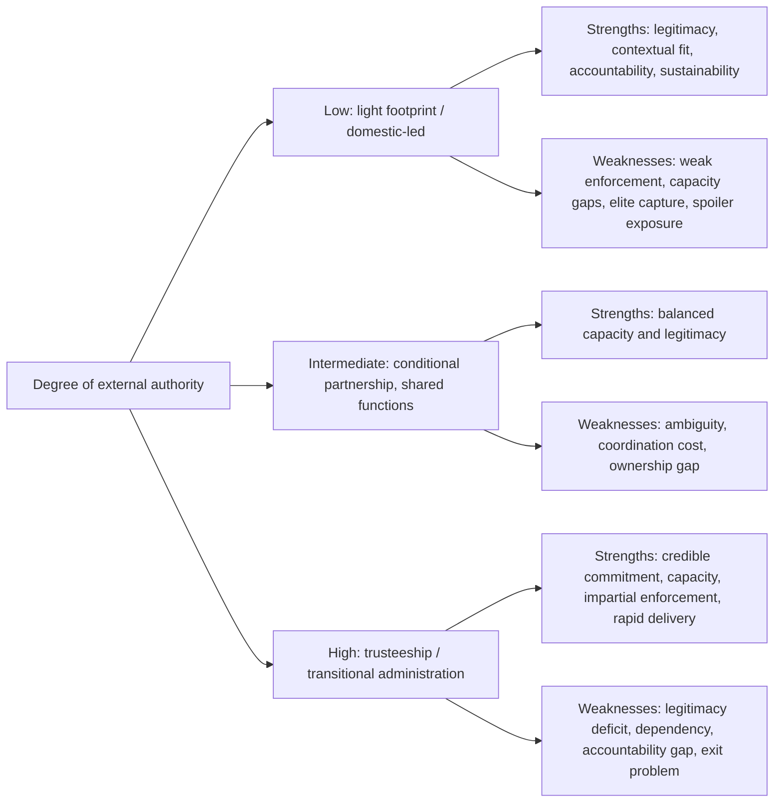
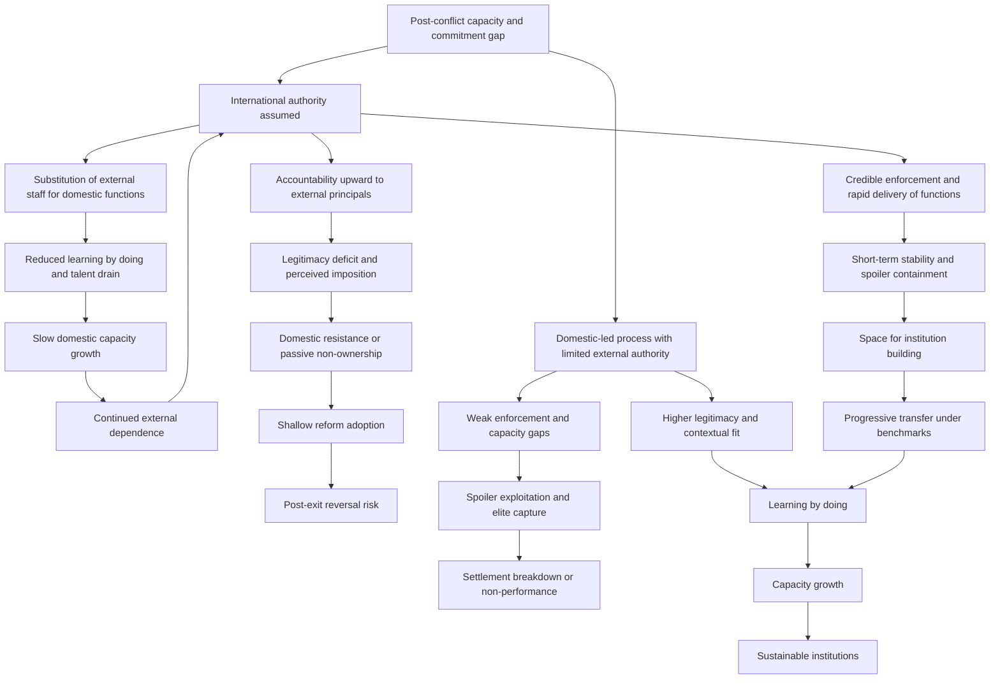

## Local Ownership versus International Trusteeship Trade-offs in Statebuilding


### Scope and Framing

This item treats the allocation of **decision authority and implementation responsibility** between domestic actors and external actors as a central design variable in post-conflict statebuilding. At one pole, international actors hold or share sovereign-like powers (transitional administration, trusteeship, high-representative authority); at the other, domestic actors direct the process and external actors advise, fund, or monitor. The analytical question is: given a post-conflict state's capacity, legitimacy, and spoiler environment, how should authority be distributed along this spectrum, and how should it *change over time*, so as to close off the characteristic failure modes (external imposition and legitimacy deficit, domestic capture and non-performance, indefinite dependency, and premature withdrawal) at tolerable cost?

**Key Points**

- The choice is a **trade-off between capacity/credibility supplied by outsiders and legitimacy/sustainability supplied by insiders**. Neither pole dominates; each closes some failure modes while opening others.
- "Local ownership" is **ambiguous**: it can mean ownership by the government, by the elite, by civil society, or by the population at large, and these are frequently in tension. Rhetorical commitment to ownership often coexists with external control of substantive decisions.
- Trusteeship and transitional administration can **break commitment problems and enforce settlements** that domestic actors cannot credibly enforce on themselves, but they generate **accountability gaps, dependency, and legitimacy costs** that grow with duration.
- The relationship between the degree of international authority and long-term outcomes is **confounded by selection**: the most intrusive missions are deployed to the hardest cases, so raw comparisons mislead [Unverified as settled].
- Design consensus has shifted toward **conditional, time-bound, and progressively transferred authority**, with explicit exit criteria, rather than either open-ended trusteeship or immediate full handover [interpretation varies].

**Definitions on first use**

- **Statebuilding**: efforts (domestic and external) to establish, reconstitute, or strengthen the institutions, capacities, and legitimacy of a state.
- **Local ownership**: the degree to which domestic actors set priorities, make decisions, control resources, and bear responsibility for outcomes in a reform or peacebuilding process.
- **International trusteeship**: an arrangement in which external actors exercise governmental authority, in whole or part, over a territory or state for a defined or undefined period, with the aim of building institutions to which authority will later be transferred.
- **Transitional administration**: a temporary governance arrangement in which an international body exercises legislative, executive, and often judicial authority (for example, a UN-led administration).
- **Neotrusteeship**: contemporary forms of international authority that stop short of formal colonial-style control but involve substantial external decision power (shared sovereignty, high-representative powers, intrusive conditionality).
- **Shared sovereignty**: an arrangement in which external actors hold authority over specific functions within a state on a long-term basis with the state's formal consent.
- **Light footprint**: an approach in which international actors keep their presence and authority limited, relying on domestic actors for implementation.
- **Conditionality**: the linking of aid or support to the recipient's meeting specified policy or institutional requirements.
- **Ownership gap**: the divergence between formal domestic ownership of a process and actual control of key decisions by external actors.
- **Substitution versus support**: two external roles, where substitution means external actors perform state functions directly and support means they strengthen domestic actors' capacity to do so.
- **Capacity trap (isomorphic mimicry)**: a condition in which institutions adopt the external form of functioning organizations without acquiring the capability, described in the work of Andrews, Pritchett, and Woolcock.
- **Principal-agent problem**: a situation in which one party (agent) acts on behalf of another (principal) but has divergent interests and private information.
- **Exit (or transition) criteria**: pre-specified conditions under which external authority is reduced or withdrawn.
- **Moral hazard (in this context)**: the tendency of domestic actors to under-invest in their own effort or accountability when external actors bear the costs of failure.

---

### The Authority Spectrum

External involvement in statebuilding varies along a continuum of authority over decisions and implementation.

| Model | External authority | Domestic authority | Typical features | Illustrative form |
| --- | --- | --- | --- | --- |
| **Full transitional administration** | Legislative, executive, and judicial powers | Advisory or consultative roles, gradually expanding | Direct governance; international staff in line positions | UN transitional administrations |
| **Trusteeship with delegated domestic bodies** | Reserve powers and veto; core decision authority | Operational governance under supervision | International body can override or dismiss officials | High-representative-type powers |
| **Shared sovereignty / co-governance** | Defined functions (for example, justice, finance, policing) | Remaining functions | Long-term, consent-based; embedded international personnel | Joint or embedded institutions |
| **Intrusive conditionality and monitoring** | Leverage through aid and recognition | Formal decision authority | External actors set benchmarks and can withhold resources | Structured conditionality regimes |
| **Advisory and capacity-building partnership** | Technical assistance and funding | Decision authority and implementation | External staff advise and train | Standard development cooperation |
| **Light footprint** | Minimal; facilitation and monitoring | Primary authority | Small missions; reliance on domestic actors | Limited-mandate missions |
| **Domestic-led with external observers** | Verification or guarantor role only | Full authority | Third-party monitoring | Ceasefire and agreement verification |

These are **ideal types**, and actual arrangements combine features across functions (for example, external control of security or finance with domestic control of local administration). Scholarly classification of any single case varies [terminology varies].

#### Dimensions of Authority

Authority can be disaggregated:

| Dimension | Question | Range |
| --- | --- | --- |
| **Decision authority** | Who makes binding decisions? | External veto/override ↔ domestic sovereign |
| **Implementation** | Who carries out functions? | International staff ↔ domestic civil service |
| **Resource control** | Who controls budgets and procurement? | Donor-managed ↔ national treasury |
| **Personnel** | Who appoints and dismisses officials? | External power to remove ↔ domestic appointment |
| **Agenda-setting** | Who sets priorities and reform sequence? | Donor priorities ↔ domestic priorities |
| **Accountability** | To whom are officials answerable? | External principal ↔ domestic citizens |
| **Time horizon and exit** | Who decides when authority transfers? | External discretion ↔ domestic demand or fixed criteria |

**Design consideration**: authority can be allocated **differently across dimensions and functions**. For example, external control over security-sector vetting and budget oversight may coexist with domestic control over local service priorities. Hybrid allocations often perform better than either pole, though they are harder to coordinate [interpretation varies].

---

### Why External Authority Is Sought: The Case for Trusteeship

External authority addresses specific structural problems that domestic processes cannot resolve on their own.

| Problem | How external authority helps | Recall |
| --- | --- | --- |
| **Credible commitment** | Third party enforces settlement terms and guarantees that no party can exploit others | Commitment problems arise when parties cannot credibly promise future behavior |
| **Capacity gap** | Provides personnel, technical expertise, and resources absent domestically | Absorptive capacity and administrative capacity constraints |
| **Spoiler containment** | Provides security and enforcement against groups that would sabotage | Spoiler dynamics under weak state control |
| **Legitimacy of impartiality** | Neutral administrator not identified with any faction | Concern about victor's justice or partisan capture |
| **Breaking elite capture** | Overrides entrenched interests resisting reform | Elite pacts and rent-seeking |
| **Coordination** | Aligns multiple actors and donors | Fragmentation costs |
| **Rapid delivery of basic functions** | Restores services and order quickly | Security-first logic |

#### A Formal Sketch: The Commitment Value of External Enforcement

Consider two domestic parties $A$ and $B$ negotiating a settlement whose implementation requires each to relinquish some power. Without enforcement, each fears that the other will exploit disarmament or power-sharing, and the settlement fails if either expects the other to defect. Let $q$ be the probability that a party expects the other to comply. Party $i$ complies if:

$$q \cdot V_i^{\text{settle}} + (1-q)\cdot V_i^{\text{exploited}} > V_i^{\text{fight}}$$

An external actor with credible enforcement capacity **raises $q$** by making defection costly, and may also alter $V_i^{\text{exploited}}$ by providing protection, thereby expanding the range of settlements that are self-enforcing. This is the **commitment-supplying function** of external authority.

**Causal reading (variables and direction):**

| Variable | Change | Effect on settlement viability |
| --- | --- | --- |
| Credibility of external enforcement | increases | increases $q$; increases viability |
| External protection of a party's downside | increases | increases $V_i^{\text{exploited}}$; increases viability |
| Perceived bias of external enforcer | increases | decreases the disfavored party's $q$ and willingness to comply |
| Duration and predictability of external commitment | increases | extends time horizon; sustains compliance |
| Anticipated external withdrawal | increases | decreases $q$; raises fear of post-withdrawal defection |

**Model assumptions and where they break down**

- Assumes the external actor's commitment is **credible**. External actors face domestic political constraints, donor fatigue, and shifting priorities that reduce credibility over time.
- Assumes the external actor is **impartial or at least trusted** by both parties. Perceived bias undermines the commitment function.
- Treats parties as **unitary**. Factions within each party may respond differently.
- Ignores the **time dimension**: the commitment value must last through the period during which vulnerability persists, and external presence has finite duration.
- Does not capture costs to legitimacy and dependency.

---

### Why Local Ownership Is Sought: The Case for Domestic Leadership

Local ownership addresses distinct problems associated with external control.

| Problem | How local ownership helps | Mechanism |
| --- | --- | --- |
| **Legitimacy** | Institutions built and directed by domestic actors are more likely to be accepted | Procedural and identity-based legitimacy (recall the relegitimation item) |
| **Contextual fit** | Domestic actors possess knowledge of norms, politics, and practical constraints | Reduces mismatch and template imposition |
| **Sustainability** | Institutions that domestic actors chose and paid for are more likely to persist after withdrawal | Avoids the capacity trap and dependency |
| **Accountability to citizens** | Officials answerable to the population rather than to external principals | Aligns incentives with domestic constituencies |
| **Capacity building by doing** | Learning occurs through responsibility | Substitution prevents learning |
| **Avoiding neocolonial dynamics** | Reduces resentment toward foreign rule | Perceived infringement of sovereignty |
| **Political settlement consistency** | Reforms that reflect domestic political bargains are more implementable | Avoids reforms that ignore elite and social constraints |

#### A Formal Sketch: Ownership, Effort, and Accountability

Model a domestic actor $D$ choosing effort $e$ on institutional reform, with external actor $E$ providing support $s$ (funding, staff) and holding authority share $\alpha \in [0,1]$ over decisions. Let the reform outcome be:

$$Q = \phi(e,\, s,\, \alpha) \cdot \ell(\alpha)$$

where $\phi$ is the technical quality of reform (increasing in domestic effort $e$ and external support $s$; potentially increasing in external authority $\alpha$ via capacity, but with diminishing returns) and $\ell(\alpha)$ is a **legitimacy multiplier**, decreasing in the degree of external authority. Domestic actor's effort responds to ownership:

$$e = e(\alpha), \quad \frac{de}{d\alpha} < 0$$

that is, greater external authority tends to reduce domestic effort and responsibility (moral hazard and crowding out).

**Causal reading (variables and direction):**

| Variable | Change | Effect on reform outcome |
| --- | --- | --- |
| External authority $\alpha$ | increases | raises technical quality up to a point; lowers legitimacy $\ell$; reduces domestic effort $e$ |
| External support $s$ | increases | raises technical quality; may reduce domestic effort if unconditional |
| Domestic effort $e$ | increases | raises quality and future sustainability |
| Perceived imposition | increases | lowers legitimacy multiplier |
| Duration of high $\alpha$ | increases | compounds dependency; deepens legitimacy cost |

The stylized implication is that **outcome quality $Q$ may be maximized at an interior level of external authority**, with the optimum shifting toward higher $\alpha$ where domestic capacity and impartiality are lowest and spoiler threat highest, and toward lower $\alpha$ as capacity and domestic legitimacy grow.

**Model assumptions and where they break down**

- The functional forms and signs are **stylized**, and the interior-optimum result is illustrative, not empirically established.
- Treats "authority" as a **scalar** while it is multidimensional across functions and time.
- Assumes external actors are **benevolent and competent**, while external actors have own interests (security, geopolitical, domestic politics) and face information constraints.
- Ignores **heterogeneity of domestic actors**: increased ownership may empower elites rather than citizens.
- Treats legitimacy as a **multiplicative filter**, one of several possible specifications.

---

### The Ambiguity of Local Ownership

"Local" and "ownership" both carry multiple meanings, and confusion among them produces design errors.

| Sense of "local" | Who is included | Risk if treated as sole meaning |
| --- | --- | --- |
| **Government** | State officials | Elite or regime capture; exclusion of society |
| **Political elites** | Leaders of major factions | Reflects elite bargains; may not represent citizens |
| **Civil society** | NGOs, associations, community leaders | Urban, donor-linked civil society may not represent the population; risk of NGO-ization |
| **Local communities** | Villages, local authorities, customary actors | Fragmentation; uneven capacity; local elite capture |
| **Population at large** | Citizens broadly | Hard to operationalize; requires participation mechanisms |
| **Diaspora and returnees** | Externally based nationals | Perceived as outsiders by residents; differing interests |

| Sense of "ownership" | Meaning | Test |
| --- | --- | --- |
| **Formal** | Documents and rhetoric assert domestic leadership | Whose name is on the plan? |
| **Substantive decision control** | Domestic actors can determine or veto major decisions | Can they say no? |
| **Resource control** | Domestic actors control budgets | Who controls funds? |
| **Commitment and responsibility** | Domestic actors bear consequences and are motivated | Who is accountable for outcomes? |
| **Legitimacy of process** | Population perceives the process as its own | Is the process seen as domestic? |

The **ownership gap** arises when formal ownership is asserted while substantive decisions are made by external actors through conditionality, staff embedding, or funding control. A common pattern is **"ownership by conditionality"**: domestic actors formally adopt reforms designed externally because funding depends on it, without genuine commitment, leading to shallow adoption.

---

### Trade-off Structure



| Dimension | High external authority | Low external authority |
| --- | --- | --- |
| **Credible commitment and enforcement** | Strong | Weak, depends on domestic self-enforcement |
| **Technical capacity and speed** | High initially | Limited; slower |
| **Legitimacy** | Contested; imposition costs | Higher if process inclusive; risk of elite legitimacy only |
| **Accountability to citizens** | Low (accountable to external principals) | Potentially higher, but often weak |
| **Sustainability after exit** | Risk of collapse or dependency | Better if capacity develops; risk of failure |
| **Risk of elite capture** | Reduced for some functions but external actors can be captured or co-opted | Higher |
| **Spoiler containment** | Stronger | Weaker |
| **Learning-by-doing** | Reduced | Increased |
| **Cost to external actors** | High | Lower |
| **Exit problem** | Severe: "exit trap" | Mild |

---

### The Dynamics of Authority Over Time

The choice is **dynamic**. Authority should ideally shift as conditions change, and the mechanics of transfer are a design problem in their own right.

#### The Dependency and Exit Trap

Prolonged external authority can produce:

- **Learned dependence**: domestic officials defer to external actors, and skills do not develop.
- **Crowding out of domestic institutions**: better-paid external and NGO positions draw talent away from the civil service (the "brain drain within").
- **Parallel structures**: external bodies perform functions that domestic institutions never assume.
- **Extended mandate**: risks of withdrawal (relapse, collapse) make external actors reluctant to leave, while domestic actors have little incentive to demand handover if external actors bear costs.

A stylized dynamic for domestic capacity $K_t$ under external substitution $\sigma_t \in [0,1]$ (fraction of functions performed by external actors):

$$K_{t+1} = K_t + \lambda\,(1-\sigma_t)\, u_t - \delta K_t + \eta\, \tau_t$$

where $\lambda(1-\sigma_t)u_t$ is capacity gained through domestic practice (learning by doing, scaled by the fraction of functions domestic actors perform and by effective use $u_t$), $\delta K_t$ is depreciation (attrition, emigration, loss of skills), and $\eta \tau_t$ is capacity gained through explicit training and mentoring $\tau_t$.

**Causal reading (variables and direction):**

| Variable | Change | Effect on domestic capacity growth |
| --- | --- | --- |
| Substitution $\sigma_t$ | increases | reduces learning by doing; slows capacity accumulation |
| Training and mentoring $\tau_t$ | increases | increases capacity, independent of substitution |
| Depreciation $\delta$ (attrition, brain drain) | increases | reduces capacity |
| Domestic responsibility for real functions | increases | increases $u_t$ and learning |

The model highlights a **tension**: high substitution delivers immediate functionality but slows the capacity accumulation that would enable exit, whereas low substitution builds capacity but risks failure in the short run. **Progressive transfer** (reducing $\sigma_t$ over time under conditions) is the design response.

**Model assumptions and where they break down**

- The capacity dynamic is **conceptual**, with parameters not estimated.
- Capacity is treated as scalar and homogeneous across sectors, whereas capacity in different functions accumulates differently.
- Training is treated as effective independent of substitution, but training divorced from real responsibility often has limited effect (the "workshop trap").
- Does not model **political will** as a separate driver of whether capacity is used.

#### Transition Design

| Transition mechanism | Description | Risk |
| --- | --- | --- |
| **Benchmark-based transfer** | Authority transfers upon meeting specified benchmarks | Gaming of benchmarks; indefinite postponement; unrealistic criteria |
| **Time-bound mandate with review** | Fixed period with periodic reviews | Arbitrary deadline; premature exit |
| **Function-by-function transfer** | Sequenced handover across sectors | Coordination; uneven progress |
| **Embedded counterpart model** | External advisers paired with domestic officials who assume responsibility | Advisers substitute in practice; "shadowing" |
| **Reserve powers with declining use** | External retains veto but uses it sparingly and progressively less | Latent authority may deter domestic initiative; legitimacy costs of continued reserve powers |
| **Sunset and residual mechanisms** | Defined end with residual monitoring or guarantor role | Residual arrangements may be underfunded |

Recall from the tribunal item that completion strategies and residual mechanisms are needed to avoid open-ended mandates; the same logic applies to administration and trusteeship.

---

### Principal-Agent and Accountability Problems

External authority introduces layered principal-agent relationships:

| Relationship | Principal | Agent | Problem |
| --- | --- | --- | --- |
| **Donor to implementing agency** | Donor governments | International organizations, contractors | Reporting to donor priorities; cost and visibility pressure |
| **Implementing agency to local counterpart** | International agency | Domestic officials | Divergent interests; compliance versus commitment |
| **Local government to citizens** | Population | Officials | In external-dependent systems, officials may be accountable upward to donors rather than to citizens |
| **International administrators to affected population** | Population (nominally) | International administrators | Accountability gap: administrators exercising governmental power without electoral or judicial accountability to the governed |

The accountability gap of international administrations is a recognized legitimacy problem: **officials exercising public authority answer to external bodies**, and mechanisms for redress by the governed may be absent or weak. Design responses include **internal oversight, ombudsman institutions, judicial review mechanisms, and domestic advisory bodies with formal roles** [effectiveness varies].

Recall the **fiscal contract** logic from the relegitimation item: when state revenue comes from external sources rather than citizens, accountability to citizens weakens. External authority over resources can exacerbate this.

---

### Feedback Loop Structure



**Reading the loops**

- **Reinforcing loop R1 (dependency)**: external authority → substitution → weak learning and talent drain → slow capacity growth → continued dependence → continued external authority.
- **Reinforcing loop R2 (imposition)**: external authority → upward accountability → legitimacy deficit → passive non-ownership → shallow reform → external actors tighten control to compensate.
- **Reinforcing loop R3 (virtuous transfer)**: enforcement and stability → space for capacity building → progressive transfer → learning by doing → capacity growth → sustainable institutions.
- **Reinforcing loop R4 (weak-enforcement spiral)**: low external authority → weak enforcement → spoiler exploitation and elite capture → settlement breakdown → demand for renewed external intervention.

The design objective is to **strengthen R3 while dampening R1, R2, and R4**, using strong but time-limited enforcement early, progressive transfer with real responsibility, upward-and-downward accountability, and safeguards against capture.

---

### Design Considerations by Function

Optimal authority allocation differs by function, because functions differ in their commitment requirements, legitimacy sensitivity, and capacity needs.

| Function | Case for stronger external role | Case for stronger domestic role | Common hybrid |
| --- | --- | --- | --- |
| **Security and ceasefire enforcement** | Commitment problem; spoiler containment; impartiality | Legitimacy of domestic forces; sustainability | External guarantee and monitoring; domestic force building with vetting |
| **Security sector reform** | Vetting and depoliticization against entrenched interests | Ownership of security institutions; national security sensitivity | Joint oversight; conditional support |
| **Justice and rule of law** | Independence from local capture; impartiality in sensitive cases | Legitimacy of justice; legal culture fit | Hybrid or internationalized chambers; international judges with local staff |
| **Public financial management** | Integrity; anti-corruption; donor confidence | Fiscal sovereignty; accountability to citizens | External co-signatories or audit with domestic budget authority |
| **Elections and political process** | Neutral administration; credibility in divided settings | Sovereignty; political ownership | International technical support with domestic electoral bodies; observers |
| **Constitution-making** | Neutral facilitation; technical expertise | Core sovereign act; legitimacy | External facilitation with domestic authorship |
| **Service delivery** | Speed; capacity | State legitimacy and attribution | Co-delivery with transition plan |
| **Economic policy** | Macro-stability credibility | Domestic priorities; distributional choices | Conditionality bounded by domestic choice |
| **Anti-corruption** | Independence from implicated elites | Domestic accountability | Hybrid commissions with external members |
| **Transitional justice** | Independence; legitimacy in international norms | Local resonance; victim participation | Hybrid mechanisms |

Recall that the choice of forum for justice is a capacity-legitimacy-independence trade-off, and similar logic applies across functions. **Functions with high commitment problems and elite-capture risks** tend to favor stronger external roles early, while **functions central to sovereign identity and legitimacy** tend to favor domestic leadership from the outset.

---

### Cases as Evidence for Mechanisms

Cases below illustrate specific mechanisms rather than provide a survey. Characterizations are simplified, and scholarly assessments differ.

#### Mechanism: Comprehensive Transitional Administration (East Timor and Kosovo)

UN transitional administrations exercised legislative and executive authority during transitions. They supplied enforcement, rapid delivery of basic functions, and a framework for institution-building, while attracting criticism for **limited local participation, high cost, and accountability gaps**, and for constraining domestic institutional development through substitution in some sectors. The cases illustrate both the **commitment-supplying function** and the **dependency and legitimacy costs (R1, R2)**, and assessments of overall outcomes vary across analysts [assessments differ].

#### Mechanism: High-Representative Authority and Reserve Powers (Bosnia and Herzegovina)

An international high representative with powers to impose legislation and dismiss officials was used to overcome deadlock among domestic actors. The arrangement is cited for **breaking obstruction and implementing reforms** that domestic parties would not adopt, and criticized for **weakening domestic accountability, incentivizing domestic actors to defer decisions to the international authority, and prolonging dependence**. This illustrates the **moral hazard** and the **reserve-power dilemma**, where latent authority may both enable and deter domestic initiative [interpretation varies].

#### Mechanism: Light Footprint Approach (Afghanistan, Early Post-2001)

The initial approach emphasized limited international authority and reliance on domestic actors, with a narrow mandate. Critics argued that it left **capacity and security gaps** that spoilers exploited and that external military and later civilian involvement expanded substantially, while others argue that later heavy-footprint involvement generated its own problems of dependency and legitimacy. The case illustrates the **weak-enforcement spiral (R4)** risk of low authority under high spoiler capacity, alongside the costs of subsequent large-scale substitution [assessments differ].

#### Mechanism: Ownership by Conditionality and Shallow Adoption

Cases in which domestic governments formally adopted externally designed reform plans as a condition for aid illustrate the **ownership gap** and **isomorphic mimicry**: institutions took the formal shape demanded by donors without acquiring functional capability or domestic commitment. This pattern is documented in the capacity-building and public administration reform literature [general pattern; specifics vary].

#### Mechanism: Hybrid Justice and Anti-Corruption Bodies

Internationalized or hybrid institutions, with a mix of international and national personnel, have been used to combine independence with local legitimacy, with results varying with design details such as control allocation, funding, and political backing (recall the hybrid tribunal item). Their effect on long-term domestic capacity is contested, and legacy provisions frequently underdelivered [Unverified as settled].

#### Mechanism: Domestic-Led Peacebuilding and Its Risks

Processes in which domestic actors led, with limited external authority, illustrate **higher legitimacy and contextual fit** in some cases and **elite capture and weak enforcement** in others, depending on the strength of domestic commitment, the balance of power, and the spoiler environment. This underlines that **local ownership is not automatically legitimate or effective**, particularly where ownership means ownership by a narrow elite.

#### Mechanism: Long-Term Shared Sovereignty and Embedded Support

Arrangements in which external personnel were embedded in specific state functions on consent-based, longer-term terms are discussed as potential middle paths, with limited comparative evidence on outcomes and continuing debate about accountability and sovereignty implications [Unverified as settled].

---

### Design Failure Modes

| Failure mode | Cause | Design response |
| --- | --- | --- |
| **Imposition and legitimacy deficit** | External decisions without domestic buy-in | Structured domestic consultation; domestic authorship of core decisions; visible domestic role |
| **Dependency and exit trap** | Substitution without transfer | Time-bound mandates; benchmark-based transfer; embedded counterparts with real responsibility |
| **Ownership gap (formal ownership, external control)** | Conditionality substituting for commitment | Support domestic priorities; align conditions with domestic reform agenda; avoid excessive conditions |
| **Moral hazard** | External actors absorb costs of failure | Shared cost and accountability; incremental resource release tied to domestic effort |
| **Elite capture of ownership** | Ownership equated with government or elites | Broader participation; civil society and social accountability; monitoring |
| **Accountability gap of administrators** | No recourse for those governed | Oversight bodies; ombudsman; judicial review; domestic advisory bodies |
| **Capacity trap (isomorphic mimicry)** | Adoption of forms without function | Function-focused assessment; problem-driven adaptation; iterative learning |
| **Talent drain** | External salaries and roles crowd out civil service | Salary alignment; capacity retention measures; embedding within civil service |
| **Premature withdrawal** | Donor fatigue or political pressure | Long-term commitment planning; residual mechanisms; guarantor role |
| **Indefinite mandate** | No exit criteria | Explicit benchmarks; sunset provisions; periodic review with domestic input |
| **Weak enforcement under light footprint** | Insufficient authority for spoiler threat | Calibrate authority to spoiler capacity; targeted enforcement functions; guarantors |
| **Fragmented external actors** | Uncoordinated donors and agencies | Coordination structure; joint assessments; single lead where appropriate |
| **Parallel structures** | External bodies bypass state institutions | Integration into state systems; transition plans; use of country systems |
| **Benchmark gaming** | Indicators manipulated | Multiple indicators; independent verification |
| **Legitimacy of external actors questioned** | Perceived bias or agenda | Transparency of interests; multilateral composition; accountability |
| **Ignoring local heterogeneity** | Treating "local" as monolithic | Multi-level engagement; inclusion of marginalized groups and local authorities |

---

### Design Checklist

**Example: Structured Questions for Allocating Authority Between External and Domestic Actors**

1. **Diagnose binding constraints.** Is the dominant problem a commitment and enforcement gap, a capacity gap, a legitimacy gap, elite capture, or spoiler threat?
2. **Assess domestic actors.** Who are the relevant domestic actors, what are their interests and legitimacy, and whose ownership is being enabled?
3. **Disaggregate by function.** For each function (security, justice, finance, elections, services), what allocation of decision authority, implementation, and resource control is appropriate?
4. **Define the external role precisely.** Substitution or support? Veto or advice? What powers, over what period, and answerable to whom?
5. **Design accountability.** What mechanisms allow the governed to contest and review the exercise of external authority, and how are domestic officials made accountable to citizens rather than only to donors?
6. **Set transition and exit criteria.** What benchmarks, timelines, and review procedures govern the transfer of authority, and how are gaming and indefinite postponement guarded against?
7. **Structure capacity building.** How will learning by doing be preserved, and how will training be linked to real responsibility?
8. **Manage conditionality.** Are conditions aligned with domestic priorities and limited in number, and do they risk creating the ownership gap?
9. **Address dependency and talent drain.** How will salaries, roles, and incentives avoid crowding out domestic institutions?
10. **Plan for residual roles.** What monitoring, guarantor, or residual functions will remain after transfer, and how will they be financed?
11. **Coordinate external actors.** How will donors and agencies align to avoid fragmentation and parallel structures?
12. **Monitor and adapt.** What indicators of legitimacy, capacity, and performance will guide adjustment, and who participates in the review?

**Illustrative pseudo-specification of an authority allocation and transition plan**

```plaintext
AUTHORITY_ALLOCATION_PLAN:
  context_id: <identifier>
  diagnosis:
    binding_constraints: [commitment_gap | capacity_gap | legitimacy_gap | elite_capture | spoiler_threat]
    domestic_actors: [{actor, interests, legitimacy_basis, capacity}]
    external_actors: [{actor, interests, resources, constraints}]
  functions:
    - function: security | ssr | justice | finance | elections | constitution | services | economic_policy | anti_corruption | transitional_justice
      initial_allocation:
        decision_authority: external | shared | domestic
        implementation: external | mixed | domestic
        resource_control: external | shared | domestic
        personnel_powers: <who appoints and removes>
      rationale: <link to binding constraint>
      accountability:
        upward: <to external principals>
        downward: <to citizens, oversight bodies, review mechanisms>
      capacity_plan:
        counterparts: <embedded pairing arrangement>
        responsibility_transfer: <tasks assumed by domestic staff over time>
        training: <linked to real responsibility>
      transition:
        benchmarks: [<measurable conditions>]
        verification: <independent method>
        review_schedule: <interval>
        reserve_powers: {retained: true/false, use_conditions: <limits>, sunset: <date or criterion>}
        residual_role: <monitoring or guarantor arrangement>
  conditionality:
    conditions: [<limited list aligned with domestic priorities>]
    gaming_safeguards: <multiple indicators, independent verification>
  domestic_participation:
    formal_roles: <consultation and decision roles>
    inclusion: <civil society, local authorities, marginalized groups>
  dependency_controls:
    salary_alignment: <policy>
    parallel_structure_limits: <policy>
    talent_retention: <measures>
  coordination:
    lead_body: <identifier>
    donor_alignment: <mechanism>
  financing:
    external_funding_profile: <declining schedule>
    domestic_revenue_plan: <path>
  monitoring:
    indicators: {legitimacy, capacity, performance, dependency, security}
    adaptation_triggers: <conditions>
```

The specification is a schematic illustration of allocation parameters, not a standardized instrument.

---

### Limits of the Model

- **Selection and endogeneity.** More intrusive interventions are directed at harder cases, so comparisons across authority levels are confounded, and causal claims about the effect of trusteeship on outcomes are unreliable [Unverified as settled].
- **The formal sketches are conceptual.** Functional forms, signs, and the interior-optimum result are illustrative, and parameters are not empirically estimated.
- **Authority is multidimensional.** Reducing it to a scalar obscures important variation across functions, decision types, and time.
- **Local and external actors are heterogeneous.** Domestic actors differ in legitimacy, interests, and capacity, and external actors have their own agendas and constraints, so simple "local versus international" framings are misleading.
- **Normative content.** Questions about sovereignty, self-determination, and the legitimacy of external rule involve value judgments that technical designs cannot resolve, and consent of the governed is contested in many cases.
- **Counterfactual uncertainty.** What would have happened under a different allocation of authority is unobserved.
- **Time horizons.** Capacity and legitimacy build slowly, and typical mandates and donor cycles are shorter than relevant processes.
- **Behavior may vary**: predicted effects depend on actors' beliefs, institutional context, and enforcement conditions, and the formal sketches above are simplifications.

---

**Conclusion**

Local ownership and international trusteeship represent **complementary solutions to different problems**: external authority supplies credible commitment, enforcement, impartiality, and capacity where domestic actors cannot credibly bind themselves or lack capability, while domestic ownership supplies legitimacy, contextual fit, accountability to citizens, and the learning-by-doing on which sustainability depends. The costs mirror the benefits: high external authority generates legitimacy deficits, accountability gaps, substitution, dependency, and an exit problem, while low external authority risks weak enforcement, elite capture, and exposure to spoilers. "Local ownership" itself is ambiguous and can mean ownership by the government, elites, civil society, or the population, so ownership rhetoric can mask an ownership gap or the entrenchment of narrow interests. The most defensible design stance allocates authority **by function and by phase**: strong, time-limited external roles where commitment problems and capture risks are acute (security guarantees, vetting, financial integrity), domestic leadership from the outset for core sovereign and legitimacy-critical decisions, explicit accountability of external authority to the governed, embedded counterparts who assume real responsibility, and **benchmark-based, verifiable, progressive transfer** with residual guarantor roles to prevent both indefinite trusteeship and premature withdrawal. Because evidence is confounded by selection and outcomes depend heavily on context, allocation decisions should be treated as adaptive hypotheses subject to continuous review with domestic participation.

**Related Topics**

- Transitional administration and neotrusteeship: design and critiques
- Shared sovereignty and embedded international personnel
- Conditionality, aid effectiveness, and the ownership gap
- Capacity building, isomorphic mimicry, and the capacity trap
- Principal-agent problems in international statebuilding
- Light footprint versus heavy footprint interventions
- Exit strategies, benchmarks, and residual mechanisms
- Hybrid institutions: justice, anti-corruption, and electoral bodies
- Fiscal contract, aid dependence, and accountability
- Legitimacy of international authority and accountability of international administrations