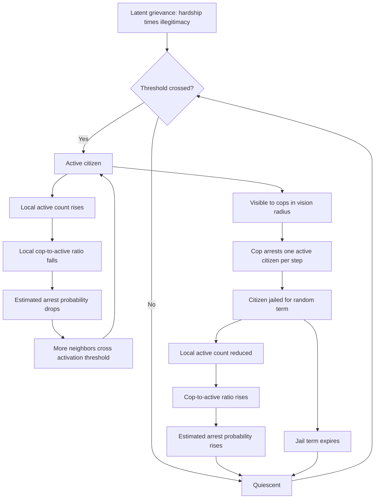

## Epstein's Agent-Based Model of Civil Violence and Rebellion


### Scope and Framing

This item treats Joshua Epstein's 2002 model of civil violence (published as "Modeling civil violence: An agent-based computational approach" in *PNAS*) as a **generative-social-science exemplar**: a minimal computational system in which decentralized agents following simple, locally evaluated rules produce macro-level regularities (long stable peace, sudden rebellion outbreaks, punctuated equilibrium) that aggregate or equilibrium reasoning does not readily explain. The analytical question is: what does the model's rule structure imply about the causal roles of **grievance, perceived risk, government legitimacy, and coercive capacity**, why does it generate *bursty* rather than smooth violence dynamics, what are its inferential limits, and how should the model be implemented, parameterized, and validated so that its outputs are interpreted as *mechanism demonstrations* and not as forecasts?

**Key Points**

- The model contains **two agent types** on a toroidal grid: **citizens** (who may be quiescent or actively rebellious) and **cops** (who arrest active citizens within a vision radius). Behavior is fully determined by a small set of local rules.
- The core decision rule is a **threshold rule** comparing *grievance* against *perceived net risk*: a citizen rebels when $G - N > T$, where $G = H(1-L)$ is grievance (hardship scaled by illegitimacy) and $N = R\cdot P$ is net risk (risk aversion times estimated arrest probability).
- The **arrest probability estimate** is the model's central feedback: $P = 1 - \exp[-k\,(C/A)]$, depending on the local ratio of cops to active citizens, which makes each citizen's incentive depend on what *other* citizens do (strategic complementarity).
- The model produces **punctuated equilibrium**: long periods of apparent quiescence interrupted by abrupt, self-amplifying outbreaks, a pattern attributed to the interaction of latent grievance, threshold heterogeneity, and local cop-to-rebel ratios.
- Its **limitations are substantial**: no communication, no organization, no leaders, no economic or ideological structure, and a stylized arrest process. It supports *qualitative mechanism claims*, not point predictions [interpretation varies across scholarship].

**Definitions on first use**

- **Agent-based model (ABM)**: a computational model in which autonomous agents follow specified behavioral rules and interact with each other and an environment, so that aggregate patterns emerge from micro-level interaction rather than being imposed.
- **Generative social science**: the methodological stance, associated with Epstein, that explaining a macro regularity means *growing* it from plausible micro-specifications ("if you didn't grow it, you didn't explain it").
- **Emergence**: the appearance of macro-level patterns that are not directly encoded in any single agent's rule.
- **Toroidal grid**: a lattice whose edges wrap around so that every cell has the same number of neighbors and no boundary effects arise.
- **Vision radius ($v$)**: the local neighborhood, defined by Euclidean or Manhattan distance, within which an agent observes others.
- **Grievance ($G$)**: in this model, the product of perceived hardship and perceived government illegitimacy.
- **Perceived hardship ($H$)**: an agent-specific, exogenously assigned, time-invariant variable in $[0,1]$ representing economic or social deprivation.
- **Government legitimacy ($L$)**: a global parameter in $[0,1]$ representing the extent to which the population regards the regime as rightful.
- **Risk aversion ($R$)**: an agent-specific, time-invariant parameter in $[0,1]$ scaling how heavily an agent weighs the danger of arrest.
- **Estimated arrest probability ($P$)**: the agent's subjective, locally computed probability of being arrested if active.
- **Net risk ($N$)**: the product $R \cdot P$.
- **Threshold ($T$)**: the level of $G - N$ above which an agent becomes active; a global parameter in the base model.
- **Active, quiescent, jailed**: the three states of a citizen. Active citizens are rebellious, quiescent citizens are not, and jailed citizens are removed from the population for a sampled term.
- **Jail term ($J_{\max}$)**: the maximum number of time steps an arrested citizen is jailed, drawn uniformly at random from $[0, J_{\max}]$ in the base specification.
- **Punctuated equilibrium**: a dynamic pattern of long stasis interrupted by rapid change.
- **Strategic complementarity**: a property of interaction in which one agent's incentive to take an action rises when others take it.

---

### Model Architecture

#### Environment and Agents

The environment is a two-dimensional square lattice with **periodic (toroidal) boundaries**, with each cell holding at most one agent. Two agent populations occupy the grid at initialization.

| Element | Description | Base-model characteristics |
| --- | --- | --- |
| **Grid** | Square lattice, wrapped | Commonly $40 \times 40$ in the published parameterization |
| **Citizens** | Agents that are quiescent, active, or jailed | Density fixed by initial parameter; randomly placed |
| **Cops** | Agents that arrest active citizens within vision | Density fixed by initial parameter; randomly placed |
| **Vision radius** | Neighborhood within which agents observe | Same parameter for citizens and cops in the base case ($v$; commonly 7 in the published runs) |
| **Movement** | Agents move to a random empty cell within their vision | Randomized; movement can be disabled in variants |
| **Time** | Discrete steps; agents activated in random order | Sequential random activation per step |

Citizens hold two time-invariant heterogeneous attributes drawn from $U(0,1)$: **hardship $H_i$** and **risk aversion $R_i$**. Legitimacy $L$ is a single global parameter in the base model. Cops are homogeneous.

#### Rule Set

**Rule M (movement)**: at each step, an agent moves to a randomly selected unoccupied site within its vision radius (if movement is enabled).

**Rule A (agent behavior)**: at each step, each unjailed citizen evaluates whether to become or remain active:

$$\text{Active if } \; G_i - N_i > T \;; \quad \text{otherwise quiescent}$$

with the components defined below.

**Rule C (cop behavior)**: each cop inspects all sites within its vision and arrests a randomly selected active citizen from among those visible, moving into that citizen's site. The arrested citizen is jailed for a term drawn uniformly from $\{0, \dots, J_{\max}\}$.

#### Component Definitions

$$G_i = H_i\,(1 - L)$$

Grievance rises with hardship and falls with legitimacy. Legitimacy operates as a **global multiplier** that scales down the hardship each agent experiences as a political grievance.

$$P_i = 1 - \exp\!\Big[-k\,\big\lfloor C_v/(A_v + 1)\big\rfloor\Big]$$

where $C_v$ is the number of cops visible to agent $i$ within its vision radius, $A_v$ is the number of *active* citizens visible to agent $i$ (the "+1" counts the agent itself as a potential active), the floor function is applied to the ratio, and $k$ is a constant chosen so that $P = 0.9$ when $C_v/(A_v+1) = 1$, which gives $k \approx 2.3$.

$$N_i = R_i \, P_i$$

The **estimated arrest probability** thus depends on a *local ratio* of cops to rebels, which gives a **strategic interaction**: the more rebels nearby, the lower the estimated arrest probability for each, encouraging additional rebellion.

**Causal reading (variables and direction):**

| Variable | Change | Effect on agent's propensity to rebel |
| --- | --- | --- |
| Hardship $H_i$ | increases | increases (raises $G_i$) |
| Legitimacy $L$ | increases | decreases (shrinks $G_i$) |
| Risk aversion $R_i$ | increases | decreases (raises $N_i$) |
| Visible cops $C_v$ | increases | decreases (raises $P_i$) |
| Visible active citizens $A_v$ | increases | increases (lowers $P_i$) |
| Threshold $T$ | increases | decreases (harder to satisfy $G - N > T$) |

#### Pseudocode for a Single Time Step

```plaintext
FOR each agent in RANDOM_ORDER(all agents):
    IF agent is Citizen AND agent.state != JAILED:
        IF movement_enabled:
            agent.move_to(random empty site within vision)
        C_v = count of cops within vision of agent
        A_v = count of ACTIVE citizens within vision of agent
        P = 1 - exp(-k * floor(C_v / (A_v + 1)))
        N = agent.R * P
        G = agent.H * (1 - L)
        IF (G - N) > T:
            agent.state = ACTIVE
        ELSE:
            agent.state = QUIESCENT
    ELIF agent is Citizen AND agent.state == JAILED:
        agent.jail_remaining -= 1
        IF agent.jail_remaining <= 0:
            agent.state = QUIESCENT
    ELIF agent is Cop:
        IF movement_enabled:
            agent.move_to(random empty site within vision)
        actives = ACTIVE citizens within vision of agent
        IF actives is not empty:
            target = RANDOM_CHOICE(actives)
            target.state = JAILED
            target.jail_remaining = RANDOM_INT(0, J_max)
            agent.move_to(target.site)
```

**Implementation notes** (behavior may vary by framework and by tie-breaking choices):

- **Update order** matters. The published model uses **random sequential activation**. Synchronous updating or fixed ordering can change dynamics [Unverified as invariant across all parameter regimes].
- **Ties and floor behavior**: the floor function makes $P$ a step function of the cop-to-active ratio, so $P = 0$ whenever $C_v < A_v + 1$.
- **Jailed citizens** are typically removed from the visible-active count and do not move.
- **Random number handling** (seed control and reproducibility) should be explicit in any replication.

---

### The Threshold Structure and Its Consequences

#### Individual Activation Condition

Rearranging Rule A for a citizen with parameters $(H_i, R_i)$ yields a condition on the estimated arrest probability:

$$H_i(1-L) - R_i P_i > T \quad\Longleftrightarrow\quad P_i < \frac{H_i(1-L) - T}{R_i}$$

**Interpretation**: agent $i$ is active whenever its local estimate of arrest probability falls **below a personal critical value** $P_i^{*} = \big[H_i(1-L) - T\big]/R_i$. Agents with high hardship and low risk aversion have high $P_i^{*}$ and are willing to rebel even when police presence is substantial, while agents with low grievance or high risk aversion have $P_i^{*} \le 0$ and never rebel regardless of police presence (they are effectively **immune** to activation).

This gives a **distribution of activation thresholds** across the population. The macroscopic behavior depends on how many agents lie near their thresholds when local conditions shift.

#### Latent Rebellion and Threshold Heterogeneity

Because $H_i$ and $R_i$ are drawn from a continuous distribution, the fraction of agents with $P_i^{*} > 0$ (the potentially rebellious population) grows as legitimacy $L$ falls:

$$\Pr(P_i^{*} > 0) = \Pr\big(H_i(1-L) > T\big)$$

Under $H_i \sim U(0,1)$ this equals $1 - T/(1-L)$ for $T < 1-L$, and zero otherwise. **Legitimacy therefore controls the size of the latent rebel pool**, while local police presence determines which members of that pool are actually active at any moment.

**Model assumptions and where they break down**

- Assumes $H_i$ and $R_i$ are **independent and uniformly distributed**. Correlations (for example, poorer people being less risk-averse) would change threshold structure [Inference].
- Treats $H_i$ as **exogenous and static**, so economic shocks and inequality dynamics are not modeled.
- Treats $L$ as a **global constant** in the base model, so legitimacy cannot be eroded by government behavior within a run except in extensions.
- The **threshold $T$** is an undifferentiated global parameter, though in principle it captures unmodeled psychological or organizational barriers.

---

### The Central Feedback: Arrest Probability as a Function of Local Force Ratio

The model's dynamical content comes from a single interaction channel: **the local cop-to-active ratio determines perceived risk, and perceived risk determines activation, which in turn changes the ratio**.

**Feedback structure**

- **Reinforcing loop (rebellion contagion)**: more active citizens nearby → lower cop-to-active ratio → lower estimated arrest probability → more citizens cross their thresholds → more active citizens.
- **Balancing loop (repression response)**: more active citizens visible to cops → more arrests → active citizens removed to jail → reduced active count → higher cop-to-active ratio.
- **Delayed release loop**: jailed citizens are released after $J$ steps as quiescent, but may re-activate if their grievance remains high and local risk is low.

Because the arrest probability estimate is computed from a **ratio** with a floor, the function has a **sharp nonlinearity**: as long as cops are outnumbered locally ($C_v < A_v + 1$), the estimated arrest probability is exactly zero for everyone in view, which removes all deterrence for the affected agents. This **"safety in numbers" cliff** is the mechanism behind sudden avalanches of activation: once a local cluster of activists exceeds the local number of cops, deterrence collapses in that neighborhood.



**Reading the loops**

- **Reinforcing loop R1 (contagion)**: active count ↑ → arrest-probability estimate ↓ → activation ↑ → active count ↑. This is the **strategic complementarity** that generates avalanches.
- **Balancing loop B1 (repression)**: active count ↑ → cop attention ↑ → arrests ↑ → active count ↓. Its capacity is **bounded by cop density and one-arrest-per-step limits**.
- **Race condition**: the outcome of any local episode depends on whether R1 can outpace B1, which depends on the local cop count relative to the active count.

---

### Emergent Dynamics: Punctuated Equilibrium and Related Regularities

#### Reported Qualitative Behaviors

Epstein's published runs report several qualitative regularities under parameter settings within the studied regime [findings depend on parameterization and are described here qualitatively; treat numeric claims from any specific run as replication-dependent].

| Regularity | Description | Mechanism |
| --- | --- | --- |
| **Punctuated equilibrium** | Long periods of low activity interrupted by abrupt outbreaks of rebellion | Latent grievance with threshold heterogeneity; local cop-to-active ratio shocks trigger avalanches |
| **Non-monotone response to legitimacy** | Small changes in legitimacy can produce large changes in rebellion in some regimes | Threshold pool grows non-linearly; proximity of many agents to thresholds |
| **Bursty arrests** | Arrests cluster in time as outbreaks unfold and are suppressed | Cop response saturates during large outbreaks |
| **Effect of jail terms** | Long jail terms can suppress rebellion but may build up latent pools of released agents | Released agents rejoin with same $H$ and $R$ |
| **Spatial clustering** | Rebellion clusters near local majorities of activists | Local ratio mechanism |
| **Legitimacy shock experiments** | Sudden drop in $L$ produces surge, followed by suppression or persistent rebellion depending on cop density | Timing and scale of threshold crossings |

#### Illustrative Phase Structure

A useful way to conceptualize the parameter space is as three qualitative regimes, described heuristically:

| Regime | Conditions | Typical dynamics |
| --- | --- | --- |
| **Stable quiescence** | High $L$ or high $T$; low latent rebel pool | Few or no active citizens; rare small flare-ups |
| **Punctuated regime** | Intermediate $L$; moderate cop density | Long quiet stretches with intermittent outbreaks |
| **Sustained rebellion** | Low $L$; low cop density relative to latent pool | Persistent high activity; cops overwhelmed |

Boundaries between regimes are **parameter-dependent** and are best established by systematic sweeps in one's own implementation rather than taken from published numbers.

#### Why Bursts Occur: A Mechanistic Account

Consider a neighborhood with $C_v$ cops and a set of agents whose personal thresholds $P_i^{*}$ are distributed. As long as the number of active agents in view is small relative to cops, estimated arrest probability is high and only agents with very low $R_i$ and very high $H_i$ are active. If a fluctuation raises the local active count to the point where $A_v + 1 > C_v$, the floor drives $P$ to zero for all agents in view, removing deterrence: every agent with $G_i > T$ now satisfies the activation rule. The neighborhood flips **discontinuously** from a cop-dominated to a rebel-dominated state. Cop arrests (one per cop per step) then work against a rapidly growing active pool, and the outbreak ends only when the active pool is exhausted, cops relocate, or local ratios recover through jailing.

This constitutes a **threshold cascade** on a spatial network, and its statistical signature (heavy-tailed outbreak sizes in some regimes) is often discussed in relation to self-organized-criticality-like behavior, though the extent to which the model exhibits true scale-free distributions is [Unverified as settled] and should be tested directly in any replication.

---

### Parameters and Their Roles

| Parameter | Symbol | Type | Base-model role | Sensitivity notes |
| --- | --- | --- | --- | --- |
| **Government legitimacy** | $L$ | Global | Scales hardship into grievance | Primary control on latent rebel pool |
| **Vision radius** | $v$ | Global | Defines local neighborhood for both agent types | Affects local ratio granularity and contagion range |
| **Initial cop density** | $\rho_C$ | Global | Fraction of cells with cops | Controls repression capacity |
| **Initial citizen density** | $\rho_A$ | Global | Fraction of cells with citizens | Affects local counts and jamming |
| **Maximum jail term** | $J_{\max}$ | Global | Upper bound of uniform jail duration | Interacts with release-and-reactivation dynamics |
| **Threshold** | $T$ | Global | Margin required for activation | Shifts the latent pool |
| **Arrest constant** | $k$ | Global | Calibrates $P$ to the local ratio | Determines steepness (base value fixed by calibration) |
| **Hardship** | $H_i$ | Agent | Heterogeneous grievance driver | Distribution shape matters |
| **Risk aversion** | $R_i$ | Agent | Heterogeneous deterrence sensitivity | Distribution shape matters |
| **Movement** | binary | Global | Enables mobility | Movement mixes local neighborhoods; disabling changes dynamics |
| **Grid size** | $N \times N$ | Global | System scale | Finite-size effects on outbreak statistics |

**Implementation guidance**

- Run **parameter sweeps** over $L$ and cop density to identify regimes in your own implementation rather than relying on published values.
- Report **multiple random seeds** and summary statistics (time series of active count, cumulative arrests, outbreak size and duration distributions).
- Conduct **sensitivity analysis** on the distributions of $H_i$ and $R_i$, since the base model's uniform choice is a convenience, not an empirical claim.

---

### Model Extension: Communal Violence (Two-Group Variant)

Epstein's paper also presents a **communal violence** variant in which the population is divided into two ethnic or identity groups, and the central government's cops are replaced or supplemented by **peacekeepers** who separate conflicting groups. The core idea is that agents in one group **attack members of the other group** when local conditions (such as ethnic composition and peacekeeper presence) make aggression appear advantageous. Reported findings in the source discussion include effects of **peacekeeper density and movement** on the persistence of communal violence and on the spatial segregation of groups [details are described here qualitatively and should be verified against the source when replicated].

**Design implication**: even at this level of abstraction, the model suggests that **local force ratios and group spatial arrangement** interact, which connects to the security dilemma and to spoiler-related dynamics in the broader curriculum.

---

### What the Model Does and Does Not Establish

#### What It Supports

| Claim | Basis in the model |
| --- | --- |
| **Aggregate quiescence can coexist with latent instability** | Threshold heterogeneity and local-ratio deterrence produce apparent stability broken by avalanches |
| **Legitimacy and coercion are not simple substitutes** | Legitimacy sets the latent pool; coercion determines local activation; effects interact nonlinearly |
| **Local deterrence is fragile** | Cliff-like dependence on the local cop-to-active ratio |
| **Repression can suppress visible rebellion without changing grievance** | Arrests remove active agents but leave $H_i$ and $L$ unchanged |
| **Macro outbreak dynamics can arise from micro-level rules alone** | Generative demonstration without organization or leadership |
| **Timing of outbreaks is hard to predict from average conditions** | Dependence on local fluctuations |

#### What It Does Not Establish

| Limitation | Description |
| --- | --- |
| **No organization or leadership** | Rebellion is spontaneous and uncoordinated; real rebellions involve organizers, networks, and resources |
| **No communication or information flow beyond vision** | Agents cannot share information, mobilize through networks, or be influenced by media |
| **No ideology, identity, or social structure** | Grievance is a scalar; groups, norms, and narratives are absent (except in the communal variant) |
| **Static grievance and legitimacy** | $H_i$, $R_i$, and $L$ do not respond to experience, repression, or economic conditions |
| **Stylized state** | Cops are homogeneous, non-strategic, non-corruptible, and perfectly informed within vision |
| **Arrest process simplification** | One arrest per cop per step; no due process, no escalation, no defection of security forces |
| **No economy or resources** | No income, opportunity cost, taxation, or aid |
| **No external actors** | No patrons, spoilers, or international intervention |
| **Geographic abstraction** | Uniform grid ignores terrain, borders, and infrastructure |
| **Calibration and empirical validity** | The model is not calibrated to data, and its numeric outputs do not correspond to real conflict statistics |

Recall the discussion of **rational-choice and bargaining models of war**: those models emphasize private information and commitment problems among organized actors, whereas Epstein's model addresses **spontaneous decentralized mobilization** among individuals. The two approaches address different phases and layers of conflict and are complementary rather than competing.

---

### Verification, Validation, and Replication

#### Verification (Does the Code Implement the Intended Model?)

- Unit-test the **arrest probability function** at boundary values ($C_v = 0$, $C_v = A_v + 1$, large $A_v$).
- Check **conservation properties**: agents are neither created nor destroyed; counts of cops and citizens remain constant.
- Confirm **random activation order** and seed handling.
- Compare against **published qualitative behaviors** using the same rule specification (including the calibration of $k$ and the floor function).

#### Validation (Does the Model Represent What It Claims To?)

Because the model is a **mechanism demonstration**, validation is primarily **structural and qualitative**, not predictive.

| Validation type | Approach | Caveat |
| --- | --- | --- |
| **Face validity** | Do rules correspond to plausible micro-level motives? | Subjective |
| **Pattern-oriented modeling** | Does the model reproduce multiple qualitative stylized facts simultaneously? | Multiple models can reproduce the same patterns (equifinality) |
| **Sensitivity analysis** | Which parameters and assumptions drive results? | Reveals fragility, does not prove correctness |
| **Empirical comparison** | Compare distributional features (for example, protest size distributions) to data | Requires careful mapping between model quantities and observables; the base model is not designed for quantitative calibration |
| **Docking and replication** | Reimplement in another framework and compare outputs | Reveals implementation-dependent artifacts |

#### Recommended Analysis Outputs

- Time series of **active citizens**, **jailed citizens**, and **quiescent citizens**.
- **Outbreak statistics**: sizes, durations, inter-arrival times (define an outbreak operationally, for example as a contiguous period with active count above a threshold).
- **Spatial snapshots** at key times.
- **Phase diagrams** across $(L, \rho_C)$ with multiple seeds and confidence intervals.

**Model assumptions and where they break down**

- Replication may show **sensitivity to unspecified details** (tie-breaking, movement rules, order of updates). These should be documented.
- Finite grid size introduces **boundary-free but finite-size effects** in outbreak statistics.
- Apparent power-law behavior in outbreak sizes should be assessed with proper statistical methods (for example, likelihood-based fitting and model comparison) rather than by visual inspection of log-log plots [Unverified as a general property of the model].

---

### Extensions and Variants in the Literature

The base model is a starting point for many extensions. The list below is **illustrative**, and specific implementations vary.

| Extension | Modification | Purpose | Consideration |
| --- | --- | --- | --- |
| **Endogenous legitimacy** | $L$ decreases with repression or unfair arrests, increases with perceived fairness | Capture backlash effects | Introduces new feedback; stability depends on functional form |
| **Dynamic hardship** | $H_i$ evolves with economic conditions | Link to economic shocks | Requires an economic sub-model |
| **Network-based influence** | Agents observe and influence others via social networks, not only spatial neighbors | Model mobilization through social ties | Network structure becomes a key parameter |
| **Organization and leadership** | Agents can coordinate, recruit, or form groups | Represent organized rebellion | Substantially changes model class |
| **Cop heterogeneity and defection** | Cops vary in loyalty; may defect or shirk | Represent security force cohesion | Adds principal-agent structure |
| **Strategic government** | Government adjusts cop deployment or repression level | Endogenize repression | Requires objective function for the regime |
| **Adaptive learning** | Agents update risk perception from experience | Capture learning and habituation | Learning rules are underdetermined |
| **Ethnic or identity groups** | Group-specific grievances and interactions | Extend to identity conflict | Ties to communal violence variant |
| **Information and media** | Signals reach agents beyond vision | Model information cascades | Media structure is a new design dimension |
| **Terrain and geography** | Non-uniform space, borders, infrastructure | Represent real geography | Requires GIS data and calibration |
| **Economic opportunity cost** | Rebellion competes with legitimate income | Link to livelihoods programming | Requires economic module |

Recall the **opportunity-cost-of-violence** mechanism from the economic reconstruction discussion. Extending Epstein's model with an income or employment channel offers a way to examine how livelihood programs might shift $G - N$ and the latent rebel pool, though results would depend on how income enters agent decisions [Inference].

---

### Cases and Empirical Relevance

The model is an **abstract mechanism demonstration**, and its relation to specific historical episodes is analogical. The mechanisms below are described as **conceptual parallels**, not as validated explanations of the cited events.

#### Mechanism: Sudden Onset of Mass Mobilization After Long Stability

Historical episodes of sudden, widespread political mobilization after long periods of apparent calm (commonly discussed in the context of the 1989 Eastern European transitions and the 2010-2011 Arab uprisings) are frequently invoked as motivating phenomena for models featuring **latent discontent and threshold cascades**. Formal work on **preference falsification** (Kuran) and **threshold models of collective behavior** (Granovetter) provides related, and in some respects more direct, theoretical accounts, and the relationship between those accounts and Epstein's spatial model is one of **conceptual similarity in mechanism** [interpretation varies].

#### Mechanism: Safety in Numbers

Empirical and case literature on protest emphasizes that individual risk falls as participation rises, since authorities cannot arrest everyone. Epstein's arrest-probability function is a minimal representation of this idea. Whether the specific functional form matches real repressive capacity is an empirical question and is not established by the model [Unverified].

#### Mechanism: Repression Backlash

Empirical work on **repression and dissent** reports mixed relationships between repression and protest, including deterrence in some settings and backlash in others. The base model contains only the deterrence channel through arrests, because legitimacy is static. The **endogenous-legitimacy extension** is designed to capture backlash, and its results depend on assumptions about how perceived unfairness feeds into $L$ [Unverified as settled].

#### Mechanism: Policy Experiments (Peacekeeper Density in Communal Violence)

The communal violence variant has been used to reason about the **density and mobility of peacekeepers** as levers for suppressing violence. As with the base model, results are qualitative illustrations of local force-ratio effects rather than policy-ready estimates.

---

### Design Failure Modes (Modeling and Interpretation Errors)

| Failure mode | Cause | Response |
| --- | --- | --- |
| **Treating outputs as predictions** | Confusing mechanism demonstration with forecasting | State claims as qualitative mechanism statements; avoid point predictions |
| **Over-interpretation of numerical regimes** | Reading phase boundaries from a single run | Systematic sweeps; multiple seeds; uncertainty quantification |
| **Ignoring implementation details** | Unspecified update order or tie-breaking | Document and test alternative choices |
| **Confusing spontaneous with organized rebellion** | Extrapolating from an unorganized-agent model | Explicitly limit scope; consider extensions with organization |
| **Misusing power-law claims** | Visual fits to log-log plots | Use appropriate statistical estimation and model comparison |
| **Policy recommendation from an uncalibrated model** | Applying stylized results to real decisions | Use as a thinking tool; validate against data before any operational use |
| **Equifinality neglect** | Assuming reproduction of a pattern proves the mechanism | Compare multiple candidate mechanisms and use multiple patterns |
| **Selection of favorable parameters** | Tuning until desired behavior appears | Report sensitivity and full parameter ranges |
| **Neglect of finite-size effects** | Small grids produce artifacts | Test scaling with grid size |
| **Ignoring heterogeneity assumptions** | Uniform distributions treated as empirical | Test alternative distributions for $H_i$, $R_i$ |
| **Conflating legitimacy with support** | Treating $L$ as measured attitude | Clarify that $L$ is an abstract scaling parameter |
| **Reproducibility failures** | Missing seeds, versions, or code | Publish code, parameters, and seeds |

---

### Design Checklist

**Example: Structured Steps for Implementing and Using the Model**

1. **Fix the specification.** Write down all rules, including the arrest-probability formula and its calibration of $k$, the vision metric (Euclidean or Manhattan), update order, movement rules, jail-term distribution, and tie-breaking.
2. **Implement with testable components.** Separate agent rules, environment, scheduler, and data collection, and unit-test each.
3. **Verify basic properties.** Check conservation of agent counts, boundary behavior of $P$, and deterministic behavior under fixed seeds.
4. **Reproduce baseline behaviors.** Run the base parameterization and compare qualitative regularities (quiescence, outbreaks, suppression) with the published description.
5. **Run parameter sweeps.** Vary $L$, cop density, vision radius, jail term, and threshold across ranges with multiple seeds.
6. **Analyze outbreak statistics.** Define outbreaks operationally and estimate distributions with appropriate statistical methods.
7. **Test structural sensitivity.** Vary update order, movement, and distributions of $H_i$ and $R_i$.
8. **Explore extensions deliberately.** Add one mechanism at a time (for example, endogenous legitimacy) and record its effect against the baseline.
9. **Document limitations and scope.** State what the model can and cannot support.
10. **Share for replication.** Provide code, parameters, seeds, and analysis scripts.

**Illustrative pseudo-specification of an experiment record**

```plaintext
ABM_EXPERIMENT_RECORD:
  model: epstein_civil_violence_base
  implementation:
    language_and_framework: <identifier>
    version: <version>
    code_reference: <repository or archive>
  environment:
    grid: {width, height, topology: torus}
    vision_radius: <value>
    vision_metric: euclidean | manhattan
  population:
    citizen_density: <value>
    cop_density: <value>
    citizen_attributes:
      hardship: {distribution: uniform, range: [0,1]}
      risk_aversion: {distribution: uniform, range: [0,1]}
  parameters:
    legitimacy: <value or sweep range>
    threshold: <value>
    max_jail_term: <value>
    arrest_constant_k: <value and calibration note>
    movement_enabled: true|false
  scheduler:
    activation: random_sequential | synchronous
    steps: <number>
    warmup_steps_discarded: <number>
  replication:
    seeds: [<list>]
    runs_per_configuration: <number>
  outputs:
    time_series: [active, jailed, quiescent, arrests_per_step]
    outbreak_definition: <operational rule>
    outbreak_statistics: [size, duration, inter_arrival]
    spatial_snapshots: [<step indices>]
  analysis:
    regime_classification_method: <description>
    distribution_fitting_method: <method and model comparison>
    sensitivity_analyses: [<update_order, distributions, grid_size>]
  interpretation_notes:
    scope: mechanism demonstration, not prediction
    known_limitations: [<list>]
```

The specification is a schematic illustration of experiment parameters, not a standardized instrument.

---

### Limits of the Model

- **The model is a stylized mechanism demonstration.** It is not calibrated to empirical data, and quantitative outputs do not correspond to real-world conflict statistics.
- **Behavioral realism is limited.** Agents are myopic, locally informed, non-communicating, and non-learning, and the rules are simplified representations of motivation and risk perception.
- **Key structural features of real conflict are absent.** Organization, leadership, ideology, economic structure, external actors, and strategic government behavior are excluded in the base model.
- **Static parameters.** Hardship, risk aversion, and legitimacy do not change within a run, limiting the model's ability to capture backlash, learning, or economic change.
- **Equifinality.** Multiple different mechanisms can generate punctuated dynamics, so reproducing the pattern does not uniquely identify the mechanism.
- **Sensitivity to implementation details.** Update order, movement, tie-breaking, and distributional choices can affect results, and replication should treat these as part of the model specification.
- **Statistical claims require care.** Assertions about heavy tails or criticality require rigorous estimation and comparison against alternatives [Unverified as a general property].
- **Normative and policy limits.** Results should not be used to justify repressive or intervention policies, since the model omits legitimacy dynamics, human costs, and ethical constraints.
- **Behavior may vary**: predicted effects depend on parameter choices, implementation details, and structural assumptions, and the formal sketches above are simplifications.

---

**Conclusion**

Epstein's agent-based model of civil violence and rebellion demonstrates how **macro-level punctuated equilibrium can emerge from simple, decentralized micro-rules**: heterogeneous individuals combine hardship and government illegitimacy into grievance, weigh it against a locally estimated risk of arrest that depends on the cop-to-active ratio, and rebel when grievance exceeds perceived risk by a threshold. The central causal insight is the **strategic complementarity** created by the local force ratio, which produces cliff-like collapse of deterrence once local rebels outnumber cops, allowing latent grievance to be released in sudden avalanches while long quiet stretches coexist with underlying instability. The model separates the roles of **legitimacy** (which controls the size of the latent rebel pool) and **coercion** (which governs local activation), and shows that repression can suppress visible rebellion without altering underlying grievance. Its value lies in mechanism-level reasoning and as a scaffold for extensions (endogenous legitimacy, networks, organization, economic opportunity cost), while its limits are considerable: no organization, communication, ideology, dynamics in grievance, or empirical calibration. Sound use therefore requires explicit specification of all rule details, systematic parameter sweeps with multiple seeds, careful statistical treatment of outbreak distributions, sensitivity analysis on structural assumptions, and interpretation of outputs as **qualitative mechanism demonstrations** rather than predictions or policy prescriptions.

**Related Topics**

- Generative social science and the methodology of agent-based modeling
- Granovetter's threshold models of collective behavior
- Preference falsification and informational cascades in revolutions
- Communal violence variant and peacekeeper deployment in ABMs
- Endogenous legitimacy, repression backlash, and extended civil-violence models
- Network-based mobilization and social contagion models of unrest
- Pattern-oriented modeling, docking, and replication in ABMs
- Statistical analysis of heavy-tailed outbreak distributions
- Agent-based models of ethnic conflict and segregation
- Integrating economic opportunity-cost channels into conflict ABMs