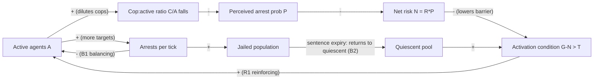
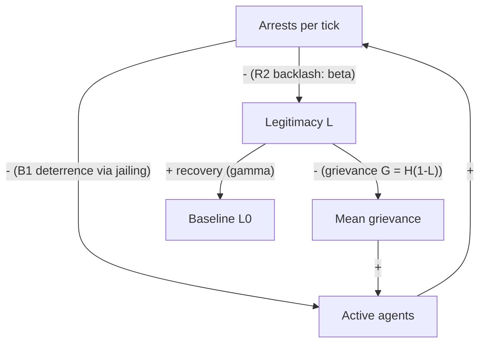

## Rebellion-Repression Parameter Dynamics in Agent-Based Simulations


### Scope and Framing

This item covers how the parameters of agent-based models (ABMs) of rebellion and repression govern the system's macro-level behavior: which parameters exist, what feedback loops they instantiate, how they produce phase transitions and punctuated dynamics, and how they are calibrated, swept, and validated. The reference model is Epstein's (2002) *Modeling civil violence: An agent-based computational approach* (PNAS 99, suppl. 3), the canonical "rebellion" model, together with its extensions (Epstein's Model II with communal violence, Kuran-style preference falsification variants, and the Mesa/NetLogo "Rebellion" family of implementations).

A note on the interpretive stance: the goal is diagnostic. The parameters are treated as levers in a dynamical system. The question is what feedback structure each lever activates and what failure mode a repression or legitimacy policy could open or close.

Recall two background terms used throughout:

- **Reinforcing feedback loop**: a causal cycle in which a change in a variable propagates around the loop and amplifies the original change (e.g., more rebels lower each rebel's arrest risk, which recruits more rebels).
- **Balancing feedback loop**: a causal cycle in which a change is counteracted (e.g., more rebels attract more cop attention, which raises arrest risk, which suppresses rebellion).

---

### 1. Model Architecture (Epstein 2002, Model I)

#### 1.1 Entities and Space

The world is a toroidal grid (typically $40 \times 40$) populated by two agent types:

- **Citizens (agents)**: each is in one of three states: *quiescent*, *active* (rebelling), or *jailed*.
- **Cops**: mobile agents that arrest active citizens within their vision radius.

Both types move randomly to unoccupied cells within their vision radius $v$ (Moore or von Neumann neighborhood, depending on implementation).

#### 1.2 Agent Heterogeneity (Fixed Per Agent)

| Variable | Symbol | Distribution | Meaning |
| --- | --- | --- | --- |
| Hardship | $H_i$ | $U(0,1)$ | Perceived material/economic deprivation |
| Risk aversion | $R_i$ | $U(0,1)$ | Individual aversion to bearing punishment risk |

#### 1.3 Global (System-Level) Parameters

| Parameter | Symbol | Typical value | Role |
| --- | --- | --- | --- |
| Government legitimacy | $L$ | $0.8$ | Reduces net grievance; a *macro* variable shared by all agents |
| Vision radius | $v$ | $7$ (Model I) | Local information horizon |
| Initial cop density | $\rho_c$ | $4\%$ | Coercive capacity (spatial) |
| Initial citizen density | $\rho_a$ | $70\%$ | Population density |
| Maximum jail term | $J_{max}$ | $30$ | Severity of repression |
| Regime-type threshold | $T$ | $0.1$ | Activation threshold on net risk-adjusted grievance |
| Arrest-probability constant | $k$ | $2.3$ | Calibrates the arrest-probability curve so that $P = 1 - e^{-2.3} \approx 0.9$ when the cop-to-active ratio is 1 |

---

### 2. Core Decision Equations

#### 2.1 Grievance

Grievance is hardship discounted by perceived legitimacy:

$$G_i = H_i \,(1 - L)$$

Grievance is high when hardship is high and the regime is seen as illegitimate. With $L = 0.8$, even maximum hardship yields $G = 0.2$, which is deliberately subcritical relative to any nontrivial net-risk term.

#### 2.2 Estimated Arrest Probability

Each agent estimates arrest probability from *local* observation. Let $C$ be the number of cops and $A$ the number of active agents (including itself) within its vision radius:

$$P_i = 1 - \exp\!\left[-k \left\lfloor \frac{C}{A} \right\rfloor \right]$$

The floor operation makes the estimate step-like (arrest probability jumps only when the cop-to-active ratio crosses integer thresholds). Many implementations, including the NetLogo library version, use the floored ratio. [Inference] Removing the floor smooths the response but changes the location of the critical thresholds discussed below.

#### 2.3 Net Risk

$$N_i = R_i \, P_i$$

#### 2.4 Activation Rule

An agent goes active iff its grievance exceeds its net risk by more than the threshold:

$$G_i - N_i > T$$

Equivalently: $H_i(1-L) - R_i P_i > T$.

#### 2.5 Cop and Jail Rules

Each tick, every cop selects a random active citizen within its vision and arrests it. An arrested citizen is jailed for a term drawn from $U(0, J_{max})$ and removed from the active pool. When the sentence expires, the agent returns to the quiescent state.

---

### 3. Feedback Structure

The model's dynamics come from two coupled loops, each operating through the *local* estimate $P_i$.

**Loop R1 (reinforcing, "safety in numbers"):**

$A \uparrow \Rightarrow C/A \downarrow \Rightarrow P_i \downarrow \Rightarrow N_i \downarrow \Rightarrow$ more agents satisfy $G_i - N_i > T \Rightarrow A \uparrow$

**Loop B1 (balancing, "coercive response"):**

$A \uparrow \Rightarrow$ cops encounter more active targets $\Rightarrow$ arrests $\uparrow \Rightarrow A \downarrow$ (jailing removes actives)

**Loop B2 (balancing, "jail exhaustion vs. replenishment"):**

Jailing depletes the active pool, but sentence expiry returns agents to quiescence, restoring the pool of candidates who can re-activate.

The tension between R1 (which has a positive-feedback threshold character) and B1 (which is capacity-limited by cop density and vision) is the source of the model's signature behavior: long quiescent periods punctuated by sudden outbursts.



<svg xmlns="http://www.w3.org/2000/svg" viewBox="0 0 640 300" width="640" height="300" font-family="sans-serif" font-size="12">
<text x="320" y="20" text-anchor="middle" font-weight="bold">Rebellion-Repression Agent State Machine (svg_diagram)</text>
<rect x="40" y="110" width="140" height="60" rx="8" fill="#e8f0fe" stroke="#333" />
<text x="110" y="145" text-anchor="middle">Quiescent</text>
<rect x="250" y="40" width="140" height="60" rx="8" fill="#fde8e8" stroke="#333" />
<text x="320" y="75" text-anchor="middle">Active (rebelling)</text>
<rect x="460" y="110" width="140" height="60" rx="8" fill="#eee" stroke="#333" />
<text x="530" y="145" text-anchor="middle">Jailed</text>
<line x1="180" y1="125" x2="250" y2="80" stroke="#333" marker-end="url(#arr)" />
<text x="170" y="95" text-anchor="middle">G - N &gt; T</text>
<line x1="390" y1="80" x2="460" y2="125" stroke="#333" marker-end="url(#arr)" />
<text x="450" y="90" text-anchor="middle">arrested by cop</text>
<line x1="460" y1="155" x2="180" y2="155" stroke="#333" marker-end="url(#arr)" />
<text x="320" y="180" text-anchor="middle">sentence expires (0 to J_max ticks)</text>
<line x1="250" y1="90" x2="180" y2="130" stroke="#333" stroke-dasharray="4" marker-end="url(#arr)" />
<text x="200" y="215" text-anchor="middle">G - N &lt;= T (reverts to quiescent)</text>
</svg>

---

### 4. Parameter-by-Parameter Dynamics

#### 4.1 Government Legitimacy ($L$)

Legitimacy acts as a *multiplicative attenuator* on hardship. Because $G_i = H_i(1-L)$, the effect is nonlinear in the sense that the population's grievance distribution is compressed toward zero as $L \to 1$:

- The mean grievance is $\bar{G} = \tfrac{1}{2}(1-L)$.
- The maximum grievance in the population is $(1-L)$.
- For an agent to activate even with $N_i = 0$ (no perceived arrest risk), it requires $H_i(1-L) > T$, i.e., $H_i > T/(1-L)$. When $T/(1-L) \ge 1$, i.e., $L \ge 1 - T$, **no agent can ever activate** regardless of cop absence. With $T = 0.1$, this critical legitimacy is $L^* = 0.9$.

**Design implication**: legitimacy has a hard ceiling effect, a *structural* rebellion-proof regime under the model's assumptions, while below it the sensitivity to legitimacy is steep near the boundary. This is the model's formal expression of the claim that legitimacy is a cheaper stabilizer than coercion in the region where it is attainable.

**Empirical caveat** [Inference]: real legitimacy is neither globally shared nor static; the ABM treats it as a global constant, which suppresses the group-level heterogeneity (e.g., ethnic-regional variation in perceived legitimacy) that real conflicts exhibit.

#### 4.2 Cop Density ($\rho_c$) and Vision ($v$)

Cop density and vision jointly determine the *local* $C/A$ ratio and thus the perceived arrest probability. Two distinct effects:

- **Density** raises the expected local $C$.
- **Vision radius** enlarges the sampling window for both $C$ and $A$. Larger vision reduces sampling variance of the ratio, which makes the ratio approach its global mean $\bar{C}/\bar{A}$ and reduces spatial pockets where $C/A$ is locally very low (safe havens for rebels).

The floored ratio $\lfloor C/A \rfloor$ introduces a discontinuity. If the global mean $\bar{C}/\bar{A} < 1$, most agents compute $\lfloor C/A \rfloor = 0$ and thus $P_i = 0$. The repression is then perceived as *absent* despite cops existing. Only pockets where cops locally outnumber actives yield nonzero $P_i$.

**Critical implication**: repression capacity is not perceived proportionally. There is a threshold cop-to-active ratio below which deterrence is nearly zero. A regime with enough cops to arrest many actives after an outbreak may still have zero *ex ante* deterrent effect if cops are outnumbered locally. This is a commitment-credibility issue: deterrence works through perceived, local enforcement capacity, not through aggregate capacity.

#### 4.3 Jail Term ($J_{max}$)

$J_{max}$ controls the *removal duration* of arrested agents, and hence the steady-state fraction of the population that is jailed. Let $\lambda$ be the arrest rate per tick and $\bar{J} = J_{max}/2$ the mean sentence; by Little's law, the steady-state expected jailed count is

$$\bar{J}_{pop} = \lambda \, \bar{J} = \lambda \, \frac{J_{max}}{2}$$

Three consequences:

1. **Severity is self-limiting**: because $\lambda$ is capped by the number of cops (each cop makes at most one arrest per tick), $\bar{J}_{pop}$ is bounded by $\rho_c \cdot N \cdot J_{max}/2$.
2. **Long sentences shift the timescale of outbreaks**: they extend the refractory period after a wave of arrests, delaying the next outburst.
3. **Severity does not enter the perceived-risk equation directly**. In Model I, agents do not condition $P_i$ or $N_i$ on $J_{max}$; they respond only to the *probability* of arrest, not its cost. This is a modeling simplification. [Inference] Adding sentence severity into $N_i$ (e.g., $N_i = R_i P_i \cdot f(J_{max})$) would create a severity-probability trade-off surface absent from the baseline.

#### 4.4 Threshold ($T$)

$T$ is the activation margin. It is the most abrupt control parameter because it appears as a hard inequality:

- Raising $T$ shifts the required $G_i - N_i$ margin upward, reducing the fraction of "activatable" agents.
- $T$ and $L$ are partially substitutable in effect: $H_i(1-L) - R_i P_i > T$ can be rearranged as $H_i(1-L) - T > R_i P_i$. In the region where $P_i \approx 0$, only $H_i > T/(1-L)$ matters, so the pair $(L, T)$ collapses onto the single ratio $T/(1-L)$.

#### 4.5 Arrest-Probability Constant ($k$)

$k$ sets how sharply perceived risk saturates with $\lfloor C/A \rfloor$. At $\lfloor C/A \rfloor = 1$, $P = 1 - e^{-k}$; with $k = 2.3$, $P \approx 0.90$. At $\lfloor C/A \rfloor = 2$, $P \approx 0.99$. Larger $k$ approximates a step function; smaller $k$ yields gradual risk perception. Because of the floor, $k$'s effect is confined to the integer breakpoints.

---

### 5. Emergent Regimes and Punctuated Dynamics

#### 5.1 Observed Time-Series Signature

Under baseline parameters ($L = 0.82$ in Epstein's principal runs, $\rho_c = 4\%$, $v = 7$, $J_{max} = 30$), the time series of active agents exhibits **punctuated equilibrium**: long stretches near zero activity interrupted by outbursts that peak and then collapse. This qualitative pattern is documented in Epstein (2002); exact peak heights, durations, and frequencies vary with random seed and implementation details.

The mechanism, in loop terms:

1. **Latent accumulation (quiescence)**: a subset of agents have $G_i$ near but below threshold. Their net risk is dominated by cop presence. Random movement occasionally produces a local region with few cops.
2. **Ignition**: a small number of agents in a cop-poor region satisfy $G_i - N_i > T$ and go active. This lowers local $C/A$.
3. **Cascade (R1 dominates)**: local $C/A$ falls, $P_i$ falls for neighbors, more neighbors activate. The cascade is spatially contagious.
4. **Saturation and suppression (B1 catches up)**: as active agents cluster, cops still arrest at most one per tick per cop. Once jail accumulation removes enough actives or cops arrive from elsewhere via random walk, $C/A$ recovers above the integer threshold, $P_i$ jumps, and neighbors revert.
5. **Refractory period**: the jailed population is temporarily out of the pool; sentence expiry gradually restores it, setting the timescale for the next cycle.

#### 5.2 Phase-Transition Character

Sweeping $L$ (or, equivalently, $\rho_c$) at fixed other parameters yields qualitatively distinct regimes:

| Regime | Condition (qualitative) | Behavior |
| --- | --- | --- |
| Structurally stable | $L \ge 1 - T$ | No activation possible; zero rebellion |
| Suppressed | High $\rho_c$, moderate $L$ | Occasional isolated actives, rapidly arrested; no cascades |
| Punctuated / critical | Intermediate $L$ and $\rho_c$ | Bursty outbreaks with heavy-tailed sizes |
| Sustained rebellion | Low $L$, low $\rho_c$ | Persistently high active fraction; jail cannot keep up |

[Inference] The transition between suppressed and punctuated regimes resembles a percolation or self-organized-criticality-like transition, and the heavy-tailed outbreak-size claim is commonly reported in the literature, but the precise universality class and the exponent depend on the implementation (floor operator, neighborhood, boundary conditions) and should be estimated per model rather than assumed.

#### 5.3 Path Dependence and Sensitivity

The model is stochastic and can exhibit sensitivity to initial conditions and RNG seed at the level of *timing* of outbreaks, while ensemble statistics (outbreak frequency, mean active fraction) are more stable. Behavior may vary by platform, library version, and update schedule.

---

### 6. The Repression-Backlash Extension

A structural limitation of Model I is that repression only *reduces* activity (through arrests). Empirically, there is a well-documented **backlash (or "repression-dissent") literature**: indiscriminate or brutal repression can *increase* dissent (Francisco 1995; Lichbach 1987 on the "consistency" of repression; Kalyvas 2006 on selective vs. indiscriminate violence). Extensions of Model I can encode this with a legitimacy-erosion feedback:

$$L(t+1) = L(t) - \beta \, \frac{\text{Arrests}(t)}{N} + \gamma\,(L_0 - L(t))$$

where:

- $\beta > 0$ is the **backlash coefficient** (legitimacy loss per arrest fraction),
- $\gamma \in [0,1]$ is the **legitimacy recovery rate** toward the baseline $L_0$.

This introduces a new reinforcing loop:

**Loop R2 (reinforcing, "repression backfire"):**

$\text{Arrests} \uparrow \Rightarrow L \downarrow \Rightarrow G_i \uparrow \Rightarrow$ more agents satisfy the activation condition $\Rightarrow A \uparrow \Rightarrow \text{Arrests} \uparrow$

The net effect of repression on rebellion is now the sum of a deterrence effect (B1, through $P_i$) and a backlash effect (R2, through $L$). The critical question becomes: **for which parameter combinations does backlash dominate deterrence?** A rough condition, derived by linearization, is that repression is counterproductive when the marginal legitimacy loss (weighted by the density of near-threshold agents) exceeds the marginal deterrent gain. [Speculation] In such models the relationship between repression intensity and rebellion is commonly non-monotonic (an inverted-U, consistent with Muller and Weede's 1990 "more murder in the middle" finding), but whether a given implementation reproduces it depends entirely on $\beta$, $\gamma$, and the distribution of $H_i$.



---

### 7. Implementation Reference

#### 7.1 Minimal Python (Mesa-Style) Implementation

The following is a compact, self-contained illustration of the core loop. It is written for clarity and is not a drop-in replacement for the Mesa `Rebellion`/`EpsteinCivilViolence` example; API details (Mesa 3.x scheduling, `AgentSet`, `Grid` classes) change across versions, so verify against the installed version's documentation.

```python
import math
import random
from dataclasses import dataclass, field

QUIESCENT, ACTIVE, JAILED = 0, 1, 2

@dataclass
class Citizen:
    pos: tuple
    hardship: float
    risk_aversion: float
    state: int = QUIESCENT
    jail_left: int = 0

@dataclass
class Cop:
    pos: tuple

@dataclass
class Model:
    width: int = 40
    height: int = 40
    citizen_density: float = 0.70
    cop_density: float = 0.04
    vision: int = 7
    legitimacy: float = 0.82
    max_jail_term: int = 30
    threshold: float = 0.1
    k: float = 2.3
    seed: int = 0
    citizens: list = field(default_factory=list)
    cops: list = field(default_factory=list)

    def __post_init__(self):
        self.rng = random.Random(self.seed)
        cells = [(x, y) for x in range(self.width) for y in range(self.height)]
        self.rng.shuffle(cells)
        n_c = int(self.citizen_density * len(cells))
        n_p = int(self.cop_density * len(cells))
        for pos in cells[:n_c]:
            self.citizens.append(Citizen(pos, self.rng.random(), self.rng.random()))
        for pos in cells[n_c:n_c + n_p]:
            self.cops.append(Cop(pos))
        self.occupied = {a.pos for a in self.citizens} | {a.pos for a in self.cops}

    def neighborhood(self, pos):
        x, y = pos
        v = self.vision
        return [((x + dx) % self.width, (y + dy) % self.height)
                for dx in range(-v, v + 1) for dy in range(-v, v + 1)
                if (dx, dy) != (0, 0) and dx * dx + dy * dy <= v * v]

    def move(self, agent):
        empty = [p for p in self.neighborhood(agent.pos) if p not in self.occupied]
        if empty:
            self.occupied.discard(agent.pos)
            agent.pos = self.rng.choice(empty)
            self.occupied.add(agent.pos)

    def step(self):
        order = self.citizens + self.cops
        self.rng.shuffle(order)
        cit_at = {c.pos: c for c in self.citizens}
        cop_at = {c.pos: c for c in self.cops}
        for a in order:
            if isinstance(a, Citizen):
                if a.state == JAILED:
                    a.jail_left -= 1
                    if a.jail_left <= 0:
                        a.state = QUIESCENT
                    continue
                self.move(a)
                cit_at = {c.pos: c for c in self.citizens}
                cop_at = {c.pos: c for c in self.cops}
                cops_n, actives_n = 0, 1  # count self as active (Epstein convention)
                for p in self.neighborhood(a.pos):
                    if p in cop_at:
                        cops_n += 1
                    c = cit_at.get(p)
                    if c is not None and c.state == ACTIVE:
                        actives_n += 1
                p_arrest = 1 - math.exp(-self.k * (cops_n // actives_n))
                grievance = a.hardship * (1 - self.legitimacy)
                net_risk = a.risk_aversion * p_arrest
                a.state = ACTIVE if (grievance - net_risk) > self.threshold else QUIESCENT
            else:
                self.move(a)
                cit_at = {c.pos: c for c in self.citizens}
                targets = [cit_at[p] for p in self.neighborhood(a.pos)
                           if p in cit_at and cit_at[p].state == ACTIVE]
                if targets:
                    t = self.rng.choice(targets)
                    t.state = JAILED
                    t.jail_left = self.rng.randint(1, self.max_jail_term)

    def counts(self):
        q = sum(c.state == QUIESCENT for c in self.citizens)
        a = sum(c.state == ACTIVE for c in self.citizens)
        j = sum(c.state == JAILED for c in self.citizens)
        return q, a, j
```

**Example usage:**

```python
m = Model(seed=42)
history = []
for t in range(500):
    m.step()
    history.append(m.counts())
```

**Output** (illustrative structure; actual values vary by seed and implementation): a list of `(quiescent, active, jailed)` tuples per tick. Under baseline parameters the `active` series typically stays near zero with intermittent spikes.

#### 7.2 Design Notes

- **Update order**: random activation order avoids artifacts from fixed scheduling. [Inference] Synchronous vs. asynchronous update can shift outbreak statistics.
- **Self-counting in $A$**: including the focal agent in the active count (so $A \ge 1$) avoids division by zero and follows Epstein's convention.
- **Boundary conditions**: toroidal wrapping removes edge effects but permits cross-boundary contagion.
- **Reproducibility**: seed the RNG and log the full parameter dictionary with each run.

---

### 8. Parameter Sweeps and Analysis Methodology

#### 8.1 Sweep Design

A sound analysis samples the parameter space systematically rather than manually tuning:

1. **One-at-a-time (OAT) sweeps** for exploratory intuition (e.g., vary $L$ from 0.5 to 0.95 in steps of 0.01).
2. **Global sensitivity analysis** (Latin hypercube sampling, Sobol indices) to capture interactions such as $L \times \rho_c$ and $T \times L$.
3. **Ensemble replication**: because outcomes are stochastic, run $M \ge 30$ to $100$ replicates per parameter point and report distributions, not single trajectories.

#### 8.2 Output Metrics

| Metric | Definition | What it diagnoses |
| --- | --- | --- |
| Mean active fraction | $\langle A(t)/N \rangle_t$ | Time-averaged rebellion level |
| Outbreak frequency | Count of events where $A/N$ crosses a threshold upward per $T_{run}$ | Ignition rate |
| Outbreak size distribution | Histogram of peak or integrated $A$ per outbreak | Heavy-tailed vs. thin-tailed dynamics |
| Time-to-first-outbreak | First tick with $A/N > \theta$ | Latency of instability |
| Jailed fraction | $\langle J(t)/N \rangle_t$ | Repression burden |
| Outbreak duration | Ticks between upward and downward crossing | Persistence of unrest |

#### 8.3 Detecting Critical Behavior

To test whether the punctuated regime reflects scale-free outbreak sizes, one can fit a power-law form $P(s) \propto s^{-\alpha}$ to the outbreak-size distribution using maximum-likelihood estimation with a goodness-of-fit test against alternatives (log-normal, exponential), as recommended by Clauset, Shalizi, and Newman (2009). [Unverified] Whether a given parameterization of the Epstein model passes such a test is an empirical question per implementation; heavy-tailed appearance on a log-log plot alone is not sufficient evidence.

#### 8.4 Two-Parameter Phase Diagrams

Plotting mean active fraction over a grid of $(L, \rho_c)$ produces a phase diagram. The boundary between the suppressed and punctuated regimes traces a curve along which legitimacy and coercion trade off. Reading this curve is the core design exercise: **it quantifies how much legitimacy is worth in cop-density units** under the model's assumptions.

---

### 9. Worked Example: Sensitivity to Cop Density Under the Floor Operator

**Setup**: fix $L = 0.82$, $T = 0.1$, $v = 7$, $J_{max} = 30$, and vary $\rho_c \in \{1\%, 2\%, 4\%, 8\%\}$.

**Reasoning before simulation** (predictions to test):

1. Within a radius-7 neighborhood there are roughly $\pi \cdot 7^2 \approx 154$ cells. With citizen density 0.70 and cop density $\rho_c$, expected local cops are $\approx 154\rho_c$: about 1.5 (at 1%), 3.1 (at 2%), 6.2 (at 4%), 12.3 (at 8%).
2. Expected local actives depend on the rebellion level itself (the feedback). During an outbreak with $A_{local} = 10$, the ratio at $\rho_c = 4\%$ is $6.2/10 = 0.62$, so $\lfloor C/A \rfloor = 0$ and $P_i = 0$: repression is *invisible* to agents inside the outbreak. At $\rho_c = 8\%$, $12.3/10 = 1.23$, so $\lfloor C/A \rfloor = 1$ and $P_i \approx 0.90$: repression becomes strongly deterrent.
3. Therefore the model predicts a **sharp threshold** in outbreak *suppression* between roughly 4% and 8% for outbreaks of local size ~10, and a lower threshold for smaller outbreaks.

**Expected qualitative finding** [Inference]: outbreak sizes should be truncated at approximately the local active count where $C/A$ crosses 1, giving an approximate scaling $A^*_{local} \approx 154\rho_c$. Verification requires running the simulation and measuring the maximum stable local active cluster size per $\rho_c$.

**Conclusion**: the floor operator converts a smooth resource variable (cop density) into a threshold-governed deterrent, so the effective repression policy space has *plateaus and cliffs* rather than a smooth gradient.

---

### 10. Calibration, Validation, and Limitations

#### 10.1 What the Model Is and Is Not

The Epstein model is a **generative, theory-exploring** model, not a predictive one. It demonstrates that a minimal set of micro-rules (grievance, risk, local information) is *sufficient* to generate punctuated rebellion dynamics. It does not establish that those rules are *necessary* or that they describe any actual conflict.

#### 10.2 Common Validation Approaches

- **Pattern-oriented modeling**: check that the model reproduces multiple stylized facts simultaneously (e.g., long quiescence with sudden onset, heavy-tailed event sizes, sensitivity to small triggers as in the 2011 Tunisian and Egyptian uprisings), rather than fitting one time series.
- **Empirical parameter mapping**: map $L$ to survey-based trust-in-government measures (e.g., Afrobarometer, World Values Survey), $H_i$ to household deprivation indices, and $\rho_c$ to police or security-force per-capita ratios. [Inference] These mappings are loose, and the model's units are dimensionless, so quantitative matching is generally unjustified without additional structural modeling.
- **Comparison to event data**: compare the simulated outbreak-size distribution to protest or riot counts (ACLED, GDELT, Mass Mobilization data). Differences in reporting and definition make this comparison qualitative at best.

#### 10.2b Known Structural Limitations

| Limitation | Consequence | Common extension |
| --- | --- | --- |
| Legitimacy is global and static | Suppresses group-level heterogeneity and backlash | Dynamic $L$; group-specific $L_g$ |
| No communication network | Agents observe only spatial neighbors | Social-network layer; preference falsification (Kuran 1991) |
| Cops do not adapt | No repression strategy or learning | Adaptive or learning cops; targeting rules |
| Repression severity absent from perceived risk | No severity-probability trade-off | Add $J_{max}$ or arrest cost into $N_i$ |
| No organizational structure | Rebellion is spontaneous, not organized | Leaders, cells, resource mobilization (McCarthy and Zald) |
| Agents are memoryless | No grievance accumulation or trauma | State-dependent $H_i(t)$; memory of past repression |
| Fixed hardship | Ignores economic shocks | Time-varying $H_i(t)$ tied to price shocks |

#### 10.3 Equifinality and Identifiability

Distinct parameter combinations can produce similar aggregate time series (e.g., high $L$ with low $\rho_c$ vs. low $L$ with high $\rho_c$). Aggregate outcome data alone is therefore insufficient to identify which lever is operating. **Design implication**: policy inference from such a model should be restricted to *comparative statics under the model's own assumptions*, not treated as forecasts.

---

### 11. Peace-Engineering Design Implications

Framed as diagnostic hypotheses that the model lets one explore, not as prescriptions:

1. **Legitimacy investments have a hard-stability region.** Where $L \ge 1 - T$, rebellion is structurally impossible in the model. The design question is what real-world institutions (fair adjudication, service delivery, inclusive representation) plausibly shift the population-level analog of $L$, and at what cost.
2. **Coercive capacity is perceived locally and thresholdedly.** Distributed, visible enforcement capacity matters more than aggregate totals. A failure mode to close: regions where local $C/A < 1$ during an incipient outbreak (safe havens).
3. **Repression severity cannot substitute for legitimacy when backlash is present.** With the $R2$ loop active, additional arrests may erode $L$ faster than they deter, so severity produces diminishing or negative returns beyond a threshold. This is the mechanism-level version of the "repression-backfire" argument.
4. **Timescale mismatch.** Legitimacy recovers slowly (small $\gamma$) but erodes quickly (large $\beta$), an asymmetry that makes early restraint valuable. [Speculation] Real-world asymmetries between trust erosion and trust rebuilding are plausible but the specific ratio is empirical.
5. **Monitoring design.** Since the system exhibits punctuated dynamics with low base rates, early-warning indicators (rising local variance in $C/A$, growth in the fraction of agents near threshold, i.e., $G_i - N_i \in (T - \epsilon, T]$) are more informative than mean activity levels. [Inference] Critical-slowing-down statistics (rising autocorrelation and variance in $A(t)$) are a candidate signal, though their reliability in ABMs of this form should be validated per model.

---

### 12. Quick Reference

**Activation condition**: $H_i(1-L) - R_i\,[\,1 - e^{-k\lfloor C/A \rfloor}\,] > T$

**Structural stability bound**: no activation is possible when $L \ge 1 - T$

**Expected local cops**: $\approx \pi v^2 \rho_c$ (before accounting for occupancy)

**Steady-state jailed count**: $\lambda \, J_{max}/2$ (Little's law, with $\lambda$ the arrest rate per tick)

**Backlash extension**: $L(t+1) = L(t) - \beta\,\text{Arrests}(t)/N + \gamma\,(L_0 - L(t))$

**Key Points**

- The model's macro-behavior is governed by a competition between a reinforcing "safety in numbers" loop and a capacity-limited balancing "arrest" loop.
- The floor operator makes perceived deterrence a step function of the local cop-to-active ratio, creating thresholds and cliffs in the effective policy space.
- Legitimacy enters multiplicatively and yields a hard structural stability bound.
- Adding a repression-backlash loop makes the repression-rebellion relationship potentially non-monotonic.
- Outputs should be analyzed as distributions over ensembles, not single runs, with attention to outbreak-size statistics and phase diagrams.

**Related Topics**

- Preference falsification and Kuran-style threshold cascades in ABMs
- Epstein's Model II: communal violence and peacekeeping forces
- Network-structured contagion in protest participation (Granovetter threshold models)
- Adaptive and learning repressive agents; strategic repression
- Sensitivity analysis and surrogate modeling for ABMs (Sobol indices, Gaussian-process emulators)
- Critical slowing down and early-warning signals for regime transitions
- Empirical calibration using ACLED and Mass Mobilization datasets
- Dynamic legitimacy and institutional trust modeling