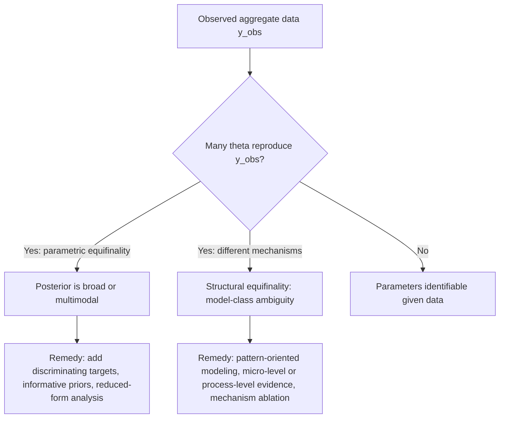
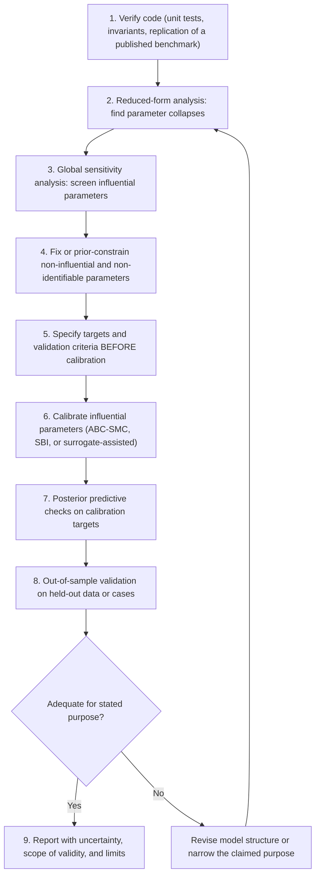

## Calibration and Validation Challenges in Conflict Agent-Based Models


### Scope and Framing

This item covers why calibrating and validating agent-based models (ABMs) of conflict is structurally harder than in most other simulation domains, the specific failure modes that result (equifinality, non-identifiability, overfitting to narratives, unfalsifiable "validation"), and the methodological toolkit available to mitigate them. The emphasis is diagnostic: what breaks, why it breaks in the conflict domain specifically, and what design choices close off each failure mode.

Two terms are used throughout and defined here precisely:

- **Calibration**: the process of choosing values for a model's free parameters $\theta$ so that model outputs match a chosen set of empirical targets. It is an inverse problem: given observed data $y^{obs}$, find $\theta$ such that $M(\theta)$ resembles $y^{obs}$.
- **Validation**: the process of assessing whether a model is an adequate representation of the target system *for a specified purpose*, using evidence that was not used to fit the parameters. Validation is purpose-relative: a model can be valid for exploring mechanisms and invalid for forecasting.

A companion distinction: **verification** asks whether the code correctly implements the intended conceptual model ("did we build the model right?"), while validation asks whether the conceptual model is adequate for its purpose ("did we build the right model?"). Verification is largely a software-engineering problem; the challenges below are mostly validation and calibration problems.

The running reference architecture is a rebellion-repression style ABM (grievance, legitimacy, local arrest-risk estimation, activation thresholds), but the challenges generalize to communal-violence, insurgency, and civil-war ABMs.

---

### 1. Why Conflict ABMs Are Hard to Calibrate: Structural Causes

#### 1.1 The Data Problem

| Challenge | Mechanism | Consequence for calibration |
| --- | --- | --- |
| Sparse, rare events | Conflict onsets are low-base-rate events; a country has few onsets per decade | Few independent observations relative to parameter count |
| Reporting bias | Event data (ACLED, UCDP-GED, GDELT) are derived from media, NGO, or government sources with selective coverage | Targets are noisy proxies; bias may correlate with the very variables modeled (e.g., repression suppresses reporting) |
| Aggregation mismatch | Data are recorded as events per district-day or country-year; ABM outputs are agent-level state trajectories | Requires an observation model mapping agent states to reported events |
| Unobservable micro-variables | Grievance, risk aversion, legitimacy perception, and preferences are latent; only crude survey proxies exist | Micro-parameters cannot be directly measured; must be inferred from macro outputs |
| Single realization | History occurred once | Cannot replicate the "experiment"; the observed trajectory is one draw from an unknown distribution |
| Non-stationarity | Institutions, technology, and actors change over time | Parameters calibrated on past data may not hold in the forecast window |

#### 1.2 The Model Problem

- **High-dimensional parameter spaces**: even the minimal Epstein model has at least seven global parameters, and realistic extensions add network structure, adaptive behavior, and organizational layers.
- **Nonlinear, threshold-driven dynamics**: small parameter changes can move the system across regime boundaries (suppressed, punctuated, sustained), so the output surface is discontinuous and standard smooth-optimization assumptions fail.
- **Stochasticity**: outputs are distributions, not points. Two runs with identical $\theta$ and different seeds can differ qualitatively in outbreak timing.
- **Path dependence and emergence**: aggregate patterns arise from interactions rather than from any single parameter, so no parameter maps cleanly onto a single output feature.

#### 1.3 The Epistemic Problem

Conflict is reflexive and strategic: actors respond to being modeled, forecasts, and interventions. [Inference] This means that a model calibrated to a historical regime may lose validity precisely when used to design an intervention, because the intervention changes the behavioral rules the model assumes fixed (a Lucas-critique analog for ABMs).

---

### 2. Equifinality and Non-Identifiability

#### 2.1 Definitions

- **Equifinality**: multiple distinct parameter vectors $\theta_1 \neq \theta_2$ produce statistically indistinguishable outputs, $M(\theta_1) \approx M(\theta_2)$.
- **Structural non-identifiability**: the model's mathematical structure makes two or more parameters appear only through a combination, so no amount of data can separate them.
- **Practical non-identifiability**: parameters are theoretically separable but the available data are too sparse or noisy to constrain them.

#### 2.2 A Concrete Structural Example

In the Epstein-style activation rule $H_i(1-L) - R_i P_i > T$, consider the region where perceived arrest probability is zero ($P_i = 0$, which occurs whenever the floored local cop-to-active ratio is 0). The rule reduces to

$$H_i > \frac{T}{1-L}$$

Here legitimacy $L$ and threshold $T$ enter only through the single ratio $T/(1-L)$. Any pair $(L, T)$ with the same ratio yields identical behavior in that region. Calibration data drawn from outbreak phases where deterrence is inactive **cannot** separate $L$ from $T$. This is structural non-identifiability, and it matters because $L$ is policy-relevant (institutions can raise it) while $T$ is not.

**Design implication**: before calibrating, derive reduced forms of the decision rules and identify parameter combinations that collapse. Calibrate the identifiable combination and treat the rest as prior-constrained.

#### 2.3 Mechanism-Level Equifinality

Different causal mechanisms can generate the same aggregate signature. For example, a heavy-tailed outbreak-size distribution can arise from (a) threshold cascades on a spatial grid, (b) preferential attachment in a social network, or (c) exogenous heavy-tailed shocks. Matching the distribution does not discriminate among them. This is **structural equifinality**: the ambiguity lies in the model class, not merely in parameter values.



---

### 3. Calibration Methods and Their Failure Modes

#### 3.1 Manual (Heuristic) Tuning

The modeler adjusts parameters until plots "look right." Common in early conflict ABMs.

- **Failure mode**: no quantified uncertainty, no reproducibility, and high risk of confirmation bias. The chosen fit is one of many possible fits and cannot be distinguished from overfitting.

#### 3.2 Point-Estimate Optimization

Minimize a discrepancy $d(M(\theta), y^{obs})$ using grid search, genetic algorithms, or Bayesian optimization.

$$\hat{\theta} = \arg\min_{\theta}\; \mathbb{E}_{\omega}\big[\, d\big(M(\theta,\omega),\, y^{obs}\big) \big]$$

where $\omega$ denotes the random seed. The expectation must be estimated by averaging over multiple replicates, which multiplies computational cost.

- **Failure modes**: (1) returns a single $\hat{\theta}$ and hides equifinality; (2) rugged, discontinuous objective surfaces trap gradient-free optimizers in local optima; (3) noisy objective evaluations mislead the optimizer unless replicated.

#### 3.3 Approximate Bayesian Computation (ABC)

ABC targets the posterior $p(\theta \mid y^{obs})$ when the likelihood is intractable, which is the usual situation for ABMs. Rejection ABC:

1. Draw $\theta^{(j)} \sim \pi(\theta)$ from the prior.
2. Simulate $y^{(j)} \sim M(\theta^{(j)})$.
3. Compute summary statistics $s(y^{(j)})$ and $s(y^{obs})$.
4. Accept $\theta^{(j)}$ if $\lVert s(y^{(j)}) - s(y^{obs}) \rVert < \varepsilon$.

The accepted set approximates $p(\theta \mid s(y^{obs}) \le \varepsilon)$.

- **Advantage**: returns a distribution over parameters, exposing equifinality directly (broad or multimodal posteriors signal non-identifiability).
- **Failure modes**: (1) *choice of summary statistics* dominates the result, and insufficient statistics discard information (the posterior conditions on $s$, not on $y$); (2) small $\varepsilon$ makes acceptance rates collapse in high dimensions (curse of dimensionality); (3) large $\varepsilon$ yields an over-dispersed posterior; (4) computational cost scales with the number of simulations required.

Sequential variants (ABC-SMC) and regression-adjusted ABC reduce cost. [Inference] For ABMs with expensive simulations, these are usually preferable to plain rejection ABC, but efficiency gains depend on the problem.

#### 3.4 Simulation-Based Inference with Neural Estimators

Neural posterior estimation (NPE) and related methods train a conditional density estimator $q_\phi(\theta \mid s)$ on simulated pairs $(\theta, s)$, amortizing inference across datasets.

- **Advantage**: after training, inference on new data is fast; can learn informative summary statistics automatically.
- **Failure modes**: (1) **model misspecification**, in which the neural posterior can be confidently wrong if the ABM does not contain the true data-generating process; (2) requires large simulation budgets; (3) posterior calibration should be checked (e.g., simulation-based calibration, coverage tests) rather than assumed.

#### 3.5 Surrogate Modeling (Emulators)

Train a fast statistical surrogate (Gaussian process, random forest, neural network) on a designed set of ABM runs to approximate the input-output map, then calibrate against the surrogate.

- **Failure modes**: surrogate error propagates into the calibrated posterior; discontinuities at regime boundaries are poorly approximated by smooth surrogates (Gaussian processes with stationary kernels struggle here); surrogates are typically fit to summary outputs and may miss structure in full trajectories.

#### 3.6 Method Comparison

| Method | Returns uncertainty? | Handles stochasticity? | Main weakness in conflict ABMs |
| --- | --- | --- | --- |
| Manual tuning | No | Poorly | Unreproducible, confirmation bias |
| Point optimization | No | Requires replication | Hides equifinality; rugged surface |
| Rejection ABC | Yes | Yes | Summary-statistic dependence; low acceptance |
| ABC-SMC | Yes | Yes | Tuning of tolerance schedule; still costly |
| Neural SBI | Yes | Yes | Misspecification; large simulation budget |
| Surrogate-assisted | Depends | Via emulator | Regime discontinuities; surrogate error |

---

### 4. Choosing Calibration Targets: Pattern-Oriented Modeling

**Pattern-oriented modeling (POM)** (Grimm et al. 2005) calibrates and evaluates a model against *multiple independent patterns observed at different scales or hierarchical levels*, rather than a single time series. The logic is that a wrong model may match one pattern by luck but is very unlikely to match several simultaneously, so multiple patterns act as a "filter" that shrinks the set of acceptable parameter sets and model structures.

#### 4.1 Candidate Patterns for Conflict ABMs

| Pattern | Scale | Data source (examples) |
| --- | --- | --- |
| Heavy-tailed event-size distribution | Aggregate | ACLED, UCDP-GED, Mass Mobilization data |
| Long quiescence punctuated by sudden onset | Temporal | Protest and riot event series |
| Spatial clustering and diffusion of events | Spatial | Georeferenced event data |
| Inter-event time distribution (burstiness) | Temporal | Event timestamps |
| Repression-dissent relationship shape (e.g., non-monotonic) | Cross-sectional | Cross-national panels |
| Correlation of onset with shocks (price spikes, elections) | Covariate | Economic and electoral data |
| Duration distribution of conflicts | Aggregate | UCDP conflict-level data |

#### 4.2 Pitfalls of Pattern Matching

1. **Stylized facts are contestable.** A widely repeated stylized fact (e.g., a specific power-law exponent for casualty counts) may not survive rigorous statistical testing. Heavy-tailed appearance on a log-log plot is not sufficient evidence of a power law; formal maximum-likelihood fitting with goodness-of-fit tests against alternatives (log-normal, stretched exponential) is required (Clauset, Shalizi, and Newman 2009). [Unverified] Reported exponents in the conflict literature vary across datasets and definitions and should not be treated as fixed targets.
2. **Patterns may be non-diagnostic.** If many model classes produce the pattern, matching it carries little evidential weight. A pattern is informative only to the extent that it is *hard* for competing mechanisms to produce (a high "severity" test in Mayo's sense).
3. **Target inflation.** Selecting patterns after seeing which ones the model reproduces is post hoc selection and inflates apparent validity. Patterns should be specified *before* calibration when possible.

---

### 5. Validation: Types and Their Limits

#### 5.1 Taxonomy

| Validation type | Question | Typical evidence | Main limitation |
| --- | --- | --- | --- |
| Face validity | Do experts find the rules and behavior plausible? | Expert review, participatory checks | Subjective; vulnerable to shared misconceptions |
| Internal (structural) validity | Are assumptions consistent with theory and micro-evidence? | Behavioral experiments, ethnography, surveys | Micro-evidence often unavailable or unrepresentative |
| Empirical output validation | Do outputs match observed macro data? | Statistical comparison to event data | Equifinality; data quality; single realization |
| Predictive (out-of-sample) validation | Does the calibrated model predict held-out data? | Forecast error on future or withheld periods | Rare events, non-stationarity, few test cases |
| Cross-validation across cases | Does one parameterization generalize across contexts? | Leave-one-country-out tests | Contexts differ structurally; hidden heterogeneity |
| Counterfactual/intervention validation | Does the model predict the effect of an intervention? | Natural experiments, quasi-experimental studies | Almost never available; the most decision-relevant and least testable |

#### 5.2 The Central Asymmetry

For peace engineering, the decision-relevant question is usually counterfactual ("what would happen if we change $X$?"), which is the hardest to validate because the counterfactual is unobserved. Output validation on the factual trajectory, however good, does not establish that the model gets *interventions* right. Two models with identical factual fit can imply opposite intervention effects. This is the **causal underdetermination problem**: matching observational data constrains associations but not necessarily the causal structure.

#### 5.3 Validation Statistics for Stochastic Outputs

Because outputs are distributions, comparison should be distributional rather than pointwise:

- **Two-sample tests**: Kolmogorov-Smirnov or Anderson-Darling on outbreak-size or inter-event-time distributions.
- **Distributional distances**: Wasserstein distance or energy distance between simulated and observed empirical distributions.
- **Posterior predictive checks**: simulate from the calibrated posterior and test whether observed summary statistics fall within the predictive distribution. Formally, for a discrepancy $T(\cdot)$, compute a posterior predictive $p$-value

$$p_{ppc} = \Pr\big[\, T(y^{rep}) \ge T(y^{obs}) \mid y^{obs} \,\big]$$

Values near 0 or 1 indicate model misfit on that statistic.

- **Proper scoring rules** (e.g., continuous ranked probability score, log score) for probabilistic forecasts of event counts.

**Caution**: statistical tests on simulated data are sensitive to the number of replicates. With enough runs, a tiny and practically irrelevant difference becomes "statistically significant" (White et al. 2014 on the misuse of significance tests with simulation output). Report effect sizes and use practical-equivalence thresholds rather than relying on $p$-values alone.

---

### 6. Overfitting, Data Leakage, and Researcher Degrees of Freedom

#### 6.1 Overfitting

With many free parameters and few independent observations, a model can be tuned to reproduce noise. Signs include: excellent in-sample fit combined with poor out-of-sample behavior; parameter values that are implausible in isolation but jointly compensate; and posteriors pinned against prior boundaries.

**Mitigation**: hold out data (temporal or spatial), penalize complexity or use regularizing priors, prefer parsimonious models, and report the ratio of free parameters to independent calibration targets.

#### 6.2 Leakage in Time-Structured Data

Random train-test splits on autocorrelated event series leak information across the split. Temporal validation must use *blocked* or *forward-chaining* splits (train on periods $1..t$, test on $t+1..t+h$) and, for spatial data, spatially blocked splits.

#### 6.3 Researcher Degrees of Freedom

Analytic choices made after observing results (which summary statistics, which time window, which country, which discrepancy metric, which runs to discard) inflate the apparent success of a model. Mitigations include pre-registering calibration targets and validation criteria, documenting all model variants tried, and reporting negative results (failed calibrations) alongside successes.

---

### 7. Sensitivity and Uncertainty Analysis as Diagnostics

Sensitivity analysis is a validation-adjacent tool: it reveals which parameters actually matter, which shapes both calibration strategy and interpretation.

#### 7.1 Global Sensitivity: Variance-Based Indices

For scalar output $Y = f(\theta)$ with independent inputs, the first-order Sobol index and total-effect index are

$$S_i = \frac{\mathrm{Var}_{\theta_i}\big[\,\mathbb{E}_{\theta_{\sim i}}[Y \mid \theta_i]\,\big]}{\mathrm{Var}(Y)}, \qquad S_{T_i} = 1 - \frac{\mathrm{Var}_{\theta_{\sim i}}\big[\,\mathbb{E}_{\theta_i}[Y \mid \theta_{\sim i}]\,\big]}{\mathrm{Var}(Y)}$$

where $\theta_{\sim i}$ denotes all parameters except $\theta_i$. A large gap $S_{T_i} - S_i$ signals interaction effects, which are typical in threshold-driven conflict models.

**Caveat**: variance-based indices assume the output variance is a meaningful summary. For outputs with heavy tails or regime-switching (bimodal) behavior, variance can be dominated by rare extreme runs, and moment-independent or distribution-based sensitivity measures may be more appropriate. [Inference] Regime boundaries also violate the smoothness assumptions behind some cheaper screening methods (e.g., Morris elementary effects may misattribute effects near discontinuities).

#### 7.2 Practical Workflow



---

### 8. Worked Example: Calibrating a Rebellion-Repression ABM with ABC

**Setup.** Suppose the goal is to calibrate legitimacy $L$ and cop density $\rho_c$ of an Epstein-style model to a district-level protest event series, with other parameters fixed. Data: weekly counts of protest events for one district over 10 years (520 weeks).

**Step 1: Observation model.** The ABM outputs the active-agent count $A(t)$ per tick. Map to reported events with an explicit observation model, e.g.

$$E(t) \sim \mathrm{Poisson}\big(\, r \cdot \max(A(t) - A_0,\, 0) \big)$$

with reporting rate $r$ and background threshold $A_0$. Note that this *adds* nuisance parameters $(r, A_0)$ that are themselves non-identifiable from $E(t)$ alone (only their product with the amplitude of $A(t)$ is constrained), which is a second, easily overlooked source of equifinality.

**Step 2: Summary statistics.** Choose statistics that capture distinct patterns:

1. Mean weekly event count.
2. Fraction of weeks with zero events (quiescence).
3. Log of the 95th percentile of outbreak sizes (tail behavior).
4. Lag-1 autocorrelation of weekly counts (temporal clustering).
5. Coefficient of variation of inter-outbreak intervals (burstiness).

**Step 3: Priors.** $L \sim U(0.5, 0.95)$, $\rho_c \sim U(0.5\%, 10\%)$. The upper bound on $L$ is set below the structural-stability bound $1 - T$ for the fixed $T$, since any $L$ above it yields identically zero activity and would be an uninformative region of the prior.

**Step 4: ABC-SMC.** Run sequential ABC with a decreasing tolerance schedule $\varepsilon_1 > \varepsilon_2 > \dots$, with 50 replicates per candidate $\theta$ to average over the stochastic seed.

**Step 5: Inspect the posterior.**

```python
import numpy as np

def summary_stats(events):
    events = np.asarray(events)
    mean_count = events.mean()
    zero_frac = (events == 0).mean()
    p95 = np.percentile(events[events > 0], 95) if (events > 0).any() else 0.0
    ac1 = np.corrcoef(events[:-1], events[1:])[0, 1] if events.std() > 0 else 0.0
    return np.array([mean_count, zero_frac, np.log1p(p95), ac1])

def abc_rejection(observed_stats, simulate, prior_sample,
                  n_draws=20000, eps=0.5, scale=None):
    scale = np.ones_like(observed_stats) if scale is None else scale
    accepted = []
    for _ in range(n_draws):
        theta = prior_sample()
        stats = summary_stats(simulate(theta))
        dist = np.linalg.norm((stats - observed_stats) / scale)
        if dist < eps:
            accepted.append(theta)
    return np.array(accepted)
```

The `scale` argument normalizes each statistic (commonly by its median absolute deviation across prior-predictive simulations) so that no single statistic dominates the distance. This is a standard, necessary step: unscaled distances implicitly weight statistics by their units.

**Step 6: Diagnose identifiability.** Compute the posterior correlation between $L$ and $\rho_c$. A strong ridge (e.g., high $L$ paired with low $\rho_c$ and vice versa) indicates a **trade-off manifold**: data constrain a combination such as "effective deterrence-adjusted grievance" but not the components individually. Report the ridge rather than marginal point estimates.

**Output** (illustrative structure, not real results): a set of accepted $(L, \rho_c)$ pairs forming an elongated cloud along a diagonal, with marginal posteriors that are broad relative to the prior. The correct interpretation is that the data support a *family* of parameterizations, and that policy claims ("raise $L$ by 0.05") are supportable only where all parameterizations in the family agree on the sign and rough magnitude of the effect.

**Step 7: Robustness of policy conclusions.** Propagate the full posterior through a counterfactual simulation (e.g., raise $L$ by 0.05) and report the distribution of the change in mean active fraction. If the distribution straddles zero, the model does not support a directional claim; if it is concentrated on one side across the posterior, the conclusion is **robust to the equifinality** even though the parameters are not identified. This is the appropriate standard for decision-relevant use.

**Conclusion of the example**: calibration in this setting yields a constraint set rather than a point estimate; the value of the exercise lies in identifying which conclusions survive across the constraint set.

---

### 9. Structural Validity: Testing the Mechanism, Not Only the Output

Because output matching underdetermines mechanisms, additional tests target the model's internal causal structure.

1. **Mechanism ablation**: remove or randomize one mechanism (e.g., disable local risk estimation, replace with global average) and check whether the target patterns disappear. If a pattern persists without the mechanism, the mechanism is not what produces it.
2. **Alternative-model comparison**: implement competing mechanisms (e.g., a network-contagion model versus a spatial-threshold model) and compare them on held-out data using information criteria or posterior predictive performance, rather than validating a single model in isolation.
3. **Micro-validation**: test agent-level rules against behavioral evidence (lab or field experiments on collective action thresholds, surveys on perceived arrest risk, ethnographic accounts of protest participation decisions). This is the only route to constraining the *rules* independently of the aggregate data.
4. **Robustness to structural assumptions**: vary update schedules (synchronous vs. asynchronous), neighborhood definitions, boundary conditions, and operator choices (e.g., the floor in the arrest-probability estimate). If conclusions flip under arbitrary implementation choices, they are artifacts rather than findings. Behavior may vary by platform, library version, and update scheme.
5. **Docking (model-to-model replication)**: independently reimplement a published model from its specification alone and compare outputs (Axtell et al. 1996). Discrepancies expose underspecified assumptions and implementation bugs that a single implementation would hide.

---

### 10. Reporting Standards and Reproducibility

| Practice | Purpose |
| --- | --- |
| ODD protocol (Overview, Design concepts, Details; Grimm et al. 2006, updated 2010 and 2020) | Standardized model description enabling replication |
| ODD+D extension | Documents human decision-making rules explicitly |
| TRACE documentation (Grimm et al. 2014) | Records the evidence for model evaluation ("TRAnsparent and Comprehensive model Evaludation") |
| Fixed and logged seeds, versioned code, containerized environments | Computational reproducibility |
| Publish prior, posterior, tolerance schedule, summary statistics, and scaling | Allows others to reproduce or challenge the calibration |
| State the model's purpose and the scope of claimed validity | Prevents validation for one purpose being read as validation for another |
| Report failed calibrations and rejected model variants | Counters selective reporting |

---

### 11. Peace-Engineering Design Implications

Framed as design guidance for using conflict ABMs in decision support:

1. **Match the claim to the validation.** A model validated for mechanism exploration should be used to generate hypotheses and stress-test intuitions, not to issue quantitative forecasts or optimize interventions. State the purpose explicitly and tie every claim to the validation evidence that supports it.
2. **Prefer robust conclusions over optimal ones.** Because parameters are usually non-identified, use *robust decision-making* logic: seek interventions whose sign and rough magnitude of effect are consistent across the entire calibrated posterior and across structurally distinct model variants, rather than optimizing against a single best-fit parameterization.
3. **Use ensembles of models, not a single model.** Structural equifinality means the model class itself is uncertain. Ensembles of competing mechanistic models, with disagreement reported as a measure of structural uncertainty, are more honest than a single tuned model.
4. **Invest in data that discriminates.** The highest-value data are those that separate mechanisms that produce identical aggregates: micro-level participation data, network data, sequential event timing, and natural-experiment outcomes.
5. **Guard against reflexivity.** If a model informs actors' strategies (or actors learn of the model's predictions), its calibration may degrade. Monitor for regime shifts and treat calibrations as time-limited.
6. **Ethical caution in high-stakes use.** [Inference] Overconfident quantitative outputs from poorly validated conflict models can be misread as authoritative and misdirect scarce resources or coercive capacity. Communicating uncertainty (posterior ranges, scope limits, negative results) is part of the design of a responsible model, not an optional appendix.

---

### 12. Quick Reference

**Calibration**: inverse problem, choose $\theta$ so $M(\theta) \approx y^{obs}$; should return a posterior or constraint set, not only a point estimate.

**Equifinality test**: if $\exists\, \theta_1 \neq \theta_2$ with indistinguishable outputs, the parameters are not identified by those outputs.

**Structural non-identifiability example**: when $P_i = 0$, activation depends only on $T/(1-L)$, so $L$ and $T$ cannot be separated.

**ABC acceptance rule**: accept $\theta$ if $\lVert s(y^{sim}) - s(y^{obs}) \rVert < \varepsilon$.

**Posterior predictive check**: $p_{ppc} = \Pr[\,T(y^{rep}) \ge T(y^{obs}) \mid y^{obs}\,]$.

**Sobol indices**: $S_i$ (first-order) and $S_{T_i}$ (total effect); a large gap indicates interactions.

**Key Points**

- Conflict ABMs face sparse, biased, aggregated data, high-dimensional threshold-driven stochastic models, and a single historical realization, which together make calibration an ill-posed inverse problem.
- Equifinality (parametric and structural) is the dominant failure mode; calibration should expose it through posteriors and reduced-form analysis rather than hide it behind a point estimate.
- Pattern-oriented modeling, with multiple pre-specified and genuinely discriminating patterns, is the main defense against fitting a single series by luck.
- Validation is purpose-relative, and counterfactual validity, the most decision-relevant kind, is the hardest to establish; robust conclusions across the calibrated posterior and across model variants are the appropriate standard.
- Reproducibility infrastructure (ODD, TRACE, seeds, logged priors and tolerances, reported failures) is a validation component, not administrative overhead.

**Related Topics**

- Approximate Bayesian Computation and simulation-based inference in depth
- Global sensitivity analysis for stochastic agent-based models (Sobol, Morris, moment-independent measures)
- Surrogate modeling and emulation of regime-switching ABMs
- Pattern-oriented modeling and the TRACE documentation framework
- Docking and model-to-model replication protocols
- Robust decision-making and deep uncertainty under ensemble modeling
- Conflict event datasets (ACLED, UCDP-GED, GDELT, Mass Mobilization) and their measurement biases
- Early-warning validation: proper scoring rules and forecast evaluation for rare events