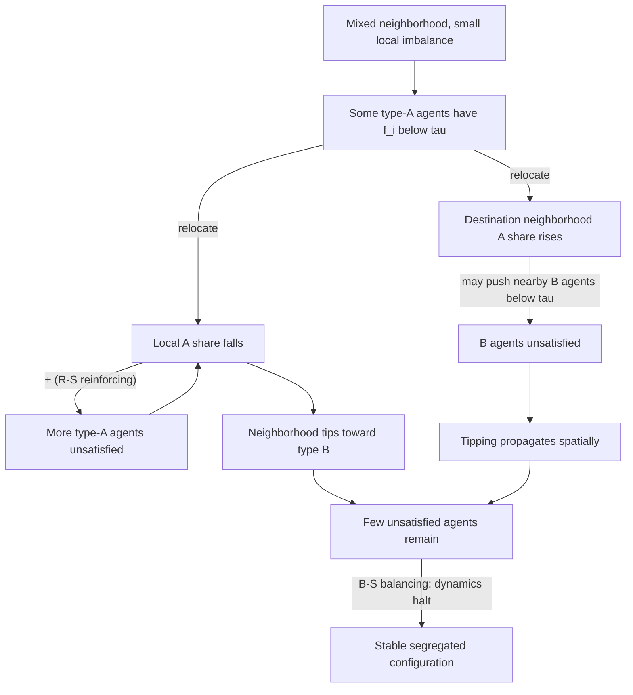
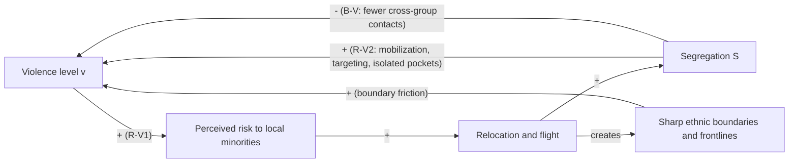

## Schelling's Threshold Model Applied to Ethnic Sorting and Violence


### Scope and Framing

This item covers Thomas Schelling's segregation model (1969, 1971, 1978) and its extensions to ethnic sorting under conditions of insecurity, with particular attention to how mild individual preferences aggregate into extreme spatial segregation, how the same mechanism becomes a *security-driven* dynamic when violence or its threat enters the utility calculus, and how sorting can feed back into conflict risk. The analytical stance is diagnostic: what feedback structure does the model instantiate, which of its assumptions carry the results, and what does it imply about the design of interventions that close off self-reinforcing separation.

Three terms are defined on first use and used throughout:

- **Threshold model**: a model in which an agent switches behavior (here, relocating) when the observed fraction of some population category in its reference group crosses an agent-specific threshold. Granovetter (1978) generalized this form to collective behavior broadly.
- **Emergent segregation**: aggregate spatial separation of groups that exceeds, and is not implied by, the preferences of any individual agent (in the classic result, agents tolerate integration yet the aggregate outcome is near-total separation).
- **Security dilemma (ethnic variant)**: a situation in which each group's defensive move (clustering, arming, or relocating for safety) is perceived by other groups as threatening, so that actions taken for security reduce the security of all (Posen 1993; Kaufmann 1996).

Two boundaries of scope. First, this item concerns the sorting mechanism and its coupling to violence; the broader rebellion-repression dynamics of civil-violence ABMs are outside scope. Second, the item treats Schelling-type models as *mechanism-exploration* devices, not empirically calibrated predictors; where empirical claims are made, they are flagged.

---

### 1. The Baseline Schelling Model

#### 1.1 Entities and Space

- A finite grid (commonly $N \times N$, often a torus to remove boundary effects) with each cell either empty or occupied by one agent.
- Two agent types (say, type $A$ and type $B$), interpretable as ethnic, religious, or racial groups, in proportions $\pi_A$ and $\pi_B$, with a fraction $\nu$ of cells left vacant (the vacancy rate).
- Each agent observes a local **neighborhood** (Moore neighborhood of 8 cells in the original; von Neumann or larger radii in variants).

#### 1.2 Decision Rule

Let $f_i$ denote the fraction of agent $i$'s occupied neighboring cells that contain agents of its own type:

$$f_i = \frac{\text{number of same-type neighbors of } i}{\text{number of occupied neighbors of } i}$$

Each agent has a **tolerance threshold** $\tau$ (a minimum acceptable same-type fraction). Agent $i$ is *satisfied* if $f_i \ge \tau$ and *unsatisfied* otherwise. In each update, an unsatisfied agent relocates to a vacant cell (chosen randomly, or the nearest cell, or a cell where it would be satisfied, depending on the variant). Agents with no occupied neighbors are conventionally treated as satisfied.

Note the direction of the preference: $\tau$ is a *lower bound on own-group share*, not an upper bound on out-group share. A threshold of $\tau = 1/3$ means "I want at least one third of my neighbors to be like me," which is compatible with living in a majority-other neighborhood.

#### 1.3 The Signature Result

With $\tau \approx 1/3$ (a mild preference) and a random initial distribution, the dynamics typically converge to strongly segregated configurations in which typical agents live in neighborhoods where $f_i$ is far above $\tau$ (often above 0.7 to 0.9). The individual preference does not require segregation; the aggregate outcome overshoots it.

**Mechanism (feedback loop form):**

**Loop R-S (reinforcing, "sorting spiral"):**

Unsatisfied agents of type $A$ leave a mixed neighborhood $\Rightarrow$ the local $A$ share falls $\Rightarrow$ remaining $A$ agents' $f_i$ falls (more become unsatisfied) while type $B$ agents' $f_i$ rises $\Rightarrow$ more $A$ agents leave $\Rightarrow$ the neighborhood tips toward $B$.

Simultaneously, the destination neighborhood of the relocating agent has its $A$ share raised, which can push *its* neighboring $B$ agents below their threshold, triggering the same spiral in reverse. The mechanism is a **tipping** dynamic: a local majority is self-reinforcing once a small imbalance appears.

**Loop B-S (balancing, "vacancy limitation"):**

Relocation requires vacancies. As the system approaches full sorting, few agents remain unsatisfied, so few moves occur and the dynamics halt at a stable (absorbing) configuration.



---

### 2. Formal Structure and Analytical Results

#### 2.1 One-Dimensional Analytical Results

In one-dimensional variants (agents on a line or ring with a symmetric neighborhood of radius $w$), the dynamics are analytically tractable. Results by Brandt, Immorlica, Kamath, and Kleinberg (2012), Barmpalias, Elwes, and Lewis-Pye (2014), and Immorlica et al. (2017), among others, characterize the expected size of segregated runs as a function of $\tau$ and the neighborhood size. A frequently cited finding is that for tolerance parameters in a specific range the expected segregated-region length scales *polynomially* in $w$, and for $\tau$ near $1/2$ it can scale *exponentially* in $w$. [Unverified] The exact exponents and the parameter ranges at which each regime holds depend on the update rule and the specific model variant; consult the source papers before quoting them.

#### 2.2 Two-Dimensional Behavior: Phase Behavior in $\tau$

Simulation studies show a threshold-like dependence of segregation on $\tau$:

| Tolerance $\tau$ (own-type minimum) | Typical qualitative outcome (equal groups, moderate vacancy) |
| --- | --- |
| Very low (below about $0.25$) | Little relocation; near-random mixing persists |
| Intermediate ($\approx 0.3$ to $0.5$) | Rapid coarsening into large single-type domains; segregation strongly exceeds preference |
| High (above about $0.5$) | Mixed states are unstable for one or both groups; can fail to converge (perpetual relocation) if the requirement exceeds what a two-group system can supply |

[Inference] The transition between weakly and strongly segregated outcomes resembles a phase transition, and physicists have mapped the model onto spin systems (Blume-Emery-Griffiths-type and Potts-like models) and analyzed it with domain-coarsening and interfacial-tension concepts (Vinković and Kirman 2006; Dall'Asta, Castellano, and Marsili 2008; Gauvin, Vannimenus, and Nadal 2009). The specific critical values are model-dependent and should be estimated per implementation.

#### 2.3 Segregation Measures

To quantify outcomes, use established indices rather than visual impression:

- **Dissimilarity index**:

$$D = \frac{1}{2} \sum_{k} \left| \frac{a_k}{A} - \frac{b_k}{B} \right|$$

where $a_k, b_k$ are the counts of types $A$ and $B$ in spatial unit $k$, and $A, B$ are the citywide totals. $D \in [0,1]$; $D = 0$ means proportional mixing in every unit, $D = 1$ means complete separation. Interpreted as the fraction of one group that would have to move to achieve even distribution.

- **Isolation index** (exposure of a group to itself):

$$I_A = \sum_k \frac{a_k}{A} \cdot \frac{a_k}{a_k + b_k}$$

- **Mean same-type neighbor fraction** $\langle f \rangle$, the model-native measure and the direct analog of the agent decision variable.
- **Moran's $I$ or local indicators of spatial association (LISA)** for spatial autocorrelation of type labels.

**Caveat**: the dissimilarity and isolation indices depend on the spatial unit definition (the modifiable areal unit problem), so comparisons across different grid resolutions or administrative boundaries are not valid without correction.

---

### 3. Reference Implementation

The following is a compact, self-contained implementation intended for clarity. It uses the standard "relocate to a random vacancy" rule. Behavior varies with update order and relocation rule; verify against the specific variant under study.

```python
import numpy as np

EMPTY, A, B = 0, 1, 2

def init_grid(n=50, vacancy=0.10, frac_a=0.5, seed=0):
    rng = np.random.default_rng(seed)
    n_cells = n * n
    n_empty = int(vacancy * n_cells)
    n_agents = n_cells - n_empty
    n_a = int(frac_a * n_agents)
    flat = np.array([A] * n_a + [B] * (n_agents - n_a) + [EMPTY] * n_empty)
    rng.shuffle(flat)
    return flat.reshape(n, n), rng

def same_fraction(grid, i, j):
    n = grid.shape[0]
    me = grid[i, j]
    same = other = 0
    for di in (-1, 0, 1):
        for dj in (-1, 0, 1):
            if di == 0 and dj == 0:
                continue
            v = grid[(i + di) % n, (j + dj) % n]  # torus
            if v == EMPTY:
                continue
            if v == me:
                same += 1
            else:
                other += 1
    total = same + other
    return None if total == 0 else same / total

def step(grid, rng, tau=0.375):
    n = grid.shape[0]
    unsatisfied = []
    for i in range(n):
        for j in range(n):
            if grid[i, j] == EMPTY:
                continue
            f = same_fraction(grid, i, j)
            if f is not None and f < tau:
                unsatisfied.append((i, j))
    rng.shuffle(unsatisfied)
    for (i, j) in unsatisfied:
        empties = np.argwhere(grid == EMPTY)
        if len(empties) == 0:
            break
        ti, tj = empties[rng.integers(len(empties))]
        grid[ti, tj], grid[i, j] = grid[i, j], EMPTY
    return len(unsatisfied)

def mean_same_fraction(grid):
    n = grid.shape[0]
    vals = []
    for i in range(n):
        for j in range(n):
            if grid[i, j] != EMPTY:
                f = same_fraction(grid, i, j)
                if f is not None:
                    vals.append(f)
    return float(np.mean(vals))

grid, rng = init_grid(n=50, vacancy=0.10, seed=1)
history = [mean_same_fraction(grid)]
for t in range(100):
    moved = step(grid, rng, tau=0.375)
    history.append(mean_same_fraction(grid))
    if moved == 0:
        break
```

**Output** (illustrative structure; exact values vary by seed and variant): `history` is a monotonically-increasing-in-trend series of mean same-type neighbor fraction. Starting near the random-mixing baseline (about $0.5$ for equal groups), it typically climbs toward $0.8$ to $0.95$ well above the individual threshold $\tau = 0.375$, and `moved` reaches zero when a stable configuration is found.

**Design notes**:

- A random-vacancy relocation rule can leave agents in cells where they remain unsatisfied; the "move only to satisfying cells" variant converges faster and tends to produce different domain morphology.
- Synchronous versus sequential updating affects convergence and the presence of oscillations. [Inference] Fully synchronous updates can produce limit cycles that sequential updates avoid.
- The Python double loop above is $O(N^2)$ per sweep with a high constant; for large grids, vectorize the neighbor count with a 2D convolution (e.g., `scipy.signal.convolve2d` with wrap boundary) and compute type masks once per sweep.

---

### 4. From Preference to Security: Coupling Sorting to Violence

The baseline model's motive for moving is a *taste* for same-type neighbors. In ethnic-conflict settings, the more relevant driver is often **security**: agents relocate because being a local minority is physically dangerous. This changes both the decision rule and the aggregate consequences.

#### 4.1 Security-Driven Decision Rule

Replace the taste threshold with a threat-sensitive threshold. Let $V_i(t)$ denote the perceived violence risk to agent $i$ at time $t$. A simple reduced form:

$$V_i = \phi\big(1 - f_i\big) \cdot \big(1 + \kappa\, v_{local}(t)\big)$$

where:

- $1 - f_i$ is the out-group neighbor share (local minority exposure),
- $\phi(\cdot)$ is an increasing function mapping out-group exposure to baseline threat (for instance, convex, so that being a small minority is disproportionately dangerous),
- $v_{local}(t)$ is the recent local violence level (incidents within some radius and time window),
- $\kappa \ge 0$ scales sensitivity to observed violence.

Agent $i$ relocates when $V_i > \bar{V}_i$, where $\bar{V}_i$ is an agent-specific tolerance for risk. With $\kappa > 0$ the threshold is not fixed: it moves with the violence history, which creates a second reinforcing loop.

#### 4.2 The Coupled System

Let $S(t)$ denote a measure of segregation (e.g., dissimilarity index) and $v(t)$ an aggregate violence level. The model couples them:

**Loop R-V1 (reinforcing, "violence induces sorting"):**

$v \uparrow \Rightarrow$ perceived risk $V_i \uparrow$ for local minorities $\Rightarrow$ relocation $\uparrow \Rightarrow S \uparrow$

**Loop R-V2 (reinforcing, "sorting enables violence"):**

$S \uparrow \Rightarrow$ homogeneous enclaves form $\Rightarrow$ (a) group-level mobilization and identity salience become cheaper, (b) armed actors can more easily identify and target the out-group at boundaries and in mixed pockets, (c) minority pockets become isolated and indefensible $\Rightarrow$ $v \uparrow$

**Loop B-V (balancing, "sorting reduces exposure"):**

$S \uparrow \Rightarrow$ fewer cross-group contacts $\Rightarrow$ lower *interpersonal* violence opportunity within enclaves $\Rightarrow$ $v_{local} \downarrow$

The net effect of sorting on violence is therefore the sum of a contact-reducing effect (B-V) and a mobilization/targeting effect (R-V2). Which dominates is an empirical and model-structural question; the model itself does not settle it. This is the formal core of the debate about ethnic partition.



#### 4.3 The Security Dilemma as a Sorting Trap

Recall that the ethnic security dilemma arises when defensive actions by one group read as threats to another. In the sorting model this appears as follows. If each group's agents relocate toward co-ethnic areas for defense, each relocation *reduces the out-group's local presence in the destination area and raises its perceived exposure elsewhere*, prompting reciprocal relocation. The equilibrium is high segregation even if no agent prefers segregation intrinsically. Sorting under insecurity is a **self-fulfilling prophecy**: fear of violence produces the segregation that makes group-level violence more feasible and more organized.

**Historical illustrations** (cited as evidence for the mechanism, not as the organizing structure of the analysis):

- **Partition of India (1947)**: large-scale relocation across new borders coincided with mass violence; Kaufmann (1996, 1998) uses this and the Bosnian war to argue that once violence reaches a threshold, separation is the only stable outcome.
- **Bosnia and Herzegovina (1992 to 1995)**: forced displacement and "ethnic cleansing" produced sharply more homogeneous municipalities; Bulutgil (2016) and others analyze how violence and displacement interact.
- **Northern Ireland (Belfast)**: residential segregation intensified during the Troubles, with "peace walls" constructed at interfaces; [Inference] this is often cited as a case where sorting and violence reinforced each other, and where physical barriers institutionalized the separation. Detailed causal attribution varies across studies.

These cases are consistent with the coupled-loop structure but do not by themselves prove it; alternative explanations (state-directed expulsion, wartime military strategy) also account for much of the displacement, a point that the Schelling mechanism, with its purely decentralized dynamics, tends to understate.

---

### 5. Extensions Relevant to Conflict Settings

#### 5.1 Heterogeneous and Endogenous Thresholds

Agent thresholds $\tau_i$ drawn from a distribution (rather than a common $\tau$) change aggregate behavior substantially. With a distribution of thresholds, the **cumulative distribution of thresholds** determines the cascade, exactly as in Granovetter's (1978) model: the proportion of the population that has moved at equilibrium is the fixed point of the CDF map $r^* = F(r^*)$, where $F$ is the threshold CDF evaluated at the current move-rate $r$. Small changes in the distribution's shape near the fixed point can flip the outcome from negligible sorting to near-total sorting. [Inference] This makes aggregate segregation highly sensitive to the *left tail* of the threshold distribution (the most sensitive agents), a point with direct design implications for interventions (Section 8).

Endogenous thresholds, in which $\tau_i$ increases after exposure to violence (a "hardening" of preferences), convert the model from a threshold model with fixed parameters into one with **state-dependent parameters** and can produce hysteresis: reducing violence after a wave of sorting does not restore integration.

#### 5.2 Multiple Groups and Asymmetric Thresholds

With three or more groups and group-specific thresholds (a majority that is tolerant and a minority that is highly security-sensitive, for instance), the outcomes depend on the ordering of thresholds and group sizes. Asymmetric thresholds produce **asymmetric flight**: the more security-sensitive group empties mixed neighborhoods first, which may leave the more tolerant group in a de facto majority without any preference for segregation on its part.

#### 5.3 Network Structure and Non-Spatial Neighborhoods

Replacing the lattice with a social network (agents observe network neighbors, not spatial neighbors) changes the geometry of tipping. On networks with high clustering, tipping propagates within communities; on networks with bridging ties or hubs, a small number of high-degree agents can trigger large cascades. Segregation in the network sense (homophily) can occur without spatial segregation.

#### 5.4 Economic Constraints

The baseline model ignores housing costs and mobility barriers. Extensions with price dynamics (Zhang 2004; Pancs and Vriend 2007) and with income heterogeneity show that economic constraints can either amplify sorting (if a group is priced out of areas) or freeze it (if agents cannot afford to move). In violent settings, mobility constraints are often *asymmetric* (checkpoints, curfews, abandoned property), which is not captured by a uniform vacancy pool.

#### 5.5 Agent-Based Violence Layers

Coupling the sorting layer to an explicit violence layer can use the civil-violence mechanics of rebellion-repression models: active agents, arrest or attack events, and legitimacy. A minimal coupling routes local violence events into $v_{local}$ in the decision rule of Section 4.1, and routes sorting outcomes back into the violence layer by conditioning attack opportunity on the presence of adjacent out-group agents (violence requires contact or proximity). Epstein's communal-violence extension takes a related approach with two ethnic groups and central peacekeeping agents.

---

### 6. Worked Example: Tipping Analysis for a Single Neighborhood

**Setup.** A Moore neighborhood has 8 cells, all occupied (vacancy ignored for clarity). A type-$A$ agent has $k$ type-$A$ neighbors out of 8. Take $\tau = 0.375$ (equivalent to $3/8$).

**Satisfaction condition**: $f_i = k/8 \ge 0.375 \Rightarrow k \ge 3$. Thus an $A$ agent is satisfied with at least 3 same-type neighbors and unsatisfied with 2 or fewer.

**Tipping step.** Consider an $A$ agent with exactly $k = 3$ same-type neighbors (satisfied, but barely). One of its $A$ neighbors, itself unsatisfied because of *its* own neighborhood, relocates. The focal agent's $k$ drops to 2, so $f_i = 0.25 < 0.375$ and it becomes unsatisfied. The focal agent now relocates as well, reducing the $A$ count for *its* remaining $A$ neighbors, and so on.

**Chain condition.** A cascade propagates when each departure pushes at least one satisfied neighbor from exactly the threshold count to below it. Neighborhoods whose $A$ agents sit at $k = \lceil \tau \cdot 8 \rceil$ exactly are "critical." The larger the fraction of agents at or just above threshold, the more likely a departure triggers further departures. This is a discrete analog of the branching-process criticality condition: the expected number of newly unsatisfied agents per departure exceeds 1 when the density of near-threshold agents is high enough.

**Conclusion of the example**: aggregate segregation is governed less by the *mean* tolerance than by the *density of marginally satisfied agents* in the initial configuration and threshold distribution. Interventions that change how many agents sit near threshold have disproportionate leverage.

---

### 7. Empirical Evidence and Its Limits

#### 7.1 What the Model Explains Well

- **Emergence**: that modest individual preferences can produce extreme aggregate segregation, a robust qualitative result across many variants.
- **Persistence and hysteresis**: once sorted, configurations are stable and difficult to reverse without large coordinated intervention.
- **Sensitivity to composition**: the stability of integration depends on group proportions and vacancy rates, not just on preferences.

#### 7.2 What the Model Does Not Establish

- **Attribution of real segregation to preferences**: [Inference] Real-world residential segregation is heavily shaped by discrimination in housing markets, policy (redlining, zoning, state-directed expulsions), and economic sorting. Schelling-type dynamics show that decentralized preferences are *sufficient* to generate segregation, not that they are the *cause* of any observed case. Studies attempting to estimate individual thresholds from real data (e.g., Bruch and Mare 2006) report that the aggregate outcome is sensitive to the *shape* of the preference function: smooth, continuous preferences can fail to produce the sharp tipping and extreme segregation that step-function thresholds do. This is a substantive robustness challenge to the classic result.
- **The violence-sorting causal direction**: observational data show that violence and sorting co-occur, but separating "violence causes flight" from "pre-existing sorting enables violence" from "a third factor (state strategy, elite mobilization) causes both" requires identification strategies the ABM itself does not supply.
- **Partition as a remedy**: the model's coupled-loop structure allows either sign for the net effect of sorting on violence. The empirical literature on partition (Kaufmann 1998 versus Sambanis 2000 and Sambanis and Schulhofer-Wohl 2009) is contested; the model is best read as clarifying which mechanisms are in play rather than resolving the debate.

#### 7.3 Calibration Cautions

Recall that calibration of conflict ABMs is hampered by equifinality: distinct parameterizations can yield similar aggregate outcomes. Here, a high observed segregation index can be produced by low-tolerance preference dynamics, by security-driven flight with $\kappa > 0$, or by state-directed expulsion. Matching a segregation index alone does not discriminate among them; process-level data (timing of moves relative to violent events, reasons given by displaced persons, property-transfer records) are needed.

---

### 8. Peace-Engineering Design Implications

Framed as hypotheses the model lets one explore under its own assumptions:

1. **Target the tipping mechanism, not the mean preference.** Because aggregate outcomes depend on the density of near-threshold agents and the left tail of the threshold distribution, interventions that reduce the *fraction of agents who feel unsafe as local minorities* (rather than changing average attitudes) can prevent cascades. Design levers: credible local security provision in mixed areas, rapid-response mechanisms for minority residents, and mixed policing.
2. **Break the security-dilemma loop at the perception link.** Loop R-V1 runs through *perceived* risk. Reducing the sensitivity $\kappa$ to observed violence (via transparent incident reporting, verification, and rumor control) narrows the pathway from isolated incidents to mass flight. This is a design target: information institutions that dampen the mapping from incident to expectation of escalation.
3. **Exploit vacancy and property rules.** The model requires vacancies for relocation. Policies governing abandoned property, occupancy, and return rights alter the effective vacancy pool. Protecting property rights and preventing seizure of vacated homes reduces the payoff to flight and preserves the option to return. Conversely, unregulated vacancy transfer can lock in sorting.
4. **Design for reversibility.** Hysteresis (Section 5.1) implies that prevention is far cheaper than reversal. Once enclaves form, reintegration requires overcoming both the tipping structure and state-dependent hardening of thresholds. Early-warning indicators for the design of preventive action include rising minority-exit rates from mixed areas and rising local segregation indices (rising $D$ or $I_A$) before violence peaks. [Inference] Rising local variance in same-type fractions and a growing share of agents near threshold may serve as leading indicators, but their reliability should be validated for each setting.
5. **Recognize the institutional lock-in of separation.** Physical and administrative barriers (walls, separate services, ethnically defined administrative units) convert a dynamic sorting process into a fixed feature and can lower the short-run violence rate (loop B-V) while raising long-run mobilization potential (loop R-V2). Any such measure should be evaluated against both effects and against the cost of eventual removal.
6. **Beware over-reading the model in either direction.** The model can be used to argue that mixing is fragile (supporting separation) or that separation is self-reinforcing (supporting integration measures). Neither conclusion follows from the mechanism alone; the sign of the net effect depends on parameters that are empirically contested. Use the model to map mechanisms and their interactions, and state the parameter regime under which each design conclusion holds.

---

### 9. Quick Reference

**Satisfaction rule**: agent $i$ stays iff $f_i = \dfrac{\text{same-type neighbors}}{\text{occupied neighbors}} \ge \tau$

**Segregation outcome**: for $\tau \approx 1/3$ and equal groups with moderate vacancy, mean same-type fraction typically ends far above $\tau$ (emergent segregation)

**Dissimilarity index**: $D = \tfrac{1}{2}\sum_k \left|\dfrac{a_k}{A} - \dfrac{b_k}{B}\right|$

**Security-coupled risk**: $V_i = \phi(1 - f_i)\,(1 + \kappa\, v_{local})$; relocate when $V_i > \bar{V}_i$

**Granovetter fixed point**: equilibrium move-rate $r^*$ solves $r^* = F(r^*)$ with $F$ the threshold CDF

**Key Points**

- Schelling-type dynamics generate segregation that overshoots individual preferences through a reinforcing tipping loop, halted only by vacancy exhaustion.
- Replacing taste-based thresholds with security-driven thresholds couples sorting to violence through two reinforcing loops and one balancing loop; the net effect on violence is not determined by the mechanism alone.
- Aggregate outcomes are governed by the density of marginally satisfied agents and the left tail of the threshold distribution, not by mean tolerance.
- The classic result is sensitive to the functional form of preferences; smooth preference functions can weaken or remove sharp tipping, so empirical claims require care.
- Sorting can be a self-fulfilling security dilemma, and once sorted, configurations are hysteretic, favoring prevention over reversal in design.

**Related Topics**

- Granovetter threshold models of collective behavior and riot cascades
- Ethnic security dilemma and commitment problems in partition debates
- Epstein's communal-violence model with peacekeeping agents
- Network-based homophily and threshold contagion models
- Spatial segregation indices and the modifiable areal unit problem
- Displacement dynamics, property restitution, and return policy design
- Hysteresis and early-warning indicators in social tipping
- Empirical estimation of preference functions from residential choice data