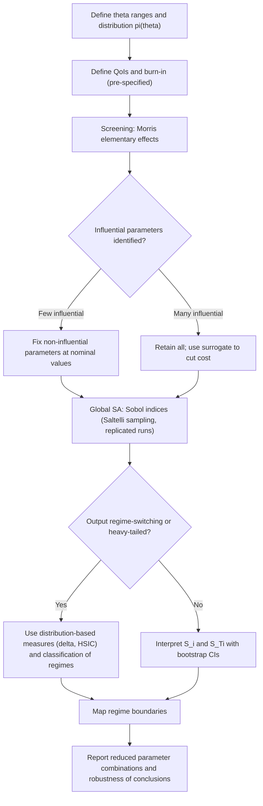

## Sensitivity Analysis and Parameter-Space Exploration in Conflict Simulations


### Scope and Framing

This item covers how to systematically map the relationship between the inputs (parameters, initial conditions, structural choices) of a conflict simulation and its outputs: which inputs matter, how strongly, through what interactions, and where in parameter space the system changes qualitative regime. It treats sensitivity analysis (SA) and parameter-space exploration as *diagnostic instruments* for stochastic, threshold-driven, agent-based conflict models, with emphasis on the specific ways conflict models violate the assumptions of standard SA techniques.

The reference architecture is a rebellion-repression or communal-violence style agent-based model (ABM) with parameters such as legitimacy $L$, cop density $\rho_c$, vision radius $v$, activation threshold $T$, and maximum jail term $J_{max}$, but the methods generalize to any conflict simulation.

Terms used throughout, defined on first use:

- **Sensitivity analysis**: the study of how variation in a model's output can be apportioned to variation in its inputs.
- **Local sensitivity**: the response of the output to infinitesimal perturbation of one input around a fixed nominal point, characterized by a partial derivative $\partial Y / \partial \theta_i$.
- **Global sensitivity**: the apportionment of output variability over the *entire* plausible input space, including interactions among inputs.
- **Parameter-space exploration**: the systematic sampling and mapping of the input space to characterize output behavior, including regime boundaries, without necessarily quantifying variance shares.
- **Regime boundary (bifurcation-like surface)**: a locus in parameter space across which the qualitative behavior of the system changes (e.g., from suppressed to punctuated to sustained rebellion).

Scope discipline: calibration against empirical data is a distinct activity; here the concern is the forward map from inputs to outputs and the structure of that map.

---

### 1. Why Conflict Models Stress Standard SA Methods

Standard SA techniques were developed largely for smooth, deterministic, approximately monotone models. Conflict ABMs violate these assumptions in specific ways, and each violation dictates a methodological adjustment.

| Property of conflict ABMs | Consequence for SA | Required adjustment |
| --- | --- | --- |
| Stochastic outputs (random seeds) | The output at fixed $\theta$ is a distribution, so $Y = f(\theta, \omega)$ with seed $\omega$ | Replicate; separate parametric from aleatory variance |
| Threshold and floor operators | The response surface is discontinuous or step-like | Avoid derivative-based methods; use sampling-based global methods |
| Regime switching | Output distributions are bimodal or heavy-tailed; variance is an unreliable summary | Use distribution-based or classification-based sensitivity measures |
| Strong parameter interactions | One-at-a-time (OAT) analysis misses interaction effects | Use variance-based total-effect indices or interaction screening |
| Structural non-identifiability | Parameters enter only through combinations (e.g., $T/(1-L)$) | Reparameterize; analyze the reduced combination |
| Non-stationary or transient dynamics | Output depends on the observation window and burn-in | Pre-specify the output metric, burn-in, and run length |
| High computational cost per run | Sampling budgets are limited | Use efficient designs and surrogate models |
| Heavy-tailed outbreak sizes | Sample means and variances converge slowly or may not exist in the usual sense | Use quantiles, medians, or rank-based statistics |

Recall that **equifinality** is the situation in which distinct parameter vectors produce indistinguishable outputs. SA is the forward-direction complement: it reveals which parameters *can* be distinguished by any given output, and therefore which can be constrained by data at all.

---

### 2. Problem Formulation

#### 2.1 Input Space

Define the input vector $\theta = (\theta_1, \dots, \theta_p)$ with plausible ranges $\Theta = \prod_i [\theta_i^{lo}, \theta_i^{hi}]$ and a probability distribution $\pi(\theta)$ over $\Theta$ (uniform if no better information exists). The choice of ranges and distribution is a modeling decision, not a neutral default: sensitivity indices are *conditional on the specified input distribution*. Widening the range of a parameter mechanically increases its apparent importance.

Inputs are of three kinds, and each requires different handling:

1. **Continuous parameters** (legitimacy $L$, threshold $T$): sampled from intervals.
2. **Discrete or integer parameters** (vision radius $v$, jail term $J_{max}$, grid size): sampled from finite sets.
3. **Structural (categorical) choices** (update schedule, neighborhood type, presence of a backlash loop): treated as factors, not as continuous variables; SA over structure is *model uncertainty analysis* and requires separate design.

#### 2.2 Output Space and Metric Selection

Because output is a time series of state counts, SA requires reducing it to scalar or low-dimensional **quantities of interest (QoI)**. QoI choice determines the conclusions, so it must be specified in advance and justified.

| QoI | Definition | What it captures |
| --- | --- | --- |
| Mean active fraction | $\langle A(t)/N \rangle_t$ after burn-in | Sustained unrest level |
| Outbreak frequency | Upward crossings of threshold $\theta_A$ per unit time | Ignition rate |
| Peak outbreak size | $\max_t A(t)/N$ | Severity of worst event |
| Time to first outbreak | $\min\{t : A(t)/N > \theta_A\}$ (with right-censoring) | Latency |
| Regime indicator | Categorical label (suppressed / punctuated / sustained) | Qualitative behavior |
| Segregation index | Dissimilarity $D$ at end of run | Spatial sorting outcome |

**Caution on censoring**: time-to-first-outbreak is right-censored when no outbreak occurs within the run. Treating censored values as the run length biases sensitivity estimates; use survival-analysis treatment or a separate binary QoI ("outbreak occurred").

#### 2.3 Separating Parametric from Stochastic Variance

For a stochastic model $Y = f(\theta, \omega)$, the total output variance decomposes by the law of total variance:

$$\mathrm{Var}(Y) = \underbrace{\mathrm{Var}_{\theta}\big[\,\mathbb{E}_{\omega}[Y \mid \theta]\,\big]}_{\text{parametric (explainable by inputs)}} + \underbrace{\mathbb{E}_{\theta}\big[\,\mathrm{Var}_{\omega}(Y \mid \theta)\,\big]}_{\text{stochastic (irreducible given }\theta)}$$

The ratio of the second term to the total is the **stochastic variance fraction**. If it is large, then even perfect knowledge of $\theta$ leaves most output variability unexplained, which bounds how much any sensitivity index can capture and signals that single-run analyses are dominated by noise. Estimating it requires multiple replicates per parameter point.

---

### 3. Local and One-at-a-Time Methods

#### 3.1 OAT Sweeps

Vary one parameter across its range while holding others at nominal values. The output is a **response curve** $\bar{Y}(\theta_i)$ with confidence bands from replicates.

- **Use**: exploratory intuition, detecting monotonicity, and locating sharp transitions along one axis (e.g., $L$ from 0.5 to 0.95).
- **Failure mode**: OAT explores only axes through the nominal point, a vanishing fraction of the space (in $p$ dimensions the OAT design samples a set of measure zero). It cannot detect interactions. In a threshold model this is severe: the effect of $L$ can be null at low $\rho_c$ and dominant at high $\rho_c$, and an OAT sweep at one nominal $\rho_c$ reports only one of these.

#### 3.2 Derivative-Based Local Sensitivity

The local sensitivity coefficient $S_i^{loc} = \partial \bar{Y} / \partial \theta_i$ (often normalized as an elasticity $\frac{\theta_i}{\bar{Y}}\frac{\partial \bar{Y}}{\partial \theta_i}$) is inappropriate for discontinuous models. Finite-difference estimates around a regime boundary are dominated by whichever side of the boundary the perturbation lands on and are effectively random. [Inference] Derivative-based methods should be reserved for smooth sub-regions confirmed by prior exploration.

---

### 4. Screening Methods

When $p$ is large and runs are expensive, screening identifies a small set of influential parameters before more costly analysis.

#### 4.1 Morris Elementary Effects

The Morris method (1991) computes, for each parameter, the **elementary effect** of a discrete step $\Delta$ from randomly chosen base points $\theta^{(j)}$:

$$EE_i^{(j)} = \frac{f\big(\theta^{(j)} + \Delta\, e_i\big) - f\big(\theta^{(j)}\big)}{\Delta}$$

where $e_i$ is the unit vector along axis $i$. Over $r$ trajectories, compute:

- $\mu_i = \frac{1}{r}\sum_j EE_i^{(j)}$ (mean effect; can cancel for non-monotone responses),
- $\mu_i^* = \frac{1}{r}\sum_j |EE_i^{(j)}|$ (mean absolute effect; the recommended importance measure, Campolongo et al. 2007),
- $\sigma_i$ = standard deviation of $EE_i^{(j)}$ (large values indicate nonlinearity or interaction).

**Cost**: approximately $r(p+1)$ model evaluations (each times the number of replicates), far cheaper than variance-based methods.

**Caveats for conflict models**: [Inference] Morris steps that straddle a regime boundary produce enormous elementary effects driven by the discontinuity, inflating both $\mu_i^*$ and $\sigma_i$ for whichever parameter defines that boundary. This is informative (it flags the parameter as boundary-defining) but it should not be read as a smooth-gradient effect. Averaging over replicates at each point before differencing is necessary to avoid attributing seed noise to the parameter.

#### 4.2 Fractional Factorial and Other Designs

Two-level fractional factorial designs estimate main effects and low-order interactions with few runs, but assume approximate linearity within the two-level range; for threshold models, two levels straddling a boundary yield misleading main effects. [Inference] Use them only after confirming the range does not cross a regime boundary, or treat crossing as the object of study.

---

### 5. Variance-Based Global Sensitivity Analysis

#### 5.1 Sobol Indices

For a scalar QoI $Y = f(\theta)$ (after averaging over seeds, or treating $\omega$ as an additional input) with independent inputs, the **first-order index** and **total-effect index** are

$$S_i = \frac{\mathrm{Var}_{\theta_i}\big[\,\mathbb{E}_{\theta_{\sim i}}[Y \mid \theta_i]\,\big]}{\mathrm{Var}(Y)}, \qquad S_{T_i} = 1 - \frac{\mathrm{Var}_{\theta_{\sim i}}\big[\,\mathbb{E}_{\theta_i}[Y \mid \theta_{\sim i}]\,\big]}{\mathrm{Var}(Y)}$$

where $\theta_{\sim i}$ denotes all inputs except $\theta_i$.

- $S_i$: the share of output variance explained by $\theta_i$ *alone*.
- $S_{T_i}$: the share attributable to $\theta_i$ *including all its interactions*.
- $S_{T_i} - S_i$: the interaction contribution of $\theta_i$.
- $\sum_i S_i \le 1$ with equality iff the model is purely additive; a sum well below 1 signals strong interactions, typical for threshold-driven conflict models.

**Estimation**: the Saltelli (2010) scheme uses two independent sample matrices $A$ and $B$ of size $n \times p$ and $p$ hybrid matrices $AB_i$ (column $i$ of $A$ replaced by column $i$ of $B$), requiring $n(p+2)$ evaluations for first-order and total indices. Quasi-random (Sobol' sequence) sampling improves convergence over pseudo-random sampling.

#### 5.2 Assumptions and Where They Fail

1. **Independent inputs**: if inputs are correlated (e.g., legitimacy and hardship are jointly determined in reality), the classical decomposition is not uniquely defined; use Shapley-effect or correlated-input extensions. [Inference] Shapley effects allocate interaction and correlation contributions fairly across inputs, at additional computational cost.
2. **Variance as an adequate summary**: variance-based indices are meaningful when the output distribution is roughly unimodal and light-tailed. In regime-switching models, variance is dominated by the between-regime contrast, so indices largely report "which parameters determine the regime" rather than sensitivity within a regime. That is useful but should be stated as such. For heavy-tailed outputs, sample variance may be unstable; use transformed outputs (log, rank) or quantile-based measures.
3. **Stochastic noise inflates apparent interactions**: if seed variance is not averaged out, residual noise appears as unexplained variance and depresses all indices. Either average over replicates per sample point or include the seed as an explicit input and interpret its index as the stochastic fraction.
4. **Confidence intervals**: report bootstrap confidence intervals on $S_i$ and $S_{T_i}$; indices with intervals spanning zero, or with $n$ too small, should not be ranked.



---

### 6. Distribution-Based and Moment-Independent Measures

When variance is a poor summary, use measures that compare full output distributions.

#### 6.1 Borgonovo's Delta

The moment-independent importance measure $\delta_i$ is

$$\delta_i = \frac{1}{2}\, \mathbb{E}_{\theta_i}\!\left[\int \big|\, p_Y(y) - p_{Y \mid \theta_i}(y) \,\big| \, dy \right]$$

the expected total-variation distance between the unconditional output density and the output density conditional on fixing $\theta_i$. It ranges from 0 (independence) to 1, is invariant to monotone output transformations, and does not depend on moments, making it robust to heavy tails and multimodality.

#### 6.2 Dependence Measures (HSIC)

The **Hilbert-Schmidt Independence Criterion** measures statistical dependence between $\theta_i$ and $Y$ using kernel embeddings; it detects nonlinear and non-monotone dependence and admits a permutation test for significance. It is cheaper than variance-based indices (it can use a single sample set rather than Saltelli's structured design), at the cost of less direct interpretation as a variance share. [Inference] HSIC-based screening followed by targeted variance-based or delta-based analysis is a pragmatic pipeline for expensive stochastic ABMs.

#### 6.3 Classification-Based Sensitivity for Regimes

When the QoI is categorical (suppressed / punctuated / sustained), treat SA as a classification problem:

1. Sample $\theta$ and label each run's regime (with a documented, replicated labeling rule).
2. Fit a tree-based classifier (random forest or gradient boosting) predicting regime from $\theta$.
3. Compute permutation importance or SHAP-style attribution.

This directly answers "which parameters determine the regime," and the fitted decision-tree structure exposes the interaction rules (e.g., "$L < 0.85$ and $\rho_c < 0.03$ implies sustained"). Cross-validated accuracy indicates how well the regime is determined by $\theta$ versus stochastic seed.

---

### 7. Parameter-Space Exploration and Regime Mapping

#### 7.1 Space-Filling Designs

| Design | Property | Note |
| --- | --- | --- |
| Full factorial grid | Exhaustive; cost $\propto k^p$ | Feasible only for $p \le 3$ or 4 |
| Latin hypercube sampling (LHS) | Each marginal is evenly stratified | Good default; poor projection properties can be improved by maximin or orthogonal variants |
| Sobol' / Halton sequences | Low-discrepancy; extendable | Convergence advantage; scrambling reduces correlation artifacts in higher dimensions |
| Adaptive sampling near boundaries | Concentrates runs where the response changes fastest | Efficient for regime-boundary location |

#### 7.2 Locating Regime Boundaries

Regime boundaries carry the most scientific and policy-relevant information in conflict models. Approaches:

1. **Two-parameter phase diagrams**: a grid over two parameters (e.g., $L \times \rho_c$) with replicated runs per cell; color by mean QoI or by modal regime. The boundary is the curve where regime probabilities cross.
2. **Boundary probability**: for each $\theta$, estimate $P(\text{regime} = r \mid \theta)$ from replicates. The boundary is the level set $P = 0.5$; the width of the transition zone (where probabilities are intermediate) measures how *sharp* the transition is and how much stochasticity blurs it.
3. **Active learning**: fit a probabilistic classifier or Gaussian-process classifier to regime labels and iteratively sample where predictive uncertainty is highest, concentrating runs near the boundary.
4. **Susceptibility peaks**: analogous to statistical physics, the variance of the QoI across replicates tends to peak near a transition. [Inference] Plotting replicate variance (or the coefficient of variation) versus a control parameter offers a cheap indicator of proximity to a critical region, but peak location and height are finite-size dependent and should be checked against grid size.

#### 7.3 Finite-Size and Run-Length Effects

Agent-based conflict models are sensitive to system size $N$ and run length $T_{run}$. Outbreak statistics measured on a $40 \times 40$ grid may not equal those on a $200 \times 200$ grid, and apparent regime boundaries shift with $N$. Include $N$ and $T_{run}$ as explicit factors or demonstrate insensitivity by repeating the analysis at two scales. Discard an explicit burn-in period and verify stationarity of the QoI (e.g., by comparing first and second halves of the post-burn-in window) before computing indices.

#### 7.4 Reduced Combinations and Reparameterization

Before sampling, derive reduced forms of the decision rules to find parameter combinations that collapse. In an Epstein-style activation rule $H_i(1-L) - R_i P_i > T$, when perceived arrest probability $P_i = 0$ the rule depends only on $T/(1-L)$. Sampling $L$ and $T$ independently then wastes runs: many pairs with equal ratio produce identical behavior, and the Sobol indices for $L$ and $T$ individually will understate the joint importance of their ratio. Reparameterize to the combination $\eta = T/(1-L)$ (plus the residual freedom that matters where deterrence is active) and analyze that.

---

### 8. Reference Implementation

The following illustrates a replicated, seed-controlled global SA workflow using SALib for Saltelli sampling and Sobol analysis. API details (function names, argument defaults) vary across SALib versions; verify against the installed version's documentation. `run_model` is a placeholder for the simulation.

```python
import numpy as np
from SALib.sample import sobol as sobol_sample
from SALib.analyze import sobol as sobol_analyze

# 1. Problem definition: ranges reflect plausible values, not truths.
problem = {
    "num_vars": 4,
    "names": ["legitimacy", "cop_density", "threshold", "max_jail"],
    "bounds": [[0.50, 0.95],   # legitimacy L
               [0.005, 0.10],  # cop density rho_c
               [0.02, 0.20],   # activation threshold T
               [10, 60]],      # max jail term (rounded to int in the model)
}

def run_model(theta, seed):
    """Placeholder: run the ABM, return the QoI (mean active fraction after burn-in)."""
    raise NotImplementedError

def qoi_mean(theta, n_reps=20, base_seed=0):
    """Average over replicates to suppress seed noise; also return variance."""
    vals = np.array([run_model(theta, base_seed + r) for r in range(n_reps)])
    return vals.mean(), vals.var(ddof=1)

# 2. Saltelli/Sobol sampling: N*(D+2) parameter sets for first-order and total indices
#    (with calc_second_order=False).
N = 1024  # base sample size (power of 2 recommended for Sobol' sequences)
X = sobol_sample.sample(problem, N, calc_second_order=False)

# 3. Evaluate with replicate-averaging.
Y_mean = np.empty(len(X))
Y_var = np.empty(len(X))
for k, theta in enumerate(X):
    Y_mean[k], Y_var[k] = qoi_mean(theta)

# 4. Analyze parametric variance (Sobol indices with bootstrap CIs).
Si = sobol_analyze.analyze(problem, Y_mean, calc_second_order=False,
                           num_resamples=1000, conf_level=0.95)

# 5. Estimate stochastic variance fraction (law of total variance).
stochastic_var = Y_var.mean() / (Y_var.mean() / 20 + 0 + np.var(Y_mean))  # see note

for name, s1, st, s1c, stc in zip(problem["names"], Si["S1"], Si["ST"],
                                   Si["S1_conf"], Si["ST_conf"]):
    print(f"{name:12s} S1={s1:5.3f}±{s1c:4.3f}  ST={st:5.3f}±{stc:4.3f}")
```

**Notes on the code**:

- The `stochastic_var` line is schematic: a rigorous estimate of the stochastic fraction is $\mathbb{E}_\theta[\mathrm{Var}_\omega(Y \mid \theta)] / \mathrm{Var}(Y)$ with $Y$ the *single-run* output, computed from unaveraged replicates. Averaging over $n_{reps}$ replicates reduces the noise contribution in `Y_mean` by roughly a factor of $n_{reps}$, so the variance of `Y_mean` mixes parametric and residual stochastic components; correct for this when reporting.
- Replicate averaging before computing Sobol indices treats the model as $\bar{Y}(\theta)$; the resulting indices are conditional on that averaging and should be described as such.
- The integer parameter `max_jail` must be rounded consistently inside the model; rounding inside the sampler creates duplicate points and slightly distorts the design.
- Total cost is $N(p+2) \times n_{reps}$ simulations: here $1024 \times 6 \times 20 = 122{,}880$ runs, which motivates surrogate modeling (Section 9) for expensive simulators.

**Output** (illustrative structure, not real results): a table of first-order and total-effect indices with confidence intervals, in which, for a threshold-driven rebellion model, the sum of $S_i$ is typically well below 1 and legitimacy and cop density show large $S_{T_i} - S_i$ gaps, indicating interaction-dominated behavior. Actual values depend on the ranges, QoI, and model variant.

#### Regime-Classification Sensitivity Example

```python
from sklearn.ensemble import RandomForestClassifier
from sklearn.inspection import permutation_importance
from sklearn.model_selection import cross_val_score

# X: sampled parameter sets; y_regime: modal regime label per point (0/1/2),
# from replicated runs using a pre-specified labeling rule.
clf = RandomForestClassifier(n_estimators=300, random_state=0)
cv_acc = cross_val_score(clf, X, y_regime, cv=5).mean()
clf.fit(X, y_regime)
imp = permutation_importance(clf, X, y_regime, n_repeats=30, random_state=0)
for name, m, s in zip(problem["names"], imp.importances_mean, imp.importances_std):
    print(f"{name:12s} perm-importance={m:5.3f}±{s:5.3f}")
print("cross-validated regime accuracy:", round(cv_acc, 3))
```

Report the cross-validated accuracy alongside importances: low accuracy indicates that regime is substantially determined by stochastic seed or by omitted inputs rather than by $\theta$. Permutation importance computed on training data can be optimistic; prefer held-out or out-of-bag evaluation.

---

### 9. Surrogate Modeling for Expensive Simulators

A **surrogate (emulator)** is a fast statistical approximation $\hat{f}(\theta) \approx \bar{Y}(\theta)$ trained on a designed set of simulation runs, used to compute sensitivity indices or map regimes at negligible marginal cost.

| Surrogate | Strength | Weakness for conflict ABMs |
| --- | --- | --- |
| Gaussian process (GP) | Provides predictive uncertainty; sample-efficient | Stationary kernels handle discontinuities poorly; cubic scaling in training size |
| Random forest / gradient boosting | Handles discontinuities and interactions naturally | No native uncertainty; piecewise-constant predictions |
| Polynomial chaos expansion | Yields Sobol indices analytically from coefficients | Assumes smoothness; fails near regime boundaries |
| Neural network | Flexible; scales to many inputs | Requires more training data; uncertainty needs extra machinery |
| Stochastic (heteroscedastic) GP | Models input-dependent noise | More complex fitting |

**Key practices**:

1. **Model the mean and the noise separately.** Because the ABM is stochastic, use a heteroscedastic emulator or fit surrogates to replicate means and to replicate variances.
2. **Handle regimes explicitly.** Fit a *classifier* for regime membership and *regime-specific regressors* (a mixture-of-experts structure) rather than one smooth surrogate across a discontinuity.
3. **Validate the surrogate out-of-sample.** Hold out simulation runs and report predictive error (RMSE, coverage of predictive intervals). Sensitivity indices computed from a poor surrogate are wrong in ways the surrogate itself cannot reveal.
4. **Propagate surrogate error.** Report indices with intervals that include surrogate uncertainty, not only sampling uncertainty.
5. **Sequential design.** Add training runs where surrogate uncertainty or regime ambiguity is highest.

---

### 10. Worked Example: Interaction-Dominated Sensitivity in a Rebellion Model

**Setup.** QoI: mean active fraction after a 200-tick burn-in, averaged over 20 replicates. Inputs: $L \in [0.5, 0.95]$, $\rho_c \in [0.5\%, 10\%]$, $T \in [0.02, 0.20]$, $J_{max} \in [10, 60]$. Fixed: $v = 7$, $k = 2.3$, grid $40 \times 40$.

**Predictions from mechanism (to be tested, not assumed):**

1. **Structural stability region.** The activation rule implies that when $L \ge 1 - T$, no agent can activate even with zero perceived arrest risk. For $T$ ranging from 0.02 to 0.20, the stability boundary $L^* = 1 - T$ ranges from 0.98 to 0.80. Because the sampled $L$ range extends to 0.95, a substantial part of the sampled space lies in this zero-activity region when $T$ is large. The QoI distribution therefore has a **point mass at zero**, which violates the smooth-variance assumption; expect variance-based indices to be dominated by the zero-versus-nonzero contrast, with $T$ and $L$ both prominent through their combination.
2. **Reduced combination.** In the region where deterrence is inactive, the response depends only on $T/(1-L)$. Predict that a Sobol analysis of $(L, T)$ individually shows large total effects with substantial interaction gaps, while an analysis on the reparameterized $\eta = T/(1-L)$ concentrates the effect into one input.
3. **Deterrence step structure.** Because perceived arrest probability uses a floored cop-to-active ratio, cop density acts through thresholds: below the density at which local $C/A$ crosses 1 during an incipient outbreak, deterrence is perceived as absent. Predict a *nonlinear, near-step* response in $\rho_c$, with $\rho_c$ contributing little where $L$ is high (no rebellion regardless) and a great deal where $L$ is intermediate.
4. **Jail term.** Since severity does not enter perceived risk in the baseline, $J_{max}$ should show low first-order and total indices for outbreak *onset* but non-negligible influence on outbreak *duration and refractory period*. Predict QoI-dependence: importance of $J_{max}$ changes with the QoI, which is why the QoI must be chosen and reported deliberately.

**Analysis plan.** (a) Morris screening on all four inputs plus grid size; (b) Sobol indices on the mean-active-fraction QoI using the reparameterized inputs; (c) delta or HSIC measures for the outbreak-size QoI (heavy-tailed); (d) a two-parameter $(L, \rho_c)$ phase diagram with regime-probability contours.

**Expected qualitative finding** [Inference]: the sum of first-order indices is well below 1 because the response is dominated by the $L \times \rho_c$ interaction and the $L$-$T$ combination; total-effect indices for $L$, $T$, and $\rho_c$ are large, and $J_{max}$ is small on onset-type QoIs. Verification requires running the analysis; the numerical values depend on ranges and QoI definitions.

**Conclusion of the example**: the dominant lesson is structural. In threshold-driven conflict models, sensitivity is concentrated in a *small number of interacting combinations that define regime boundaries*, and conclusions of the form "parameter X matters most" are QoI-dependent, range-dependent, and hide interactions unless total-effect and regime-classification analyses are reported alongside first-order indices.

---

### 11. Structural and Model-Form Uncertainty

Parametric SA holds the model structure fixed. In conflict modeling, structural choices often matter as much as parameters.

1. **Factor-level analysis**: treat structural options (update schedule: synchronous vs. asynchronous; neighborhood: Moore vs. von Neumann vs. radius-$v$ disc; boundary: torus vs. bounded; floor operator on the cop-to-active ratio: present vs. absent) as categorical factors in a factorial or fractional-factorial design and estimate their effect on QoIs and on the *location of regime boundaries*.
2. **Robustness of conclusions**: a conclusion is structurally robust if it holds across all reasonable structural variants. If a policy-relevant conclusion (e.g., "raising $L$ reduces rebellion") reverses under a plausible structural variant (e.g., adding a repression-backlash loop), it is a model-form artifact rather than a finding.
3. **Ensembles of model variants**: report results as distributions across structural variants, in parallel with parametric uncertainty.
4. **Docking**: independent reimplementation of the same specification exposes underspecified assumptions that structural SA would otherwise miss. Behavior may vary by platform, library version, and update scheme.

---

### 12. Reporting, Reproducibility, and Common Pitfalls

#### 12.1 Reporting Checklist

| Item | Purpose |
| --- | --- |
| Input ranges, distributions, and justification | Indices are conditional on these |
| QoI definitions, burn-in, run length, grid size | QoI choice determines conclusions |
| Number of replicates and seed handling | Separates parametric from stochastic variance |
| Sampling design and sample size | Enables reproduction and convergence assessment |
| Confidence intervals (bootstrap) on all indices | Prevents ranking of statistically indistinguishable parameters |
| Convergence evidence (indices vs. sample size) | Shows indices are stable |
| Stochastic variance fraction | Bounds explainable variance |
| Regime labeling rule | Makes regime-based results reproducible |
| Software versions, code, and seeds | Computational reproducibility |

#### 12.2 Common Pitfalls

1. **Single-run analysis**: computing indices from one run per point conflates seed noise with parameter effects.
2. **Range-dependence ignored**: reporting importance rankings without noting that widening a parameter's range raises its apparent importance.
3. **Variance as a universal summary**: applying Sobol indices to bimodal or heavy-tailed outputs without checking that variance is meaningful.
4. **Ignoring interactions**: reporting only first-order indices or OAT curves in an interaction-dominated model.
5. **QoI cherry-picking**: choosing the QoI that makes a favored parameter look important; mitigate by pre-specifying QoIs and reporting several.
6. **Unconverged estimates**: too-small $N$ produces noisy or negative indices; check convergence and report intervals.
7. **Treating the model as truth**: sensitivity to a parameter *within the model* says nothing about that parameter's importance in the real system, only about the model's internal structure. [Inference] This distinction matters especially where a parameter such as legitimacy is both highly influential in the model and poorly measurable in reality.
8. **Boundary artifacts**: attributing regime-boundary discontinuities to smooth gradient effects.

---

### 13. Peace-Engineering Design Implications

Framed as guidance for using sensitivity analysis to support intervention design under the model's own assumptions:

1. **Identify the levers with leverage, not the biggest coefficients.** Total-effect indices and regime-classification importances reveal which parameters (or combinations) define regime boundaries; intervening on these can shift the system across a boundary, whereas intervening on low-total-effect parameters yields little regardless of effort. Design attention should follow *boundary-defining* combinations.
2. **Map the distance to the boundary.** For a given context, the operationally important quantity is the margin between the current parameter estimate and the nearest regime boundary. Sensitivity and phase-diagram analysis quantify how much a policy lever (e.g., legitimacy-raising institutions, coercive capacity) must change to cross into a safer regime, and how uncertain that margin is.
3. **Prefer interventions whose sign is robust.** Use parameter-space exploration to test whether an intervention's direction of effect is consistent across the calibrated or plausible parameter set and across structural variants. Choose interventions that are robust to parametric and structural uncertainty rather than optimal at a single best-fit point.
4. **Use SA to direct data collection.** Parameters with high total-effect indices *and* wide plausible ranges are the highest-value targets for measurement; parameters that are influential but structurally non-identifiable (entering only via combinations) call for measuring the combination, not each component.
5. **Watch for hysteresis and path dependence.** Exploration should include *forward and reverse sweeps* of control parameters (raising then lowering $L$) to detect hysteresis; if the system does not return along the same path, prevention is cheaper than reversal, which shapes the timing of interventions.
6. **Communicate uncertainty honestly.** [Inference] Sensitivity results presented as a single ranked list of "most important factors" invite over-interpretation. Report intervals, QoI-dependence, range-dependence, and structural robustness so that decision-makers can distinguish model-internal structure from empirical claims.
7. **Design early-warning indicators from the sensitivity structure.** Parameters and states close to a regime boundary are where small perturbations produce large outcome changes; monitoring proxies for proximity to the boundary (rising replicate variance, growing share of agents near threshold) is a candidate strategy, whose reliability should be validated per model.

---

### 14. Quick Reference

**Law of total variance**: $\mathrm{Var}(Y) = \mathrm{Var}_\theta[\mathbb{E}_\omega[Y\mid\theta]] + \mathbb{E}_\theta[\mathrm{Var}_\omega(Y\mid\theta)]$

**First-order Sobol index**: $S_i = \dfrac{\mathrm{Var}_{\theta_i}[\mathbb{E}_{\theta_{\sim i}}[Y\mid\theta_i]]}{\mathrm{Var}(Y)}$

**Total-effect index**: $S_{T_i} = 1 - \dfrac{\mathrm{Var}_{\theta_{\sim i}}[\mathbb{E}_{\theta_i}[Y\mid\theta_{\sim i}]]}{\mathrm{Var}(Y)}$

**Interaction signal**: $S_{T_i} - S_i$ large, or $\sum_i S_i \ll 1$

**Morris elementary effect**: $EE_i = \dfrac{f(\theta + \Delta e_i) - f(\theta)}{\Delta}$; use $\mu_i^*$ and $\sigma_i$

**Borgonovo delta**: $\delta_i = \tfrac{1}{2}\mathbb{E}_{\theta_i}\!\left[\int |p_Y(y) - p_{Y|\theta_i}(y)|\,dy\right]$

**Structural-stability bound (rebellion model)**: no activation possible when $L \ge 1 - T$

**Saltelli cost**: $n(p+2)$ evaluations (first-order and total effects), times replicates

**Key Points**

- Conflict ABMs are stochastic, discontinuous, interaction-dominated, and regime-switching, which invalidates naive OAT and derivative-based analyses and demands replicated, global, distribution-aware methods.
- Sensitivity indices are conditional on the chosen input ranges, distributions, QoIs, burn-in, and system size; these choices must be pre-specified, justified, and reported.
- Separate parametric variance from stochastic variance, and use total-effect indices, moment-independent measures, or regime classification when variance is an inadequate summary.
- The most decision-relevant output is the location and sharpness of regime boundaries and the reduced parameter combinations that define them, not a ranking of individual parameters.
- Sensitivity within the model characterizes model structure, not reality; robustness across parametric and structural uncertainty is the appropriate standard for supporting interventions.

**Related Topics**

- Approximate Bayesian Computation and simulation-based inference for conflict ABMs
- Surrogate modeling and active learning for regime-switching simulators
- Shapley effects and sensitivity analysis with correlated inputs
- Hysteresis, bifurcation analysis, and early-warning signals in social tipping
- Robust decision-making and scenario discovery under deep uncertainty
- Docking and structural uncertainty in agent-based model ensembles
- Heavy-tailed outcome statistics and power-law testing for conflict event sizes
- Pattern-oriented modeling and the TRACE documentation framework