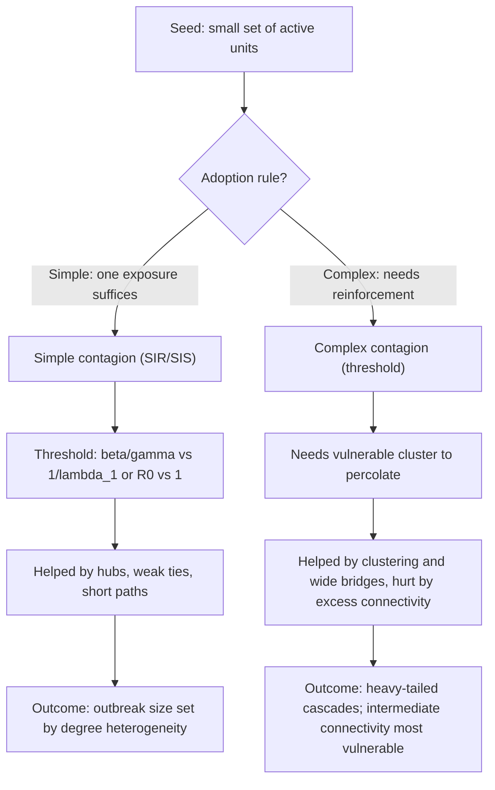

## Network-Theoretic Models of Conflict Diffusion and Contagion


### Scope and Framing

This item covers how the structure of a network (of states, groups, individuals, or locations) shapes the way conflict spreads, persists, and dies out, and how contagion models borrowed from epidemiology, statistical physics, and sociology are adapted, and misapplied, to conflict. The focus is on the causal mechanism (what propagates, along which ties, under what adoption rule), the formal models that capture each mechanism, the network properties that govern outcomes, and the design levers that follow: which structural interventions close off cascade pathways.

Terms defined on first use and used throughout:

- **Conflict diffusion**: the spatial or relational spread of conflict onset, escalation, or tactics from an originating unit to other units.
- **Contagion**: diffusion in which exposure to an affected neighbor causally raises the probability that a unit becomes affected, as distinct from correlated outcomes caused by shared exposure to common drivers.
- **Simple contagion**: a process in which a single exposure can suffice for transmission (as with a pathogen).
- **Complex contagion**: a process in which adoption requires reinforcement from multiple independent sources, so that the probability of adoption is nonlinear in the number of affected neighbors (Centola and Macy 2007).
- **Threshold model**: a unit adopts a state once the fraction (or number) of its neighbors in that state crosses a unit-specific threshold (Granovetter 1978; Watts 2002).
- **Basic reproduction number ($R_0$)**: the expected number of secondary affected units generated by one affected unit in an otherwise unaffected population.

Scope discipline: this item concerns network structure and propagation dynamics. Spatial sorting under insecurity, rebellion-repression dynamics on a lattice, and empirical calibration are distinct topics and are referenced only where they constrain the network models.

---

### 1. Why Networks: The Case Against Well-Mixed Models

A **well-mixed (mean-field) model** assumes every unit interacts with every other with equal probability, so that only aggregate counts matter. Conflict violates this assumption in at least four ways:

1. **Local interaction**: violence spreads through geographic adjacency, alliance ties, ethnic kinship, trade links, refugee flows, and communication networks, not uniformly.
2. **Heterogeneous connectivity**: some units (hub states, transit corridors, charismatic leaders, social-media influencers) have far more ties than others.
3. **Clustering and community structure**: groups are densely tied internally and sparsely tied externally, creating boundaries across which transmission is attenuated.
4. **Multiple simultaneous layers**: the same units are connected by different tie types (alliance, rivalry, trade, ethnic kinship, border adjacency) that transmit different things.

A network representation $G = (V, E)$ with adjacency matrix $\mathbf{A}$ ($A_{ij} = 1$ if a tie from $j$ to $i$ exists) makes these features explicit. Contagion outcomes then depend on **who is connected to whom**, not just on how many units are affected.

---

### 2. What Propagates, and Along Which Ties: Diffusion Channels

Before choosing a model, specify the **propagating quantity** and the **channel**. Conflating them is the most common conceptual error in applying contagion models to conflict.

| Channel | Propagating quantity | Tie type | Mechanism (causal direction) |
| --- | --- | --- | --- |
| Geographic spillover | Violence, armed groups, refugees | Border adjacency, shared terrain | Refugee flows, weapons trafficking, rebel sanctuary raise neighbor's conflict risk |
| Alliance entanglement | War participation | Alliance ties | Treaty obligations or coalition commitments pull allies into an existing war |
| Ethnic kinship | Grievance, mobilization | Transnational ethnic ties | Co-ethnics' repression or victory shifts group expectations and mobilization capacity across borders |
| Demonstration/learning | Tactics, framing, expectation of success | Media and communication ties | Observed success of protest or insurgency updates beliefs about feasibility (a diffusion of *information*) |
| Economic | Shocks, grievance | Trade and financial ties | Commodity or price shocks transmit through trade linkages and alter the opportunity cost of rebellion |
| Rivalry and security | Threat perception, arms buildup | Rivalry ties | Security dilemma spirals: one state's defensive buildup raises its rival's perceived threat |
| Rumor and identity | Fear, mobilizing narratives | Social and online networks | Rumors of attack trigger preemptive violence (Horowitz 2001; Fujii 2009 on local dynamics) |

Each channel implies a different **adoption rule** (single-exposure versus reinforcement-requiring), a different **directionality** (symmetric vs. directed ties), and a different **timescale** (arms races over years; rumor cascades over hours).

**Identification caution (the reflection and homophily problems)**: an observed correlation between neighbors' conflict status does not establish contagion. Three alternative explanations produce the same pattern (Manski 1993 "reflection problem"; Shalizi and Thomas 2011 on the confounding of homophily and contagion):

1. **Common exposure**: neighbors share drivers (climate shock, commodity price, regional patron).
2. **Homophily**: similar units are more likely to be tied *and* to experience conflict, without any transmission.
3. **Endogenous tie formation**: conflict itself creates or severs ties (alliances form because of war), reversing the causal arrow.

Network models demonstrate what contagion *would* do given a stipulated mechanism; they do not, without a research design, show that contagion is what occurred.

---

### 3. Foundational Network Structure

#### 3.1 Descriptive Measures Relevant to Diffusion

| Measure | Definition | Diffusion relevance |
| --- | --- | --- |
| Degree $k_i$ | Number of ties of node $i$ | Exposure opportunities; hubs spread and receive more |
| Degree distribution $P(k)$ | Fraction of nodes with degree $k$ | Heavy tails (scale-free-like) lower epidemic thresholds |
| Clustering coefficient $C_i$ | Fraction of $i$'s neighbor pairs that are themselves tied | High clustering supports complex contagion by providing redundant reinforcing ties |
| Average path length $\ell$ | Mean shortest-path distance between node pairs | Short paths accelerate spread ("small world") |
| Betweenness centrality | Fraction of shortest paths through a node | Brokers and bridges: chokepoints for cross-community transmission |
| Modularity $Q$ | Strength of division into communities | High $Q$ contains cascades within communities until a bridge is crossed |
| Assortativity $r$ | Correlation of degrees at either end of a tie | Degree-assortative networks have different thresholds and cascade shapes |
| Largest eigenvalue $\lambda_1(\mathbf{A})$ | Spectral radius of the adjacency matrix | Governs the epidemic threshold (Section 4.2) |
| Weak ties | Low-overlap bridging ties (Granovetter 1973) | Carry simple contagion across communities; poorly carry complex contagion |

#### 3.2 Canonical Network Families

- **Erdős-Rényi random graphs**: each pair tied with probability $p$; Poisson degree distribution; homogeneous, no clustering. Baseline case.
- **Watts-Strogatz small-world**: a regular lattice with a fraction of edges rewired randomly; high clustering combined with short paths.
- **Barabási-Albert preferential attachment**: new nodes attach proportionally to degree, producing a power-law tail $P(k) \sim k^{-\gamma}$ (typically $\gamma \approx 3$ in the basic model). [Inference] Whether real conflict-relevant networks are genuinely scale-free is contested; heavy-tailed degree distributions are common, but rigorous tests often favor log-normal or truncated alternatives (Broido and Clauset 2019).
- **Stochastic block models (SBM)**: nodes belong to groups with within-group tie probability exceeding between-group probability; the natural model for ethnic or factional community structure.
- **Geometric and spatial networks**: ties depend on physical distance; adjacency-based conflict spillover is naturally modeled here.
- **Multilayer networks**: a set of layers $\{G^{(\alpha)}\}$ on a shared node set, each carrying a different tie type.

---

### 4. Simple Contagion: Epidemic-Style Models

#### 4.1 The SIR and SIS Analogs

Map conflict onto compartmental states. Two common mappings:

- **SIR (Susceptible-Infected-Removed)**: units are at peace (S), in active conflict (I), or in a post-conflict/exhausted state that is temporarily or permanently immune (R). Appropriate when conflict exhausts resources or when settlements confer immunity.
- **SIS (Susceptible-Infected-Susceptible)**: units return to susceptibility after conflict ends. Appropriate for recurrent conflict, consistent with the empirical finding that past civil war is among the strongest predictors of future civil war (the "conflict trap", Collier et al. 2003).

Per-tie transmission occurs at rate $\beta$ per infected neighbor per unit time; recovery occurs at rate $\gamma$.

**Network mean-field (individual-based) equations** for the probability $p_i(t)$ that node $i$ is infected under SIS, using the first-order approximation that neighbor states are independent:

$$\frac{dp_i}{dt} = \beta\,(1 - p_i)\sum_{j} A_{ij}\, p_j \;-\; \gamma\, p_i$$

This "N-intertwined mean-field approximation" (NIMFA; Van Mieghem et al. 2009) retains the full network structure through $\mathbf{A}$ but neglects correlations between neighbors' states. [Inference] The independence approximation typically overestimates infection probabilities and is least accurate on sparse, clustered networks.

#### 4.2 The Epidemic Threshold and Network Structure

Linearizing the SIS equations around the disease-free state $p_i \approx 0$:

$$\frac{d\mathbf{p}}{dt} \approx \left(\beta \mathbf{A} - \gamma \mathbf{I}\right)\mathbf{p}$$

The disease-free state is unstable, allowing conflict to persist endemically, iff the largest eigenvalue of $\beta\mathbf{A} - \gamma\mathbf{I}$ is positive, i.e.

$$\frac{\beta}{\gamma} > \frac{1}{\lambda_1(\mathbf{A})} \equiv \tau_c$$

so the **epidemic threshold** is $\tau_c = 1/\lambda_1(\mathbf{A})$ (Wang et al. 2003; Chakrabarti et al. 2008). Structural consequences:

- Networks with larger spectral radius $\lambda_1$ have *lower* thresholds and sustain conflict at lower transmissibility. For a network with a heavy-tailed degree distribution, $\lambda_1 \gtrsim \sqrt{k_{max}}$, and $\lambda_1$ can grow without bound as the network grows, so that the threshold vanishes in the infinite-size limit for sufficiently heavy tails (Pastor-Satorras and Vespignani 2001, in the degree-based mean-field formulation where the threshold is $\langle k \rangle / \langle k^2 \rangle$). [Unverified] The exact scaling and whether the threshold truly vanishes in finite empirical networks depend on the approximation used; the quenched (adjacency-matrix-based) and annealed (degree-based) treatments differ and both have known limitations.
- **Hubs are the structural drivers**: removing or immunizing high-degree nodes raises the threshold most efficiently, which is the formal basis for hub-targeted interventions (Section 10).

**Degree-based mean-field threshold (annealed approximation)** for SIS on an uncorrelated network:

$$\frac{\beta}{\gamma}\bigg|_c = \frac{\langle k \rangle}{\langle k^2 \rangle}$$

For a Poisson (Erdős-Rényi) network $\langle k^2 \rangle = \langle k \rangle^2 + \langle k \rangle$, giving $\tau_c \approx 1/(\langle k \rangle + 1)$; for heavy-tailed networks $\langle k^2 \rangle$ is large and $\tau_c$ is small.

#### 4.3 Basic Reproduction Number on Networks

For SIR on a network in the large-size limit with random mixing among ties (configuration model), the epidemic exists (a giant outbreak is possible) when

$$R_0 = T \cdot \frac{\langle k^2 \rangle - \langle k \rangle}{\langle k \rangle} > 1$$

where $T$ is the transmissibility (probability that an infected node transmits along a given tie before recovering) and $\frac{\langle k^2 \rangle - \langle k \rangle}{\langle k \rangle}$ is the mean **excess degree** (expected number of *additional* neighbors reached through a randomly followed tie). This is the Molloy-Reed / Newman (2002) result, and it shows that **degree heterogeneity, not just mean degree, controls whether conflict can spread**.

**Caveat on $R_0$ for conflict**: unlike infectious disease, conflict transmission is rarely a memoryless per-contact probability; it depends on the receiving unit's state (regime capacity, grievance, opportunity). Treating $\beta$ as a homogeneous constant is a strong simplification, and the heterogeneity of *susceptibility* (Section 6) frequently matters as much as network heterogeneity.

#### 4.4 SIR Cascade Sizes: Percolation Mapping

For SIR with a fixed per-tie transmissibility $T$, the final outbreak size maps exactly onto **bond percolation**: each tie is independently "open" with probability $T$, and the set of nodes eventually infected from a seed is that seed's connected cluster in the open-tie subgraph (Grassberger 1983; Newman 2002). Consequences:

- A **giant outbreak** occurs iff the open-tie subgraph has a giant component, a sharp threshold phenomenon.
- Below threshold, outbreaks are small and finite; above, a positive fraction of the network is reached with positive probability.
- This provides analytic access to final-size distributions using generating functions for the degree distribution.

---

### 5. Complex Contagion: Threshold and Cascade Models

Simple contagion suits the spread of refugees or weapons. Mobilization, rebellion joining, and the adoption of risky tactics often behave as **complex contagion**: an individual joins only when enough others already have, because participation is risky and the payoff depends on collective size. Recall that a threshold model has each unit adopt when its exposed-neighbor fraction crosses a unit-specific threshold.

#### 5.1 Watts Global Cascade Model

Watts (2002): each node $i$ has threshold $\phi_i$ (drawn from a distribution) and adopts (becomes "active" in conflict) when the fraction of its neighbors already active satisfies

$$\frac{\sum_j A_{ij}\, s_j}{k_i} \ge \phi_i$$

where $s_j \in \{0,1\}$ is neighbor $j$'s state. Starting from a small seed, a **global cascade** (one reaching a finite fraction of the network) occurs only if the seed can trigger neighbors that can trigger their neighbors. Key structural result:

- A node with degree $k_i$ is **vulnerable** (activated by a single active neighbor) iff $\phi_i \le 1/k_i$. The cascade condition depends on the connected cluster of vulnerable nodes: a global cascade is possible iff this vulnerable cluster percolates.
- **Non-monotone dependence on connectivity**: at low mean degree, the network lacks paths to carry the cascade; at high mean degree, each node has so many neighbors that $1/k_i$ is small and few nodes are vulnerable, so cascades are *blocked*. Global cascades occur in an **intermediate window of connectivity**. This is opposite to the simple-contagion intuition that more connectivity always helps spread. [Inference] For conflict, the implication is that both very sparse and very dense societies may resist threshold-driven mobilization cascades, while moderately connected ones are most vulnerable, though this is a model result whose empirical relevance is unestablished.
- **Cascade size distributions** near the transition are heavy-tailed: most cascades are tiny, a few are enormous, and predicting which is which from seed characteristics is intrinsically difficult. This is a network analog of the punctuated dynamics of threshold models generally.

#### 5.2 Complex versus Simple Contagion on Small-World Networks

Centola and Macy (2007) show that on Watts-Strogatz networks:

- **Simple contagion** spreads faster as random long-range (weak) ties are added, since each bridge can seed a distant region.
- **Complex contagion** may spread *more slowly* or fail as random long-range ties are added, because a bridge tie delivers only one exposure to a distant region where the adopter cannot find reinforcing exposure. Complex contagion needs **wide bridges**: multiple redundant ties connecting communities (high overlap of neighborhoods).

**Peace-relevant consequence**: the *type* of structure that blocks each kind of contagion differs. Sparse weak ties between communities can transmit information, rumors, or weapons (simple) yet fail to carry collective mobilization (complex); conversely, tightly clustered, redundantly-tied communities incubate mobilization but are protected from cascades that need many independent inputs from outside.

#### 5.3 Threshold Heterogeneity and Fragility

Recall the Granovetter (1978) result: aggregate participation is the fixed point of the threshold CDF map, $r^* = F(r^*)$. Small changes in the *distribution* of thresholds (not the mean) can flip outcomes from negligible to near-universal participation. On networks, this is refined: outcomes depend jointly on the threshold distribution and the local network neighborhood over which the fraction is computed. A small number of **low-threshold "instigators"** (agents with $\phi_i \approx 0$) embedded in high-clustering regions can ignite a cascade that a well-mixed calculation would predict to be impossible.



---

### 6. Heterogeneous Susceptibility and the State-Dependence of Transmission

Purely structural models put all heterogeneity in the network. In conflict, the *receiving unit's* condition often dominates. A general node-state-dependent transmission model:

$$P(\text{node } i \text{ activates at } t) = h\!\Big(\underbrace{\textstyle\sum_{j} w_{ij}\, s_j(t)}_{\text{network exposure}},\; \underbrace{\mathbf{x}_i}_{\text{local covariates}}\Big)$$

where $w_{ij}$ are (possibly weighted) tie strengths and $\mathbf{x}_i$ are covariates capturing the unit's own susceptibility (state capacity, grievance, terrain, economic shocks, prior conflict). Two important consequences:

1. **Network exposure interacts with susceptibility.** The same neighbor exposure produces conflict in a fragile state and no conflict in a consolidated one. The *effective* transmission graph is thus the network reweighted by susceptibility, and the relevant structure for spread is the subgraph of *susceptible* nodes. This is the reason conflict is "clustered" in poor, fragile regions ("bad neighborhoods", Collier et al. 2003; Gleditsch 2007) even without strong contagion.
2. **Identification of contagion versus susceptibility** requires conditioning on $\mathbf{x}_i$ and using research designs (e.g., instrumenting neighbor exposure with plausibly exogenous shocks) that separate the two.

**Regime-conditioned transmission**: the mapping $h$ is typically nonlinear with thresholds (a state below a capacity threshold is "tinder"). This links back to the threshold structure of Section 5.

---

### 7. Temporal, Multilayer, and Adaptive Networks

#### 7.1 Temporal Networks

Ties in conflict settings are not static; they activate intermittently (a border crossing occurs on certain days; an alliance is invoked only in crises). In a **temporal network** the adjacency matrix is $\mathbf{A}(t)$. Transmission requires a **time-respecting path** (ties activating in the right order). Consequences:

- Static aggregation overstates reachability because it ignores ordering constraints.
- Burstiness of contact times (heavy-tailed inter-contact intervals) slows spread relative to Poisson-timed contacts (Karsai et al. 2011). [Inference] The size of the slowdown depends on the correlation structure of contact times.
- Timing of interventions matters: cutting a tie only when it is about to activate is more efficient than cutting it continuously.

#### 7.2 Multilayer Networks

Represent layers $\alpha = 1, \dots, L$ (alliance, rivalry, trade, ethnic kinship, adjacency) on a shared node set with a **supra-adjacency matrix**. Different layers carry different propagating quantities with different rules. Interlayer coupling can produce **synergy or interference**: a state may be connected to a conflict zone through both trade and ethnic ties, with reinforcement that neither layer alone would provide. The threshold for spread on the multilayer system is not simply the sum of single-layer thresholds. [Inference] Multiplex structure can lower the effective threshold relative to any individual layer, but the direction and size of the effect depend on layer overlap and the coupling of dynamics across layers.

#### 7.3 Coevolving (Adaptive) Networks

In conflict, the network responds to the contagion: alliances form and dissolve, refugees move, communities sever ties with the out-group, borders are fortified. This is **coevolution**: state dynamics change ties and ties change state dynamics. Canonical mechanism, **adaptive rewiring**: a node severs ties to infected (or out-group) neighbors and rewires to susceptible (or in-group) ones (Gross, D'Lima, and Blasius 2006). Consequences:

- Rewiring can *suppress* spread (quarantine-like), but in conflict the same behavior (severing cross-group ties) increases **modularity**, and the resulting community structure can stabilize *within-group mobilization* and intergroup hostility, coupling to the ethnic sorting and security-dilemma dynamics.
- Coevolving models can exhibit **bistability and hysteresis**: the same parameter values support both a peaceful connected state and a fragmented conflictual state, depending on history.

---

### 8. Reference Implementation

The following self-contained Python example simulates simple (SIR) and complex (Watts threshold) contagion on the same network, so that the structural contrast of Section 5 can be reproduced. It uses NetworkX and NumPy; behavior varies with library versions and random seeds. `run_*` functions are written for clarity, not speed.

```python
import numpy as np
import networkx as nx

def sir_percolation_size(G, T, seed_node, rng):
    """SIR with per-tie transmissibility T, via bond percolation.
    Returns final outbreak size from a single seed."""
    infected = {seed_node}
    frontier = [seed_node]
    while frontier:
        new = []
        for u in frontier:
            for v in G.neighbors(u):
                if v not in infected and rng.random() < T:
                    infected.add(v)
                    new.append(v)
        frontier = new
    return len(infected)

def watts_cascade_size(G, thresholds, seeds):
    """Watts (2002) fractional-threshold cascade (synchronous, monotone).
    A node activates if (active neighbors)/degree >= its threshold."""
    active = set(seeds)
    changed = True
    while changed:
        changed = False
        for v in G.nodes():
            if v in active:
                continue
            k = G.degree(v)
            if k == 0:
                continue
            frac = sum((u in active) for u in G.neighbors(v)) / k
            if frac >= thresholds[v]:
                active.add(v)
                changed = True
    return len(active)

def experiment(n=2000, mean_deg_list=(1.5, 3, 6, 10, 20),
               phi=0.18, T=0.15, n_seeds_trials=50, rng_seed=0):
    rng = np.random.default_rng(rng_seed)
    rows = []
    for kbar in mean_deg_list:
        p = kbar / (n - 1)
        G = nx.fast_gnp_random_graph(n, p, seed=int(rng.integers(1 << 31)))
        thresholds = {v: phi for v in G.nodes()}          # homogeneous threshold
        sir_sizes, watts_sizes = [], []
        for _ in range(n_seeds_trials):
            s = int(rng.integers(n))
            sir_sizes.append(sir_percolation_size(G, T, s, rng))
            watts_sizes.append(watts_cascade_size(G, thresholds, [s]))
        rows.append((kbar, np.mean(sir_sizes) / n, np.mean(watts_sizes) / n))
    return rows

for kbar, sir_frac, watts_frac in experiment():
    print(f"<k>={kbar:5.1f}  SIR mean outbreak fraction={sir_frac:5.3f}  "
          f"Watts mean cascade fraction={watts_frac:5.3f}")
```

**Output** (illustrative structure, not real results): SIR outbreak fraction should increase monotonically with mean degree above the threshold $T\,\langle k\rangle$-type condition, whereas the single-seed Watts cascade fraction should stay near zero in this setup for most mean degrees, because a single seed cannot activate nodes requiring multiple active neighbors. To observe Watts' *intermediate-connectivity window*, use a **heterogeneous threshold distribution** with some low-threshold (vulnerable) nodes, e.g. drawing $\phi_i$ from a normal distribution with mean 0.18 and standard deviation about 0.05, truncated to $[0,1]$, and average over many seeds and graphs. Exact windows depend on the threshold distribution and network size.

**Extension to spectral threshold check** (SIS):

```python
def sis_epidemic_threshold_ratio(G):
    """Quenched mean-field: critical beta/gamma = 1 / lambda_1(A)."""
    A = nx.to_scipy_sparse_array(G, dtype=float)
    from scipy.sparse.linalg import eigsh
    lam1 = eigsh(A, k=1, which="LA", return_eigenvectors=False)[0]
    return 1.0 / lam1

# Annealed (degree-based) alternative
def annealed_threshold(G):
    degs = np.array([d for _, d in G.degree()], dtype=float)
    return degs.mean() / (degs**2).mean()
```

Comparing the two thresholds on an Erdős-Rényi graph and a Barabási-Albert graph of equal mean degree demonstrates how heavy-tailed degree distributions lower the threshold. On finite networks the quenched and annealed estimates differ, and neither is exact.

---

### 9. Worked Example: Comparing Interventions on a Two-Community Network

**Setup.** A network of $n = 1000$ units in two communities of 500 (a stochastic block model): within-community tie probability $p_{in} = 0.02$ (mean within-degree about 10), between-community probability $p_{out}$ varied. A conflict starts with a small seed in community 1. Two contagion types are simulated: **simple** (SIR, $T = 0.12$) and **complex** (Watts threshold, $\phi = 0.2$ for most nodes with a small fraction, say 5%, of low-threshold instigators drawn at $\phi = 0.05$).

**Predictions from mechanism (to be tested, not assumed):**

1. **Simple contagion crosses the boundary with few bridges.** Because a single infected tie can seed community 2, the probability that the outbreak reaches community 2 rises rapidly with the *number* of between-community ties, roughly as $1 - \exp(-\text{(expected infected border nodes)} \cdot T \cdot \text{(cross-ties per border node)})$. With SIR above threshold within community 1 (excess-degree condition $T\,(\langle k^2\rangle - \langle k\rangle)/\langle k\rangle > 1$: with $\langle k\rangle \approx 10$ and Poisson-like variance, the excess degree is about $10$, so $R_0 \approx 1.2 > 1$), a handful of bridging ties suffices. Prediction: outbreak reaches community 2 with high probability even at small $p_{out}$.
2. **Complex contagion requires wide bridges.** With $\phi = 0.2$ and degree about 10, a node needs at least 2 active neighbors (since $2/10 = 0.2 \ge \phi$). A node in community 2 with only *one* tie to an active node in community 1 (a narrow bridge) will not activate unless it has a low-threshold instigator status. Prediction: complex cascades cross into community 2 only when $p_{out}$ is large enough that some nodes have $\ge 2$ ties to active nodes, or when low-threshold instigators sit at the border. The transition in $p_{out}$ should be **sharper and located at higher $p_{out}$** than for simple contagion.
3. **Intervention comparison.** Three interventions are compared: (a) **random tie removal** (remove a fraction of all ties), (b) **hub-targeted node immunization** (immunize the highest-degree nodes), (c) **bridge-targeted tie removal** (remove the between-community ties with the highest edge betweenness). Predictions: (b) is most efficient against simple contagion on heterogeneous networks because it directly raises the spectral threshold; (c) is most efficient at *containing* a cascade to its origin community for both contagion types; (a) is least efficient for simple contagion and moderately effective for complex contagion, since removing ties also reduces the redundancy that complex contagion needs.

**Expected qualitative finding** [Inference]: the *ranking of interventions depends on the contagion type*, so that an intervention optimized for simple contagion (hub immunization) can be second-best or ineffective for complex contagion (where instigator placement and bridge width matter more). Verification requires running the simulation with replicated seeds and reporting distributions of outcomes (probability of crossing, expected cascade size), since cascade sizes are heavy-tailed and means are unstable.

**Conclusion of the example**: containment design is contingent on the propagating mechanism; identifying whether the relevant process is simple or complex is a precondition for choosing the structural lever.

---

### 10. Peace-Engineering Design Implications

Framed as hypotheses the models let one explore under their own assumptions, with the failure mode each design is meant to close off:

1. **Identify the propagation mechanism first.** The structural lever that contains simple contagion (cut hubs and long-range weak ties; raise the spectral threshold) can be ineffective or counterproductive for complex contagion (where redundant local reinforcement drives spread and removing weak ties changes little). *Failure mode closed off*: deploying the wrong structural intervention because the adoption rule was assumed rather than diagnosed.
2. **Target brokers and chokepoints for cross-community containment.** Bridge nodes and ties with high betweenness carry cascades between communities. Protective measures (border monitoring, weapons-flow interdiction, mediation presence at bridging institutions) concentrate resources where a cascade would otherwise cross. *Failure mode*: a local conflict becoming regional because a small number of bridges are unguarded.
3. **Protect and strengthen cross-cutting ties that carry *prosocial* transmission.** Networks transmit cooperation, information correction, and de-escalation norms as well as violence. Cross-group ties (trade, intermarriage, joint institutions) are conduits for both; their design should aim to amplify prosocial contagion while minimizing exposure to violence spillover. [Inference] Whether cross-cutting ties net-reduce conflict depends on the tie type and context; the contact-hypothesis literature shows mixed evidence, and ties can also transmit grievance.
4. **Manage the low-threshold instigator tail.** In complex contagion the left tail of the threshold distribution (a small set of highly mobilizable agents) can ignite cascades. Interventions that raise the effective cost of early participation, protect against provocateurs, or verify rumors reduce the density of vulnerable nodes. *Failure mode*: preemptive attacks or rumor-driven escalation triggered by a handful of agents.
5. **Raise susceptibility-side resilience, not only cut ties.** Because transmission depends on the receiving unit's state (Section 6), improving state capacity, economic resilience, and legitimacy in *neighboring* units lowers the effective transmissibility across existing ties. This is often more feasible than restructuring ties and complements it. *Failure mode*: treating a "bad neighborhood" as a pure contagion problem when it is substantially a shared-susceptibility problem.
6. **Avoid quarantine backfire.** Severing ties to the conflict zone (border closures, sanctions, isolation) can reduce transmission but raises modularity and can deepen out-group hostility and economic grievance, potentially strengthening the reinforcing loops of coevolving models. Evaluate interventions on both the transmission channel and the adaptive-rewiring response.
7. **Design early-warning indicators from network structure.** Candidate leading indicators: rising local clustering of active units, growth in the number of susceptible units adjacent to active ones, proximity of the vulnerable-node cluster to percolation (rising cluster size), and rising variance in local activity. [Inference] These are plausible signals of proximity to cascade thresholds, but their reliability in real conflict networks is not established and must be validated per setting, with attention to false-alarm cost.
8. **Respect the identification limits.** Structural interventions justified by a contagion model are only as sound as the evidence that contagion (rather than common exposure or homophily) generated the observed clustering. Base intervention decisions on designs that separate these, and treat model-derived rankings as hypotheses to be tested.

---

### 11. Limitations and Critical Assessment

| Limitation | Consequence | Mitigation |
| --- | --- | --- |
| Epidemiological analogy imports assumptions (memoryless transmission, homogeneous agents) | Misrepresents strategic, deliberative actors who respond to being modeled | Use game-theoretic or agent-based decision rules on the network (strategic contagion) |
| Static, observed networks | Real networks are partially observed, noisy, and endogenous to conflict | Report sensitivity to missing ties; model tie formation jointly |
| Identification of contagion versus homophily and common shocks | Structural conclusions can be spurious | Instrumental variables, natural experiments, placebo networks, randomization inference on network permutations |
| Threshold and transmissibility parameters are unmeasured | Model predictions are conditional on stipulated values | Sensitivity analysis over parameters and structural variants |
| Mean-field approximations neglect neighbor correlations | Threshold and prevalence estimates may be biased on clustered networks | Compare with exact simulation; use pair-approximation or message-passing methods |
| Heavy-tailed cascade statistics | Means and variances unstable; single-run conclusions misleading | Report quantiles, use many replicates, test tails formally |
| Scale mismatch | Individual-level, group-level, and state-level networks obey different mechanisms | Specify the unit of analysis and the propagating quantity explicitly |

Recall that **equifinality** means that distinct mechanisms can generate the same aggregate signature: a clustered spatial pattern of conflict is generated equally by contagion, common shocks, and homophily. Network models clarify what each mechanism predicts but do not, on their own, adjudicate among them.

---

### 12. Quick Reference

**SIS threshold (quenched)**: $\beta/\gamma > 1/\lambda_1(\mathbf{A})$

**SIS threshold (annealed, uncorrelated)**: $\beta/\gamma\big|_c = \langle k\rangle / \langle k^2\rangle$

**SIR on configuration-model networks**: giant outbreak iff $R_0 = T\,\dfrac{\langle k^2\rangle - \langle k\rangle}{\langle k\rangle} > 1$

**Watts threshold rule**: node $i$ activates iff $\dfrac{\sum_j A_{ij}s_j}{k_i} \ge \phi_i$; vulnerable iff $\phi_i \le 1/k_i$

**Granovetter fixed point**: equilibrium participation solves $r^* = F(r^*)$

**NIMFA equation**: $\dfrac{dp_i}{dt} = \beta(1-p_i)\sum_j A_{ij}p_j - \gamma p_i$

**Key Points**

- Diffusion outcomes depend on the propagating quantity, the tie type, and the adoption rule; specifying these precedes model choice.
- Simple contagion is governed by degree heterogeneity and the spectral radius: hubs and weak ties accelerate it, and the threshold is low on heavy-tailed networks.
- Complex contagion requires reinforcement: clustering and wide bridges help it, excess connectivity can block it, and outcomes show heavy-tailed cascade sizes with a window of vulnerability at intermediate connectivity.
- Transmission depends on the receiving unit's susceptibility, so shared fragility and true contagion must be separated by research design, not by network models alone.
- Intervention effectiveness is mechanism-contingent: hub-targeting suits simple contagion, bridge- and instigator-targeting suits complex contagion, and network interventions can backfire through adaptive rewiring and rising modularity.

**Related Topics**

- Granovetter and Watts threshold cascade models in depth
- Complex contagion and wide bridges on small-world networks
- Multilayer and temporal network models of conflict
- Coevolving (adaptive) networks and hysteresis in social fragmentation
- Percolation theory and generating-function methods for cascade sizes
- Causal identification of contagion: homophily, reflection, and network experiments
- Signed networks, structural balance, and alliance dynamics
- Strategic (game-theoretic) contagion and equilibrium selection on networks