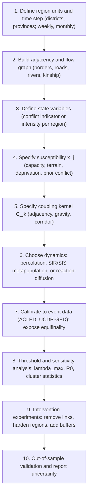

## Percolation and Epidemic Models of Conflict Spread Across Regions


### Scope and Framing

This item covers percolation theory and compartmental epidemic models as formal tools for representing how conflict spreads *across regions* (districts, provinces, states), with emphasis on the spatial structure of transmission: adjacency, distance decay, corridors, and barriers. It treats the region as the unit of analysis, asks under what conditions a local outbreak becomes a regional or continental conflict system, and identifies the structural levers (barriers, corridors, buffers) that close off large-scale spread.

The item is scoped to the *spatial-regional* formulation. The general network-theoretic treatment of simple and complex contagion, threshold cascades on abstract graphs, and multilayer structure is a distinct topic; where network results are needed they are restated with a one-sentence refresher.

Terms defined on first use and used throughout:

- **Percolation**: the study of connectivity in randomly occupied or randomly connected structures; in the *site* version, each unit is independently "open" with probability $p$; in the *bond* version, each link is independently open with probability $p$. A **spanning (or giant) cluster** is a connected set of open elements that extends across the system (in a finite lattice) or contains a finite fraction of all elements (in an infinite one).
- **Percolation threshold ($p_c$)**: the critical occupation probability above which a spanning cluster appears with non-vanishing probability in the infinite-size limit.
- **Compartmental model**: a model that partitions units into states (e.g., susceptible, infected, removed) and specifies transition rates between them.
- **Basic reproduction number ($R_0$)**: the expected number of secondary affected units produced by one affected unit in an otherwise unaffected population.
- **Metapopulation model**: a model of coupled subpopulations (here, regions), each with internal dynamics, linked by inter-region transmission.
- **Critical slowing down**: the lengthening of recovery time and rising variance and autocorrelation of a system's state as it approaches a tipping point.

Scope discipline: the item addresses spread between regions; within-region agent-level mechanisms (rebellion-repression, sorting) are treated only as inputs to regional susceptibility and transmissibility.

---

### 1. Why a Regional Epidemic-Percolation Framing

Empirical regularities motivate the framing (stated as patterns in the literature, not as settled causal facts):

1. **Spatial clustering of conflict**: civil wars and violence events cluster in space more than covariates alone predict ("bad neighborhoods", Gleditsch 2002; Buhaug and Gleditsch 2008).
2. **Distance decay**: the probability of spillover generally declines with distance from an existing conflict, and the decay is stronger across some kinds of boundaries than others.
3. **Corridor dependence**: transmission concentrates along roads, rivers, borders with porous crossings, and transit routes (Raleigh and Hegre 2009 on the spatial structure of violence).
4. **Threshold-like regional escalation**: local conflicts often stay local for long periods, then abruptly become regional wars.

Percolation and epidemic models supply a mechanistic vocabulary for (4): the transition from local to regional conflict as a **phase transition** in connectivity of the "susceptible-and-transmissive" region set.

**Identification caution.** Recall that observed spatial clustering does not prove contagion: shared drivers (climate shocks, commodity prices, common patrons), homophily (similar units cluster and both fall into conflict), and endogenous tie formation produce the same pattern. The models below are *mechanism-exploration devices*; their outputs describe what stipulated transmission would do, not that transmission caused any observed cluster.

---

### 2. Site and Bond Percolation as a Regional Conflict Model

#### 2.1 Formulation

Represent the study area as a graph $G = (V, E)$ whose nodes are regions and whose edges connect regions that can transmit conflict (shared border, road link, shared ethnic settlement). Two natural interpretations:

- **Site percolation (susceptibility-driven)**: region $i$ is *open* (conflict-prone, transmissive) with probability $p$, independently. Conflict spreads only through open regions. Here $p$ measures the fraction of regions that are fragile enough to sustain conflict, so open sites form the "tinder."
- **Bond percolation (transmission-driven)**: every region is capable of sustaining conflict, but each inter-region link transmits with probability $p$ (e.g., border permeability, refugee flow, trafficking route being active). Here $p$ measures how leaky the connections are.

The **conflict cluster** reachable from an origin region is the connected component of open elements containing that origin. Regional conflict of large extent requires the origin to belong to a large cluster.

#### 2.2 The Threshold and Cluster Statistics

For an infinite lattice or large random graph there is a critical $p_c$:

- For $p < p_c$: all open clusters are finite; the probability that a cluster has size $s$ decays exponentially in $s$ (for $p$ well below $p_c$). Local conflicts remain local.
- At $p = p_c$: cluster sizes follow a power law, $P(s) \sim s^{-\tau}$, with no characteristic scale. Order parameter behavior at the transition: the fraction of nodes in the largest cluster, $P_\infty(p)$, is zero below $p_c$ and grows as $P_\infty \sim (p - p_c)^{\beta_p}$ above it.
- For $p > p_c$: a giant cluster exists; the origin joins it with probability $P_\infty(p)$.

Universal critical exponents depend on dimension and lattice class, not on lattice details. [Inference] For two-dimensional lattices $\beta_p = 5/36$ and $\tau = 187/91$ are the standard values for isotropic random percolation; real regional adjacency graphs are irregular, heterogeneous, and finite, so these exponents describe idealized limits rather than empirical conflict data.

Known thresholds on regular lattices (site percolation; bond in parentheses), for calibration of intuition:

| Lattice | Coordination number | $p_c$ (site) | $p_c$ (bond) |
| --- | --- | --- | --- |
| 1D chain | 2 | 1 | 1 |
| 2D square | 4 | $\approx 0.5927$ | $0.5$ (exact) |
| 2D triangular | 6 | $0.5$ (exact) | $2\sin(\pi/18) \approx 0.3473$ |
| 2D honeycomb | 3 | $\approx 0.6970$ | $1 - 2\sin(\pi/18) \approx 0.6527$ |
| 3D simple cubic | 6 | $\approx 0.3116$ | $\approx 0.2488$ |

Two consequences of dimension and connectivity: (i) higher coordination lowers $p_c$, so densely adjacent regions percolate more easily; (ii) in one dimension (a linear corridor), $p_c = 1$: **any single blocked segment severs the chain**, which formalizes the fragility of purely linear transmission corridors to a single barrier.

#### 2.3 Random Graphs and Heterogeneous Degree

Recall that on a random graph with degree distribution $P(k)$ (configuration model), a giant component exists iff $\langle k^2 \rangle - 2\langle k \rangle > 0$ (Molloy-Reed criterion). For bond percolation with transmissibility $T$ the condition becomes

$$T \cdot \frac{\langle k^2 \rangle - \langle k \rangle}{\langle k \rangle} > 1,$$

so the critical transmissibility is $T_c = \langle k \rangle / (\langle k^2 \rangle - \langle k \rangle)$. Regions with a few very highly connected hubs (transit hubs, capital regions, border crossings) reduce $T_c$ sharply.

**Site versus bond percolation as a design distinction.** Site percolation asks "how many regions are fragile?"; bond percolation asks "how leaky are the links?" Interventions target different variables: improving regional resilience raises the effective closed-site fraction $1-p$; border security and interdiction lower link transmissibility.

#### 2.4 Spatial Percolation: Distance-Dependent Links

For links whose probability decays with distance, $p_{ij} = f(d_{ij})$ (e.g., a power-law kernel $f(d) \propto d^{-\alpha}$ or exponential), the percolation behavior depends on the kernel tail. Long-range links act as shortcuts: with sufficiently heavy tails ($\alpha$ small relative to the spatial dimension), the system behaves nearly mean-field with a low threshold; with short-range kernels, the lattice behavior is recovered. [Inference] Empirical distance-decay of conflict spillover is typically steep, suggesting near-lattice behavior for most transmission channels, with long-range exceptions carried by air travel, diaspora networks, and information flows.

---

### 3. Compartmental Epidemic Models Across Regions

#### 3.1 Single-Region SIR/SIS as a Building Block

Recall the standard mapping: susceptible (S: at peace), infected (I: in active conflict), removed (R: settled, exhausted, or otherwise temporarily immune). The well-mixed deterministic SIR system for fractions $s, i, r$ is

$$\frac{ds}{dt} = -\beta\, s\, i, \qquad \frac{di}{dt} = \beta\, s\, i - \gamma\, i, \qquad \frac{dr}{dt} = \gamma\, i,$$

with $R_0 = \beta / \gamma$. Outbreaks grow iff $R_0\, s(0) > 1$. The **final size** $r_\infty$ satisfies the transcendental equation

$$r_\infty = 1 - s(0)\, e^{-R_0\, r_\infty},$$

which yields a sharp threshold at $R_0 s(0) = 1$: below it the final size is small; above it a finite fraction is reached.

For recurrent conflict use SIS, $\frac{di}{dt} = \beta\, i (1 - i) - \gamma\, i$, whose endemic equilibrium $i^* = 1 - \gamma/\beta$ exists iff $R_0 > 1$. This captures the empirically strong "conflict trap" (past conflict predicts future conflict).

**Conflict-specific caveat.** In disease, $\beta$ is roughly a property of the pathogen and contact structure. In conflict, transmission depends on the *receiving* region's state (capacity, grievances, opportunity), so $\beta$ is best treated as region-dependent, $\beta_j$, and the "removed" state may be reversible and history-dependent. Treat $R_0$ as a modeling summary, not a measured constant.

#### 3.2 Metapopulation (Multi-Region) Model

Let regions $j = 1, \dots, M$ each have infected fraction $i_j$ and susceptible fraction $s_j$. Inter-region transmission is encoded by a coupling matrix $\mathbf{C} = (c_{jk})$, where $c_{jk} \ge 0$ measures the influence of region $k$'s conflict on region $j$'s risk. A standard SIS-type formulation:

$$\frac{di_j}{dt} = \big(1 - i_j\big)\Big(\beta_j\, i_j + \sum_{k \ne j} c_{jk}\, i_k\Big) - \gamma_j\, i_j$$

Linearizing about the conflict-free state $i \approx 0$ gives $\dot{\mathbf{i}} = \mathbf{J}\, \mathbf{i}$ with Jacobian

$$\mathbf{J} = \operatorname{diag}(\beta_j - \gamma_j) + \mathbf{C},$$

so the system supports sustained conflict iff the largest real eigenvalue of $\mathbf{J}$ is positive. The **global threshold condition**, $\lambda_{\max}(\mathbf{J}) > 0$, differs from the single-region conditions $\beta_j > \gamma_j$: **inter-region coupling can push the system over the threshold even when every region alone is subcritical**. This is the formal statement that conflict can be regionally self-sustaining though no single region could sustain it in isolation.

The **next-generation matrix** approach (Diekmann, Heesterbeek, and Metz 1990) gives a system-wide reproduction number: $\mathcal{R}_0 = \rho(\mathbf{K})$, the spectral radius of $\mathbf{K}$ with entries $K_{jk}$ equal to the expected number of new infections in region $j$ produced by one infected unit in region $k$ over its infectious period. The threshold is $\mathcal{R}_0 = 1$.

#### 3.3 Coupling Kernels

The coupling matrix is the modeling core. Common specifications:

| Kernel | Form of $c_{jk}$ | Interpretation |
| --- | --- | --- |
| Adjacency | $c_{jk} = c$ if regions share a border, else 0 | Contiguity spillover |
| Gravity | $c_{jk} \propto \dfrac{N_j^{a}\, N_k^{b}}{d_{jk}^{\alpha}}$ | Population-weighted flows with distance decay (refugees, trade, mobility) |
| Exponential decay | $c_{jk} = c_0\, e^{-d_{jk}/\ell}$ | Characteristic spillover length $\ell$ |
| Network/corridor | $c_{jk} \propto$ route capacity or flow | Roads, rivers, rail, trafficking routes |
| Ethnic/kin | $c_{jk} \propto$ shared-group population | Transnational co-ethnic ties |
| Composite | Weighted sum of the above | Multiple channels acting together |

Weights are unmeasured in most settings and must be estimated or varied in sensitivity analysis. Row-normalizing $\mathbf{C}$ changes the interpretation (relative exposure versus absolute).

#### 3.4 Spectral Consequences

For a symmetric $\mathbf{C}$ and homogeneous $\beta_j = \beta$, $\gamma_j = \gamma$, the threshold becomes $\lambda_{\max}(\mathbf{C}) > \gamma - \beta$. Regions and networks with large spectral radius (many strong couplings, hub structure) have low thresholds. The leading eigenvector $\mathbf{v}$ of $\mathbf{J}$ identifies the regions that dominate the growth mode (the "structural drivers" of regional escalation): interventions applied to regions with large eigenvector components reduce $\lambda_{\max}$ most (Section 8).

---

### 4. Reaction-Diffusion and Front-Propagation Formulations

For continuous space, a reaction-diffusion (Fisher-KPP type) model treats the local conflict intensity $u(\mathbf{x}, t) \in [0,1]$ as evolving by local growth and spatial spread:

$$\frac{\partial u}{\partial t} = D\, \nabla^2 u + r\, u\,(1 - u)$$

where $D$ is the effective spatial diffusion coefficient (spillover) and $r$ the local growth rate. Classical results (Fisher 1937; Kolmogorov, Petrovsky, and Piskunov 1937):

- A conflict front propagates at the asymptotic **minimum wave speed**


  $$c^* = 2\sqrt{D\, r},$$

  and the front width scales as $\sqrt{D/r}$.
- Front speed depends on the geometric mean of spread and growth: a region with strong local growth but weak spatial spillover advances slowly, and vice versa.

**Extensions relevant to conflict:**

1. **Allee effect (bistable growth)**: replacing $r\,u(1-u)$ with $r\,u(u - a)(1 - u)$ for a threshold $a \in (0,1)$ models conflict that cannot sustain itself below a minimum intensity (a critical mass of armed actors). The front may then **stall or retreat** if $a$ is large (a "pinning" or "propagation failure" regime), so barriers can arrest a front. [Inference] Whether real conflict growth has an Allee-type threshold is plausible for insurgencies requiring minimum organizational scale but is not established generally.
2. **Heterogeneous medium**: spatially varying $D(\mathbf{x})$ and $r(\mathbf{x})$ (terrain, state capacity, road density). Fronts accelerate along high-$D$ corridors and slow or stop at low-$r$ barriers.
3. **Long-range dispersal (non-local kernels)**: replacing $D\nabla^2 u$ with an integral operator with a heavy-tailed kernel yields **accelerating fronts** (super-linear speed) instead of constant speed. [Inference] This is the continuous-space analogue of the shortcuts discussed in Section 2.4 and is the relevant regime where air travel, diaspora, or social media dominate transmission.
4. **Anisotropy**: direction-dependent diffusion ($D_{\parallel}$ along a corridor, $D_{\perp}$ across) produces elongated, corridor-following fronts.

The speed $c^*$ offers a quick operational estimate: observed conflict front speeds (km per month) in a given episode provide an empirical constraint on the combination $D\, r$, though not on $D$ and $r$ separately (a structural non-identifiability that mirrors the identifiability problems in calibration of conflict models).

---

### 5. Critical Phenomena, Cluster Structure, and Finite-Size Effects

#### 5.1 Regional Conflict as a Critical System

Near the percolation threshold the system displays **critical phenomena**:

- Power-law cluster-size distribution and diverging correlation length $\xi \sim |p - p_c|^{-\nu}$. In two dimensions $\nu = 4/3$ for isotropic percolation.
- Extreme sensitivity of the outcome (local versus regional) to small parameter changes.
- Fractal geometry of the critical cluster: its size scales as $s \sim L^{d_f}$ with fractal dimension $d_f = 91/48$ in 2D. The spanning cluster is tenuous, connected through a small number of "red bonds" (links whose removal disconnects the cluster).

**Interpretation for conflict**: near threshold, a regional conflict system may be sparsely connected through a few critical links; blocking those links disconnects the system disproportionately. This is the structural basis for the intervention logic of targeting chokepoints.

#### 5.2 Finite-Size Scaling

Real regional systems are finite (tens to hundreds of regions), so the sharp threshold is smeared. For a system of linear size $L$, the transition region has width $\sim L^{-1/\nu}$, and the giant-cluster fraction obeys the scaling form $P_\infty(p, L) = L^{-\beta_p/\nu}\, \Phi\big((p - p_c)L^{1/\nu}\big)$ for a scaling function $\Phi$. **Practical consequence**: with $M \approx 30$ to $100$ regions, the transition from "local" to "regional" is a broad crossover, not a sharp switch, and the critical exponents are unreliable descriptors. Analyses should report crossover widths and use simulation on the actual adjacency graph rather than lattice thresholds.

#### 5.3 Non-Universality on Real Geographies

Real adjacency graphs violate the assumptions of idealized percolation: variable degree (a region can border 2 or 12 others), planar but irregular geometry, spatially correlated susceptibility (fragile regions cluster, so occupation is not independent), and boundary effects. **Correlated percolation** (spatially autocorrelated occupation) generally *lowers* the effective threshold for the same mean occupation because open sites clump into larger clusters. Independence assumptions in the models above therefore tend to underestimate regional spread where fragility is spatially clustered, which is the empirically typical case.

---

### 6. Mapping the Models onto Real Regional Data

#### 6.1 Model Construction Workflow



#### 6.2 Data and Measurement

- **Event data**: ACLED, UCDP-GED (georeferenced conflict events), aggregated to region-time cells. Reporting bias (media coverage, access) is correlated with the very variables of interest (remote and repressive regions are under-reported) and leaves "false susceptibles" in the data.
- **Adjacency and flows**: administrative boundary files (GADM, geoBoundaries), road and rail networks (OpenStreetMap), refugee and migration flows (UNHCR), trade and mobility data.
- **Susceptibility covariates**: night-light and economic indicators, terrain ruggedness, population, state-capacity proxies, ethnic settlement (GREG, GeoEPR).
- **Aggregation choices**: the modifiable areal unit problem means results depend on the definition of regions; repeat analyses at two aggregation levels.

#### 6.3 Estimating Transmission from Event Data

A common estimation route is a **self-exciting point process (Hawkes process)** in space and time, whose conditional intensity for events at location $\mathbf{x}$ and time $t$ is

$$\lambda(\mathbf{x}, t) = \mu(\mathbf{x}) + \sum_{t_i < t} g\big(\mathbf{x} - \mathbf{x}_i,\; t - t_i\big),$$

where $\mu$ is background intensity and $g$ the triggering kernel (typically separable, with exponential temporal decay and a spatial decay kernel). The branching ratio $n = \int g$ plays the role of a reproduction number: $n < 1$ implies subcritical clustering. Hawkes models (Mohler et al. 2011 for crime, and applications to conflict and terrorism such as Porter and White 2012; Zammit-Mangion et al. 2012) distinguish background events from triggered events under stated assumptions. [Inference] The decomposition is model-dependent: exogenous clustering (common shocks) can be absorbed into the triggering kernel and misread as contagion unless the background $\mu(\mathbf{x}, t)$ is flexibly specified.

---

### 7. Reference Implementation

The following self-contained Python code (NumPy and NetworkX) implements (a) bond/site percolation on a region adjacency graph with cluster statistics, and (b) a stochastic metapopulation SIS with a gravity coupling matrix, including the spectral threshold check. Behavior varies with library versions and seeds. Code is written for clarity, not speed.

```python
import numpy as np
import networkx as nx

# ---------- (a) Percolation on a region graph ----------
def percolate(G, p_site=1.0, p_bond=1.0, rng=None):
    """Return graph H of open sites/bonds. p_site: prob region is open;
    p_bond: prob a link transmits."""
    rng = np.random.default_rng() if rng is None else rng
    open_nodes = [v for v in G.nodes() if rng.random() < p_site]
    H = G.subgraph(open_nodes).copy()
    H.remove_edges_from([e for e in list(H.edges()) if rng.random() >= p_bond])
    return H

def cluster_stats(H, origin):
    """Size of the cluster containing origin, and the largest cluster size."""
    if origin not in H:
        return 0, max((len(c) for c in nx.connected_components(H)), default=0)
    comp = nx.node_connected_component(H, origin)
    largest = max(len(c) for c in nx.connected_components(H))
    return len(comp), largest

def sweep_bond(G, ps, n_rep=200, seed=0):
    rng = np.random.default_rng(seed)
    N = G.number_of_nodes()
    origins = list(G.nodes())
    out = []
    for p in ps:
        frac_reach, frac_giant = [], []
        for _ in range(n_rep):
            H = percolate(G, p_bond=p, rng=rng)
            o = origins[rng.integers(len(origins))]
            s, big = cluster_stats(H, o)
            frac_reach.append(s / N)
            frac_giant.append(big / N)
        out.append((p, np.mean(frac_reach), np.mean(frac_giant)))
    return out

# ---------- (b) Stochastic metapopulation SIS with gravity coupling ----------
def gravity_matrix(coords, pops, alpha=2.0, scale=1.0, a=0.5, b=0.5):
    n = len(pops)
    C = np.zeros((n, n))
    for j in range(n):
        for k in range(n):
            if j != k:
                d = np.linalg.norm(coords[j] - coords[k])
                C[j, k] = scale * (pops[j] ** a) * (pops[k] ** b) / (d ** alpha + 1e-9)
    return C / C.sum(axis=1, keepdims=True).clip(min=1e-12)  # row-normalize

def global_threshold(beta, gamma, C, coupling):
    """lambda_max of J = diag(beta-gamma) + coupling*C (linearization about i=0)."""
    J = np.diag(beta - gamma) + coupling * C
    return np.max(np.linalg.eigvals(J).real)

def simulate_sis(beta, gamma, C, coupling, i0, T=300, dt=0.1, noise=0.0, seed=0):
    rng = np.random.default_rng(seed)
    i = i0.copy()
    traj = [i.copy()]
    for _ in range(int(T / dt)):
        force = beta * i + coupling * (C @ i)
        di = (1 - i) * force - gamma * i
        i = np.clip(i + dt * di + noise * np.sqrt(dt) * rng.standard_normal(len(i)) * i * (1 - i),
                    0.0, 1.0)
        traj.append(i.copy())
    return np.array(traj)

# Example: subcritical regions coupled into a supercritical system
rng = np.random.default_rng(1)
M = 25
coords = rng.random((M, 2)) * 10
pops = rng.lognormal(mean=10, sigma=0.5, size=M)
C = gravity_matrix(coords, pops, alpha=2.0)
beta = np.full(M, 0.20)   # each region alone: beta < gamma  (subcritical)
gamma = np.full(M, 0.25)
for coupling in (0.0, 0.03, 0.08):
    lam = global_threshold(beta, gamma, C, coupling)
    print(f"coupling={coupling:4.2f}  lambda_max={lam:+.4f}  "
          f"{'sustained conflict' if lam > 0 else 'dies out'}")
```

**Output** (illustrative structure, not real results): with `coupling = 0` every region alone is subcritical ($\beta - \gamma = -0.05$), so $\lambda_{\max} = -0.05 < 0$ and conflict dies out; with sufficient coupling, $\lambda_{\max}$ turns positive and conflict persists. Because $\mathbf{C}$ is row-normalized, its spectral radius is 1, so the threshold in the homogeneous case is $\text{coupling} > \gamma - \beta = 0.05$ (the model above should cross zero near that value). This demonstrates the key structural point that inter-region coupling can create a supercritical system out of subcritical parts.

**Design notes**:

- For real applications, replace synthetic coordinates and populations with region centroids and census data; verify that row-normalization matches the intended interpretation (relative exposure versus absolute).
- Stochastic simulation at the level of individual regions (binary state per region with per-tick infection probabilities) is more faithful for small systems than the deterministic ODE, because with tens of regions demographic noise is not negligible.
- The multiplicative noise term is a modeling choice, not a derived result; treat it as a device for exploring stochastic variability.

---

### 8. Worked Example: Barrier and Corridor Interventions on a Regional Graph

**Setup.** A country is represented as a graph of $M = 60$ regions arranged as two dense clusters (e.g., two river basins) joined by a small number of transit links (mountain passes, bridges). Fragility is spatially clustered: conflict-prone regions occupy a contiguous band. A conflict begins in one region of cluster 1. Two spread mechanisms are studied: bond percolation (each link transmits with probability $T$) and metapopulation SIS with adjacency coupling.

**Predictions from mechanism (to be tested, not assumed):**

1. **Within-cluster spread is likely; cross-cluster spread depends on the few bridges.** If $T\,(\langle k^2\rangle - \langle k\rangle)/\langle k\rangle > 1$ inside cluster 1, an outbreak reaches most of cluster 1 with substantial probability. Crossing to cluster 2 requires transmission across at least one bridge link. With $b$ bridge links each transmitting with probability $T$, and the outbreak reaching the bridge endpoints with probability $q$, the probability of crossing is approximately $1 - (1 - qT)^b$. For small $b$ this is roughly linear in $b$ (each bridge adds independent chance), so **bridge count and bridge transmissibility set the crossing risk**.
2. **Correlated fragility lowers the effective threshold.** Because fragile regions cluster, open sites form large connected clumps. Predict that the simulated threshold in mean occupation is *below* the independent-site percolation threshold for the same graph, and that the cross-cluster crossing probability is higher than an independent-site calculation would suggest.
3. **Intervention ranking.** Compare: (a) *bridge hardening* (lowering $T$ on the $b$ bridge links); (b) *hub-region resilience* (raising the closed-site fraction at the highest-eigenvector-centrality regions); (c) *uniform border hardening* (lowering $T$ on all links by the same factor); (d) *buffer creation* (raising resilience of regions adjacent to the conflict front).
   Predictions: (a) is the most cost-efficient for *containing to cluster 1* because it acts on the red bonds that connect the giant cluster; (b) is most efficient at lowering $\lambda_{\max}$ (the eigenvector-weighted reduction of the growth mode) and therefore at preventing *endemic persistence* within the system; (c) is least efficient per unit of effort because it spends resources on links that are not critical; (d) is efficient against advancing fronts (raising the local growth threshold $a$ in the bistable case, Section 4) but does not reduce the internal cluster.

**Expected qualitative finding** [Inference]: the ranking of interventions depends on the *objective*. For "keep it out of cluster 2" (a containment objective), bridge-targeting dominates; for "prevent persistent regional conflict" (a threshold objective), eigenvector-weighted resilience dominates. A single ranked list of "best interventions" conflates these objectives. Verification requires replicated simulations reporting the distribution of outcomes (probability of crossing, expected cluster size, $\lambda_{\max}$) because cluster-size distributions near threshold are heavy-tailed.

**Conclusion of the example**: the structural lever depends on whether the goal is containment (cut critical links) or eradication of self-sustaining conflict (reduce the spectral radius of the coupled system); the two objectives generally select different targets.

---

### 9. Extensions and Refinements

#### 9.1 Directed and Weighted Coupling

Transmission is often asymmetric (a weak state's conflict spills into a strong neighbor less than the reverse). Use a non-symmetric $\mathbf{C}$; the threshold is then governed by the leading eigenvalue of a non-normal matrix, and **transient amplification** (growth before eventual decay) can occur even when $\lambda_{\max} < 0$. [Inference] Non-normality can make short-run spread larger than the long-run eigenvalue suggests, which matters for early-warning and response timing.

#### 9.2 Time-Varying and Seasonal Coupling

Corridors open and close seasonally (passes, river crossings, harvest cycles). With $\mathbf{C}(t)$ periodic, the threshold is determined by the dominant Floquet multiplier of the periodic system rather than by a time-averaged matrix, and averaging can misclassify a system whose coupling peaks align with high susceptibility. Percolation on **temporal networks** requires time-respecting paths; static aggregation overstates reachability.

#### 9.3 Adaptive Responses

Actors respond to spread: governments deploy forces, populations flee, borders close. Adaptive models make $\mathbf{C}$ and $\beta_j$ functions of the epidemic state. Border closure lowers $c_{jk}$ but may raise grievance and regional modularity, producing feedback that can offset the transmission benefit. Recall that a **reinforcing loop** is a cycle in which a change amplifies itself and a **balancing loop** counteracts change; here the intervention creates a balancing loop on transmission and possibly a reinforcing loop through grievance.

#### 9.4 Immunization and Vaccination Analogs

The percolation analog of immunization is **site removal**: making regions non-transmissive (resilient). The critical **immunization fraction** for random removal on a network with threshold parameter $\kappa = (\langle k^2\rangle - \langle k\rangle)/\langle k\rangle$ and transmissibility $T$ is $f_c = 1 - 1/(T\kappa)$ (for $T\kappa > 1$). **Targeted** removal of highest-degree nodes lowers the required fraction dramatically on heavy-tailed networks (Cohen et al. 2003 for acquaintance immunization; Albert, Jeong, and Barabási 2000 for attack tolerance). For regional conflict, "immunization" corresponds to building resilience or blocking transmissibility in the regions with greatest structural leverage, rather than spreading effort evenly.

#### 9.5 Competing and Cooperative Contagions

Peace-promoting processes (norms, cooperative institutions, information correction) also spread across regions. Two interacting contagions on the same graph (conflict and de-escalation) can be modeled as coupled SIS processes with mutual inhibition; the region-level outcome may exhibit bistability. [Speculation] This is a promising framing for designing peace-promoting spread, though empirical parameterization is sparse.

---

### 10. Calibration, Validation, and Limitations

Recall that **equifinality** is the situation in which distinct mechanisms or parameters produce indistinguishable aggregate outputs. Applied here:

| Issue | Consequence | Mitigation |
| --- | --- | --- |
| Shared drivers vs. contagion | Spatial clustering can arise without transmission | Include susceptibility covariates; use instruments or placebo adjacency graphs; test for excess clustering beyond covariate prediction |
| Homophily and endogenous ties | Neighbors similar for non-causal reasons | Permutation tests on network structure; temporal ordering checks |
| Non-identifiability of $D$ and $r$ (only $c^* = 2\sqrt{Dr}$ observed) | Front speed constrains a combination only | Add independent data on local growth or spillover |
| Reporting bias | Under-observation of remote or repressive regions | Model observation process explicitly; sensitivity to reporting rates |
| Modifiable areal unit problem | Thresholds and clusters change with region definitions | Multi-scale analysis |
| Finite-size smearing | Lattice exponents inapplicable | Simulate on the empirical graph |
| Non-stationarity | Parameters drift with regimes and actors | Rolling-window estimation; report validity horizon |
| Strategic, reflexive actors | Interventions change the transmission rule (Lucas-critique analog) | Adaptive models; robustness across behavioral assumptions |

**Validation strategy.** Use blocked, forward-chaining temporal validation and spatially blocked cross-validation (leave-one-region-out), compare against non-network baselines (covariates only, autoregressive terms) to test whether the network structure adds predictive value, and evaluate probabilistic forecasts with proper scoring rules. [Unverified] Reported gains from spatial-network terms in conflict forecasting vary considerably across datasets and specifications; the incremental value of the network structure should be demonstrated per application, not assumed.

**Interpretive limit.** The models formalize *how spread would proceed given stipulated coupling*. They are informative for mechanism exploration and comparative intervention analysis under stated assumptions, and are not, without additional design, causal evidence that conflict diffused between particular regions.

---

### 11. Peace-Engineering Design Implications

Framed as hypotheses the models let one explore under their own assumptions, with the failure mode each lever is meant to close off:

1. **Distinguish containment from eradication.** Cutting critical links (bridges, passes, transit hubs) confines an outbreak to its origin cluster; reducing $\lambda_{\max}$ via eigenvector-weighted resilience prevents self-sustaining regional conflict. These objectives select different targets, and pursuing the wrong one wastes resources. *Failure mode closed off*: spending uniformly on all borders when spread is concentrated on a few critical corridors.
2. **Locate the red bonds and hub regions before the crisis.** Compute cluster structure, betweenness, and leading-eigenvector centrality on the regional graph in peacetime to pre-identify chokepoints and structural drivers. *Failure mode*: discovering the critical corridor only after a cascade has crossed it.
3. **Build buffer regions with elevated resilience around fronts.** In bistable (Allee-type) dynamics, raising the local threshold for conflict persistence in regions adjacent to an advancing front can produce propagation failure. *Failure mode*: fronts advancing at $c^* = 2\sqrt{Dr}$ through low-resilience frontier regions.
4. **Treat correlated fragility as a warning sign.** Clusters of fragile regions percolate at lower average fragility than independent-occupation calculations suggest. Prioritize contiguous fragile belts, not only the most fragile individual regions. *Failure mode*: assuming isolated fragility when fragile regions are contiguous.
5. **Beware quarantine backfire.** Border closures lower link transmissibility but can raise grievance, cut legitimate trade, and increase modularity, feeding reinforcing loops. Evaluate interventions on both the transmission channel and the adaptive response. *Failure mode*: a containment measure that manufactures the susceptibility it was meant to block.
6. **Exploit the subcritical-parts, supercritical-whole insight.** Because coupling can make a system supercritical though every region alone is subcritical, stabilizing efforts should assess system-level $\lambda_{\max}$ and next-generation $\mathcal{R}_0$, not region-by-region indicators. *Failure mode*: declaring each region stable while the coupled system is not.
7. **Monitor critical-slowing-down and cluster-growth indicators.** Candidate early-warning signals: growing size of the largest cluster of conflict-prone active regions, rising variance and autocorrelation in regional event counts, lengthening recovery times after shocks. [Inference] These are theoretically motivated signals of proximity to a threshold, but their reliability in real, finite, non-stationary conflict systems is unestablished and false-alarm costs are high; validate per setting.
8. **Communicate uncertainty and scope.** Model-derived rankings are conditional on the coupling kernel, aggregation level, and susceptibility specification. Report sensitivity to these choices and state that structural conclusions are hypotheses to be tested, not findings about any specific conflict.

---

### 12. Quick Reference

**Bond percolation on configuration-model graphs**: giant cluster iff $T\,\dfrac{\langle k^2\rangle - \langle k\rangle}{\langle k\rangle} > 1$

**2D square lattice**: $p_c^{site} \approx 0.5927$, $p_c^{bond} = 0.5$; 2D triangular: $p_c^{site} = 0.5$, $p_c^{bond} \approx 0.3473$

**SIR final size**: $r_\infty = 1 - s(0)\,e^{-R_0 r_\infty}$; outbreak iff $R_0\, s(0) > 1$

**Metapopulation threshold**: sustained conflict iff $\lambda_{\max}\!\big(\operatorname{diag}(\beta_j - \gamma_j) + \mathbf{C}\big) > 0$; system-wide $\mathcal{R}_0 = \rho(\mathbf{K})$

**Fisher-KPP front speed**: $c^* = 2\sqrt{D\, r}$

**Random immunization critical fraction**: $f_c = 1 - \dfrac{1}{T\kappa}$, with $\kappa = \dfrac{\langle k^2\rangle - \langle k\rangle}{\langle k\rangle}$

**Hawkes branching ratio**: $n = \int g$; subcritical clustering iff $n < 1$

**Finite-size scaling**: transition width $\sim L^{-1/\nu}$

**Key Points**

- Regional conflict spread can be framed as percolation (connectivity of susceptible-and-transmissive regions) or as a metapopulation epidemic (coupled regional dynamics); both yield threshold phenomena that separate local from regional conflict.
- Inter-region coupling can create a self-sustaining system from individually subcritical regions; the relevant threshold is the spectral radius of the coupled system, not any regional parameter alone.
- Structure governs outcomes: degree heterogeneity and hubs lower thresholds, correlated fragility lowers effective thresholds, and critical clusters are connected through a few chokepoints.
- Fronts propagate at speeds set by spillover and local growth ($c^* = 2\sqrt{Dr}$), accelerate under long-range links, and can stall in bistable settings.
- Intervention choice depends on the objective (containment versus eradication) and on the adaptive response; identification limits mean the models support mechanism exploration and hypothesis generation rather than causal claims about specific conflicts.

**Related Topics**

- Network-theoretic simple and complex contagion and threshold cascades
- Spatial point processes and Hawkes models for conflict event data
- Reaction-diffusion fronts, pinning, and propagation failure in heterogeneous media
- Critical slowing down and early-warning indicators for regime transitions
- Correlated and continuum percolation on real geographies
- Targeted immunization and resilience allocation on networks
- Temporal and seasonal coupling: Floquet analysis of periodic transmission
- Causal identification of spatial spillover: instruments, placebo graphs, and natural experiments