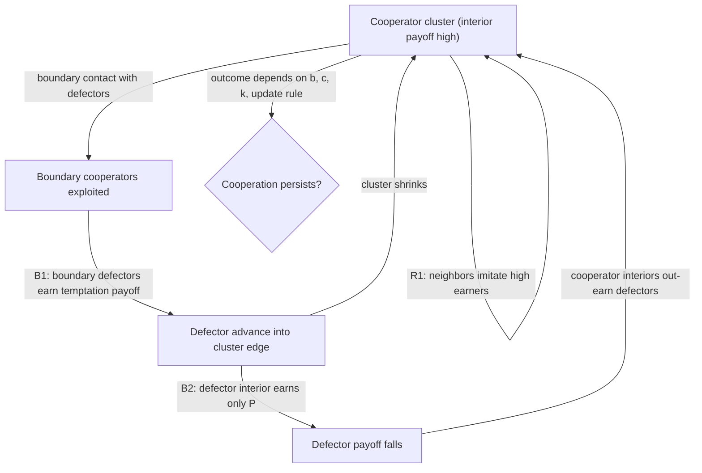

## Evolutionary Game-Theoretic Models of Cooperation Emergence in Spatial Games


### Scope and Framing

This item covers how spatial structure changes the evolutionary fate of cooperation in social dilemmas: the formal setup of spatial evolutionary games, the mechanism (network reciprocity) by which local interaction can sustain cooperation that well-mixed populations cannot, the conditions under which that mechanism succeeds or collapses, and the design implications for building institutions and interaction structures that make cooperation self-sustaining. The stance is diagnostic and design-oriented: what feedback structure produces cooperation, what assumptions carry it, and which failure modes an intervention must close off.

The formal baseline is the class of games on lattices and graphs introduced by Nowak and May (1992) and generalized through evolutionary graph theory (Lieberman, Hauert, and Nowak 2005; Ohtsuki et al. 2006). Well-mixed replicator dynamics is used as the null model against which spatial effects are measured.

Terms defined on first use and used throughout:

- **Social dilemma**: a game in which individually rational choice produces a collectively worse outcome than an available alternative (the prisoner's dilemma, the snowdrift game, and the stag hunt are canonical two-player cases).
- **Evolutionary game**: a game in which strategies are heritable traits (genetic or culturally transmitted), payoffs determine reproductive or imitation success, and population composition changes over time.
- **Replicator dynamics**: the deterministic dynamic $\dot{x}_i = x_i\,(\pi_i - \bar{\pi})$ for the frequency $x_i$ of strategy $i$ with expected payoff $\pi_i$ and population mean payoff $\bar{\pi}$, valid for well-mixed populations.
- **Evolutionarily stable strategy (ESS)**: a strategy that, once dominant, cannot be invaded by any rare mutant strategy (Maynard Smith and Price 1973).
- **Network reciprocity (spatial reciprocity)**: the mechanism by which cooperators survive by forming clusters in which they interact mostly with one another, so that cluster-internal payoffs exceed those of defectors bordering the cluster.
- **Imitation dynamics**: an update rule in which an agent copies a neighbor's strategy with a probability that increases with the neighbor's payoff advantage.

Scope discipline: the item concerns spatial and network-structured evolutionary games. Reputation-based indirect reciprocity, punishment institutions, and multilevel selection are referenced only as extensions where they interact with spatial structure.

---

### 1. Social Dilemmas: The Payoff Structure

#### 1.1 The Donation Game and Its Generalization

A common parameterization of the two-player cooperation problem is the **donation game**: a cooperator pays cost $c$ to give benefit $b > c$ to the partner; a defector pays nothing and gives nothing. The payoff matrix (row player's payoff) is:

|  | Partner cooperates | Partner defects |
| --- | --- | --- |
| **Cooperate** | $b - c$ | $-c$ |
| **Defect** | $b$ | $0$ |

This is a prisoner's dilemma (PD) because the payoffs satisfy $T > R > P > S$ where $T = b$ (temptation), $R = b - c$ (reward), $P = 0$ (punishment), $S = -c$ (sucker), with the additional condition $2R > T + S$ (mutual cooperation beats alternating exploitation) automatically satisfied by $b > c$ in this parameterization.

The general symmetric $2 \times 2$ game uses the four payoffs $(R, S, T, P)$, and the three dilemmas differ in the ordering:

| Game | Payoff ordering | Well-mixed evolutionary outcome | Interpretation |
| --- | --- | --- | --- |
| Prisoner's dilemma | $T > R > P > S$ | Defection is the unique ESS | Exploitation is always profitable |
| Snowdrift (hawk-dove, chicken) | $T > R > S > P$ | Stable mixed equilibrium of cooperators and defectors | Cooperating against a defector beats mutual defection |
| Stag hunt | $R > T > P > S$ | Bistable: all-cooperate and all-defect both stable | Coordination problem with a risk-dominant defection |

Recall that a well-mixed population implies every agent interacts with every other with equal probability, so the payoff to a strategy depends only on the population frequencies.

#### 1.2 The Well-Mixed Null Result

In a well-mixed population playing the donation game, the expected payoffs to cooperators and defectors at cooperator frequency $x$ are

$$\pi_C = x(b - c) + (1 - x)(-c) = bx - c, \qquad \pi_D = x\,b,$$

so $\pi_D - \pi_C = c > 0$ for all $x$. Under replicator dynamics, $\dot{x} = x(1-x)(\pi_C - \pi_D) = -c\,x(1-x) < 0$: cooperation goes extinct from any interior starting point. **Defection is the sole ESS**, and this holds regardless of $b$ and however large the population.

This is the benchmark. Anything that sustains cooperation in a PD must alter *who interacts with whom* (correlated interaction) or *how strategies are updated*, because the payoff matrix alone dooms cooperation under random matching. Rules of this kind are collectively termed **mechanisms for the evolution of cooperation** (Nowak 2006): kin selection, direct reciprocity, indirect reciprocity, network reciprocity, and group selection. The present item concerns the fourth.

---

### 2. Spatial Games: Model Specification

#### 2.1 Components

A spatial evolutionary game specifies four ingredients:

1. **Interaction structure**: a graph $G = (V, E)$ with $N$ nodes. Each node $i$ is an agent with neighborhood $\mathcal{N}(i)$ of size (degree) $k_i$. Common structures: square lattice with von Neumann ($k = 4$) or Moore ($k = 8$) neighborhood, regular random graph, small-world, scale-free.
2. **Strategy space**: typically two pure strategies, cooperate ($s_i = C$) and defect ($s_i = D$), possibly extended with continuous or memory-based strategies.
3. **Payoff accumulation**: agent $i$'s payoff $\Pi_i$ sums (or averages) its game payoffs against all neighbors:

$$\Pi_i = \sum_{j \in \mathcal{N}(i)} \pi(s_i, s_j).$$

Summation versus averaging matters when degrees are heterogeneous (Section 6).

4. **Update rule**: how agents revise strategies given payoffs (Section 3).

Interaction and competition neighborhoods can differ (agents play with one set of neighbors and imitate from another); the standard model uses the same neighborhood for both.

#### 2.2 The Nowak-May Model (Deterministic)

Nowak and May (1992) used a square lattice with Moore neighborhood plus self-interaction, a **weak** prisoner's dilemma with $R = 1$, $P = S = 0$, $T = b$ ($1 < b < 2$, so that the payoff difference between defecting against a cooperator and cooperating with a cooperator is the single parameter $b$), and **deterministic synchronous** updating: each cell adopts the strategy of the highest-scoring cell in its neighborhood (including itself).

The resulting dynamics produce "evolutionary kaleidoscopes": for a range of $b$, cooperators and defectors coexist indefinitely in spatially complex, dynamically shifting patterns rather than converging to all-defect. The results are a landmark demonstration that cooperation can persist in a PD *purely* through spatial structure, but they are sensitive to the update rule, as Section 5 shows.

---

### 3. Update Rules

The choice of update rule is not a technical detail: it determines whether spatial structure helps or hurts cooperation.

| Rule | Description | Formula / note |
| --- | --- | --- |
| Best-take-over (deterministic imitation) | Adopt the strategy of the highest-scoring neighbor (or self) | Nowak-May original |
| Imitate-best-with-noise | Best-take-over, with small mutation or error probability | Robustness check |
| Pairwise comparison (Fermi rule) | Pick a random neighbor $j$; adopt its strategy with probability $W = \big[1 + \exp\big((\Pi_i - \Pi_j)/K\big)\big]^{-1}$ | $K$ is selection noise ("temperature"); $K \to 0$ is deterministic, $K \to \infty$ is neutral drift (Szabó and Tőke 1998; Traulsen et al. 2006) |
| Proportional imitation | Adopt $j$'s strategy with probability proportional to $(\Pi_j - \Pi_i)$ when positive | Recovers replicator dynamics in the well-mixed limit (Schlag 1998) |
| Death-birth (DB) | Random agent dies; neighbors compete to fill the site with probability proportional to fitness | Standard in evolutionary graph theory (Ohtsuki et al. 2006) |
| Birth-death (BD) | Random agent chosen to reproduce proportional to fitness; offspring replaces a random neighbor | Alternative of DB |
| Imitation (IM) | Like DB, but the focal agent also competes with its neighbors | Close to Nowak-May |
| Best-response | Choose the payoff-maximizing strategy given neighbors' current strategies | Different logic: myopic rational choice rather than imitation |

Two distinctions carry most of the weight:

- **Synchronous versus asynchronous** updating changes qualitative outcomes; synchronous updates can produce artifacts (e.g., oscillations and global patterns that vanish under random sequential updating). [Inference] Many "kaleidoscope" patterns reflect synchrony to some degree; robustness to asynchrony should be tested.
- **Imitation versus best-response**: imitation is the assumption that agents copy successful others; best-response assumes strategic reasoning. Spatial structure generally *promotes* cooperation under imitation-type rules and can *fail to promote* it under best-response rules (Section 5.4).

---

### 4. The Mechanism: Cluster Formation and Boundary Competition

#### 4.1 Feedback Loop Structure

**Loop R1 (reinforcing, "cluster reinforcement"):**

Cooperators adjacent to other cooperators earn higher payoffs $\Rightarrow$ neighbors imitate them $\Rightarrow$ the cooperator cluster grows or persists $\Rightarrow$ interior cooperators have even more cooperator neighbors.

**Loop B1 (balancing, "boundary exploitation"):**

Defectors at the boundary of a cluster exploit boundary cooperators (temptation payoff $b$ against them) $\Rightarrow$ boundary defectors earn high payoffs $\Rightarrow$ neighbors imitate them $\Rightarrow$ the cluster erodes from the edge.

**Loop B2 (balancing, "defector starvation"):**

Defectors that succeed and expand end up surrounded by other defectors $\Rightarrow$ their payoffs fall toward $P$ (mutual defection) $\Rightarrow$ they become imitable by neighboring cooperators' cluster interiors, which now have higher payoff $\Rightarrow$ the defector region recedes.

Persistence of cooperation requires that R1 outweigh B1 at the cluster boundary. The interior/boundary payoff comparison is the core calculation.



#### 4.2 Boundary Payoff Calculation (Square Lattice, Donation Game)

Consider a straight cooperator-defector boundary on a von Neumann square lattice ($k = 4$) with the donation game (each agent plays each of its four neighbors; payoffs summed). Set self-interaction aside.

- **Interior cooperator**: four cooperator neighbors, payoff $4(b - c)$.
- **Boundary cooperator**: three cooperator neighbors and one defector neighbor (for a straight edge), payoff $3(b - c) + (-c) = 3b - 4c$.
- **Boundary defector**: one cooperator neighbor and three defector neighbors, payoff $b + 0 = b$.
- **Interior defector**: payoff $0$.

Under a rule where a boundary agent imitates the highest-payoff neighbor, the boundary defector (payoff $b$) faces a cooperator neighbor with payoff $3b - 4c$ (the boundary cooperator) or $4(b-c)$ if that neighbor's neighbor is interior; the edge is stable when the best cooperator neighbor of each boundary defector out-earns the best defector neighbor. Comparing the boundary cooperator's payoff $3b - 4c$ with the boundary defector's $b$:

$$3b - 4c > b \iff b > 2c \iff \frac{b}{c} > 2.$$

[Inference] For a straight edge under best-take-over updating this gives a threshold benefit-to-cost ratio near 2 for the cooperator side of the boundary to hold; the exact condition depends on the geometry of the boundary (straight edge versus corner versus single protrusion), the neighborhood, and the update rule, and corners and small clusters are more vulnerable than straight edges. The purpose of the calculation is to display the structure: **cooperation survives when the benefit-to-cost ratio is large enough that the compact cluster's boundary members out-earn the defectors who exploit them**, with the required ratio depending on the geometry of the interface.

#### 4.3 The Condition for Cooperation: $b/c > k$ (Ohtsuki et al. 2006)

Ohtsuki, Hauert, Lieberman, and Nowak (2006) derived a general rule for the donation game on a large, regular graph of degree $k$ under **death-birth** updating with weak selection: natural selection favors cooperation over defection when

$$\frac{b}{c} > k.$$

This "$b/c > k$" rule is the cleanest statement of network reciprocity: the benefit-to-cost ratio must exceed the average number of neighbors. Structural features:

- Lower $k$ (sparser connectivity) lowers the required $b/c$: cooperation is easier in sparsely connected populations because a cooperator's benefit is concentrated among fewer neighbors and exploitation opportunities are fewer.
- For a well-mixed population the corresponding condition would be $b/c > N$-like (effectively unattainable), consistent with the null result.
- The rule is derived under *weak selection* (payoff differences small relative to baseline fitness) and for *regular graphs* with DB updating; its exact form differs under BD updating, where **structure provides no benefit** for cooperation on regular graphs (the corresponding condition cannot be met for $b > c$). [Verified in the source paper for the regular-graph, weak-selection setting; extensions to heterogeneous graphs use a modified condition with a "structure coefficient" $\sigma$.]

#### 4.4 Generalization: Structure Coefficients

Tarnita, Ohtsuki, Antal, Fu, and Nowak (2009) showed that for a broad class of games and structures under weak selection, the condition for one strategy to be favored is linear in the payoffs and can be written for a $2 \times 2$ game as

$$\sigma R + S > T + \sigma P,$$

where $\sigma$ is a **structure coefficient** that depends only on the population structure and update rule (not on the game). For a well-mixed population $\sigma \to 1$ for large $N$ (recovering standard risk dominance behavior); for DB updating on a regular graph of degree $k$ with large $N$, $\sigma = (k+1)/(k-1)$. For the donation game, $\sigma R + S > T + \sigma P$ becomes $\sigma(b - c) - c > b$, i.e. $b/c > (\sigma + 1)/(\sigma - 1)$, which with $\sigma = (k+1)/(k-1)$ gives $b/c > k$, consistent with the rule above. **The design implication is that population structure enters through a single number $\sigma$**: any structure with a larger $\sigma$ relaxes the condition for cooperation.

---

### 5. Sensitivity, Failure Modes, and Boundary Conditions

#### 5.1 Dependence on the Benefit-to-Cost Ratio and Degree

Cooperation is neither guaranteed nor uniform across parameter space. Simulations on lattices under the Fermi update typically show, as the temptation $b$ (or $b/c$) is varied, three regimes: (i) pure cooperation at low temptation, (ii) coexistence of cooperator and defector clusters at intermediate temptation, and (iii) pure defection at high temptation, with transitions that can be continuous or discontinuous in the density of cooperators depending on parameters and noise (Szabó and Fáth 2007 review the phase structure). Exact critical values depend on $K$, neighborhood, and payoff parameterization.

#### 5.2 Noise (Selection Temperature)

Under the Fermi rule, the noise $K$ has a non-monotone effect: very low noise can trap the system in frozen configurations; intermediate noise can help cooperation survive by enabling cluster reshaping; high noise erodes selection and pushes the system toward neutral drift. [Inference] There is often an intermediate optimal noise level for cooperation, but its position varies with structure and payoff parameters.

#### 5.3 Neighborhood Size and Interaction Range

Larger neighborhoods (bigger $k$, or interaction radius) approach the well-mixed limit and undermine cooperation: the $b/c > k$ rule implies that increasing connectivity raises the required $b/c$. In many simulations, *cooperation is most robust at low connectivity*, and the coexistence window shrinks as $k$ grows. Long-range interactions (mobility, rewiring, shortcuts in small-world networks) can break up compact clusters and reduce the benefit of spatial structure.

#### 5.4 The Update Rule Is Decisive

Hauert and Doebeli (2004) applied the **snowdrift game** to the same lattice: spatial structure can *inhibit* cooperation there. In the snowdrift game a mixed equilibrium exists in well-mixed populations, and spatial clustering of cooperators means cooperators pay costs to benefit each other redundantly (two cooperators sharing a snowdrift-clearing task when one would suffice), lowering their advantage relative to a scattered arrangement. Thus **spatial structure is not universally favorable to cooperation**: it promotes cooperation in the PD (where the danger is exploitation) and can suppress it in the snowdrift game (where the danger is redundant cost-bearing). Under best-response updating, structure similarly may fail to help.

The comparison summarizes the dependence:

| Game / rule | Effect of spatial structure on cooperation |
| --- | --- |
| PD, imitation (DB, Fermi) | Promotes, subject to $b/c > k$-type condition |
| PD, BD updating on regular graphs | No benefit (Ohtsuki et al. 2006, weak selection) |
| Snowdrift | Can reduce cooperation relative to well-mixed |
| Stag hunt | Selects the risk-dominant or payoff-dominant equilibrium depending on rule and structure |
| Best-response updating | Generally weaker or no promotion of cooperation |

#### 5.5 Robustness Concerns

1. **Synchronicity artifacts**: the Nowak-May kaleidoscopes depend on synchronous deterministic updating. Under asynchronous updating and noise, coexistence regions and patterns change.
2. **Sensitivity to payoff parameterization**: the "weak PD" ($P = S = 0$) sits on the boundary of the PD parameter region; generic PDs with $S < 0$ show reduced parameter windows for cooperation.
3. **Finite-size effects**: extinction of the minority strategy in small populations is possible due to stochastic drift even where the deterministic analysis predicts coexistence.
4. **Model specification uncertainty**: behavior may vary by implementation details (self-interaction, neighborhood definition, tie-breaking, update order).

---

### 6. Heterogeneous Networks: Hubs and Payoff Normalization

#### 6.1 Scale-Free Networks

Santos and Pacheco (2005) showed that on scale-free networks (Barabási-Albert-type) cooperation in the PD and snowdrift games can be substantially enhanced relative to lattices and well-mixed populations, because **hubs** that adopt cooperation collect large payoffs and are imitated by many neighbors, stabilizing cooperator clusters around hubs.

Key structural mechanism: high-degree cooperators are **buffered**, since their many cooperator neighbors keep them well paid even when a few neighbors defect, and, being highly connected, they influence many others. Conversely, defector hubs, if they arise, can spread defection widely, so outcomes depend on the initial hub strategies.

#### 6.2 Payoff Accumulation Rule Matters

Under **accumulated** payoffs (sum over neighbors), hubs earn payoffs proportional to their degree, giving them disproportionate imitation weight. Under **averaged** (normalized) payoffs, hubs lose this advantage, and the cooperation-enhancing effect is reduced or eliminated (Tomassini, Pestelacci, and Luthi 2007; Szolnoki, Perc, and Danku 2008 and related work). [Inference] The enhancement of cooperation on scale-free networks is contingent on the payoff accumulation assumption and, therefore, on the modeler's assumption about whether agents' payoffs scale with the number of interactions; which is more realistic depends on the application (repeated distinct interactions scale with connectivity, while limited-resource settings may not).

#### 6.3 Generalizing $b/c > k$ to Heterogeneous Graphs

On arbitrary graphs under DB updating and weak selection, the condition for cooperation can be computed from random-walk quantities (coalescence times) of the graph (Allen et al. 2017, "Evolutionary dynamics on any population structure"): cooperation is favored when $b/c$ exceeds a critical ratio $(b/c)^*$ that is a function of the graph's structure and the strategy-update mechanism. [Unverified] This gives an exact computable criterion for a given weighted graph in the weak-selection limit, but its evaluation requires solving a linear system of size on the order of $N^2$ for the coalescence times, so it is expensive for large networks; verify against the source before use.

---

### 7. Reference Implementation

The following self-contained Python code simulates the donation game on a square lattice under the Fermi pairwise-comparison rule with asynchronous updating, and measures the stationary fraction of cooperators. It is written for clarity, with periodic boundary conditions and von Neumann neighborhood ($k = 4$). Behavior varies with parameters, library versions, and random seeds.

```python
import numpy as np

def make_lattice(L, coop_frac=0.5, seed=0):
    rng = np.random.default_rng(seed)
    return (rng.random((L, L)) < coop_frac).astype(np.int8), rng  # 1 = C, 0 = D

def neighbors(i, j, L):
    return [((i - 1) % L, j), ((i + 1) % L, j), (i, (j - 1) % L), (i, (j + 1) % L)]

def payoff(grid, i, j, b, c, L):
    """Accumulated donation-game payoff of agent (i,j) against its 4 neighbors."""
    s = grid[i, j]
    total = 0.0
    for (x, y) in neighbors(i, j, L):
        t = grid[x, y]
        if s == 1:
            total += (b - c) if t == 1 else -c
        else:
            total += b if t == 1 else 0.0
    return total

def mc_step(grid, b, c, K, rng):
    """One Monte Carlo step = L*L asynchronous Fermi pairwise-comparison updates."""
    L = grid.shape[0]
    for _ in range(L * L):
        i, j = rng.integers(L), rng.integers(L)
        nb = neighbors(i, j, L)
        x, y = nb[rng.integers(4)]
        if grid[x, y] == grid[i, j]:
            continue
        pi_i = payoff(grid, i, j, b, c, L)
        pi_j = payoff(grid, x, y, b, c, L)
        w = 1.0 / (1.0 + np.exp((pi_i - pi_j) / K))
        if rng.random() < w:
            grid[i, j] = grid[x, y]

def run(L=50, b=1.0 + 3.5, c=1.0, K=0.1, steps=2000, burn=1000, seed=0):
    grid, rng = make_lattice(L, seed=seed)
    fc = []
    for t in range(steps):
        mc_step(grid, b, c, K, rng)
        if t >= burn:
            fc.append(grid.mean())
    return float(np.mean(fc)), grid

# Sweep the benefit-to-cost ratio at fixed cost, k = 4 (b/c > k predicts cooperation favored)
for ratio in (2.0, 3.0, 4.0, 5.0, 6.0):
    frac, _ = run(L=40, b=ratio * 1.0, c=1.0, K=0.1, steps=600, burn=300, seed=1)
    print(f"b/c = {ratio:3.1f}  stationary cooperator fraction ~ {frac:5.3f}")
```

**Output** (illustrative structure, not real results): a monotone or sigmoidal increase in the stationary cooperator fraction with $b/c$, from near zero at low ratios toward high cooperation at large ratios, with the transition location depending on $K$, neighborhood, and update details. Under Fermi updating on the square lattice, the simulated crossover need not coincide with the weak-selection prediction $b/c = k$, since $K = 0.1$ is a strong-selection setting relative to payoff differences; the theoretical rule is a weak-selection result. Compare against a run with $K$ large (near-neutral) to observe the weak-selection regime.

**Design notes**:

- Vectorize payoff computation with array rolls (`np.roll`) for speed; the double loop above is for clarity.
- Report stationary averages over multiple seeds and check convergence (burn-in and time-series stationarity), since coexistence phases can have long transients.
- For graph structures beyond the lattice, replace `neighbors` with adjacency lists from NetworkX and decide explicitly between accumulated and averaged payoffs (Section 6.2).

---

### 8. Worked Example: Cluster Survival Under Two Update Rules

**Setup.** A $40 \times 40$ torus, von Neumann neighborhood, donation game with $c = 1$. Initial condition: a single compact $10 \times 10$ square block of cooperators embedded in a sea of defectors. Two update rules: (a) **best-take-over** (deterministic, synchronous); (b) **Fermi** with $K = 0.1$ (asynchronous).

**Predictions from mechanism (to be tested, not assumed):**

1. **Interior cooperators are safe** as long as $4(b - c)$ exceeds the payoff of any defector neighbor (at most $4b$ for a defector surrounded by four cooperators, but boundary defectors have at most one cooperator neighbor, so at most $b$). Interior cooperator payoff $4(b-c)$ beats a boundary defector's $b$ iff $b > 4c/3$.
2. **Straight edge stability** (Section 4.2): boundary cooperators earn $3b - 4c$; they beat boundary defectors (payoff $b$) iff $b/c > 2$. Under best-take-over, a boundary defector imitates the highest-scoring neighbor in its neighborhood; it sees the boundary cooperator (payoff $3b - 4c$) and possibly other defectors (payoff up to $b$). It becomes a cooperator iff $3b - 4c > b$, i.e., $b/c > 2$. Prediction: for $b/c$ well above 2 the block *expands* along straight edges; for $b/c$ well below 2 it *erodes*.
3. **Corners are weak points.** A corner cooperator has two cooperator neighbors and two defector neighbors, earning $2(b-c) + 2(-c) = 2b - 4c$. Corner cooperators are more exposed than edge cooperators. Prediction: for $b/c$ in a window just above 2, corner erosion rounds the block into a more compact shape; the smoothing continues until only straight-edge and convex configurations remain. For lower $b/c$ the cluster collapses from its corners inward.
4. **Rule dependence.** Under best-take-over (deterministic), the outcome is a sharp function of $b/c$ and the geometry; under Fermi with $K > 0$, cluster boundaries fluctuate and the effective threshold blurs; small clusters may die by stochastic drift even for $b/c$ nominally above threshold.

**Expected qualitative finding** [Inference]: a critical benefit-to-cost ratio separating cluster growth from cluster collapse exists, depends on the cluster's geometry, and is sharper under deterministic updating than under noisy updating. Verification requires running the simulations with replicate seeds and reporting the fraction of runs in which the cooperator cluster persists as a function of $b/c$ and initial cluster size.

**Conclusion of the example**: the survival of cooperation depends on a *joint condition on payoffs, local geometry, and update noise*; the critical cluster size below which cooperation cannot self-sustain (a nucleation threshold) is a design-relevant quantity, since it indicates how much initial cooperative structure an intervention must seed.

---

### 9. Extensions Relevant to Conflict and Peace Engineering

#### 9.1 Coevolution of Strategy and Structure (Adaptive Networks)

Agents can rewire ties: cutting links to defectors and forming links with cooperators (Zimmermann, Eguíluz, and San Miguel 2004; Santos, Pacheco, and Lenaerts 2006; Perc and Szolnoki 2010 review). Rewiring can substantially enhance cooperation by isolating defectors, but it depends on the relative timescale of rewiring versus strategy updating. In conflict settings, rewiring corresponds to severing ties with an out-group, which promotes within-group cooperation but raises modularity and can deepen intergroup hostility. Recall that **modularity** measures the strength of division of a network into communities. **Failure mode**: cooperation is sustained *within* groups while cooperation *between* groups collapses.

#### 9.2 Mobility and Migration

Agents move in space (Vainstein, Silva, and Arenzon 2007; Helbing and Yu 2009). Moderate mobility can enable "success-driven migration," where agents relocate away from unfavorable neighborhoods, forming cooperative clusters; high mobility approaches well-mixed conditions and destroys reciprocity. The result is non-monotone in mobility.

#### 9.3 Punishment, Reputation, and Institutions

Costly punishment, reputation systems, and institutions each add a mechanism on top of spatial structure. Spatial punishment models (Helbing et al. 2010) show interaction effects: punishment can stabilize cooperation where structure alone cannot, but second-order free-riding (not punishing punishers) and antisocial punishment can undermine it. These extensions connect network reciprocity to institutional design, where institutions are equivalent to modifying payoffs or update rules.

#### 9.4 Multiple Games and Interdependent Layers

Agents often play several games across different layers (multiplex networks): a strategy in one layer can influence another. Interdependent networks may enhance or suppress cooperation depending on the correlation between layers (Gómez-Gardeñes et al. 2012; Wang et al. 2012 on interdependent network reciprocity). [Inference] Positive coupling of payoffs across layers tends to help; the sign of the effect depends on the coupling mechanism.

#### 9.4b Continuous Strategies and Memory

Extending beyond binary strategies (continuous investment levels, conditional strategies such as tit-for-tat, or reactive strategies with memory) produces richer coexistence phenomena. Repeated-game strategies on structures combine direct reciprocity and network reciprocity, and their joint effect is generally larger than either alone, although not additive.

#### 9.5 Noise, Errors, and Mutation

Implementation errors (trembling hand) and mutation shift the population away from pure states and change the stationary distribution. For finite populations with small mutation, the long-run behavior is described by a stationary distribution over states, and **fixation probability** of a mutant in a structured population is a central quantity (with the fixation probability of a neutral mutant being $1/N$ as a benchmark). Selection favors a strategy if its fixation probability exceeds $1/N$ (Nowak et al. 2004).

---

### 10. Empirical Status and Limitations

| Issue | Consequence | Note |
| --- | --- | --- |
| Laboratory tests | Experiments on networks (Traulsen et al. 2010; Grujić et al. 2010; Rand et al. 2014 on fluid versus static networks) do not consistently confirm the theoretical network-reciprocity predictions | Human subjects often do not use imitation-of-payoff rules; behavior is heterogeneous, conditional, and reputation-driven |
| Update rule realism | Payoff-proportional imitation is an assumption, not established as a general description of human strategy revision | Alternative behavioral rules yield different outcomes |
| Static structure | Real social networks change and respond to behavior | Adaptive network models address this |
| Two-strategy simplification | Real settings feature a continuum of behaviors and multiple institutions | Multi-strategy extensions reduce analytic tractability |
| Weak selection | Many analytic results assume payoff differences are small relative to baseline fitness | Strong selection can change conclusions |
| Model-to-data mapping | Payoffs and network structure are rarely observable for conflict actors | Conclusions hold conditionally on stipulated parameters |
| Equifinality | Cooperation observed in the field can arise from many mechanisms (reciprocity, reputation, punishment, kinship, norms), and spatial reciprocity is not uniquely identified by cooperative outcomes | Requires process-level evidence |

[Inference] The empirical literature on human laboratory experiments generally supports a more modest conclusion than the theoretical models: network structure can help cooperation when actors can condition on neighbors' behavior and adjust ties, while static structure alone produces limited effects. Treat spatial evolutionary game models as tools for exploring mechanisms and boundary conditions, not as predictive models of specific conflicts.

---

### 11. Peace-Engineering Design Implications

Framed as design hypotheses under the models' own assumptions, with the failure mode each design targets:

1. **Engineer interaction structure, not only incentives.** The structure coefficient $\sigma$ shows that population structure enters the cooperation condition through a single design-relevant number. Structures with more local, repeated, clustered interaction (lower effective $k$, higher local overlap) relax the required benefit-to-cost ratio. Design levers include community-based institutions, local markets, neighborhood mediation bodies, and cooperative arrangements that keep interactions repeated and local. *Failure mode closed off*: relying on incentive changes alone when random or anonymous matching makes exploitation dominant.
2. **Lower the required benefit-to-cost ratio $b/c$ directly.** Raise the joint benefit of cooperation (shared infrastructure, trade gains) and lower the cost of cooperating (reduce the vulnerability of cooperators through verification, guarantees, and insurance against exploitation). The $b/c > k$ condition makes explicit that both levers, and connectivity, matter. *Failure mode*: a program that raises benefits but leaves cooperators exposed to unlimited exploitation.
3. **Seed cooperation above the nucleation threshold.** Cooperator clusters below a critical size or with unfavorable geometry collapse; seed cooperation in compact, contiguous, well-connected groups rather than scattering isolated cooperators. Pilot programs that are too small or too dispersed will fail regardless of the mechanism's viability at scale. *Failure mode*: pilots that fail because they fall below the nucleation threshold, then mistakenly discredit the mechanism.
4. **Protect the boundary.** The cluster boundary is where exploitation occurs; boundary protection (guarantees for cooperators on the interface between cooperating and defecting groups, verification of compliance, credible sanctions on boundary defection) supports cluster persistence. Corners and small protrusions are the weakest points. *Failure mode*: cooperative zones eroded from their exposed edges.
5. **Preserve the ability to condition on partners.** Rewiring models show that the capacity to sever ties with defectors and form ties with cooperators strongly supports cooperation, while forced or non-selective interaction structures remove this defense. *Failure mode*: institutions that compel continued interaction with exploiters.
6. **Avoid cooperation that is only intra-group.** Rewiring and clustering produce within-cluster cooperation and can entrench intergroup separation (higher modularity), a form of the security-dilemma spiral. Design *bridging* interactions that carry cooperative incentives across group boundaries with protection at the interface. *Failure mode*: peaceful, cooperative enclaves separated by hostile boundaries.
7. **Check the game type.** Spatial structure helps in PD-like situations (exploitation risk) but can hinder in snowdrift-like situations (redundant cost-bearing). Diagnose which dilemma the setting instantiates before choosing structural interventions. *Failure mode*: applying a cluster-building intervention to a snowdrift-type problem, where it can reduce cooperation.
8. **Watch for hub effects and payoff accumulation.** In heterogeneous networks, hubs' strategies dominate outcomes if payoffs accumulate with connectivity; securing cooperation among hubs (leaders, brokers, central institutions) offers leverage, while defection by hubs is disproportionately damaging. Whether the accumulation assumption holds in the setting should be verified. *Failure mode*: a network whose central actors defect.
9. **Test robustness across update rules and validate empirically.** Because outcomes depend on the update rule, conclusions should be checked under imitation, best-response, and noisy variants, and design claims should be grounded in evidence about how actors actually revise behavior. *Failure mode*: policy conclusions that hold only under one modeling convention.

---

### 12. Quick Reference

**Donation game**: $R = b - c$, $S = -c$, $T = b$, $P = 0$; PD iff $b > c > 0$

**Well-mixed replicator dynamics (donation game)**: $\dot{x} = -c\,x(1-x) < 0$; defection is the sole ESS

**Fermi update probability**: $W(s_i \leftarrow s_j) = \big[1 + e^{(\Pi_i - \Pi_j)/K}\big]^{-1}$

**Cooperation favored (DB, regular graph of degree $k$, weak selection)**: $\dfrac{b}{c} > k$

**Structure coefficient condition**: strategy $C$ favored over $D$ iff $\sigma R + S > T + \sigma P$; for DB on a large regular graph $\sigma = \dfrac{k+1}{k-1}$

**Edge-stability heuristic (square lattice, von Neumann, straight interface, best-take-over)**: boundary cooperator payoff $3b - 4c$ vs. boundary defector payoff $b$, giving $b/c > 2$

**Fixation benchmark**: neutral mutant fixation probability $= 1/N$; selection favors a strategy if its fixation probability exceeds $1/N$

**Key Points**

- Under well-mixed conditions cooperation cannot survive in a prisoner's dilemma; spatial structure sustains it by correlating interactions so that cooperator clusters out-earn the defectors that exploit their boundaries.
- The cooperation condition takes a compact form under weak selection ($b/c > k$ for death-birth updating on regular graphs) and, more generally, through a structure coefficient $\sigma$ that captures all structural dependence in one number.
- Results are contingent: update rule (DB versus BD, imitation versus best response), game type (PD versus snowdrift), payoff accumulation, noise, and synchronicity can each reverse conclusions.
- Heterogeneous networks with hubs can enhance cooperation under accumulated payoffs, and adaptive rewiring, moderate mobility, and punishment interact with structure; rewiring can produce within-group cooperation alongside intergroup separation.
- Laboratory evidence supports only a modest version of the theory, so the models are best used for mechanism exploration and boundary-condition analysis rather than prediction.

**Related Topics**

- Evolutionary graph theory, fixation probabilities, and amplifiers and suppressors of selection
- Replicator dynamics and evolutionary stability in well-mixed populations
- Coevolution of strategy and network structure (adaptive rewiring)
- Multilayer and interdependent-network games
- Costly punishment, reputation, and indirect reciprocity in structured populations
- Multilevel (group) selection and its relation to network reciprocity
- Behavioral experiments on network games and human strategy-revision rules
- Pair approximation and mean-field methods for spatial evolutionary games