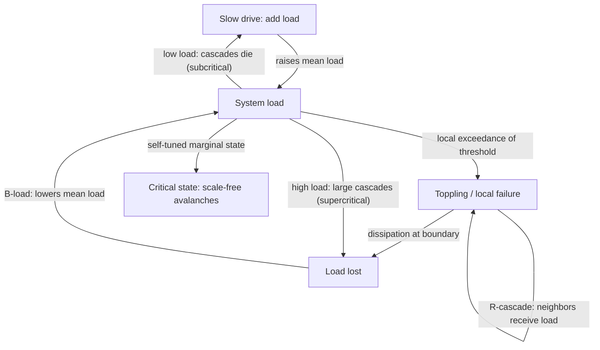

## Self-Organized Criticality and Power-Law Distributions in Conflict Onset


### Scope and Framing

This item covers self-organized criticality (SOC) as a candidate mechanism for the heavy-tailed size distributions observed in armed conflict, the statistical machinery required to establish (or reject) power-law claims, the competing generative mechanisms that produce similar-looking tails, and what a critical-systems view implies for forecasting and intervention design. The stance is diagnostic: a power law is treated as a *hypothesis about mechanism* that must be tested against alternatives, not as a finding that explains itself.

Terms defined on first use and used throughout:

- **Power-law distribution**: a distribution whose tail decays polynomially, $P(X \ge x) \propto x^{-(\alpha - 1)}$ for $x \ge x_{min}$, so that the density is $p(x) \propto x^{-\alpha}$. It is **scale-free** in the sense that $p(bx) = b^{-\alpha}p(x)$: no characteristic event size exists in the scaling region.
- **Heavy-tailed distribution**: a distribution whose tail decays more slowly than any exponential; power laws, log-normals, and stretched exponentials are all heavy-tailed, and only the first is scale-free.
- **Critical point**: a parameter value at which a system undergoes a continuous phase transition, characterized by diverging correlation length and scale-free fluctuations.
- **Self-organized criticality**: the property of a driven, dissipative, spatially extended system that evolves *without parameter tuning* to a critical state, in which perturbations trigger avalanches of all sizes (Bak, Tang, and Wiesenfeld 1987).
- **Avalanche**: a cascade of local events triggered by a single perturbation and terminating when the system relaxes back below the instability threshold.
- **Separation of timescales**: the condition that slow driving (energy input) is much slower than fast relaxation (avalanche dynamics), so that avalanches are effectively instantaneous relative to loading.

Scope discipline: the item concerns size and timing statistics of conflict events and their generative mechanisms. Agent-based rebellion-repression dynamics and network contagion are referenced only as candidate micro-mechanisms that could implement critical dynamics.

---

### 1. Power Laws in Conflict: The Empirical Claims

Several regularities are reported in the quantitative conflict literature. They are listed here as *claims to be tested*, not as settled facts.

| Claim | Source (representative) | Object measured |
| --- | --- | --- |
| Casualty counts of wars follow a power law with exponent near 1.4 to 1.8 | Richardson (1948, 1960); Cederman (2003); Clauset, Young, and Gleditsch (2007) | Battle deaths per war |
| Severity of terrorist attacks follows a power law with exponent near 2.4 to 2.5 | Clauset, Young, and Gleditsch (2007) | Deaths per attack (global data) |
| Insurgent event sizes follow a power law with exponent near 2.5 across conflicts | Bohorquez et al. (2009) | Deaths per attack in Iraq, Colombia, Afghanistan, and others |
| Distribution of war onset times or inter-war intervals is consistent with Poisson or heavy-tailed alternatives, depending on dataset | Cirillo and Taleb (2016, 2020); Cioffi-Revilla and Midlarsky (2004) | Time between conflict onsets |
| Riot and protest sizes are heavy-tailed | Biggs (2005); Bak-Tang style analogies in strike-size data | Participants per event |

[Inference] The reported exponents differ across datasets, definitions (battle deaths versus total deaths, wars versus events), and estimation methods. Bohorquez et al. (2009) propose that a common exponent near 2.5 reflects a universal mechanism (fragmentation and coalescence of insurgent groups), a claim that is contested and depends on data quality and fitting methodology.

**The central caution.** Recall that a heavy tail is not a power law. Log-normal, stretched-exponential, and truncated power-law distributions frequently fit the same empirical data over the finite range available, and many published power-law claims do not survive rigorous testing (Clauset, Shalizi, and Newman 2009; Stumpf and Porter 2012). Sections 3 and 4 treat this in detail.

---

### 2. Self-Organized Criticality: The Mechanism

#### 2.1 The Sandpile Paradigm

The Bak-Tang-Wiesenfeld (BTW) sandpile is the canonical SOC model. On an $L \times L$ lattice, each site $i$ holds an integer height $z_i$:

1. **Drive**: add one grain to a random site: $z_i \to z_i + 1$.
2. **Threshold**: if $z_i \ge z_c$ (typically $z_c = 4$ on a square lattice), the site is unstable.
3. **Relaxation (toppling)**: an unstable site sheds $z_c$ grains, one to each neighbor: $z_i \to z_i - 4$, $z_j \to z_j + 1$ for each neighbor $j$.
4. **Dissipation**: grains leaving the lattice boundary are lost.
5. **Cascade**: repeat toppling until no site is unstable. The number of topplings (or affected sites) is the **avalanche size** $s$.

After a transient, the system reaches a statistically stationary state in which avalanche sizes follow a power law, $P(s) \sim s^{-\tau}$ (up to a finite-size cutoff $s_{max} \sim L^{D}$), without any tuned control parameter. The system is *attracted* to criticality by the interplay of slow drive and fast dissipation.

#### 2.2 The Feedback Structure of SOC

SOC arises from a specific balance of feedback loops, worth stating explicitly.

**Loop B-load (balancing, "relaxation restores stability"):**

Grain load $\uparrow \Rightarrow$ sites exceed threshold $\Rightarrow$ topplings $\Rightarrow$ load redistributes and dissipates at the boundary $\Rightarrow$ load $\downarrow$.

**Loop R-cascade (reinforcing, local):**

A toppling raises neighbors' load $\Rightarrow$ neighbors exceed threshold $\Rightarrow$ further topplings $\Rightarrow$ more load transferred to their neighbors.

**Loop R-drive (slow, load-building):**

Continuous slow driving increases mean load $\Rightarrow$ the system moves toward the state where R-cascade is barely self-sustaining.

The **self-tuning** works as follows. If mean load is too low, cascades die out quickly (subcritical), and slow driving raises the load. If mean load is too high, cascades are large and sweep grains off the boundary, lowering the load. The system therefore hovers at the marginal state where a cascade's expected offspring number is approximately one, the branching-process critical condition (Section 2.4).



#### 2.3 Necessary Ingredients

Conceptually, a system exhibits SOC-type behavior only if it has:

1. **Many interacting units** with local thresholds (nonlinear, threshold-triggered response).
2. **Slow driving** (external loading, e.g., accumulating grievance, resource stress, or arms stockpiles).
3. **Fast, local relaxation** (cascading events).
4. **Dissipation or boundary loss** balancing the drive (release, exhaustion, repression, settlement).
5. **Separation of timescales** between drive and relaxation.
6. **Metastability**: the system persists in a marginally stable configuration rather than relaxing continuously.

These ingredients define what must be *argued for* in any claim that a conflict system is self-organized critical; they are not automatic properties of social systems.

#### 2.4 Branching-Process Criticality

An avalanche can be modeled as a branching process: each failing unit triggers, on average, $m$ further failures. The **branching ratio** $m$ determines regime:

- $m < 1$ (subcritical): avalanches are finite with exponentially decaying size distribution.
- $m = 1$ (critical): avalanche sizes follow $P(s) \sim s^{-3/2}$ in the mean-field (critical Galton-Watson) case, with the mean-field exponent $\tau = 3/2$ and duration exponent 2.
- $m > 1$ (supercritical): a positive probability of unbounded (system-spanning) growth.

SOC can be read as a mechanism for holding $m \approx 1$ *dynamically*. This links the framework to the reproduction-number thresholds of epidemic models, with a crucial difference: in an epidemic model $R_0$ is a fixed parameter and the critical point requires tuning, whereas SOC posits a feedback that restores $m \to 1$ automatically.

---

### 3. Statistical Foundations: What Power-Law Claims Require

#### 3.1 The Continuous Power-Law Model

For $x \ge x_{min}$, the normalized probability density is

$$p(x) = \frac{\alpha - 1}{x_{min}}\left(\frac{x}{x_{min}}\right)^{-\alpha}, \qquad \alpha > 1,$$

with complementary cumulative distribution $P(X \ge x) = (x/x_{min})^{-(\alpha - 1)}$. For discrete data (casualty counts) the normalization uses the Hurwitz zeta function: $p(x) = x^{-\alpha}/\zeta(\alpha, x_{min})$, where $\zeta(\alpha, x_{min}) = \sum_{n=0}^{\infty}(n + x_{min})^{-\alpha}$.

**Moments**: the $m$-th moment exists only if $m < \alpha - 1$. For $\alpha \le 2$ the mean diverges; for $\alpha \le 3$ the variance diverges. Reported conflict exponents near 1.4 to 2.5 therefore imply that means and variances of event sizes are either undefined or unstable in finite samples, which has direct consequences for risk assessment (Section 8).

#### 3.2 Maximum Likelihood Estimation

The maximum likelihood estimator of the exponent, given $n$ observations $x_i \ge x_{min}$, is (continuous case)

$$\hat{\alpha} = 1 + n\left[\sum_{i=1}^{n}\ln\frac{x_i}{x_{min}}\right]^{-1}, \qquad \sigma_{\hat\alpha} = \frac{\hat\alpha - 1}{\sqrt{n}}.$$

**Do not estimate the exponent by least-squares regression on a log-log plot of the histogram or CCDF.** That practice yields biased estimates, misstates uncertainty, and can produce apparently linear plots for non-power-law data (Goldstein, Morris, and Yen 2004; Clauset et al. 2009).

#### 3.3 Choosing $x_{min}$

The lower cutoff $x_{min}$ is itself estimated. The standard approach (Clauset et al. 2009) selects the $x_{min}$ that minimizes the Kolmogorov-Smirnov (KS) distance

$$D = \max_{x \ge x_{min}}\left| S(x) - P(x)\right|$$

between the empirical CDF $S(x)$ of the data above $x_{min}$ and the fitted power-law CDF $P(x)$. The fit is applied only to the tail; the body of the distribution generally follows different physics and is not part of the scaling claim.

#### 3.4 Goodness of Fit

A power-law hypothesis is assessed by a **semi-parametric bootstrap**: (1) fit the model to the data, obtaining $\hat\alpha$, $\hat{x}_{min}$, and the KS statistic $D_{obs}$; (2) generate many synthetic datasets from the fitted model (below $\hat{x}_{min}$ resampling from the empirical body, above it drawing from the fitted power law); (3) refit each synthetic dataset and compute its KS statistic; (4) report

$$p = \Pr\left[D_{synthetic} \ge D_{obs}\right].$$

A small $p$ (Clauset et al. suggest rejecting below 0.1) rejects the power-law hypothesis; a large $p$ means the power law is *not rejected*, which is weaker than confirming it. With small $n$ the test has low power and cannot rule out many alternatives.

#### 3.5 Comparing Against Alternatives

A high goodness-of-fit $p$-value is insufficient; the power law must be compared with plausible alternatives using **likelihood-ratio tests** (Vuong's test for non-nested models). For two models with per-observation log-likelihoods $\ell_i^{(1)}$ and $\ell_i^{(2)}$, the normalized log-likelihood ratio is

$$R = \sum_{i=1}^{n}\left(\ell_i^{(1)} - \ell_i^{(2)}\right), \qquad z = \frac{R}{\sqrt{n}\,\hat\sigma},$$

where $\hat\sigma$ is the sample standard deviation of the pointwise differences. The sign of $R$ indicates which model is favored, and the $p$-value assesses whether the sign is statistically meaningful. Standard alternatives: **exponential**, **log-normal**, **stretched exponential (Weibull)**, and **power law with exponential cutoff**.

| Verdict | Meaning |
| --- | --- |
| Power law favored, alternatives rejected | Strong evidence within the tested set |
| Power law not rejected, alternatives not rejected | Data insufficient to discriminate; do not claim a power law |
| Power law rejected | The tail is not a pure power law |

Empirically, many datasets, including some conflict datasets, fall in the middle category, in which log-normal and truncated power-law fits are statistically indistinguishable from the pure power law over the observed range.

#### 3.6 The Range Problem

Even when a power law is statistically supported, its **dynamic range** matters: scaling over less than about two decades is weak evidence, since many mechanisms produce apparent scaling over such a range. Conflict data typically span limited ranges (event sizes from 1 to a few thousand, or wars from $10^3$ to $10^7$ deaths, with sparse data at the extreme tail). [Inference] Extreme-tail events (the largest wars) are so few that estimates of the tail exponent are dominated by a handful of observations and are sensitive to inclusion or exclusion of individual conflicts.

---

### 4. Competing Generative Mechanisms for Heavy Tails

A power-law tail does not identify SOC as its source. Multiple generative mechanisms produce power laws or near-power laws. This is a structural case of **equifinality**: distinct mechanisms yield indistinguishable aggregate distributions.

| Mechanism | Generative logic | Distinguishing features |
| --- | --- | --- |
| Self-organized criticality | Threshold cascades in a driven, dissipative system self-tune to critical branching | Requires slow drive, threshold units, dissipation; predicts scaling relations among exponents; avalanche shape collapse |
| Preferential attachment / cumulative advantage | Growth proportional to current size yields $P(k) \sim k^{-\gamma}$ (Simon 1955; Barabási and Albert 1999) | Size distribution of entities (group sizes, network degrees), not events per se |
| Multiplicative processes with lower bound | Random multiplicative growth with a reflecting barrier yields power-law tails (Kesten process) | Requires a lower reflecting barrier; exponent set by growth statistics |
| Optimized tolerance (HOT) | Designed systems optimized for typical shocks show power-law failures (Carlson and Doyle 1999) | Tails reflect design trade-offs, not self-tuning; sensitive to design changes |
| Superposition of exponentials | Mixture of exponential scales with heavy-tailed scale distribution | Appears as power law over restricted ranges |
| Log-normal from multiplicative noise | Product of many independent factors gives log-normal, which mimics power laws over 1 to 2 decades | Curvature on log-log plot; needs likelihood comparison |
| Fragmentation and coalescence | Groups merge and split with size-dependent rates; yields $\alpha \approx 2.5$ in the Bohorquez et al. model | Involves group-size dynamics; different micro-assumptions |
| Extreme-value / heavy-tailed exogenous shocks | A heavy-tailed driver (e.g., commodity price, weather) transmits its tail to outcomes | Tail inherited from an external variable; not endogenous |
| Percolation at criticality (tuned) | Occupation probability at threshold yields power-law clusters | Requires parameter tuning; not self-organized |
| Mixing and heterogeneity | Aggregation across heterogeneous populations generates heavy tails without critical dynamics | Depends on the heterogeneity distribution |

Consequence: **matching a tail exponent does not establish SOC.** Additional discriminating evidence includes (a) **exponent scaling relations** that SOC and critical branching predict (for instance, relations linking avalanche size, duration, and shape exponents), (b) **avalanche shape collapse** (rescaled temporal profiles of avalanches of different durations collapsing onto a universal curve), (c) **finite-size scaling** with system size, (d) **absence of characteristic timescale** in event-timing statistics, and (e) micro-level evidence for threshold-cascade dynamics.

---

### 5. Candidate Micro-Mechanisms for Critical Dynamics in Conflict

The SOC framing is only meaningful if a plausible micro-level story maps onto its ingredients (Section 2.3). Candidate mappings, framed as hypotheses:

| SOC ingredient | Candidate conflict analogue | Caveat |
| --- | --- | --- |
| Slow drive | Gradual accumulation of grievance, resource stress, weapons, unresolved disputes, or elite fragmentation | Real drivers are not steady; shocks and regime changes are episodic |
| Threshold units | Individuals, groups, or regions with activation thresholds (Granovetter-type) | Thresholds are unobserved and heterogeneous |
| Local cascade | Contagion of mobilization or retaliation across neighboring units | Requires a plausible transmission channel |
| Dissipation | Arrests, deaths, exhaustion, settlements, displacement, repression | Repression can also reinforce grievance (backlash), altering the balance |
| Timescale separation | Onset of violence is fast relative to grievance accumulation | Violence can itself be prolonged, so timescales overlap |
| Marginal stability | Regimes near a tipping point yet not collapsing | Requires an explanation of why systems sit at the margin |

#### 5.1 Threshold Cascade Models as SOC Instances

Recall that a **threshold model** has each unit adopt a state (here, active in conflict) once the fraction of its neighbors already active crosses a unit-specific threshold. Threshold cascade models on networks or lattices, with slowly driven loading and dissipation, instantiate SOC-like dynamics. In a rebellion-repression agent-based model (grievance, legitimacy, local arrest-risk estimation, activation thresholds), long quiescent periods punctuated by outbreaks of widely varying size are qualitatively SOC-like. [Inference] Whether the outbreak-size distribution in such a model is a genuine power law (versus truncated or log-normal) depends on implementation details and must be tested with the statistical protocol of Section 3, not asserted from visual inspection.

#### 5.2 The Bohorquez et al. Fragmentation-Coalescence Model

Bohorquez et al. (2009) model an insurgent population as groups that coalesce and fragment, with an attack's fatalities proportional to the size of the attacking group. Under a specific coalescence-fragmentation rule the group-size distribution has a power-law tail with exponent about 2.5, which translates into a power-law event-size distribution with the same exponent. This is a **non-SOC generative mechanism** (an aggregation-fragmentation process akin to those in cluster physics) that reproduces the empirical exponent, and it illustrates equifinality: the same tail exponent can arise from a group-size mechanism rather than critical avalanches. [Inference] The model's quantitative agreement across conflicts depends on data-selection choices and on the assumed relation between group size and casualties.

#### 5.3 Exogenous Driving and Inherited Tails

A conflict-size tail may be inherited from a heavy-tailed driver (e.g., population size of affected units, which is itself heavy-tailed; the size distribution of cities, ethnic groups, or states). If event size scales with the size of the affected unit, the tail of event sizes reflects the tail of unit sizes irrespective of any critical dynamics. This must be ruled out by conditioning on unit size (e.g., analyzing per-capita severity) before attributing the tail to endogenous criticality.

---

### 6. Testing for SOC Beyond the Tail Exponent

A defensible SOC claim requires multiple lines of evidence (a "pattern-oriented" approach). A checklist:

1. **Statistical tail test**: power law not rejected, and preferred to log-normal, stretched-exponential, and truncated alternatives via likelihood ratios (Section 3), with reported dynamic range.
2. **Exponent relations**: for avalanche-type systems, the exponents for size $\tau$, duration $\tau_t$, and the scaling of size with duration $\langle s \rangle \sim T^{\gamma}$ should satisfy the crackling-noise relation


   $$\frac{\tau_t - 1}{\tau - 1} = \gamma.$$

   [Inference] This relation has been used as a test of criticality in neuronal, Barkhausen, and seismic systems (Sethna, Dahmen, and Myers 2001; Friedman et al. 2012); its applicability to conflict data depends on defining avalanches (size, duration) unambiguously, which is nontrivial.
3. **Avalanche shape collapse**: average temporal profiles $\langle V(t \mid T)\rangle$ for avalanches of duration $T$ should collapse onto a single scaling function $T^{\gamma - 1} F(t/T)$.
4. **Timing statistics**: for a driven-threshold system, inter-event times often display heavy tails or long-range temporal correlations. The **Omori-type aftershock law** (event rate decaying as $1/(t + c)^{p}$ after a large event) and the **Gutenberg-Richter law** analogues have been investigated in conflict data (e.g., Picoli et al. 2014 on terrorism and war; Johnson et al. on bursts). [Unverified] Reported temporal clustering in conflict is real in several datasets, but attribution to critical dynamics versus self-exciting (Hawkes) processes or exogenous shocks is unresolved.
5. **Finite-size scaling**: the cutoff of the size distribution should scale with the system size as $s_{max} \sim L^{D}$. In social data, defining "system size" (population, area, number of actors) is ambiguous.
6. **Robustness to aggregation and definition**: results should persist under changes to the definition of an "event" (temporal and spatial binning), which SOC systems do not require but which flags definitional artifacts.
7. **Causal micro-evidence**: evidence for threshold behavior and cascades at the micro level (participation decisions conditioned on others' participation), not only aggregate scaling.

[Inference] Few, if any, conflict datasets have been shown to satisfy all seven criteria. The typical state of evidence is a heavy-tailed size distribution consistent with, but not uniquely indicative of, a critical mechanism.

---

### 7. Reference Implementation

The following self-contained Python code (a) simulates a BTW sandpile to generate avalanche-size data, (b) implements the maximum-likelihood power-law fit with KS-based $x_{min}$ selection, and (c) compares the fit against a log-normal alternative by a likelihood ratio. It is written for clarity and uses NumPy and SciPy; specialized libraries (e.g., the `powerlaw` package) implement the full protocol including goodness-of-fit bootstrap and should be preferred for production analyses. Behavior varies with seeds, library versions, and lattice size.

```python
import numpy as np
from scipy import stats

# ---------- (a) BTW sandpile ----------
def sandpile_avalanches(L=50, n_grains=60000, zc=4, seed=0):
    rng = np.random.default_rng(seed)
    z = np.zeros((L, L), dtype=np.int32)
    sizes = []
    for _ in range(n_grains):
        i, j = rng.integers(L), rng.integers(L)
        z[i, j] += 1
        size = 0
        unstable = [(i, j)] if z[i, j] >= zc else []
        while unstable:
            x, y = unstable.pop()
            if z[x, y] < zc:
                continue
            n_top = z[x, y] // zc
            z[x, y] -= n_top * zc
            size += n_top
            for dx, dy in ((1, 0), (-1, 0), (0, 1), (0, -1)):
                nx_, ny_ = x + dx, y + dy
                if 0 <= nx_ < L and 0 <= ny_ < L:      # open boundary: grains lost at edge
                    z[nx_, ny_] += n_top
                    if z[nx_, ny_] >= zc:
                        unstable.append((nx_, ny_))
        if size > 0:
            sizes.append(size)
    return np.array(sizes)

# ---------- (b) Power-law MLE (continuous approximation) with KS-based xmin ----------
def fit_power_law(x, n_candidates=60):
    x = np.sort(np.asarray(x, dtype=float))
    xmins = np.unique(np.quantile(x, np.linspace(0.0, 0.95, n_candidates)))
    best = None
    for xm in xmins:
        tail = x[x >= xm]
        if len(tail) < 50:
            continue
        alpha = 1.0 + len(tail) / np.sum(np.log(tail / xm))
        cdf_emp = np.arange(1, len(tail) + 1) / len(tail)
        cdf_fit = 1.0 - (tail / xm) ** (1.0 - alpha)
        D = np.max(np.abs(cdf_emp - cdf_fit))
        if best is None or D < best["D"]:
            best = {"xmin": xm, "alpha": alpha, "D": D, "n_tail": len(tail),
                    "se": (alpha - 1.0) / np.sqrt(len(tail))}
    return best

# ---------- (c) Likelihood-ratio comparison vs log-normal (tail only) ----------
def loglik_powerlaw(tail, xmin, alpha):
    return np.log((alpha - 1.0) / xmin) - alpha * np.log(tail / xmin)

def loglik_lognormal_truncated(tail, xmin):
    # Fit truncated log-normal (truncated below at xmin) by numerical MLE
    from scipy.optimize import minimize
    lt = np.log(tail)
    def nll(p):
        mu, sig = p[0], np.exp(p[1])
        norm = 1.0 - stats.norm.cdf((np.log(xmin) - mu) / sig)
        ll = stats.norm.logpdf(lt, mu, sig) - lt - np.log(norm + 1e-300)
        return -np.sum(ll)
    res = minimize(nll, x0=[np.mean(lt), np.log(np.std(lt) + 1e-6)], method="Nelder-Mead")
    mu, sig = res.x[0], np.exp(res.x[1])
    norm = 1.0 - stats.norm.cdf((np.log(xmin) - mu) / sig)
    return stats.norm.logpdf(lt, mu, sig) - lt - np.log(norm + 1e-300)

def vuong(tail, xmin, alpha):
    d = loglik_powerlaw(tail, xmin, alpha) - loglik_lognormal_truncated(tail, xmin)
    R = d.sum()
    z = R / (np.sqrt(len(d)) * d.std(ddof=1))
    p = 2.0 * (1.0 - stats.norm.cdf(abs(z)))
    return R, p

sizes = sandpile_avalanches(L=50, n_grains=60000, seed=1)
fit = fit_power_law(sizes)
tail = sizes[sizes >= fit["xmin"]].astype(float)
R, p = vuong(tail, fit["xmin"], fit["alpha"])
print(f"alpha={fit['alpha']:.3f}±{fit['se']:.3f}, xmin={fit['xmin']:.1f}, n_tail={fit['n_tail']}")
print(f"KS D={fit['D']:.3f};  LR (power law - lognormal)={R:.2f}, p={p:.3f}")
```

**Output** (illustrative structure, not real results): an estimated exponent $\hat\alpha$ in the neighborhood reported for two-dimensional BTW sandpiles (approximately 1.1 to 1.3 for topple counts, depending on the size definition and lattice; the literature values vary by definition of size and are not exactly settled), a $\hat{x}_{min}$ above the smallest avalanches, a KS statistic, and a likelihood ratio whose sign and significance indicate whether the power law is preferred to the truncated log-normal.

**Design notes**:

- **Finite-size cutoff**: sandpile distributions have an upper cutoff at $s_{max} \sim L^{D}$; the log-log linear range grows with $L$. A fit that ignores the cutoff biases $\hat\alpha$; test a truncated power law as an alternative.
- **Discrete versus continuous**: avalanche sizes are integers; for small $x_{min}$ the continuous approximation is biased and the discrete estimator with the Hurwitz zeta normalization should be used (as in the `powerlaw` package).
- **Goodness-of-fit bootstrap** (Section 3.4) is omitted for brevity; a real analysis must include it.
- The sandpile uses open boundaries for dissipation; using closed boundaries would prevent stationary dynamics.

---

### 8. Worked Example: Assessing a Power-Law Claim for Conflict Event Sizes

**Setup.** Suppose a dataset of $n = 1200$ conflict events (fatalities per event) from a georeferenced event database, with fatalities ranging from 1 to about 800. Research question: does the event-size distribution support a critical (SOC-type) mechanism?

**Step 1: Fit the tail.** Estimate $\hat{x}_{min}$ by KS minimization and $\hat\alpha$ by MLE. Suppose $\hat{x}_{min} = 9$, $n_{tail} = 210$, and $\hat\alpha = 2.4 \pm 0.1$ (standard error $(\hat\alpha - 1)/\sqrt{n_{tail}} \approx 0.097$).

**Step 2: Check the dynamic range.** The tail covers $x \in [9, 800]$, roughly two decades, which is marginal support for scaling. The effective sample of extreme events (say $x > 200$) may be fewer than 15 observations.

**Step 3: Goodness-of-fit bootstrap.** Generate 1000 synthetic datasets; suppose $p = 0.31$. The power law is *not rejected*.

**Step 4: Compare alternatives.** Vuong tests against (i) exponential: power law strongly favored ($p < 0.01$); (ii) log-normal: $R$ slightly positive, $p = 0.42$ (inconclusive); (iii) truncated power law: truncated form fits marginally better but the improvement is not significant after accounting for the extra parameter ($p = 0.18$).

**Step 5: Interpretation under equifinality.** The data reject the exponential and do not reject the power law, but they do not discriminate power law from log-normal or truncated power law. A power-law tail is *consistent with* SOC, fragmentation-coalescence, and inherited heavy-tailed unit sizes.

**Step 6: Discriminating tests.** (a) Reanalyze per-capita or per-unit severity to test for an inherited tail; (b) test timing statistics for temporal correlation (e.g., Omori-type decay after large events) using a self-exciting point-process baseline; (c) test robustness to event-definition and aggregation changes; (d) compare with the group-size distribution of active armed actors, a direct prediction of the fragmentation-coalescence account; (e) seek micro-level evidence of threshold cascades.

**Conclusion of the example.** The defensible statement is: "the tail is statistically compatible with a power law over about two decades with $\hat\alpha \approx 2.4$; log-normal and truncated alternatives are not excluded; the tail alone does not identify the generating mechanism." Claims of self-organized criticality require the additional evidence of Section 6 and should be labeled as hypotheses when that evidence is absent.

---

### 9. Forecasting and Risk Implications of Heavy Tails

#### 9.1 Moment Divergence and Risk Assessment

With tail exponent $\alpha$, the $m$-th moment converges only for $m < \alpha - 1$. For $\alpha \in (2, 3)$ (a typical reported range), the mean is finite but the variance is infinite. Consequences:

- **Sample means converge slowly**, and sample variances are not meaningful descriptors.
- **Expected-value planning is unstable**: the total burden is dominated by rare, extreme events. For $\alpha < 2$ the mean diverges in the idealized model, and the largest event in a sample of size $n$ scales as $x_{max} \sim n^{1/(\alpha - 1)}$ and carries a non-negligible share of the total.
- **Probability of an event exceeding $x$** given rate $\lambda$ of events above $x_{min}$ is


  $$\lambda\,(x/x_{min})^{-(\alpha - 1)},$$

  which, for the empirical exponent, permits a computation of return periods but with wide parameter-uncertainty bands because the extreme tail is estimated from few observations.

Cirillo and Taleb (2016, 2020) argue that war-casualty data are heavy-tailed enough that variance-based statistical claims about a "long peace" (Pinker 2011) are unreliable, a claim that is itself debated and depends on tail-model choices. [Unverified] The persistence and strength of any declining-violence trend under fat-tailed modeling remains contested in the literature.

#### 9.2 Predictability

In SOC systems, **individual avalanche sizes are unpredictable from initial conditions**: the same perturbation can trigger a negligible or a system-spanning cascade, depending on the microscopic configuration, and no characteristic size exists to forecast. Statistical properties (size distribution, rates) are predictable; individual events are not. [Inference] Where the SOC hypothesis holds, point forecasting of conflict *magnitude* from the trigger event is fundamentally limited, whereas probabilistic risk statements remain feasible.

---

### 10. Peace-Engineering Design Implications

Framed as hypotheses that a critical-systems view lets one explore under its own assumptions, each with the failure mode it targets:

1. **Manage the state variable, not the trigger.** In SOC-type systems the trigger (the last grain) is not the cause of a large avalanche; the accumulated marginal configuration is. Interventions should target the system's proximity to criticality (accumulated stress, connectivity, threshold distribution) rather than searching for and suppressing individual triggers. *Failure mode closed off*: expending effort on "the spark" while the fuel load keeps building.
2. **Prefer frequent small releases to suppression of small events.** Suppressing small avalanches (as in forest-fire management that eliminates small fires) lets load accumulate and can shift the tail toward rarer, larger events (Drossel-Schwabl-type forest-fire models; wildfire management experience). By analogy, suppressing all low-level violence or grievance expression without addressing accumulation may increase the probability of large outbreaks. [Speculation] The analogy is suggestive but the empirical support for this effect in conflict systems is not established, and it must not be read as an argument for tolerating violence.
3. **Add dissipation channels.** In the sandpile, the boundary sets the mean load. Institutional analogues (accessible dispute-resolution mechanisms, credible channels for grievance expression, settlement pathways, decompression valves) function as dissipation that keeps accumulated stress below the level that supports system-spanning cascades. *Failure mode*: a system with load accumulation and no release valve.
4. **Break connectivity between units to lower the effective branching ratio.** Reducing the transmission of mobilization across units (firebreaks: institutional separation of local disputes from regional escalation, mediation at interfaces, information verification to damp rumor cascades) lowers $m$ and truncates cascade size. *Failure mode*: a marginal system in which every local dispute can propagate.
5. **Avoid designs that produce highly optimized-but-brittle stability (HOT).** Systems tuned to withstand typical shocks can concentrate vulnerability in rare, catastrophic failures (Carlson and Doyle). Regimes whose stability rests on a narrow set of guarantees may perform well under routine stress and fail catastrophically under atypical stress. Stress-test institutions against out-of-distribution shocks. *Failure mode*: brittleness that hides until an atypical shock arrives.
6. **Plan for heavy tails.** Because variance may be infinite and extreme events dominate cumulative harm, prevention and preparedness resources should be allocated with reference to tail risk (robustness, insurance-like reserves, surge capacity) rather than to mean or typical event sizes. *Failure mode*: capacity planned to the typical event and overwhelmed by the extreme one.
7. **Do not over-read the power law.** A power-law fit is compatible with several mechanisms with different policy implications: SOC suggests managing accumulated stress and connectivity; fragmentation-coalescence suggests managing group-size dynamics and consolidation of armed actors; inherited tails suggest looking to the exogenous driver. Choosing an intervention on the basis of the tail exponent alone risks addressing the wrong mechanism. *Failure mode*: mechanism misidentification.
8. **Use early-warning cautiously.** Candidate indicators of proximity to criticality include rising variance and autocorrelation of event counts, growth of spatial correlation length among active units, and lengthened recovery after shocks (critical slowing down). [Inference] Such indicators are theoretically motivated for systems near a critical transition; SOC systems that *sit at* criticality do not necessarily show approach-to-criticality signatures, since they are already there. The reliability of these indicators in conflict data is unestablished, false alarms carry costs, and validation must be done per setting.
9. **Communicate uncertainty and scope.** Statements such as "conflict is self-organized critical" should be qualified by the strength of evidence (Section 6), the dynamic range of the fit, the alternatives tested, and the limits of extrapolation to the extreme tail.

---

### 11. Limitations and Critical Assessment

| Limitation | Consequence | Mitigation |
| --- | --- | --- |
| Limited dynamic range and small tail samples | Exponent estimates unstable; alternatives indistinguishable | Report uncertainty; use likelihood-ratio tests; avoid extrapolating beyond data |
| Definition-dependence of "event" and "size" | Exponents and even distribution form change with aggregation | Sensitivity analysis over definitions; per-capita normalization |
| Missing or biased data at extremes and small scales | Under-reporting of small events bends the low end; uncertainty in casualty estimates for large wars | Model the observation process; restrict fit to the reliably observed tail |
| Non-stationarity | Regimes change; a single exponent across eras may be spurious | Sub-period analysis; test for structural breaks |
| Ambiguous system boundaries | Finite-size scaling and avalanche definition are ill-posed | State the unit of analysis; test robustness |
| SOC ingredients not clearly present | Slow drive, dissipation, and timescale separation are asserted rather than demonstrated | Establish each ingredient empirically or model it explicitly |
| Equifinality of heavy-tail mechanisms | Tail alone does not identify mechanism | Multi-criteria testing (Section 6); micro-level evidence |
| Strategic and reflexive actors | Actors adapt to perceived dynamics, so stationarity assumptions fail | Adaptive models; treat estimated distributions as time-limited |
| Publication and selection effects | Positive power-law findings are over-reported | Pre-specified testing protocols; report null results |

Recall that **equifinality** is the situation in which distinct mechanisms produce indistinguishable aggregate outputs. Here it implies that the empirical existence of heavy-tailed conflict sizes, while well supported, is weak evidence for any particular generative mechanism, and that SOC remains one hypothesis among several.

---

### 12. Quick Reference

**Power-law density (continuous)**: $p(x) = \dfrac{\alpha - 1}{x_{min}}\left(\dfrac{x}{x_{min}}\right)^{-\alpha}$, $x \ge x_{min}$

**MLE exponent**: $\hat\alpha = 1 + n\Big[\sum_i \ln(x_i/x_{min})\Big]^{-1}$, with standard error $(\hat\alpha - 1)/\sqrt{n}$

**Moment existence**: the $m$-th moment is finite iff $m < \alpha - 1$

**KS statistic for $x_{min}$ selection**: $D = \max_{x \ge x_{min}}|S(x) - P(x)|$

**Critical branching process**: $m = 1$ gives $P(s) \sim s^{-3/2}$ (mean-field size exponent) and duration exponent 2

**Crackling-noise scaling relation**: $\dfrac{\tau_t - 1}{\tau - 1} = \gamma$, where $\langle s\rangle \sim T^{\gamma}$

**Extreme scaling**: largest of $n$ samples $x_{max} \sim n^{1/(\alpha - 1)}$

**Finite-size cutoff (SOC)**: $s_{max} \sim L^{D}$

**Key Points**

- SOC posits that driven, dissipative, threshold-based systems self-tune to a critical state in which cascades of all sizes occur without parameter tuning; the mechanism rests on slow driving, fast relaxation, dissipation, and timescale separation.
- Power-law claims for conflict require the full statistical protocol: MLE fitting, KS-based $x_{min}$ selection, bootstrap goodness-of-fit, and likelihood-ratio comparison against log-normal, exponential, and truncated alternatives; log-log regression is not valid.
- A power-law tail is compatible with multiple generative mechanisms (SOC, fragmentation-coalescence, preferential attachment, multiplicative processes, inherited heavy-tailed drivers), so the tail alone does not identify SOC; discriminating evidence includes exponent scaling relations, shape collapse, timing statistics, and micro-level cascade evidence.
- With exponents in the reported range, means and variances are unstable and extreme events dominate cumulative harm, which limits point prediction of event size while leaving probabilistic risk assessment feasible.
- Design implications concern managing accumulated stress and connectivity, adding dissipation channels, avoiding brittle optimization, and planning for tail risk, all conditional on which mechanism actually generates the tail.

**Related Topics**

- Statistical testing of power laws: maximum likelihood, KS selection, and Vuong likelihood-ratio tests
- Critical branching processes and crackling-noise scaling relations
- Aggregation-fragmentation models of insurgent group-size dynamics
- Highly optimized tolerance and robust-yet-fragile systems
- Self-exciting (Hawkes) processes versus critical dynamics in event timing
- Early-warning indicators and critical slowing down in social systems
- Forest-fire models and the consequences of suppressing small events
- Extreme value theory and tail-risk planning for rare catastrophic conflicts