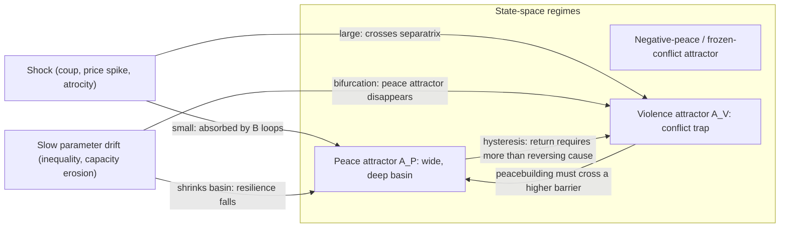
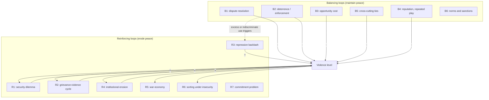

## Complex Adaptive Systems Framing of Peace as a Dynamic Equilibrium


### Scope and Framing

This item covers the treatment of peace not as a static state or the mere absence of violence, but as a *dynamically maintained regime* of a complex adaptive system (CAS): a pattern that persists because feedback processes continuously counteract the perturbations that would dissolve it. The item develops the formal vocabulary (state space, attractors, basins, resilience, stability landscapes), identifies the feedback structures that maintain and erode peace, explains what "equilibrium" can and cannot mean in a non-stationary, adaptive setting, and derives design implications for engineering durable peace. The stance is diagnostic and design-oriented: peace is modeled as a property of interacting systems whose maintenance requires identifiable mechanisms, and whose failure modes can be named and, in principle, closed off.

Terms defined on first use and used throughout:

- **Complex adaptive system (CAS)**: a system composed of many heterogeneous agents whose local interactions and adaptive behavior (learning, imitation, strategic revision) produce emergent aggregate patterns that feed back on agent behavior (Holland 1992; Miller and Page 2007).
- **Emergence**: aggregate structure or behavior that arises from agent interactions and is not deducible from any single agent's properties alone.
- **State space**: the set of all possible configurations of the system's state variables; a trajectory is the path of the system through it.
- **Attractor**: a set of states toward which the system evolves from a neighborhood of initial conditions (a fixed point, limit cycle, or more complex set). Its **basin of attraction** is the set of initial conditions that converge to it.
- **Dynamic equilibrium (steady state, homeostasis)**: a regime in which macro-level variables remain within a bounded range not because nothing changes but because continual flows and corrective feedbacks offset perturbations.
- **Resilience (ecological)**: the magnitude of disturbance a system can absorb and still remain within the same regime, retaining essentially the same structure and function (Holling 1973).
- **Regime shift (critical transition)**: an abrupt, often hard-to-reverse change from one attractor's basin to another, typically when a slowly changing parameter crosses a threshold or a shock exceeds the basin's tolerance (Scheffer et al. 2001, 2009).
- **Positive peace**: the presence of attitudes, institutions, and structures that create and sustain peaceful societies, as opposed to **negative peace**, the mere absence of direct violence (Galtung 1969).

Scope discipline: the item concerns the *conceptual and formal framing* of peace as a dynamic regime and the mechanisms that maintain it. Specific model families (rebellion-repression agent-based models, threshold contagion, spatial evolutionary games, self-organized criticality) are referenced as instantiations of the mechanisms, each restated briefly where used.

---

### 1. Why a Dynamic-Equilibrium Framing

#### 1.1 Limits of the Static View

Treating peace as a static state (an outcome achieved by a settlement and then simply "held") fails on several counts:

| Static assumption | Empirical or structural problem |
| --- | --- |
| Peace is the default; conflict is a deviation requiring explanation | Both regimes require explanation: each is maintained by feedback; in many settings, violence recurs (the "conflict trap", Collier et al. 2003; a substantial share of civil-war onsets follow a recent prior conflict) |
| Settlements are terminal | Peace agreements often fail or erode; durability depends on ongoing implementation, credible commitment, and adaptation to new shocks (Walter 2002; Fortna 2004) |
| Stability means absence of change | Stable societies undergo constant turnover, disputes, and shocks; what persists is the *range* of variation, not stasis |
| Interventions have proportional effects | Nonlinear thresholds, hysteresis, and cascades mean small changes can have large effects and large efforts can fail |
| Actors are passive | Actors adapt to institutions, interventions, and to models of the system itself |

#### 1.2 What "Equilibrium" Means Here, and What It Does Not

The word *equilibrium* is used in at least four distinct technical senses, and conflating them is a persistent source of confusion:

1. **Game-theoretic equilibrium** (Nash equilibrium): a strategy profile from which no agent gains by unilateral deviation. It is an incentive-compatibility statement about behavior at a point in time.
2. **Dynamical fixed point**: a state $x^*$ satisfying $\dot{x} = f(x^*) = 0$. Stable iff perturbations decay.
3. **Homeostatic steady state**: a regime maintained by continual throughput (flows of resources, interactions, and corrections) far from thermodynamic equilibrium.
4. **Stationary distribution**: for a stochastic process, a probability distribution over states that is invariant under the dynamics; the system fluctuates but its statistics are stable.

"Peace as a dynamic equilibrium" is used in senses 2 to 4, and as an *interpretive bridge* to sense 1: a peaceful regime is one in which agents' equilibrium strategies (cooperate, comply, resolve disputes non-violently) are self-enforcing given the institutional environment and others' expected behavior. Two cautions:

- **Equilibrium does not imply optimality or desirability.** A stable regime of coercive, unjust, or exclusionary "peace" is an attractor too; stability and legitimacy are distinct properties.
- **Adaptive systems are rarely at a true equilibrium.** Agents, institutions, and the environment co-evolve, so the "fixed point" itself drifts. The appropriate concept is often a *slowly moving regime* rather than a fixed point. [Inference] Where separation of timescales holds (fast behavioral dynamics relaxing to a quasi-equilibrium set by slowly changing institutions), analyzing a "frozen-parameter" equilibrium is a useful approximation; where it does not, the equilibrium concept can mislead.

---

### 2. Formal Structure: Peace as a Regime in State Space

#### 2.1 State Variables and Dynamics

Represent the system by a state vector $\mathbf{x}(t)$ whose components capture the variables that matter for violence and cooperation, for example:

- $x_1$: level of organized violence (incidence or intensity),
- $x_2$: grievance (perceived deprivation and injustice),
- $x_3$: institutional legitimacy and capacity,
- $x_4$: inter-group trust and cross-cutting ties,
- $x_5$: armed-group capacity (weapons, personnel, cohesion),
- $x_6$: economic opportunity and resilience.

Slowly varying parameters $\boldsymbol{\theta}$ (demographic structure, external patronage, climate stress, terrain) and stochastic shocks $\boldsymbol{\xi}(t)$ enter the dynamics:

$$\dot{\mathbf{x}} = \mathbf{F}(\mathbf{x}; \boldsymbol{\theta}) + \boldsymbol{\xi}(t).$$

This is a schematic, not an estimated model; its use is to organize the reasoning about regimes, feedbacks, and thresholds. The functional form of $\mathbf{F}$ is generally unknown and is the object of modeling and empirical work.

#### 2.2 Regimes as Attractors

Under suitable $\boldsymbol{\theta}$, the system possesses multiple attractors:

- A **peace attractor** $\mathcal{A}_P$: low violence, adequate legitimacy, dense cross-cutting ties.
- A **violence attractor** $\mathcal{A}_V$: sustained conflict (the conflict trap), self-reinforcing through grievance, armed-group entrenchment, and collapse of institutions.
- Possibly **intermediate attractors** (e.g., "negative peace" with suppressed violence but unresolved grievance, or frozen conflict).

The state of the system at any time lies in one of the basins. Peace is *durable* to the extent that (i) $\mathcal{A}_P$ has a wide, deep basin relative to the typical shock magnitude and frequency, and (ii) the boundary (separatrix) between basins is distant from the current state.

#### 2.3 The Stability Landscape Metaphor and Its Limits

A widely used visualization treats the dynamics as motion of a ball on a potential landscape $U(x)$ with $\dot{x} = -\,dU/dx$, where valleys are attractors and ridges are basin boundaries. Resilience corresponds to valley width and depth. Regime shifts occur when a shock pushes the ball over a ridge, or when a slow parameter change *flattens or eliminates* the valley (a bifurcation).

**Limits of the metaphor** (important for honest use):

1. A scalar potential exists only for gradient systems. General social dynamics involve non-gradient forces (cycles, strategic interaction), so a global potential may not exist. [Inference] Where it does not, the "landscape" is a heuristic device, and quantitative claims read off it are unsupported.
2. The landscape is not fixed: adaptation reshapes it (institutions, learning, and interventions change $\mathbf{F}$).
3. It is a low-dimensional projection of a high-dimensional system; real basin boundaries are complex and may be fractal.



---

### 3. Feedback Architecture: What Maintains and What Erodes Peace

Peace persists when *balancing* loops dominate around the peace attractor, and erodes when *reinforcing* loops (vicious cycles) become dominant. Recall that a **balancing feedback loop** counteracts a change (stabilizing), and a **reinforcing feedback loop** amplifies a change (destabilizing or, for virtuous cycles, growth-promoting). The following catalog is organized by function; each entry states variables and causal direction.

#### 3.1 Stabilizing (Balancing) Mechanisms

**B1 - Institutional dispute resolution** (courts, mediation, elections):

Dispute or grievance $\uparrow \Rightarrow$ demand on institutions $\uparrow \Rightarrow$ (if institutions are accessible and perceived as fair) grievance resolved $\Rightarrow$ grievance $\downarrow$.

**B2 - Deterrence and enforcement capacity**:

Violence $\uparrow \Rightarrow$ credible enforcement response $\Rightarrow$ expected cost of violence $\uparrow \Rightarrow$ violence $\downarrow$. (Effective only while enforcement is perceived as legitimate and proportionate; see R3.)

**B3 - Economic opportunity cost**:

Rebellion/violence $\uparrow \Rightarrow$ lost income and trade $\Rightarrow$ opportunity cost of participating in violence $\uparrow$ (relative to peaceful livelihood) $\Rightarrow$ violence $\downarrow$ (Collier and Hoeffler 2004 opportunity-cost argument).

**B4 - Reputation and repeated interaction**:

Defection $\Rightarrow$ loss of reputation and future cooperation $\Rightarrow$ expected long-run payoff of defection $\downarrow$ $\Rightarrow$ defection $\downarrow$ (the folk-theorem logic: cooperation is sustainable when the discount factor $\delta$ exceeds a threshold, e.g. $\delta \ge (T - R)/(T - P)$ for grim-trigger strategies in the prisoner's dilemma).

**B5 - Cross-cutting ties and interdependence**:

Trade, intermarriage, shared institutions link groups $\Rightarrow$ conflict imposes costs on both sides $\Rightarrow$ leaders' incentive to escalate $\downarrow$.

**B6 - Norms and social sanctioning**:

Norm violation $\Rightarrow$ social sanction $\Rightarrow$ violation $\downarrow$; norms are themselves maintained by the ongoing sanctioning behavior of many agents.

#### 3.2 Destabilizing (Reinforcing) Mechanisms

**R1 - Security dilemma spiral** (Herz 1950; Jervis 1978; Posen 1993): recall that a **security dilemma** is a situation in which each side's defensive measures appear threatening to the other, so that actions taken for security reduce everyone's security.

Perceived threat $\uparrow \Rightarrow$ defensive mobilization or arming $\uparrow \Rightarrow$ counterpart's perceived threat $\uparrow \Rightarrow$ counter-mobilization $\uparrow \Rightarrow$ original threat perception $\uparrow$.

**R2 - Grievance-violence cycle**:

Violence $\uparrow \Rightarrow$ casualties, displacement, and desire for retribution $\Rightarrow$ grievance $\uparrow \Rightarrow$ recruitment and willingness to fight $\uparrow \Rightarrow$ violence $\uparrow$.

**R3 - Repression backlash**:

Indiscriminate repression $\uparrow \Rightarrow$ legitimacy $\downarrow \Rightarrow$ grievance $\uparrow \Rightarrow$ opposition activity $\uparrow \Rightarrow$ repression $\uparrow$.

**R4 - Institutional erosion**:

Violence $\uparrow \Rightarrow$ state capacity and tax base erode, institutions captured or destroyed $\Rightarrow$ dispute-resolution capacity $\downarrow$ $\Rightarrow$ unresolved disputes $\uparrow \Rightarrow$ violence $\uparrow$.

**R5 - War economy entrenchment**:

Violence $\Rightarrow$ predatory revenue streams (looting, illicit trade) $\Rightarrow$ armed groups' material interest in continued conflict $\uparrow \Rightarrow$ violence sustained ("spoiler" dynamics; Stedman 1997). Recall that a **spoiler** is an actor who perceives peace as threatening its power or interests and acts to undermine it.

**R6 - Sorting and segregation under insecurity**:

Violence $\Rightarrow$ flight to co-ethnic areas $\Rightarrow$ homogeneous enclaves and hardened boundaries $\Rightarrow$ intergroup contact $\downarrow$, mobilization and targeting feasibility $\uparrow \Rightarrow$ violence $\uparrow$.

**R7 - Commitment-problem trap** (Fearon 1995; Walter 1997): recall that a **commitment problem** arises when parties cannot credibly promise to honor a settlement in the future, especially when disarmament shifts the balance of power. Anticipating exploitation, parties refuse or defect from settlements $\Rightarrow$ conflict continues or resumes.

**R8 - Impunity and expectation of violence**:

Unpunished violence $\Rightarrow$ expected cost of violence $\downarrow$ $\Rightarrow$ violence $\uparrow$; also, expectation that others will attack makes preemptive violence rational (a self-fulfilling prophecy; see the ethnic security dilemma).

#### 3.3 The Net-Balance Criterion

Whether peace is a stable attractor depends on the *net loop gain* around the peace state. A minimal linearized statement: in a neighborhood of the peace fixed point $\mathbf{x}^*_P$, write $\dot{\boldsymbol{\delta}} = \mathbf{J}\boldsymbol{\delta}$ with Jacobian $\mathbf{J} = \partial \mathbf{F}/\partial \mathbf{x}|_{\mathbf{x}^*_P}$. The regime is locally stable iff all eigenvalues of $\mathbf{J}$ have negative real parts. Balancing loops contribute negative diagonal or stabilizing terms; reinforcing loops contribute positive feedback that can push an eigenvalue's real part above zero. The **stability margin** $-\max_i \operatorname{Re}\lambda_i(\mathbf{J})$ measures how quickly perturbations decay and, in a noisy system, how far the state fluctuates. A shrinking margin is a warning sign (Section 5).



---

### 4. Resilience, Adaptive Capacity, and the Structure of Robustness

#### 4.1 Resilience Concepts

Distinguish three notions (Folke 2006; Walker et al. 2004):

| Concept | Meaning | Peace analogue |
| --- | --- | --- |
| **Engineering resilience** | Speed of return to equilibrium after a small perturbation ($\sim 1/|\operatorname{Re}\lambda_{max}|$) | How quickly a society recovers from a riot or election dispute |
| **Ecological resilience** | Magnitude of disturbance absorbed before shifting regime (basin size) | How large a shock (economic collapse, atrocity, coup) the society can take without descent into civil war |
| **Adaptive/transformative capacity** | Ability to reorganize, learn, and change structure while retaining function, or to transform into a new, more desirable regime | Ability of institutions to reform in response to changing conditions rather than break or ossify |

A system can have high engineering resilience but low ecological resilience (rapid recovery from small shocks yet a narrow basin), and vice versa. Peacebuilding aims mainly at ecological and adaptive resilience.

#### 4.2 Requisite Variety and Redundancy

Drawing on Ashby's law of requisite variety (the variety of a controller must match the variety of disturbances it must regulate), robust peace requires **diverse and redundant regulatory mechanisms**: multiple independent channels for grievance redress, multiple overlapping institutions, and distributed authority, so that failure of one does not remove the regulatory capacity. [Inference] Concentration of all conflict-management capacity in a single institution or individual creates a single point of failure.

**Modularity trade-off**: modular structure (communities, regions with semi-autonomous institutions) contains failures locally (limiting cascade size) but, if modularity aligns with ethnic or ideological cleavages, hardens intergroup boundaries and undermines cross-cutting ties. The design question is *what the modules are aligned to*.

#### 4.3 Robust-Yet-Fragile Structure

Systems optimized for typical conditions can be highly efficient yet catastrophically fragile to atypical shocks (Carlson and Doyle 1999, highly optimized tolerance). A regime whose stability rests on a narrow set of guarantees (a single strongman, a single external patron, a single commodity revenue stream) may appear very stable until an out-of-distribution shock removes the guarantee. Stability observed over a calm period is therefore weak evidence of resilience.

#### 4.4 Adaptive Capacity and the Adaptive Cycle

The adaptive cycle heuristic (Holling and Gunderson 2002) describes systems moving through phases of growth, conservation (increasing efficiency and rigidity), release (collapse), and reorganization. Peace regimes may drift into a rigid conservation phase (institutions ossified, elites entrenched, reform blocked), with high apparent stability but low adaptive capacity and high vulnerability to release. [Speculation] This framing has been applied heuristically to political systems; its predictive validity for conflict onset is not established, and it should be used as a conceptual lens, not a forecasting model.

---

### 5. Tipping Points, Hysteresis, and Early-Warning Signals

#### 5.1 Bifurcation and Hysteresis

Consider a canonical one-dimensional model of a system with two stable states, the normal form of a fold (saddle-node) bifurcation:

$$\dot{x} = -x^{3} + x + \mu,$$

where $x$ is a state variable (say, a violence-propensity index) and $\mu$ a slowly varying control parameter (say, accumulated stress or eroded institutional capacity). For $|\mu| < 2/(3\sqrt{3}) \approx 0.385$ there are two stable states (and an unstable one between them); at $|\mu| = 2/(3\sqrt{3})$ one stable state disappears in a fold bifurcation. **Hysteresis**: as $\mu$ increases the system stays in the low-$x$ state until the fold, then jumps to the high-$x$ state; reversing $\mu$ does *not* return the system at the same value, since the high-$x$ state persists until $\mu$ falls to the opposite fold. Consequences:

- **Prevention is cheaper than cure**: restoring the pre-collapse parameter value is insufficient to restore peace; conditions must be pushed much further.
- **Gradual change can produce abrupt outcomes**: a slowly eroding parameter yields no visible warning in the mean until the fold is reached.
- **Path dependence**: the regime the system is in depends on history, not only on current parameter values.

[Inference] Whether real conflict systems have this fold structure is a modeling hypothesis; the model demonstrates how hysteresis and abrupt transition *can* arise from smooth dynamics, not that they do in any particular case.

#### 5.2 Critical Slowing Down

Near a fold bifurcation the dominant eigenvalue $\lambda \to 0^-$, so the system's recovery rate from perturbations vanishes. Linearizing near the stable state, $\dot{\delta} = \lambda\,\delta + \sigma\,\xi(t)$ (an Ornstein-Uhlenbeck process), gives stationary statistics

$$\operatorname{Var}(\delta) = \frac{\sigma^2}{2|\lambda|}, \qquad \rho_1 = \operatorname{corr}\big(\delta(t), \delta(t + \Delta t)\big) = e^{-|\lambda|\Delta t}.$$

As $|\lambda| \to 0$, both variance and lag-1 autocorrelation rise. These are the **generic early-warning signals** of critical transitions (Scheffer et al. 2009; Dakos et al. 2012): rising variance, rising autocorrelation, and lengthening recovery times after small perturbations, possibly with increased skewness and flickering between states.

**Caveats for social systems** (all essential):

1. **Requires a slow approach to a bifurcation.** Transitions driven by abrupt exogenous shocks (a coup, an assassination, a sudden external intervention) that exceed the basin boundary show no critical slowing down (noise-induced or shock-induced tipping).
2. **Requires adequate data**: high-frequency, long, stationary series of a well-chosen state variable; conflict data are sparse, noisy, reported with bias, and non-stationary.
3. **False positives and negatives**: variance and autocorrelation can rise for reasons unrelated to bifurcation (changes in reporting, shifts in exogenous drivers, trends); absence of signals does not imply safety. Detrending choices and window sizes materially affect results.
4. **Alarm costs**: warnings in a policy context have costs (self-fulfilling escalation, false-alarm fatigue); indicators should be treated as inputs to structured assessment, not triggers.
5. **Fit to SOC systems**: systems that self-organize to criticality already sit at the critical state and need not show approach-to-criticality signals. Recall that in **self-organized criticality** a driven, dissipative system self-tunes to a marginal state producing avalanches of all sizes.

[Unverified] Empirical evidence for critical slowing down as a reliable predictor of political or conflict transitions is limited and mixed; treat the framework as hypothesis-generating.

#### 5.3 Complementary Indicators

Beyond generic signals, mechanism-specific indicators follow from the feedback structure (Section 3): rising fraction of population near activation threshold (threshold-model view), growth in cross-group hostility or segregation indices, decline in cross-cutting economic ties, erosion of state capacity and dispute-resolution throughput, growth of armed-group cohesion, and rising rate of unresolved grievances. Indicators tied to specific loops are more interpretable than generic statistical signals.

---

### 6. Agent-Level Foundations: Adaptation and Emergence

A CAS framing requires that macro-level regimes be linked to micro-level adaptive behavior.

#### 6.1 Adaptive Agents

Agents revise behavior by learning and imitation, and their strategy revision is coupled to the aggregate state. In evolutionary game terms, the population's strategy distribution evolves via selection-like dynamics (imitation of higher-payoff strategies) such as replicator dynamics $\dot{x}_i = x_i(\pi_i - \bar\pi)$, where $x_i$ is the frequency of strategy $i$ and $\pi_i$ its expected payoff. Recall that in a well-mixed population playing a prisoner's dilemma, defection is the sole evolutionarily stable strategy. Cooperation (and hence peace) is sustained only by mechanisms that alter the effective payoff structure or interaction structure (repeated interaction, reputation, network reciprocity, punishment, group selection), which correspond to the balancing loops B4, B5, B6 above.

#### 6.2 Multiple Equilibria in Coordination Structure

Many peace-relevant interactions have coordination-game structure (stag hunt): both "all cooperate/comply" and "all defect/prey" are self-enforcing. With payoff matrix rows $(R, S; T, P)$ and $R > T > P > S$, the mixed-strategy unstable equilibrium at cooperator frequency

$$x^{\dagger} = \frac{P - S}{(R - T) + (P - S)}$$

is the basin boundary: if the population's cooperator fraction exceeds $x^{\dagger}$, imitation dynamics drive it to full cooperation; below it, to full defection. **Peace-engineering relevance**: (i) the basin boundary $x^{\dagger}$ can be lowered by increasing the payoff to mutual cooperation $R$ or reducing the sucker's loss (raising $S$, e.g., via guarantees), widening the peace basin; (ii) expectations matter: a shared belief that others will cooperate can move the population across the boundary, so **credible signals and focal points** are levers (Schelling 1960). Behavior of this kind underlies the shifts between "high-trust" and "low-trust" social equilibria.

#### 6.3 Emergence and Downward Causation

Macro-level structures (institutions, norms, identity categories, expectations) emerge from micro-level interactions and, once established, constrain and shape micro-level behavior (downward causation or "slaving"). This two-way coupling is why regimes are self-reinforcing: an established norm of non-violence shapes individual expectations, which in turn reproduces the norm. It is also why regimes are hard to change: intervening at one level produces adaptive responses at the other.

#### 6.4 Mapping to Agent-Based Models

Recall that **agent-based models (ABMs)** simulate heterogeneous agents following local rules to study emergent aggregates. The peace-as-dynamic-equilibrium framing translates directly into ABM experiments: initialize a population, apply local rules for grievance, risk perception, imitation, and network updating, and study which parameter regions yield persistent low-violence regimes, which yield conflict, and where the boundary and hysteresis lie. In threshold-based rebellion models, for instance, legitimacy raises a structural stability bound (a region of parameter space in which activation is impossible), while cop density acts through step-like deterrence; the resulting regimes (suppressed, punctuated, sustained) are the model-specific analogues of the attractors above.

---

### 7. Reference Implementation

The following self-contained Python code implements a minimal three-variable stylized system (violence $v$, grievance $g$, institutional capacity $c$) with balancing and reinforcing loops, and uses it to demonstrate (a) bistability, (b) hysteresis under slow parameter drift, and (c) early-warning statistics (rolling variance and lag-1 autocorrelation) preceding a transition. The model is a **teaching device**, not an empirical model; the functional forms and parameters are illustrative assumptions. Behavior varies with parameters, integration step, and seeds.

```python
import numpy as np

def drift(state, stress, p):
    """Stylized dynamics. v: violence, g: grievance, c: institutional capacity, all in [0,1]."""
    v, g, c = state
    # Violence: fed by grievance (reinforcing, self-amplifying), suppressed by capacity (balancing)
    dv = p["a_gv"] * g * (1 + p["k_v"] * v) * (1 - v) - p["b_cv"] * c * v - p["d_v"] * v
    # Grievance: raised by violence and external stress, lowered by capacity (redress)
    dg = p["a_vg"] * v * (1 - g) + stress * (1 - g) - p["b_cg"] * c * g - p["d_g"] * g
    # Capacity: eroded by violence (reinforcing loop), rebuilt slowly toward baseline
    dc = -p["e_vc"] * v * c + p["r_c"] * (p["c0"] - c)
    return np.array([dv, dg, dc])

P = dict(a_gv=1.4, k_v=1.5, b_cv=1.2, d_v=0.2,
         a_vg=0.6, b_cg=0.9, d_g=0.1,
         e_vc=0.9, r_c=0.05, c0=0.8)

def integrate(stress_path, x0, dt=0.05, noise=0.0, seed=0):
    rng = np.random.default_rng(seed)
    x = np.array(x0, dtype=float)
    out = np.empty((len(stress_path), 3))
    for t, s in enumerate(stress_path):
        x = x + dt * drift(x, s, P) + noise * np.sqrt(dt) * rng.standard_normal(3)
        x = np.clip(x, 0.0, 1.0)
        out[t] = x
    return out

# (a)/(b) Hysteresis: slowly ramp stress up, then back down; record violence
T = 20000
ramp_up = np.linspace(0.0, 0.6, T // 2)
ramp_down = np.linspace(0.6, 0.0, T // 2)
path = np.concatenate([ramp_up, ramp_down])
traj = integrate(path, x0=[0.02, 0.05, 0.8], noise=0.0)
v_up, v_down = traj[: T // 2, 0], traj[T // 2 :, 0]
# Compare violence at the same stress on the way up and on the way down
for s_target in (0.1, 0.2, 0.3, 0.4):
    i_up = int(np.argmin(np.abs(ramp_up - s_target)))
    i_dn = int(np.argmin(np.abs(ramp_down - s_target)))
    print(f"stress={s_target:.2f}  v(up)={v_up[i_up]:.3f}  v(down)={v_down[i_dn]:.3f}")

# (c) Early-warning statistics on a noisy slow ramp
def rolling_stats(x, w):
    var, ac1 = [], []
    for i in range(w, len(x)):
        seg = x[i - w:i]
        seg = seg - np.polyval(np.polyfit(np.arange(w), seg, 1), np.arange(w))  # detrend
        var.append(seg.var())
        ac1.append(np.corrcoef(seg[:-1], seg[1:])[0, 1])
    return np.array(var), np.array(ac1)

ramp = np.linspace(0.0, 0.5, 30000)
noisy = integrate(ramp, x0=[0.02, 0.05, 0.8], noise=0.02, seed=3)
var, ac1 = rolling_stats(noisy[:, 0], w=1500)
print("Rolling variance: start %.5f -> end %.5f" % (var[0], var[-1]))
print("Rolling lag-1 autocorr: start %.3f -> end %.3f" % (ac1[0], ac1[-1]))
```

**Output** (illustrative structure, not real results): in the hysteresis test, for intermediate stress values the violence level on the descending ramp remains elevated relative to the ascending ramp (the system stays in the high-violence state even after stress falls below the level at which the transition occurred); in the early-warning test, rolling variance and lag-1 autocorrelation of $v$ tend to rise as the stress ramp approaches the transition. Whether the parameter choices above actually produce bistability depends on the loop gains; adjust `a_gv`, `k_v`, `b_cv`, and `e_vc` and verify by scanning stress with fixed initial conditions from both branches. If bistability is absent, the hysteresis printout will show equal values on both branches, which is itself an informative diagnostic.

**Design notes**:

- **Detrending window and rolling window length** strongly affect early-warning statistics; report sensitivity to both, and compare against surrogate (shuffled or trend-matched) series to assess false-alarm rates.
- **Noise structure** matters: state-dependent (multiplicative) noise, colored noise, and observational noise each change the statistics.
- **Bifurcation analysis**: for a more rigorous analysis, compute equilibria over a grid of `stress` values by root-finding from multiple initial conditions and plot the equilibrium branches; libraries such as AUTO or PyDSTool or a simple continuation scheme do this systematically.

---

### 8. Worked Example: Reading a Peace Settlement as a Dynamic Regime

**Setup.** A post-settlement society is modeled with four aggregated state variables: violence $v$, grievance $g$, institutional capacity $c$, and inter-group trust $\tau$. The settlement (a power-sharing agreement, partial disarmament) has moved the system from the violence attractor toward the peace basin. The question: is the peace durable?

**Step 1: Identify the active loops.**

- Balancing: B1 (new dispute-resolution bodies), B3 (economic recovery raising opportunity cost), B5 (trade ties).
- Reinforcing (threats): R7 (commitment problem: disarmed side fears exploitation), R5 (war-economy spoilers), R4 (weak capacity), R2 (unresolved grievances from wartime atrocities).

**Step 2: Assess net loop gains qualitatively.** Loop dominance depends on measurable quantities: capacity of dispute-resolution bodies relative to the volume of disputes (B1), the share of armed-group income from illicit sources (R5), the credibility of third-party guarantees (R7), and the fraction of the population with outstanding grievances (R2).

**Step 3: Locate the system relative to the separatrix.** Approximate distance to the basin boundary by counting how many independent regulatory mechanisms are functioning and how large a shock would be needed to disable enough of them. Post-settlement periods are known to be high-risk (the first years after a civil war have elevated recurrence risk; Walter 2004 and Collier et al. 2008 report substantial recurrence rates), consistent with a *shallow basin*: the system is only just inside the peace regime.

**Step 4: Identify the critical mechanism for the commitment problem (R7).** Recall that a commitment problem arises when parties cannot credibly promise future compliance. The reinforcing loop is closed off by **third-party guarantees** (peacekeepers, external enforcement) that alter the cost of defection, and by **institutional design** that reduces the winner-take-all stakes (power-sharing, federalism, security-sector integration). Empirical work finds that credible third-party security guarantees are associated with more durable settlements (Walter 2002; Fortna 2008). [Inference] Such associations are difficult to interpret causally, since peacekeepers are deployed selectively to hard cases and to cases where parties are already inclined to peace; the design implication relies on the mechanism, not solely on the correlation.

**Step 5: Predict how the regime responds to shocks.**

- **Small shock** (isolated attack, local dispute): absorbed if B1 and B2 are functioning; engineering resilience matters.
- **Large shock** (assassination of a leader, electoral fraud, atrocity): may push the state across the separatrix through R1 (security dilemma spiral) and R2 (retribution cycles), especially if segregation and armed-group capacity persist. The relevant question is not whether shocks will occur (they will) but whether regulatory capacity scales with shock size.
- **Slow drift** (economic decline, demographic pressure, erosion of external support): lowers the stability margin; monitor early-warning indicators and loop-specific indicators.

**Step 6: Design for adaptive capacity.** Rather than freezing the settlement, build *renegotiation mechanisms* (scheduled review, constitutional amendment pathways, arbitration) so that the institutional structure can adapt as conditions change, avoiding the ossification-then-collapse pattern.

**Conclusion of the example**: durable peace is assessed as a property of the balance of feedback loops, the width of the basin, and adaptive capacity, and not of the settlement document alone. The diagnostic question shifts from "was an agreement signed?" to "which loops are maintaining the peace regime, how robust are they to shocks, and can they adapt?"

---

### 9. Policy Levers as Interventions on System Structure

The CAS framing organizes interventions by *what they change* in the system, using an adaptation of Meadows' leverage-point hierarchy (Meadows 1999), from weakest to strongest leverage:

| Leverage level | Intervention type | Peace-engineering example |
| --- | --- | --- |
| Parameters (weak) | Adjust quantities within existing structure | Raise police budgets; change aid volumes |
| Buffers and stock sizes | Change reserves that absorb shocks | Food and fiscal reserves; reconciliation funds |
| Physical structure | Change layout of connections | Infrastructure linking regions; integrated schools and markets |
| Delays | Change timing of feedback | Faster grievance-redress response; rapid information verification to shorten rumor cycles |
| Balancing loop strength | Strengthen corrective feedback | Independent courts; accessible mediation; early-response mechanisms |
| Reinforcing loop gain | Weaken vicious cycles | Break the security dilemma with transparency and verification; reduce impunity; demobilize spoilers' revenue |
| Information flows | Alter who knows what | Independent monitoring, transparent reporting, fact-checking |
| Rules of the system | Incentives, constraints, rights | Electoral rules, power-sharing, property and return rights |
| Self-organization capacity | Ability to add or change structure | Adaptive institutions with renegotiation pathways |
| Goals and paradigm | Shared aims and mindsets | Norms of non-violence and inclusion; narrative change |

[Inference] Higher-leverage interventions tend to be harder to implement and slower to show effects; lower-leverage parametric changes are easier but often yield transient improvement because the underlying loops reassert themselves ("policy resistance", Sterman 2000). The framework supplies a vocabulary for diagnosing *why* an intervention fails: it acted on a parameter while the dominant reinforcing loop remained intact.

---

### 10. Limitations and Critical Assessment

| Limitation | Consequence | Mitigation |
| --- | --- | --- |
| **Metaphor drift**: terms such as attractor, tipping point, and resilience are used loosely | Claims become unfalsifiable narratives | Specify state variables, dynamics, and empirical indicators; distinguish metaphor from model |
| **Unfalsifiability of "everything is a feedback loop"** | A framework that can explain any outcome explains none | Make loop claims testable: state variables, signs, timescales, and observable predictions |
| **Non-stationarity and adaptation to being modeled** | Estimated dynamics change once actors respond (Lucas-critique analog) | Adaptive models; treat parameters as time-limited; robustness checks |
| **Measurement**: key variables (grievance, legitimacy, trust) are latent and poorly measured | Model calibration and indicator construction are weak | Multi-source measurement; sensitivity analysis; pattern-oriented validation |
| **Equifinality**: multiple mechanisms produce the same aggregate pattern | Cannot infer mechanism from outcome | Discriminating tests; process-level evidence |
| **Early-warning unreliability** | False alarms and misses; no established predictive validity in conflict | Use as hypothesis-generating; report false-alarm rates; combine with mechanism-specific indicators |
| **Normative ambiguity**: stability is not justice | Design toward durable but illegitimate or oppressive order | Explicitly include legitimacy, inclusion, and rights as state variables and objectives |
| **Scale and level ambiguity** | Mechanisms differ across individual, community, state, and system levels | Specify the level of analysis; multi-level models |
| **Determinism of the language** | "Attractor" can suggest inevitability | Emphasize stochasticity, agency, and contingency |

Recall that **equifinality** is the property that distinct mechanisms or parameter sets can produce indistinguishable aggregate outputs. Here it implies that observing a stable peaceful period does not identify *which* balancing loops sustain it, nor whether the basin is wide or narrow: the resilience of a regime is revealed only under stress, which is precisely when the information is most costly to obtain. This motivates simulation-based stress-testing and comparative case analysis to probe basin structure indirectly.

---

### 11. Peace-Engineering Design Implications

Framed as design hypotheses under the framework's own assumptions, with the failure mode each targets:

1. **Design for the basin, not the point.** Aim to widen and deepen the peace basin (raise the magnitude of shock the system can absorb) rather than to hit a target state. Practical proxies: number of independent, functioning regulatory mechanisms; slack in institutional capacity; diversity of cross-cutting ties. *Failure mode closed off*: peace that holds only under calm conditions.
2. **Build redundancy and requisite variety in conflict-management capacity.** Multiple independent channels (formal courts, customary mediation, ombudsmen, civil-society monitors, international backstops) so that no single failure disables regulation. *Failure mode*: single-point-of-failure regimes.
3. **Weaken the reinforcing loops explicitly.** Identify which vicious cycles are active (security dilemma, grievance-violence, repression backlash, war economy, commitment problem, sorting) and target their gain: transparency and verification for R1; transitional justice, redress, and prevention of retaliation for R2; discriminating, accountable security practices for R3; capacity rebuilding for R4; interdiction of illicit revenue and reintegration for R5; integration and shared spaces for R6; guarantees and phased implementation for R7. *Failure mode*: strengthening balancing mechanisms while a dominant reinforcing loop remains untouched.
4. **Keep enforcement legitimate and proportionate.** Deterrence (B2) stabilizes only while it does not trigger backlash (R3). Design enforcement with accountability, discrimination between combatants and civilians, and transparency. *Failure mode*: stabilizing measures that manufacture the grievance they were meant to suppress.
5. **Institutionalize adaptability.** Include review and renegotiation mechanisms, sunset clauses, and reform pathways so structures can change with conditions, preventing the ossification-to-collapse pattern. *Failure mode*: brittle agreements optimized for the conditions of signing.
6. **Prioritize prevention over restoration because of hysteresis.** If violence regimes are self-sustaining once entrenched, the cost of restoring peace exceeds the cost of preventing its loss. Invest in monitoring and early response while the system is still inside the peace basin. *Failure mode*: waiting for unambiguous crisis, after the separatrix is crossed.
7. **Use early-warning cautiously and multi-modally.** Combine generic statistical signals (variance, autocorrelation, recovery time) with mechanism-specific indicators (near-threshold populations, segregation, capacity erosion), pre-specify response protocols, and account for alarm costs. *Failure mode*: false confidence from a single indicator or paralysis from false alarms.
8. **Attend to timing and delays.** Reinforcing loops in conflict can operate faster than institutional responses (rumor cascades within hours; institutional reform over years). Shorten response delays for the fast loops (verification, rapid mediation) and address the slow loops through structural investment. *Failure mode*: correct interventions that arrive too late relative to the loop they target.
9. **Include legitimacy and inclusion as objectives, not only stability.** A regime that is stable through exclusion or coercion has a different, and typically more brittle, basin structure (repression-backlash loop) and normatively different properties. *Failure mode*: engineering a stable but illegitimate order.
10. **Stress-test with simulation and comparative evidence.** Because basin width is revealed only under stress, use agent-based and system-dynamics models, scenario exercises, and cross-case comparison to probe shock tolerance under stated assumptions, reporting results as conditional hypotheses. *Failure mode*: inferring resilience from an untested stretch of quiet.
11. **Communicate uncertainty and scope.** Frame outputs as structural hypotheses conditioned on assumptions about loops, parameters, and data quality, not as forecasts about particular countries.

---

### 12. Quick Reference

**CAS regime dynamics (schematic)**: $\dot{\mathbf{x}} = \mathbf{F}(\mathbf{x};\boldsymbol\theta) + \boldsymbol\xi(t)$; peace regime = attractor $\mathcal{A}_P$ with basin $\mathcal{B}_P$

**Local stability**: stable iff all eigenvalues of $\mathbf{J} = \partial\mathbf{F}/\partial\mathbf{x}|_{\mathbf{x}^*}$ have $\operatorname{Re}\lambda < 0$; stability margin $= -\max\operatorname{Re}\lambda$

**Fold-bifurcation normal form**: $\dot{x} = -x^3 + x + \mu$; bistable for $|\mu| < 2/(3\sqrt3)$; hysteresis on reversal

**Critical slowing down (OU near bifurcation)**: $\operatorname{Var}(\delta) = \sigma^2/(2|\lambda|)$, $\rho_1 = e^{-|\lambda|\Delta t}$; both rise as $|\lambda|\to0$

**Repeated-game cooperation condition (grim trigger, PD)**: $\delta \ge (T - R)/(T - P)$

**Stag-hunt basin boundary**: $x^\dagger = \dfrac{P - S}{(R - T) + (P - S)}$; lowering $x^\dagger$ widens the cooperation basin

**Replicator dynamics**: $\dot{x}_i = x_i(\pi_i - \bar\pi)$; in a well-mixed prisoner's dilemma defection is the sole ESS

**Key Points**

- Peace is modeled as a dynamically maintained regime (an attractor with a basin) sustained by balancing feedback loops, not as a static outcome; equilibrium here means a homeostatic or quasi-stationary regime, distinct from Nash equilibrium, and stability is distinct from legitimacy or desirability.
- Regime durability depends on basin width and depth relative to shocks, the net balance of stabilizing and destabilizing loops, redundancy of regulatory mechanisms, and adaptive capacity.
- Nonlinear features (thresholds, hysteresis, cascades, bistability) imply that gradual erosion can precede abrupt collapse, that restoration is harder than prevention, and that observed calm is weak evidence of resilience.
- Generic early-warning signals (rising variance and autocorrelation, lengthening recovery) are theoretically motivated near bifurcations but empirically unreliable in conflict data and inapplicable to shock-driven transitions; mechanism-specific indicators complement them.
- The framework is most valuable as a diagnostic vocabulary that organizes interventions by which loops and structures they change; its main risks are metaphor drift, unfalsifiability, and over-reading of stability.

**Related Topics**

- Bifurcation analysis, hysteresis, and tipping-point detection in social systems
- Ecological and social-ecological resilience (Holling, Folke, Walker)
- System dynamics modeling and leverage points for conflict systems (Meadows, Sterman)
- Early-warning indicators and critical slowing down: validation and false-alarm analysis
- Commitment problems, third-party guarantees, and settlement durability
- Evolutionary game models of cooperation and equilibrium selection in coordination games
- Adaptive institutions, renegotiation design, and constitutional flexibility
- Positive peace indices and measurement of institutional and social resilience