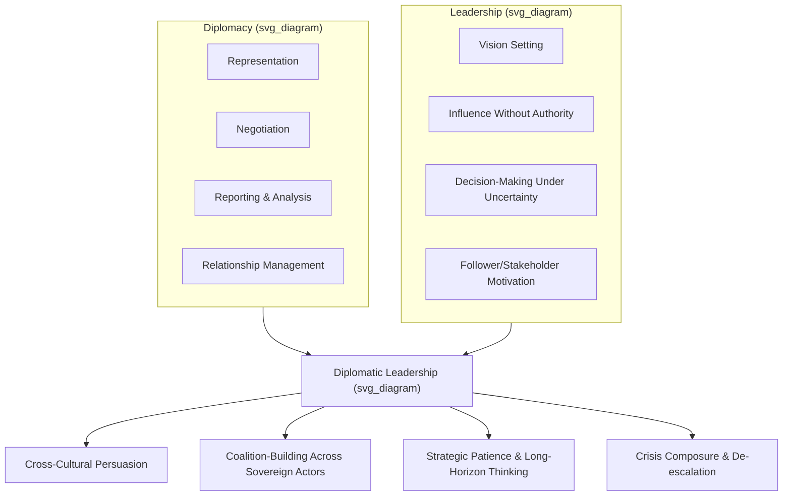

## Defining Diplomacy, Leadership, and Their Intersection

### Overview

This topic establishes the conceptual foundation for the study of diplomatic leadership by defining its two constituent domains — diplomacy and leadership — as distinct fields of practice and theory, then examining the analytical and practical space where they converge. Diplomatic leadership is treated here not as a simple sum of the two, but as a distinct competency with its own logic, constraints, and skill requirements.

### Defining Diplomacy

**Key Points**

- Diplomacy is commonly defined as the conduct of relations between states, or between states and other international actors, through peaceful means — negotiation, representation, and communication — rather than through force.
- Classical definitions (e.g., Sir Ernest Satow's formulation) describe diplomacy as the application of intelligence and tact to the conduct of official relations between governments.
- Modern definitions expand this to include non-state actors: international organizations, NGOs, multinational corporations, and sub-national governments increasingly conduct diplomacy-like activity.
- Diplomacy operates across several recognized modes:
  - **Bilateral diplomacy** — relations between two states.
  - **Multilateral diplomacy** — relations conducted through or within international institutions (UN, WTO, regional bodies).
  - **Track I diplomacy** — official, government-to-government engagement.
  - **Track II diplomacy** — unofficial engagement by non-governmental actors, academics, or former officials, often used to explore options where official channels are constrained.
  - **Public diplomacy** — engagement aimed at foreign publics rather than governments, intended to shape perception and build long-term relationships.
- Core functions of diplomacy, as traditionally enumerated, include representation, negotiation, reporting/information-gathering, protection of nationals and interests abroad, and the promotion of friendly relations.

Diplomacy's defining characteristic is that it is a **process-oriented discipline**: it is less about achieving a single fixed outcome than about managing an ongoing relationship in which future interactions are anticipated and factored into present conduct.

### Defining Leadership

**Key Points**

- Leadership, in the general organizational and political-science literature, is most often defined as the process of influencing a group or individuals toward the achievement of goals.
- Major theoretical traditions relevant to this topic include:
  - **Trait theory** — leadership as a function of stable individual characteristics (e.g., decisiveness, integrity, emotional stability).
  - **Behavioral theory** — leadership as a set of observable actions and styles (task-oriented vs. relationship-oriented behaviors).
  - **Situational/contingency theory** — effective leadership style depends on context, follower readiness, and task structure.
  - **Transformational leadership** — leaders articulate a vision and inspire followers to transcend self-interest for a collective goal; closely associated with the work of James MacGregor Burns and later Bernard Bass.
  - **Servant leadership** — leadership as an act oriented primarily toward the needs of followers and stakeholders rather than the leader's own authority.
- A distinction commonly drawn in the literature is between **leadership** (setting direction, inspiring change) and **management** (planning, organizing, controlling to achieve existing objectives) — diplomatic leadership draws on both but leans more heavily on the former.

[Inference] The relative weighting of these leadership traditions in diplomatic contexts (e.g., whether transformational or servant models are more descriptively accurate of successful diplomats) is not settled in the literature and varies by scholarly tradition and case selection.

### The Intersection: Diplomatic Leadership as a Distinct Competency

**Key Points**

- Diplomatic leadership refers to the exercise of influence and direction-setting within contexts defined by diplomatic constraints: sovereign equality of parties, absence of a common enforcement authority, high stakes for miscalculation, and the need to preserve relationships beyond any single negotiation.
- This differs from leadership in a conventional organizational hierarchy in several structural ways:
  - **No formal authority over counterparts.** A diplomat cannot command a foreign government; influence must be achieved through persuasion, incentive structuring, coalition-building, and credibility rather than positional power.
  - **Dual accountability.** Diplomatic leaders typically answer both to a domestic principal (a government, ministry, or electorate) and must manage relationships with external parties who have no obligation to that principal.
  - **High ambiguity and incomplete information.** Diplomatic settings often involve deliberate information asymmetry, requiring leadership decisions under greater uncertainty than typical organizational leadership.
  - **Symbolic and representational weight.** A diplomatic leader's conduct is frequently read as representative of an entire nation or institution, raising the reputational stakes of individual behavior.
- Scholars (e.g., in the tradition of works by Berridge, or the many practitioner memoirs analyzed in diplomatic studies) frequently identify a recurring set of competencies at this intersection:
  - **Negotiation and persuasion** under conditions of formal equality between parties.
  - **Cross-cultural fluency** — the ability to read and adapt to differing norms of communication, hierarchy, and face-saving.
  - **Strategic patience** — willingness to sustain long time horizons for outcomes, contrasted with leadership models built around short feedback cycles.
  - **Coalition and consensus-building** across parties with divergent interests and no shared chain of command.
  - **Crisis composure** — maintaining measured, de-escalatory conduct under conditions of high political stakes.

### Comparative Framing

| Dimension | Conventional Organizational Leadership | Diplomatic Leadership |
| --- | --- | --- |
| Source of authority | Positional/hierarchical | Relational/persuasive |
| Accountability structure | Single chain of command | Dual (domestic principal + external parties) |
| Time horizon | Often quarterly/annual cycles | Often multi-year to generational |
| Failure mode | Missed targets, turnover | Escalation, breakdown of relations, reputational damage to the state |
| Core currency | Authority, incentive control | Trust, credibility, reciprocity |

### Illustration: Conceptual Map of the Intersection

### Example

A career diplomat leading a multilateral climate negotiation delegation must: (1) represent a national position (diplomacy's representational function), (2) build a coalition of otherwise unaligned states around a shared framework (leadership's coalition-building function), (3) do so without any formal authority over the other delegations, and (4) sustain the relationship across multiple negotiating rounds spanning years, since today's counterpart is tomorrow's counterpart again. This composite task cannot be fully explained by either diplomatic theory or leadership theory alone — it requires their intersection.

### Conclusion

Diplomacy supplies the *setting and constraints* (sovereign equality, peaceful means, relationship continuity), while leadership theory supplies the *behavioral and motivational mechanisms* (influence, vision, decision-making under uncertainty). Diplomatic leadership as a field studies how these mechanisms must be adapted — often substantially — to function inside diplomacy's distinctive constraints, particularly the absence of formal hierarchical authority over the parties being led or persuaded.

**Related Topics**

- Historical evolution of diplomatic practice (Westphalian to contemporary systems)
- Track I vs. Track II diplomacy in practice
- Theories of negotiation (distributive vs. integrative bargaining)
- Transformational vs. transactional leadership in international contexts
- Soft power and its role in diplomatic influence
- Ethics and accountability structures in diplomatic conduct
- Cross-cultural competence frameworks for international negotiators