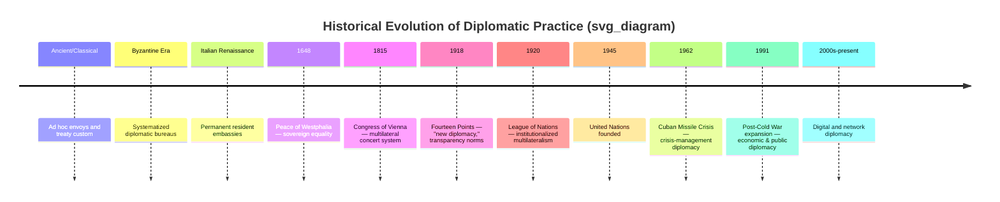

## Historical Evolution of Diplomatic Practice

### Overview

Diplomatic practice has evolved through several recognizable eras, each shaped by shifts in political organization, communication technology, and the prevailing theory of international order. This overview traces that evolution from ancient inter-polity relations through the Westphalian system to contemporary digital and network diplomacy, highlighting the institutional and normative changes at each stage.

### Ancient and Classical Precursors

**Key Points**

- Diplomatic practice predates the modern state system by millennia. Evidence of formalized inter-polity relations exists from Mesopotamia (e.g., the Amarna letters, c. 14th century BCE, documenting correspondence between Egyptian pharaohs and Near Eastern rulers).
- Ancient Greek city-states developed the *proxenos* system, an early form of consular representation in which a citizen of one city-state represented the interests of another.
- The Roman Empire relied heavily on treaty-making (*foedera*) and formalized rules for receiving foreign envoys, alongside a body of custom governing the inviolability of ambassadors.
- Byzantine diplomacy (5th–15th century CE) is frequently cited as the first systematized diplomatic service, employing dedicated bureaus, ceremonial protocol, intelligence-gathering, and strategic use of marriage alliances and tribute to manage relations with numerous neighboring powers.
- [Unverified] The extent to which Byzantine practices were directly transmitted to, versus independently rediscovered by, later Italian city-states remains debated among historians.

### The Italian City-States and the Birth of Resident Embassies

**Key Points**

- The Italian Renaissance (roughly 15th century) is widely credited with the emergence of **permanent resident embassies**, as opposed to the earlier practice of dispatching temporary, single-purpose envoys.
- City-states such as Milan, Venice, and Florence, in close proximity and frequent rivalry, found it advantageous to maintain continuous representation abroad for intelligence-gathering and ongoing negotiation.
- This period also produced early diplomatic theory, notably Niccolò Machiavelli's writings (though primarily political rather than diplomatic treatises) and later, more explicitly diplomatic manuals.
- Venice in particular developed a sophisticated ambassadorial reporting system (*relazioni*), in which returning ambassadors delivered detailed formal reports to the Senate — an early institutionalization of diplomatic reporting as a function distinct from negotiation.

### The Peace of Westphalia and the State-Centric System

**Key Points**

- The **Peace of Westphalia (1648)**, ending the Thirty Years' War, is conventionally treated as the foundational moment of the modern state system, though historians increasingly caveat this as a simplification.
- Westphalia is credited with establishing, or at least crystallizing, the principles of:
  - **Sovereign equality** of states regardless of size or power.
  - **Non-interference** in the internal affairs of other states.
  - **Territorial integrity** as a governing norm.
- These principles became the normative bedrock on which subsequent diplomatic practice — bilateral treaty-making, formal recognition of governments, and reciprocal immunity of envoys — was built.
- [Inference] Many diplomatic historians now argue the "Westphalian myth" overstates the abruptness of this transition, noting that elements of sovereign-state diplomacy developed gradually both before and after 1648; it remains, however, the standard periodization marker in most diplomacy curricula.

### The Congress System and Classical Diplomacy (18th–19th Century)

**Key Points**

- The **Congress of Vienna (1814–1815)**, following the Napoleonic Wars, established a template for multilateral great-power diplomacy aimed at maintaining a balance of power and managing systemic crises collectively rather than unilaterally.
- This period saw the codification of diplomatic ranks and precedence (formalized at Vienna and refined at the 1818 Congress of Aix-la-Chapelle), reducing disputes over ceremonial status between envoys.
- "Classical diplomacy" of this era was characterized by:
  - Secrecy of negotiations, with outcomes disclosed only after agreement.
  - A small, aristocratic diplomatic corps operating with substantial personal discretion.
  - Slow communication (weeks to months), granting resident ambassadors significant autonomous decision-making authority.
- The **Concert of Europe**, the informal system of great-power consultation that followed Vienna, functioned as an early precursor to institutionalized multilateral diplomacy.

### The World Wars and the Shift to "New Diplomacy"

**Key Points**

- World War I is widely treated as a turning point discrediting "old" secret, aristocratic diplomacy, which critics (notably U.S. President Woodrow Wilson) blamed in part for the war's onset via secret alliance commitments.
- Wilson's **Fourteen Points (1918)**, particularly the call for "open covenants of peace, openly arrived at," articulated a normative shift toward transparency, self-determination, and multilateral institutions.
- The **League of Nations (1920–1946)** represented the first major attempt at permanent, institutionalized multilateral diplomacy with collective security aims, though it is generally assessed as having failed to prevent World War II due to structural weaknesses (lack of enforcement mechanism, non-universal membership, notably the absence of the United States).
- The interwar period also saw accelerating technological change (telephone, telegraph, later radio) that began compressing decision timelines and reducing the autonomy of resident ambassadors relative to their home capitals — a trend that has continued ever since.

### The Cold War Era

**Key Points**

- Post-1945 diplomacy was structured heavily around the bipolar US–Soviet rivalry, giving rise to distinctive practices:
  - **Summit diplomacy** — direct, high-visibility meetings between heads of state/government, exemplified by US–Soviet summits.
  - **Crisis management diplomacy** — most notably during the Cuban Missile Crisis (1962), which prompted institutional innovations such as the Moscow–Washington "hotline" to reduce miscommunication risk during crises.
  - **Alliance diplomacy** — formalized through structures like NATO and the Warsaw Pact, requiring sustained multilateral coordination among bloc members.
- The establishment of the **United Nations (1945)** institutionalized multilateral diplomacy on a near-universal scale, with the Security Council formalizing great-power privilege via the veto.
- **Track II diplomacy** emerged more formally during this period as scholars and former officials sought unofficial channels to explore de-escalation options unavailable to official Track I actors constrained by Cold War politics.

### Post-Cold War and Contemporary Diplomacy

**Key Points**

- The end of the Cold War (1989–1991) prompted expansion of multilateral diplomatic activity, including growth in UN peacekeeping mandates, regional integration projects (notably the European Union's deepening), and proliferation of new state actors following Soviet dissolution.
- Diplomacy in this period increasingly incorporates:
  - **Economic diplomacy** — trade negotiation and economic statecraft gaining parity with traditional security diplomacy, reflected in institutions like the WTO (est. 1995).
  - **Public diplomacy** — deliberate engagement with foreign publics, accelerated by global media.
  - **Digital/Twitter diplomacy** — the use of social media platforms by heads of state and foreign ministries for real-time public statements, materially compressing the traditional gap between private negotiation and public messaging.
  - **Non-state actor diplomacy** — NGOs, multinational corporations, and city/sub-national governments (**paradiplomacy**) conducting diplomacy-adjacent activity outside traditional state channels.
- [Inference] Scholars differ on whether digital and network diplomacy represent a fundamental paradigm shift or an incremental extension of "new diplomacy" trends already underway since the early 20th century; this remains an active debate rather than a settled classification.

### Comparative Timeline

| Era | Approx. Period | Defining Feature |
| --- | --- | --- |
| Ancient/Classical | to 5th c. CE | Ad hoc envoys, ceremonial protocol, treaty custom |
| Byzantine | 5th–15th c. | Systematized diplomatic bureaucracy |
| Italian Renaissance | 15th c. | Permanent resident embassies |
| Westphalian | 1648 onward | Sovereign equality, non-interference norms |
| Congress System | 1815–1914 | Multilateral great-power management, secrecy |
| New Diplomacy | 1918–1945 | Transparency norms, early institutionalized multilateralism |
| Cold War | 1945–1991 | Bipolar summit/crisis/alliance diplomacy |
| Contemporary | 1991–present | Economic, public, digital, and non-state diplomacy |

### Illustration: Evolutionary Timeline

### Conclusion

The historical trajectory of diplomatic practice shows a consistent pattern: each major shift has been driven by changes in political structure (from city-states to sovereign nations to multilateral institutions), communication technology (compressing decision timelines and ambassadorial autonomy), and prevailing normative expectations (from secrecy toward transparency, and from purely state-centric toward multi-stakeholder engagement). Contemporary diplomatic leadership operates at the tail end of this trajectory, requiring competencies — rapid public communication, multi-stakeholder coordination, economic literacy — that would have been unrecognizable to a Congress-era diplomat.

**Related Topics**

- The Peace of Westphalia and sovereignty theory in depth
- Congress of Vienna and balance-of-power diplomacy
- League of Nations institutional failure analysis
- Cold War crisis management case studies (Cuban Missile Crisis)
- Rise of economic and trade diplomacy
- Digital diplomacy and social media statecraft
- Paradiplomacy and non-state diplomatic actors