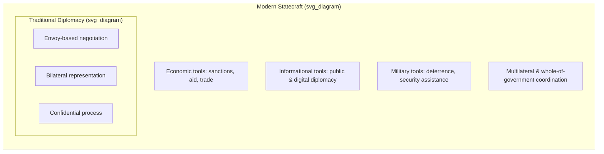

## Traditional Diplomacy Versus Modern Statecraft

### Overview

This topic contrasts "traditional" diplomacy — the classical, state-centric, envoy-based model that dominated from the Westphalian era through the mid-20th century — with "modern statecraft," the broader, multi-instrument, multi-actor approach to advancing national interests that has developed since. The comparison clarifies what has genuinely changed in method and scope versus what continuities persist beneath surface-level differences.

### Defining Traditional Diplomacy

**Key Points**

- Traditional diplomacy refers to the classical model of state-to-state engagement conducted primarily through accredited envoys and formal negotiation, generally associated with the period from the Congress of Vienna (1815) through the early-to-mid 20th century.
- Core characteristics:
  - **Bilateral primacy** — negotiation was overwhelmingly conducted state-to-state rather than through standing multilateral institutions.
  - **State monopoly on representation** — the ministry of foreign affairs and its accredited ambassadors were the near-exclusive channel for official external engagement.
  - **Confidentiality by default** — negotiations were conducted privately, with outcomes disclosed only upon conclusion (a norm later criticized by Wilsonian "new diplomacy," discussed under the historical-evolution topic).
  - **Slow, autonomous execution** — limited communication technology granted resident envoys significant discretionary authority, since real-time consultation with the home capital was impractical.
  - **Security and territorial focus** — the primary subject matter was war, peace, alliance, and territorial adjustment, with economic and cultural matters treated as secondary.
  - **Formal ceremonial protocol** — precedence, credentialing, and ritual (as codified at Vienna) carried substantial procedural weight.

### Defining Modern Statecraft

**Key Points**

- "Statecraft" is the broader term, encompassing the full range of instruments a state (or state-like actor) uses to pursue its interests internationally — of which traditional diplomacy is one component, not the whole.
- Modern statecraft typically integrates:
  - **Diplomatic instruments** — negotiation, representation, coalition-building (the traditional core, now conducted multilaterally as often as bilaterally).
  - **Economic instruments** — trade policy, sanctions, foreign aid, investment screening, and economic coercion/inducement.
  - **Informational instruments** — public diplomacy, strategic communications, and (in adversarial contexts) disinformation and influence operations.
  - **Military instruments** — deterrence posture, military aid, and the credible threat or use of force as a backdrop to diplomatic engagement.
- This is frequently summarized in policy literature via the **DIME framework** (Diplomatic, Informational, Military, Economic), a heuristic used in national security planning to describe the integrated toolkit of statecraft.
- Modern statecraft is also characterized by an expanded set of actors beyond the foreign ministry: defense and commerce departments, intelligence services, central banks, and — increasingly — non-state actors (multinational corporations, NGOs) that states must coordinate with or route influence through.

### Core Points of Contrast

| Dimension | Traditional Diplomacy | Modern Statecraft |
| --- | --- | --- |
| Primary actor | Foreign ministry / ambassador | Whole-of-government (foreign, defense, commerce, intelligence) |
| Instrument scope | Negotiation and representation | Diplomatic + economic + informational + military (DIME) |
| Venue | Predominantly bilateral | Bilateral and multilateral, often simultaneously |
| Transparency norm | Confidential until concluded | Mixed; public diplomacy and real-time media coexist with private channels |
| Communication speed | Weeks (autonomous envoy discretion) | Real-time (centralized capital control, reduced envoy autonomy) |
| Subject matter | Security, territory, alliance | Security, trade, technology, climate, public health, cyber |
| Non-state role | Minimal to none | Substantial (corporations, NGOs, sub-national governments) |
| Time horizon of tools | Negotiation and treaty | Negotiation, sanctions, aid conditionality, information campaigns, deterrence — often used in combination |

### Continuities Beneath the Contrast

**Key Points**

- Despite these differences, several core diplomatic functions persist unchanged across both models:
  - **Representation** — a state or entity must still be formally represented to others.
  - **Negotiation under sovereign equality** — the absence of a common enforcement authority between sovereign parties remains structurally constant.
  - **Reporting and analysis** — accurate assessment of a counterpart's intentions and constraints remains central to both eras.
  - **Relationship continuity** — the expectation that today's counterpart is tomorrow's counterpart still governs conduct, discouraging purely transactional behavior even in the modern, instrument-heavy model.
- [Inference] Much of the diplomacy-versus-statecraft literature frames this less as a strict historical succession (traditional diplomacy "ending" and statecraft "beginning") and more as an expansion: statecraft subsumes traditional diplomacy as one tool among several, rather than replacing it.

### Illustration: Statecraft as an Expanded Toolkit

### Example

A contemporary trade dispute illustrates the integration: a foreign ministry may conduct traditional bilateral negotiation (diplomatic instrument) while the finance/commerce ministry simultaneously threatens or applies tariffs (economic instrument), state media and social accounts frame the dispute for domestic and foreign publics (informational instrument), and defense cooperation with the counterpart is quietly reviewed as leverage (military-adjacent instrument). A purely traditional diplomat operating with only the negotiation tool would be structurally under-equipped to manage this scenario alone — illustrating why modern statecraft requires broader, cross-agency leadership competencies than classical diplomatic training alone provided.

### Implications for Diplomatic Leadership

**Key Points**

- Leaders operating in the modern statecraft environment must, beyond classical negotiation skill, develop:
  - **Cross-agency coordination competence** — synchronizing diplomatic messaging with economic and security actions taken by other parts of government.
  - **Media and information literacy** — managing real-time public narrative alongside private negotiation, a tension largely absent from the traditional confidential model.
  - **Economic and technical literacy** — trade, sanctions regimes, and technology policy now require domain knowledge beyond classical diplomatic training.
  - **Tolerance for reduced autonomy** — modern communication technology has significantly compressed the discretionary latitude once granted to resident diplomats, requiring leaders to operate effectively under closer real-time oversight from capitals.

### Conclusion

Traditional diplomacy and modern statecraft are best understood not as opposing paradigms but as a relationship of subset to superset: traditional diplomacy's core functions (representation, negotiation, reporting, relationship management) remain embedded within modern statecraft, which has expanded the toolkit to include economic, informational, and military instruments deployed in coordination. Effective diplomatic leadership today therefore requires both mastery of classical diplomatic skill and fluency in this broader, multi-instrument, whole-of-government environment.

**Related Topics**

- The DIME framework in national security planning
- Economic statecraft: sanctions and trade policy as diplomatic tools
- Public and digital diplomacy in the information age
- Coercive diplomacy and the role of military instruments
- Whole-of-government coordination structures in foreign policy
- Multilateral institution-based diplomacy vs. bilateral channels