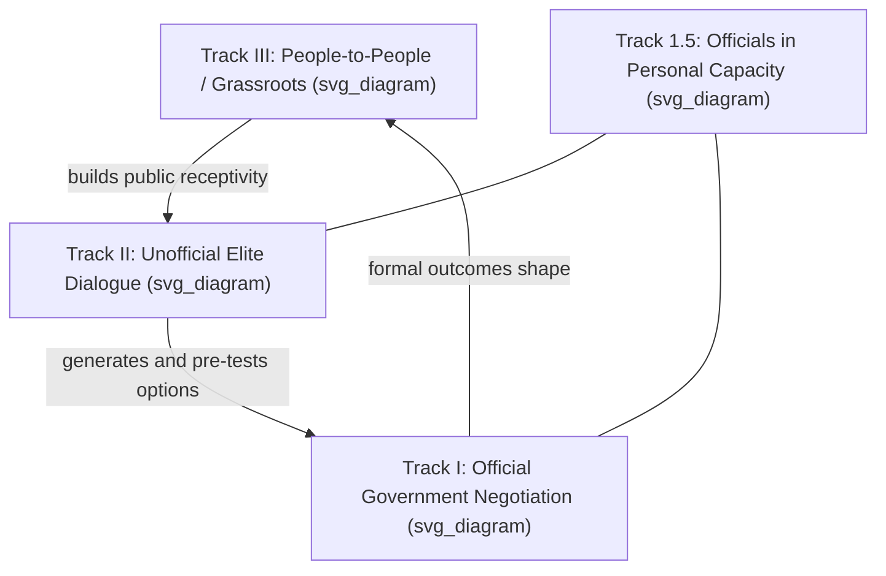

## Track I, Track II, and Track III Diplomacy

### Overview

The "track" framework classifies diplomatic and peacebuilding activity by who conducts it and with what degree of official authority. Originally a two-track distinction, the model has expanded in the conflict-resolution literature to include a third track and, in some formulations, further subdivisions (Track 1.5, multi-track diplomacy). This topic defines each track, its typical actors and methods, and how they interact in practice.

### Track I Diplomacy

**Key Points**

- Track I diplomacy is official, government-to-government engagement conducted by accredited representatives of the state: heads of state/government, foreign ministers, ambassadors, and other authorized officials.
- Defining characteristics:
  - **Formal authority** — participants can commit their governments to binding agreements.
  - **Institutional channels** — conducted through embassies, foreign ministries, and formal multilateral bodies (UN, regional organizations).
  - **Accountability** — Track I actors are accountable through official government chains of command and, ultimately, to domestic political processes.
  - **Legal weight** — outcomes (treaties, formal agreements, communiqués) carry legal or quasi-legal standing.
- Track I is the domain of "traditional diplomacy" as classically defined: accredited envoys, formal negotiation, and government-sanctioned outcomes.
- Limitations: Track I is often constrained by domestic political pressures, the need for public positioning, lack of trust between adversarial governments, or situations where formal recognition of the other party is itself politically contentious (e.g., engaging a non-recognized government or a non-state armed group).

### Track II Diplomacy

**Key Points**

- The term "Track II diplomacy" was coined by U.S. diplomat Joseph Montville in 1981, describing unofficial, informal interaction between members of adversary groups aimed at conflict resolution, generally facilitated by non-governmental actors.
- Typical participants: retired officials, academics, think-tank experts, religious leaders, and other individuals with credibility and access but no current formal negotiating authority.
- Defining characteristics:
  - **Unofficial status** — participants cannot bind their governments, which grants greater flexibility to explore options, test ideas, and speak candidly without formal political consequence ("deniability").
  - **Confidentiality and informality** — often conducted in off-the-record workshops, dialogues, or problem-solving exercises.
  - **Function** — primarily used to build mutual understanding, generate options, humanize the adversary, and pre-negotiate ideas that can later be formally adopted through Track I channels once politically viable.
- Track II is particularly valuable in protracted or intractable conflicts where formal government contact is politically impossible or has broken down entirely, allowing a channel for ideas to circulate without either side's government being seen to negotiate directly.
- A frequently cited example in the literature is the set of unofficial Israeli-Palestinian dialogues that contributed to the groundwork for the 1993 Oslo Accords, where academics and former officials met informally before formal Track I negotiations were politically feasible. [Unverified — specific causal contribution of any single Track II process to a Track I outcome is difficult to establish with certainty and is debated among conflict-resolution scholars.]

### Track III Diplomacy (People-to-People / Grassroots Diplomacy)

**Key Points**

- Track III, sometimes called "people-to-people diplomacy" or grassroots diplomacy, refers to engagement conducted by ordinary citizens, civil society organizations, and community-level actors, without the specific conflict-resolution training or elite access characteristic of Track II.
- Typical participants: NGOs, religious congregations, sports and cultural exchange programs, student exchanges, diaspora communities, and grassroots activists.
- Defining characteristics:
  - **Broad-based participation** — engages a wider, less specialized population than Track II's expert-driven model.
  - **Long time horizon** — aims to build durable, bottom-up relationships and mutual understanding across societies over years or generations, rather than to generate specific negotiating options in the near term.
  - **Indirect political effect** — Track III activity is not typically designed to directly influence a specific negotiation, but to shift underlying public attitudes and social capital that make formal reconciliation more sustainable over time.
- Examples commonly cited include sister-city programs, youth exchange initiatives, interfaith dialogue networks, and sports diplomacy (e.g., "ping-pong diplomacy" between the US and China in the early 1970s, though that specific case is sometimes classified as a hybrid Track I/III event given its state-orchestrated nature).

### Extensions to the Basic Model

**Key Points**

- The three-track model has been further elaborated in the peacebuilding literature:
  - **Track 1.5 diplomacy** — hybrid engagement in which official (Track I) representatives participate but in an unofficial or personal capacity, blending formal access with Track II informality.
  - **Multi-track diplomacy** — a framework proposed by Louise Diamond and John McDonald (Institute for Multi-Track Diplomacy) expanding the model to nine interacting "tracks," including business, media, training/education, activism, religion, funding, and public opinion, alongside government and professional conflict resolution.
- [Inference] The proliferation of these sub-classifications reflects an underlying scholarly consensus that conflict resolution and diplomacy are rarely single-channel processes; the "tracks" terminology is best understood as a descriptive heuristic for coordination analysis rather than a strict operational taxonomy with hard boundaries.

### Comparative Summary

| Dimension | Track I | Track II | Track III |
| --- | --- | --- | --- |
| Actors | Government officials, accredited diplomats | Former officials, academics, experts | Civil society, ordinary citizens, NGOs |
| Authority to bind | Yes | No | No |
| Typical setting | Formal negotiation, treaty-making | Off-record workshops, dialogues | Exchanges, community programs |
| Primary function | Binding agreement, formal representation | Option generation, trust-building among elites | Long-term attitude change, social capital |
| Time horizon | Negotiation-cycle | Months to years | Years to generations |
| Accountability | Formal government chain | Personal/institutional credibility | Diffuse, civil-society based |

### Illustration: Track Interaction Model

### Example

In a protracted interstate conflict where formal recognition prevents Track I contact, a Track II workshop convening retired generals and academics from both sides might develop a confidence-building framework (e.g., a phased troop withdrawal concept). If this framework gains informal traction, a Track 1.5 channel — current officials attending "in a personal capacity" — may test its political viability. Only once sufficient domestic political cover exists does the idea migrate into formal Track I negotiation. Simultaneously, Track III initiatives such as joint economic zones or student exchanges build the underlying public tolerance that makes any eventual formal agreement politically sustainable.

### Implications for Diplomatic Leadership

**Key Points**

- Effective diplomatic leaders must understand which track is appropriate to a given stage of a relationship or conflict, and how to sequence or coordinate across tracks rather than treating them as substitutes.
- Leadership within Track II/III contexts requires different skills than Track I: facilitation and convening skill often matter more than formal negotiating authority, and credibility is personally rather than institutionally derived.
- A common leadership failure mode is treating Track II or III engagement as either irrelevant "soft" activity or, conversely, as a substitute for necessary Track I action — both misread the tracks' complementary rather than competitive relationship.

### Conclusion

The track framework provides a vocabulary for distinguishing formal, binding state-to-state engagement (Track I) from unofficial elite dialogue aimed at generating options and trust (Track II) and broad-based, long-horizon societal engagement (Track III). In practice these tracks are interdependent rather than sequential in any strict sense, and diplomatic leadership frequently involves coordinating activity across multiple tracks simultaneously, particularly in protracted or politically sensitive conflicts where Track I access alone is insufficient.

**Related Topics**

- Multi-track diplomacy (Diamond–McDonald nine-track model)
- Conflict resolution theory and confidence-building measures
- Public diplomacy versus Track III grassroots engagement
- Case study: Oslo Accords Track II precursors
- Sports and cultural diplomacy as Track III instruments
- Track 1.5 diplomacy in contemporary crisis mediation