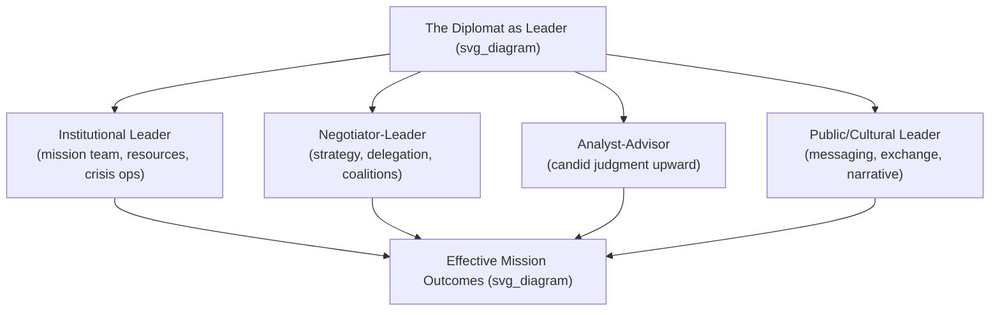

## The Diplomat as Leader: Roles and Responsibilities

### Overview

This topic examines the diplomat not merely as a technical negotiator or representative, but as a leader who must exercise influence, judgment, and direction-setting across multiple simultaneous roles — often without the formal authority that leadership in conventional organizational settings typically relies on. It surveys the core role set of the diplomat-as-leader and the specific responsibilities attached to each.

### The Classical Role Set

**Key Points**

- The functions traditionally assigned to diplomats — as codified in instruments such as the 1961 Vienna Convention on Diplomatic Relations — provide the baseline role set from which leadership responsibilities extend:
  - **Representation** — formally embodying the sending state to the receiving state and to international bodies.
  - **Negotiation** — the active pursuit of agreements advancing the sending state's interests while maintaining relationship viability.
  - **Reporting and analysis** — observing, interpreting, and transmitting political, economic, and social developments in the host country to the home government.
  - **Protection of nationals and interests** — safeguarding the sending state's citizens and property abroad.
  - **Promotion of friendly relations** — cultivating economic, cultural, and scientific ties between states.
- Article 3 of the Vienna Convention on Diplomatic Relations formally enumerates these functions, giving the classical role set legal as well as customary standing.
- Leadership enters not as a separate role but as the *manner* in which each of these functions must be executed: representation requires leading a mission's staff and messaging; negotiation requires leading a process among parties with no common superior; reporting requires leading analytical judgment under uncertainty.

### The Diplomat as Institutional Leader (Head of Mission)

**Key Points**

- As head of an embassy or mission, a diplomat exercises conventional organizational leadership responsibilities in addition to external diplomatic ones:
  - **Team leadership** — managing a diverse mission staff (political, economic, consular, administrative, security, and often personnel from other government agencies co-located at the embassy).
  - **Resource stewardship** — budget management, security oversight, and operational continuity of the mission.
  - **Interagency coordination** — synchronizing the activities of multiple government agencies represented within a single mission, each with potentially divergent priorities (a responsibility that has grown substantially under the modern statecraft model).
  - **Crisis management** — assuming direct operational leadership during emergencies affecting nationals abroad (natural disasters, civil unrest, evacuations).
- [Inference] This internal leadership function is often underemphasized in traditional diplomatic training relative to negotiation skill, despite occupying a substantial share of a head-of-mission's actual working time, based on the general pattern described in diplomatic-practice literature and practitioner memoirs.

### The Diplomat as Negotiator-Leader

**Key Points**

- In negotiation contexts, the diplomat must lead without command authority over counterpart delegations — a structural condition explored under the "diplomatic leadership as distinct competency" topic.
- Specific responsibilities in this role:
  - **Setting negotiating strategy** — determining sequencing, red lines, and fallback positions in coordination with the home government.
  - **Delegation leadership** — when leading a multi-person negotiating team, coordinating internal division of labor, maintaining message discipline, and managing internal disagreement without exposing it externally.
  - **Coalition leadership** — in multilateral settings, building and holding together voting or negotiating blocs among states with only partially aligned interests.
  - **Framing and agenda-setting** — shaping how an issue is defined and sequenced, which frequently determines the range of viable outcomes more than raw bargaining power does.

### The Diplomat as Analyst and Advisor

**Key Points**

- Diplomats are frequently the primary source of ground-level political judgment feeding into home-government decision-making, placing them in an advisory leadership role vis-à-vis their own government even though they lack formal decision authority over policy.
- Responsibilities include:
  - **Providing candid assessment**, including assessments that may be unwelcome to the home government's preferred narrative — a responsibility requiring intellectual courage as much as analytical skill.
  - **Anticipating second- and third-order effects** of proposed policy on the bilateral or multilateral relationship being managed.
  - **Translating local context** — explaining host-country domestic political constraints in terms usable by home-government decision-makers who lack on-the-ground familiarity.
- A recurring leadership tension in this role is the risk of "clientitis" — a diplomat's excessive identification with the host country's perspective, potentially compromising objective advisory judgment — balanced against the equally real risk of insufficient contextual sensitivity if a diplomat over-identifies with home-government preferences instead.

### The Diplomat as Public and Cultural Leader

**Key Points**

- Particularly since the rise of public diplomacy as a core statecraft instrument, diplomats increasingly lead public-facing engagement:
  - **Public messaging** — direct engagement with host-country media, civil society, and (increasingly) social media audiences.
  - **Cultural and educational diplomacy** — leading exchange programs, cultural events, and institutional partnerships that build long-term relationship capital (connecting to the Track III function discussed under the tracks-of-diplomacy topic).
  - **Crisis communication** — leading public messaging during bilateral tensions or crises, where poorly managed communication can itself become a source of diplomatic friction independent of the underlying substantive issue.

### Comparative Role Summary

| Role | Primary Locus | Core Leadership Challenge |
| --- | --- | --- |
| Institutional leader (head of mission) | Internal to the mission | Managing a multi-agency team without full authority over all agency personnel |
| Negotiator-leader | External, counterpart-facing | Leading process and coalitions without command authority over counterparts |
| Analyst-advisor | Upward, toward home government | Delivering candid judgment while maintaining trust and influence |
| Public/cultural leader | Outward, toward host-country society | Managing narrative and relationship capital in real time |

### Illustration: The Diplomat's Leadership Role Set

### Example

An ambassador managing a sudden bilateral crisis (e.g., a detained national) must simultaneously: lead the internal mission response (institutional leader role — coordinating consular, security, and communications staff), negotiate directly or indirectly with host-country authorities for resolution (negotiator-leader role), advise the home government candidly on realistic timelines and risks rather than what is politically convenient to report (analyst-advisor role), and manage public and media expectations in both countries to avoid the crisis escalating beyond its substantive scope (public/cultural leader role). Each role draws on a different leadership skill set, and failure in any one can undermine outcomes in the others.

### Conclusion

The diplomat-as-leader concept reframes the classical functional role set of diplomacy — representation, negotiation, reporting, protection, relationship promotion — as leadership responsibilities requiring influence, judgment, and team direction, frequently exercised without the formal command authority typical of conventional organizational leadership. Competent diplomatic leadership requires fluency across at least four distinguishable role registers: internal institutional leadership, external negotiation leadership, upward advisory leadership, and outward public leadership — each with a distinct central challenge.

**Related Topics**

- Vienna Convention on Diplomatic Relations (1961) — legal framework for diplomatic functions
- Head-of-mission management and interagency coordination challenges
- Negotiation leadership and coalition-building in multilateral settings
- "Clientitis" and objectivity risk in diplomatic reporting
- Public diplomacy and crisis communication leadership
- Ambassadorial crisis management case studies