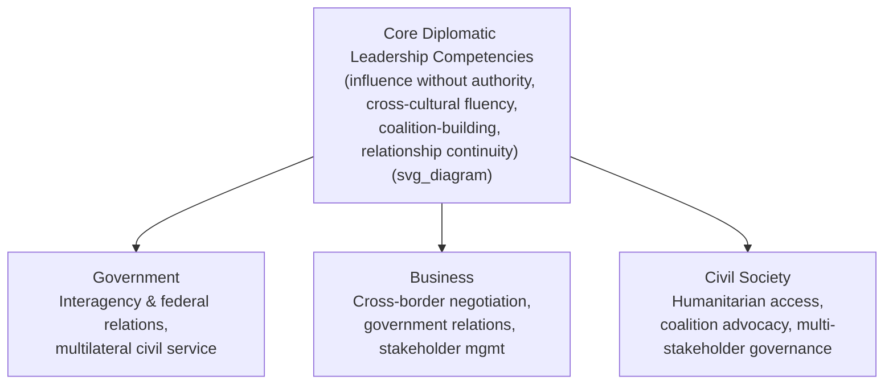

## Diplomatic Leadership in Government, Business, and Civil Society

### Overview

Diplomatic leadership as a competency set — influence without command authority, cross-cultural fluency, coalition-building among formally equal or independent parties, and sustained relationship management — is not confined to the foreign ministry. This topic examines how the same underlying skill set manifests, with sector-specific adaptations, across government, business, and civil society, and where cross-sector transferability breaks down.

### Diplomatic Leadership in Government

**Key Points**

- Within government, diplomatic leadership extends beyond the foreign ministry to any role requiring the reconciliation of formally independent or co-equal actors without a common superior:
  - **Interagency coordination** — officials leading policy processes across departments (defense, treasury, commerce) that share no direct hierarchical relationship with each other, requiring diplomatic-style consensus-building even in a purely domestic government context.
  - **Federal/sub-national relations** — in federated or decentralized states, national officials negotiating with state, provincial, or municipal governments exercise a diplomacy-like leadership style, since sub-national governments often possess independent political mandates.
  - **Legislative-executive relations** — executive-branch officials building support for policy among legislators who owe no formal obedience to the executive exemplify diplomatic-style influence within a single national government.
  - **International civil service leadership** — officials within multilateral organizations (UN agencies, World Bank, regional bodies) lead across member states with divergent interests, arguably representing the purest extension of classical diplomatic leadership outside a national foreign ministry.
- [Inference] The degree to which domestic interagency or federal-relations work should be classified as "diplomatic leadership" versus ordinary public administration is a matter of definitional convention rather than settled consensus; this syllabus treats it as diplomatic leadership wherever the defining structural condition — absence of formal authority over the other party — holds.

### Diplomatic Leadership in Business

**Key Points**

- Corporate and commercial contexts increasingly require diplomatic-style leadership, particularly for organizations operating across borders or managing stakeholders with independent authority:
  - **International business negotiation** — cross-border mergers, joint ventures, and market-entry negotiations require the same cross-cultural fluency and relationship-preservation orientation as state diplomacy, since counterpart firms are legally independent actors.
  - **Government relations / corporate diplomacy** — executives and government-affairs specialists engaging host-country regulators, ministries, and officials on behalf of a firm function as de facto corporate diplomats, often navigating political risk with tools resembling classical statecraft (relationship-building, reputational management, coalition-building with local business associations).
  - **Stakeholder management** — leading relationships with actors who have independent legitimacy and cannot be commanded — shareholders, regulators, labor unions, community groups — mirrors the diplomatic leader's structural condition of influence without hierarchy.
  - **Supply chain and alliance leadership** — managing multinational supplier and partner networks requires sustained relationship management across firms with independent strategic interests, analogous to alliance diplomacy in the state context.
- A distinct but related field, **economic diplomacy** (addressed more fully under modern statecraft), operates at the state-business interface, where government officials lead engagement specifically to advance commercial interests, and firms increasingly employ former diplomats in government-relations leadership roles precisely because the skill set transfers.

### Diplomatic Leadership in Civil Society

**Key Points**

- NGO, humanitarian, and civil-society leadership frequently requires diplomatic-style competence, often under more acute resource and access constraints than either government or business contexts:
  - **Humanitarian access negotiation** — NGO leaders in conflict zones must negotiate access with multiple armed actors, none of which recognizes the NGO's formal authority, requiring neutrality management and trust-building skills closely analogous to Track II diplomacy.
  - **Coalition and advocacy leadership** — civil-society leaders building cross-organizational coalitions (e.g., on climate policy or human rights) must align independent organizations with differing mandates and funding bases toward common action, without any authority to compel participation.
  - **Multi-stakeholder governance leadership** — leading multi-stakeholder initiatives (certification schemes, standard-setting bodies) that bring together governments, businesses, and NGOs as formally equal participants requires the classic diplomatic leadership skill of building consensus among parties with divergent, sometimes conflicting, institutional interests.
  - **International civil-society representation** — NGO leaders engaging with intergovernmental bodies (UN consultative status organizations, for example) must operate diplomatically within formal international structures despite lacking the sovereign standing of state actors.
- Civil-society diplomatic leadership frequently overlaps directly with the Track II and Track III frameworks discussed elsewhere in this chapter, since much Track II activity is conducted by civil-society and academic actors rather than government officials.

### Cross-Sector Comparison

| Dimension | Government | Business | Civil Society |
| --- | --- | --- | --- |
| Typical counterpart | Other states, agencies, sub-national governments | Other firms, regulators, stakeholders | Armed actors, coalition partners, intergovernmental bodies |
| Source of authority | Formal mandate, sovereign standing | Legal/contractual standing, market position | Moral legitimacy, mission credibility, access-based trust |
| Primary currency of influence | Sovereign reciprocity, alliance value | Commercial value, reputational capital | Neutrality, credibility, mission alignment |
| Characteristic risk | Escalation, breakdown of state relations | Reputational or regulatory damage, deal failure | Loss of access, compromised neutrality |
| Time horizon | Often multi-year to generational | Deal-cycle to multi-year partnership | Mission-length, often protracted (conflict/advocacy cycles) |

### Illustration: Shared Core, Sector-Specific Expression

### Example

A multinational firm seeking to build a facility in a country with active civil unrest illustrates how the three sectors intersect around a shared diplomatic-leadership demand: the firm's government-relations lead must negotiate regulatory approval and political risk mitigation with host-government officials (business-sector diplomatic leadership); host-government officials must balance the firm's investment interest against domestic political constraints and possibly coordinate with sub-national authorities (government-sector diplomatic leadership); and local NGOs monitoring the project's community impact must negotiate access and information-sharing with both the firm and local authorities while preserving their independent credibility (civil-society diplomatic leadership). None of the three actors can command the others — all outcomes depend on sustained, trust-based influence.

### Implications for Diplomatic Leadership Development

**Key Points**

- Because the core competency set is structurally similar across sectors, career paths increasingly cross sector lines: former diplomats moving into corporate government-relations roles, and NGO leaders moving into multilateral or government advisory positions, are common patterns cited in professional-development literature.
- [Inference] Training programs that isolate diplomatic leadership education within foreign-ministry-specific curricula may under-prepare leaders for the increasingly cross-sector nature of influence-based leadership; broader curricula increasingly draw case material from business and civil-society contexts precisely for this reason, though the extent of formal curricular convergence varies significantly by institution.

### Conclusion

Diplomatic leadership is best understood as a transferable competency defined by a structural condition — the need to lead and influence parties over whom one has no formal command authority — rather than a skill set confined to accredited state diplomats. Government, business, and civil-society contexts each apply this same core competency set to different counterparts, currencies of influence, and risk profiles, but the underlying leadership challenge of building trust-based, sustained influence without hierarchical control remains constant across all three.

**Related Topics**

- Corporate diplomacy and government relations leadership
- Humanitarian negotiation and access management in conflict zones
- Multi-stakeholder governance and standard-setting bodies
- Interagency and federal relations as domestic diplomatic leadership
- Economic diplomacy at the state-business interface
- Career transitions between diplomatic, corporate, and NGO leadership roles