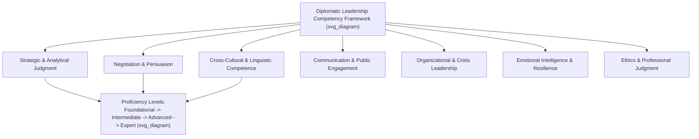

## Core Competency and Capability Frameworks

### Overview

Competency and capability frameworks provide structured models for identifying, developing, and assessing the skills required for effective diplomatic leadership. This topic surveys the major categories of framework used in diplomatic and foreign-service training, their common structural elements, and how they operationalize the abstract concept of "diplomatic leadership" into assessable behaviors.

### Purpose and Function of Competency Frameworks

**Key Points**

- A competency framework serves several institutional functions: guiding recruitment and selection, structuring training curricula, informing performance evaluation, and providing a common vocabulary for career development across a diplomatic or foreign service.
- Frameworks generally distinguish between:
  - **Competencies** — the underlying knowledge, skills, abilities, and behaviors an individual possesses or demonstrates (e.g., "negotiates effectively under ambiguity").
  - **Capabilities** — the organizational-level capacity that results from aggregating individual competencies with systems, resources, and processes (e.g., a foreign ministry's overall capacity to conduct crisis diplomacy).
- [Inference] This individual/organizational distinction is drawn more sharply in some institutional frameworks (particularly those influenced by organizational-development literature) than in others; many foreign-service frameworks use "competency" and "capability" loosely or interchangeably in practice.

### Common Structural Elements

**Key Points**

- Most diplomatic competency frameworks (whether from national foreign services, multilateral organizations, or academic diplomacy programs) organize competencies into recognizable clusters:
  - **Analytical/cognitive competencies** — political analysis, strategic thinking, judgment under uncertainty, and the ability to synthesize complex, incomplete information into actionable assessment.
  - **Interpersonal/relational competencies** — negotiation skill, cross-cultural communication, active listening, relationship-building, and emotional intelligence.
  - **Communication competencies** — written reporting clarity, public speaking, media engagement, and increasingly, digital/social media communication.
  - **Managerial/leadership competencies** — team leadership, resource management, delegation, and crisis management (mapping to the "institutional leader" role discussed under the diplomat-as-leader topic).
  - **Values/integrity competencies** — ethical judgment, discretion, resilience, and adherence to professional and legal standards (connecting to accountability frameworks discussed elsewhere in this syllabus).
- Frameworks typically define competencies at multiple **proficiency levels** (e.g., foundational, intermediate, advanced, expert), allowing the same competency to be assessed differently depending on seniority or role.

### Representative Framework Types

**Key Points**

- **National foreign-service frameworks** — many countries' diplomatic academies and foreign ministries maintain formal competency dictionaries used for recruitment testing, assignment decisions, and promotion boards. These are typically tailored to that country's specific institutional culture and are not usually published in full academic detail, though their general structure (analytical, interpersonal, managerial, integrity clusters) is broadly consistent with the pattern above. [Unverified — specific framework content varies by country and is often not publicly disclosed in detail; treat any specific national framework as illustrative rather than universally representative.]
- **Multilateral/international organization frameworks** — bodies such as the United Nations maintain formal competency frameworks (e.g., the UN Core Values and Core Competencies model) used across international civil-service recruitment and performance management, typically emphasizing communication, teamwork, planning/organizing, accountability, and client orientation alongside technical/professional competencies specific to role.
- **Academic/think-tank frameworks** — diplomacy studies programs and professional-development institutions often construct their own competency models for curricular purposes, frequently synthesizing negotiation theory (e.g., Harvard-style principled negotiation), leadership theory (transformational, situational), and area-studies/cultural-competence frameworks into an integrated diplomatic-leadership model.
- **Emotional and cultural intelligence frameworks** — increasingly incorporated as standalone competency clusters, drawing on broader organizational psychology models (e.g., Goleman's emotional intelligence framework, cultural intelligence/CQ models) rather than diplomacy-specific origins, reflecting the cross-sector transferability discussed under the government/business/civil-society topic.

### A Synthesized Reference Model

**Key Points**

- For syllabus purposes, the following seven-cluster synthesis represents a reasonable composite of the patterns above, useful as a reference structure rather than a specific institutional standard:
  1. **Strategic and analytical judgment** — political risk assessment, scenario thinking, synthesis under incomplete information.
  2. **Negotiation and persuasion** — interest-based bargaining, coalition-building, managing formally equal counterparts.
  3. **Cross-cultural and linguistic competence** — adapting communication style, recognizing differing norms of hierarchy, directness, and face-saving.
  4. **Communication and public engagement** — written reporting, public speaking, media and digital engagement.
  5. **Organizational and crisis leadership** — team management, resource stewardship, decision-making under time pressure.
  6. **Emotional intelligence and resilience** — self-regulation under stress, empathy, sustained composure in adversarial settings.
  7. **Ethics and professional judgment** — discretion, integrity, adherence to legal and normative standards governing diplomatic conduct.
- [Inference] This seven-cluster model is a pedagogical synthesis for this syllabus rather than a direct reproduction of any single named institutional framework; specific programs may weight, combine, or subdivide these clusters differently.

### Illustration: Competency Cluster Map

### Application: Framework Use in Practice

**Key Points**

- **Recruitment/selection** — frameworks structure assessment-center exercises (negotiation simulations, in-basket exercises, case analyses) designed to elicit observable competency-cluster behaviors.
- **Training curriculum design** — competency clusters map to discrete training modules (e.g., a negotiation-skills module addressing cluster 2, a crisis-simulation module addressing cluster 5).
- **Performance evaluation** — periodic review cycles assess demonstrated competency against defined proficiency-level behavioral indicators, often via 360-degree feedback incorporating peer, subordinate, and supervisor input given the influence-without-authority nature of much diplomatic work.
- **Succession and assignment planning** — competency gaps identified through evaluation inform targeted development assignments (e.g., a strong negotiator with underdeveloped crisis-leadership competency might be assigned to a role requiring the latter under mentorship).

### Comparative Table: Framework Sources and Emphasis

| Framework Source | Primary Use Case | Notable Emphasis |
| --- | --- | --- |
| National foreign-service academies | Recruitment, promotion, assignment | Institution-specific cultural fit, language proficiency |
| UN / multilateral organizations | International civil-service HR management | Core values, accountability, client orientation |
| Academic/think-tank programs | Curriculum design, executive education | Integrated negotiation and leadership theory |
| Organizational psychology (EI/CQ) | Cross-sector leadership development | Emotional and cultural intelligence as standalone domains |

### Conclusion

Competency and capability frameworks translate the abstract concept of diplomatic leadership into structured, assessable clusters of knowledge, skill, and behavior, typically spanning analytical, interpersonal, communicative, managerial, and ethical domains, each assessed across multiple proficiency levels. While specific frameworks vary by institution — national foreign services, multilateral organizations, and academic programs each emphasize different clusters — the underlying structural pattern is broadly consistent, and frameworks serve a common institutional function: making diplomatic leadership development, evaluation, and succession planning systematic rather than purely experiential.

**Related Topics**

- UN Core Values and Core Competencies model
- Negotiation theory and principled-bargaining frameworks
- Emotional and cultural intelligence models (Goleman, CQ frameworks)
- Assessment-center methodology in diplomatic recruitment
- 360-degree feedback in influence-based leadership evaluation
- Curriculum design for diplomatic and foreign-service training programs