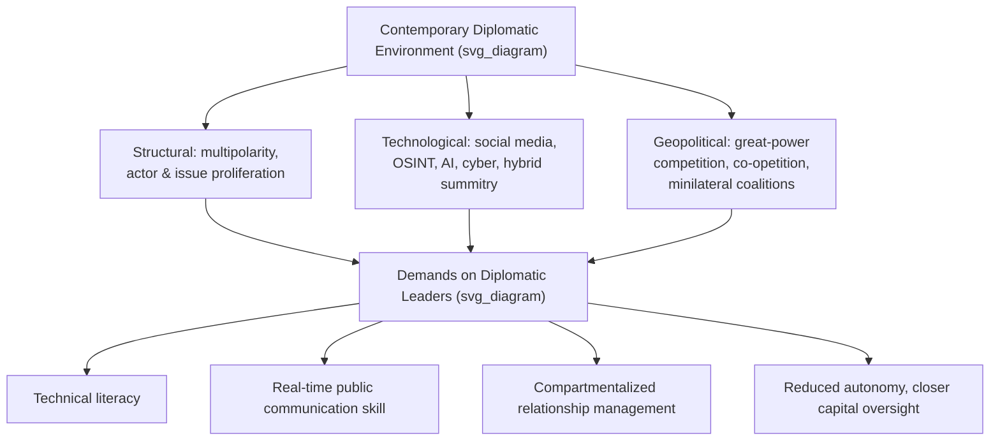

## The Contemporary Diplomatic Environment

### Overview

This topic surveys the current operating environment for diplomatic leadership: the structural, technological, and geopolitical conditions that distinguish contemporary practice from earlier eras and that shape the demands placed on today's diplomatic leaders. It functions as a synthesis point for the chapter, connecting the historical evolution, statecraft expansion, and multi-sector diffusion covered in preceding topics to present-day operating conditions.

### Structural Features of the Contemporary Environment

**Key Points**

- **Multipolarity and diffusion of power.** The post-Cold War unipolar moment has given way, in most contemporary assessments, to a more multipolar or at least multi-actor distribution of influence, with multiple major powers, regional powers, and non-state actors simultaneously shaping outcomes on any given issue.
- **Issue proliferation beyond traditional security.** Contemporary diplomacy routinely addresses climate change, pandemic response, cybersecurity, artificial intelligence governance, supply-chain resilience, and migration — domains that did not feature prominently in classical diplomatic practice and that often require technical expertise beyond traditional diplomatic training.
- **Actor proliferation.** Beyond sovereign states, contemporary diplomacy regularly involves international organizations, multinational corporations, NGOs, sub-national governments (paradiplomacy), and increasingly influential individuals or informal networks — consistent with the cross-sector diffusion discussed under the government/business/civil-society topic.
- **Compressed decision timelines.** Real-time digital communication has continued the historical trend (traced under historical evolution) of reducing field-level diplomatic autonomy, with capitals now able to direct or override envoy judgment within minutes rather than weeks.
- [Inference] Assessments of exactly how "multipolar" the current system is, and which framework (multipolarity, "G-Zero," bipolar US-China competition, or a more networked model) best describes it, vary significantly across international relations scholarship and are actively contested rather than settled; this syllabus treats the general trend toward greater actor and power diffusion as broadly agreed upon even where the precise characterization is disputed.

### Technological Drivers

**Key Points**

- **Digital and social media diplomacy.** Heads of state, foreign ministries, and ambassadors now routinely communicate directly and publicly via social media platforms, collapsing the traditional separation between private negotiation and public messaging and creating new risks of unintended escalation through informal statements.
- **Open-source intelligence (OSINT) proliferation.** Satellite imagery, social media monitoring, and commercially available data have expanded the information environment available to diplomatic analysts and, simultaneously, to adversaries and the public — reducing the information advantage governments once held.
- **Artificial intelligence and data analytics.** Emerging use of AI-assisted analysis for pattern detection, translation, and scenario modeling is beginning to enter diplomatic tradecraft, though [Unverified] the extent and maturity of institutional adoption varies substantially across foreign services and is evolving rapidly enough that specific claims should be treated as provisional.
- **Cybersecurity as a diplomatic domain.** Cyber operations, attribution disputes, and norm-setting for state behavior in cyberspace have become a distinct and technically demanding area of diplomatic practice, often requiring diplomats to develop genuine technical literacy rather than relying solely on traditional political-analytical skill.
- **Video conferencing and hybrid summitry.** Accelerated by the COVID-19 pandemic, virtual and hybrid formats have become a standing feature of multilateral and bilateral engagement, alongside traditional in-person summitry, altering the relationship-building dynamics traditionally associated with face-to-face diplomatic interaction.

### Geopolitical Features

**Key Points**

- **Great-power competition.** Contemporary diplomacy operates against a backdrop of renewed strategic competition among major powers, requiring diplomatic leaders to manage relationships that combine cooperation on shared-interest issues (e.g., climate, pandemic response) with competition or friction on others — a more compartmentalized relationship-management demand than the more uniformly adversarial or allied postures of the Cold War.
- **Weakening of some traditional multilateral institutions.** Several assessments in the diplomacy and international-relations literature note strain on institutions such as the WTO's dispute-settlement function and periodic gridlock in the UN Security Council, prompting increased reliance on smaller "minilateral" groupings and informal coalitions.
- **Economic interdependence alongside strategic rivalry.** Contemporary great-power relationships (most prominently US-China) combine deep economic interdependence with strategic competition, a combination sometimes termed "co-opetition," requiring diplomatic leaders to compartmentalize cooperative and competitive tracks simultaneously.
- **Rise of minilateral and informal groupings.** Ad hoc, issue-specific coalitions (rather than universal-membership institutions) have become an increasingly prominent feature of multilateral engagement, allowing faster coordination among like-minded actors where universal consensus is unattainable.

### Comparative Snapshot: Then and Now

| Dimension | Classical/Cold War Environment | Contemporary Environment |
| --- | --- | --- |
| Power distribution | Bipolar or clearly hierarchical | Multipolar/diffuse, contested characterization |
| Primary issue domains | Security, territory, ideology | Security + climate, tech, health, cyber, supply chains |
| Communication speed | Days to weeks | Real-time |
| Information environment | State-controlled advantage | OSINT-saturated, reduced information asymmetry |
| Institutional structure | Universal-membership multilateralism (UN-centered) | Mixed universal + minilateral/informal coalitions |
| Envoy autonomy | Substantial | Significantly reduced |
| Public/private separation | Clear | Substantially eroded (social media) |

### Illustration: Forces Shaping the Contemporary Environment

### Example

A climate-focused multilateral negotiation in the contemporary environment illustrates the convergence of these features: negotiators must possess technical literacy in emissions science and finance mechanisms (issue proliferation), manage real-time public and social-media scrutiny of the talks as they unfold (technological/communication compression), coordinate within both universal frameworks (UNFCCC) and smaller minilateral coalitions of especially motivated states (institutional diffusion), and do so while their governments simultaneously compete with some of the same counterpart states on trade or security issues in parallel tracks (co-opetition) — all under significantly compressed decision timelines relative to a Congress-era or even Cold War-era negotiation.

### Implications for Diplomatic Leadership

**Key Points**

- The contemporary environment elevates certain competencies identified under the core competency frameworks topic: technical/issue literacy, real-time communication skill, and compartmentalization ability now carry greater relative weight than in earlier eras, without displacing the classical core of negotiation, analytical judgment, and relationship management.
- Leaders must increasingly operate with **less autonomous discretion** than their historical predecessors, even as the issues they manage have grown more technically complex and consequential — a tension between reduced authority and increased responsibility that is a distinctive feature of the current period.
- [Inference] Whether these environmental changes require fundamentally new leadership theory or represent an intensification of trends already identified in the "new diplomacy" and modern-statecraft literature (covered under earlier topics in this chapter) remains a matter of ongoing scholarly discussion rather than settled consensus.

### Conclusion

The contemporary diplomatic environment is defined by the convergence of structural power diffusion, transformative communication and information technology, and a geopolitical backdrop combining great-power competition with deep interdependence. These conditions place elevated demands on diplomatic leaders — technical literacy, real-time public communication management, and compartmentalized relationship-handling — while simultaneously reducing the autonomous discretion diplomatic leaders have historically relied on, forming the immediate operating context for all subsequent chapters in this course.

**Related Topics**

- Great-power competition and "co-opetition" in contemporary strategic relationships
- Minilateralism and informal coalition diplomacy
- Cybersecurity and AI governance as emerging diplomatic domains
- Social media and the erosion of public/private diplomatic separation
- Climate diplomacy as a case study in issue-domain proliferation
- Institutional strain in universal multilateral bodies (UN, WTO)