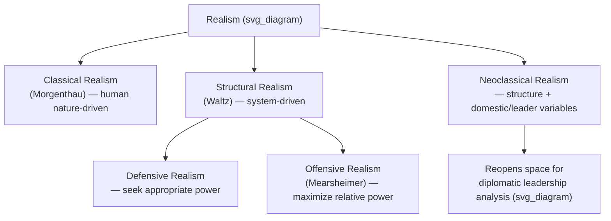

## Realism and Power Politics

### Overview

Realism is one of the foundational paradigms of international relations theory, centering on power, security, and the anarchic structure of the international system as the primary determinants of state behavior. This topic surveys realism's core assumptions, its major theoretical variants, and its implications for how diplomatic leadership is understood and practiced within a realist framework.

### Core Assumptions of Realism

**Key Points**

- Realist theory rests on a small set of foundational assumptions, articulated across its variants with differing emphasis:
  - **Anarchy** — the international system lacks a central authority capable of enforcing rules or protecting states, in contrast to the hierarchical order within domestic political systems.
  - **State centrism** — states are the primary, rational, unitary actors in international politics; other actors (international organizations, NGOs, corporations) are treated as secondary or derivative.
  - **Self-help** — in the absence of a higher authority, states must rely on their own capabilities (chiefly military and economic power) to ensure their survival.
  - **Primacy of security** — survival and security are treated as states' foremost interests, prior to and shaping all other goals (economic, ideological, or normative).
  - **Power as the central currency** — international outcomes are best explained by the distribution of power (military, economic, and related capabilities) among states, rather than by ideology, institutions, or norms.
- These assumptions collectively produce realism's central analytical claim: that international politics is fundamentally a struggle for power and security among self-interested states operating in a self-help system.

### Classical Realism

**Key Points**

- Classical realism, associated principally with Hans Morgenthau's *Politics Among Nations* (1948), locates the drive for power in human nature itself — states seek power because they are composed of and led by power-seeking individuals.
- Morgenthau's framework emphasizes prudence, statecraft, and the "national interest defined in terms of power" as the organizing principle for foreign policy analysis.
- Classical realism draws heavily on earlier political thought, frequently tracing intellectual lineage to Thucydides' account of the Peloponnesian War (notably the "Melian Dialogue," often cited as an early articulation of power-based reasoning in interstate relations), Machiavelli's emphasis on the practical exercise of power, and Hobbes' state-of-nature reasoning as an analogy for the international system.
- Unlike later structural variants, classical realism retains significant space for statesmanship, prudence, and the individual judgment of leaders as explanatory factors — making it, among the realist variants, the most directly compatible with a leadership-centered analytical frame.

### Structural (Neo)Realism

**Key Points**

- Structural realism, most closely associated with Kenneth Waltz's *Theory of International Politics* (1979), relocates the source of power-seeking behavior from human nature to the **structure of the international system** itself — specifically, its anarchic ordering principle and the distribution of capabilities across units (states).
- Waltz's framework treats states as functionally similar units whose behavior is shaped primarily by their position within the international power structure (unipolar, bipolar, multipolar) rather than by internal characteristics or individual leadership.
- Structural realism subdivides into two influential branches:
  - **Defensive realism** (associated with Waltz) — states seek an appropriate, not maximal, amount of power, since over-expansion invites counterbalancing and threatens survival; systemic stability, particularly under bipolarity, is emphasized.
  - **Offensive realism** (most closely associated with John Mearsheimer's *The Tragedy of Great Power Politics*, 2001) — states seek to maximize relative power up to and including regional hegemony, since uncertainty about others' intentions makes maximal power the only reliable route to security.
- [Inference] The defensive/offensive distinction remains an active and unresolved debate within the realist tradition rather than a settled hierarchy of correctness; each variant generates different predictions about great-power behavior that are contested empirically.

### Neoclassical Realism

**Key Points**

- Neoclassical realism, developed from the 1990s onward (associated with scholars such as Gideon Rose, who coined the term, and later Randall Schweller and others), seeks to reintegrate domestic-level and leadership-level variables into the structural realist framework.
- It treats systemic power distribution (the structural realist independent variable) as setting broad parameters for state behavior, while domestic factors — leader perceptions, state-society relations, bureaucratic politics — function as intervening variables shaping how systemic pressures are actually translated into specific foreign policy.
- This variant is of particular relevance to diplomatic leadership study, since it explicitly reopens analytical space for individual leader judgment, misperception, and domestic political constraint as causally significant, in contrast to structural realism's near-exclusion of such factors.

### Key Realist Concepts

**Key Points**

- **Balance of power** — the proposition that states act to prevent any single state or coalition from achieving dominance, either through internal capability-building or external alliance formation, restoring systemic equilibrium.
- **Security dilemma** — a state's efforts to increase its own security (e.g., through military buildup) are perceived as threatening by other states, prompting reciprocal buildups that leave all parties less secure than before, despite no state harboring aggressive intent — a foundational concept for understanding arms races and escalation dynamics.
- **Relative vs. absolute gains** — realists argue states are more concerned with gains *relative* to rivals (which affect the future balance of power) than with absolute gains in isolation, a claim with direct implications for why cooperation is harder to sustain than liberal institutionalist theory (covered elsewhere in this chapter) would predict.
- **Polarity** — the number of great powers in the system (unipolar, bipolar, multipolar) is treated as a key structural variable shaping systemic stability; Waltz notably argued bipolarity was comparatively more stable than multipolarity due to reduced miscalculation risk.

### Realism's Implications for Diplomatic Leadership

**Key Points**

- Under a realist lens, diplomatic leadership is fundamentally instrumental to the pursuit and management of state power and security, rather than a normatively autonomous activity:
  - **Negotiation** is understood as a mechanism for adjusting the distribution of power and resolving security dilemmas, not primarily as relationship-building for its own sake.
  - **Alliance diplomacy** (balancing behavior) becomes a central diplomatic leadership task, requiring skill in coalition formation and credible commitment signaling.
  - **Credibility and reputation** for resolve matter chiefly instrumentally — as inputs into deterrence and bargaining power — rather than as ends in themselves.
  - **Classical realism's** retained space for statesmanship makes it the realist variant most compatible with the diplomatic-leadership-as-distinct-competency framework introduced earlier in this chapter; **structural realism**, by contrast, substantially discounts the causal significance of individual diplomatic leadership relative to systemic power distribution.
- A realist-informed diplomatic leader would prioritize accurate power assessment, credible signaling, and prudent restraint from actions inviting unfavorable balancing, treating idealistic or values-based diplomatic appeals with skepticism absent underlying power-political rationale.

### Illustration: Realist Theoretical Family

### Example

The Cold War bipolar standoff is a frequently cited realist case: Waltz's structural realism explains the relative stability of the US-Soviet standoff largely by reference to bipolarity itself (fewer great powers reduces miscalculation risk), largely independent of the specific individuals occupying leadership positions. A neoclassical realist account of the same period, by contrast, would incorporate how individual leaders' threat perceptions (e.g., differing assessments of Soviet intentions across successive US administrations) shaped specific policy choices — such as detente versus containment emphasis — within the broader structural constraint of bipolarity. Both readings agree power distribution mattered; they diverge on how much room remains for diplomatic leadership judgment to shape outcomes within that structure.

### Critiques and Limitations

**Key Points**

- Realism is commonly critiqued, particularly by liberal institutionalist and constructivist scholars (covered under related topics in this chapter), for:
  - Underweighting the role of international institutions, norms, and identity in shaping state behavior.
  - Difficulty explaining sustained cooperation (e.g., long-standing security communities, deep economic integration) absent pure power-balancing logic.
  - Treating states as unitary rational actors, obscuring domestic political variation — a critique neoclassical realism directly attempts to address.
- [Inference] The relative explanatory power of realism versus its rival paradigms is not resolved and varies significantly by the specific historical case or issue-domain under examination; most contemporary IR scholarship treats realism as one lens among several rather than a comprehensive account.

### Conclusion

Realism explains international behavior primarily through the lens of anarchy, self-help, and the distribution of power among states, with classical, structural, and neoclassical variants differing chiefly in where they locate the source of power-seeking behavior — human nature, systemic structure, or an interaction of structure with domestic and leadership-level factors. For diplomatic leadership specifically, realism's variants offer sharply differing verdicts on how much individual leadership judgment matters: classical and neoclassical realism preserve meaningful space for diplomatic skill and statesmanship, while structural realism treats such factors as largely secondary to the systemic distribution of power.

**Related Topics**

- Liberal institutionalism and the role of international organizations
- Constructivism and the role of norms and identity in IR
- The security dilemma and arms-race dynamics
- Balance-of-power theory and alliance formation
- Neoclassical realism and leader-level foreign policy analysis
- Thucydides, Machiavelli, and Hobbes as intellectual precursors to realist thought