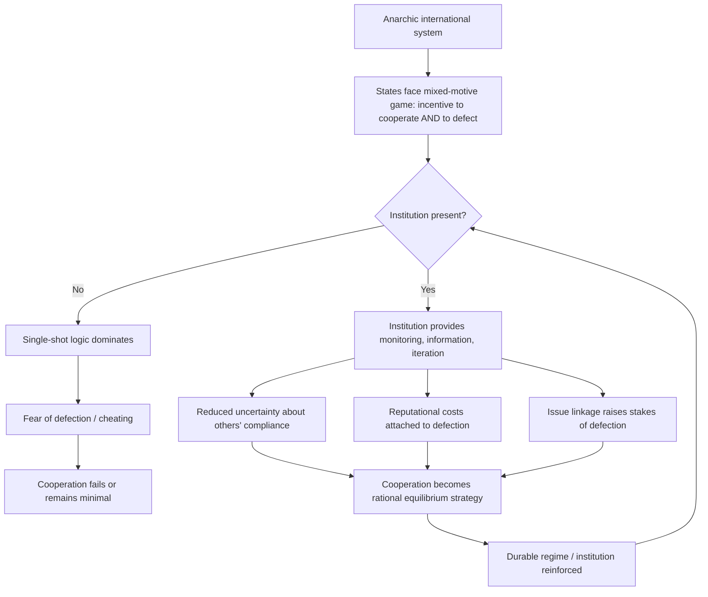

## Liberalism and Institutionalism

### Overview

Liberalism, as a theoretical tradition in International Relations (IR), holds that cooperation among states is possible and durable, not merely a temporary pause between conflicts. It rejects the realist assumption that anarchy necessarily produces a self-help system dominated by power politics. Institutionalism (often called Neoliberal Institutionalism) is the contemporary, systematized branch of this tradition, built substantially as a direct response to Neorealism. It concedes the realist premise of international anarchy but argues that this anarchy does not preclude cooperation, because international institutions can mitigate its worst effects.

### Intellectual Lineage

**Classical Liberalism (Idealism)**

- Rooted in Enlightenment thought (Kant, Locke, Bentham, Smith)
- Immanuel Kant's *Perpetual Peace* (1795) is the foundational text, proposing that republican governments, international law, and commercial interdependence would produce lasting peace
- Interwar "Idealism" (Woodrow Wilson's Fourteen Points, the League of Nations) applied these ideas to policy, emphasizing collective security and international law
- Discredited in the eyes of many after WWII, giving rise to E.H. Carr's and Hans Morgenthau's realist critique, which characterized idealism as naive about power

**Neoliberalism / Institutionalism (Post-1970s revival)**

- Robert Keohane and Joseph Nye's *Power and Interdependence* (1977) introduced "complex interdependence" as an alternative to the realist billiard-ball model of states
- Keohane's *After Hegemony* (1984) is the discipline-defining text, using rational-choice and game-theoretic tools to explain why institutions persist even after the hegemon that created them declines
- This revival deliberately adopted realism's rationalist, state-centric methodology while rejecting its pessimistic conclusions — a strategic move that made institutionalism harder for realists to dismiss on methodological grounds

### Core Theoretical Claims

**Key Points**

- **Anarchy is not equivalent to chaos**: The international system lacks a central authority, but this does not mean states cannot establish reliable, rule-governed relationships
- **Absolute vs. relative gains**: Liberals argue states primarily care whether they are individually better off from cooperation (absolute gains), whereas realists argue states worry about relative gains (whether a partner gains more), which they claim inhibits cooperation
- **Institutions reduce transaction costs**: International institutions lower the costs of negotiating, monitoring, and enforcing agreements by providing information, reducing uncertainty, and creating repeated interaction ("iterated games")
- **Interdependence complicates power**: Complex interdependence theory holds that multiple channels connect societies (not just state-to-state), military force loses utility among interdependent states, and issue hierarchies flatten (security is not always the top priority)
- **Regimes matter**: States form international regimes — implicit or explicit principles, norms, rules, and decision-making procedures around which actors' expectations converge in a given issue area (per Stephen Krasner's classic definition)

### Major Strands of Liberal Theory

**1. Republican (Democratic Peace) Liberalism**

- Associated with Michael Doyle's reading of Kant
- Claims liberal democracies rarely, if ever, go to war with one another (the "democratic peace" thesis)
- Mechanisms proposed: shared normative constraints against violence toward fellow democracies, institutional/structural constraints (checks and balances, public accountability) that slow the path to war
- [Inference] The precise causal mechanism (norms vs. institutional structure vs. selection effects) remains contested among proponents themselves

**2. Commercial (Interdependence) Liberalism**

- Traces to Adam Smith and Norman Angell's *The Great Illusion* (1910)
- Argues economic interdependence raises the opportunity cost of war, making conflict less rational as trade ties deepen
- Underpins later "trading state" arguments (Richard Rosecrance) that some states pursue wealth through trade rather than territorial conquest

**3. Sociological/Transnationalist Liberalism**

- Emphasizes non-state actors: multinational corporations, NGOs, epistemic communities, and transnational advocacy networks
- Argues these actors shape state preferences and outcomes independently of formal interstate diplomacy

**4. Neoliberal Institutionalism (Regime Theory)**

- The most "structural" and game-theoretic strand
- Uses Prisoner's Dilemma and iterated game models to show how repeated interaction, reputation, and reciprocity ("tit-for-tat," per Robert Axelrod's *The Evolution of Cooperation*, 1984) sustain cooperation without a central enforcer
- Institutions function as focal points and information providers, reducing the fear of being cheated (a key realist objection to cooperation)

### Liberal Institutionalism vs. Neorealism: Comparative Framework

| Dimension | Neoliberal Institutionalism | Neorealism |
| --- | --- | --- |
| View of anarchy | Constraining but manageable | Determinative of state behavior |
| Primary state concern | Absolute gains | Relative gains |
| Role of institutions | Independent causal effect on outcomes | Epiphenomenal (reflect power, don't shape it) |
| Cooperation prospects | Durable and expandable | Fragile, temporary, alliance-of-convenience |
| Core methodology | Rational choice, game theory | Rational choice, balance-of-power logic |
| Unit of analysis | States + institutions + transnational actors | States (unitary, rational actors) |

**Key Points**

- Both schools share rationalist, state-centric assumptions — this is why the "neo-neo debate" (1980s–1990s) is considered a debate *within* the rationalist paradigm rather than a paradigm-vs-paradigm clash like the earlier realist-idealist debate
- John Mearsheimer's 1994/95 essay *"The False Promise of International Institutions"* is the canonical realist rebuttal, arguing institutions merely reflect the distribution of power and have marginal independent effect

### Formal Modeling: Why Institutions Enable Cooperation

Institutionalists often formalize the cooperation problem as an iterated Prisoner's Dilemma. In a single-shot game, mutual defection is the dominant strategy equilibrium:

$$\text{Payoff matrix: } T > R > P > S$$

where $T$ = temptation to defect, $R$ = reward for mutual cooperation, $P$ = punishment for mutual defection, $S$ = sucker's payoff. In a one-shot game, defection dominates regardless of the other player's choice. Institutions change the strategic environment by:

1. Converting single-shot interactions into iterated ones (repeated play), making future retaliation credible
2. Increasing transparency (monitoring), raising the probability that defection is detected
3. Linking issue areas ("issue linkage"), raising the cost of defection in one area by threatening cooperation in another
4. Lowering the discount rate states apply to future payoffs, making long-term cooperative payoffs more attractive relative to short-term defection gains

**Example**

The World Trade Organization's dispute settlement mechanism illustrates this: it does not have coercive enforcement power comparable to domestic courts, but by providing a transparent, rule-based forum for adjudicating trade disputes and authorizing proportionate retaliation, it raises the reputational and material costs of defection, sustaining cooperation among states that would otherwise face incentives to cheat on trade commitments.

### Institutional Design and Regime Theory

Krasner's four-part regime definition remains the standard analytic decomposition:

- **Principles**: Beliefs of fact, causation, and rectitude (e.g., "free trade increases aggregate welfare")
- **Norms**: Standards of behavior defined in terms of rights and obligations
- **Rules**: Specific prescriptions or proscriptions for action
- **Decision-making procedures**: Practices for making and implementing collective choice

[Unverified] The relative weight institutionalist scholars assign to each of these four components in explaining regime durability varies across specific case studies and is not settled by a single dominant formula.

### Process Diagram: How Institutions Sustain Cooperation

### Empirical Applications

- **European Union**: Frequently cited as the paradigmatic case of institutionalized cooperation transforming interstate relations among former adversaries (France–Germany), through dense institutional layering (supranational courts, common market rules, pooled sovereignty)
- **Bretton Woods institutions** (IMF, World Bank, GATT/WTO): Illustrate Keohane's "after hegemony" thesis — these institutions have persisted and adapted even as U.S. relative hegemonic power (which created them) has declined
- **Climate regimes** (UNFCCC, Paris Agreement): Test cases for institutionalist claims under weak enforcement; the Paris Agreement's reliance on transparency and "naming and shaming" rather than binding sanctions is a direct application of the monitoring/reputation mechanism described above
- **NATO's post-Cold War persistence**: A frequently debated case — realists predicted NATO would dissolve absent the Soviet threat that justified its creation; its continuation and expansion is cited by institutionalists as evidence that institutions generate their own momentum and value beyond the power configuration that produced them, though [Inference] this case remains actively contested, since realists offer alternative explanations centered on residual U.S. hegemonic interest

### Critiques of Liberal Institutionalism

- **Relative gains problem** (realist critique): Even small relative losses can be strategically significant in an anarchic system, potentially deterring cooperation that institutionalists predict
- **Enforcement gap**: Institutions generally lack independent coercive capacity; compliance often remains voluntary or dependent on great-power backing, raising questions about causal independence from underlying power
- **Constructivist critique**: Institutionalism, despite rejecting realist pessimism, retains a rationalist, materialist ontology — it treats state interests as exogenously fixed rather than examining how institutions and norms constitute state identities and interests in the first place (Alexander Wendt's critique)
- **Neo-Marxist/structuralist critique**: Argues liberal institutionalism naturalizes an underlying capitalist world order, presenting institutions like the IMF and World Bank as neutral cooperation-facilitators while obscuring their role in reproducing core-periphery power asymmetries

### Diagrammatic Comparison of Liberal Strands (svg_diagram)

<svg xmlns="http://www.w3.org/2000/svg" viewBox="0 0 760 420">
\<style\>
.title { font: bold 16px sans-serif; fill: #1a1a1a; }
.label { font: bold 12px sans-serif; fill: #1a1a1a; }
.small { font: 11px sans-serif; fill: #333; }
.box { fill: #eef3fb; stroke: #34568B; stroke-width: 1.5; }
.center { fill: #34568B; stroke: #1a1a1a; stroke-width: 1.5; }
.centertext { font: bold 13px sans-serif; fill: #ffffff; }
\</style\>
<text x="380" y="28" text-anchor="middle" class="title">Strands of Liberal IR Theory (svg_diagram)</text>
<ellipse cx="380" cy="210" rx="110" ry="55" class="center" />
<text x="380" y="205" text-anchor="middle" class="centertext">Liberalism</text>
<text x="380" y="222" text-anchor="middle" class="centertext">(IR Theory)</text>
<rect x="40" y="60" width="180" height="80" rx="8" class="box" />
<text x="130" y="85" text-anchor="middle" class="label">Republican</text>
<text x="130" y="102" text-anchor="middle" class="small">Democratic Peace</text>
<text x="130" y="118" text-anchor="middle" class="small">(Doyle, Kant)</text>
<rect x="540" y="60" width="180" height="80" rx="8" class="box" />
<text x="630" y="85" text-anchor="middle" class="label">Commercial</text>
<text x="630" y="102" text-anchor="middle" class="small">Interdependence</text>
<text x="630" y="118" text-anchor="middle" class="small">(Angell, Rosecrance)</text>
<rect x="40" y="290" width="180" height="80" rx="8" class="box" />
<text x="130" y="315" text-anchor="middle" class="label">Sociological</text>
<text x="130" y="332" text-anchor="middle" class="small">Transnationalism</text>
<text x="130" y="348" text-anchor="middle" class="small">(NGOs, MNCs)</text>
<rect x="540" y="290" width="180" height="80" rx="8" class="box" />
<text x="630" y="315" text-anchor="middle" class="label">Neoliberal</text>
<text x="630" y="332" text-anchor="middle" class="small">Institutionalism</text>
<text x="630" y="348" text-anchor="middle" class="small">(Keohane, Nye, Axelrod)</text>
<line x1="220" y1="100" x2="300" y2="180" stroke="#34568B" stroke-width="1.5" />
<line x1="540" y1="100" x2="460" y2="180" stroke="#34568B" stroke-width="1.5" />
<line x1="220" y1="330" x2="300" y2="240" stroke="#34568B" stroke-width="1.5" />
<line x1="540" y1="330" x2="460" y2="240" stroke="#34568B" stroke-width="1.5" />
</svg>

### Relevance to Diplomatic Leadership

- **Institution-building as statecraft**: Diplomatic leaders operating from a liberal-institutionalist premise treat the design and reform of international institutions (trade regimes, security alliances, environmental accords) as a primary tool of statecraft, not a secondary byproduct of power
- **Coalition and regime maintenance**: Leadership within institutionalist frameworks emphasizes reputation management, credible commitment, and transparency-building — diplomats work to reduce other states' uncertainty about their own compliance, since this is the mechanism that sustains cooperation
- **Issue linkage as a negotiating tool**: Understanding how linking unrelated issue areas (e.g., trade concessions tied to security cooperation) raises the cost of defection is a practical negotiating technique derived directly from institutionalist game theory
- **Managing relative-gains anxieties**: Effective diplomatic leadership in mixed realist-liberal environments often requires reassuring skeptical domestic or allied audiences that absolute gains from cooperation will not translate into disproportionate rival advantage

**Next Steps**

- Constructivism in International Relations (as a further critique of institutionalist rationalism)
- Regime Theory and Krasner's Framework (deep dive)
- The Democratic Peace Thesis: Evidence and Critiques
- Complex Interdependence Theory (Keohane and Nye, in depth)
- Neorealism and the Balance of Power (comparative counterpart)
- Game Theory Applications in International Relations (Prisoner's Dilemma, Stag Hunt, Coordination Games)
- The English School and International Society (a middle-ground alternative to liberalism and realism)
- Global Governance and Multilateral Institution Design