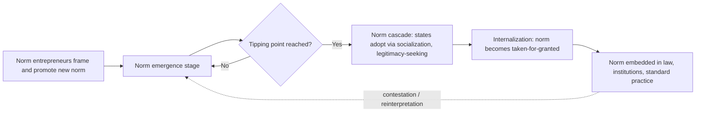

## Constructivism and the Role of Norms and Ideas

### Overview

Constructivism is an IR theoretical approach holding that the international system is not a fixed material structure but a social construction — built and continuously reproduced through shared ideas, norms, identities, and intersubjective understandings among actors. Where Neorealism and Neoliberal Institutionalism share a rationalist, materialist ontology (treating state interests as exogenously given and focusing on how material power or institutional incentives shape strategic behavior), Constructivism asks a prior question: where do those interests and identities come from in the first place? Its central claim, most closely associated with Alexander Wendt, is that "anarchy is what states make of it" — anarchy has no inherent logic; its meaning and consequences are constituted by the shared understandings states develop through interaction.

### Intellectual Lineage

- Emerges in the late 1980s–1990s as part of the broader "reflectivist" or "post-positivist" challenge to rationalist IR theory, alongside (but distinct from) critical theory, poststructuralism, and feminist IR
- Draws on sociological theory, particularly symbolic interactionism (George Herbert Mead) and structuration theory (Anthony Giddens), which hold that social structures and agents mutually constitute each other
- Nicholas Onuf coined the term "constructivism" in IR in *World of Our Making* (1989)
- Alexander Wendt's *Anarchy is What States Make of It* (1992, *International Organization*) and *Social Theory of International Politics* (1999) are the field-defining texts, establishing "thin" or conventional constructivism as a rigorous alternative to rationalism
- Emerged partly as an explanatory response to the end of the Cold War, an outcome that both Neorealism and Neoliberal Institutionalism struggled to anticipate or fully explain, since neither theory's material or institutional variables predicted the Soviet Union's ideational and identity-driven transformation

### Core Theoretical Claims

**Key Points**

- **Mutual constitution of agents and structures**: Social structures (norms, identities, institutions) shape actor behavior, but actors also reproduce or transform those structures through their practices — a two-way, recursive relationship, not the one-way material determinism of realism
- **Ideas matter independently of material power**: Beliefs, norms, and identities are not simply epiphenomenal reflections of material capabilities; they causally and constitutively shape how states interpret their material environment and define their interests
- **Identity precedes interest**: A state's interests are not given prior to interaction; they are formed through the state's identity, which is itself socially constructed through interaction with other states
- **Anarchy is indeterminate**: Unlike Neorealism, which treats anarchy as inherently productive of self-help competition, Wendt argues anarchy can produce multiple "cultures" (Hobbesian, Lockean, Kantian) depending on the shared understandings states develop
- **Norms diffuse and evolve through social processes**: International norms are not simply imposed by powerful states but emerge, spread, and become internalized through processes of persuasion, socialization, and contestation

### Wendt's Three Cultures of Anarchy

| Culture | Logic | Characteristic Relations | Representative Historical Analogy |
| --- | --- | --- | --- |
| Hobbesian | Enemy | War of all against all; survival at stake | Early modern European interstate warfare |
| Lockean | Rival | Competitive but rule-bound; sovereignty mutually recognized | Post-Westphalian state system (18th–19th c.) |
| Kantian | Friend | Non-violence, mutual aid, collective security | Contemporary relations among liberal-democratic allies |

**Key Points**

- These are not fixed stages of historical progress but analytically distinct equilibria — an international system can shift between cultures as shared understandings change
- The transition between cultures is driven by processes of identity change, not simply by shifts in the material balance of power

### The Norm Life Cycle (Finnemore and Sikkink)

Martha Finnemore and Kathryn Sikkink's *International Norm Dynamics and Political Change* (1998) provides the standard analytic model for how norms emerge and spread:

1. **Norm emergence**: "Norm entrepreneurs" (individuals, NGOs, epistemic communities) actively promote a new norm, often using organizational platforms to frame the issue and generate attention
2. **Norm cascade**: Once a critical mass of states adopts the norm (a "tipping point"), a dynamic of imitation and socialization takes hold; states adopt the norm partly out of a desire for legitimacy, esteem, or conformity rather than pure material calculation
3. **Internalization**: The norm becomes so widely accepted that it is taken for granted, no longer openly debated, and achieves a "taken-for-granted" quality embedded in institutional and legal frameworks

**Example**

The prohibition on chemical weapons use illustrates the full cycle: early norm entrepreneurship following WWI atrocities, codification in the 1925 Geneva Protocol, a slow cascade through Cold War arms control diplomacy, and eventual near-universal internalization via the Chemical Weapons Convention (1993/1997) — to the point that chemical weapons use is now treated as a taken-for-granted taboo rather than merely a treaty obligation, generating strong international condemnation even from non-signatory contexts.

### Thin vs. Thick Constructivism

| Variant | Core Commitment | Representative Scholars | Relationship to Rationalism |
| --- | --- | --- | --- |
| Conventional / "Thin" Constructivism | Retains a scientific, positivist epistemology; treats norms/identity as variables that can be studied causally alongside material factors | Wendt, Finnemore, Katzenstein | Bridge-building; often called a "via media" between rationalism and reflectivism |
| Critical / "Thick" Constructivism | Rejects positivist epistemology; focuses on discourse, power/knowledge, and the contingency of all social categories | Closely overlaps with poststructuralist and critical IR theory (e.g., some readings of Onuf) | Largely incommensurable with rationalist methodology |

[Unverified] The precise boundary between "thin" constructivism and poststructuralism is contested within the literature itself, and some scholars classify individual works differently depending on their methodological emphasis.

### Constructivism vs. Rationalist Theories (Comparative Framework)

| Dimension | Constructivism | Neorealism | Neoliberal Institutionalism |
| --- | --- | --- | --- |
| Ontology | Social/ideational | Material | Material (with institutional variables) |
| Source of state interests | Endogenous — constructed through identity/interaction | Exogenous — given by anarchy and survival imperative | Exogenous — given, but pursued through cooperation |
| View of anarchy | Indeterminate; socially constructed meaning | Determinative of self-help behavior | Constraining but manageable via institutions |
| Role of norms/institutions | Constitutive (shape what actors *are*) | Epiphenomenal or regulative at most | Regulative (shape behavior, not identity) |
| Explanatory focus | Identity formation, norm diffusion, socialization | Power distribution, balancing | Cooperation mechanisms, transaction costs |

### Key Concepts and Mechanisms

- **Intersubjectivity**: Meanings and understandings that exist not in individual minds alone but are shared and reproduced through social interaction (e.g., the shared understanding that certain weapons are "illegitimate")
- **Securitization** (Copenhagen School — Buzan, Wæver, de Wilde): A speech-act process by which an issue is discursively framed as an existential threat, thereby justifying extraordinary measures outside normal political procedure; illustrates how threats are not simply objective material facts but are constructed through discourse
- **Epistemic communities** (Peter Haas): Networks of knowledge-based experts who influence policy by supplying authoritative understandings of complex problems (e.g., climate scientists shaping international environmental regimes)
- **Strategic culture**: The idea that states develop persistent, historically rooted, identity-linked preferences about the use of force that are not reducible to material capability alone
- **Socialization**: The process through which international actors internalize the norms and practices of a group to which they belong or aspire to belong (e.g., accession states adopting EU normative standards prior to membership)

### Diagram: Mutual Constitution of Structure and Agency (svg_diagram)

<svg xmlns="http://www.w3.org/2000/svg" viewBox="0 0 700 340">
\<style\>
.title { font: bold 16px sans-serif; fill: #1a1a1a; }
.label { font: bold 13px sans-serif; fill: #ffffff; }
.small { font: 11px sans-serif; fill: #333; }
.circleA { fill: #4a7c59; stroke: #1a1a1a; stroke-width: 1.5; }
.circleB { fill: #8b5a2b; stroke: #1a1a1a; stroke-width: 1.5; }
.arrowtext { font: 11px sans-serif; fill: #1a1a1a; }
\</style\>
<text x="350" y="28" text-anchor="middle" class="title">Mutual Constitution: Structure and Agency (svg_diagram)</text>
<circle cx="200" cy="180" r="90" class="circleA" />
<text x="200" y="175" text-anchor="middle" class="label">Social Structure</text>
<text x="200" y="193" text-anchor="middle" class="label">(norms, ideas,</text>
<text x="200" y="211" text-anchor="middle" class="label">shared meanings)</text>
<circle cx="500" cy="180" r="90" class="circleB" />
<text x="500" y="175" text-anchor="middle" class="label">Agents</text>
<text x="500" y="193" text-anchor="middle" class="label">(states, identities,</text>
<text x="500" y="211" text-anchor="middle" class="label">interests)</text>
<path d="M 290 150 C 350 120, 350 120, 410 150" fill="none" stroke="#1a1a1a" stroke-width="2" marker-end="url(#arrow1)" />
<text x="350" y="110" text-anchor="middle" class="arrowtext">shapes / constitutes interests</text>
<path d="M 410 210 C 350 245, 350 245, 290 210" fill="none" stroke="#1a1a1a" stroke-width="2" marker-end="url(#arrow2)" />
<text x="350" y="270" text-anchor="middle" class="arrowtext">reproduces / transforms through practice</text>
</svg>

### Empirical Applications

- **End of the Cold War**: Frequently cited as constructivism's strongest empirical vindication — the transformation was driven substantially by Gorbachev-era "new thinking," a shift in Soviet elite identity and ideas about security, rather than by a change in the material balance of power, which arguably favored continued Soviet military posture
- **Humanitarian intervention and R2P (Responsibility to Protect)**: The emergence and spread of R2P as an international norm following the 1990s (Rwanda, Bosnia) illustrates norm entrepreneurship (advocacy by NGOs and mid-sized states) and cascading adoption at the UN World Summit (2005)
- **European identity formation**: EU integration is analyzed by constructivists not merely as institutional cooperation (the institutionalist reading) but as a process constructing a shared European identity that reshapes what "national interest" means for member states
- **Anti-colonial and sovereignty norms**: The rapid, near-universal delegitimization of colonialism after WWII is treated as a norm cascade — decolonization proceeded faster and more completely than material-power explanations alone would predict, given that many colonial powers retained substantial military superiority over their colonies

### Critiques of Constructivism

- **Under-theorized power**: Critics (including some critical theorists) argue mainstream/thin constructivism underplays how power operates in norm formation — whose ideas become dominant norms is not a neutral process
- **Indeterminacy problem**: If interests and identities are endogenous and constructed, constructivism can struggle to generate ex ante predictions, leading to charges that its explanations are often more convincing in retrospect than in forecasting
- **Rationalist critique**: Scholars like Jeffrey Legro and others note that constructivism sometimes struggles to specify precisely when norms will be causally decisive versus when material or institutional incentives will override normative considerations
- **Relationship to agency**: Structuration-theory-derived approaches face a persistent methodological challenge in cleanly separating the causal weight of structure versus agent choice, since the theory posits they are mutually constitutive by design

### Relevance to Diplomatic Leadership

- **Norm entrepreneurship as a leadership strategy**: Diplomatic leaders who understand the norm life cycle can deliberately position their state or coalition as norm entrepreneurs, shaping emerging international standards (human rights, environmental protection, technology governance) before they solidify, rather than merely reacting to established rules
- **Identity and legitimacy in negotiation**: Effective diplomacy often depends on understanding how counterpart states' self-conceptions (great power, non-aligned, post-colonial, middle power) shape their negotiating positions independently of raw material interest calculations
- **Framing and securitization**: Leadership involves discursive skill — how an issue is framed (as existential threat, humanitarian concern, economic opportunity) materially affects which policy responses become politically available, a direct application of securitization theory
- **Socialization in multilateral settings**: Diplomats operating within international organizations often engage in explicit socialization strategies, seeking to shift counterpart states' normative frameworks through sustained engagement, mentorship, and reputational incentives rather than coercion or side payments

**Next Steps**

- Wendt's *Social Theory of International Politics* (in-depth textual analysis)
- The Copenhagen School and Securitization Theory
- Norm Entrepreneurs and the Responsibility to Protect (R2P) Case Study
- Critical Theory and Poststructuralism in International Relations
- Feminist International Relations Theory
- Epistemic Communities and Global Environmental Governance
- Comparing Constructivism and the English School
- Strategic Culture: Comparative State Case Studies