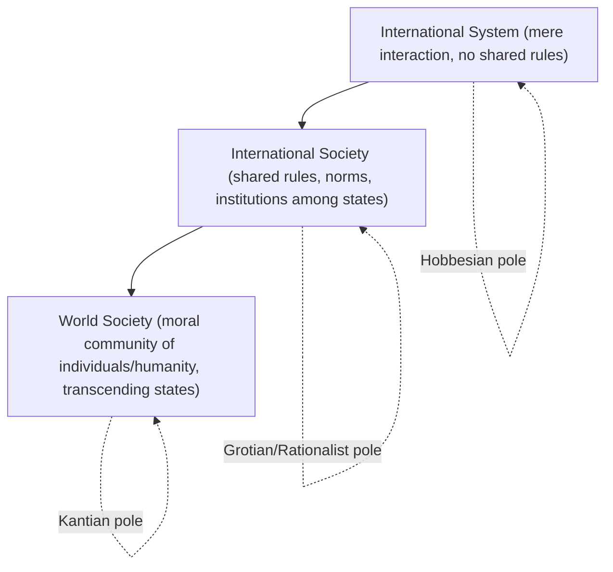

## The English School and International Society

### Overview

The English School (also called the "International Society" or "Rationalist" tradition) is an IR theoretical approach that positions itself deliberately as a middle path (*via media*) between Realism and Liberalism/Constructivism. Its central claim is that states, despite operating in an anarchic system, form an **international society** — not merely a system of mechanically interacting units (as realism emphasizes) nor a fully cooperative community bound by shared identity (as strong constructivism or liberal internationalism might suggest), but a society of states bound together by shared rules, institutions, and a common interest in maintaining order. The School is distinguished by its historical, interpretive, and often normatively engaged methodology, in contrast to the rationalist positivism of Neorealism and Neoliberal Institutionalism.

### Intellectual Lineage

- Emerges from the "British Committee on the Theory of International Politics," founded in 1958-59, chaired initially by Herbert Butterfield and later Martin Wight
- Hedley Bull's *The Anarchical Society* (1977) is the field-defining text, systematizing the School's core concepts
- Martin Wight's lectures, later published as *International Theory: The Three Traditions* (1991), established the tripartite framework (Realism/Hobbes, Rationalism/Grotius, Revolutionism/Kant) that structures much English School analysis
- The name "English School" was coined retrospectively by Roy Jones in a 1981 article (somewhat critically), though many core members were not English (e.g., Bull was Australian)
- Later scholars (Barry Buzan, Tim Dunne, Robert Jackson) revived and systematized the School from the 1990s onward, formalizing its concepts for broader comparative use against Neorealism and Constructivism

### Wight's Three Traditions

| Tradition | Associated Thinker | Core View of International Politics |
| --- | --- | --- |
| Realism | Hobbes | States exist in a state of war; international politics is a struggle for power and survival |
| Rationalism | Grotius | States form an international society bound by shared rules, law, and mutual recognition, even absent shared values |
| Revolutionism | Kant | States/individuals belong to a broader moral community (world society) transcending state boundaries; emphasis on universal solidarist values |

**Key Points**

- The English School situates itself primarily within the **Rationalist/Grotian** tradition, though internal debates (pluralism vs. solidarism, discussed below) pull individual scholars toward either the Hobbesian or Kantian poles
- This tripartite structure is often used pedagogically to map the English School's relationship to Realism and Liberalism/Cosmopolitanism as adjacent, not identical, positions

### The Three Core Concepts: System, Society, World Society

Bull's central analytical distinction separates three levels of international interaction:

1. **International System**: The minimal condition — merely the interaction and mutual impact of states on each other's decisions, without any necessary shared rules or institutions (closest to the realist/Hobbesian view of "anarchy as mechanical interaction")
2. **International Society**: A group of states that, conscious of certain common interests and common values, form a society in the sense that they conceive themselves bound by a common set of rules and share in the working of common institutions — the School's central analytical object
3. **World Society**: A concept extending beyond the state to encompass individuals, non-state actors, and a shared sense of common humanity, transcending the state-based framework entirely (closest to the Kantian/revolutionist pole)

**Key Points**

- These three concepts are not strictly sequential historical stages but coexisting analytical layers that can operate simultaneously in any given historical period, in varying strengths
- Contemporary English School scholarship (particularly Buzan's work) has argued world society deserves more sustained analytical attention than Bull originally gave it, since globalization has strengthened transnational and individual-level dynamics

### The Institutions of International Society

Bull identified a set of primary institutions that sustain order within international society. These are not formal organizations (like the UN) but enduring practices and norms:

- **Balance of power**: A mechanism (not merely a realist power-political tool, but a recognized institution of society) that prevents any single state from dominating the system
- **International law**: A body of rules that, while lacking centralized enforcement, is nonetheless generally observed and provides a shared normative language for interstate conduct
- **Diplomacy**: The institutionalized practice of communication and negotiation between states, providing continuity and predictability
- **War**: Paradoxically treated as an institution of international society in Bull's framework — a regulated practice (via laws of war, just war doctrine) rather than simply anarchic violence
- **The role of great powers**: Great powers are understood to bear special managerial responsibilities for maintaining international order (a concept later extended by scholars examining "great power management" as a distinct institution)

[Unverified] Later English School scholars (e.g., Buzan) have proposed expanded or revised institutional lists (adding sovereignty, territoriality, nationalism, the market, and environmental stewardship as candidate primary institutions), and there is no single canonical, universally agreed list beyond Bull's original core five.

### Pluralism vs. Solidarism: The Central Internal Debate

| Dimension | Pluralism | Solidarism |
| --- | --- | --- |
| View of shared values | Minimal — states need only agree on coexistence rules (sovereignty, non-intervention) | Thicker — states share substantive values (human rights, justice) that can override sovereignty |
| Stance on intervention | Strongly favors non-intervention and sovereign equality | More permissive of humanitarian intervention when core values are violated |
| Representative scholars | Bull (in his more cautious moods), Robert Jackson | Nicholas Wheeler, Tim Dunne |
| Relationship to World Society | Minimizes its relevance; society is a society of states, not persons | Sees world society as increasingly central and normatively significant |

**Example**

The debate over humanitarian intervention in the 1990s (Rwanda, Kosovo, later crystallizing into the Responsibility to Protect doctrine) is the paradigmatic empirical battleground for pluralism vs. solidarism: pluralists worry that permitting intervention on human-rights grounds erodes the non-intervention norm that itself underpins international order and could be abused as a pretext by powerful states, while solidarists argue that a society of states claiming legitimacy must be willing to act when atrocities occur, since order without justice is an incomplete conception of international society.

### English School vs. Neorealism and Neoliberal Institutionalism (Comparative Framework)

| Dimension | English School | Neorealism | Neoliberal Institutionalism |
| --- | --- | --- | --- |
| Core unit of analysis | International society (states bound by shared rules/institutions) | States as unitary rational actors under anarchy | States + institutions as cooperation-facilitators |
| Methodology | Historical, interpretive, often normative | Positivist, structural, parsimonious | Positivist, rational-choice, game-theoretic |
| View of order | Order emerges from shared normative and institutional practices, not just power balancing or self-interest | Order (such as it exists) emerges from power balancing | Order emerges from institutions reducing transaction costs |
| Treatment of norms | Constitutive of society itself; central analytical object | Largely epiphenomenal to power | Instrumental/regulative — tools states use rationally |
| Normative engagement | Explicitly engages questions of international ethics/order vs. justice | Largely eschews normative prescription | Largely eschews normative prescription |

**Key Points**

- The English School is often distinguished from Constructivism by methodology rather than substance: both emphasize norms, rules, and shared understandings, but the English School relies more heavily on historical and interpretive (hermeneutic) method, while mainstream Constructivism (particularly Wendt's "thin" variant) adopts a more explicitly scientific, causal-variable approach
- [Inference] Some scholars treat the English School and Constructivism as close cousins or even overlapping traditions on substantive grounds, though English School scholars themselves have often resisted full absorption into the constructivist label, citing the School's distinct historical-normative lineage predating constructivism by decades

### Expansion of International Society

A major English School research program examines how international society, originally a European (Christian, then "civilized") club, expanded globally through decolonization to become genuinely universal:

- **Standard of civilization**: The 19th-century criterion by which non-European polities were judged fit (or unfit) for full membership in international society, historically used to justify unequal treaties and colonial domination
- **Decolonization as socialization**: Post-WWII decolonization is analyzed as newly independent states being socialized into (and simultaneously contesting and reshaping) the norms of international society, notably asserting sovereign equality and non-intervention as defenses against continued great-power interference
- **Contemporary "revolt against the West"**: Some English School scholarship (e.g., Bull and Adam Watson's edited volume *The Expansion of International Society*, 1984) frames the post-colonial period as newly incorporated states pushing back against Western-derived institutional norms while still operating within the broader shared framework of international society

### Diagram: The English School's Middle Path (svg_diagram)

<svg xmlns="http://www.w3.org/2000/svg" viewBox="0 0 720 300">
\<style\>
.title { font: bold 16px sans-serif; fill: #1a1a1a; }
.label { font: bold 13px sans-serif; fill: #ffffff; }
.small { font: 11px sans-serif; fill: #1a1a1a; }
.boxL { fill: #a13d3d; stroke: #1a1a1a; stroke-width: 1.5; }
.boxM { fill: #34568B; stroke: #1a1a1a; stroke-width: 1.5; }
.boxR { fill: #4a7c59; stroke: #1a1a1a; stroke-width: 1.5; }
\</style\>
<text x="360" y="26" text-anchor="middle" class="title">Wight's Triad and the English School's Position (svg_diagram)</text>
<rect x="30" y="80" width="180" height="90" rx="8" class="boxL" />
<text x="120" y="110" text-anchor="middle" class="label">Realism</text>
<text x="120" y="128" text-anchor="middle" class="label">(Hobbes)</text>
<text x="120" y="150" text-anchor="middle" class="small" fill="#fff">System — war of all</text>
<rect x="270" y="80" width="180" height="90" rx="8" class="boxM" />
<text x="360" y="110" text-anchor="middle" class="label">Rationalism</text>
<text x="360" y="128" text-anchor="middle" class="label">(Grotius)</text>
<text x="360" y="150" text-anchor="middle" class="small" fill="#fff">Society — shared rules</text>
<rect x="510" y="80" width="180" height="90" rx="8" class="boxR" />
<text x="600" y="110" text-anchor="middle" class="label">Revolutionism</text>
<text x="600" y="128" text-anchor="middle" class="label">(Kant)</text>
<text x="600" y="150" text-anchor="middle" class="small" fill="#fff">World society — humanity</text>
<line x1="210" y1="125" x2="270" y2="125" stroke="#1a1a1a" stroke-width="2" />
<line x1="450" y1="125" x2="510" y2="125" stroke="#1a1a1a" stroke-width="2" />

<text x="360" y="210" text-anchor="middle" class="small" font-weight="bold">English School anchors primarily in the Rationalist (Grotian) middle,</text>

<text x="360" y="228" text-anchor="middle" class="small" font-weight="bold">with internal pluralist/solidarist pull toward each pole</text>

</svg>

### Empirical Applications

- **United Nations as institutionalized international society**: The UN Charter system (sovereign equality, non-intervention in Article 2(4), collective security exceptions) is read by English School scholars as a codification of society-of-states norms rather than merely a power-political arrangement or a rational cooperation-facilitator
- **The Concert of Europe (1815-1854)**: A frequently cited historical case of great-power management as an institution of international society, where major powers coordinated to preserve systemic order following the Napoleonic Wars
- **Responsibility to Protect (R2P)**: Analyzed as a solidarist challenge to pluralist non-intervention norms, testing how far international society's shared values can extend before threatening the sovereignty-based order that underpins the society itself
- **Post-Cold War humanitarian interventions (Kosovo 1999, Libya 2011)**: Used as case studies to examine the practical limits and contestations of solidarist claims against entrenched pluralist norms of sovereignty and non-intervention

### Critiques of the English School

- **Conceptual vagueness**: Critics argue the "international society" concept, and its constituent institutions, are defined loosely enough to accommodate almost any historical case, weakening its falsifiability and predictive power
- **Eurocentrism**: The School's historical narrative (particularly the "expansion of international society" thesis) has been criticized by postcolonial scholars for implicitly centering European international society as the norm against which non-European polities are judged, echoing the very "standard of civilization" logic it critically examines
- **Underdeveloped methodology relative to rationalist theories**: Compared to the more formalized, parsimonious models of Neorealism and Neoliberal Institutionalism, the English School's interpretive-historical method is sometimes criticized as less rigorous or less generative of testable propositions
- **Overlap and redundancy critique**: Some scholars (particularly rationalists) argue the School's core insights are largely absorbed by or redundant with Constructivism's more methodologically explicit treatment of norms and identity

### Relevance to Diplomatic Leadership

- **Order vs. justice as a leadership tension**: The pluralism-solidarism debate maps directly onto a recurring practical dilemma for diplomatic leaders — when to prioritize systemic stability and non-intervention norms versus when to act on humanitarian or justice-based imperatives, even at the cost of destabilizing established sovereignty norms
- **Great power management responsibilities**: Leaders representing major powers operate within an implicit expectation (per the English School's institutional framework) that they bear special responsibility for maintaining systemic order, shaping how their unilateral or coalition actions are received by the broader society of states
- **Diplomacy as a primary institution**: The School's framing of diplomacy itself as a constitutive institution of international society (not merely a tool) underscores why sustained diplomatic engagement, even with adversarial states, is treated as intrinsically valuable for preserving systemic order, independent of any single negotiation's outcome
- **Legitimacy and socialization in multilateral leadership**: Understanding how new or rising powers seek recognition and legitimacy within international society (echoing the historical "expansion of international society" dynamic) helps diplomatic leaders anticipate the normative claims and grievances of states seeking greater standing in existing institutions

**Next Steps**

- Hedley Bull's *The Anarchical Society*: Detailed Textual Analysis
- Pluralism vs. Solidarism: Case Studies in Humanitarian Intervention
- The Expansion of International Society and Postcolonial Critiques
- Comparing the English School and Constructivism
- Great Power Management and the Concert of Europe
- The Responsibility to Protect (R2P): Normative Origins and Application
- Martin Wight's Three Traditions: Extended Framework
- Standard of Civilization: Historical and Contemporary Debates