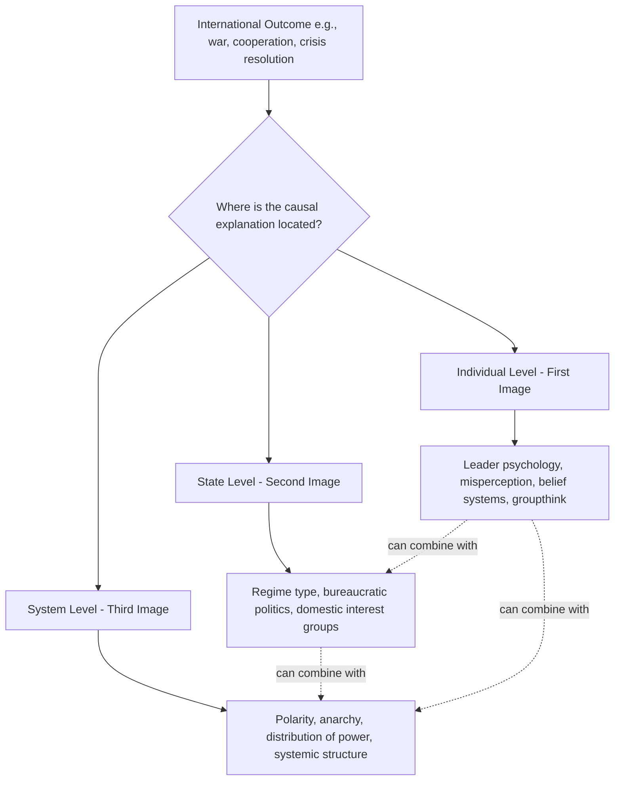

## Levels of Analysis: Individual, State, and System

### Overview

The levels-of-analysis framework is a foundational methodological tool in International Relations, used to organize explanations of state behavior and international outcomes according to where the causal action is located. Rather than a substantive theory in itself (unlike Realism, Liberalism, or Constructivism), it is an analytic scaffold that any of those theories can be mapped onto, clarifying what kind of variable a given explanation privileges — something happening inside an individual decision-maker's mind, inside a state's domestic structure, or in the structure of the international system itself. The framework was formally introduced to the discipline by J. David Singer in his 1961 article *The Level-of-Analysis Problem in International Relations*, building on Kenneth Waltz's earlier tripartite scheme in *Man, the State, and War* (1959).

### Intellectual Origins

- **Kenneth Waltz, *Man, the State, and War* (1959)**: Organized existing explanations for the causes of war into three "images" — the individual, the state, and the international system — establishing the conceptual ancestor of the levels-of-analysis framework
- **J. David Singer (1961)**: Reframed Waltz's images explicitly as a methodological "level-of-analysis problem," highlighting that different levels can generate different, sometimes contradictory, explanations for the same event, and that scholars must be explicit about which level they are operating at to avoid conflating distinct causal claims
- **Later refinements**: Subsequent scholarship has proposed additional levels (e.g., the bureaucratic/organizational level, the regional level, the global/systemic level distinguished from the international-structural level), but Waltz's original tripartite division remains the standard reference point in most IR curricula

### The Three Levels

**1. Individual Level (First Image)**

Explanations located here attribute international outcomes to the characteristics, psychology, beliefs, misperceptions, or decisions of specific individual leaders and decision-makers.

- **Key mechanisms**: Cognitive biases and misperception (Robert Jervis's *Perception and Misperception in International Politics*, 1976), personality and leadership style, belief systems and operational codes, group psychology and "groupthink" (Irving Janis), emotional and psychological states of leaders
- **Representative claims**: The outbreak of WWI is sometimes partly attributed to the personalities and miscalculations of specific monarchs and diplomats; Cold War crisis outcomes (e.g., the Cuban Missile Crisis) are analyzed through the individual decision-making psychology of Kennedy and Khrushchev
- **Strengths**: Captures agency, contingency, and the role of specific human judgment/error that structural theories abstract away
- **Limitations**: Difficult to generalize into testable theory across many cases; risks reducing complex systemic outcomes to idiosyncratic individual factors; struggles to explain broad, recurring patterns across different leaders and eras

**2. State (or Societal/Domestic) Level (Second Image)**

Explanations located here attribute international outcomes to characteristics internal to states — their political regime type, domestic institutions, bureaucratic politics, economic structure, culture, or societal interest-group dynamics.

- **Key mechanisms**: Regime type (democratic peace theory operates substantially at this level), bureaucratic politics models (Graham Allison's *Essence of Decision*, 1971, analyzing the Cuban Missile Crisis through competing organizational/bureaucratic lenses rather than unitary rational choice), domestic interest-group and lobbying dynamics, national political culture and historical memory, civil-military relations
- **Representative claims**: Democratic peace theory (liberal democracies rarely fight each other) is a canonical second-image argument; Marxist/Leninist theories of imperialism, which trace war to the internal dynamics of capitalist economies seeking外 markets, also operate substantially at this level
- **Strengths**: Explains variation in behavior among states facing similar systemic pressures, since not all states respond identically to anarchy or power distribution
- **Limitations**: Can struggle to explain why states with very different domestic structures sometimes behave similarly under similar systemic pressures (a core Waltzian objection)

**3. System (International/Structural) Level (Third Image)**

Explanations located here attribute international outcomes to the structure of the international system itself — the distribution of power (polarity), the condition of anarchy, and the material or normative structure of the system as a whole, independent of the internal characteristics of individual states.

- **Key mechanisms**: Anarchy and self-help logic (Neorealism), polarity and its stability implications (bipolarity vs. multipolarity vs. unipolarity debates), balance-of-power dynamics, systemic power transitions (Power Transition Theory, Hegemonic Stability Theory)
- **Representative claims**: Kenneth Waltz's *Theory of International Politics* (1979) is the paradigmatic third-image argument — Waltz explicitly argues that a scientific theory of international politics must be systemic, since state-level and individual-level variation cannot explain the recurring patterns (balancing behavior, war) observed across vastly different states and eras
- **Strengths**: Parsimonious; generates broad, generalizable predictions about recurring patterns across history independent of domestic variation
- **Limitations**: Cannot easily explain variation in behavior among similarly-positioned states, nor account for change originating from domestic or individual-level sources (e.g., the end of the Cold War, which many argue required attention to Soviet domestic/leadership-level change that pure structural theory could not anticipate)

### Comparative Framework

| Dimension | Individual Level | State Level | System Level |
| --- | --- | --- | --- |
| Primary causal locus | Leader psychology, cognition, decision-making | Domestic institutions, regime type, bureaucratic politics | Distribution of power, anarchy, systemic structure |
| Representative theory/scholar | Jervis (misperception), Janis (groupthink), Allison (Model I: rational actor is individual-adjacent) | Democratic peace theory, Allison (Models II/III: bureaucratic/organizational), Marxist-Leninist imperialism | Waltz's Neorealism, Power Transition Theory, Hegemonic Stability Theory |
| Explains variation among states? | Yes, but hard to generalize | Yes — this is its core strength | Poorly — treats states as functionally similar units |
| Explains recurring cross-historical patterns? | Poorly | Partially | Yes — this is its core strength |
| Typical methodology | Psychological/cognitive analysis, case-specific biography | Comparative politics, domestic institutional analysis | Structural/positional analysis, parsimonious modeling |

### Diagram: The Three Levels and Their Relationship

**Key Points**

- The three levels are not mutually exclusive; most sophisticated contemporary IR scholarship deliberately combines levels (a multi-level or "analytically eclectic" approach) rather than insisting on a single-level explanation
- Waltz himself, despite championing systemic theory, acknowledged in *Man, the State, and War* that individual and state-level factors are necessary to explain the immediate causes of any particular war, even while arguing systemic structure explains the permissive conditions that make war a recurring possibility

### Extensions and Refinements

**Allison's Three Models (applied within and across levels)**

Graham Allison's analysis of the Cuban Missile Crisis is frequently used pedagogically to show how a single event can be explained at multiple levels simultaneously:

- **Model I (Rational Actor Model)**: Treats the state as a unitary, rational decision-maker — closest to a systemic/structural framing, since it abstracts away internal state complexity
- **Model II (Organizational Process Model)**: Explains outcomes as the output of standard organizational routines and procedures within government bureaucracies — a state-level explanation
- **Model III (Bureaucratic/Governmental Politics Model)**: Explains outcomes as the result of bargaining and political competition among individual actors and agencies within government — blends individual and state levels

**Additional proposed levels**

- **Bureaucratic/organizational sub-level**: Sometimes treated as a distinct level between individual and state, focusing specifically on organizational routines and inter-agency bargaining
- **Regional level**: Increasingly used to analyze dynamics (e.g., regional security complexes, per Barry Buzan and Ole Wæver's Regional Security Complex Theory) that operate at a scale between the state and the full global system
- **Global/systemic-structural distinction**: Some scholars distinguish the "system" as the full set of interacting units from "structure" (the distribution of capabilities among them), following Waltz's own technical distinction between system and structure in *Theory of International Politics*

### Illustrative Application: Explaining the Outbreak of World War I

| Level | Explanation Offered |
| --- | --- |
| Individual | Kaiser Wilhelm II's impulsive personality and strategic miscalculation; the specific decisions of July 1914 crisis diplomats |
| State | Domestic political pressures within Austria-Hungary and the alliance-driven mobilization dynamics tied to specific national military planning (e.g., the Schlieffen Plan's rigid timetable) |
| System | Multipolar power distribution combined with a rigid alliance structure, producing a systemic "chain-ganging" dynamic in which a regional crisis rapidly escalated into a general war |

**Example**

This case illustrates why scholars generally favor combining levels: a purely systemic explanation (multipolarity plus alliance rigidity) explains why the European system was war-prone in general, but cannot by itself explain why war broke out in the specific summer of 1914 rather than another moment of comparable systemic tension — for that, individual and state-level factors (the assassination of Archduke Franz Ferdinand, specific decision-makers' choices during the July Crisis) are necessary.

### Methodological Cautions

- **Level-of-analysis problem proper (Singer's core point)**: Explanations generated at different levels are not automatically compatible or additive; a scholar must be explicit about which level a given causal claim operates at, since conflating levels can produce confused or contradictory arguments (e.g., attributing a systemic pattern to an individual leader's idiosyncratic choice, or vice versa)
- **Reductionism vs. holism debate**: Waltz's critique of "reductionist" theories (those explaining systemic outcomes purely through unit-level, i.e., state or individual, attributes) versus his own preference for systemic/structural theory remains a live methodological debate; critics (including many neoclassical realists) argue pure structural theory is under-determinative and requires unit-level variables to generate specific predictions
- **Neoclassical Realism as an explicit multi-level synthesis**: Emerging in the 1990s (Gideon Rose, Fareed Zakaria, and others), Neoclassical Realism explicitly combines systemic-level independent variables (distribution of power) with state-level intervening variables (leader perception, domestic institutions, state-society relations) to explain foreign policy outcomes, representing a deliberate methodological bridge across levels

### Relevance to Diplomatic Leadership

- **Diagnostic clarity in crisis analysis**: Diplomatic leaders benefit from explicitly identifying which level (individual counterpart psychology, domestic political constraints of a negotiating partner, or broader systemic power dynamics) is driving a given crisis or negotiation impasse, since the appropriate leadership response differs substantially by level
- **Reading counterpart constraints across levels**: Effective negotiation requires simultaneously assessing an individual counterpart's psychological disposition and negotiating style (individual level), the domestic political pressures and bureaucratic constraints they operate under (state level), and the broader power-structural context shaping what concessions are systemically plausible (system level)
- **Avoiding single-level misattribution**: A common diplomatic leadership error is misattributing a systemically-driven pattern (e.g., recurring great-power rivalry) to an individual leader's personality, or conversely, misreading an individual leader's idiosyncratic choice as reflecting fixed, unchangeable state-level or systemic constraints — the levels-of-analysis framework provides a disciplined check against both errors
- **Multi-level strategy design**: Sophisticated diplomatic strategy often deliberately operates across levels simultaneously — e.g., pursuing systemic-level coalition-building while also tailoring engagement to the specific individual psychology of key counterpart leaders and the domestic political constraints of partner governments

**Next Steps**

- Kenneth Waltz's *Theory of International Politics*: Structural Realism in Depth
- Graham Allison's Three Models and the Cuban Missile Crisis
- Robert Jervis and Misperception in International Politics
- Neoclassical Realism: Synthesizing Systemic and Unit-Level Variables
- Regional Security Complex Theory (Buzan and Wæver)
- The Bureaucratic Politics Model in Foreign Policy Analysis
- Democratic Peace Theory: Individual, State, and Systemic Mechanisms
- Polarity and System Stability: Bipolarity vs. Multipolarity Debates