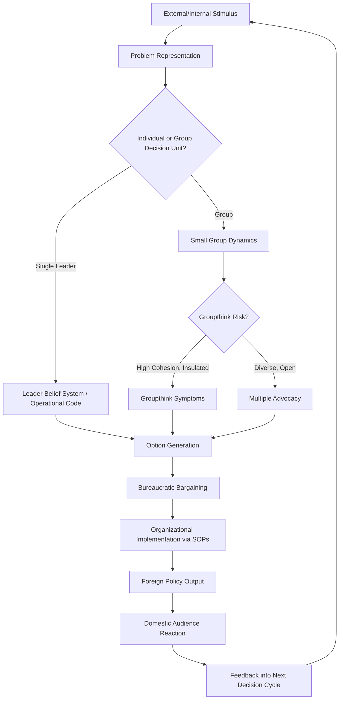

## Foreign Policy Analysis Fundamentals

### Definition and Scope

Foreign Policy Analysis (FPA) is the subfield of International Relations that studies the processes, actors, and decisions behind states' external actions. Unlike systemic theories (neorealism, world-systems theory) that treat states as unitary rational actors, FPA opens the "black box" of the state to examine how individual leaders, bureaucracies, organizational routines, and domestic politics shape foreign policy outputs.

**Key Points**

- FPA is fundamentally an actor-specific theory: it assumes that all explanations of foreign policy ultimately rest on human decision-makers, individually or in groups
- It is inherently multi-level and multi-disciplinary, drawing on psychology, sociology, organizational theory, and political science
- It bridges the agent-structure divide in IR by treating decision-makers as embedded in, but not fully determined by, structural constraints

### Historical Development

**Pre-theoretical Period (1950s)**

Early foreign policy studies were largely descriptive diplomatic histories or realist accounts assuming rational unitary states pursuing national interest.

**The Sprout-Snyder Foundations (1954-1963)**

Richard Snyder, H.W. Bruck, and Burton Sapin's *Decision-Making as an Approach to the Study of International Politics* (1954) is widely regarded as the founding text, introducing decision-making as the central unit of analysis. Harold and Margaret Sprout contributed the concept of the "psycho-milieu" — the idea that decision-makers act on their *perceived* environment rather than objective reality.

**Comparative Foreign Policy Movement (1960s-1970s)**

James Rosenau's 1966 essay "Pre-Theories and Theories of Foreign Policy" attempted to build scientific, generalizable, cross-national theory by identifying variables (genetic, societal, governmental, role, systemic) that could explain foreign policy across different states. This behavioralist, quantitative approach sought law-like propositions but eventually lost momentum due to data limitations and criticism of excessive positivism.

**Cognitive and Psychological Turn (1970s-1980s)**

Graham Allison's *Essence of Decision* (1971), analyzing the Cuban Missile Crisis, introduced three competing models: the Rational Actor Model, the Organizational Process Model, and the Governmental (Bureaucratic) Politics Model. This work demonstrated that identical events could be explained very differently depending on the analytical lens chosen. Irving Janis's *Groupthink* (1972) and Robert Jervis's *Perception and Misperception in International Politics* (1976) further embedded cognitive psychology into FPA.

**Contemporary Pluralism (1990s-present)**

Modern FPA integrates constructivism, gender analysis, role theory, and comparative case-study methods, alongside a partial revival of quantitative "events data" approaches enabled by computational text analysis.

### Core Theoretical Models

**1. Rational Actor Model (RAM)**

Assumes the state acts as a single, rational agent that:

- Identifies the problem
- Ranks goals by value/utility
- Considers available options
- Selects the action that maximizes expected utility

[Inference] In practice, RAM functions more as a useful analytical baseline or null hypothesis than an empirically accurate description, since it abstracts away the internal complexity FPA exists to study.

**2. Organizational Process Model**

Views foreign policy as **output** rather than **choice** — the product of large organizations (military branches, foreign ministries, intelligence agencies) executing pre-established Standard Operating Procedures (SOPs).

- Decisions are constrained by existing organizational repertoires ("programs")
- Change tends to be incremental rather than innovative
- Organizations "satisfice" (seek adequate, not optimal, solutions) rather than optimize, per Herbert Simon's bounded rationality concept

**3. Governmental/Bureaucratic Politics Model**

Captures the famous dictum "where you stand depends on where you sit." Policy emerges from bargaining, negotiation, and competition among multiple actors with distinct organizational interests, personal stakes, and differential bargaining power (resources, access to the leader, coalition-building skill).

**4. Poliheuristic Theory**

Developed by Alex Mintz, this two-stage model argues decision-makers first eliminate options that would be politically unacceptable (avoiding domestic political loss), then apply more rational/analytic cost-benefit calculations to the remaining alternatives.

**5. Prospect Theory in FPA**

Adapted from Kahneman and Tversky's behavioral economics, prospect theory holds that decision-makers evaluate options relative to a reference point and are loss-averse: they take greater risks to avoid losses than to achieve equivalent gains. This has been applied to explain seemingly irrational risk-taking by leaders defending the status quo.

### Levels of Analysis

FPA typically operates across nested levels, adapted from Kenneth Waltz's "images" framework:

| Level | Focus | Example Variables |
| --- | --- | --- |
| Individual | Leader psychology, beliefs, personality | Operational code, cognitive style, health |
| Group | Small-group dynamics | Groupthink, polythink, advisory systems |
| Bureaucratic/Organizational | Agency interests and routines | SOPs, inter-agency rivalry |
| Societal/Domestic | Public opinion, interest groups, media | Two-level games, audience costs |
| Systemic | International structure | Polarity, alliance structure, power distribution |

### Key Analytical Concepts

**Operational Code Analysis**

Developed by Nathan Leites and refined by Alexander George, this technique infers a leader's belief system about the nature of politics and the efficacy of different means through systematic content analysis of speeches and writings.

**Cognitive Mapping**

A method for representing a decision-maker's belief structure as a network of causal assertions ("if X then Y"), used to predict how new information will be processed and what options are likely to be considered.

**Analogical Reasoning**

Leaders frequently reason by analogy to historic events (e.g., "Munich," "Vietnam") — a heuristic that can distort judgment when the current situation actually differs from the historical analogy in decision-relevant ways.

**Groupthink**

Janis's concept describing a mode of thinking in cohesive in-groups where the desire for unanimity overrides realistic appraisal of alternatives, producing symptoms such as illusion of invulnerability, self-censorship, and pressure on dissenters.

**Two-Level Games**

Robert Putnam's model conceptualizes international negotiation as simultaneous bargaining at the international table (Level I) and the domestic table (Level II), where a negotiator's "win-set" (the range of domestically ratifiable agreements) constrains international outcomes.

**Audience Costs**

James Fearon's concept: domestic publics can punish leaders for making foreign threats and then failing to follow through, giving democratic leaders a credible signaling mechanism unavailable to autocracies. [Unverified] The empirical robustness of audience cost effects across regime types remains contested in the quantitative IR literature.

### Methodological Approaches

- **Case Study Method**: In-depth process tracing of individual decision episodes (e.g., Cuban Missile Crisis, Iraq War 2003)
- **Comparative Case Studies**: Structured, focused comparison across a small number of cases to test hypotheses (George and Bennett)
- **Content Analysis**: Systematic coding of speeches, statements, and documents (used in operational code and Leadership Trait Analysis)
- **Events Data Analysis**: Quantitative coding of interactions between state dyads (e.g., cooperation/conflict scales), historically via datasets like WEIS and COPDAB, now via machine-coded projects like GDELT and ICEWS
- **Leadership Trait Analysis (LTA)**: Margaret Hermann's framework coding leaders on traits (belief in ability to control events, need for power, distrust of others, in-group bias, task/relationship focus) from spontaneous verbal material

### Worked Example: Applying Allison's Models

Consider a hypothetical scenario: State A imposes economic sanctions on State B following a border skirmish.

- **RAM lens**: State A calculated that the cost of sanctions to State B exceeds the value State B places on the disputed territory, making sanctions a rational coercive tool.
- **Organizational Process lens**: The sanctions package matches almost exactly the standard sanctions "menu" the finance ministry has used in the past three unrelated crises — SOPs, not situational calculation, drove the response.
- **Bureaucratic Politics lens**: The foreign ministry favored negotiation; the defense ministry favored a stronger response; sanctions emerged as the compromise position that the more hawkish coalition (defense + a domestically influential legislature) could win against the foreign ministry's preference.

This triangulation illustrates FPA's core method: the same observable action supports multiple, non-mutually-exclusive causal stories depending on which level and model the analyst applies.

### Decision-Making Process Flow

### Diagram: Levels of Analysis Nesting (svg_diagram)

<svg xmlns="http://www.w3.org/2000/svg" viewBox="0 0 640 400">
<text x="320" y="25" font-size="16" font-weight="bold" text-anchor="middle" fill="#1a1a1a">Nested Levels of FPA Analysis (svg_diagram)</text>
<circle cx="320" cy="230" r="170" fill="none" stroke="#2c3e50" stroke-width="2" />
<circle cx="320" cy="230" r="135" fill="none" stroke="#34495e" stroke-width="2" />
<circle cx="320" cy="230" r="100" fill="none" stroke="#7f8c8d" stroke-width="2" />
<circle cx="320" cy="230" r="65" fill="none" stroke="#95a5a6" stroke-width="2" />
<circle cx="320" cy="230" r="30" fill="#ecf0f1" stroke="#2c3e50" stroke-width="2" />
<text x="320" y="234" font-size="11" text-anchor="middle" fill="#1a1a1a">Individual</text>
<text x="320" y="185" font-size="11" text-anchor="middle" fill="#1a1a1a">Group</text>
<text x="320" y="140" font-size="11" text-anchor="middle" fill="#1a1a1a">Bureaucratic</text>
<text x="320" y="105" font-size="11" text-anchor="middle" fill="#1a1a1a">Societal/Domestic</text>
<text x="320" y="70" font-size="11" text-anchor="middle" fill="#1a1a1a">Systemic/International</text>
</svg>

### Common Pitfalls in FPA Research

- **Overreliance on a single level of analysis**: attributing all explanatory power to leader psychology while ignoring bureaucratic or systemic constraints, or vice versa
- **Hindsight bias in case selection**: choosing cases because the outcome is already known, then reverse-engineering the "decisive" variable
- **Conflating description with explanation**: cataloging what happened in a decision process without specifying the causal mechanism linking process to outcome
- **Neglecting non-decisions**: FPA can overemphasize dramatic crisis decisions while underexamining the routinized, non-decisions that constitute the bulk of actual foreign policy

### Contemporary Extensions

- **Role Theory**: States/leaders adopt "national role conceptions" (e.g., regional leader, bridge power, faithful ally) that structure which policies are seen as appropriate
- **Gender and FPA**: Examines how gendered assumptions about leadership, aggression, and diplomacy shape both decision-making processes and scholarly analysis of them
- **Neuroscience and FPA**: [Speculation] Emerging work applies neuroscientific findings on stress, risk perception, and decision fatigue to crisis decision-making, though this remains an early-stage research frontier with limited consensus on methodology
- **Computational/AI-assisted FPA**: Large-scale text analysis and machine learning are increasingly used for automated operational code coding and events data generation, accelerating what was once labor-intensive manual content analysis

**Related Topics**

- Graham Allison's Three Models of Decision-Making (deep dive)
- Groupthink and Small-Group Decision Pathologies
- Two-Level Games and Domestic-International Linkage
- Prospect Theory and Risk Behavior in Crisis Diplomacy
- Leadership Trait Analysis and Operational Code Construction
- Bureaucratic Politics in Crisis Case Studies (Cuban Missile Crisis, Iraq 2003)
- Role Theory and National Role Conceptions
- Events Data Analysis and Computational Text Methods in IR