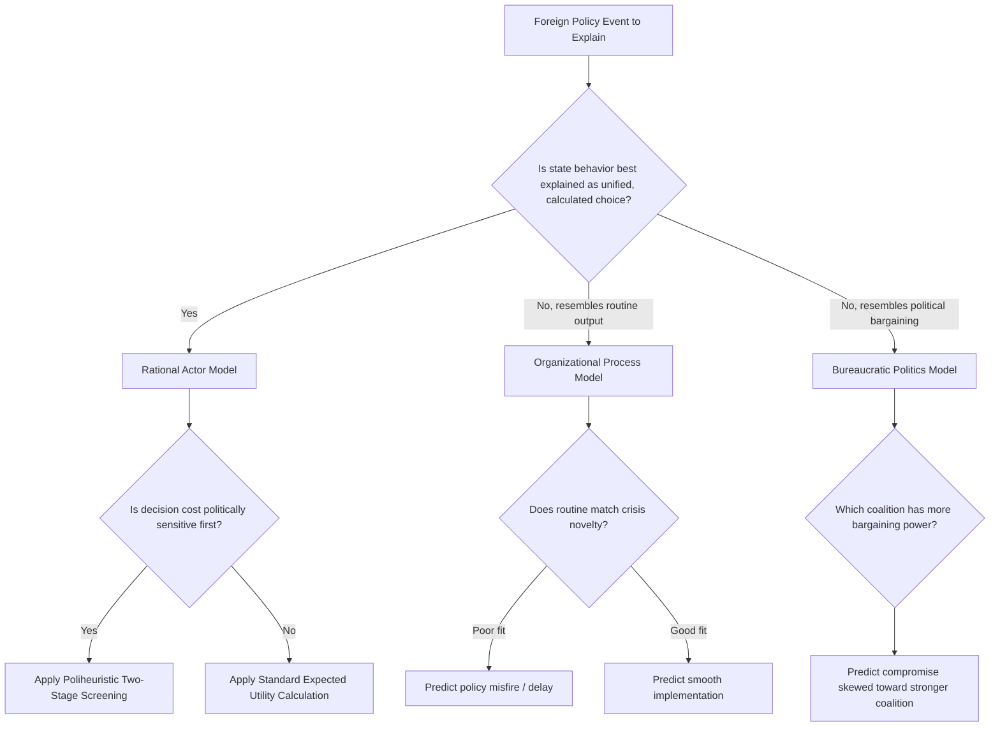

## Foreign Policy Decision-Making Models

### Overview

Foreign Policy Decision-Making (FPDM) models are the analytic frameworks used to explain *how* states arrive at foreign policy choices — as distinct from *why* those choices take a particular substantive direction. Where Foreign Policy Analysis broadly maps actors and levels, decision-making models specifically formalize the cognitive, procedural, and political mechanics of choice under conditions of uncertainty, time pressure, and incomplete information.

**Key Points**

- Each model makes different assumptions about actor rationality, unity, and information processing
- Models are not mutually exclusive explanations of a single event — they are complementary lenses, often most powerful when applied together (as in Allison's original triangulation)
- The choice of model has direct methodological consequences: it determines what evidence an analyst looks for and what counts as a satisfactory explanation

### The Rational Actor Model (RAM)

**Assumptions**

- The state is a unitary actor with a single utility function
- Decision-makers have (or can construct) a complete, ordered set of preferences
- All feasible options and their consequences are known or estimable
- The chosen action maximizes expected utility given the probability and value of outcomes

**Formal Expression**

For a decision-maker choosing among options $O_1, O_2, ..., O_n$, expected utility is:

$$EU(O_i) = \sum_{j=1}^{k} p_{ij} \cdot v_{ij}$$

where $p_{ij}$ is the probability of outcome $j$ given option $O_i$, and $v_{ij}$ is the value/utility assigned to that outcome. The rational choice selects $O_i$ that maximizes $EU(O_i)$.

**Strengths**: Parsimony, generalizability, useful as a baseline/null hypothesis against which deviations can be measured and explained.

**Limitations**: Empirically, decision-makers rarely have complete information or stable, fully-ordered preferences; the model struggles to explain policy incoherence, delay, or reversal that stems from internal process rather than external strategic recalculation.

### The Organizational Process Model

**Core Logic**

Large government organizations (military services, foreign ministries, intelligence agencies) do not calculate optimal responses to each new situation. Instead they draw on pre-existing repertoires — Standard Operating Procedures (SOPs) and program menus — developed for anticipated contingencies.

**Key Mechanisms**

- **Programmed responses**: Existing routines are applied to new situations with minimal adaptation, sometimes producing a poor fit between the routine and the actual crisis
- **Incrementalism**: Organizational output changes slowly, year to year, building on prior policy rather than starting from a clean slate
- **Satisficing**: Following Herbert Simon's bounded rationality, organizations search only until they find an acceptable (not optimal) option, then stop searching
- **Factored problems**: Complex problems are divided among sub-units, each solving its piece with limited coordination, which can produce an aggregate policy no single actor fully designed

**Diagnostic Question**: Does the observed policy resemble an existing organizational routine or capability more than a tailored response to the specific situation?

### The Governmental (Bureaucratic) Politics Model

**Core Logic**

Policy is the resultant of bargaining among multiple players with distinct positions, determined by "pulling and hauling" rather than by a single strategic calculation or organizational routine. Graham Allison's summary maxim: "Where you stand depends on where you sit."

**Key Variables Determining Bargaining Power**

- Formal authority and position in the chain of command
- Access to and personal relationship with the chief executive
- Expertise and control of information
- Ability to build coalitions with other players
- Persuasive/political skill

**Process Features**

- Action channels: regularized pathways through which decisions get made and implemented
- Bargaining occurs both over *decisions* and over *implementation* — decisions taken at the top may be altered as they pass through the organizations that implement them
- Outcomes can be genuine compromises, unintended byproducts of miscommunication, or the victory of a well-positioned coalition rather than the "best" policy option

**Diagnostic Question**: Can the outcome be traced to which actors/coalitions won and lost specific bargaining rounds, and does it reflect a compromise position no single player initially preferred?

### Comparative Table: Allison's Three Models

| Dimension | Rational Actor | Organizational Process | Bureaucratic Politics |
| --- | --- | --- | --- |
| Unit of analysis | Unitary state | Semi-independent organizations | Individual players/coalitions |
| Decision logic | Value-maximizing choice | SOP application, satisficing | Bargaining, negotiation |
| Explanation for action | Strategic calculation | Organizational output/routine | Political resultant |
| Predictability | High (given goals known) | Moderate (routines are stable) | Low (depends on shifting coalitions) |
| Typical evidence sought | Stated goals, cost-benefit logic | Precedent, capability match, SOP manuals | Memos, meeting minutes, interagency cables |

### The Poliheuristic Theory (Two-Stage Model)

Developed by Alex Mintz to bridge rational-choice and cognitive approaches, poliheuristic theory models decision-making as sequential rather than simultaneous:

**Stage 1 — Noncompensatory screening**

Decision-makers apply a political/domestic viability filter, eliminating any option that would produce unacceptable domestic political costs, regardless of how favorable that option looks on other dimensions (e.g., military or economic). A single "bad" dimension can eliminate an otherwise attractive option — losses on the critical political dimension cannot be compensated for by gains elsewhere.

**Stage 2 — Compensatory/analytic evaluation**

Among the politically surviving options, the decision-maker applies more expected-utility-style, trade-off-sensitive reasoning to select the final choice.

[Inference] This two-stage structure is presented as more empirically accurate for many crisis decisions than pure RAM, since it accounts for the disproportionate weight leaders place on avoiding domestic political fallout before turning to substantive optimization, though the model's precise cutoffs are necessarily contingent on the specific decision context being studied.

### Prospect Theory Applications

Adapted from Kahneman and Tversky's behavioral decision theory:

- **Reference dependence**: Outcomes are evaluated as gains or losses relative to a reference point (often the status quo), not in absolute terms
- **Loss aversion**: Losses loom larger than equivalent gains — decision-makers work harder and take more risks to avoid a loss than to secure an equivalent gain
- **Risk-seeking in the domain of losses**: A leader perceiving themselves to already be in a losing position (a declining power, a territory under threat) is predicted to accept greater risk to reverse the loss than a leader in a gaining position would accept to extend that gain
- **Framing effects**: How a choice is framed (as an avoided loss vs. an achieved gain) can shift preferences even when the objective outcomes are identical

**Example**: A state facing the prospect of losing a contested border region (framed as a loss from the status quo) may be predicted, under prospect theory, to accept a higher-risk military option than a state contemplating merely *expanding* into a bordering territory it does not currently hold (framed as a gain) — even if the objective military balance is similar. [Unverified] The strength and generalizability of this loss-domain risk-acceptance effect across historical cases is debated within the empirical prospect theory literature.

### The Cybernetic/Incrementalist Model

Drawing on John Steinbruner's cybernetic theory, this model portrays decision-makers as relying on a narrow set of simple decision rules and feedback loops rather than comprehensive value-maximizing calculation. Decisions track a small number of key indicators and adjust only when those indicators cross threshold values, avoiding the cognitive burden of full trade-off analysis across all relevant variables.

### Small-Group and Multiple Advocacy Models

**Groupthink (Janis)**

Occurs in highly cohesive groups insulated from outside opinion, under stress, with a directive leader. Symptoms include illusion of unanimity, self-censorship, stereotyping of out-groups, and self-appointed "mindguards" who protect the group from dissenting information.

**Multiple Advocacy (Alexander George)**

A prescriptive counter-model: effective decision-making requires structured processes that ensure balanced advocacy — multiple advisors with roughly equal power, resources, and access presenting competing views to a leader who acts as an active "magistrate" evaluating the debate, rather than a passive recipient of a single dominant view.

**Polythink**

A contrasting pathology to groupthink, describing groups so fragmented and multi-voiced that they fail to converge on a coherent policy at all, producing paralysis or contradictory signals rather than premature consensus.

### Worked Example: Applying Multiple Models to a Single Crisis

Scenario: A state's naval vessel is fired upon in disputed waters.

- **RAM**: The state calculates that a measured naval response (rather than escalation) maximizes deterrent value while minimizing risk of full-scale war, given the disputed party's known capabilities.
- **Organizational Process**: The navy's standard rules of engagement dictate an automatic warning-shot response; the observed action matches this pre-existing SOP almost exactly, rather than being a bespoke decision.
- **Bureaucratic Politics**: The foreign ministry pushes for a diplomatic protest only; the navy pushes for a firmer show of force to preserve service credibility; the president's chosen response — a firm but non-lethal show of force — reflects the bargaining equilibrium between these two coalitions.
- **Poliheuristic**: Options involving any near-term political cost (public criticism of "weakness") are eliminated in Stage 1; among the remaining options, a cost-benefit calculation in Stage 2 selects the specific proportional response.
- **Prospect Theory**: Because the state perceives itself as already having lost effective control of the waters (a loss frame), leaders accept a riskier response than they would if framing the situation as an opportunity to expand control (a gain frame).

### Decision-Making Model Selection Flow

### Diagram: Layered Decision-Making Process (svg_diagram)

<svg xmlns="http://www.w3.org/2000/svg" viewBox="0 0 640 320">
<text x="320" y="24" font-size="15" font-weight="bold" text-anchor="middle" fill="#1a1a1a">FPDM Model Interaction Layers (svg_diagram)</text>
<rect x="40" y="50" width="560" height="55" rx="6" fill="#eaf2f8" stroke="#2980b9" stroke-width="1.5" />
<text x="320" y="82" font-size="13" text-anchor="middle" fill="#1a1a1a">Rational Actor Model — Strategic Goal Setting</text>
<rect x="40" y="120" width="560" height="55" rx="6" fill="#fdebd0" stroke="#e67e22" stroke-width="1.5" />
<text x="320" y="152" font-size="13" text-anchor="middle" fill="#1a1a1a">Bureaucratic Politics — Interagency Bargaining</text>
<rect x="40" y="190" width="560" height="55" rx="6" fill="#eafaf1" stroke="#27ae60" stroke-width="1.5" />
<text x="320" y="222" font-size="13" text-anchor="middle" fill="#1a1a1a">Organizational Process — SOP-Based Implementation</text>
<rect x="40" y="260" width="560" height="45" rx="6" fill="#f4ecf7" stroke="#8e44ad" stroke-width="1.5" />
<text x="320" y="287" font-size="13" text-anchor="middle" fill="#1a1a1a">Observed Foreign Policy Output</text>
<line x1="320" y1="105" x2="320" y2="120" stroke="#555" stroke-width="1.5" marker-end="url(#arrow)" />
<line x1="320" y1="175" x2="320" y2="190" stroke="#555" stroke-width="1.5" marker-end="url(#arrow)" />
<line x1="320" y1="245" x2="320" y2="260" stroke="#555" stroke-width="1.5" marker-end="url(#arrow)" />
</svg>

### Common Pitfalls

- **Model reification**: Treating a model as literally descriptive of the decision process rather than as an analytic lens; real decisions often blend elements of multiple models
- **Underspecifying "unit of analysis"**: Failing to clarify whether the claim is about the state, an organization, or an individual bargainer makes the model's predictions untestable
- **Ignoring implementation slippage**: Bureaucratic politics does not end when a decision is announced — the same bargaining dynamics can reshape the policy during implementation, which purely decision-focused analyses can miss
- **Conflating poliheuristic Stage 1 with simple risk-aversion**: The noncompensatory screening in poliheuristic theory is specifically about political viability, not a general aversion to risk across all dimensions

### Contemporary Extensions and Debates

- **Computational modeling**: Agent-based models increasingly simulate bureaucratic bargaining and organizational routine dynamics at scale, testing whether the qualitative dynamics identified by Allison and Steinbruner reproduce in formal simulations
- **Behavioral IR synthesis**: Integrating prospect theory and poliheuristic theory with traditional bureaucratic/organizational models to build layered explanations rather than treating them as competing paradigms
- **Coalition-based crisis bargaining in non-Western contexts**: [Inference] Much of the foundational literature (Allison, Steinbruner, George) was developed from U.S. Cold War case studies; applying these models to authoritarian or non-Western decision-making systems typically requires adapting assumptions about bureaucratic pluralism and formal versus informal channels of influence

**Next Steps**

- Graham Allison's *Essence of Decision*: detailed case reconstruction of the Cuban Missile Crisis
- Prospect Theory: Formal Modeling and Empirical Testing in Crisis Bargaining
- Poliheuristic Theory: Applied Case Studies Beyond U.S. Foreign Policy
- Multiple Advocacy and Presidential Advisory System Design
- Bureaucratic Politics in Coalition Governments and Parliamentary Systems
- Agent-Based Computational Models of Bureaucratic Bargaining