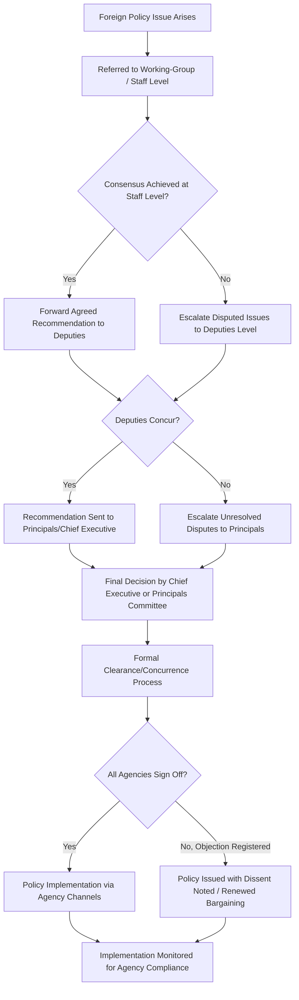

## Bureaucratic Politics and Interagency Coordination

### Overview

Bureaucratic politics examines foreign policy as the outcome of bargaining, competition, and negotiation among multiple government actors with distinct organizational interests, mandates, and access to power — rather than the product of a single unified strategic calculation. Interagency coordination is the institutional machinery designed to manage this inherent pluralism: the formal and informal structures through which competing departments and agencies attempt to reconcile their positions into coherent state action.

**Key Points**

- Bureaucratic politics treats "the government" as a plural noun — a collection of semi-autonomous organizational players, not a unitary decision-maker
- Interagency coordination mechanisms exist precisely because bureaucratic pluralism, left unmanaged, tends to produce incoherent, contradictory, or delayed policy
- The tension between organizational parochialism and coordinated national strategy is a permanent, not merely occasional, feature of foreign policy-making

### Theoretical Foundations

**Graham Allison's Model III (Governmental Politics)**

Allison's *Essence of Decision* (1971) formalized bureaucratic politics as a distinct explanatory model, arguing that policy outcomes emerge from "pulling and hauling" among players positioned in a government's action channels. The central maxim — "where you stand depends on where you sit" — captures the idea that an official's organizational position substantially predicts their policy preferences, independent of personal ideology.

**Morton Halperin's Bureaucratic Politics Approach**

Halperin's *Bureaucratic Politics and Foreign Policy* (1974) extended and systematized the framework, identifying:

- **Organizational essence**: Each organization has a self-conception of its core mission that it will defend even at the expense of substantive policy effectiveness (e.g., a military service resisting a role it sees as inconsistent with its identity)
- **Stakes in specific issues**: Budget share, autonomy, and organizational turf drive positions as much as the substantive merits of a policy
- **Action channels**: Regularized, institutionalized pathways (e.g., National Security Council process, interagency working groups) through which issues are raised, debated, and resolved

**Sources of Bargaining Power**

- Formal authority/hierarchical position
- Control over information and expertise
- Personal access and relationship with the chief executive
- Ability to build and hold coalitions
- Persuasive skill and political capital
- Control over implementation resources (budget, personnel, operational capability)

### Organizational Interests as Drivers of Position

**Key Points**

- **Budgetary self-interest**: Agencies advocate for policies that preserve or expand their resource base
- **Mission-role congruence**: Agencies favor policy options that align with, rather than threaten, their core organizational identity
- **Autonomy preservation**: Agencies resist policies that would subordinate their operations to another agency's control or oversight
- **Domain protection ("turf")**: Agencies resist jurisdictional encroachment even when a rival agency might execute a task more efficiently

**Example**: In a hypothetical inter-agency debate over which body should lead a new counter-piracy maritime task force, the navy might favor an operation structured around traditional naval assets and command structures (preserving its role), while a coast guard or maritime security agency might favor a law-enforcement framing that privileges its own legal authorities — even if both agencies publicly agree on the goal of suppressing piracy.

### Interagency Coordination Mechanisms

**National-Level Coordinating Bodies**

Most states with complex foreign policy bureaucracies establish a central coordinating body (analogous to a National Security Council) tasked with:

- Convening relevant ministries/departments for a given issue
- Structuring the flow of options and recommendations to the chief executive
- Attempting to resolve or narrow interagency disagreement before it reaches the top decision-maker
- Monitoring implementation to ensure agency compliance with agreed policy

**Committee/Working-Group Structures (Tiered Process)**

A common institutional pattern layers coordination across three tiers:

| Tier | Typical Composition | Function |
| --- | --- | --- |
| Principals level | Cabinet secretaries/ministers | Final policy decisions requiring highest political authority |
| Deputies level | Deputy ministers/agency deputies | Resolving disputes principals need not adjudicate; preparing options |
| Working-group/staff level | Career officials, subject experts | Drafting options, technical coordination, day-to-day implementation |

**Clearance and Concurrence Processes**

Formal document clearance procedures (requiring sign-off from all relevant agencies before a policy or communication is finalized) are a key coordination tool, though they can also become a bottleneck exploited by an agency to slow-walk or water down a policy it opposes.

### Interagency Coordination Failure Modes

**Turf Battles**

Overlapping mandates between agencies (e.g., an intelligence service and a foreign ministry both claiming lead responsibility for a diplomatic-intelligence liaison function) produce duplicated effort, gaps in accountability, or public inconsistency in messaging.

**Information Hoarding**

Agencies may withhold intelligence or analysis from rivals to preserve their unique value and bargaining position, even when information-sharing would improve the overall quality of the policy process — a dynamic well-documented in post-crisis intelligence failure reviews.

**Implementation Sabotage/Slow-Rolling**

An agency that loses a policy debate at the decision stage may still shape the outcome by controlling the pace, resourcing, or fidelity of implementation — effectively re-litigating the decision at the execution stage.

**Coordination Overload**

Excessive formal clearance requirements can produce policy paralysis, watered-down "lowest common denominator" compromise language, or significant delay in time-sensitive crises.

**Fragmentation Under Weak Central Coordination**

Where the central coordinating body is weak or the chief executive does not enforce a unified process, agencies may pursue quasi-independent "shadow" foreign policies, producing contradictory signals to external parties.

### Diagnostic Framework for Analyzing a Bureaucratic Politics Case

$$P_{outcome} = f\left(\sum_{i=1}^{n} w_i \cdot \text{pos}_i\right)$$

Where $P_{outcome}$ is the resulting policy, $\text{pos}_i$ is actor $i$'s preferred position, and $w_i$ is that actor's relative bargaining weight (a function of the bargaining-power sources listed above). [Inference] This formalization is a heuristic simplification for analytic purposes; actual bureaucratic bargaining is path-dependent and sequential rather than a single-shot weighted aggregation, so the equation should be read as illustrative rather than as a literal predictive model.

**Analytic Steps**

1. Identify all organizational players with a stake in the issue
2. Map each player's likely position based on organizational interest (not just stated ideology)
3. Assess each player's relative bargaining power and access
4. Trace the actual sequence of interagency meetings/documents to see where compromises were struck
5. Compare the final policy against each player's initial position to assess whose preferences prevailed, and by how much

### Worked Example: Interagency Coordination on a Sanctions Package

Scenario: A government must decide how to respond to a foreign state's human rights violations.

- **Foreign ministry** favors calibrated diplomatic sanctions preserving room for future negotiation (protects its core mission of maintaining diplomatic channels)
- **Finance/treasury agency** favors broad financial sanctions matching its technical capability and expanding its policy relevance (mission-role congruence and turf expansion)
- **Trade ministry** opposes sanctions that would harm politically significant export sectors (protecting domestic constituency relationships)
- **Intelligence agency** provides threat assessments that can be selectively emphasized by whichever coalition finds them useful (information as bargaining leverage)
- **Central coordinating body** convenes a deputies-level working group; after several rounds of clearance, a compromise emerges: narrow, targeted financial sanctions on identified individuals (satisfying finance's mandate and the foreign ministry's desire to preserve broader diplomatic relations) while a full trade sanctions package favored by human-rights-focused legislators is dropped (reflecting the trade ministry's stronger coalition position with export-dependent political constituencies)

This outcome cannot be derived from any single agency's stated preference; it reflects the resultant of the bargaining process itself.

### Interagency Coordination Process Flow

### Diagram: Bureaucratic Bargaining Power Map (svg_diagram)

<svg xmlns="http://www.w3.org/2000/svg" viewBox="0 0 640 360">
<text x="320" y="24" font-size="15" font-weight="bold" text-anchor="middle" fill="#1a1a1a">Interagency Bargaining Power Map (svg_diagram)</text>
<circle cx="320" cy="190" r="60" fill="#d6eaf8" stroke="#2874a6" stroke-width="2" />
<text x="320" y="185" font-size="12" text-anchor="middle" fill="#1a1a1a">Chief Executive /</text>
<text x="320" y="200" font-size="12" text-anchor="middle" fill="#1a1a1a">Central Coordinator</text>
<circle cx="140" cy="90" r="55" fill="#fdebd0" stroke="#ca6f1e" stroke-width="2" />
<text x="140" y="85" font-size="11" text-anchor="middle" fill="#1a1a1a">Foreign</text>
<text x="140" y="100" font-size="11" text-anchor="middle" fill="#1a1a1a">Ministry</text>
<circle cx="500" cy="90" r="55" fill="#eafaf1" stroke="#1e8449" stroke-width="2" />
<text x="500" y="85" font-size="11" text-anchor="middle" fill="#1a1a1a">Defense/</text>
<text x="500" y="100" font-size="11" text-anchor="middle" fill="#1a1a1a">Military</text>
<circle cx="140" cy="290" r="55" fill="#f4ecf7" stroke="#7d3c98" stroke-width="2" />
<text x="140" y="285" font-size="11" text-anchor="middle" fill="#1a1a1a">Finance/</text>
<text x="140" y="300" font-size="11" text-anchor="middle" fill="#1a1a1a">Treasury</text>
<circle cx="500" cy="290" r="55" fill="#fdedec" stroke="#c0392b" stroke-width="2" />
<text x="500" y="285" font-size="11" text-anchor="middle" fill="#1a1a1a">Intelligence</text>
<text x="500" y="300" font-size="11" text-anchor="middle" fill="#1a1a1a">Services</text>
<line x1="185" y1="120" x2="278" y2="165" stroke="#555" stroke-width="1.5" />
<line x1="455" y1="120" x2="362" y2="165" stroke="#555" stroke-width="1.5" />
<line x1="185" y1="260" x2="278" y2="215" stroke="#555" stroke-width="1.5" />
<line x1="455" y1="260" x2="362" y2="215" stroke="#555" stroke-width="1.5" />
</svg>

### Common Pitfalls

- **Reducing bureaucratic politics to personal ambition**: The model's explanatory power comes from *organizational* interest structures, not merely individual careerism — conflating the two weakens the analysis
- **Ignoring the role of formal clearance mechanisms**: Treating bargaining as purely informal misses how structured processes (clearance, concurrence) formalize and channel bureaucratic competition
- **Assuming coordination failure is pathological rather than structural**: Some degree of interagency friction is a designed feature (checks against any single agency dominating policy), not simply a malfunction to be engineered away
- **Overlooking implementation-stage bargaining**: Analysts who stop tracing the process at the formal decision point miss how agencies continue to shape outcomes during execution

### Contemporary Developments

- **Whole-of-government approaches**: Increasing formalization of cross-agency task forces and fusion centers designed to reduce information hoarding, particularly in counterterrorism and cybersecurity domains
- **Digital coordination platforms**: Shared secure information systems intended to reduce information asymmetries between agencies, though [Inference] such systems typically still require accompanying institutional incentive changes to be effective, since bureaucratic incentives to withhold information are not purely technological in origin
- **Public-private interagency coordination**: Growing need to coordinate not only across government agencies but with private sector actors (technology firms, financial institutions) whose cooperation is essential to sanctions enforcement, cybersecurity, and critical infrastructure protection

**Related Topics**

- Graham Allison's Three Models of Decision-Making (Rational Actor, Organizational Process, Bureaucratic Politics)
- National Security Council Structures and Comparative Institutional Design
- Intelligence-Policy Relations and Information Asymmetry
- Crisis Decision-Making Under Interagency Pressure
- Whole-of-Government and Fusion Center Models in Counterterrorism
- Principal-Agent Problems in Foreign Policy Implementation