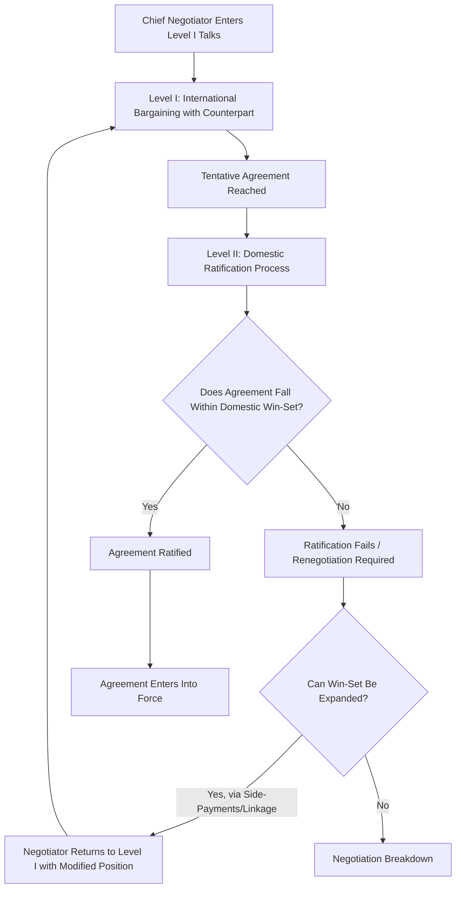

## Two-Level Games: Domestic and International Bargaining

### Overview

The two-level games framework, formalized by Robert Putnam in his 1988 article "Diplomacy and Domestic Politics: The Logic of Two-Level Games," models international negotiation as a simultaneous game played at two interdependent tables. At Level I, national negotiators bargain with their foreign counterparts to reach a tentative international agreement. At Level II, each negotiator must secure domestic ratification of that agreement from constituents, legislatures, interest groups, or coalition partners. The framework's central insight is that these two games are not sequential but mutually constraining: what is negotiable internationally depends on what is ratifiable domestically, and vice versa.

**Key Points**

- Chief negotiators are simultaneously players in both games, uniquely positioned at the intersection of the international and domestic arenas
- A negotiator's domestic constraints are not merely background context but an active bargaining resource and a genuine limitation
- The framework explains phenomena that unitary-actor models struggle with: ratification failures, deliberately weak negotiating positions used as leverage, and the diplomatic value of a genuinely constrained domestic mandate

### The Win-Set Concept

**Definition**

The "win-set" for a given Level II constituency is the set of all possible Level I agreements that would win the necessary domestic ratification (whether formal legislative ratification or informal acceptance by relevant political actors).

**Formal Characterization**

For a two-level game between states A and B, let $W_A$ and $W_B$ denote the respective win-sets. An agreement $X$ is only sustainable if:

$$X \in W_A \cap W_B$$

That is, the agreement must fall within the intersection of both parties' win-sets — it must be simultaneously acceptable to each side's domestic constituency.

**Determinants of Win-Set Size**

| Factor | Effect on Win-Set Size |
| --- | --- |
| Domestic preferences and coalitions | More veto players/divided preferences → smaller win-set |
| Domestic political institutions | Higher ratification thresholds (e.g., supermajority requirements) → smaller win-set |
| Negotiator's strategies | Skillful coalition-building, side-payments, issue linkage → can expand win-set |
| Perceived distribution of costs/benefits | Concentrated costs on powerful groups → smaller win-set |

### Strategic Implications of Win-Set Size

**Key Points**

- **A larger win-set weakens a negotiator's Level I bargaining position**: If domestic ratification is nearly guaranteed regardless of the agreement's terms, the foreign counterpart has less reason to make concessions, since the negotiator has less credible ability to say "my hands are tied"
- **A smaller win-set can paradoxically strengthen a negotiator's Level I bargaining position**: A negotiator who can credibly claim "I would love to concede more, but my legislature/public will reject anything beyond X" can extract concessions from the foreign counterpart, who prefers *some* agreement to none
- **Excessively small win-sets risk negotiation breakdown**: If both sides' win-sets do not overlap at all, no mutually ratifiable agreement exists, and negotiations fail regardless of good-faith effort at Level I

This is the celebrated "paradox of weakness" in two-level bargaining: domestic political weakness can be converted into international bargaining strength, but only up to the point where it forecloses any possible deal.

### Strategies for Manipulating Win-Sets

**Reverberation**

Level I negotiations are not insulated from Level II politics — statements, positions, and even negotiating tactics used internationally can "reverberate" back into the domestic arena, shifting the domestic coalition landscape and altering the win-set mid-negotiation.

**Side-Payments and Issue Linkage**

Negotiators expand their own or their counterpart's win-set by linking the issue under negotiation to other, unrelated issues where domestic compensation can be offered to constituencies that would otherwise oppose ratification (e.g., offering domestic subsidies to industries harmed by a trade agreement in order to secure legislative support).

**Synergistic Linkage**

A skilled chief negotiator can construct package deals in which elements individually unacceptable to a domestic constituency become acceptable when bundled with other elements that compensate or offset the loss — an agreement that would not emerge from either level's game played in isolation.

**Cutting Slack / Involving Domestic Actors Directly**

Bringing legislators or interest-group representatives into the international negotiating process directly (rather than only consulting them after an agreement is reached) can pre-build the domestic coalition needed for ratification, effectively expanding the win-set before the Level I deal is finalized.

**Strategic Misrepresentation**

A negotiator may misrepresent the true size of their win-set to their counterpart — claiming a smaller win-set than actually exists to extract greater concessions — though this carries reputational risk if discovered and can undermine future negotiating credibility.

### The Chief Negotiator's Dual Role

**Key Points**

- The chief negotiator alone occupies the position that spans both boards, giving them unique informational advantages (and unique political risks)
- Chief negotiators may deliberately seek a *narrower* formal negotiating mandate from their domestic principals specifically to strengthen their Level I hand — a rational strategic choice, not evidence of weak authority
- Divided or ambiguous domestic principals (e.g., a coalition government with internally conflicting preferences) can make it difficult for a foreign counterpart to identify which domestic win-set is operative, complicating negotiation even when an agreement might otherwise be mutually beneficial

### Worked Example: Trade Agreement Ratification

Scenario: Country A's executive negotiates a bilateral trade agreement with Country B.

- **Level I**: Country A's trade negotiator and Country B's trade negotiator reach a tentative agreement reducing tariffs on agricultural goods (favorable to Country B's exporters) in exchange for reduced tariffs on manufactured goods (favorable to Country A's exporters)
- **Level II in Country A**: Country A's legislature includes a powerful agricultural lobby opposed to reduced agricultural tariffs, shrinking $W_A$ to exclude any agreement with significant agricultural concessions
- **Negotiator response**: Country A's negotiator credibly signals this domestic constraint to Country B's negotiator, using it as leverage to extract a smaller agricultural concession than Country B initially sought, while offering an unrelated side-payment (e.g., increased quota access in a different sector) to expand the effective win-set enough to secure ratification
- **Outcome**: The final agreement — smaller agricultural liberalization plus a compensating quota concession — is a genuine two-level equilibrium: it falls within the intersection of both revised win-sets, even though neither negotiator's original Level I preference was fully realized

### Extensions to the Basic Model

**Multiple Level II Games**

In coalition governments or federal systems, a single negotiator may face *several* distinct domestic win-sets (e.g., separate ratification requirements from a legislature, a coalition partner, and sub-national governments), compounding the complexity of finding an internationally and domestically viable agreement.

**Three-Level and N-Level Extensions**

Scholars have extended Putnam's framework to include additional levels — for example, distinguishing an executive's negotiating mandate from a legislature's separate ratification requirement as two distinct Level II games, or adding a supranational/international-organization level in negotiations conducted through bodies with independent institutional constraints.

**Two-Level Games and Public Opinion**

Public opinion functions as a continuous, non-binary constraint on the win-set (distinct from formal legislative ratification), operating through mechanisms such as anticipated electoral consequences and audience costs rather than a single up-or-down ratification vote.

### Two-Level Bargaining Process Flow

### Diagram: Win-Set Intersection Model (svg_diagram)

<svg xmlns="http://www.w3.org/2000/svg" viewBox="0 0 640 340">
<text x="320" y="24" font-size="15" font-weight="bold" text-anchor="middle" fill="#1a1a1a">Win-Set Intersection: Feasible Agreement Space (svg_diagram)</text>
<ellipse cx="250" cy="190" rx="150" ry="100" fill="#d6eaf8" fill-opacity="0.6" stroke="#2874a6" stroke-width="2" />
<ellipse cx="390" cy="190" rx="150" ry="100" fill="#fdebd0" fill-opacity="0.6" stroke="#ca6f1e" stroke-width="2" />
<text x="180" y="140" font-size="13" fill="#1a1a1a">Win-Set A</text>
<text x="460" y="140" font-size="13" fill="#1a1a1a">Win-Set B</text>
<text x="320" y="195" font-size="12" font-weight="bold" text-anchor="middle" fill="#1a1a1a">Feasible</text>
<text x="320" y="212" font-size="12" font-weight="bold" text-anchor="middle" fill="#1a1a1a">Agreements</text>
<text x="320" y="300" font-size="11" text-anchor="middle" fill="#555">Only agreements in the overlapping region are ratifiable by both sides</text>
</svg>

### Common Pitfalls

- **Treating win-sets as static**: Win-sets shift over the course of negotiation as a result of reverberation, changing domestic coalitions, and negotiator strategy — analysts who assume a fixed win-set miss much of the framework's explanatory power
- **Conflating a narrow win-set with weak leadership**: A narrow, credibly communicated win-set is often a deliberate and effective bargaining strategy, not a sign of a negotiator's political incapacity
- **Ignoring the negotiator's autonomous strategic role**: The framework is not purely structural — chief negotiators actively shape outcomes through linkage, side-payments, and framing, and treating them as passive transmitters of fixed domestic preferences understates their agency
- **Applying the model only to formal treaties**: The logic applies equally to informal agreements, executive actions, and any international bargain that requires some form of domestic sustainability, not only instruments requiring formal legislative ratification

### Contemporary Applications

- **Trade Negotiations**: Widely applied to explain the domestic political economy of trade liberalization, particularly the role of "fast-track"/trade-promotion authority as an institutional device to enlarge a negotiator's effective win-set by limiting legislative amendment power
- **Climate Negotiations**: Used to explain the gap between internationally agreed climate targets and their domestic legislative or regulatory implementation, where domestic win-sets are often significantly smaller than what international negotiators tentatively agree to
- **Coalition Government Diplomacy**: [Inference] Multi-party coalition systems generally present a more complex two-level (or multi-level) bargaining problem than single-party executives, since coalition partners function as an additional distinct Level II veto point beyond the legislature itself, though the precise effect varies significantly with each coalition's specific bargaining rules and cohesion
- **Digital-era Reverberation**: Social media and instant public commentary have plausibly accelerated the reverberation dynamic Putnam described, compressing the time available for negotiators to manage the interaction between Level I concessions and Level II public reaction

**Related Topics**

- Robert Putnam's Original 1988 Formulation and Case Studies (Bonn Summit)
- Audience Costs and Domestic Signaling in International Bargaining
- Trade Promotion Authority and Legislative-Executive Bargaining
- Coalition Politics and Multi-Level Veto Player Analysis
- Issue Linkage and Side-Payments in International Negotiation
- Ratification Failures: Comparative Case Analysis