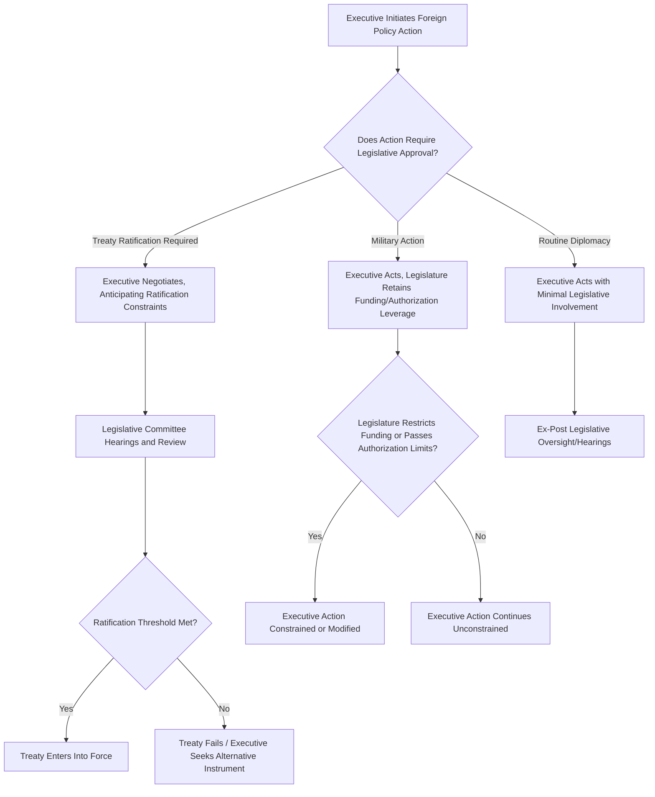

## Legislative-Executive Relations in Foreign Policy

### Overview

Legislative-executive relations in foreign policy examine the constitutional, institutional, and political dynamics governing how power over external affairs is shared, contested, and exercised between a state's executive branch and its legislature. While executives typically hold operational primacy in day-to-day diplomacy and crisis response, legislatures generally retain significant formal powers — treaty ratification, war declaration, appropriations, oversight — that shape, constrain, and sometimes override executive foreign policy preferences.

**Key Points**

- The executive-legislative division of foreign policy authority varies enormously across constitutional systems (presidential, parliamentary, semi-presidential) and is rarely a clean separation of powers in practice
- Legislatures influence foreign policy both through direct formal powers (ratification, appropriations) and through indirect mechanisms (oversight, public hearings, informal consultation)
- The relationship is best understood as a continuum of executive dominance to legislative assertiveness that shifts with issue salience, unified versus divided government, and crisis conditions

### Comparative Constitutional Frameworks

**Presidential Systems**

In presidential systems, the separation of powers is typically pronounced: the executive commands foreign affairs conduct and often military command, while the legislature independently controls appropriations and frequently must ratify treaties by supermajority vote. This structural separation creates persistent potential for gridlock, since neither branch can unilaterally control the full foreign policy process, and unified versus divided government (same party controlling both branches versus different parties) significantly affects the degree of practical friction.

**Parliamentary Systems**

In parliamentary systems, the executive (prime minister/cabinet) is drawn from and accountable to the legislative majority, generally producing greater fusion between executive and legislative foreign policy preferences under normal conditions. However, coalition governments introduce a distinct form of intra-legislative bargaining, since coalition partners function as an internal check even without a formal separation of powers, and backbench rebellions or no-confidence mechanisms retain latent legislative leverage.

**Semi-Presidential Systems**

Systems with both a directly elected president and a prime minister accountable to parliament can produce "cohabitation" dynamics, where a president of one political orientation must share foreign policy authority with a prime minister of a different orientation drawn from a legislative majority — creating a distinctive and often contentious three-way distribution of foreign policy authority.

### Core Legislative Powers Over Foreign Policy

**Treaty Ratification**

Many constitutional systems require legislative ratification (often by supermajority) before international treaties bind the state, giving legislatures an effective veto over the *final* step of treaty-making even when the executive has conducted all substantive negotiations.

**War Powers and Military Authorization**

Constitutional allocation of authority to declare war, authorize the use of force, or approve troop deployments varies widely; even where the executive holds operational command, legislatures frequently retain the formal power to authorize sustained military action or must approve funding for its continuation.

**Appropriations and Budgetary Control**

Legislative control over the budget provides a potent, often underappreciated foreign policy lever: the "power of the purse" allows legislatures to constrain foreign assistance, defense spending, or diplomatic initiatives even absent any direct veto over the underlying policy decision.

**Confirmation of Appointments**

Where legislative confirmation of senior diplomatic or defense appointments is required, this power gives legislatures leverage to extract policy commitments or signal displeasure with executive foreign policy direction, independent of any specific treaty or authorization vote.

**Oversight and Investigation**

Formal committee hearings, investigative powers, and reporting requirements allow legislatures to scrutinize executive foreign policy conduct after the fact, shaping future executive behavior through anticipated accountability even without a formal veto at the point of decision.

### Executive Advantages in Foreign Policy Leadership

**Key Points**

- **Informational asymmetry**: Executives typically control intelligence services and diplomatic reporting channels, giving them substantially superior real-time information relative to legislatures
- **Speed and unity of action**: Crisis situations favor a single decisive actor over a deliberative multi-member body, structurally advantaging executive initiative
- **Constitutional/customary primacy in negotiation**: Even where ratification requires legislative approval, the executive typically conducts the actual negotiation, framing the terms legislatures must accept or reject as a package
- **Agenda-setting power**: By initiating negotiations, deploying forces, or making public commitments, executives can create political and diplomatic facts that constrain subsequent legislative options (the "fait accompli" dynamic)

### Legislative Assertiveness Mechanisms

**Power of the Purse as Constraint**

Legislatures can attach conditions to appropriations (earmarking, prohibiting funds for specific purposes, requiring periodic reporting as a condition of continued funding) as an indirect but often highly effective means of shaping foreign policy without directly contesting the executive's formal authority.

**Sunset Clauses and Reauthorization Requirements**

Requiring periodic legislative reauthorization of military or diplomatic authorities forces recurring legislative engagement, preventing a single initial authorization from becoming an indefinite, unreviewed executive mandate.

**Non-Binding Resolutions and Public Pressure**

Even where legislatures lack direct legal power to compel a specific executive action, resolutions expressing legislative sentiment can shape the domestic political costs the executive anticipates from a given course of action — a mechanism connecting legislative-executive relations to the audience-costs literature in international bargaining theory.

**Committee Oversight and Public Hearings**

Sustained committee attention to a foreign policy issue, including public hearings with executive branch witnesses, can shift public salience and constrain executive discretion even without any formal legislative vote.

### Worked Example: Treaty Negotiation and Ratification Dynamics

Scenario: An executive negotiates a multilateral arms control treaty.

- **Negotiation phase**: The executive branch, through its diplomatic and defense agencies, conducts the substantive negotiation, informed by intelligence and technical assessments the legislature does not independently possess
- **Anticipated ratification constraint**: Aware that ratification requires legislative supermajority approval, the executive's negotiators build in verification provisions and reciprocal obligations specifically because they anticipate legislative skepticism about compliance enforcement — an example of Level II (domestic) constraints shaping Level I (international) bargaining, as formalized in two-level games theory
- **Legislative committee hearings**: Following the tentative agreement, relevant legislative committees hold hearings, calling executive branch officials and outside experts to testify on verification adequacy and strategic implications
- **Ratification vote**: The treaty either secures the required supermajority (potentially after the executive negotiates supplementary understandings or reservations to address specific legislative concerns) or fails, in which case the executive may pursue an alternative, non-treaty instrument (such as an executive agreement not requiring ratification) if available under the relevant constitutional framework — a substitution that itself often becomes a point of interbranch contention

### Legislative-Executive Foreign Policy Interaction Flow

### Diagram: Executive-Legislative Foreign Policy Authority Spectrum (svg_diagram)

<svg xmlns="http://www.w3.org/2000/svg" viewBox="0 0 640 260">
<text x="320" y="24" font-size="15" font-weight="bold" text-anchor="middle" fill="#1a1a1a">Authority Spectrum by Policy Domain (svg_diagram)</text>
<line x1="60" y1="140" x2="580" y2="140" stroke="#333" stroke-width="2" />
<polygon points="580,140 570,134 570,146" fill="#333" />
<text x="60" y="170" font-size="12" text-anchor="middle" fill="#1a1a1a">Executive</text>
<text x="60" y="185" font-size="12" text-anchor="middle" fill="#1a1a1a">Dominant</text>
<text x="580" y="170" font-size="12" text-anchor="middle" fill="#1a1a1a">Legislative</text>
<text x="580" y="185" font-size="12" text-anchor="middle" fill="#1a1a1a">Assertive</text>
<circle cx="130" cy="140" r="8" fill="#2874a6" />
<text x="130" y="115" font-size="11" text-anchor="middle" fill="#1a1a1a">Crisis Response</text>
<circle cx="270" cy="140" r="8" fill="#ca6f1e" />
<text x="270" y="115" font-size="11" text-anchor="middle" fill="#1a1a1a">Routine Diplomacy</text>
<circle cx="410" cy="140" r="8" fill="#1e8449" />
<text x="410" y="115" font-size="11" text-anchor="middle" fill="#1a1a1a">Military Authorization</text>
<circle cx="520" cy="140" r="8" fill="#7d3c98" />
<text x="520" y="115" font-size="11" text-anchor="middle" fill="#1a1a1a">Treaty Ratification</text>
</svg>

### Factors Shifting the Balance of Power

| Factor | Effect on Executive-Legislative Balance |
| --- | --- |
| Unified vs. divided government (presidential systems) | Divided government generally increases legislative assertiveness |
| Crisis vs. routine conditions | Crisis conditions generally favor executive initiative |
| Issue salience and public attention | High-salience issues draw greater legislative engagement |
| Coalition cohesion (parliamentary systems) | Fragile coalitions increase effective legislative/coalition-partner leverage |
| Perceived past executive overreach | Prior executive actions perceived as excessive tend to prompt subsequent legislative reassertion |

### Common Pitfalls

- **Treating formal constitutional text as determinative of actual practice**: Constitutional allocations of power are frequently supplemented, circumvented, or reshaped by informal norms, historical precedent, and political bargaining not visible in the text alone
- **Ignoring the appropriations lever**: Analysts focused solely on direct votes (declarations of war, treaty ratification) can miss how budgetary control functions as a continuous, less visible constraint on executive foreign policy
- **Assuming legislative weakness equals irrelevance**: Even legislatures with limited direct formal power can shape executive anticipation and behavior through oversight, public hearings, and the threat of future assertiveness
- **Overlooking coalition dynamics in parliamentary systems**: Applying a presidential-system separation-of-powers lens to parliamentary systems misses how coalition partners, not an independent legislature, often constitute the primary internal check on executive foreign policy

### Contemporary Developments

- **Increased legislative attention to arms sales and export controls**: Many legislatures have expanded review mechanisms over executive-authorized arms transfers, reflecting growing legislative interest in foreign policy areas historically left to executive discretion
- **Social media and legislative-executive dynamics**: [Inference] Real-time public commentary plausibly compresses the time available for traditional committee-based deliberation, potentially shifting legislative influence toward faster, more reactive mechanisms (public statements, rapid resolutions) relative to slower traditional oversight processes, though the durability of this shift across different institutional contexts remains an open empirical question
- **Judicial involvement in interbranch foreign policy disputes**: In several constitutional systems, courts have increasingly been asked to adjudicate the boundaries of executive versus legislative foreign policy authority, adding a third institutional actor to what was traditionally framed as a bilateral executive-legislative relationship

**Related Topics**

- Two-Level Games: Domestic and International Bargaining
- War Powers and the Use-of-Force Authorization Debate
- Comparative Treaty Ratification Procedures
- Coalition Government Dynamics and Foreign Policy Coherence
- Oversight Committees and Foreign Policy Accountability
- Executive Agreements versus Treaties: Comparative Practice