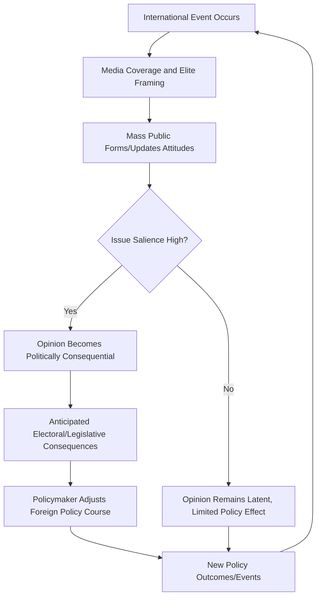

## Public Opinion and Foreign Policy

### Overview

The study of public opinion and foreign policy examines whether, how, and to what extent mass attitudes shape a state's external behavior, and conversely how foreign policy elites and events shape mass attitudes. This subfield has moved through several distinct paradigms — from an early consensus that public opinion on foreign affairs was volatile and irrational, to a later "revisionist" consensus finding structured, coherent, and reasonably stable mass attitudes that meaningfully constrain policymakers.

**Key Points**

- The relationship between public opinion and policy is bidirectional: opinion constrains and shapes policy, while elite framing and policy outcomes themselves shape subsequent opinion
- Public opinion's influence varies substantially by issue type, salience, and regime type, rather than operating as a uniform constant constraint
- The empirical study of this relationship has been transformed by large-scale survey data, natural experiments, and more recently computational text analysis of media and social media discourse

### Historical Paradigms

**The "Almond-Lippmann Consensus" (1950s-1960s)**

Named for Gabriel Almond and Walter Lippmann, this early view held that mass public opinion on foreign policy was volatile, lacking in structure or coherent underlying attitudes, uninformed, and highly susceptible to elite manipulation. Under this view, public opinion was seen as, at best, an unreliable input to sound foreign policy and, at worst, actively dangerous to prudent statecraft — Lippmann's "phantom public" was a persistent theme.

**The Revisionist Critique (1980s-onward)**

Scholars including Bruce Russett, Benjamin Page, Robert Shapiro, and Ole Holsti challenged the volatility thesis with systematic evidence that:

- Aggregate public opinion, even when individual attitudes are poorly informed, tends to move in stable, structured patterns over time ("collective rationality")
- Opinion shifts in response to changing events and information in directions consistent with a reasonable, if simplified, belief system, rather than randomly
- Foreign policy attitudes cluster into identifiable dimensions (e.g., militant internationalism, cooperative internationalism, isolationism) that individuals hold with meaningful consistency across related questions

### Structuring Dimensions of Foreign Policy Attitudes

**Militant Internationalism vs. Cooperative Internationalism**

A widely used two-dimensional framework (developed by Eugene Wittkopf and others) classifies foreign policy attitudes along two largely independent axes:

- **Militant Internationalism (MI)**: Support for the use of military force and power-based approaches to international problems
- **Cooperative Internationalism (CI)**: Support for multilateral cooperation, diplomacy, foreign aid, and international institutions

Combining these two dimensions yields four ideal-typical postures:

| MI / CI | Low Cooperative Internationalism | High Cooperative Internationalism |
| --- | --- | --- |
| High Militant Internationalism | Hard-liners | Internationalists |
| Low Militant Internationalism | Isolationists | Accommodationists |

**Elite-Mass Attitude Gaps**

Research consistently finds foreign policy elites (diplomats, military officers, journalists, academics) hold more internationalist and interventionist attitudes on average than the mass public, creating a structural gap that can produce elite surprise at public resistance to policies elites view as self-evidently sound.

### Mechanisms Linking Opinion to Policy

**Direct Electoral Constraint**

In democratic systems, anticipated electoral consequences constrain policymakers from pursuing foreign policies substantially at odds with public preferences, particularly on highly salient issues close to an election.

**Audience Costs**

James Fearon's concept: publics can punish leaders who make foreign threats and then fail to follow through, generating a domestic political cost for backing down. This gives democratic leaders a distinctive signaling advantage in crisis bargaining, since a credible domestic audience cost makes threats more believable to foreign adversaries. [Unverified] The empirical magnitude and even the existence of audience cost effects in real-world crises (as opposed to survey experiments) remains an actively contested question in the quantitative IR literature.

**Rally-Round-the-Flag Effects**

Public approval of the chief executive typically rises in the immediate aftermath of international crises or military action, particularly in their initial phase, independent of the substantive merits of the policy — a well-documented but analytically contested phenomenon regarding its precise causal mechanisms and durability.

**Casualty Sensitivity**

A substantial body of research examines how rising military casualties affect public support for continued military operations, generally finding that support erodes as casualties mount, though the *rate* of erosion is significantly mediated by perceived probability of success and the perceived importance of the mission's stakes (the "principal policy objective" and "casualties for victory" frameworks developed by scholars such as Eric Larson and Peter Feaver/Christopher Gelpi).

**Elite Cue-Taking and Opinion Leadership**

Much of the public forms foreign policy opinions not through independent evaluation of events but by taking cues from trusted political elites and media sources — meaning opinion "constraint" on policy can be partially endogenous to elite framing itself, complicating simple causal claims that opinion independently drives policy.

### The Democratic Peace and Public Opinion

**Key Points**

- One institutional explanation offered for the democratic peace (the empirical regularity that democracies rarely fight one another) is that democratic publics, who bear the costs of war, act as an internal check against their own leaders initiating conflict against fellow democracies
- Public opinion is argued to be particularly resistant to wars against other democracies, whom citizens may perceive as sharing legitimate, non-threatening intentions — though this remains one of several competing explanations for the democratic peace pattern (alongside institutional constraint and normative/cultural explanations), and the debate over their relative weight is unresolved

### Worked Example: Public Opinion During an Extended Military Deployment

Scenario: A democracy deploys forces in a prolonged stabilization mission abroad.

- **Initial phase**: A rally effect produces elevated public support immediately following deployment, driven partly by a "coming together" psychological response and partly by reduced elite criticism during the initial phase
- **Sustained phase**: As casualties accumulate and the mission timeline extends without clear resolution, support gradually erodes; the rate of erosion is shaped by whether the public perceives a plausible path to success (the "principal policy objective" framework) rather than casualty numbers alone
- **Elite cue effects**: Opposition-party elite criticism of the mission, once it begins to emerge, accelerates the erosion of public support among the opposition party's own partisans, illustrating how elite cues mediate the raw relationship between events (casualties) and mass opinion
- **Policy feedback loop**: Declining public support increases legislative willingness to impose funding constraints or reporting requirements, which in turn shapes executive decisions about troop levels and mission duration — illustrating the opinion-to-policy pathway operating partly through the legislative-executive relationship rather than directly on the executive

### Public Opinion-Policy Feedback Loop

### Diagram: Militant/Cooperative Internationalism Grid (svg_diagram)

<svg xmlns="http://www.w3.org/2000/svg" viewBox="0 0 560 420">
<text x="280" y="24" font-size="15" font-weight="bold" text-anchor="middle" fill="#1a1a1a">MI/CI Foreign Policy Attitude Grid (svg_diagram)</text>
<line x1="80" y1="350" x2="480" y2="350" stroke="#333" stroke-width="2" />
<line x1="80" y1="60" x2="80" y2="350" stroke="#333" stroke-width="2" />
<text x="280" y="390" font-size="12" text-anchor="middle" fill="#1a1a1a">Cooperative Internationalism →</text>
<text x="40" y="205" font-size="12" text-anchor="middle" fill="#1a1a1a" transform="rotate(-90 40,205)">Militant Internationalism →</text>
<rect x="80" y="60" width="200" height="145" fill="#fdedec" fill-opacity="0.7" />
<text x="180" y="140" font-size="13" text-anchor="middle" fill="#1a1a1a">Hard-liners</text>
<rect x="280" y="60" width="200" height="145" fill="#eafaf1" fill-opacity="0.7" />
<text x="380" y="140" font-size="13" text-anchor="middle" fill="#1a1a1a">Internationalists</text>
<rect x="80" y="205" width="200" height="145" fill="#f4ecf7" fill-opacity="0.7" />
<text x="180" y="280" font-size="13" text-anchor="middle" fill="#1a1a1a">Isolationists</text>
<rect x="280" y="205" width="200" height="145" fill="#eaf2f8" fill-opacity="0.7" />
<text x="380" y="280" font-size="13" text-anchor="middle" fill="#1a1a1a">Accommodationists</text>
</svg>

### Common Pitfalls

- **Assuming public opinion is uniformly weak or uniformly determinative**: Influence varies substantially by issue salience, information environment, and institutional context; treating opinion's role as a constant overstates the case in both directions
- **Confusing correlation between opinion shifts and policy shifts with causal influence**: Since elites shape opinion through framing, observed opinion-policy correlation can partly reflect elite-driven opinion change rather than opinion constraining elites
- **Overgeneralizing casualty sensitivity findings**: The "casualties automatically erode support" simplification omits the well-documented mediating role of perceived probability of success and mission importance
- **Neglecting elite-mass attitude gaps**: Assuming elite consensus reflects mass consensus, or vice versa, obscures a structurally important and empirically robust divergence in the literature

### Contemporary Developments

- **Social media and real-time opinion measurement**: Computational analysis of social media discourse increasingly supplements traditional survey methods, though [Inference] the representativeness of social media-derived opinion measures relative to broader public opinion remains a significant methodological concern requiring careful validation against traditional survey benchmarks
- **Polarization and foreign policy attitudes**: Growing partisan polarization in several democracies has been associated with increased partisan sorting on foreign policy issues that were previously less partisan-differentiated, altering the traditional assumption that foreign policy attitudes are less polarized than domestic policy attitudes
- **Misinformation and disinformation effects**: Increased scholarly attention to how deliberately spread false or misleading information, including foreign-originated influence operations, shapes mass foreign policy attitudes, complicating the "informed public updates rationally" assumption embedded in the revisionist consensus

**Related Topics**

- The Democratic Peace Theory and Its Institutional Mechanisms
- Audience Costs and Crisis Signaling
- Rally-Round-the-Flag Effects: Causal Mechanisms and Duration
- Casualty Sensitivity and Public Support for Military Operations
- Elite Cue-Taking and Media Framing in Foreign Policy Opinion Formation
- Two-Level Games: Domestic and International Bargaining