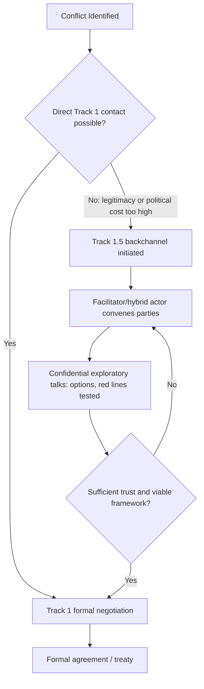

## Track 1.5 Diplomacy and Hybrid Actors

### Definition and Conceptual Placement

Track 1.5 diplomacy denotes a hybrid mode of conflict resolution and negotiation that structurally combines official (Track 1) and unofficial (Track 2) diplomatic engagement within a single process. Unlike pure Track 1 (government-to-government, formally mandated negotiators) or pure Track 2 (unofficial dialogue among academics, former officials, or civil society actors with no negotiating authority), Track 1.5 processes involve official representatives participating alongside, or in a status ambiguous between, official and unofficial capacities — often through intermediaries, private facilitators, or "eminent persons" who carry informal backchannel access to government decision-makers.

The term was popularized in conflict-resolution literature in the 1990s–2000s (notably by scholars such as Chester Crocker, Fen Osler Hampson, and practitioners at institutions like the Centre for Humanitarian Dialogue) to describe processes where the formal constraints of Track 1 (public accountability, precedent-setting, legal bindingness) are relaxed while retaining a credible link to official decision-making — something pure Track 2 dialogues lack.

### Position in the Track Diplomacy Spectrum

$$\text{Track 1} \;\longrightarrow\; \text{Track 1.5} \;\longrightarrow\; \text{Track 2} \;\longrightarrow\; \text{Track 3 (grassroots/people-to-people)}$$

**Key Points**

- Track 1: Official government representatives, binding authority, formal mandate, public visibility, protocol-bound.
- Track 1.5: Mixed participation — officials attend in a personal/unofficial capacity, or private intermediaries shuttle between official parties; deniability preserved; no binding authority but direct feedback loop to Track 1 decision-makers.
- Track 2: Non-state actors (academics, NGOs, retired diplomats) exploring options with no official mandate; primarily used to generate ideas, build relationships, and test proposals informally.
- Track 3: Grassroots and civil-society people-to-people contact, focused on long-term reconciliation rather than negotiated settlement.

Track 1.5 is functionally a bridge mechanism: it exists to transmit the exploratory, face-saving, and option-generating benefits of Track 2 into channels that can actually influence Track 1 outcomes, without the political cost of formal recognition or premature commitment.

### Structural Features

**Key Points**

- **Deniability**: Governments can distance themselves from proposals floated in a Track 1.5 setting if they prove unpopular or premature, since participants are not formally instructed negotiators.
- **Backchannel status**: Track 1.5 talks frequently run in parallel with, or precede, formal Track 1 negotiations (e.g., pre-negotiation "talks about talks").
- **Facilitator role**: Often convened by a third-party facilitator — a state (Norway in the Oslo Accords), an NGO (HD Centre, Community of Sant'Egidio), or a hybrid intergovernmental-private body — that has credibility with both sides and can shuttle messages discreetly.
- **Asymmetric formality**: One side may send an official delegate while the other sends a retired official or academic proxy with informal government backing — common when one party does not want to confer legitimacy on the other by direct official contact (e.g., a state negotiating with a non-state armed group).
- **Confidentiality norms**: Chatham House Rule or stricter non-attribution is standard, enabling more candid exploration of red lines than a formal Track 1 session would permit.

### Canonical Historical Examples

**Example**

- **Oslo Channel (1992–1993)**: Norwegian academics (Terje Rød-Larsen, FAFO institute) facilitated secret talks between Israeli and PLO representatives. Early sessions involved academics and mid-level officials without full negotiating mandates; as trust built, the channel was upgraded to include empowered official negotiators, eventually producing the Declaration of Principles. This is the textbook case of Track 1.5 escalating into Track 1.
- **South Africa transition talks (late 1980s)**: The Dakar Conference and subsequent secret contacts between the apartheid government's intelligence services and ANC representatives (including Nelson Mandela's prison negotiations) combined officially-sanctioned but publicly-deniable government contacts with ANC figures who held quasi-official authority.
- **US–Iran back-channel talks (2013, Oman-mediated)**: Secret bilateral contacts preceding the JCPOA negotiations, facilitated by Oman, involved officials operating outside normal diplomatic channels before the process was upgraded to full P5+1 Track 1 negotiations.
- **Cyprus peace process**: Repeated use of Track 1.5 formats (UN-facilitated but involving unofficial technical committees) alongside formal UN-led Track 1 talks between Greek Cypriot and Turkish Cypriot leaderships.
- **Colombia–FARC talks (Havana process, 2012–2016)**: Early exploratory contacts used private facilitators and international guarantor states (Norway, Cuba) before transitioning to a formal, internationally witnessed Track 1 negotiation.

### Hybrid Actors: Typology

The "hybrid actors" component of this topic refers to the class of participants that populate Track 1.5 (and adjacent) processes precisely because they straddle formal/informal, state/non-state, or public/private boundaries.

**Key Points**

1. **Quasi-official individuals**: Retired diplomats, former ministers, or presidential envoys who carry implicit governmental authorization but no formal credentials (e.g., a former Secretary of State conducting shuttle diplomacy at a government's informal request).
2. **NGO/INGO facilitators**: Organizations such as the Centre for Humanitarian Dialogue, Community of Sant'Egidio, or the Carter Center that possess no sovereign authority but are trusted by states and non-state armed groups alike to convene talks (the Community of Sant'Egidio's role in the Mozambican peace process, 1990–1992, is a classic case).
3. **Epistemic communities**: Networks of technical experts (arms control scientists, environmental scientists) whose shared professional norms allow them to negotiate technical frameworks that later become the basis for formal treaties (Track 2 mechanism frequently feeding Track 1.5/1).
4. **Non-state armed groups (NSAGs) and their political wings**: Entities such as the FARC, the IRA (via Sinn Féin), or Hezbollah occupy a hybrid position — they exercise quasi-governmental authority over territory/populations but lack formal sovereign recognition, making Track 1.5 or Track 2 the only viable channel for initial contact.
5. **Diaspora and transnational advocacy networks**: Groups with informal influence over both a conflict party and an external government, used as informal conduits.
6. **Private sector and philanthropic intermediaries**: Business leaders or foundations (e.g., the Aspen Institute, individual billionaires funding shuttle diplomacy) who convene or fund informal contacts, sometimes called "Track 1.5 diplomacy by proxy."

### Why Hybrid Actors Matter for Track 1.5 Specifically

**Key Points**

- Hybrid actors solve a **credibility-deniability tradeoff**: pure private citizens (Track 2) lack the authority to make proposals stick; pure officials (Track 1) cannot float trial balloons without political cost. Hybrid actors carry enough authority to make outcomes credible while retaining enough distance to allow retraction.
- They enable engagement with **unrecognized or illegitimate parties**: states often cannot have direct official contact with groups they classify as terrorist organizations or unrecognized regimes without conferring de facto legitimacy; a hybrid intermediary circumvents this (e.g., UK government contact with the IRA in the 1990s was conducted through back-channel intermediaries before Sinn Féin was brought into open Track 1 talks post-ceasefire).
- They provide **technical and relational continuity** across changes in formal government — retired officials and NGO facilitators often maintain relationships across multiple administrations, providing institutional memory that Track 1 processes (subject to electoral turnover) cannot.

### Process Dynamics: How Track 1.5 Functions in Practice

### Functions Track 1.5 Performs

**Key Points**

- **Pre-negotiation**: Testing whether formal talks are viable at all ("talks about talks"), reducing the risk of a failed formal negotiation damaging leaders' political standing.
- **Option generation**: Exploring solutions too politically sensitive for officials to propose publicly (territorial swaps, amnesty provisions, sequencing of confidence-building measures).
- **Signaling**: Communicating intentions or red lines to an adversary without committing to them formally — a state can "leak" a position via a Track 1.5 channel to gauge reaction.
- **Trust-building**: Personal relationships formed in informal settings often persist into formal negotiations, easing later Track 1 dynamics.
- **Legitimation ramp**: Gradually normalizing contact with a previously shunned actor (an insurgent group, an unrecognized state) by stages, avoiding the political shock of sudden formal recognition.

### Risks and Critiques

**Key Points**

- **Accountability deficit**: Because participants are not formally mandated, outcomes reached in Track 1.5 settings can be repudiated by principals, wasting the process's investment (this occurred repeatedly in aspects of the Cyprus talks).
- **Representativeness problem**: Hybrid actors and facilitators may not accurately represent the full range of stakeholder views within a conflict party (e.g., diaspora-linked facilitators may overrepresent externally-based moderate factions while sidelining internal hardliners).
- **Elite capture**: Track 1.5 processes can become closed elite conversations disconnected from grassroots (Track 3) sentiment, producing agreements that lack durable public legitimacy — a critique frequently leveled at the Oslo process in retrospect.
- **Facilitator bias**: A facilitating NGO or state may have its own strategic interests, complicating the "neutral convenor" claim (e.g., criticisms of specific state facilitators' geopolitical motives in various peace processes are [Inference] context-dependent and contested in the literature).
- **Fragility of confidentiality**: Leaks can destroy the deniability that makes Track 1.5 viable, collapsing the channel entirely.

### Analytical Frameworks for Assessing Track 1.5 Processes

| Dimension | Diagnostic Question |
| --- | --- |
| Mandate | Does the hybrid actor have any implicit authorization from a principal, or none at all? |
| Access | Can the channel reliably reach top decision-makers, or only mid-level officials? |
| Confidentiality | Is the process genuinely insulated from media/public exposure? |
| Convertibility | Is there a plausible pathway from this channel to formal Track 1 negotiation? |
| Representativeness | Do participants reflect the internal diversity of their constituency? |

### Relationship to Contemporary "Hybrid Actor" Diplomacy Beyond Peace Processes

**Key Points**

- The hybrid-actor concept has expanded beyond peace/conflict negotiation into broader foreign policy formulation: technology companies, private military contractors, and transnational criminal or cyber actors now function as de facto hybrid diplomatic actors, requiring states to engage them through Track 1.5-like informal channels (e.g., government cybersecurity agencies negotiating informally with private tech platforms on content moderation or breach disclosure).
- Sub-state and city diplomacy ("paradiplomacy") — mayors, governors, and regional governments engaging foreign counterparts — is sometimes classified adjacent to Track 1.5 dynamics, since sub-national officials hold genuine public authority but operate outside the formal national foreign-policy apparatus.
- [Inference] The proliferation of hybrid warfare (state use of proxies, deniable cyber operations, private military companies) has increased demand for Track 1.5-style engagement, since adversaries increasingly act through actors that are neither fully state nor fully private, mirroring the ambiguity Track 1.5 diplomacy was originally designed to manage.

### Practical Design Considerations for Practitioners

**Key Points**

- Select facilitators with **demonstrated trust from both/all parties**, not merely technical negotiation expertise.
- Establish **clear (even if informal) feedback loops** to Track 1 principals so momentum built in Track 1.5 sessions is not lost to bureaucratic disconnect.
- Build in **staged upgrade paths**: define, even informally, what conditions would trigger elevation of the channel to formal Track 1 status.
- Protect confidentiality architecture (secure communications, limited participant lists, off-the-record norms) since leaks are the single most common failure mode.
- Anticipate the **legitimacy/representativeness problem** by consciously widening consultation with grassroots (Track 3) constituencies in parallel, rather than treating Track 1.5 as fully sufficient.

**Related Topics**

- Track 2 Diplomacy and Problem-Solving Workshops (Burton, Kelman models)
- Pre-Negotiation Theory (William Zartman's "ripeness" framework)
- Multi-Track Diplomacy (Louise Diamond and John McDonald's nine-track model)
- Paradiplomacy and Sub-State Foreign Policy Actors
- Non-State Armed Group Engagement and Humanitarian Mediation Norms
- Confidence-Building Measures (CBMs) in Conflict Resolution
- Mediation Theory: Facilitative vs. Directive Mediation Styles
- Hybrid Warfare and Deniable State-Proxy Relationships