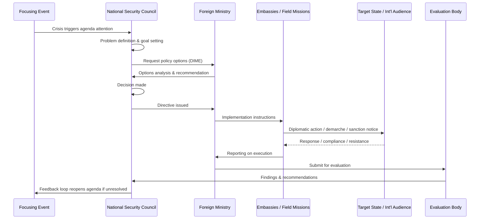

## The Policy Cycle: Formulation, Implementation, and Evaluation

### Overview

The policy cycle is the standard heuristic model used in political science and public administration to describe how public policy — including foreign policy — moves from a recognized problem to an enacted decision, into action, and finally to assessment. It breaks the messy, often non-linear reality of governance into discrete, analyzable stages, allowing scholars and practitioners to diagnose where a policy succeeded or failed.

While originally developed by Harold Lasswell for domestic policy analysis, the model is widely adapted to foreign policy, where the actors (foreign ministries, intelligence agencies, heads of state, international organizations) and constraints (sovereignty, anarchy in the international system, diplomatic reciprocity) differ substantially from domestic lawmaking.

### The Canonical Stages

Most textbooks compress the cycle into five to seven stages. For diplomatic and foreign policy purposes, the most useful compression is four macro-stages, each containing sub-phases:

1. **Agenda Setting** — a problem is recognized as requiring state action
2. **Formulation** — options are generated, analyzed, and a decision is made
3. **Implementation** — the decision is translated into diplomatic, economic, or military action
4. **Evaluation** — outcomes are assessed against objectives, feeding back into agenda setting

This is a cycle, not a line: evaluation results routinely trigger a new round of agenda setting, and stages frequently overlap or run in parallel (e.g., implementation of one policy while formulation of an adjacent one is ongoing).

### Stage 1: Agenda Setting (Pre-Formulation)

Before formulation can begin, an issue must reach the "agenda" — the set of problems that decision-makers are actively attending to. In foreign policy, agenda setting is shaped by:

- **Focusing events** — crises, attacks, disasters, or sudden regime changes that force immediate attention (e.g., an armed incursion, a coup, a pandemic outbreak with cross-border implications)
- **Systemic pressure** — shifts in the balance of power, alliance obligations, or economic interdependence
- **Domestic political pressure** — public opinion, interest groups (diaspora communities, defense industries, multinational corporations), and legislative demands
- **Bureaucratic advocacy** — foreign ministries, defense departments, or intelligence agencies pushing an issue upward through internal channels
- **International agenda diffusion** — issues placed on the global agenda by international organizations (UN, WTO, IMF) or peer states, which smaller or middle powers may be compelled to adopt

**Key Points**

- Not all recognized problems become policy issues; agenda space is finite and politically contested.
- Framing matters: how an issue is defined (as a "security threat," "humanitarian crisis," or "trade dispute") determines which bureaucratic actors claim jurisdiction and which instruments are considered.
- [Inference] Agenda-setting dynamics in authoritarian systems tend to concentrate around the executive and security apparatus, while in pluralistic democracies, legislative and media actors play a comparatively larger gatekeeping role, though this varies by country and issue salience.

### Stage 2: Policy Formulation

Formulation is where a recognized problem becomes a defined course of action. It typically proceeds through:

**a) Problem Definition**

Precisely specifying what the issue is, its causes, its stakeholders, and its urgency. Ambiguous or contested problem definitions (e.g., is a cross-border cyber intrusion "espionage" or "an act of war"?) directly shape which options later appear legitimate.

**b) Goal Setting**

Establishing the desired end-state — restoring a status quo, deterring an aggressor, securing a trade concession, building a coalition. Goals must be reconciled across multiple bureaucratic actors (foreign ministry, defense ministry, trade ministry, intelligence services) who may hold divergent priorities.

**c) Options Generation**

Producing a range of alternative instruments, generally drawn from the standard **diplomatic, informational, military, economic (DIME)** toolkit:

- Diplomatic: bilateral negotiation, multilateral forums, public diplomacy, recall of ambassadors
- Informational: strategic communication, disinformation countermeasures, intelligence sharing
- Military: deterrent posturing, alliance mobilization, use of force
- Economic: sanctions, tariffs, aid conditionality, trade incentives

**d) Options Analysis**

Each option is evaluated for feasibility, cost, risk of escalation, alignment with international law, and domestic political viability. Formal frameworks used include cost-benefit analysis, scenario planning, and bureaucratic models such as Graham Allison's rational actor, organizational process, and governmental (bureaucratic) politics models — each predicting a different formulation outcome depending on which lens dominates decision-making.

**e) Decision**

A single option (or a hybrid) is selected by the authorized decision-maker(s) — a head of state, cabinet, national security council, or in coalition settings, a negotiated consensus among allied governments.

**Key Points**

- Formulation is rarely a single rational actor calculating optimal outcomes; Allison's Cuban Missile Crisis analysis remains the standard reference for showing how organizational routines and inter-agency bargaining distort "rational" formulation.
- Time pressure (crisis diplomacy) compresses formulation, often bypassing full options analysis in favor of pre-existing contingency plans.
- [Inference] The quality of formulation is strongly correlated with the diversity and independence of advisory channels available to the decision-maker, since groupthink risks rise when options generation is centralized in a single loyal inner circle — though this is a widely held but not universally quantifiable claim in the literature.

### Stage 3: Implementation

Implementation translates the formal decision into operational action through the state's diplomatic, military, and economic machinery.

**Key Actors and Instruments**

- **Foreign ministries / diplomatic corps** — issuing démarches, conducting negotiations, managing embassy-level execution
- **International organizations** — implementing multilaterally agreed policy (UN sanctions committees, WTO dispute panels)
- **Defense and intelligence agencies** — executing military or covert dimensions of policy
- **Development and trade agencies** — administering aid, loans, or trade measures

**Implementation Challenges**

- **Principal-agent problems**: field diplomats and implementing agencies may interpret or execute directives differently than intended by capital-level decision-makers.
- **Coordination failure**: multiple agencies with overlapping mandates (foreign affairs vs. defense vs. trade) can implement inconsistent or contradictory actions.
- **Target state resistance**: unlike domestic policy, foreign policy implementation depends on the compliance or reaction of an external, sovereign actor who has no obligation to cooperate — a defining feature that distinguishes foreign policy implementation from domestic policy implementation.
- **Resource constraints**: diplomatic capacity, sanctions enforcement capability, and military logistics may be insufficient to fully execute the formulated policy.
- **Signaling and credibility**: implementation must be visible and consistent enough for the target state or international audience to correctly interpret intent (a core concern in deterrence theory).

**Key Points**

- Implementation is where formulated intent frequently diverges from actual outcome — the "implementation gap" is a central concern in policy studies.
- [Inference] Foreign policy implementation success is often more dependent on alliance and institutional coordination capacity than on the intrinsic soundness of the original formulation, particularly for multilateral initiatives such as sanctions regimes, though this is a generalization drawn from case literature rather than a fixed rule.

### Stage 4: Evaluation

Evaluation assesses whether the implemented policy achieved its stated objectives, and why or why not.

**Types of Evaluation**

- **Formative (ongoing) evaluation** — real-time monitoring during implementation, allowing course correction
- **Summative (ex-post) evaluation** — retrospective assessment after policy conclusion or a defined review point
- **Process evaluation** — did implementation follow the intended procedure, regardless of outcome?
- **Outcome/impact evaluation** — did the policy achieve the intended strategic effect?

**Common Evaluation Methods**

- After-action reviews and diplomatic post-mortems
- Comparative case analysis against similar historical episodes
- Quantitative indicators where available (trade volume shifts, compliance rates with sanctions, troop movements)
- Legislative or parliamentary oversight hearings
- Independent think-tank and academic assessment

**Feedback Loop**

Evaluation findings feed back into agenda setting: a policy judged to have failed (e.g., sanctions that did not alter target behavior) often triggers renewed agenda attention and a new formulation cycle with adjusted goals or instruments. This feedback function is what makes the model a *cycle* rather than a linear process.

**Key Points**

- Evaluation in foreign policy is inherently harder than in domestic policy because causal attribution is contested — outcomes are shaped by the interacting choices of multiple sovereign actors, not just the implementing state.
- Bureaucratic and political incentives frequently bias evaluation toward declaring success (or assigning blame externally) rather than rigorous causal analysis.
- [Speculation] Some scholars argue that formal evaluation stages are the weakest link in the foreign policy cycle compared to domestic policy, since diplomatic outcomes are rarely subjected to the same institutionalized audit mechanisms (e.g., government accountability offices) as domestic programs — this is a debated normative claim rather than an established empirical finding.

### Visual Model: The Cycle (svg_diagram)

<svg xmlns="http://www.w3.org/2000/svg" viewBox="0 0 720 720" font-family="Arial, sans-serif">
<text x="360" y="30" text-anchor="middle" font-size="18" font-weight="bold">The Policy Cycle (svg_diagram)</text>

<circle cx="360" cy="130" r="90" fill="#eaf2fb" stroke="#2b6cb0" stroke-width="2" />
<text x="360" y="120" text-anchor="middle" font-size="15" font-weight="bold">Agenda</text>
<text x="360" y="140" text-anchor="middle" font-size="15" font-weight="bold">Setting</text>
<text x="360" y="160" text-anchor="middle" font-size="11">(Problem recognized)</text>

<circle cx="590" cy="360" r="90" fill="#eafbea" stroke="#2f855a" stroke-width="2" />
<text x="590" y="350" text-anchor="middle" font-size="15" font-weight="bold">Formulation</text>
<text x="590" y="370" text-anchor="middle" font-size="11">(Options → Decision)</text>

<circle cx="360" cy="590" r="90" fill="#fff6e5" stroke="#c05621" stroke-width="2" />
<text x="360" y="580" text-anchor="middle" font-size="15" font-weight="bold">Implementation</text>
<text x="360" y="600" text-anchor="middle" font-size="11">(DIME instruments)</text>

<circle cx="130" cy="360" r="90" fill="#fdeaea" stroke="#c53030" stroke-width="2" />
<text x="130" y="350" text-anchor="middle" font-size="15" font-weight="bold">Evaluation</text>
<text x="130" y="370" text-anchor="middle" font-size="11">(Outcome vs. goals)</text>

<path d="M 430,180 A 260,260 0 0,1 555,275" fill="none" stroke="#333" stroke-width="2" marker-end="url(#arrow)" />
<path d="M 555,445 A 260,260 0 0,1 430,540" fill="none" stroke="#333" stroke-width="2" marker-end="url(#arrow)" />
<path d="M 290,540 A 260,260 0 0,1 165,445" fill="none" stroke="#333" stroke-width="2" marker-end="url(#arrow)" />
<path d="M 165,275 A 260,260 0 0,1 290,180" fill="none" stroke="#333" stroke-width="2" marker-end="url(#arrow)" />

<text x="360" y="700" text-anchor="middle" font-size="11" fill="#555">Feedback: Evaluation findings re-enter Agenda Setting, restarting the cycle</text>

</svg>

### Sequence Model: Actor Flow in a Crisis Scenario

### Worked Example

**Scenario:** State A discovers that State B is providing covert arms support to a non-state actor destabilizing a shared border region.

- **Agenda Setting**: Intelligence reports and a border skirmish (focusing event) push the issue onto the National Security Council's agenda.
- **Formulation**: Problem is defined as "cross-border proxy destabilization." Goals: halt arms flow, avoid direct military escalation. Options generated: (1) diplomatic protest and bilateral talks, (2) targeted economic sanctions on implicated officials, (3) covert counter-support to opposing factions, (4) referral to a regional security organization. Options analysis weighs escalation risk, domestic political cost, and alliance commitments. Decision: combine diplomatic protest with targeted sanctions.
- **Implementation**: Foreign ministry issues a démarche; treasury/finance ministry designates sanctioned individuals; embassy in State B relays the message; allied states are briefed to align sanctions lists.
- **Evaluation**: Six months later, intelligence indicates arms flows have decreased by an observable margin but not stopped entirely. Evaluation concludes partial success, recommends escalating financial sanctions — reopening the agenda-setting stage for a revised policy.

### Common Critiques of the Stagist Model

- **Non-linearity**: Real policymaking loops back, skips stages, or runs several stages concurrently rather than following the clean sequence the model implies.
- **Multiple Streams Model (Kingdon)**: argues that problems, policies, and politics are three semi-independent "streams" that must converge at a "policy window," rather than following orderly agenda-setting-then-formulation logic.
- **Punctuated equilibrium**: policy tends to remain stable for long periods, then change abruptly, rather than cycling smoothly and continuously.
- **Bureaucratic politics critique**: the cycle model implies a unitary state actor, whereas in practice, formulation and implementation are contested terrain among competing agencies with independent interests (Allison's Model III).

**Conclusion**

The policy cycle remains the dominant pedagogical framework for analyzing how states move from recognizing an international problem to acting on it and learning from the results. Its explanatory power lies less in perfectly describing real-world sequencing — which is frequently overlapping and iterative — and more in providing a diagnostic checklist: at which stage did a given foreign policy episode break down, and what does that reveal about institutional capacity, decision-making structure, or strategic miscalculation.

**Related Topics / Next Steps**

- Graham Allison's Three Models of Decision-Making (Rational Actor, Organizational Process, Bureaucratic Politics)
- Bureaucratic Politics and Inter-Agency Coordination in Foreign Policy
- Crisis Decision-Making and Time-Compressed Formulation
- Multiple Streams Framework (Kingdon) Applied to International Relations
- Sanctions as a Policy Instrument: Design, Implementation, and Evaluation
- Principal-Agent Problems in Diplomatic Implementation
- Track I vs. Track II Diplomacy in Policy Implementation
- Feedback Loops and Policy Learning in International Relations