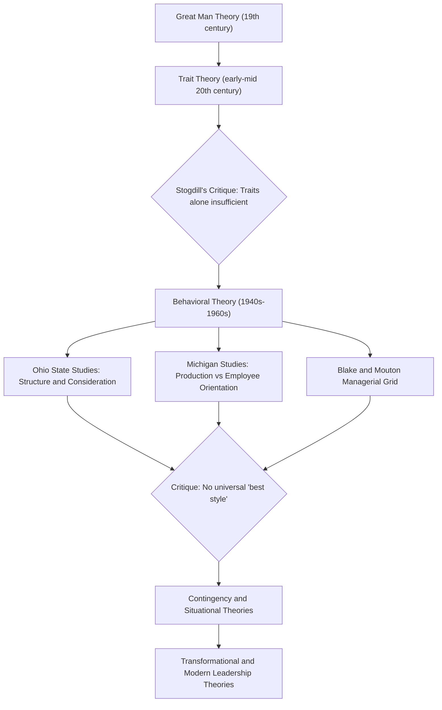

## Trait and Behavioral Leadership Theories

### Overview

Trait and Behavioral theories represent the two earliest systematic approaches in the academic study of leadership, forming the historical foundation from which all later contingency, transformational, and relational leadership models developed. They are distinguished by a fundamental question shift:

- **Trait Theory** asks: *"Who* is a leader?" — focusing on innate or stable personal characteristics that differentiate leaders from non-leaders.
- **Behavioral Theory** asks: *"What does* a leader *do*?" — focusing on observable actions and styles that can, in principle, be learned and trained.

This shift from "being" to "doing" was a major paradigm change in leadership studies, moving the field from a deterministic, selection-oriented view toward a developmental, training-oriented view.

### Part I: Trait Theory

#### Historical Origins

Trait theory descends from the **"Great Man" theory** of the 19th century (popularized by Thomas Carlyle), which held that history is shaped by exceptional individuals possessing extraordinary, largely inborn qualities. Early 20th-century trait research attempted to empirically validate this by cataloguing personality, physical, and intellectual characteristics common to effective leaders.

#### Key Traits Identified

Research programs (notably Ralph Stogdill's 1948 and 1974 literature reviews) converged on a recurring cluster of traits associated with leadership emergence and effectiveness:

- **Drive**: high achievement motivation, ambition, energy, tenacity, initiative
- **Leadership motivation**: a strong desire to influence and lead others (personalized vs. socialized power motivation)
- **Integrity and honesty**: consistency between word and action, trustworthiness
- **Self-confidence**: including emotional stability and self-assurance under pressure
- **Cognitive ability**: above-average intelligence, strong analytical and conceptual skills
- **Knowledge of the domain/business**: technical or contextual expertise relevant to the group's task
- **Sociability**: extraversion, interpersonal warmth, and social skill
- **Adaptability/flexibility**: tolerance for ambiguity and capacity to adjust to changing situations

**Key Points**

- Stogdill's own conclusion, often understated in summaries, was that traits alone were insufficient predictors — leadership effectiveness also depends heavily on situational fit, a finding that helped trigger the eventual shift toward situational/contingency theories.
- The **Big Five personality model (OCEAN)** — Openness, Conscientiousness, Extraversion, Agreeableness, Neuroticism — is the most empirically robust modern framework linked to trait leadership research; extraversion and conscientiousness show the most consistent positive correlations with leadership emergence, while low neuroticism (emotional stability) correlates with leadership effectiveness.
- [Inference] Correlational strength between individual traits and leadership success is generally modest rather than deterministic — meta-analyses (e.g., Judge et al., 2002, on the Big Five and leadership) report meaningful but moderate effect sizes, meaning traits create a *propensity* toward leadership rather than a guarantee of it.

#### Critiques of Trait Theory

- **Weak predictive power**: no single trait or fixed trait combination reliably predicts leadership success across all contexts.
- **Ignores situational variance**: the same trait profile may be highly effective in one context (e.g., crisis command) and ineffective in another (e.g., collaborative consensus-building).
- **Selection bias in early research**: many early studies examined only individuals who had already attained leadership positions, without comparing them to non-leaders or examining failed leaders.
- **Static assumption**: treats leadership capacity as fixed and largely innate, offering little guidance for leadership development or training.

These critiques directly motivated the shift toward Behavioral Theory in the mid-20th century.

### Part II: Behavioral Theory

#### Historical Origins

Behavioral theory emerged in the 1940s–1960s from large-scale empirical research programs designed to answer: if leadership can't be reliably predicted from fixed traits, can it instead be identified — and taught — through observable patterns of behavior?

#### The Ohio State Studies

Conducted at Ohio State University, this research used the **Leader Behavior Description Questionnaire (LBDQ)** to survey subordinates about their leaders' behavior. Factor analysis reduced hundreds of behavioral descriptors to two independent dimensions:

- **Initiating Structure**: the extent to which a leader defines and organizes their role and the roles of subordinates toward goal attainment — task assignment, scheduling, defining procedures, setting performance standards.
- **Consideration**: the extent to which a leader builds mutual trust, respect, and rapport with subordinates — attentiveness to well-being, openness to input, approachability.

Critically, these two dimensions were found to be **independent, not opposite ends of a single spectrum** — a leader can be high or low on each independently, producing four behavioral quadrants (High Structure/High Consideration, High Structure/Low Consideration, Low Structure/High Consideration, Low Structure/Low Consideration).

**Key Points**

- Empirical findings generally associate the High Structure/High Consideration combination with the most favorable outcomes on both performance and subordinate satisfaction, though the relationship is moderated by situational factors such as task complexity and subordinate experience.
- [Inference] The universality of the "High-High" leader as optimal was later challenged by contingency theorists, who argued that the ideal balance of structure and consideration shifts depending on task and follower maturity — this critique is well established in the leadership literature rather than a fringe claim.

#### The University of Michigan Studies

Conducted around the same period under Rensis Likert, this research identified two broadly analogous orientations, framed as more mutually exclusive than Ohio State's independent-dimension model:

- **Production-Oriented Leadership**: emphasis on technical and task aspects of the job, treating subordinates as a means to accomplish organizational goals.
- **Employee-Oriented Leadership**: emphasis on interpersonal relationships, taking a genuine interest in subordinates' needs and individual differences.

Likert extended this into his **Four Systems of Management**, a behavioral continuum describing organizational leadership climates:

1. **Exploitative-Authoritative** — top-down, coercive, no trust in subordinates
2. **Benevolent-Authoritative** — paternalistic control, condescending trust
3. **Consultative** — substantial but incomplete trust; subordinates consulted but major decisions remain centralized
4. **Participative** — full trust and confidence; decision-making distributed throughout the organization

#### The Managerial (Leadership) Grid — Blake and Mouton

Blake and Mouton's model operationalized the Ohio State dimensions into a two-axis grid (Concern for Production on the x-axis, Concern for People on the y-axis), each scored 1–9, producing named leadership styles:

- **(1,1) Impoverished Management**: minimal effort on both dimensions; avoidance-oriented
- **(9,1) Authority-Compliance**: maximum task focus, minimal concern for people
- **(1,9) Country Club Management**: maximum concern for people, minimal task focus
- **(5,5) Middle-of-the-Road Management**: moderate balance, adequate but unremarkable performance
- **(9,9) Team Management**: high concern for both production and people — considered the ideal style under this model, associated with committed, collaborative teams

**Key Points**

- The Grid is a normative model (it prescribes an ideal style, (9,9)), whereas the Ohio State and Michigan studies were primarily descriptive/diagnostic research programs.
- [Inference] The (9,9) "ideal" has been criticized on the same grounds as the Ohio State High-High finding — namely that a single universally optimal style is difficult to sustain once situational variables (task uncertainty, follower competence, organizational culture) are introduced, which is why contingency theories developed as a direct successor to behavioral models.

### Comparative Summary Table

| Dimension | Trait Theory | Behavioral Theory |
| --- | --- | --- |
| Core Question | Who is a leader? | What does a leader do? |
| Focus | Innate/stable characteristics | Observable, learnable actions |
| Underlying Assumption | Leaders are born | Leaders can be developed/trained |
| Key Frameworks | Great Man Theory, Big Five, Stogdill's traits | Ohio State (Structure/Consideration), Michigan Studies, Managerial Grid |
| Practical Implication | Selection and identification of leaders | Training and behavioral development of leaders |
| Main Weakness | Ignores situational context | Assumes one best style may not always exist |
| Successor Theories | Contingency/Situational theories | Situational Leadership, Contingency Theory (Fiedler), Transformational Leadership |

### Diagram: Evolution from Trait to Behavioral Theory

### Applied Example

**Trait-based hiring scenario**: A diplomatic service selecting candidates for an ambassadorial post may screen for traits such as high emotional stability (composure under adversarial negotiation), integrity (credibility with host governments), and cognitive ability (grasping complex multilateral files) — an application directly descended from trait theory's selection logic.

**Behavioral-based training scenario**: The same diplomatic service, once candidates are selected, may run leadership development programs teaching specific behaviors — structuring embassy staff meetings effectively (Initiating Structure) and building rapport with locally engaged staff (Consideration) — reflecting the behavioral theory assumption that effective leadership conduct can be taught rather than only selected for.

**Conclusion**

Trait and Behavioral theories together mark leadership studies' transition from a static, selection-based paradigm to a dynamic, development-based one. Neither framework alone fully explains leadership effectiveness — traits shape a leader's raw tendencies and behavioral repertoire, while behaviors determine how those tendencies are actually expressed and perceived by followers. Their shared limitation — the search for universally optimal traits or styles — is precisely what catalyzed the situational and contingency theories that followed, making both frameworks essential conceptual prerequisites for understanding later leadership models.

**Related Topics / Next Steps**

- Fiedler's Contingency Theory of Leadership
- Situational Leadership Theory (Hersey and Blanchard)
- Path-Goal Theory of Leadership
- The Big Five Personality Model and Leadership Outcomes
- Transformational vs. Transactional Leadership
- Leader-Member Exchange (LMX) Theory
- Emotional Intelligence in Leadership Effectiveness
- Cross-Cultural Validity of Trait and Behavioral Leadership Models