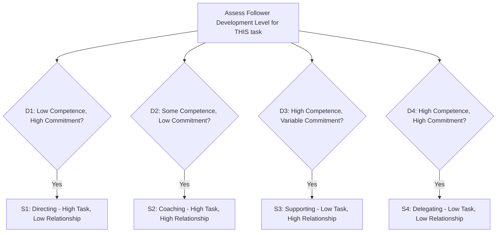

## Situational and Contingency Leadership

### Overview

Situational and Contingency theories emerged as a direct response to the core weakness of Trait and Behavioral theories: the assumption that there exists one universally "best" set of traits or behaviors for all leaders in all circumstances. Both families of theory reject this universalist premise and argue instead that **leadership effectiveness is a function of the fit between leader style and situational variables** — follower readiness, task structure, positional power, and environmental complexity.

The two terms are often used loosely as synonyms, but there is a meaningful distinction:

- **Contingency Theory** (narrowly, Fiedler's model) argues that a leader's style is relatively **fixed**, so effectiveness is achieved by *matching the leader to the situation* (or changing the situation to fit the leader).
- **Situational Leadership** (Hersey and Blanchard) argues that a leader's style should be **flexible and adaptive**, so effectiveness is achieved by the *leader diagnosing the situation and adjusting their own behavior* to fit it.

This distinction — fixed-leader-matched-to-situation vs. flexible-leader-adapting-to-situation — is the central conceptual axis of this topic.

### Fiedler's Contingency Model

Developed by Fred Fiedler in the 1960s, this was the first rigorously operationalized contingency theory.

#### The Least Preferred Co-worker (LPC) Scale

Fiedler measured leadership style indirectly by asking leaders to rate their **Least Preferred Co-worker** — the person they had found most difficult to work with — on a set of bipolar adjective scales (e.g., friendly–unfriendly, cooperative–uncooperative).

- **High LPC score** (describing the least-preferred co-worker in relatively favorable terms) indicates a **relationship-motivated** leader.
- **Low LPC score** (describing the least-preferred co-worker in harsh terms) indicates a **task-motivated** leader.

Fiedler treated LPC as a stable personality trait — not a behavior that could be trained or changed — which is why "matching" rather than "adapting" is the model's core prescription.

#### Situational Favorableness (Control)

Fiedler identified three variables, in descending order of importance, that determine how much control and influence a situation grants the leader:

1. **Leader-Member Relations**: the degree of trust, confidence, and respect subordinates have for the leader (good/poor)
2. **Task Structure**: how clearly defined, structured, and programmable the group's task is (high/low)
3. **Position Power**: the formal authority the leader holds to reward, punish, hire, or fire (strong/weak)

Combining these three (each roughly binary/high-low) produces eight situational octants ranging from **high control** (good relations, structured task, strong power) to **low control** (poor relations, unstructured task, weak power).

#### Fiedler's Core Finding

- **Task-motivated (low LPC) leaders** perform best in situations of **high control** or **low control** (the two extremes).
- **Relationship-motivated (high LPC) leaders** perform best in situations of **moderate control** (the middle range).

**Key Points**

- Because Fiedler considered LPC a fixed trait, his central prescription was not "train the leader to change style" but rather **"change the situation to fit the leader"** — e.g., clarifying task structure or altering position power — or reassign leaders to situations matching their fixed style.
- [Inference] Fiedler's model has faced sustained empirical and methodological criticism — particularly around the psychometric validity and interpretability of the LPC scale itself — and subsequent replications have produced mixed support; it remains historically foundational but is not treated as a fully settled empirical model in contemporary leadership research.

### Situational Leadership Theory (Hersey and Blanchard)

Developed by Paul Hersey and Ken Blanchard, this model (originally "Life Cycle Theory of Leadership," later "Situational Leadership Theory," now commercially branded as SLB II) assumes leaders **can and should adapt** their behavior based on follower readiness/development level for a specific task.

#### Two Behavioral Dimensions

- **Directive (Task) Behavior**: the extent to which the leader spells out duties, provides instructions, and closely supervises task completion.
- **Supportive (Relationship) Behavior**: the extent to which the leader engages in two-way communication, listens, provides socio-emotional support, and facilitates.

#### Follower Readiness / Development Levels

Followers are assessed on **competence** (skill, knowledge, ability to do the task) and **commitment** (confidence and motivation), producing four development levels:

- **D1 — Low Competence, High Commitment**: enthusiastic beginner
- **D2 — Some Competence, Low Commitment**: disillusioned learner
- **D3 — High Competence, Variable Commitment**: capable but cautious/unmotivated performer
- **D4 — High Competence, High Commitment**: self-reliant achiever

#### Matching Leadership Style to Development Level

Four corresponding leadership styles are prescribed:

- **S1 — Directing (Telling)**: high directive, low supportive → matched to D1
- **S2 — Coaching (Selling)**: high directive, high supportive → matched to D2
- **S3 — Supporting (Participating)**: low directive, high supportive → matched to D3
- **S4 — Delegating**: low directive, low supportive → matched to D4

**Key Points**

- Unlike Fiedler, Hersey and Blanchard place the burden of adaptation entirely on the leader — the model is fundamentally developmental and diagnostic, requiring the leader to correctly assess follower readiness on a per-task basis (a follower may be D4 for one task and D1 for a newly assigned task).
- [Inference] The model's intuitive appeal has made it extremely popular in corporate and military leadership training, but its academic empirical support is comparatively weaker than its practical popularity — several scholars note the difficulty of rigorously testing its prescriptive matching claims, so it is often characterized as more of a practitioner heuristic than a fully validated scientific theory.

### Path-Goal Theory (House)

Robert House's Path-Goal Theory, grounded in expectancy theory, holds that a leader's core function is to clarify the "path" to follower goals by removing obstacles and providing appropriate support, thereby increasing follower motivation, satisfaction, and performance.

#### Four Leadership Behaviors

- **Directive**: providing clear guidance, expectations, and schedules
- **Supportive**: showing concern for follower well-being and creating a friendly environment
- **Participative**: consulting followers and incorporating their input into decisions
- **Achievement-Oriented**: setting challenging goals and expressing confidence in followers' ability to meet them

#### Contingency Variables

- **Follower characteristics**: locus of control, experience, perceived ability
- **Environmental/task characteristics**: task structure, formal authority system, work group dynamics

**Key Points**

- The general prescription is: directive leadership works best for ambiguous/unstructured tasks (reducing uncertainty), while it can feel redundant or overcontrolling for highly structured tasks; supportive leadership works best for tedious or stressful tasks; achievement-oriented leadership works well with challenging, ambiguous tasks and high-ability followers.
- [Inference] Empirical testing of Path-Goal Theory has produced inconsistent results across studies, partly due to the theory's complexity (many interacting variables), which makes it more valuable as a conceptual diagnostic framework than as a precisely predictive model.

### Comparative Summary Table

| Model | Leader Adaptability | Key Diagnostic Variable | Core Prescription |
| --- | --- | --- | --- |
| Fiedler's Contingency Model | Fixed (LPC is a trait) | Situational Control (relations, task structure, position power) | Match leader to situation, or change the situation |
| Situational Leadership (Hersey-Blanchard) | Flexible | Follower Development Level (competence + commitment) | Leader adapts directive/supportive behavior to follower readiness |
| Path-Goal Theory (House) | Flexible | Follower traits + Task/environment characteristics | Leader selects behavior that best clarifies the path to goal attainment |

### Diagram: Situational Leadership Style-Matching Logic

### Applied Example (Diplomatic Context)

**Fiedler's Model applied**: An ambassador with a naturally task-motivated (low LPC) style is posted to a mission with poor staff relations and an unstructured mandate (e.g., a newly opened post handling an unfolding crisis) — a low-control situation. Fiedler's model predicts the task-motivated leader will perform relatively well here precisely because the situation demands decisive, structured direction rather than relationship-building.

**Situational Leadership applied**: A newly assigned junior diplomat (D1: eager but inexperienced in consular crisis response) requires a **Directing (S1)** approach from their section chief — clear step-by-step protocols. As the diplomat gains experience but becomes frustrated with routine casework (D2), the chief shifts to **Coaching (S2)** — still directive, but now explaining rationale and providing encouragement. Once the diplomat is fully competent and confident (D4), the chief shifts to **Delegating (S4)**, allowing autonomous handling of complex cases.

**Conclusion**

Situational and Contingency theories mark leadership studies' maturation from asking "what is the ideal leader" to asking "what does *this* situation require, and how is that met — by matching the leader or by adapting the leader?" Fiedler's model contributes the insight that leader style may be relatively stable and that situational engineering can be as important as leader selection; Hersey-Blanchard and Path-Goal contribute the insight that skilled leaders can diagnose and flex their behavior. Together they form the conceptual bridge between early static leadership models and the more relational, transformational theories that followed.

**Related Topics / Next Steps**

- Transformational vs. Transactional Leadership Theory
- Leader-Member Exchange (LMX) Theory
- Normative Decision Model (Vroom-Yetton-Jago)
- Substitutes for Leadership Theory
- Cognitive Resource Theory (Fiedler's extension)
- Cross-Cultural Applicability of Situational Leadership Models
- Servant Leadership and Follower-Centered Approaches
- Leadership Development Program Design Using SLB II