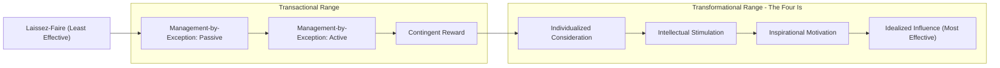

## Transformational and Transactional Leadership


### Overview

Transactional and Transformational Leadership together form one of the most influential frameworks in modern leadership studies, originally distinguished by James MacGregor Burns (1978) and later developed into a full measurable model by Bernard Bass. Unlike Trait, Behavioral, or Situational theories — which focus on identifying or matching leader characteristics to context — this framework centers on the **nature of the exchange between leader and follower**:

- **Transactional Leadership** is built on a **social exchange** — leaders and followers trade compliance, effort, and performance for rewards, recognition, or avoidance of punishment. It operates within the existing goals and structures of an organization.
- **Transformational Leadership** goes beyond exchange to **elevate** followers — raising their motivation, values, and sense of purpose so they exceed self-interest and pursue a shared, higher-order vision. It seeks to change the goals and structures themselves.

Bass's key theoretical contribution was arguing these are not opposite ends of a single continuum but **complementary and additive** — the most effective leaders exhibit strong transactional foundations *augmented* by transformational qualities (the "Augmentation Effect").

### Transactional Leadership

#### Core Components

- **Contingent Reward**: the leader clarifies expectations, sets goals, and provides rewards (recognition, pay, resources) contingent on meeting agreed-upon performance standards. This is generally the most constructive transactional dimension.
- **Management-by-Exception (Active)**: the leader actively monitors follower performance and intervenes with corrective action *before* problems become serious.
- **Management-by-Exception (Passive)**: the leader intervenes only *after* problems have already occurred or standards have not been met — a more reactive, hands-off variant.
- **Laissez-Faire**: often classified alongside transactional leadership as a "non-leadership" baseline — the abdication of responsibility, avoidance of decisions, and absence of both reward and correction. In Bass's Full Range Leadership Model, this is treated as the least effective style overall.

**Key Points**

- Transactional leadership is not inherently negative; Contingent Reward in particular is empirically associated with reasonably strong follower satisfaction and performance, especially in stable, well-structured environments with clear metrics.
- [Inference] Management-by-Exception (Passive) and Laissez-Faire are consistently the weakest predictors of follower satisfaction and unit performance across meta-analytic reviews of the Full Range Leadership Model, whereas Active Management-by-Exception shows more mixed but generally weaker-than-transformational effects.

### Transformational Leadership

Bass operationalized Burns's original concept into four measurable behavioral dimensions, commonly remembered as the **"Four I's"**:

1. **Idealized Influence (Charisma)**: the leader acts as a role model, demonstrating high ethical standards, conviction, and consistency, earning followers' trust, admiration, and identification. Often split into *attributed* (follower perception of the leader) and *behavioral* (the leader's actual conduct) components.
2. **Inspirational Motivation**: the leader articulates a compelling, optimistic vision of the future, communicates high expectations, and uses symbols and emotional appeals to inspire collective effort toward shared goals.
3. **Intellectual Stimulation**: the leader encourages followers to question assumptions, reframe problems, and approach old situations in new ways — fostering innovation and creativity rather than criticizing mistakes or dissent.
4. **Individualized Consideration**: the leader attends to each follower's individual needs for achievement and growth, acting as a coach or mentor and providing personalized developmental attention.

**Key Points**

- Transformational leadership is consistently associated in the empirical literature with higher follower satisfaction, organizational commitment, and performance outcomes than purely transactional styles, particularly in dynamic or change-oriented environments.
- [Inference] Some scholars argue the "Four I's" overlap conceptually with general positive leadership traits (e.g., charisma can shade into idealized influence), which has led to critiques that the construct is not always cleanly distinguishable from related concepts like charismatic leadership — this is a recognized measurement/construct-validity debate rather than a settled flaw.
- Transformational leadership is generally described as complementary to, not a replacement for, transactional leadership: a leader with no transactional foundation (unclear expectations, no follow-through on commitments) tends to undermine the trust that transformational appeals depend on.

### The Full Range Leadership Model (FRLM)

Bass and Avolio integrated transactional, transformational, and laissez-faire styles into a single continuum measured by the **Multifactor Leadership Questionnaire (MLQ)**, typically visualized as a range from least to most active/effective:



```
Laissez-Faire  →  Management-by-Exception (Passive)  →  Management-by-Exception (Active)  →  Contingent Reward  →  [Four I's: Individualized Consideration, Intellectual Stimulation, Inspirational Motivation, Idealized Influence]
```

**Key Points**

- The model is typically depicted with effectiveness/activity increasing from left (laissez-faire) to right (transformational behaviors), though real leaders exhibit a *profile* across multiple dimensions rather than sitting at a single point.
- The **Augmentation Effect** is the model's central empirical claim: transformational behaviors add incremental predictive power to follower outcomes (effort, satisfaction, performance) *beyond* what transactional behaviors alone explain — this has received considerable empirical support across organizational contexts, though effect sizes vary by setting.

### Burns's Original Distinction vs. Bass's Extension

| Aspect | Burns (1978) | Bass (1985 onward) |
| --- | --- | --- |
| Relationship between styles | Opposite ends of a single continuum | Independent, additive dimensions (augmentation) |
| Scope | Primarily political/social leadership | Extended to organizational/business leadership |
| Follower outcome focus | Moral elevation, changed values | Measurable performance, satisfaction, extra effort |
| Measurement tool | Largely conceptual/qualitative | Multifactor Leadership Questionnaire (MLQ) |

### Diagram: The Full Range Leadership Model



### Applied Example (Diplomatic Context)

**Transactional example**: A head of mission sets clear quarterly reporting targets for political officers, reviews submissions against agreed metrics, and links strong performance to favorable onward postings (Contingent Reward) — while intervening only when reports miss deadlines (Management-by-Exception Passive).

**Transformational example**: The same head of mission, facing a mission-wide morale crisis after a security incident, does not merely reassign tasks but articulates a renewed sense of purpose for the mission's role in regional stability (Inspirational Motivation), personally models composure and ethical conduct under pressure (Idealized Influence), invites junior officers to propose unconventional solutions to a stalled negotiation (Intellectual Stimulation), and holds one-on-one career development conversations with each team member (Individualized Consideration).

**Augmentation in practice**: The most effective outcome typically combines both — officers know exactly what is expected and rewarded (transactional clarity) *and* feel personally invested in a larger diplomatic mission (transformational engagement).

**Conclusion**

Transactional and Transformational Leadership reframed leadership studies around the psychological and relational quality of the leader-follower exchange rather than fixed traits or behavioral styles alone. Transactional leadership provides the structural backbone of clear expectations and fair exchange; transformational leadership builds on that backbone to elevate follower motivation, values, and performance beyond baseline compliance. Bass's Full Range Leadership Model remains one of the most empirically tested and widely applied frameworks in contemporary leadership research, and it directly informs later constructs such as authentic and ethical leadership.

**Related Topics / Next Steps**

- Charismatic Leadership Theory (House, Conger and Kanungo)
- Authentic Leadership Theory
- Servant Leadership and Follower-Centered Models
- Ethical Leadership and Its Overlap with Idealized Influence
- The Multifactor Leadership Questionnaire (MLQ): Structure and Use
- Leader-Member Exchange (LMX) Theory
- Change Management and Transformational Leadership in Organizations
- Cross-Cultural Validity of the Full Range Leadership Model