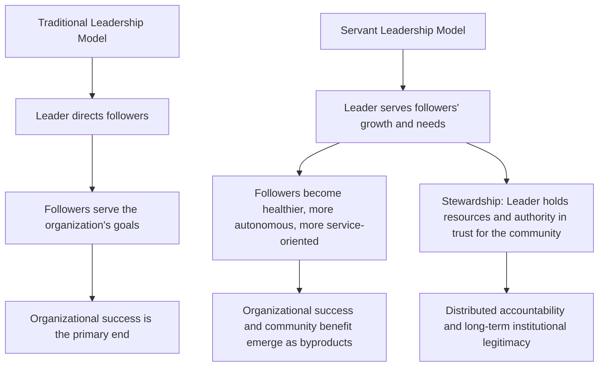

## Servant Leadership and Stewardship

### Overview

Servant Leadership represents a philosophical inversion of traditional leadership models. Rather than beginning with the question "how does a leader direct or influence followers to achieve organizational goals," it begins with the question **"how does a leader serve followers so that they, in turn, flourish and become more capable, autonomous, and service-oriented themselves?"** Leadership authority in this model is legitimized not by position or charisma, but by demonstrated commitment to others' growth and well-being. Stewardship extends this ethic to encompass responsible custodianship — of people, institutions, resources, and long-term outcomes — rather than ownership or control.

Both concepts sit apart from the trait, behavioral, and transactional/transformational traditions in that they are explicitly **normative and values-based**: they prescribe what leadership *ought* to look like ethically, rather than only describing what predicts performance outcomes.

### Origins: Robert Greenleaf's Servant Leadership

The term was coined by Robert K. Greenleaf in his 1970 essay *"The Servant as Leader."* Greenleaf, drawing partly on Hermann Hesse's novel *Journey to the East*, proposed that the "servant-leader" is servant *first* — the desire to serve precedes and motivates the aspiration to lead, rather than leadership being sought first and service being secondary or incidental.

**Greenleaf's Best Test**

Greenleaf proposed a practical test for evaluating servant leadership:

> Do those served grow as persons? Do they, while being served, become healthier, wiser, freer, more autonomous, more likely themselves to become servants? And what is the effect on the least privileged in society — will they benefit, or at least not be further deprived?

**Key Points**

- This test explicitly extends the ethical scope of leadership beyond the immediate organization to society's most vulnerable members — a distinguishing feature that separates servant leadership from purely performance-oriented models.
- Greenleaf's original formulation was philosophical and largely non-empirical; later scholars (notably Larry Spears and Robert Liden) operationalized it into measurable constructs.

### Ten Characteristics of the Servant Leader (Spears)

Larry Spears, building on Greenleaf's writings, distilled ten recurring characteristics:

1. **Listening** — deep, receptive listening to understand others' will and needs
2. **Empathy** — accepting and recognizing others' unique perspectives and feelings
3. **Healing** — helping followers overcome emotional hurt or personal struggles
4. **Awareness** — general and self-awareness that strengthens the leader's ethical grounding
5. **Persuasion** — relying on persuasion rather than positional authority to build consensus
6. **Conceptualization** — the ability to think beyond day-to-day operational realities toward long-term vision
7. **Foresight** — anticipating the likely outcomes of a situation before it happens
8. **Stewardship** — a commitment to serving the needs of others and holding resources in trust for the broader community
9. **Commitment to the Growth of People** — nurturing the personal and professional development of every individual, regardless of immediate organizational contribution
10. **Building Community** — fostering a sense of community among those who work within an institution

### Liden et al.'s Multidimensional Model

Robert Liden and colleagues (2008) developed one of the most widely used empirical measurement scales for servant leadership, identifying seven dimensions:

- **Emotional Healing**
- **Creating Value for the Community**
- **Conceptual Skills**
- **Empowering**
- **Helping Subordinates Grow and Succeed**
- **Putting Subordinates First**
- **Behaving Ethically**

**Key Points**

- This model enabled servant leadership to be studied with the same rigor (survey instruments, factor analysis, cross-validation) applied to transformational and transactional leadership, substantially increasing its empirical credibility in organizational research.
- [Inference] Meta-analytic reviews generally find servant leadership predicts follower well-being, organizational citizenship behavior, and trust outcomes at least as strongly as transformational leadership, and in some studies more strongly for follower-centered outcomes specifically — though findings vary across studies and cultural contexts, so this should be read as a well-supported but not universally uniform pattern.

### Servant Leadership vs. Transformational Leadership

These two models are the most frequently compared in the literature because both are values-based and follower-oriented, but they differ in primary orientation:

| Dimension | Servant Leadership | Transformational Leadership |
| --- | --- | --- |
| Primary Beneficiary | The follower and the broader community | The organization's mission/vision |
| Motivational Direction | Leader serves followers' growth first | Leader inspires followers toward organizational goals |
| Ethical Emphasis | Central and foundational | Present, but secondary to vision/performance |
| Risk of Misuse | Lower (follower welfare is the explicit end) | Higher (charisma can be used for self-serving or unethical ends — "pseudo-transformational" leadership) |
| View of Organizational Success | A byproduct of follower flourishing | A direct goal pursued through follower inspiration |

**Key Points**

- [Inference] A recognized critique of transformational leadership is its vulnerability to being used for manipulative or self-aggrandizing purposes (sometimes labeled "pseudo-transformational" leadership); servant leadership's explicit follower-first orientation is often cited as a structural safeguard against this risk, though this is a comparative theoretical argument rather than a strict empirical guarantee.

### Stewardship: The Broader Ethical Frame

Stewardship, as both a component of servant leadership (Spears's eighth characteristic) and a standalone leadership concept (notably developed by Peter Block in *Stewardship: Choosing Service Over Self-Interest*), reframes leadership as **holding power, resources, and authority in trust** for the benefit of a broader community rather than as personal possession.

#### Core Principles of Stewardship

- **Distributed accountability**: authority and decision-making are pushed outward and downward rather than concentrated at the top
- **Service over self-interest**: leaders act as custodians of institutional or communal assets, not owners entitled to extract maximum personal benefit
- **Long-term orientation**: decisions are evaluated by their impact on future stakeholders and institutional sustainability, not only immediate results
- **Partnership over patriarchy**: relationships between leaders and followers are reframed as more equal partnerships rather than parent-child or superior-subordinate dynamics

**Key Points**

- Stewardship is particularly emphasized in public administration, non-profit governance, and diplomatic institutions, where officials are understood to hold public trust and public resources on behalf of citizens rather than as personal assets.
- [Inference] Stewardship-oriented leadership is often associated in the literature with stronger institutional legitimacy and public trust over time, though isolating its causal effect from other governance factors (transparency laws, institutional design) is empirically difficult, so this connection is best treated as a strongly argued theoretical claim rather than a precisely measured one.

### Common Critiques

- **Potential conflict with organizational demands**: prioritizing individual follower growth can, in some contexts, appear to conflict with short-term performance pressures or hierarchical decision-making needs.
- **Cultural variability**: the servant leadership ideal — emphasizing humility and follower-first orientation — may be received differently across cultures with varying power-distance norms (per Hofstede's framework); its reception and effectiveness are not assumed to be culturally uniform.
- **Definitional breadth**: because servant leadership incorporates many overlapping constructs (empathy, ethics, empowerment, stewardship), some scholars argue it risks conceptual overlap with other leadership styles (authentic, ethical, transformational leadership), making clean construct differentiation an ongoing methodological challenge.
- **Scalability concerns**: the model's emphasis on deep individualized attention to followers can be harder to operationalize in very large or highly hierarchical organizations without dilution.

### Diagram: The Servant Leadership Orientation

### Applied Example (Diplomatic Context)

**Servant leadership example**: An ambassador who notices a junior consular officer struggling under the emotional weight of processing distressing humanitarian cases does not simply reassign the caseload, but takes time to listen to the officer's concerns (Listening, Empathy), connects them with peer support resources (Healing), and restructures their responsibilities to build long-term resilience and skill (Commitment to Growth) — rather than treating the officer purely as a means to mission throughput.

**Stewardship example**: A foreign ministry official managing a bilateral development aid program treats the allocated funds explicitly as a public trust rather than a discretionary budget to be spent for personal or institutional prestige — prioritizing transparent reporting, sustainable long-term outcomes for the recipient community, and succession planning so the program can continue effectively under a future administration.

**Conclusion**

Servant Leadership and Stewardship reframe the fundamental purpose of leadership from directing others toward organizational ends to serving others' growth and holding institutional power in trust for a broader community. While less focused on predicting narrow performance metrics than transactional or transformational models, these frameworks have gained substantial traction in public service, non-profit, and diplomatic contexts precisely because they foreground ethical legitimacy, long-term institutional trust, and follower flourishing as ends in themselves rather than instrumental means to organizational output.

**Related Topics / Next Steps**

- Authentic Leadership Theory
- Ethical Leadership and Moral Reasoning in Public Office
- Transformational Leadership and the Pseudo-Transformational Critique
- Hofstede's Cultural Dimensions and Leadership Style Reception
- Public Trust and Institutional Legitimacy in Diplomatic Service
- Empowerment and Distributed Decision-Making in Organizations
- Peter Block's Stewardship Framework in Public Administration
- Comparative Study: Servant Leadership Across High vs. Low Power-Distance Cultures