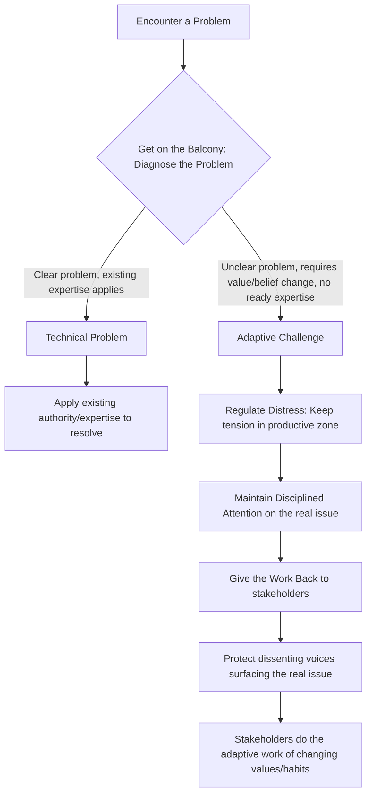

## Adaptive Leadership

### Overview

Adaptive Leadership, developed primarily by Ronald Heifetz (Harvard Kennedy School), beginning with his 1994 work *Leadership Without Easy Answers* and later expanded with Marty Linsky and Alexander Grashow in *The Practice of Adaptive Leadership*, represents a significant departure from prior leadership frameworks. Where Trait, Behavioral, Situational, and Transformational theories largely treat leadership as a **property of an individual** (a role, a position, a set of behaviors), Adaptive Leadership treats leadership as an **activity** — something anyone in a system can exercise, regardless of formal authority, in response to a specific category of problem: challenges for which no existing expertise or authority already holds the answer.

Its central organizing distinction — and the concept most essential to understanding the entire framework — is the difference between **technical problems** and **adaptive challenges**.

### Technical Problems vs. Adaptive Challenges

This distinction is the foundation of the entire model:

**Technical Problems**

- The problem definition is clear.
- Existing knowledge, expertise, or authority can solve it.
- Solutions can often be implemented by an expert or authority figure alone.
- Example: a diplomatic cable formatting error, a visa processing backlog solvable by adding staff, a known legal question with established precedent.

**Adaptive Challenges**

- The problem definition itself is unclear, contested, or evolving.
- No existing expertise or authority possesses a ready-made solution.
- Solving it requires **changes in people's values, beliefs, habits, or loyalties** — not just new information or technical fixes.
- The people with the problem are themselves part of the solution and must do the work of change; a leader cannot simply solve it "for" them.
- Example: reconciling a divided post-conflict society, shifting an organization's entrenched culture, negotiating a peace settlement where competing national identities and historical grievances are at stake.

**Key Points**

- Most real-world organizational and political problems are **mixes** of technical and adaptive elements — Heifetz's framework emphasizes correctly diagnosing *which parts* of a problem are technical versus adaptive, since treating an adaptive challenge as though it were merely technical is identified as the most common and costly leadership failure.
- [Inference] This misdiagnosis — applying technical/authoritative fixes to fundamentally adaptive problems — is frequently cited in the literature as a primary explanation for why many well-resourced policy interventions (institutional reforms, peace processes, organizational change initiatives) fail to produce lasting change, though attributing any single failure definitively to this cause in a specific case remains an interpretive judgment rather than a strict causal proof.

### Leadership vs. Authority

Heifetz draws a sharp distinction between **authority** (a formally or informally granted role that carries expectations of service in exchange for power, such as the ability to direct, protect, orient, and control conflict) and **leadership** (the activity of mobilizing people to tackle tough adaptive problems, which can be exercised with or without formal authority, and which often requires *disappointing* the expectations that authority carries).

**Key Points**

- Because adaptive work often requires challenging entrenched norms, values, or vested interests, exercising real leadership frequently means **disappointing people at a rate they can absorb** rather than fulfilling the comfortable expectation that an authority figure will simply "solve" the problem for them.
- This reframes leadership as available to anyone — a junior official, a mid-level diplomat, a civil society actor — who can mobilize others to face an adaptive challenge, independent of their formal rank.

### The "Balcony and the Dance Floor" Metaphor

Heifetz's most widely cited image describes the core diagnostic discipline required of adaptive leaders: the ability to move between two vantage points.

- **The Dance Floor**: being immersed in the immediate action — negotiations, meetings, day-to-day operational pressures — where it is difficult to see broader patterns because you are caught up in the interactions themselves.
- **The Balcony**: stepping back mentally (or literally) to observe the larger patterns — who holds power, whose interests are at stake, what factions are forming, what the real underlying conflict is — that are invisible from within the dance floor.

**Key Points**

- The discipline of "getting on the balcony" while still remaining able to act on the dance floor is presented as one of the most difficult and most essential adaptive leadership skills, since sustained immersion in operational activity tends to obscure systemic diagnosis.

### Six Core Principles / Practices of Adaptive Leadership

1. **Get on the Balcony** — regularly step back to observe patterns, power dynamics, and the true nature of the challenge (technical vs. adaptive).
2. **Identify the Adaptive Challenge** — correctly diagnose which parts of the problem require value/behavior change versus technical fixes.
3. **Regulate Distress** — adaptive work is inherently uncomfortable and anxiety-inducing; leaders must keep distress within a **"productive zone of disequilibrium"** — enough tension to motivate change, not so much that it triggers paralysis, panic, or work avoidance.
4. **Maintain Disciplined Attention** — keep people focused on the hard, adaptive issues rather than allowing displacement onto easier technical distractions or scapegoating.
5. **Give the Work Back to the People** — resist the pressure to "solve" adaptive problems unilaterally; instead, place responsibility for the work of change back onto the stakeholders who must live with and enact the resolution.
6. **Protect Voices of Leadership from Below** — safeguard dissenting or marginal voices that raise uncomfortable truths, since these voices often surface the real adaptive issue before it is broadly acknowledged.

**Key Points**

- The "productive zone of disequilibrium" concept is central and frequently misunderstood: the goal is not to eliminate distress (which would remove the motivation for change) nor to let it run unchecked (which risks system breakdown), but to actively manage its intensity and pacing.

### Comparative Positioning Against Other Leadership Theories

| Dimension | Adaptive Leadership | Transformational Leadership | Situational Leadership |
| --- | --- | --- | --- |
| Unit of analysis | An activity/process exercised by anyone in a system | A set of leader behaviors/qualities | A leader's behavior matched to follower readiness |
| Core problem addressed | Adaptive challenges requiring value/belief change | Follower motivation and vision alignment | Task-specific follower competence/commitment |
| Role of authority | Often exercised without formal authority; may require dissent from it | Typically exercised by a formally recognized leader | Typically exercised by a designated leader/manager |
| Leader's primary function | Diagnose, regulate distress, return work to stakeholders | Inspire, model, intellectually stimulate, individually mentor | Diagnose follower readiness, adjust directive/supportive mix |
| View of conflict/distress | A necessary and productive element to be regulated, not eliminated | Generally minimized through shared vision and trust | Generally minimized through appropriate style matching |

### Diagram: Diagnosing and Responding to a Challenge

### Applied Example (Diplomatic Context)

**Misdiagnosis (treating adaptive as technical)**: A peace negotiation team, facing a stalled ceasefire due to deep-seated mutual distrust and competing national narratives, attempts to resolve the impasse purely through a new technical mechanism — a revised monitoring protocol — without addressing the underlying adaptive challenge of trust and identity. The technical fix may be implemented smoothly, yet the ceasefire collapses again once tested, because the real (adaptive) problem was never engaged.

**Correct diagnosis and adaptive response**: A senior mediator instead "gets on the balcony" and recognizes the core issue is not procedural but a deep adaptive challenge involving competing narratives of victimhood and historical grievance on both sides. Rather than imposing a solution, the mediator structures facilitated dialogues that surface marginalized voices from both communities (protecting leadership from below), paces the process to keep distress productive rather than overwhelming (regulating disequilibrium — moving too fast risks walkouts, too slow risks stagnation), and insists that the substantive compromises be authored and owned by the parties themselves rather than dictated externally (giving the work back).

**Conclusion**

Adaptive Leadership reframes leadership away from a fixed set of personal traits or behaviors and toward a diagnostic, situational activity centered on distinguishing solvable technical problems from adaptive challenges that require stakeholders themselves to change values, beliefs, or habits. Its emphasis on regulating productive distress, protecting dissenting voices, and returning ownership of change to the people who must live with it makes it particularly well suited to complex, high-stakes, multi-stakeholder environments such as diplomacy, peacebuilding, and institutional reform — contexts where authority alone is rarely sufficient to resolve deeply contested problems.

**Related Topics / Next Steps**

- Ronald Heifetz's "Leadership Without Easy Answers" — Foundational Concepts
- Change Management Theory and Organizational Resistance
- Conflict Resolution and Track II Diplomacy
- Complexity Theory and Wicked Problems in Public Policy
- Distributed Leadership and Leadership Without Authority
- Emotional Intelligence in Managing Organizational Distress
- Peacebuilding Frameworks and Reconciliation Processes
- Comparing Adaptive Leadership with Complexity Leadership Theory