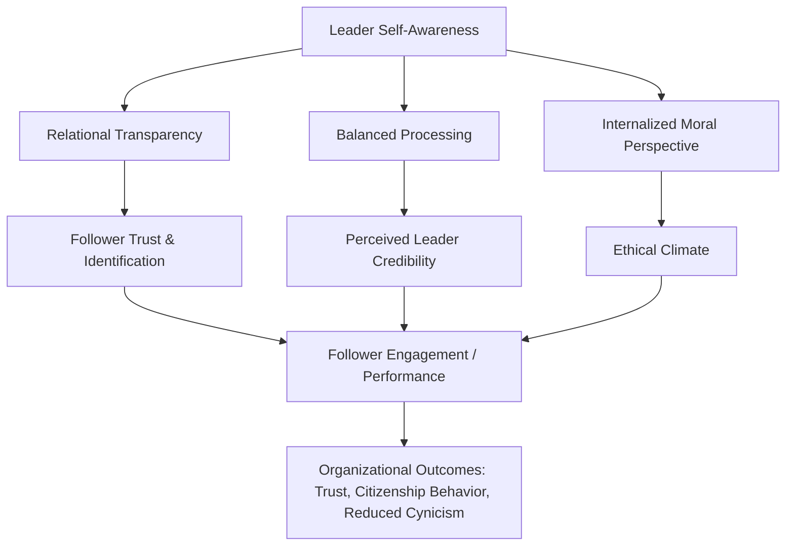

## Authentic Leadership

### Definition and Conceptual Origins

Authentic leadership is a leadership theory centered on the degree to which a leader's actions, values, and self-presentation align with their genuine internal sense of self. It emerged as a distinct academic construct in the early-to-mid 2000s, catalyzed partly by corporate scandals (Enron, WorldCom) that eroded trust in leadership and prompted scholars to ask what leadership grounded in genuine self-knowledge and moral conviction would look like, rather than leadership defined solely by charisma or transactional effectiveness.

Bill George's *Authentic Leadership* (2003), drawn from practitioner experience, and the subsequent academic formalization by Bruce Avolio, Fred Luthans, and William Gardner (2005), are the two foundational strands: George's work is more prescriptive/practitioner-oriented, while Avolio and colleagues developed the construct as a testable, multi-dimensional psychological model.

### Core Theoretical Model: The Four Components

The most widely cited operationalization (Walumbwa, Avolio, Gardner, Wernsing, & Peterson, 2008) defines authentic leadership as a higher-order construct composed of four dimensions, later measured via the Authentic Leadership Questionnaire (ALQ):

**Key Points**

1. **Self-awareness**: The extent to which a leader understands their own strengths, weaknesses, values, and the impact of their behavior on others; involves ongoing reflective insight rather than a static trait.
2. **Relational transparency**: Presenting one's authentic self to others rather than a fabricated or distorted image — openly sharing information, thoughts, and feelings appropriate to the context, including admitting mistakes.
3. **Balanced processing**: Objectively analyzing relevant data, including data that challenges one's own deeply held positions, before making a decision — resisting confirmation bias and defensive reasoning.
4. **Internalized moral perspective**: Self-regulation guided by internal moral standards and values rather than external pressures (peer, organizational, or societal), resulting in decisions and behavior consistent with those internalized values even under pressure.

$$\text{Authentic Leadership} = f(\text{Self-awareness}, \text{Relational Transparency}, \text{Balanced Processing}, \text{Internalized Moral Perspective})$$

### Theoretical Antecedents and Developmental Model

Avolio and Luthans' developmental framework treats authentic leadership as something that develops over a leader's life course rather than a fixed trait, shaped by:

**Key Points**

- **Life-course "trigger events"**: Positive or negative critical experiences (personal crises, moral tests, formative mentorship) that catalyze self-reflection and values clarification — often termed the leader's "authentic leadership development" trajectory.
- **Positive psychological capital (PsyCap)**: Confidence/self-efficacy, optimism, hope, and resilience are theorized as both antecedents to and outcomes of authentic leadership.
- **Moral reasoning capacity**: Higher levels of moral development (drawing on Kohlberg's stages of moral reasoning) are associated with stronger internalized moral perspective.
- **Organizational climate**: An inclusive, ethical organizational context is theorized to both cultivate and be reinforced by authentic leadership, creating a reciprocal "authentic followership" dynamic.

### Distinguishing Authentic Leadership from Adjacent Constructs

| Construct | Primary Emphasis | Key Difference from Authentic Leadership |
| --- | --- | --- |
| Transformational Leadership | Inspiring followers toward a shared vision, intellectual stimulation | Focuses on follower motivation/vision; authentic leadership is a necessary but not sufficient root construct underlying it |
| Servant Leadership | Prioritizing followers' growth and well-being above leader's own interests | Emphasis on other-orientation and service; authenticity emphasizes self-congruence, not necessarily service |
| Ethical Leadership | Modeling normatively appropriate conduct and promoting it via two-way communication and reinforcement | Focuses on moral conduct visible to followers; authentic leadership foregrounds internal self-consistency as the source |
| Charismatic Leadership | Leader's ability to project vision and inspire strong emotional identification | Can exist without authenticity (can be manipulative); authentic leadership requires genuine self-congruence |

[Inference] Because these constructs share theoretical DNA (all are part of the "positive leadership" or "neo-charismatic" paradigm that emerged partly in reaction to purely transactional models), empirical research has found substantial construct overlap and multicollinearity between authentic, transformational, and ethical leadership measures, which is an active methodological critique of the field.

### Measurement: The Authentic Leadership Questionnaire (ALQ)

**Key Points**

- 16-item, four-factor instrument (Walumbwa et al., 2008), rated typically on a 0–4 or 1–5 frequency scale, measuring the four dimensions above.
- Validated across multiple cultural contexts (US, China, Kenya) in the original validation studies, though [Inference] cross-cultural measurement invariance remains a subject of ongoing psychometric debate, particularly regarding whether "relational transparency" as operationalized reflects a Western individualist bias.
- An alternative instrument, the Authentic Leadership Inventory (ALI; Neider & Schriesheim, 2011), was developed partly in response to critiques of the ALQ's factor structure and proprietary licensing restrictions.

### Process Model: How Authentic Leadership Influences Outcomes

### Empirical Outcomes Associated with Authentic Leadership

**Key Points**

- **Follower trust and psychological capital**: Consistently among the most robust findings — authentic leadership is associated with increased follower trust in the leader and, via social learning/contagion, increased follower PsyCap.
- **Organizational citizenship behavior (OCB)**: Positive association with discretionary follower behaviors that benefit the organization beyond formal job requirements.
- **Work engagement**: Positive association, often mediated by psychological safety and identification with the leader.
- **Reduced cynicism and burnout**: Some studies link authentic leadership to lower follower emotional exhaustion, attributed to reduced ambiguity/hypocrisy stress.
- **Ethical voice and reduced unethical behavior**: Internalized moral perspective in leaders is associated with reduced follower unethical pro-organizational behavior.

[Inference] Most of these relationships are drawn from correlational, self-report survey designs; causal direction (does authentic leadership cause these outcomes, or do positive follower states cause followers to perceive leaders as more authentic) remains contested in the literature, and effect sizes vary considerably by study and industry context.

### Major Critiques

**Key Points**

- **Definitional circularity**: Critics (e.g., Alvesson & Einola) argue the construct risks tautology — "authentic" leadership is partly defined by positive outcomes, making it difficult to falsify (an ineffective leader who is nonetheless self-congruent may be excluded from the definition by construct drift).
- **The "true self" problem**: Philosophically, the assumption of a single, stable, discoverable "authentic self" is contested; postmodern and social-constructionist critiques argue identity is context-dependent and relationally co-constructed, undermining the premise that transparency reveals a fixed true self.
- **Ethical blind spot**: A leader can be highly self-aware, transparent, and internally consistent while holding and acting on values that are harmful or biased — authenticity to a flawed value system is not inherently virtuous. This has led some scholars to argue authentic leadership theory conflates *sincerity* with *morality*.
- **Overlap and redundancy critique**: As noted above, substantial empirical and conceptual overlap with transformational and ethical leadership raises questions about the construct's incremental validity.
- **Practical paradox of "performing authenticity"**: Leadership development programs that coach leaders to "be authentic" create an inherent contradiction — deliberately cultivated authenticity risks becoming a curated performance, undermining the very spontaneity/genuineness the construct valorizes.

### Application in Diplomatic and Foreign Policy Leadership Contexts

**Key Points**

- Diplomatic leadership often requires calibrated strategic ambiguity, confidentiality, and calculated positioning (e.g., withholding a negotiating position) — this creates inherent tension with the "relational transparency" dimension of authentic leadership, since full transparency can be strategically counterproductive or even a breach of statecraft norms.
- [Inference] Scholars applying authentic leadership theory to diplomacy generally reframe transparency as *internal consistency and honesty about values/intent within the bounds of professional discretion*, rather than full disclosure of tactical information — distinguishing authenticity from indiscretion.
- Balanced processing is arguably the dimension most directly transferable to diplomatic practice: resisting groupthink, actively soliciting dissenting intelligence assessments, and avoiding motivated reasoning under political pressure are core diplomatic and foreign-policy competencies.
- Internalized moral perspective maps onto debates around diplomats' and statespeople's personal value commitments versus raison d'état — tension between acting from internalized principle versus subordinating personal values to national interest or institutional mandate is a recurring theme in diplomatic ethics literature.
- Self-awareness is linked in practitioner literature to reduced susceptibility to manipulation in negotiation settings, since leaders with clear self-knowledge are theorized to be less reactive to ego-based provocations from counterparts.

### Development Approaches in Practice

**Key Points**

- **Reflective practice and journaling**: Structured reflection on formative "trigger events" and values clarification exercises, drawing on Avolio and Luthans' developmental model.
- **360-degree feedback**: Used to build self-awareness by closing the gap between self-perception and others' perception of one's leadership behavior.
- **Life-story/narrative leadership development**: George's approach emphasizes constructing a coherent leadership narrative from one's life history to clarify core values ("True North").
- **Mindfulness-based interventions**: Increasingly incorporated in leadership development programs on the theoretical basis that present-moment awareness supports balanced processing and reduces reactive, ego-driven decision-making.
- **Mentorship and psychologically safe feedback environments**: Theorized as necessary scaffolding for leaders to develop relational transparency without excessive personal or professional risk.

**Related Topics**

- Transformational Leadership Theory (Bass & Avolio)
- Servant Leadership and Other-Oriented Leadership Models
- Ethical Leadership and Moral Reasoning in Organizations
- Positive Organizational Scholarship and Psychological Capital (PsyCap)
- Leader-Member Exchange (LMX) Theory
- Self-Determination Theory as a Psychological Foundation for Authenticity
- Diplomatic Ethics and the Tension Between Discretion and Transparency
- Trust Repair and Crisis Leadership