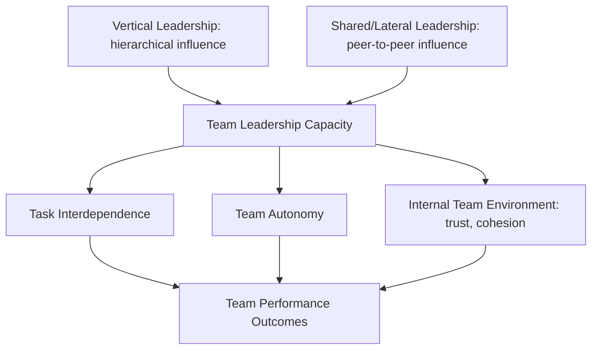

## Distributed and Shared Leadership

### Definition and Conceptual Placement

Distributed and shared leadership refers to a family of leadership theories that relocate the locus of leadership from a single, formally designated individual to a collective process enacted across multiple members of a group, team, or organization. Rather than treating leadership as a property held by a person occupying a hierarchical position, these frameworks treat leadership as a social process, function, or influence dynamic that can be exercised by different members at different times depending on task demands, expertise, and situational context.

The two terms are closely related but carry distinct disciplinary emphases:

**Key Points**

- **Shared leadership** originates primarily in organizational behavior and team dynamics research (Pearce & Conger, 2003), defined as a dynamic, interactive influence process among team members aimed at leading one another toward goal achievement, where the leadership role rotates or is co-enacted based on expertise and situational need rather than fixed hierarchy.
- **Distributed leadership** originates primarily in educational administration and organizational theory (Gronn, 2002; Spillane, 2006), emphasizing leadership as "stretched over" multiple actors, artifacts, and organizational routines — leadership practice is constituted through the interaction of leaders, followers, and situation, not merely aggregated from individual acts.

Both reject the "heroic leader" or "leader-centric" paradigm that dominated earlier trait, behavioral, and transformational leadership theories.

### Theoretical Lineage

**Key Points**

- **Role theory and functional leadership theory** (1950s–1960s): Early precursors arguing leadership functions (task-oriented and relationship-oriented) can be fulfilled by different group members, not necessarily a single appointed leader.
- **Social network theory**: Provides the methodological backbone for much empirical shared leadership research, conceptualizing leadership as a pattern of influence ties among team members measurable via social network analysis (density, centralization metrics).
- **Distributed cognition** (Hutchins, 1995): A cognitive science concept imported into distributed leadership theory, positing that cognitive/organizational tasks are accomplished through interaction between individuals and tools/artifacts rather than residing solely within one mind — Spillane's framework directly borrows this "stretched over people and artifacts" logic.
- **Complexity leadership theory** (Uhl-Bien, Marion, McKelvey, 2007): A related but distinct framework treating leadership as an emergent, adaptive property of complex organizational systems, reinforcing the shift away from single-actor models.

### Spillane's Distributed Leadership Framework (Educational Administration)

James Spillane's model, highly influential in school leadership research, specifies three interacting elements:

$$\text{Leadership Practice} = f(\text{Leaders}, \text{Followers}, \text{Situation})$$

**Key Points**

1. **Leaders**: Multiple individuals who take on leadership functions, formally or informally, often simultaneously.
2. **Followers**: Not passive recipients but co-constructors of leadership practice — their responses and interpretations shape what leadership "is" in a given interaction.
3. **Situation**: The organizational routines, tools, and structures (e.g., meeting protocols, curriculum materials, data systems) that mediate and enable leadership practice — leadership is partly constituted by these artifacts, not merely exercised through them.

Spillane distinguishes three patterns of distribution:

- **Collaborated distribution**: Multiple leaders work together in the same place/time on the same leadership task.
- **Collective distribution**: Leaders work separately but interdependently, such that their combined practice constitutes the leadership function.
- **Coordinated distribution**: Leadership tasks are performed in a deliberate sequence by different actors.

### Pearce and Conger's Shared Leadership Model (Organizational Behavior)

**Key Points**

- Defines shared leadership as leadership that can flow **laterally** (peer-to-peer influence) in addition to the traditional **vertical** (hierarchical, top-down) direction.
- Identifies antecedent conditions that promote shared leadership emergence: task interdependence, team autonomy, internal team environment (trust, cohesion, voice), external coaching, and shared purpose/social support within the team.
- Distinguishes shared leadership from **delegation**, which remains a vertical-leader-controlled distribution of authority; shared leadership implies genuine co-ownership of the leadership function, not merely the vertical leader assigning tasks.

### Distinguishing from Adjacent Constructs

| Construct | Core Distinction from Distributed/Shared Leadership |
| --- | --- |
| Delegation | Authority flows downward from a fixed leader; locus of control remains vertical |
| Self-managed teams | Focuses on structural autonomy/absence of a formal leader, not necessarily the dynamic co-enactment of leadership influence |
| Servant Leadership | Concerns an individual leader's orientation toward followers, not the structural distribution of the leadership function itself |
| Complexity Leadership Theory | Emphasizes emergent, adaptive system-level leadership dynamics, broader in scope than team-level shared leadership |
| Co-leadership | Typically refers to two formally designated co-leaders sharing a role, a narrower and more formalized case than shared/distributed leadership generally |

### Empirical Findings

**Key Points**

- Meta-analytic evidence (e.g., Wang, Waldman, & Zhang, 2014) generally finds shared leadership positively predicts team performance, often with a stronger effect size than vertical leadership alone, particularly in knowledge-intensive and creative tasks.
- Effects are moderated by **task complexity**: shared leadership shows stronger performance benefits in complex, interdependent tasks (e.g., R&D teams, top management teams) than in simple, routinized tasks where centralized coordination may be more efficient.
- In educational contexts, distributed leadership has been associated with improved school-level instructional improvement capacity, though causal evidence linking distributed leadership directly to student achievement outcomes remains comparatively weaker and more contested than its association with teacher motivation and organizational learning capacity.
- [Unverified] Some studies report a curvilinear relationship between the degree of leadership sharing and team performance, suggesting excessive diffusion of leadership without coordinating structures can reduce accountability and coherence — this finding is not uniformly replicated across the literature.

### Example: Shared Leadership in a Cross-Functional Product Team

**Example**

A software product team with a formally appointed product manager operating under a shared-leadership model:

- During technical architecture decisions, the senior engineer assumes de facto leadership, directing discussion and final technical call, with the product manager deferring.
- During roadmap prioritization against business constraints, the product manager resumes primary leadership influence.
- During a user research phase, the UX researcher leads framing of problem definition and decision criteria.
- The formal product manager retains ultimate accountability (vertical leadership persists structurally) but daily influence and direction-setting genuinely rotates based on domain expertise (lateral/shared leadership in practice) — illustrating Pearce and Conger's distinction between vertical and shared leadership operating concurrently rather than as mutually exclusive.

### Enabling Conditions and Organizational Design Levers

**Key Points**

- **Psychological safety**: Team members must feel safe asserting leadership influence without punitive consequence for challenging the formal hierarchy.
- **Role clarity balanced with flexibility**: Paradoxically, effective shared leadership often requires clear underlying role structures so that fluid leadership shifts do not produce coordination breakdowns.
- **Shared mental models / common purpose**: Distributed decision-making requires sufficient alignment on goals to prevent fragmentation.
- **Formal leader's facilitative orientation**: The nominal/vertical leader must actively create space for lateral influence (sometimes termed "leadership of leaders" or meta-leadership) rather than treating shared leadership as a threat to positional authority.
- **Organizational artifacts and routines**: Per Spillane's framework, tools such as shared dashboards, structured meeting protocols, and decision logs materially enable distribution by encoding leadership functions into the environment rather than solely in individuals.

### Critiques and Limitations

**Key Points**

- **Accountability diffusion**: Critics note that distributing leadership can obscure who is ultimately answerable for outcomes, particularly problematic in high-stakes or crisis contexts requiring rapid, unambiguous decision authority.
- **Power and equity blind spots**: Some scholars (e.g., critical management theorists) argue distributed leadership discourse can mask persistent underlying power asymmetries — formal hierarchy and resource control often remain concentrated even when day-to-day influence appears distributed, risking a rhetorical rather than substantive redistribution of power.
- **Measurement challenges**: Operationalizing "shared" leadership empirically (via social network density/centralization measures vs. aggregated individual leadership behavior scores) remains methodologically contested, producing inconsistent findings across studies using different measurement approaches.
- **Context-dependency**: [Inference] The performance benefits of shared/distributed leadership appear conditional on team composition (expertise diversity), task type, and organizational culture, meaning the model likely does not generalize as a universal prescription across all organizational settings, contrary to some advocacy-oriented practitioner literature.

### Relevance to Diplomatic Leadership Contexts

**Key Points**

- Multilateral diplomatic settings (treaty negotiation teams, international organization secretariats) frequently exhibit natural shared-leadership dynamics, where technical/legal expertise, political authority, and process facilitation roles are distributed across different delegation members rather than concentrated in a single head of delegation.
- Distributed leadership theory's emphasis on artifacts and routines maps onto diplomatic practice through instruments such as negotiating texts, procedural rules, and chairship rotation mechanisms, which materially structure how influence is distributed across parties and individuals within a negotiation.
- [Inference] The accountability-diffusion critique carries particular salience in diplomatic contexts, where formal authority to commit a state remains legally concentrated in accredited representatives even when substantive influence over negotiating positions is genuinely distributed across a broader policy team — creating a structural tension between distributed influence and singular formal accountability that diplomatic practitioners must navigate explicitly.

**Related Topics**

- Complexity Leadership Theory (Uhl-Bien, Marion, McKelvey)
- Transformational Leadership Theory (Bass & Avolio)
- Team Leadership and Shared Mental Models
- Social Network Analysis in Organizational Leadership Research
- Self-Managed and Autonomous Work Teams
- Organizational Learning and Distributed Cognition
- Multilateral Negotiation Team Dynamics and Delegation Structures