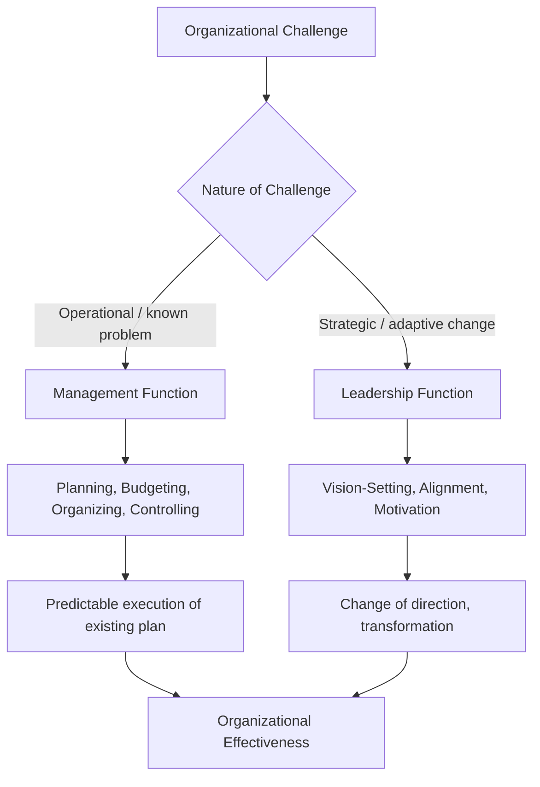

## Leadership Versus Management

### Definition and Conceptual Distinction

Leadership and management are related but analytically distinct organizational functions, frequently conflated in colloquial usage but treated in leadership studies as separable constructs with different core purposes, processes, and desired outcomes. The distinction does not imply that the two are mutually exclusive within a single individual — most effective senior practitioners exercise both — but rather that they represent different functional orientations that can be present in different proportions, and that overreliance on one without the other produces characteristic organizational pathologies.

The most influential formalization of this distinction comes from John Kotter's work (*A Force for Change*, 1990; *Leading Change*, 1996) and Warren Bennis's earlier aphoristic framing (*On Becoming a Leader*, 1989): "Managers are people who do things right, and leaders are people who do the right thing."

### Kotter's Core Distinction

**Key Points**

- **Management** is concerned with coping with **complexity**: producing order and consistency through planning, budgeting, organizing, staffing, controlling, and problem-solving, ensuring that an organization reliably delivers on existing commitments.
- **Leadership** is concerned with coping with **change**: setting direction, aligning people around a vision, and motivating/inspiring them to overcome obstacles, particularly in conditions of uncertainty or transformation.

$$\text{Management} \approx \text{Planning} + \text{Organizing} + \text{Controlling} \;\;\;\;\; \text{Leadership} \approx \text{Direction-Setting} + \text{Alignment} + \text{Motivation}$$

Kotter's argument is explicitly historical: he contends that as organizational environments became more complex and dynamic (20th-century industrialization followed by accelerating rates of technological and market change), the demand for leadership capacity grew relative to management capacity, but many organizations continued to over-produce managers while under-producing leaders.

### Functional Comparison Table

| Dimension | Management | Leadership |
| --- | --- | --- |
| Primary Orientation | Coping with complexity | Coping with change |
| Core Activities | Planning, budgeting, organizing, staffing, controlling, problem-solving | Setting direction, aligning people, motivating and inspiring |
| Desired Outcome | Predictability, order, consistent short-term results | Useful, often dramatic change (new products, new competitive positioning) |
| Relationship to Followers | Directs/controls people through position and formal systems | Aligns and inspires people through shared vision and values |
| Time Orientation | Shorter-term, operational | Longer-term, strategic/transformational |
| Source of Authority | Formal position, hierarchy | Can derive from personal influence, not necessarily formal position |
| Risk Orientation | Risk-averse, stability-preserving | Risk-tolerant, change-embracing |

### Bennis's Aphoristic Formulation

Warren Bennis offered a widely cited set of contrasts (paraphrased, not verbatim from the original text per citation constraints):

**Key Points**

- The manager administers; the leader innovates.
- The manager maintains; the leader develops.
- The manager relies on control; the leader inspires trust.
- The manager has a short-range view; the leader has a longer-range perspective.
- The manager asks how and when; the leader asks what and why.
- The manager accepts the status quo; the leader challenges it.
- The manager does things right; the leader does the right thing.

[Inference] These formulations are deliberately polarized for pedagogical clarity and are widely acknowledged in the literature as stylized ideal-types rather than empirically precise behavioral categories — real practitioners typically exhibit a blend of both orientations rather than falling cleanly into one category.

### Zaleznik's Earlier Psychological Distinction

Abraham Zaleznik's foundational 1977 Harvard Business Review article ("Managers and Leaders: Are They Different?") preceded and influenced Kotter's later framing, grounding the distinction in psychological orientation rather than organizational function:

**Key Points**

- **Managers** are argued to hold a process-oriented, problem-solving mindset, valuing stability, order, and the perpetuation of existing organizational arrangements — psychologically oriented toward maintaining equilibrium.
- **Leaders** are argued to tolerate, and often actively seek, chaos and lack of structure, exhibiting a more personal, sometimes solitary relationship to their work and a willingness to take risks where the payoff is high-risk/high-reward.
- Zaleznik's framing draws partly on psychoanalytic concepts of identity development, arguing leaders often emerge from a different developmental relationship to authority figures than managers — a claim [Inference] considered more speculative and less empirically tested than the functional (Kotter-style) distinction, and less commonly relied upon in contemporary organizational behavior research.

### Process Model: When Management and Leadership Combine

### Common Misconceptions Addressed in the Literature

**Key Points**

- **Misconception**: Leadership is inherently superior to management. Kotter and others explicitly reject this — both functions are necessary; an organization with excess leadership and insufficient management risks chaotic, unexecuted vision, while excess management with insufficient leadership risks stagnation and failure to adapt to environmental change.
- **Misconception**: Leadership requires formal authority/position. The literature broadly holds that leadership can be exercised without formal positional power (informal leaders, emergent leadership within teams), whereas management, as classically defined, is typically tied to a formal organizational role with delegated authority.
- **Misconception**: Managers cannot be leaders. Most contemporary treatments (e.g., Kotter's later work explicitly) argue the goal for senior practitioners is to develop competency in both functions, deploying each as situationally appropriate, rather than treating them as mutually exclusive personal identities.

### Example: Applying the Distinction in an Organizational Change Scenario

**Example**

A ministry undergoing digital transformation of its citizen services:

- **Management function**: Establishing the project budget and timeline, assigning staff to workstreams, setting up progress-tracking dashboards, ensuring procurement compliance, and resolving day-to-day implementation problems (server downtime, vendor delays).
- **Leadership function**: Articulating why the transformation matters (improved citizen trust, reduced corruption opportunities, modernization narrative), building coalition support among skeptical mid-level staff who fear job displacement, and personally modeling the behavior change expected of others (e.g., visibly adopting new digital workflows).
- A ministry head who only manages this initiative (perfect Gantt charts, on-budget delivery) but fails to build staff buy-in risks technically successful but practically unused systems. A ministry head who only leads (compelling vision, high energy) without competent management risks a transformation that inspires enthusiasm but collapses under poor execution, missed deadlines, and budget overruns.

### Empirical and Critical Perspectives

**Key Points**

- Some empirical organizational behavior research questions the sharpness of the leadership/management dichotomy, noting that many "managerial" activities (e.g., staffing decisions, resource allocation) inherently involve leadership-relevant interpersonal influence, and many "leadership" activities (e.g., vision communication) require managerial-style planning and follow-through to be effective — suggesting the two may be better conceptualized as intertwined competency clusters rather than cleanly separable roles.
- Henry Mintzberg, in critiques of both trait-based and overly romanticized leadership literature, has argued that effective organizational practice requires integrated "managing," resisting the strong leadership/management binary as potentially misleading for practitioners, since real managerial work is inherently relational, adaptive, and often crisis-driven rather than purely administrative.
- [Inference] The Kotter/Bennis/Zaleznik framing, while pedagogically durable and widely taught, is generally treated in contemporary scholarship as a useful heuristic for emphasizing underinvested change-oriented capabilities in traditionally administration-heavy organizations, rather than as a precise, empirically validated taxonomy of distinct behavioral types.

### Relevance to Diplomatic Leadership Contexts

**Key Points**

- Foreign ministries and diplomatic missions require both functions concurrently: management competencies govern embassy operations, budget administration, and routine consular/administrative service delivery, while leadership competencies govern strategic relationship-building, crisis response, and the articulation of foreign policy vision to both domestic and international audiences.
- Diplomatic crisis situations (e.g., evacuation operations, sudden geopolitical shifts) typically demand a rapid shift in emphasis toward the leadership function — direction-setting under uncertainty and motivating dispersed staff — even for officials whose day-to-day role is predominantly administrative/managerial.
- [Inference] Career diplomatic advancement structures, which often reward procedural and administrative competence (management-oriented skills) at early-to-mid career stages, may create a structural tension when officials are later expected to exercise strategic leadership at senior/ambassadorial levels without equivalent explicit developmental investment in leadership-specific capabilities, a gap noted in some diplomatic training literature.

**Related Topics**

- Trait Theory and Behavioral Theories of Leadership
- Transformational vs. Transactional Leadership (Bass)
- Change Management Models (Kotter's 8-Step Process, Lewin's Change Model)
- Mintzberg's Managerial Roles Framework
- Situational and Contingency Leadership Theories
- Crisis Leadership and Decision-Making Under Uncertainty
- Leadership Development in Diplomatic and Public Sector Institutions